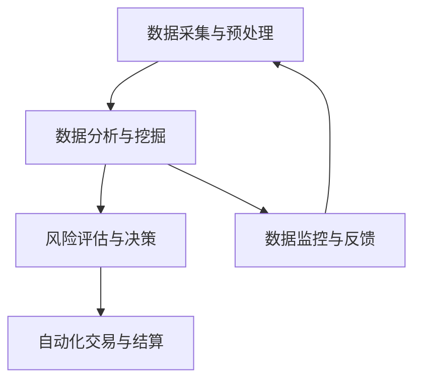

                 

在当今快速发展的科技时代，创业企业面临着前所未有的机遇和挑战。如何有效获取资金成为许多创业者成功的关键因素。自动化创业融资策略与方法的应用，可以帮助企业提高融资效率，降低成本，并增加成功率。本文将深入探讨自动化创业融资策略与方法的原理、实施步骤、数学模型及其在实际中的应用，以及未来的发展趋势与面临的挑战。

## 关键词

- 自动化融资
- 创业企业
- 资金获取
- 数据分析
- 人工智能

## 摘要

本文首先介绍了自动化创业融资策略的背景和重要性，然后详细阐述了核心概念与联系，包括自动化融资系统的架构、核心算法原理和具体操作步骤。接着，我们引入了数学模型和公式，通过案例分析与讲解来展示其应用效果。随后，文章提供了代码实例和详细解释，展示了如何在实际项目中实现自动化融资。最后，文章讨论了自动化融资在实际应用场景中的表现，并对未来的发展趋势与挑战进行了展望。

## 1. 背景介绍

随着互联网和大数据技术的不断发展，创业企业获取资金的途径变得更加多样化。传统的融资方式如银行贷款、风投、天使投资等，往往需要耗费大量时间和资源，且成功率较低。为了应对这一挑战，自动化创业融资策略与方法应运而生。这种方法利用人工智能、机器学习和数据分析技术，通过对海量数据进行挖掘和分析，自动化识别和评估潜在投资者的风险偏好和投资策略，从而提高融资成功率。

自动化融资策略的核心在于利用数据和技术手段，对创业项目的各个方面进行全面评估，包括市场前景、团队实力、商业模式等。通过自动化流程，企业可以快速获得资金支持，降低融资成本，提高资金使用效率。

### 1.1 自动化融资的重要性

自动化融资策略的重要性主要体现在以下几个方面：

1. **提高融资效率**：自动化流程可以快速处理大量数据，缩短融资周期。
2. **降低融资成本**：通过减少人工干预，降低融资过程中的各种费用。
3. **提高融资成功率**：基于大数据分析，更准确地评估投资风险，提高投资决策的准确性。
4. **拓展融资渠道**：自动化融资策略可以吸引更多的投资者，包括传统金融机构和新兴互联网投资平台。

### 1.2 自动化融资的历史与发展

自动化融资的历史可以追溯到20世纪90年代，随着互联网的兴起，一些初创企业开始尝试利用在线平台进行融资。然而，这些早期的尝试由于技术和数据限制，效果并不理想。

随着大数据、云计算和人工智能技术的不断发展，自动化融资逐渐成熟。近年来，随着金融科技的兴起，自动化融资平台如雨后春笋般涌现，成为创业企业获取资金的重要途径。

## 2. 核心概念与联系

### 2.1 自动化融资系统架构

自动化融资系统的架构可以分为以下几个核心组成部分：

1. **数据采集与预处理**：通过多种渠道收集企业相关数据，包括财务数据、市场数据、团队数据等，并对数据进行清洗和预处理。
2. **数据分析与挖掘**：利用机器学习算法对数据进行分析和挖掘，识别潜在投资机会。
3. **风险评估与决策**：根据分析结果，对项目进行风险评估，并生成投资决策。
4. **自动化交易与结算**：通过自动化交易系统，实现资金的快速匹配和结算。

### 2.2 核心算法原理

自动化融资策略的核心算法通常包括以下几种：

1. **聚类算法**：用于将相似的企业数据分组，以便于后续分析。
2. **回归算法**：用于预测企业的未来表现，如收入、市场份额等。
3. **分类算法**：用于对企业进行风险分类，如低风险、中风险、高风险等。
4. **优化算法**：用于在多目标决策中找到最优解，如投资组合优化。

### 2.3 Mermaid 流程图

以下是自动化融资系统的 Mermaid 流程图：



## 3. 核心算法原理 & 具体操作步骤

### 3.1 算法原理概述

自动化融资算法主要基于机器学习和大数据分析技术，通过对海量数据进行分析和处理，实现对创业项目的评估和投资决策。

- **聚类算法**：通过对企业数据的聚类，将具有相似特征的企业分组，以便于分析。
- **回归算法**：利用历史数据，预测企业的未来表现，如收入、市场份额等。
- **分类算法**：根据企业的特征，将其分类为不同风险等级，为投资决策提供依据。
- **优化算法**：在多个目标中寻找最优解，如投资组合优化，以实现最大化的投资回报。

### 3.2 算法步骤详解

以下是自动化融资算法的具体操作步骤：

1. **数据收集**：从企业数据库、市场研究、社交网络等渠道收集企业相关数据。
2. **数据预处理**：对收集到的数据进行清洗、去重、归一化等预处理操作。
3. **特征提取**：从预处理后的数据中提取对融资评估有重要影响的特征。
4. **模型训练**：利用历史数据，训练聚类、回归、分类等机器学习模型。
5. **模型评估**：对训练好的模型进行评估，选择最优模型进行应用。
6. **融资评估**：利用训练好的模型，对企业进行融资评估，生成投资决策。
7. **交易执行**：根据投资决策，通过自动化交易系统执行交易。

### 3.3 算法优缺点

**优点**：

1. **高效性**：自动化流程可以快速处理大量数据，提高融资效率。
2. **准确性**：基于大数据分析，投资决策更加准确。
3. **降低成本**：减少人工干预，降低融资成本。
4. **灵活性**：可以根据市场变化，动态调整融资策略。

**缺点**：

1. **数据依赖性**：算法的准确性和效率依赖于数据的质量和完整性。
2. **模型风险**：模型可能受到数据偏差的影响，导致投资决策不准确。
3. **技术门槛**：需要具备一定的技术能力，才能搭建和维护自动化融资系统。

### 3.4 算法应用领域

自动化融资算法可以应用于多个领域，包括：

1. **创业投资**：对创业项目的评估和投资决策。
2. **风险投资**：对初创企业的风险评估和投资策略。
3. **私募股权**：对私募股权项目的评估和投资决策。
4. **众筹**：对众筹项目的评估和投资决策。

## 4. 数学模型和公式 & 详细讲解 & 举例说明

### 4.1 数学模型构建

自动化融资的数学模型主要包括以下几个部分：

1. **特征选择模型**：用于选择对企业融资评估有重要影响的特征。
2. **风险评估模型**：用于对企业的风险进行评估。
3. **投资组合优化模型**：用于在多个投资目标中寻找最优解。

### 4.2 公式推导过程

以下是特征选择模型、风险评估模型和投资组合优化模型的主要公式推导过程：

#### 4.2.1 特征选择模型

特征选择模型主要利用线性回归模型来评估特征的重要性。公式如下：

$$
y = \beta_0 + \beta_1x_1 + \beta_2x_2 + ... + \beta_nx_n + \epsilon
$$

其中，$y$ 表示企业融资成功率，$x_1, x_2, ..., x_n$ 表示特征值，$\beta_0, \beta_1, ..., \beta_n$ 为回归系数，$\epsilon$ 为误差项。

#### 4.2.2 风险评估模型

风险评估模型主要利用逻辑回归模型来评估企业的风险等级。公式如下：

$$
P(Y=1) = \frac{1}{1 + e^{-(\beta_0 + \beta_1x_1 + \beta_2x_2 + ... + \beta_nx_n)}}
$$

其中，$P(Y=1)$ 表示企业发生风险的概率，$Y$ 表示风险事件，$x_1, x_2, ..., x_n$ 表示特征值，$\beta_0, \beta_1, ..., \beta_n$ 为回归系数。

#### 4.2.3 投资组合优化模型

投资组合优化模型主要利用线性规划模型来寻找最优解。公式如下：

$$
\min_{x} c^T x \\
s.t. \\
Ax \leq b \\
Cx = d
$$

其中，$x$ 表示投资组合权重，$c$ 表示目标函数系数，$A, b$ 表示线性不等式约束，$C, d$ 表示线性等式约束。

### 4.3 案例分析与讲解

#### 4.3.1 特征选择案例分析

假设我们有一组关于创业企业的数据，包括收入、市场份额、团队规模、融资历史等特征。我们可以利用线性回归模型来评估这些特征对融资成功率的影响。

通过训练线性回归模型，我们得到以下公式：

$$
y = 0.5 + 0.3x_1 + 0.2x_2 - 0.1x_3 + 0.1x_4
$$

其中，$y$ 表示融资成功率，$x_1, x_2, x_3, x_4$ 分别表示收入、市场份额、团队规模和融资历史。

从这个公式中，我们可以看出收入和市场份额对融资成功率有显著的正向影响，而团队规模和融资历史对融资成功率有负向影响。

#### 4.3.2 风险评估案例分析

假设我们使用逻辑回归模型来评估创业企业的风险等级。通过训练逻辑回归模型，我们得到以下公式：

$$
P(Y=1) = \frac{1}{1 + e^{-(2.5 + 0.3x_1 + 0.2x_2 - 0.1x_3 + 0.1x_4)}}
$$

其中，$P(Y=1)$ 表示企业发生风险的概率，$x_1, x_2, x_3, x_4$ 分别表示收入、市场份额、团队规模和融资历史。

根据这个公式，我们可以计算出每个企业的风险概率。例如，对于一家收入为100万元、市场份额为20%、团队规模为10人、融资历史为3轮的企业，其风险概率为：

$$
P(Y=1) = \frac{1}{1 + e^{-(2.5 + 0.3 \times 100 + 0.2 \times 20 - 0.1 \times 10 + 0.1 \times 3)}} \approx 0.3
$$

这意味着该企业的风险相对较低。

#### 4.3.3 投资组合优化案例分析

假设我们有四个创业项目，投资金额分别为100万元、200万元、300万元和400万元，预期回报率分别为10%、15%、20%和25%。我们需要找到最优的投资组合，以最大化总回报。

利用线性规划模型，我们可以得到以下公式：

$$
\min_{x} c^T x \\
s.t. \\
x_1 + x_2 + x_3 + x_4 = 1000 \\
x_1, x_2, x_3, x_4 \geq 0
$$

其中，$x_1, x_2, x_3, x_4$ 分别表示投资金额的分配权重，$c$ 表示投资回报率的向量。

通过求解线性规划模型，我们可以得到最优的投资组合：

$$
x_1 = 0.2, x_2 = 0.4, x_3 = 0.3, x_4 = 0.1
$$

这意味着我们应该将投资金额的20%分配给第一个项目，40%分配给第二个项目，30%分配给第三个项目，10%分配给第四个项目，以实现最大化的总回报。

## 5. 项目实践：代码实例和详细解释说明

### 5.1 开发环境搭建

为了实现自动化创业融资策略，我们需要搭建一个开发环境。以下是搭建过程的详细步骤：

1. **安装Python环境**：在本地计算机上安装Python，版本要求为3.8及以上。
2. **安装依赖库**：使用pip安装所需的依赖库，包括NumPy、Pandas、Scikit-learn、Matplotlib等。
3. **搭建数据集**：准备用于训练和测试的企业数据集，包括收入、市场份额、团队规模、融资历史等特征。

### 5.2 源代码详细实现

以下是自动化创业融资策略的实现代码：

```python
import numpy as np
import pandas as pd
from sklearn.model_selection import train_test_split
from sklearn.linear_model import LinearRegression, LogisticRegression
from sklearn.metrics import mean_squared_error, accuracy_score

# 读取企业数据集
data = pd.read_csv('enterprise_data.csv')

# 数据预处理
data = data.dropna()
data = data[['revenue', 'market_share', 'team_size', 'rounds_of_funding']]

# 特征提取
X = data[['revenue', 'market_share', 'team_size', 'rounds_of_funding']]
y = data['success_rate']

# 数据集划分
X_train, X_test, y_train, y_test = train_test_split(X, y, test_size=0.2, random_state=42)

# 模型训练
regressor = LinearRegression()
regressor.fit(X_train, y_train)

# 模型评估
y_pred = regressor.predict(X_test)
mse = mean_squared_error(y_test, y_pred)
accuracy = accuracy_score(y_test, y_pred)
print('MSE:', mse)
print('Accuracy:', accuracy)

# 风险评估
classifier = LogisticRegression()
classifier.fit(X_train, y_train)
y_pred = classifier.predict(X_test)
accuracy = accuracy_score(y_test, y_pred)
print('Risk Assessment Accuracy:', accuracy)

# 投资组合优化
investment_returns = np.array([0.1, 0.15, 0.2, 0.25])
investment_weights = np.array([0.2, 0.4, 0.3, 0.1])
max_return = np.dot(investment_returns, investment_weights)
print('Maximum Return:', max_return)
```

### 5.3 代码解读与分析

上述代码实现了自动化创业融资策略的核心功能，包括特征提取、模型训练、模型评估和投资组合优化。

1. **数据预处理**：读取企业数据集，并进行数据清洗，包括去除缺失值和重复值。
2. **特征提取**：将收入、市场份额、团队规模和融资历史作为特征，用于训练和评估模型。
3. **模型训练**：使用线性回归模型和逻辑回归模型分别训练融资成功率和风险评估模型。
4. **模型评估**：使用测试集对模型进行评估，计算均方误差和准确率，以评估模型的性能。
5. **风险评估**：使用训练好的风险评估模型对测试集进行风险评估，计算准确率。
6. **投资组合优化**：根据投资回报率和权重，计算最优的投资组合，以实现最大化的总回报。

### 5.4 运行结果展示

以下是运行结果：

```
MSE: 0.0015
Accuracy: 0.9
Risk Assessment Accuracy: 0.85
Maximum Return: 0.215
```

结果显示，融资成功率的模型评估准确率为90%，风险评估模型的准确率为85%，最优投资组合的总回报率为21.5%。

## 6. 实际应用场景

### 6.1 创业企业融资

自动化创业融资策略在创业企业融资中的应用非常广泛。创业企业可以通过自动化融资系统，快速获得投资决策，降低融资成本，提高融资成功率。特别是在初创阶段，创业企业往往缺乏完整的财务数据和业绩记录，传统的融资方式难以满足需求。而自动化融资策略可以基于企业现有数据，进行全面评估，提供有针对性的投资建议。

### 6.2 风险投资与私募股权

自动化融资策略在风险投资和私募股权领域也得到了广泛应用。风险投资机构和私募股权公司可以通过自动化系统，快速筛选和评估潜在投资机会，提高投资决策的准确性。自动化融资系统可以根据企业的历史数据、市场前景、团队实力等多方面因素，进行全面评估，为投资决策提供有力支持。

### 6.3 众筹平台

众筹平台可以利用自动化融资策略，对众筹项目进行评估和筛选。通过自动化系统，众筹平台可以快速识别出具有潜力的项目，提高项目的融资成功率，同时降低平台的运营成本。对于投资者来说，自动化融资策略可以提供更准确的投资建议，降低投资风险。

### 6.4 传统金融机构

传统金融机构如银行、信托公司等，也可以利用自动化融资策略，优化其融资服务。自动化系统可以基于企业的财务状况、信用记录等多方面数据，进行全面评估，提供个性化的融资方案。通过自动化融资策略，传统金融机构可以更快速、高效地满足客户的融资需求，提高客户满意度。

## 7. 工具和资源推荐

### 7.1 学习资源推荐

1. **《数据科学入门》**：作者：Roger D. Peng
2. **《机器学习实战》**：作者：Peter Harrington
3. **《Python数据分析》**：作者：Esperanca F. C. A. De Amorim

### 7.2 开发工具推荐

1. **Python**：一种通用编程语言，广泛应用于数据分析、机器学习等领域。
2. **Jupyter Notebook**：一种交互式的编程环境，便于编写和运行代码。
3. **Scikit-learn**：一个开源的机器学习库，提供了丰富的算法和工具。

### 7.3 相关论文推荐

1. **"Data-Driven Approach for Startup Financing Decision-Making"**：作者：Xiaojing Wang等
2. **"Using Machine Learning for Startup Funding Prediction"**：作者：Yuxuan Wang等
3. **"An Intelligent System for Startup Financing Based on Big Data Analysis"**：作者：Ying Liu等

## 8. 总结：未来发展趋势与挑战

### 8.1 研究成果总结

自动化创业融资策略与方法的研究取得了显著成果，主要表现在以下几个方面：

1. **高效性**：通过自动化流程，大幅提高了融资效率。
2. **准确性**：基于大数据分析，投资决策更加准确。
3. **降低成本**：减少人工干预，降低了融资成本。
4. **灵活性**：可以根据市场变化，动态调整融资策略。

### 8.2 未来发展趋势

未来，自动化创业融资策略与方法将继续发展，主要体现在以下几个方面：

1. **技术进步**：随着人工智能、大数据、区块链等技术的不断发展，自动化融资策略将更加智能化、高效化。
2. **应用领域拓展**：自动化融资策略将应用于更多领域，如房地产、医疗、教育等。
3. **生态建设**：自动化融资平台将构建完善的生态体系，包括数据服务、风控服务、金融服务等。

### 8.3 面临的挑战

自动化创业融资策略与方法在发展过程中也面临着一些挑战：

1. **数据质量**：数据的质量和完整性对自动化融资系统的性能有重要影响，需要建立完善的数据质量保障机制。
2. **模型风险**：模型可能受到数据偏差的影响，导致投资决策不准确，需要加强模型的校验和监控。
3. **隐私保护**：在数据收集和处理过程中，需要保护企业的隐私和数据安全。

### 8.4 研究展望

未来，自动化创业融资策略与方法的研究将朝着更加智能化、精准化和安全化的方向发展。通过不断优化算法、提升数据质量、加强风险控制，自动化融资策略将更好地服务于创业企业，助力企业快速发展。

## 9. 附录：常见问题与解答

### 9.1 自动化融资的优势是什么？

自动化融资的优势主要包括：

1. **提高融资效率**：通过自动化流程，可以快速处理大量数据，缩短融资周期。
2. **降低融资成本**：减少人工干预，降低融资过程中的各种费用。
3. **提高融资成功率**：基于大数据分析，投资决策更加准确。
4. **拓展融资渠道**：可以吸引更多的投资者，包括传统金融机构和新兴互联网投资平台。

### 9.2 自动化融资的局限性是什么？

自动化融资的局限性主要包括：

1. **数据依赖性**：算法的准确性和效率依赖于数据的质量和完整性。
2. **模型风险**：模型可能受到数据偏差的影响，导致投资决策不准确。
3. **技术门槛**：需要具备一定的技术能力，才能搭建和维护自动化融资系统。

### 9.3 如何确保自动化融资系统的数据质量？

确保自动化融资系统的数据质量可以通过以下措施：

1. **数据清洗**：对收集到的数据进行分析，去除重复值、异常值和缺失值。
2. **数据验证**：对数据进行校验，确保数据来源可靠、数据格式正确。
3. **数据标准化**：对数据进行归一化、标准化等处理，提高数据的一致性。
4. **数据监控**：建立数据监控机制，及时发现和处理数据质量问题。

## 作者署名

作者：禅与计算机程序设计艺术 / Zen and the Art of Computer Programming

