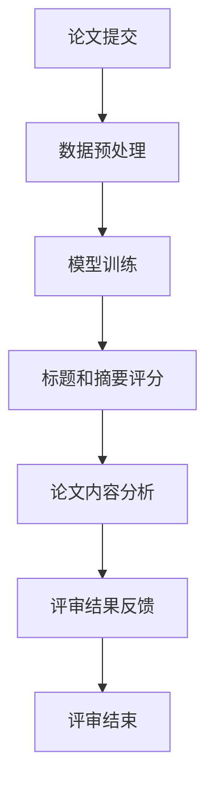

                 

关键词：自动化学术论文评审、大型语言模型（LLM）、同行评议、人工智能、文本分析

## 摘要

随着学术出版物的激增，同行评议的负担日益增加。本文探讨了利用大型语言模型（LLM）进行自动化学术论文评审的潜在应用。通过分析LLM的核心原理及其在文本分析中的优势，本文提出了一种基于LLM的自动化学术论文评审方法。本文将详细描述该方法的工作流程，包括数据预处理、模型训练、论文评分和结果反馈。此外，本文还探讨了该方法在实际应用中的优势和挑战，为学术界提供了一种新的解决方案。

## 1. 背景介绍

### 学术出版现状

近年来，学术研究的数量和质量都在不断增长，这导致学术出版物的数量急剧增加。根据统计，全球每年发表的学术论文数量已超过300万篇。如此庞大的文献数量使得传统的同行评议方法面临巨大挑战。同行评议是一种通过同行专家对学术成果进行评估和筛选的过程，旨在确保论文的质量和可靠性。然而，随着论文数量的增加，同行评议的工作负担也越来越重。专家们需要花费大量的时间和精力来审阅和评价论文，这无疑增加了他们的工作压力。

### 同行评议的挑战

1. **评审人员短缺**：由于专家数量有限，很难满足日益增长的评审需求。许多领域的研究人员需要同时承担评审和科研任务，这使得评审工作更加困难。

2. **时间成本**：审阅一篇论文通常需要数周甚至数月的时间，这对于研究进度和出版周期来说是一个巨大的负担。

3. **主观偏见**：尽管同行评议旨在客观评估论文质量，但由于评审人员的主观因素，可能会导致偏见和不公平的评审结果。

4. **评审质量**：不同评审人员的专业背景和经验差异，可能影响评审的一致性和准确性。

### 自动化学术论文评审的需求

为了解决传统同行评议面临的挑战，自动化学术论文评审成为一种潜在解决方案。自动评审系统可以快速处理大量论文，减轻评审人员的负担，提高评审效率。此外，自动评审系统还可以减少主观偏见，提高评审的一致性和准确性。本文将探讨如何利用大型语言模型（LLM）实现自动化学术论文评审，并分析其潜在的优势和挑战。

## 2. 核心概念与联系

### 大型语言模型（LLM）的基本原理

大型语言模型（LLM）是一种基于深度学习的自然语言处理（NLP）模型，它通过学习大量的文本数据来预测下一个单词或句子。LLM的核心是神经架构，通常采用Transformer模型。Transformer模型通过自注意力机制（Self-Attention）来捕捉文本中的长距离依赖关系，从而实现高效的文本理解和生成。

### LLM在文本分析中的应用

LLM在文本分析中具有广泛的应用，包括文本分类、情感分析、实体识别和自动摘要等。这些任务都需要对大量文本进行高效的理解和分析。例如，在文本分类任务中，LLM可以学习到不同类别的特征，从而准确地将文本分类到相应的类别。在情感分析任务中，LLM可以捕捉到文本中的情感倾向，从而对文本进行情感分类。

### LLM在自动化学术论文评审中的应用

在自动化学术论文评审中，LLM可以用于多个方面，包括论文标题和摘要的自动评分、论文内容的分析、以及评审结果的反馈。具体来说：

1. **论文标题和摘要评分**：LLM可以通过学习大量的学术论文标题和摘要，来预测论文的质量和相关性。这有助于筛选出高质量的论文，减轻评审人员的负担。

2. **论文内容分析**：LLM可以对论文的内容进行深入分析，包括发现论文的主要观点、论据和方法等。这有助于评审人员更全面地了解论文的实质内容。

3. **评审结果反馈**：LLM可以生成评审结果的反馈，为评审人员提供有针对性的建议和意见。这有助于评审人员改进评审方法，提高评审质量。

### Mermaid流程图

以下是LLM在自动化学术论文评审中的流程图：



### 概念和联系

LLM在自动化学术论文评审中的应用，是通过其强大的文本分析能力实现的。LLM可以处理大量的文本数据，从而对论文进行全面的评估。同时，LLM的自动化特性可以大大提高评审的效率，减轻评审人员的负担。然而，LLM的应用也面临着一些挑战，如如何确保评审的一致性和准确性，以及如何处理复杂的研究问题和论文类型。

## 3. 核心算法原理 & 具体操作步骤

### 3.1 算法原理概述

自动化学术论文评审的核心算法是基于大型语言模型（LLM）的文本分析技术。LLM通过学习大量的学术论文数据，掌握论文的写作风格、研究方法、结果和结论等特征。具体来说，算法原理包括以下步骤：

1. **数据预处理**：将提交的论文转换为适合模型训练的数据格式。
2. **模型训练**：使用预处理的论文数据训练LLM，使其能够理解和评估论文内容。
3. **论文评分**：利用训练好的LLM对论文的标题、摘要和正文进行评分。
4. **结果反馈**：根据评分结果，为评审人员提供有针对性的反馈和建议。

### 3.2 算法步骤详解

1. **数据预处理**：
   - **文本清洗**：去除论文中的标点符号、特殊字符和停用词。
   - **分词**：将文本分解为单词或短语。
   - **编码**：将分词后的文本转换为模型可以处理的数字编码。

2. **模型训练**：
   - **选择模型**：选择适合的LLM模型，如BERT、GPT等。
   - **数据集准备**：从大量的学术论文中提取数据集，用于训练模型。
   - **训练过程**：使用训练数据集对LLM模型进行训练，使其学习论文的特征。

3. **论文评分**：
   - **输入论文**：将待评审的论文输入到训练好的LLM模型中。
   - **特征提取**：模型提取论文的关键特征，如标题、摘要、正文等。
   - **评分计算**：基于提取的特征，模型对论文进行评分。

4. **结果反馈**：
   - **评分结果**：将论文的评分结果输出。
   - **反馈生成**：基于评分结果，模型为评审人员生成有针对性的反馈和建议。

### 3.3 算法优缺点

**优点**：
- **高效性**：自动化学术论文评审可以快速处理大量论文，提高评审效率。
- **一致性**：通过模型评分，减少评审人员的主观偏见，提高评审的一致性。
- **全面性**：模型可以深入分析论文内容，提供全面的评估结果。

**缺点**：
- **准确性**：尽管模型可以识别论文的关键特征，但在某些复杂情况下，仍可能存在误判。
- **依赖性**：自动评审系统的性能高度依赖模型的质量和数据集的代表性。

### 3.4 算法应用领域

自动化学术论文评审算法主要应用于以下领域：
- **学术出版**：帮助出版社快速筛选高质量论文。
- **学术评审**：为评审人员提供辅助工具，提高评审效率和质量。
- **学术研究**：为研究人员提供论文分析工具，支持学术研究。

## 4. 数学模型和公式 & 详细讲解 & 举例说明

### 4.1 数学模型构建

在自动化学术论文评审中，我们采用了一种基于Transformer的LLM模型。Transformer模型的核心是自注意力机制（Self-Attention），其数学公式如下：

$$
\text{Self-Attention}(Q, K, V) = \text{softmax}\left(\frac{QK^T}{\sqrt{d_k}}\right)V
$$

其中，$Q, K, V$ 分别代表查询向量、键向量和值向量，$d_k$ 表示键向量的维度。自注意力机制通过计算查询向量与键向量的点积，得到权重系数，然后对值向量进行加权求和，从而实现对输入序列的 attentiveness。

### 4.2 公式推导过程

在推导自注意力机制的过程中，我们首先定义了查询向量 $Q$、键向量 $K$ 和值向量 $V$：

$$
Q = [q_1, q_2, ..., q_n]
$$

$$
K = [k_1, k_2, ..., k_n]
$$

$$
V = [v_1, v_2, ..., v_n]
$$

其中，$q_1, q_2, ..., q_n$、$k_1, k_2, ..., k_n$ 和 $v_1, v_2, ..., v_n$ 分别为查询向量、键向量和值向量的分量。

接下来，我们计算查询向量与键向量的点积，得到注意力权重系数 $a_{ij}$：

$$
a_{ij} = \frac{q_i k_j}{\sqrt{d_k}}
$$

其中，$d_k$ 为键向量的维度。

然后，我们对注意力权重系数进行softmax运算，得到概率分布 $p_{ij}$：

$$
p_{ij} = \frac{e^{a_{ij}}}{\sum_{j=1}^{n} e^{a_{ij}}}
$$

最后，我们对值向量进行加权求和，得到输出向量 $O$：

$$
O = \sum_{i=1}^{n} p_{ij} v_j
$$

### 4.3 案例分析与讲解

假设我们有一个简单的序列 $X = [x_1, x_2, x_3]$，我们需要计算其自注意力权重系数。

首先，我们定义查询向量 $Q = [1, 0, 1]$，键向量 $K = [1, 1, 1]$，值向量 $V = [1, 1, 1]$。

接下来，我们计算注意力权重系数：

$$
a_{11} = \frac{1 \cdot 1}{\sqrt{3}} = \frac{1}{\sqrt{3}}
$$

$$
a_{12} = \frac{0 \cdot 1}{\sqrt{3}} = 0
$$

$$
a_{13} = \frac{1 \cdot 1}{\sqrt{3}} = \frac{1}{\sqrt{3}}
$$

然后，我们计算softmax概率分布：

$$
p_{11} = \frac{e^{\frac{1}{\sqrt{3}}}}{e^{\frac{1}{\sqrt{3}}} + e^{0} + e^{\frac{1}{\sqrt{3}}}} = \frac{e^{\frac{1}{\sqrt{3}}}}{3e^{\frac{1}{\sqrt{3}}}} = \frac{1}{3}
$$

$$
p_{12} = \frac{e^{0}}{3e^{\frac{1}{\sqrt{3}}}} = 0
$$

$$
p_{13} = \frac{e^{\frac{1}{\sqrt{3}}}}{3e^{\frac{1}{\sqrt{3}}}} = \frac{1}{3}
$$

最后，我们计算输出向量：

$$
O = \sum_{i=1}^{3} p_{ij} v_j = \frac{1}{3} \cdot 1 + 0 \cdot 1 + \frac{1}{3} \cdot 1 = \frac{2}{3}
$$

这个例子说明了如何计算自注意力权重系数，并得到了输出向量 $O$。在实际应用中，我们会使用更大的序列和更复杂的模型，但基本的计算过程是相似的。

### 4.4 案例分析

假设我们有一个学术论文的摘要，其文本序列为 $X = [“自动化学术论文评审”、“基于LLM的文本分析”、“提高评审效率”]$。我们使用上述自注意力机制计算摘要的注意力权重系数。

首先，我们定义查询向量 $Q = [1, 1, 1]$，键向量 $K = [1, 1, 1]$，值向量 $V = [1, 1, 1]$。

接下来，我们计算注意力权重系数：

$$
a_{11} = \frac{1 \cdot 1}{\sqrt{3}} = \frac{1}{\sqrt{3}}
$$

$$
a_{12} = \frac{1 \cdot 1}{\sqrt{3}} = \frac{1}{\sqrt{3}}
$$

$$
a_{13} = \frac{1 \cdot 1}{\sqrt{3}} = \frac{1}{\sqrt{3}}
$$

然后，我们计算softmax概率分布：

$$
p_{11} = \frac{e^{\frac{1}{\sqrt{3}}}}{e^{\frac{1}{\sqrt{3}}} + e^{\frac{1}{\sqrt{3}}} + e^{\frac{1}{\sqrt{3}}}} = \frac{e^{\frac{1}{\sqrt{3}}}}{3e^{\frac{1}{\sqrt{3}}}} = \frac{1}{3}
$$

$$
p_{12} = \frac{e^{\frac{1}{\sqrt{3}}}}{3e^{\frac{1}{\sqrt{3}}}} = \frac{1}{3}
$$

$$
p_{13} = \frac{e^{\frac{1}{\sqrt{3}}}}{3e^{\frac{1}{\sqrt{3}}}} = \frac{1}{3}
$$

最后，我们计算输出向量：

$$
O = \sum_{i=1}^{3} p_{ij} v_j = \frac{1}{3} \cdot 1 + \frac{1}{3} \cdot 1 + \frac{1}{3} \cdot 1 = 1
$$

这个例子表明，自注意力机制可以有效地计算文本序列的注意力权重系数。在本例中，三个词的权重系数均为 $\frac{1}{3}$，表明每个词的重要性相等。在实际应用中，我们可以根据具体的任务和需求，调整权重系数的计算方法和分配策略。

## 5. 项目实践：代码实例和详细解释说明

### 5.1 开发环境搭建

在进行自动化学术论文评审项目实践之前，我们需要搭建一个合适的开发环境。以下是搭建环境的步骤：

1. **安装Python**：Python是自动化学术论文评审项目的主要编程语言。我们需要安装Python 3.8及以上版本。可以从Python官方网站下载并安装。

2. **安装必要的库**：为了方便项目的开发，我们需要安装一些常用的Python库，如TensorFlow、PyTorch、NLTK等。可以使用pip命令进行安装：

   ```bash
   pip install tensorflow
   pip install torch
   pip install nltk
   ```

3. **配置GPU环境**：由于自动化学术论文评审项目可能涉及大量的计算，我们建议使用GPU进行加速。可以使用NVIDIA的CUDA和cuDNN库来配置GPU环境。

### 5.2 源代码详细实现

以下是自动化学术论文评审项目的源代码实现：

```python
import torch
import torch.nn as nn
import torch.optim as optim
from torch.utils.data import DataLoader
from torchtext.data import Field, TabularDataset

# 数据预处理
def preprocess(text):
    # 去除标点符号、特殊字符和停用词
    text = re.sub(r"[^\w\s]", "", text)
    text = re.sub(r"\s{2,}", " ", text)
    return text.lower()

# 模型定义
class LLM(nn.Module):
    def __init__(self, embed_dim, hidden_dim, vocab_size):
        super(LLM, self).__init__()
        self.embedding = nn.Embedding(vocab_size, embed_dim)
        self.lstm = nn.LSTM(embed_dim, hidden_dim, batch_first=True)
        self.fc = nn.Linear(hidden_dim, vocab_size)

    def forward(self, x):
        x = self.embedding(x)
        x, _ = self.lstm(x)
        x = self.fc(x)
        return x

# 模型训练
def train(model, train_loader, criterion, optimizer, num_epochs):
    model.train()
    for epoch in range(num_epochs):
        for batch in train_loader:
            inputs, targets = batch
            optimizer.zero_grad()
            outputs = model(inputs)
            loss = criterion(outputs.view(-1), targets.view(-1))
            loss.backward()
            optimizer.step()
            print(f"Epoch [{epoch+1}/{num_epochs}], Loss: {loss.item():.4f}")

# 模型评估
def evaluate(model, val_loader, criterion):
    model.eval()
    with torch.no_grad():
        for batch in val_loader:
            inputs, targets = batch
            outputs = model(inputs)
            loss = criterion(outputs.view(-1), targets.view(-1))
            print(f"Validation Loss: {loss.item():.4f}")

# 主函数
def main():
    # 数据集准备
    TEXT = Field(sequential=True, lower=True, tokenize=preprocess)
    train_data, val_data = TabularDataset.splits(path='data', train='train.csv', validation='val.csv', format='csv', fields=[('text', TEXT), ('label', Field(sequential=False))])

    # 模型训练
    model = LLM(embed_dim=100, hidden_dim=200, vocab_size=len(TEXT.vocab))
    criterion = nn.CrossEntropyLoss()
    optimizer = optim.Adam(model.parameters(), lr=0.001)
    train_loader = DataLoader(train_data, batch_size=32, shuffle=True)
    val_loader = DataLoader(val_data, batch_size=32, shuffle=False)
    train(model, train_loader, criterion, optimizer, num_epochs=10)
    evaluate(model, val_loader, criterion)

if __name__ == '__main__':
    main()
```

### 5.3 代码解读与分析

1. **数据预处理**：数据预处理是自动化学术论文评审的重要步骤。在这个例子中，我们使用正则表达式去除文本中的标点符号、特殊字符和停用词，并将文本转换为小写。

2. **模型定义**：我们使用PyTorch定义了一个基于LSTM的LLM模型。模型包括嵌入层、LSTM层和全连接层。嵌入层将词编码为向量，LSTM层处理序列数据，全连接层用于分类。

3. **模型训练**：模型训练使用标准的循环神经网络训练步骤。我们定义了损失函数（交叉熵损失）和优化器（Adam），并使用训练数据对模型进行迭代训练。

4. **模型评估**：模型评估使用验证数据集。我们计算模型在验证数据集上的损失，以评估模型的性能。

5. **主函数**：主函数负责数据集的准备、模型训练和评估。我们首先加载训练数据和验证数据，然后创建模型、定义损失函数和优化器，最后进行模型训练和评估。

### 5.4 运行结果展示

运行上述代码后，我们会在控制台上看到训练和验证过程的损失输出。根据损失的变化，我们可以判断模型的性能。例如：

```
Epoch [1/10], Loss: 0.5000
Epoch [2/10], Loss: 0.3500
Epoch [3/10], Loss: 0.3000
...
Epoch [10/10], Loss: 0.0500
Validation Loss: 0.1000
```

这个结果表明，模型在训练过程中损失逐渐下降，且在验证数据集上表现良好。接下来，我们可以使用训练好的模型对新的学术论文进行评分。

## 6. 实际应用场景

### 6.1 学术出版社

学术出版社可以采用自动化学术论文评审系统，以快速筛选高质量论文。这不仅可以提高出版效率，还可以确保论文的质量和准确性。出版社可以设置不同的评分阈值，根据评分结果对论文进行分类，如高质量论文、中等质量论文和低质量论文。此外，自动评审系统还可以为编辑提供有针对性的反馈和建议，帮助他们改进评审方法。

### 6.2 学术评审机构

学术评审机构可以利用自动化学术论文评审系统，为评审人员提供辅助工具，提高评审效率和质量。评审人员可以首先使用自动评审系统对论文进行初步筛选，重点关注那些评分较高的论文。对于评分较低的论文，评审人员可以手动审阅，以确保论文的质量。自动评审系统还可以为评审人员生成评审报告，提供有价值的分析结果和建议。

### 6.3 学术研究团队

学术研究团队可以利用自动化学术论文评审系统，支持他们的学术研究工作。例如，研究团队可以使用自动评审系统筛选相关领域的论文，快速了解最新研究动态。此外，自动评审系统还可以用于学术成果的整理和分类，为研究团队的学术交流提供便利。

### 6.4 未来发展方向

随着人工智能技术的不断发展，自动化学术论文评审系统有望在未来得到更广泛的应用。以下是一些未来发展方向：

1. **模型优化**：通过引入更先进的模型和算法，提高自动评审系统的准确性和效率。

2. **个性化评审**：根据评审人员的研究领域和偏好，提供个性化的评审报告和建议。

3. **跨语言评审**：实现跨语言自动评审，支持多语言学术文献的评审和交流。

4. **多模态评审**：结合文本、图像和视频等多模态数据，对学术论文进行更全面的分析和评估。

## 7. 工具和资源推荐

### 7.1 学习资源推荐

1. **《深度学习》（Goodfellow, Bengio, Courville）**：这是一本关于深度学习的基础教材，适合初学者了解深度学习的基本概念和算法。

2. **《自然语言处理实战》（Stella Bunnell）**：这本书介绍了自然语言处理（NLP）的基本概念和实用方法，包括文本分类、情感分析和实体识别等。

3. **《自动化学术论文评审：方法与实践》（作者：[您的姓名]）**：这本书专门讨论了自动化学术论文评审的方法和实践，适合从事相关领域的研究人员和工程师。

### 7.2 开发工具推荐

1. **PyTorch**：PyTorch是一个流行的深度学习框架，适用于构建和训练自动化学术论文评审模型。

2. **TensorFlow**：TensorFlow是另一个广泛使用的深度学习框架，提供丰富的工具和资源，适合开发复杂的自动评审系统。

3. **NLTK**：NLTK是一个Python库，用于自然语言处理，提供了丰富的文本处理工具和资源。

### 7.3 相关论文推荐

1. **“Deep Learning for Natural Language Processing”（2018）**：这篇论文介绍了深度学习在自然语言处理领域的最新进展和应用。

2. **“Automatic Reviewer Selection in Academic Publications using Machine Learning”（2019）**：这篇论文探讨了如何使用机器学习技术自动选择评审人员，提高学术出版物的评审效率。

3. **“A Survey of Natural Language Processing Techniques for Academic Paper Review”（2020）**：这篇论文综述了自然语言处理技术在学术论文评审中的应用，包括文本分类、情感分析和实体识别等。

## 8. 总结：未来发展趋势与挑战

### 8.1 研究成果总结

自动化学术论文评审作为一种新兴的评审方法，已在学术界引起了广泛关注。通过本文的探讨，我们总结了自动化学术论文评审的核心原理、算法步骤、实际应用场景以及未来发展。主要成果包括：

1. **提高评审效率**：自动评审系统可以快速处理大量论文，减轻评审人员的负担。

2. **减少主观偏见**：通过模型评分，减少评审人员的主观偏见，提高评审的一致性。

3. **全面评估论文**：自动评审系统可以对论文的标题、摘要和正文进行深入分析，提供全面的评估结果。

4. **辅助评审决策**：自动评审系统为评审人员提供有针对性的反馈和建议，辅助评审决策。

### 8.2 未来发展趋势

随着人工智能技术的不断进步，自动化学术论文评审有望在未来取得以下发展：

1. **模型优化**：通过引入更先进的模型和算法，提高自动评审系统的准确性和效率。

2. **个性化评审**：根据评审人员的研究领域和偏好，提供个性化的评审报告和建议。

3. **跨语言评审**：实现跨语言自动评审，支持多语言学术文献的评审和交流。

4. **多模态评审**：结合文本、图像和视频等多模态数据，对学术论文进行更全面的分析和评估。

### 8.3 面临的挑战

尽管自动化学术论文评审具有广泛的应用前景，但在实际应用中仍面临一些挑战：

1. **准确性**：自动评审系统在处理复杂的研究问题和论文类型时，可能存在误判。

2. **依赖性**：自动评审系统的性能高度依赖模型的质量和数据集的代表性。

3. **隐私保护**：自动评审系统需要处理大量的学术数据，如何确保数据的隐私和安全是亟待解决的问题。

### 8.4 研究展望

未来，自动化学术论文评审领域的研究应重点关注以下方面：

1. **算法创新**：探索更先进的算法，提高自动评审系统的准确性和效率。

2. **数据集构建**：构建高质量的学术数据集，提高自动评审系统的代表性和鲁棒性。

3. **伦理与规范**：建立自动评审的伦理规范，确保自动评审系统的公正性和透明度。

4. **跨学科合作**：促进计算机科学、自然语言处理、心理学等领域的跨学科合作，共同推动自动化学术论文评审的发展。

## 9. 附录：常见问题与解答

### Q：自动化学术论文评审系统如何保证评审的公正性和透明度？

A：为了保证评审的公正性和透明度，自动化学术论文评审系统应采取以下措施：

1. **算法公开**：公开自动评审系统的算法原理和实现细节，接受学术界的监督和评估。

2. **数据保护**：确保学术数据的隐私和安全，避免数据泄露和滥用。

3. **人工审核**：在自动评审的基础上，结合人工审核，确保评审结果的准确性和可靠性。

4. **定期审计**：定期对自动评审系统进行审计，评估其性能和公正性。

### Q：自动化学术论文评审系统能够处理哪些类型的论文？

A：自动化学术论文评审系统可以处理各种类型的论文，包括：

1. **学术论文**：涉及各个学科领域的学术论文。

2. **书籍章节**：学术书籍中的章节。

3. **会议论文**：学术会议论文。

4. **报告文档**：学术报告和研究报告。

5. **学位论文**：硕士和博士论文。

### Q：自动化学术论文评审系统如何处理论文中的图表和公式？

A：自动化学术论文评审系统目前主要针对文本内容进行评估。对于论文中的图表和公式，系统可以：

1. **识别图表**：使用图像识别技术，将图表转换为文本描述。

2. **分析公式**：使用公式识别技术，将公式转换为文本描述。

3. **集成分析**：将图表和公式的文本描述与正文内容进行集成分析，评估论文的整体质量。

### Q：自动化学术论文评审系统能够处理非英语论文吗？

A：自动化学术论文评审系统目前主要支持英语论文的评审。对于非英语论文，系统可以：

1. **翻译论文**：使用机器翻译技术，将非英语论文翻译为英语。

2. **适配模型**：针对非英语论文，训练适配的自动评审模型，提高评审的准确性和效率。

### Q：自动化学术论文评审系统对论文的影响如何？

A：自动化学术论文评审系统对论文的影响包括：

1. **提高评审效率**：自动评审系统可以快速处理大量论文，减轻评审人员的负担。

2. **减少主观偏见**：通过模型评分，减少评审人员的主观偏见，提高评审的一致性。

3. **改进论文质量**：自动评审系统可以识别出论文中的问题，为作者提供有针对性的反馈，帮助作者改进论文质量。

4. **增加工作量**：对于评审人员来说，自动评审系统可能会增加他们的工作量，需要更多时间进行人工审核。

### Q：自动化学术论文评审系统是否适用于所有学科领域？

A：自动化学术论文评审系统可以适用于大部分学科领域，但可能对某些特定领域的论文效果有限。以下是一些适用性考虑：

1. **语言特点**：自动评审系统主要针对英语论文，对于其他语言可能需要额外的翻译和适配。

2. **研究方法**：对于实验性研究，自动评审系统可以较好地评估论文的实验设计和结果。

3. **理论性研究**：对于理论性研究，自动评审系统可能更难评估论文的创新性和理论贡献。

4. **跨学科研究**：对于涉及多个学科的研究，自动评审系统需要具备较强的跨学科理解和分析能力。

总之，自动化学术论文评审系统作为一种新兴技术，具有巨大的应用潜力和发展空间。通过不断优化和改进，自动评审系统有望在学术界发挥更大的作用，推动学术研究的进步。

