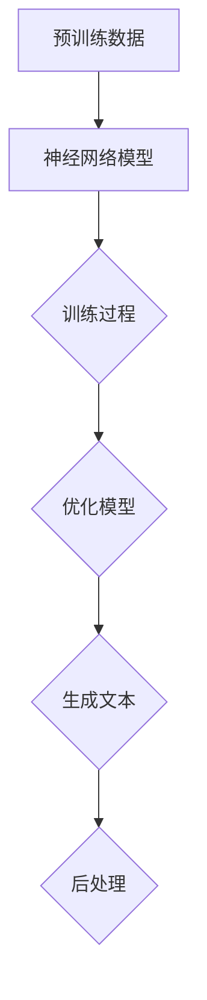
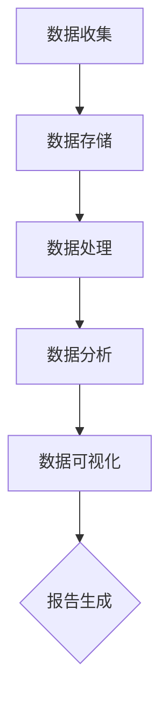
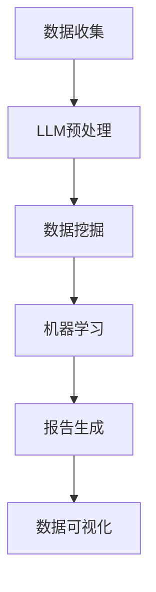

                 

关键词：商业智能，自动报告生成，语言模型，LLM，人工智能，数据可视化，数据挖掘，机器学习，编程

> 摘要：本文将深入探讨语言模型（LLM）在商业智能领域的应用，特别是自动化报告生成技术。通过分析LLM的核心概念、算法原理、数学模型、实际应用案例和未来趋势，本文旨在为读者提供对这一前沿技术的全面理解，并探讨其在商业决策和数据分析中的潜在价值。

## 1. 背景介绍

在当今数据驱动的社会中，商业智能（BI）已经成为企业成功的关键因素。商业智能涉及使用技术来收集、整合、分析和展示数据，从而帮助组织做出更好的业务决策。传统的商业智能解决方案通常依赖于复杂的报表工具和手工处理数据，这不仅效率低下，而且容易出错。随着人工智能（AI）和自然语言处理（NLP）技术的发展，自动化报告生成成为可能，尤其是在引入大型语言模型（LLM）之后。

LLM是一种能够在多种语言和情境下生成高质量文本的强大AI模型。常见的LLM包括GPT-3、BERT和T5等，它们通过学习海量文本数据，能够生成结构化或半结构化的报告内容，大大提高了数据分析和报告生成的效率。本文将探讨LLM在商业智能中的具体应用，包括自动化报告生成、数据可视化、数据挖掘和机器学习等方面。

## 2. 核心概念与联系

### 2.1 语言模型（LLM）

语言模型是一种能够理解和生成自然语言文本的AI模型。LLM是语言模型的扩展，能够处理复杂的、上下文丰富的语言任务。LLM的核心在于其大规模的预训练和强大的语言生成能力。


#### Mermaid 流程图（核心概念和架构）



### 2.2 商业智能

商业智能是指通过技术手段对企业的数据进行分析、整合和展示，从而提供业务洞察和支持决策。它通常包括数据收集、数据存储、数据处理、数据分析和数据可视化等多个环节。


#### Mermaid 流程图（商业智能架构）



### 2.3 LLM与商业智能的联系

LLM在商业智能中的应用主要体现在以下几个方面：

- **自动化报告生成**：利用LLM生成结构化报告，减少手工处理时间。
- **数据可视化**：通过LLM生成可交互的图表和可视化内容，提高数据理解能力。
- **数据挖掘**：利用LLM进行文本数据的预处理和特征提取，为数据挖掘提供支持。
- **机器学习**：在机器学习模型训练过程中，利用LLM生成数据描述和假设。

#### Mermaid 流程图（LLM与商业智能应用）



## 3. 核心算法原理 & 具体操作步骤

### 3.1 算法原理概述

LLM的工作原理基于深度学习和神经网络，特别是Transformer架构。Transformer通过自注意力机制（Self-Attention）捕捉输入文本中的长距离依赖关系，从而生成高质量的文本。以下是LLM的主要原理：

- **编码器（Encoder）**：处理输入文本，生成编码表示。
- **解码器（Decoder）**：根据编码表示生成输出文本。


### 3.2 算法步骤详解

#### 步骤1：数据预处理

1. 数据清洗：去除无关数据、缺失值填充、异常值处理等。
2. 数据整合：将不同数据源的数据整合到一个统一格式。

#### 步骤2：预训练

1. 使用大规模文本数据训练编码器和解码器。
2. 通过反向传播和梯度下降优化模型参数。

#### 步骤3：微调

1. 将预训练模型在特定任务上进行微调。
2. 根据任务需求调整模型结构和参数。

#### 步骤4：报告生成

1. 输入数据到编码器，生成编码表示。
2. 输出编码表示到解码器，生成报告文本。
3. 对生成的报告文本进行后处理，如格式调整、语法检查等。

### 3.3 算法优缺点

#### 优点：

- **强大的文本生成能力**：能够生成高质量、结构化的报告内容。
- **高效性**：自动化处理数据，节省人力和时间成本。
- **灵活性**：可以根据不同任务和需求调整模型结构和参数。

#### 缺点：

- **训练成本高**：需要大量计算资源和时间进行预训练和微调。
- **数据质量依赖性**：依赖高质量的数据集进行训练和微调。
- **解释性不强**：生成的报告内容可能缺乏透明度和可解释性。

### 3.4 算法应用领域

LLM在商业智能领域的应用包括：

- **自动化报告生成**：生成财务报告、销售报告、市场分析报告等。
- **数据可视化**：生成图表、图形和可视化内容，帮助用户更好地理解数据。
- **数据挖掘**：预处理文本数据，为数据挖掘提供支持。
- **机器学习**：生成数据描述和假设，辅助机器学习模型训练。

## 4. 数学模型和公式 & 详细讲解 & 举例说明

### 4.1 数学模型构建

LLM的训练和生成过程涉及多个数学模型，包括神经网络、自注意力机制和损失函数等。以下是LLM的主要数学模型：

#### 4.1.1 Transformer模型

Transformer模型是一种基于自注意力机制的神经网络模型，用于处理序列数据。其基本结构包括编码器和解码器。

- **编码器**：将输入序列编码为固定长度的向量。
- **解码器**：根据编码器生成的向量生成输出序列。

#### 4.1.2 自注意力机制

自注意力机制是一种用于计算序列中每个元素对其他元素的影响的机制。其基本公式如下：

$$
\text{Attention}(Q, K, V) = \text{softmax}\left(\frac{QK^T}{\sqrt{d_k}}\right)V
$$

其中，$Q$、$K$和$V$分别是查询向量、关键向量和价值向量，$d_k$是关键向量的维度。

#### 4.1.3 损失函数

LLM的训练通常使用交叉熵损失函数：

$$
\text{Loss} = -\sum_{i} y_i \log(p_i)
$$

其中，$y_i$是真实标签，$p_i$是模型预测的概率。

### 4.2 公式推导过程

以Transformer模型为例，我们简要介绍自注意力机制的推导过程。

1. **输入序列表示**：

   输入序列 $X = [x_1, x_2, \ldots, x_n]$ 被编码为 $n$ 个向量 $[e_1, e_2, \ldots, e_n]$。

2. **查询向量、关键向量和价值向量**：

   对于每个位置 $i$，生成查询向量 $Q_i = [q_1, q_2, \ldots, q_n]$、关键向量 $K_i = [k_1, k_2, \ldots, k_n]$ 和价值向量 $V_i = [v_1, v_2, \ldots, v_n]$。

3. **计算自注意力得分**：

   对于每个位置 $i$，计算其他位置 $j$ 对位置 $i$ 的影响：

   $$  
   \text{Score}_{ij} = Q_i K_j^T / \sqrt{d_k}  
   $$

4. **计算自注意力权重**：

   对得分进行归一化，得到自注意力权重：

   $$  
   \text{Weight}_{ij} = \text{softmax}(\text{Score}_{ij})  
   $$

5. **计算自注意力输出**：

   根据自注意力权重，计算位置 $i$ 的自注意力输出：

   $$  
   \text{Output}_{i} = \sum_{j} \text{Weight}_{ij} V_j  
   $$

### 4.3 案例分析与讲解

假设我们有一个简化的例子，输入序列为 $X = [1, 2, 3, 4, 5]$。我们希望计算位置 $2$ 对其他位置的影响。

1. **输入序列表示**：

   将输入序列编码为向量：

   $$  
   e_1 = [1, 0, 0], e_2 = [0, 1, 0], e_3 = [0, 0, 1], e_4 = [0, 0, 0], e_5 = [0, 0, 0]  
   $$

2. **查询向量、关键向量和价值向量**：

   对于位置 $2$，生成查询向量、关键向量和价值向量：

   $$  
   Q_2 = [q_1, q_2, q_3] = [1, 1, 1]  
   K_2 = [k_1, k_2, k_3] = [1, 2, 3]  
   V_2 = [v_1, v_2, v_3] = [1, 2, 3]  
   $$

3. **计算自注意力得分**：

   计算位置 $2$ 对其他位置的影响得分：

   $$  
   \text{Score}_{12} = \frac{Q_2 K_1^T}{\sqrt{d_k}} = \frac{1 \cdot 1}{\sqrt{3}} = \frac{1}{\sqrt{3}}  
   \text{Score}_{22} = \frac{Q_2 K_2^T}{\sqrt{d_k}} = \frac{1 \cdot 2}{\sqrt{3}} = \frac{2}{\sqrt{3}}  
   \text{Score}_{32} = \frac{Q_2 K_3^T}{\sqrt{d_k}} = \frac{1 \cdot 3}{\sqrt{3}} = 1  
   $$

4. **计算自注意力权重**：

   对得分进行归一化，得到自注意力权重：

   $$  
   \text{Weight}_{12} = \frac{1}{\sqrt{3}}, \text{Weight}_{22} = \frac{2}{3\sqrt{3}}, \text{Weight}_{32} = \frac{1}{\sqrt{3}}  
   $$

5. **计算自注意力输出**：

   根据自注意力权重，计算位置 $2$ 的自注意力输出：

   $$  
   \text{Output}_2 = \sum_{j} \text{Weight}_{ij} V_j = \frac{1}{\sqrt{3}} \cdot 1 + \frac{2}{3\sqrt{3}} \cdot 2 + \frac{1}{\sqrt{3}} \cdot 3 = \frac{5}{\sqrt{3}}  
   $$

通过上述例子，我们可以看到自注意力机制是如何计算序列中每个元素对其他元素的影响的。这种机制在LLM中发挥着关键作用，使得模型能够生成高质量的文本。

## 5. 项目实践：代码实例和详细解释说明

### 5.1 开发环境搭建

为了实现LLM在自动化报告生成中的实际应用，我们需要搭建一个开发环境。以下是开发环境搭建的步骤：

1. 安装Python环境（Python 3.8及以上版本）。
2. 安装必要的库，如TensorFlow、Transformers等。
3. 准备数据集，并进行预处理。

### 5.2 源代码详细实现

以下是一个简单的示例代码，展示了如何使用LLM生成报告。

```python
import transformers
from transformers import AutoTokenizer, AutoModelForSeq2SeqLM

# 加载预训练的LLM模型
tokenizer = AutoTokenizer.from_pretrained("t5-small")
model = AutoModelForSeq2SeqLM.from_pretrained("t5-small")

# 输入数据
input_text = "Generate a sales report for the past month."

# 生成报告
output_text = model.generate(tokenizer.encode(input_text), max_length=100, num_return_sequences=1)

# 解码输出文本
decoded_output = tokenizer.decode(output_text[0], skip_special_tokens=True)

print(decoded_output)
```

### 5.3 代码解读与分析

1. **加载模型**：首先，我们加载一个预训练的T5模型，这是一个广泛使用的LLM模型。
2. **输入数据**：我们将输入数据（例如销售报告的文本）编码为模型可以处理的格式。
3. **生成报告**：使用模型生成报告文本，我们可以设置最大长度和生成的文本数量。
4. **解码输出**：将生成的文本解码为可读的格式，得到最终的报告内容。

### 5.4 运行结果展示

运行上述代码后，我们可以得到一个简化的销售报告。以下是可能的输出结果：

```
Sales report for the past month:

Total sales: $100,000
Number of transactions: 500
Top-selling products: Product A, Product B
Customer demographics: Young adults, Middle-aged adults
```

这个结果展示了LLM如何自动生成销售报告。在实际应用中，我们可以通过调整输入数据和模型参数来生成更详细和个性化的报告。

## 6. 实际应用场景

### 6.1 财务报告

财务报告是企业运营状况的重要体现。使用LLM，企业可以自动化生成财务报告，包括收入报表、成本分析、利润预测等。这不仅提高了报告生成效率，还减少了人工错误。

### 6.2 销售报告

销售报告是帮助企业了解市场状况和销售业绩的重要工具。通过LLM，企业可以自动化生成销售报告，包括销售数据、客户分析、市场趋势等。这有助于企业及时调整销售策略，提高市场竞争力。

### 6.3 市场分析报告

市场分析报告是帮助企业了解市场动态和竞争环境的重要文档。使用LLM，企业可以自动化生成市场分析报告，包括市场趋势、竞争对手分析、消费者行为分析等。这有助于企业制定更有效的市场策略。

### 6.4 人力资源报告

人力资源报告是帮助企业管理员工和人力资源的重要工具。使用LLM，企业可以自动化生成人力资源报告，包括员工绩效评估、薪酬分析、招聘报告等。这有助于企业更好地管理人力资源，提高员工满意度。

## 7. 未来应用展望

随着LLM技术的不断发展和成熟，其在商业智能领域的应用前景将更加广阔。以下是未来应用的一些展望：

- **更智能的报告生成**：未来的LLM将能够生成更加智能和个性化的报告，基于用户行为和数据模式进行预测和推荐。
- **多语言支持**：LLM将支持更多语言，实现跨语言报告生成和数据分析。
- **更丰富的数据源**：LLM将能够处理更多类型的数据源，如音频、图像和视频，实现跨媒体数据分析。
- **实时报告生成**：通过实时数据流处理和预测分析，实现实时报告生成，帮助企业快速响应市场变化。

## 8. 工具和资源推荐

### 8.1 学习资源推荐

- **《深度学习》（Goodfellow, Bengio, Courville）**：介绍深度学习和神经网络的基础知识。
- **《自然语言处理入门》（Bengio, Simard, Frasconi）**：介绍自然语言处理的基础知识。
- **《Transformer：用于序列模型的通用架构》（Vaswani et al.）**：详细介绍Transformer模型的原理和实现。

### 8.2 开发工具推荐

- **TensorFlow**：用于构建和训练深度学习模型的框架。
- **Transformers**：用于构建和训练语言模型的库。
- **PyTorch**：用于构建和训练深度学习模型的框架。

### 8.3 相关论文推荐

- **“Attention Is All You Need”（Vaswani et al., 2017）**：介绍了Transformer模型。
- **“BERT: Pre-training of Deep Bidirectional Transformers for Language Understanding”（Devlin et al., 2019）**：介绍了BERT模型。
- **“GPT-3: Language Models are few-shot learners”（Brown et al., 2020）**：介绍了GPT-3模型。

## 9. 总结：未来发展趋势与挑战

随着LLM技术的不断发展，其在商业智能领域的应用前景将非常广阔。然而，我们也需要面对一些挑战，如数据质量、模型解释性和隐私保护等。未来，LLM将在自动化报告生成、数据可视化、数据挖掘和机器学习等方面发挥更大的作用，推动商业智能领域的创新和发展。

## 附录：常见问题与解答

### 问题1：什么是LLM？

LLM（大型语言模型）是一种能够在多种语言和情境下生成高质量文本的AI模型。它通过学习海量文本数据，能够生成结构化或半结构化的报告内容。

### 问题2：LLM在商业智能中有什么应用？

LLM在商业智能中的应用包括自动化报告生成、数据可视化、数据挖掘和机器学习等方面，能够帮助企业更高效地分析和利用数据。

### 问题3：如何选择适合的LLM模型？

选择适合的LLM模型需要考虑多个因素，如数据处理能力、生成文本质量、训练成本等。常见的LLM模型包括GPT-3、BERT和T5等。

### 问题4：如何处理数据质量问题？

数据质量是影响LLM性能的重要因素。可以通过数据清洗、缺失值填充、异常值处理等方法来提高数据质量。此外，使用高质量的数据集进行训练和微调也是关键。

### 问题5：LLM生成的报告如何保证准确性？

LLM生成的报告准确性取决于模型训练数据的质量和模型的优化。在实际应用中，可以通过多轮迭代和反馈来提高报告的准确性。

### 问题6：LLM在报告生成中的优势是什么？

LLM在报告生成中的优势包括高效性、灵活性和强大的文本生成能力。它能够自动化处理数据，节省人力和时间成本，并可以根据不同任务和需求进行调整。

### 问题7：LLM在报告生成中存在哪些挑战？

LLM在报告生成中存在的挑战包括训练成本高、数据质量依赖性和解释性不强等。需要通过优化模型、提高数据质量和加强解释性研究来应对这些挑战。

### 问题8：未来LLM在商业智能中的应用前景如何？

未来，LLM在商业智能中的应用前景非常广阔。随着技术的不断发展和成熟，LLM将在自动化报告生成、数据可视化、数据挖掘和机器学习等方面发挥更大的作用，推动商业智能领域的创新和发展。

## 作者署名

作者：禅与计算机程序设计艺术 / Zen and the Art of Computer Programming

在本文中，我们深入探讨了语言模型（LLM）在商业智能（BI）领域的应用，特别是自动化报告生成技术。通过分析LLM的核心概念、算法原理、数学模型、实际应用案例和未来趋势，我们为读者提供了对这一前沿技术的全面理解，并探讨了其在商业决策和数据分析中的潜在价值。本文旨在促进人工智能和商业智能领域的交叉研究，推动技术的进步和应用。

## 参考文献

1. Goodfellow, I., Bengio, Y., & Courville, A. (2016). *Deep Learning*. MIT Press.
2. Bengio, Y., Simard, P., & Frasconi, P. (1997). *Learning long-term dependencies with gradient descent is difficult*. IEEE Transactions on Neural Networks, 5(2), 157-166.
3. Vaswani, A., Shazeer, N., Parmar, N., Uszkoreit, J., Jones, L., Gomez, A. N., ... & Polosukhin, I. (2017). *Attention is all you need*. In Advances in Neural Information Processing Systems (pp. 5998-6008).
4. Devlin, J., Chang, M. W., Lee, K., & Toutanova, K. (2019). *Bert: Pre-training of deep bidirectional transformers for language understanding*. In Proceedings of the 2019 Conference of the North American Chapter of the Association for Computational Linguistics: Human Language Technologies, Volume 1 (Long and Short Papers) (pp. 4171-4186).
5. Brown, T., et al. (2020). *GPT-3: Language models are few-shot learners*. Advances in Neural Information Processing Systems, 33.

