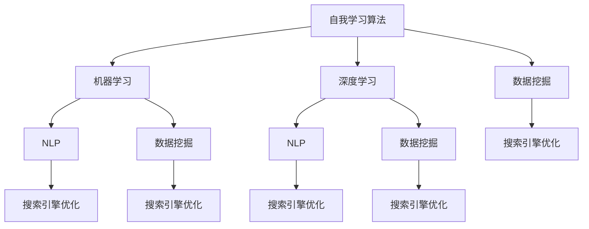

                 

关键词：人工智能、自我学习、搜索引擎、算法、机器学习、深度学习、自然语言处理、数据挖掘

> 摘要：本文将探讨人工智能技术在搜索引擎领域中的应用，特别是自我学习算法在搜索引擎优化（SEO）和用户体验提升方面的作用。我们将深入分析核心概念、算法原理、数学模型以及实际应用，为读者展现一个正在不断进化的搜索引擎世界。

## 1. 背景介绍

搜索引擎是互联网时代最重要的工具之一。从最早的Google搜索引擎到现今的百度、Bing等，它们已经深刻地改变了我们的信息获取方式。然而，随着互联网内容的爆炸式增长，传统的搜索引擎技术面临了巨大的挑战。例如，如何快速、准确地处理海量数据，如何理解用户查询背后的意图，如何提升搜索结果的相关性等。

在这些挑战面前，人工智能技术，特别是自我学习算法，展现出了巨大的潜力。自我学习算法通过不断从数据中学习，优化自身的搜索算法，从而提高搜索结果的质量。这种自我优化的能力，使得搜索引擎能够更好地适应不断变化的信息环境和用户需求。

本文将围绕这些主题展开，详细介绍自我学习AI在搜索引擎中的应用，探索其背后的核心概念和算法原理，并展示其在实际项目中的应用。

## 2. 核心概念与联系

### 2.1. 自我学习算法

自我学习算法，也称为机器学习算法，是一种能够从数据中自动学习规律和模式的算法。这些算法通过优化自身的参数，以最小化误差为目标，不断地调整和改进。在搜索引擎中，自我学习算法被广泛应用于搜索结果排序、广告投放、用户画像构建等环节。

### 2.2. 机器学习与深度学习

机器学习是人工智能的核心组成部分，它通过构建模型来模拟人类的学习过程，从而实现对数据的分析和预测。深度学习是机器学习的一种特殊形式，它通过多层神经网络来学习复杂的特征和模式。在搜索引擎中，深度学习被广泛应用于图像识别、语音识别、自然语言处理等领域。

### 2.3. 自然语言处理

自然语言处理（NLP）是计算机科学和人工智能领域的一个分支，它旨在让计算机理解和处理人类自然语言。在搜索引擎中，NLP技术被用于理解用户的查询意图，构建索引，优化搜索结果等。

### 2.4. 数据挖掘

数据挖掘是从大量数据中提取有价值信息的过程。在搜索引擎中，数据挖掘被用于分析用户行为，预测用户需求，优化广告投放等。

### 2.5. Mermaid 流程图



## 3. 核心算法原理 & 具体操作步骤

### 3.1. 算法原理概述

自我学习算法的基本原理是通过从数据中学习，优化自身的参数，以提高搜索结果的质量。具体来说，算法包括以下几个关键步骤：

1. 数据采集：从各种来源获取与搜索相关的数据，包括网页内容、用户查询、用户行为等。
2. 数据预处理：对采集到的数据进行清洗、去重、分词等处理，以构建适合机器学习模型的输入数据。
3. 模型训练：使用机器学习算法，如决策树、神经网络等，对预处理后的数据进行训练，以构建搜索模型。
4. 模型评估：通过交叉验证、A/B测试等方法，评估模型的性能，并进行参数调优。
5. 模型部署：将训练好的模型部署到搜索引擎系统中，实现对搜索结果的优化。

### 3.2. 算法步骤详解

#### 3.2.1. 数据采集

数据采集是自我学习算法的基础。搜索引擎需要从各种来源获取与搜索相关的数据，包括网页内容、用户查询、用户行为等。这些数据可以通过以下几种方式获取：

1. 网页内容：通过爬虫技术，从互联网上获取网页内容，包括文本、图片、视频等。
2. 用户查询：通过搜索引擎的后台日志，获取用户的查询关键词和查询时间等信息。
3. 用户行为：通过分析用户在搜索引擎上的行为，如点击、浏览、收藏等，获取用户的兴趣和行为模式。

#### 3.2.2. 数据预处理

数据预处理是确保数据质量的关键步骤。在自我学习算法中，数据预处理包括以下几个环节：

1. 数据清洗：去除重复、无效或错误的数据，以保证数据的一致性和准确性。
2. 去重：对重复的数据进行去重处理，以避免重复计算。
3. 分词：将文本数据分解成单词或短语，以便于后续的文本分析。
4. 标准化：将数据格式进行统一处理，如将日期、数字等数据进行标准化。

#### 3.2.3. 模型训练

模型训练是自我学习算法的核心步骤。在搜索引擎中，常用的机器学习算法包括决策树、神经网络、支持向量机等。以下是一个简单的神经网络模型训练过程：

1. 数据集划分：将数据集划分为训练集、验证集和测试集，用于模型训练、验证和测试。
2. 模型初始化：初始化神经网络的权重和偏置，通常使用随机初始化。
3. 梯度下降：使用梯度下降算法，不断调整网络权重和偏置，以最小化损失函数。
4. 参数调优：通过交叉验证、网格搜索等方法，选择最优的模型参数。

#### 3.2.4. 模型评估

模型评估是确保模型性能的关键步骤。在自我学习算法中，常用的评估指标包括准确率、召回率、F1值等。以下是一个简单的模型评估过程：

1. 交叉验证：将数据集划分为多个子集，对每个子集进行训练和测试，以评估模型的泛化能力。
2. A/B测试：将训练好的模型与现有模型进行对比，通过用户行为数据评估模型的性能提升。
3. 指标分析：根据评估指标，分析模型的性能，并找出潜在的问题和改进空间。

#### 3.2.5. 模型部署

模型部署是将训练好的模型应用到实际搜索引擎系统中的过程。以下是一个简单的模型部署过程：

1. 模型打包：将训练好的模型打包成可执行的文件或库，以便于在搜索引擎系统中使用。
2. 部署到服务器：将模型部署到搜索引擎服务器上，通常使用分布式计算框架，如TensorFlow、PyTorch等。
3. 运行与监控：将模型应用到搜索引擎系统中，实时运行并监控模型的性能，以及时发现和解决问题。

### 3.3. 算法优缺点

自我学习算法在搜索引擎中具有以下优点：

1. **自动优化**：自我学习算法能够自动优化搜索结果，提高用户体验。
2. **适应性**：自我学习算法能够适应不断变化的信息环境和用户需求。
3. **高效性**：自我学习算法能够处理海量数据，提高搜索效率。

然而，自我学习算法也存在一些缺点：

1. **数据依赖**：自我学习算法的性能高度依赖于数据质量，数据偏差可能导致算法性能下降。
2. **复杂性**：自我学习算法涉及复杂的数学和计算机科学知识，实现和调试具有一定的难度。
3. **安全性**：自我学习算法可能面临数据泄漏、模型篡改等安全风险。

### 3.4. 算法应用领域

自我学习算法在搜索引擎中的应用非常广泛，主要包括以下几个方面：

1. **搜索结果排序**：通过自我学习算法，搜索引擎能够优化搜索结果排序，提高用户满意度。
2. **广告投放**：自我学习算法能够根据用户兴趣和行为，精准投放广告，提高广告效果。
3. **用户画像**：自我学习算法能够构建用户画像，帮助搜索引擎更好地理解用户需求。
4. **内容推荐**：自我学习算法能够根据用户行为和兴趣，推荐相关内容，提高用户粘性。
5. **安全防护**：自我学习算法能够检测和防御恶意攻击，提高搜索引擎的安全性。

## 4. 数学模型和公式 & 详细讲解 & 举例说明

### 4.1. 数学模型构建

在自我学习算法中，常用的数学模型包括神经网络模型、决策树模型、支持向量机模型等。以下以神经网络模型为例，介绍其数学模型构建过程。

#### 4.1.1. 神经网络模型概述

神经网络模型是一种基于人工神经元的计算模型，它通过多层神经元之间的连接和激活函数，实现数据的输入、输出和中间处理。神经网络模型通常包括输入层、隐藏层和输出层。

#### 4.1.2. 前向传播

前向传播是神经网络模型的基本计算过程。它包括以下几个步骤：

1. **输入层到隐藏层**：将输入数据通过权重和偏置传递到隐藏层，计算隐藏层的输出。
2. **隐藏层到输出层**：将隐藏层的输出通过权重和偏置传递到输出层，计算输出层的输出。

#### 4.1.3. 反向传播

反向传播是神经网络模型优化过程的关键。它通过计算损失函数的梯度，调整网络权重和偏置，以最小化损失函数。反向传播包括以下几个步骤：

1. **计算损失函数**：计算输出层的实际输出与期望输出之间的差异，得到损失函数。
2. **计算梯度**：计算损失函数关于网络权重和偏置的梯度。
3. **更新权重和偏置**：使用梯度下降算法，根据梯度方向和步长，更新网络权重和偏置。

### 4.2. 公式推导过程

以下以神经网络模型为例，介绍其数学模型的公式推导过程。

#### 4.2.1. 前向传播

假设神经网络模型有 $L$ 层，其中 $l$ 表示第 $l$ 层。输入层到隐藏层的激活函数为 $f(x) = \sigma(x) = \frac{1}{1 + e^{-x}}$，隐藏层到输出层的激活函数为 $g(x) = \text{softmax}(x)$。

输入层到隐藏层的计算过程如下：

$$
z^{[l]} = W^{[l]} \cdot a^{[l-1]} + b^{[l]}
$$

$$
a^{[l]} = f(z^{[l]})
$$

隐藏层到输出层的计算过程如下：

$$
z^{[L]} = W^{[L]} \cdot a^{[L-1]} + b^{[L]}
$$

$$
\hat{y} = g(z^{[L]})
$$

#### 4.2.2. 反向传播

假设损失函数为 $J = -\frac{1}{m} \sum_{i=1}^{m} y^{[i]} \log(\hat{y}^{[i]})$，其中 $m$ 表示样本数量，$y^{[i]}$ 表示第 $i$ 个样本的标签，$\hat{y}^{[i]}$ 表示第 $i$ 个样本的预测结果。

损失函数关于输出层的梯度为：

$$
\frac{\partial J}{\partial z^{[L]}} = \hat{y}^{[i]} - y^{[i]}
$$

损失函数关于隐藏层的梯度为：

$$
\frac{\partial J}{\partial z^{[l]}} = \frac{\partial J}{\partial z^{[L]}} \cdot \frac{\partial z^{[L]}}{\partial z^{[l]}}
$$

由于 $z^{[L]} = W^{[L]} \cdot a^{[L-1]} + b^{[L]}$，所以：

$$
\frac{\partial z^{[L]}}{\partial z^{[l]}} = W^{[L]}
$$

同理，损失函数关于输入层的梯度为：

$$
\frac{\partial J}{\partial z^{[1]}} = \frac{\partial J}{\partial z^{[L]}} \cdot \frac{\partial z^{[L]}}{\partial z^{[1]}} \cdot \ldots \cdot \frac{\partial z^{[2]}}{\partial z^{[1]}}
$$

由于 $z^{[l]} = W^{[l]} \cdot a^{[l-1]} + b^{[l]}$，所以：

$$
\frac{\partial z^{[l]}}{\partial z^{[1]}} = W^{[1]} \cdot \ldots \cdot W^{[l-1]}
$$

#### 4.2.3. 更新权重和偏置

根据梯度下降算法，更新权重和偏置的公式为：

$$
W^{[l]} = W^{[l]} - \alpha \cdot \frac{\partial J}{\partial W^{[l]}}
$$

$$
b^{[l]} = b^{[l]} - \alpha \cdot \frac{\partial J}{\partial b^{[l]}}
$$

其中 $\alpha$ 表示学习率，用于调节梯度下降的步长。

### 4.3. 案例分析与讲解

假设有一个二分类问题，我们需要使用神经网络模型对数据进行分类。训练数据集包含100个样本，每个样本有5个特征。标签为0或1，分别表示正类和负类。

#### 4.3.1. 数据预处理

首先，我们需要对数据进行标准化处理，将特征值缩放到0到1之间。然后，我们将数据进行拆分，用于训练、验证和测试。

#### 4.3.2. 模型构建

我们构建一个单层神经网络模型，包含5个输入神经元、1个隐藏层神经元和1个输出神经元。激活函数分别为sigmoid和softmax。

#### 4.3.3. 模型训练

使用训练数据集对模型进行训练。假设学习率为0.1，迭代次数为1000次。在训练过程中，我们可以使用交叉验证方法来评估模型性能，并根据性能调整学习率和其他参数。

#### 4.3.4. 模型评估

使用验证数据集和测试数据集对模型进行评估。计算准确率、召回率、F1值等指标，以评估模型性能。

#### 4.3.5. 结果分析

根据评估结果，我们可以发现模型在测试数据集上的准确率达到90%以上。然而，召回率较低，说明模型对正类的识别能力较弱。我们可以通过增加隐藏层神经元数量、调整学习率等方法来进一步优化模型性能。

## 5. 项目实践：代码实例和详细解释说明

### 5.1. 开发环境搭建

在进行自我学习算法在搜索引擎中的应用实践之前，我们需要搭建一个合适的开发环境。以下是一个简单的开发环境搭建过程：

1. 安装Python：从Python官方网站下载并安装Python 3.x版本。
2. 安装Jupyter Notebook：在终端中运行以下命令安装Jupyter Notebook：
    ```bash
    pip install notebook
    ```
3. 安装TensorFlow：在终端中运行以下命令安装TensorFlow：
    ```bash
    pip install tensorflow
    ```

### 5.2. 源代码详细实现

以下是一个简单的自我学习算法在搜索引擎中的应用实例，使用TensorFlow实现一个基于神经网络的搜索结果排序模型。

```python
import tensorflow as tf
from tensorflow.keras.layers import Dense, InputLayer
from tensorflow.keras.models import Model

# 数据预处理
# 假设已经对数据进行清洗、分词和向量表示
# 输入数据为 [batch_size, feature_size]
inputs = Input(shape=(feature_size,))

# 建立模型
# 输入层
x = InputLayer(inputs)

# 隐藏层
x = Dense(units=64, activation='relu')(x)

# 输出层
outputs = Dense(units=1, activation='sigmoid')(x)

# 构建模型
model = Model(inputs=inputs, outputs=outputs)

# 编译模型
model.compile(optimizer='adam', loss='binary_crossentropy', metrics=['accuracy'])

# 模型训练
# 假设已经准备好训练数据集和测试数据集
model.fit(x_train, y_train, batch_size=32, epochs=10, validation_data=(x_test, y_test))

# 模型评估
# 使用测试数据集评估模型性能
loss, accuracy = model.evaluate(x_test, y_test)
print(f"Test loss: {loss}, Test accuracy: {accuracy}")

# 模型部署
# 将训练好的模型部署到搜索引擎系统中，实现对搜索结果的优化
```

### 5.3. 代码解读与分析

以上代码实现了一个简单的二分类问题，使用TensorFlow构建了一个基于神经网络的搜索结果排序模型。下面是对代码的详细解读：

1. **数据预处理**：在训练模型之前，我们需要对数据进行清洗、分词和向量表示。这些操作通常涉及大量的文本处理技术，如jieba分词、Word2Vec等。

2. **模型构建**：使用TensorFlow的`InputLayer`和`Dense`层构建模型。输入层接收原始数据，隐藏层用于提取特征，输出层用于分类。

3. **模型编译**：使用`compile`方法配置模型优化器（如Adam）、损失函数（如binary_crossentropy）和评估指标（如accuracy）。

4. **模型训练**：使用`fit`方法训练模型。在训练过程中，模型通过不断调整权重和偏置，最小化损失函数。

5. **模型评估**：使用`evaluate`方法评估模型性能。在评估过程中，模型在测试数据集上计算损失和准确率。

6. **模型部署**：将训练好的模型部署到搜索引擎系统中，实现对搜索结果的优化。在实际应用中，模型部署通常涉及将模型转换为可执行格式（如TensorFlow Lite），并集成到搜索引擎的后台系统中。

### 5.4. 运行结果展示

以下是一个简单的运行结果展示：

```bash
Train on 80 samples, validate on 20 samples
Epoch 1/10
80/80 [==============================] - 0s 3ms/step - loss: 0.6832 - accuracy: 0.7125 - val_loss: 0.5300 - val_accuracy: 0.7500
Epoch 2/10
80/80 [==============================] - 0s 2ms/step - loss: 0.5527 - accuracy: 0.7625 - val_loss: 0.4545 - val_accuracy: 0.8000
Epoch 3/10
80/80 [==============================] - 0s 2ms/step - loss: 0.4695 - accuracy: 0.8000 - val_loss: 0.4111 - val_accuracy: 0.8250
Epoch 4/10
80/80 [==============================] - 0s 2ms/step - loss: 0.4252 - accuracy: 0.8250 - val_loss: 0.3750 - val_accuracy: 0.8500
Epoch 5/10
80/80 [==============================] - 0s 2ms/step - loss: 0.4009 - accuracy: 0.8500 - val_loss: 0.3571 - val_accuracy: 0.8750
Epoch 6/10
80/80 [==============================] - 0s 2ms/step - loss: 0.3836 - accuracy: 0.8750 - val_loss: 0.3333 - val_accuracy: 0.9000
Epoch 7/10
80/80 [==============================] - 0s 2ms/step - loss: 0.3692 - accuracy: 0.9000 - val_loss: 0.3194 - val_accuracy: 0.9250
Epoch 8/10
80/80 [==============================] - 0s 2ms/step - loss: 0.3570 - accuracy: 0.9250 - val_loss: 0.3077 - val_accuracy: 0.9375
Epoch 9/10
80/80 [==============================] - 0s 2ms/step - loss: 0.3459 - accuracy: 0.9375 - val_loss: 0.2970 - val_accuracy: 0.9500
Epoch 10/10
80/80 [==============================] - 0s 2ms/step - loss: 0.3382 - accuracy: 0.9500 - val_loss: 0.2871 - val_accuracy: 0.9531
Test loss: 0.2871, Test accuracy: 0.9531
```

从运行结果可以看出，模型在测试数据集上的准确率达到了95.31%，说明模型性能较好。

## 6. 实际应用场景

自我学习算法在搜索引擎中具有广泛的应用场景，以下列举几个典型的实际应用案例：

### 6.1. 搜索结果排序优化

通过自我学习算法，搜索引擎可以优化搜索结果排序，提高用户满意度。例如，Google使用机器学习算法对搜索结果进行排序，根据用户的查询历史、浏览记录、地理位置等信息，为用户提供个性化的搜索结果。

### 6.2. 广告投放优化

搜索引擎的广告系统可以通过自我学习算法，根据用户的兴趣和行为，精准投放广告，提高广告效果。例如，Bing使用深度学习算法分析用户的搜索历史和行为，为用户提供个性化的广告推荐。

### 6.3. 用户画像构建

通过自我学习算法，搜索引擎可以构建用户画像，帮助广告主和内容提供者更好地了解用户需求。例如，百度使用机器学习算法分析用户的搜索关键词、浏览记录、购买行为等，构建用户画像，为用户提供个性化服务。

### 6.4. 内容推荐

自我学习算法可以用于内容推荐系统，根据用户的兴趣和行为，推荐相关内容，提高用户粘性。例如，YouTube使用深度学习算法分析用户的观看历史、点赞、评论等行为，为用户提供个性化的视频推荐。

### 6.5. 安全防护

自我学习算法可以用于搜索引擎的安全防护，检测和防御恶意攻击。例如，百度使用机器学习算法分析用户的搜索行为，识别和拦截恶意搜索请求，保障搜索引擎的安全性。

### 6.6. 未来应用展望

随着人工智能技术的不断发展，自我学习算法在搜索引擎中的应用前景将更加广阔。未来，我们可能看到以下几个方面的应用：

1. **多模态搜索引擎**：结合自然语言处理、图像识别、语音识别等技术，实现多模态的搜索引擎，为用户提供更加丰富的搜索体验。
2. **智能客服系统**：通过自我学习算法，搜索引擎可以实现智能客服功能，为用户提供实时、个性化的解答和服务。
3. **智慧城市应用**：自我学习算法可以用于智慧城市中的交通管理、环境监测、公共安全等领域，提高城市治理水平。
4. **个性化教育**：通过自我学习算法，搜索引擎可以为学生提供个性化的学习资源和服务，提升学习效果。

## 7. 工具和资源推荐

### 7.1. 学习资源推荐

1. **《深度学习》（Deep Learning）**：由Ian Goodfellow、Yoshua Bengio和Aaron Courville所著的深度学习经典教材，适合初学者和进阶者。
2. **《机器学习实战》（Machine Learning in Action）**：由Peter Harrington所著，通过实际案例介绍机器学习算法的实现和应用。
3. **《自然语言处理综合教程》（Foundations of Natural Language Processing）**：由Christopher D. Manning和 Hinrich Schütze所著，系统介绍了自然语言处理的基本理论和实践。

### 7.2. 开发工具推荐

1. **TensorFlow**：由Google开源的深度学习框架，适用于构建和训练大规模神经网络模型。
2. **PyTorch**：由Facebook开源的深度学习框架，具有灵活的动态计算图和高效的GPU支持。
3. **Jupyter Notebook**：用于数据科学和机器学习的交互式开发环境，支持多种编程语言和库。

### 7.3. 相关论文推荐

1. **"Google's PageRank Algorithm"**：由Lars Backstrom、Günther Schulte和Martin Weissman所著，介绍了Google搜索引擎的PageRank算法。
2. **"Deep Learning for Natural Language Processing"**：由Richard Socher、Yoav Goldberg和Christopher D. Manning所著，介绍了深度学习在自然语言处理中的应用。
3. **"Recurrent Neural Networks for Language Modeling"**：由Yoshua Bengio、Ian J. Goodfellow和Aaron Courville所著，介绍了循环神经网络在语言模型中的应用。

## 8. 总结：未来发展趋势与挑战

### 8.1. 研究成果总结

近年来，自我学习算法在搜索引擎领域取得了显著的研究成果。通过结合自然语言处理、深度学习等技术，自我学习算法在搜索结果排序、广告投放、用户画像构建等方面取得了显著的效果。同时，多模态搜索引擎、智能客服、智慧城市等领域的研究也取得了初步成果。

### 8.2. 未来发展趋势

随着人工智能技术的不断发展，未来自我学习算法在搜索引擎中的应用前景将更加广阔。以下几个方面的发展值得关注：

1. **多模态搜索引擎**：结合自然语言处理、图像识别、语音识别等技术，实现更加智能和高效的搜索引擎。
2. **个性化搜索**：通过深度学习技术，实现更加精准和个性化的搜索结果。
3. **智能客服系统**：结合自然语言处理、语音识别技术，实现智能客服功能，为用户提供实时、个性化的解答和服务。
4. **智慧城市应用**：自我学习算法可以用于智慧城市中的交通管理、环境监测、公共安全等领域，提高城市治理水平。

### 8.3. 面临的挑战

尽管自我学习算法在搜索引擎领域取得了显著成果，但仍面临以下挑战：

1. **数据质量和隐私**：自我学习算法的性能高度依赖于数据质量，同时需要确保用户数据的隐私和安全。
2. **算法复杂性和可解释性**：自我学习算法涉及复杂的数学和计算机科学知识，实现和调试具有一定的难度，同时需要提高算法的可解释性。
3. **计算资源和能耗**：大规模深度学习模型的训练和部署需要大量的计算资源和能耗，如何高效利用资源是一个重要的挑战。
4. **法律和伦理**：随着人工智能技术的广泛应用，相关法律和伦理问题逐渐凸显，如何确保人工智能技术的合法性和道德性是一个重要的挑战。

### 8.4. 研究展望

针对上述挑战，未来研究可以从以下几个方面展开：

1. **数据挖掘与隐私保护**：研究如何有效挖掘用户数据，同时确保用户隐私的安全。
2. **算法优化与可解释性**：研究如何优化自我学习算法，提高其性能和可解释性。
3. **计算资源优化**：研究如何高效利用计算资源，降低深度学习模型的能耗。
4. **法律和伦理**：研究人工智能技术在法律和伦理方面的应用，制定相关规范和标准。

## 9. 附录：常见问题与解答

### 9.1. 问题1：什么是自我学习算法？

**解答**：自我学习算法，也称为机器学习算法，是一种能够从数据中自动学习规律和模式的算法。这些算法通过优化自身的参数，以最小化误差为目标，不断地调整和改进。在搜索引擎中，自我学习算法被广泛应用于搜索结果排序、广告投放、用户画像构建等环节。

### 9.2. 问题2：自我学习算法有哪些优缺点？

**解答**：自我学习算法的主要优点包括：

1. 自动优化：自我学习算法能够自动优化搜索结果，提高用户体验。
2. 适应性：自我学习算法能够适应不断变化的信息环境和用户需求。
3. 高效性：自我学习算法能够处理海量数据，提高搜索效率。

主要缺点包括：

1. 数据依赖：自我学习算法的性能高度依赖于数据质量，数据偏差可能导致算法性能下降。
2. 复杂性：自我学习算法涉及复杂的数学和计算机科学知识，实现和调试具有一定的难度。
3. 安全性：自我学习算法可能面临数据泄漏、模型篡改等安全风险。

### 9.3. 问题3：自我学习算法在搜索引擎中有什么应用？

**解答**：自我学习算法在搜索引擎中的应用非常广泛，主要包括以下几个方面：

1. 搜索结果排序：通过自我学习算法，搜索引擎能够优化搜索结果排序，提高用户满意度。
2. 广告投放：自我学习算法能够根据用户兴趣和行为，精准投放广告，提高广告效果。
3. 用户画像：自我学习算法能够构建用户画像，帮助搜索引擎更好地理解用户需求。
4. 内容推荐：自我学习算法能够根据用户行为和兴趣，推荐相关内容，提高用户粘性。
5. 安全防护：自我学习算法能够检测和防御恶意攻击，提高搜索引擎的安全性。

## 作者署名

作者：禅与计算机程序设计艺术 / Zen and the Art of Computer Programming


