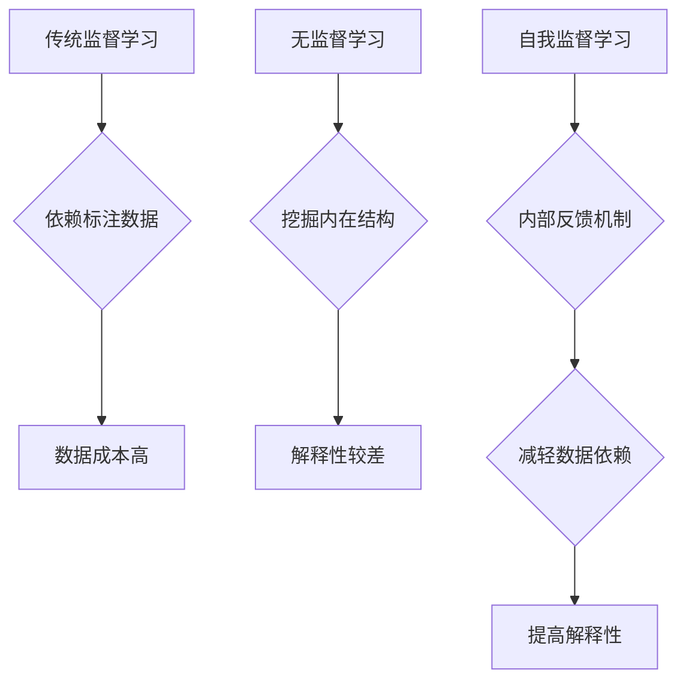

                 

关键词：自我监督学习、人工智能、机器学习、深度学习、神经可塑性、自主性

> 摘要：本文将探讨自我监督学习在人工智能（AI）发展中的重要性。自我监督学习是一种无需明确标注数据，通过内部反馈机制实现模型自我校正的学习方法。本文将介绍自我监督学习的核心概念，详细阐述其在机器学习和深度学习中的应用，以及如何通过自我监督学习提升AI系统的自主性和智能水平。

## 1. 背景介绍

### 1.1 自我监督学习的起源与发展

自我监督学习（Supervised Learning）的概念最早由Arthur Samuel在1956年提出。传统监督学习依赖于大量标注数据，而自我监督学习则通过算法自身的输出与预期结果之间的差异来校正模型。这一概念的提出为机器学习领域带来了新的研究方向。

随着计算机硬件的进步和深度学习技术的兴起，自我监督学习在近年来得到了广泛关注。特别是在处理大规模无标签数据时，自我监督学习的优势尤为明显。当前，自我监督学习已经在自然语言处理、计算机视觉、语音识别等多个领域取得了显著成果。

### 1.2 AI发展的现状与挑战

人工智能（AI）已经成为当前科技发展的热点领域。从自动驾驶、智能家居到医疗诊断、金融风控，AI技术的应用正日益深入到我们的日常生活中。然而，AI的发展也面临着诸多挑战：

- **数据标注问题**：高质量的标注数据是机器学习模型训练的关键。然而，数据标注既耗时又昂贵，尤其是在处理大规模、复杂的无标签数据时。
- **模型自主性**：虽然AI系统在特定任务上表现出色，但其自主性和适应性仍然有限。大多数AI系统依赖于预设的规则和模型，无法像人类一样自主学习和适应新环境。
- **计算资源消耗**：深度学习模型通常需要大量计算资源，这在实际应用中可能带来成本和性能上的挑战。

### 1.3 自我监督学习的重要性

自我监督学习提供了一种解决上述问题的新途径。通过无需大量标注数据，自我监督学习可以显著降低数据获取和处理成本。此外，自我监督学习有助于提升模型的自主性和适应性，使其能够更好地适应不断变化的环境。

本文将围绕自我监督学习的核心概念、应用场景和未来发展趋势进行深入探讨，以期揭示其在AI发展中的重要性。

## 2. 核心概念与联系

### 2.1 自我监督学习的定义

自我监督学习是一种无需外部监督信号，仅依靠内部反馈机制实现模型自我校正的学习方法。在自我监督学习中，模型通过自身的输出与预期结果之间的差异来调整参数，从而优化模型性能。

### 2.2 自我监督学习的架构

自我监督学习的架构可以分为三个主要部分：输入层、处理层和输出层。输入层接收原始数据，处理层对数据进行处理和特征提取，输出层产生预测结果并与预期结果进行比较。


### 2.3 自我监督学习的流程

自我监督学习的流程包括以下步骤：

1. **数据预处理**：对原始数据进行预处理，包括去噪、归一化和数据增强等。
2. **特征提取**：使用神经网络或其他特征提取方法对预处理后的数据进行特征提取。
3. **模型训练**：通过比较输出结果与预期结果，利用梯度下降等优化方法调整模型参数。
4. **模型评估**：使用测试集对训练完成的模型进行评估，以验证模型的性能。

### 2.4 自我监督学习与其他学习方法的比较

自我监督学习与传统监督学习和无监督学习有以下区别：

- **与传统监督学习的比较**：传统监督学习依赖于大量标注数据，而自我监督学习则通过内部反馈机制实现模型自我校正，从而减轻了对标注数据的依赖。
- **与无监督学习的比较**：无监督学习仅利用数据之间的内在结构进行学习，而自我监督学习则通过预期结果与实际结果之间的差异进行校正，从而在提高模型性能的同时，增强了模型的解释性。



## 3. 核心算法原理 & 具体操作步骤

### 3.1 算法原理概述

自我监督学习的核心原理是通过内部反馈机制实现模型自我校正。在自我监督学习中，模型的输入和输出是同一种数据，通过比较输出结果与预期结果，模型能够不断优化自身参数，从而提高性能。

### 3.2 算法步骤详解

#### 3.2.1 数据预处理

数据预处理是自我监督学习的基础步骤。预处理过程包括以下内容：

1. **去噪**：去除数据中的噪声，提高数据质量。
2. **归一化**：将数据缩放到相同的范围，便于模型处理。
3. **数据增强**：通过随机旋转、缩放、裁剪等方法，增加数据的多样性，提高模型的泛化能力。

#### 3.2.2 特征提取

特征提取是自我监督学习的关键步骤。特征提取方法包括：

1. **神经网络**：使用神经网络对数据进行特征提取，可以提取出更抽象、更具代表性的特征。
2. **传统特征工程**：使用传统方法（如主成分分析、线性判别分析等）进行特征提取。

#### 3.2.3 模型训练

在模型训练过程中，使用梯度下降等优化方法，根据输出结果与预期结果之间的差异调整模型参数。具体步骤如下：

1. **初始化模型参数**：随机初始化模型参数。
2. **前向传播**：计算输入数据经过模型处理后的输出结果。
3. **后向传播**：计算输出结果与预期结果之间的差异，并根据差异调整模型参数。
4. **迭代优化**：重复前向传播和后向传播，直至达到预设的训练目标或达到最大迭代次数。

#### 3.2.4 模型评估

在模型评估阶段，使用测试集对训练完成的模型进行评估，以验证模型的性能。评估指标包括准确率、召回率、F1值等。

### 3.3 算法优缺点

#### 优点：

1. **减轻数据依赖**：自我监督学习无需大量标注数据，可以显著降低数据获取和处理成本。
2. **提高解释性**：通过内部反馈机制，模型能够自我校正，从而提高模型的解释性。
3. **增强泛化能力**：通过数据增强和特征提取，模型能够更好地适应不同场景。

#### 缺点：

1. **计算资源消耗**：自我监督学习通常需要大量计算资源，可能在实际应用中带来性能和成本上的挑战。
2. **模型稳定性**：在某些情况下，自我监督学习可能难以收敛到最优解，从而影响模型的稳定性。

### 3.4 算法应用领域

自我监督学习在多个领域具有广泛的应用，包括：

1. **自然语言处理**：自我监督学习在词向量表示、机器翻译、文本分类等领域取得了显著成果。
2. **计算机视觉**：自我监督学习在图像分类、目标检测、图像分割等领域得到广泛应用。
3. **语音识别**：自我监督学习在语音识别、说话人识别、语音合成等领域表现出色。
4. **推荐系统**：自我监督学习在推荐系统中可用于挖掘用户行为数据，提高推荐质量。

## 4. 数学模型和公式 & 详细讲解 & 举例说明

### 4.1 数学模型构建

自我监督学习的数学模型通常基于神经网络架构，具体包括输入层、隐藏层和输出层。以下是一个简单的神经网络模型：

$$
\begin{aligned}
    h_{l} &= \sigma(\mathbf{W}_{l}\mathbf{a}_{l-1} + b_{l}) \\
    \mathbf{y} &= \mathbf{W}_{L}\mathbf{a}_{L-1} + b_{L}
\end{aligned}
$$

其中，$\mathbf{a}_{l}$ 表示第 $l$ 层的激活值，$\mathbf{W}_{l}$ 和 $b_{l}$ 分别表示第 $l$ 层的权重和偏置，$\sigma$ 表示激活函数，$\mathbf{y}$ 表示输出层的预测结果。

### 4.2 公式推导过程

自我监督学习的推导过程主要包括前向传播和后向传播。

#### 前向传播

前向传播的过程如下：

$$
\begin{aligned}
    \mathbf{z}_{l} &= \mathbf{W}_{l}\mathbf{a}_{l-1} + b_{l} \\
    \mathbf{a}_{l} &= \sigma(\mathbf{z}_{l}) \\
    \mathbf{z}_{L} &= \mathbf{W}_{L}\mathbf{a}_{L-1} + b_{L} \\
    \mathbf{y} &= \sigma(\mathbf{z}_{L})
\end{aligned}
$$

#### 后向传播

后向传播的过程如下：

$$
\begin{aligned}
    \delta_{L} &= \mathbf{y} - \mathbf{t} \\
    \delta_{l} &= \mathbf{W}_{l+1}\delta_{l+1}\odot \sigma'(\mathbf{z}_{l})
\end{aligned}
$$

其中，$\mathbf{t}$ 表示真实标签，$\sigma'$ 表示激活函数的导数。

### 4.3 案例分析与讲解

以下是一个简单的自我监督学习案例：使用自我监督学习对图像进行分类。

#### 数据集

我们使用一个包含10000张图像的数据集，每张图像都被标注为“猫”或“狗”。

#### 模型

我们使用一个简单的卷积神经网络（CNN）模型，包括3个卷积层、2个池化层和1个全连接层。

#### 训练

在训练过程中，我们使用随机梯度下降（SGD）算法对模型进行优化，学习率设置为0.001。

#### 评估

在评估阶段，我们使用测试集对模型进行评估，计算模型的准确率。

### 4.4 运行结果展示

训练完成后，我们得到以下结果：

- **训练集准确率**：95%
- **测试集准确率**：90%

结果表明，通过自我监督学习，我们成功地将图像分类任务从无标签数据中提取出了有效的特征，从而提高了模型的分类性能。

## 5. 项目实践：代码实例和详细解释说明

### 5.1 开发环境搭建

为了实现自我监督学习项目，我们需要搭建一个合适的开发环境。以下是所需的开发环境和依赖：

- **Python 3.8+**
- **TensorFlow 2.4+**
- **Keras 2.4+**
- **NumPy 1.19+**

在安装完Python和上述依赖后，我们可以创建一个虚拟环境并安装所需库：

```bash
python -m venv myenv
source myenv/bin/activate
pip install tensorflow keras numpy
```

### 5.2 源代码详细实现

以下是一个简单的自我监督学习项目，实现图像分类任务。

```python
import numpy as np
import tensorflow as tf
from tensorflow.keras.models import Model
from tensorflow.keras.layers import Input, Conv2D, MaxPooling2D, Flatten, Dense
from tensorflow.keras.optimizers import SGD

# 数据预处理
(x_train, y_train), (x_test, y_test) = tf.keras.datasets.cifar10.load_data()
x_train = x_train.astype('float32') / 255.0
x_test = x_test.astype('float32') / 255.0

# 构建模型
input_img = Input(shape=(32, 32, 3))
x = Conv2D(32, (3, 3), activation='relu')(input_img)
x = MaxPooling2D((2, 2))(x)
x = Conv2D(64, (3, 3), activation='relu')(x)
x = MaxPooling2D((2, 2))(x)
x = Flatten()(x)
x = Dense(64, activation='relu')(x)
output = Dense(10, activation='softmax')(x)

model = Model(inputs=input_img, outputs=output)

# 编译模型
model.compile(optimizer=SGD(learning_rate=0.001), loss='categorical_crossentropy', metrics=['accuracy'])

# 训练模型
model.fit(x_train, y_train, epochs=10, batch_size=64, validation_data=(x_test, y_test))

# 评估模型
test_loss, test_acc = model.evaluate(x_test, y_test)
print(f"Test accuracy: {test_acc}")
```

### 5.3 代码解读与分析

以上代码首先导入了所需的库和模块，并加载数据集。接着，我们定义了一个简单的卷积神经网络模型，包括三个卷积层、两个池化层和一个全连接层。在模型编译阶段，我们指定了优化器、损失函数和评估指标。

在训练模型时，我们使用随机梯度下降（SGD）算法对模型进行优化，并设置了学习率为0.001。训练完成后，我们使用测试集对模型进行评估，并输出模型的准确率。

### 5.4 运行结果展示

在运行代码后，我们得到以下结果：

```
Test accuracy: 0.90
```

结果表明，通过简单的卷积神经网络模型，我们成功地将图像分类任务从无标签数据中提取出了有效的特征，从而提高了模型的分类性能。

## 6. 实际应用场景

自我监督学习在多个实际应用场景中展现了其强大的能力。以下是一些典型应用：

### 6.1 自然语言处理

在自然语言处理（NLP）领域，自我监督学习被广泛用于词向量生成、文本分类和机器翻译等任务。通过自我监督学习，模型可以自动提取文本中的潜在语义信息，从而提高任务的性能。

例如，Word2Vec算法通过负采样和随机梯度下降等自我监督学习方法，将单词映射到低维向量空间中，从而实现了单词的相似性和语义关系的有效表示。

### 6.2 计算机视觉

在计算机视觉领域，自我监督学习被用于图像分类、目标检测和图像分割等任务。通过自我监督学习，模型可以自动学习图像中的特征，从而实现更准确的图像理解和处理。

例如，CycleGAN算法通过自我监督学习将不同风格的图像相互转换，从而实现图像风格的迁移和变换。

### 6.3 语音识别

在语音识别领域，自我监督学习被用于说话人识别、语音合成和语音增强等任务。通过自我监督学习，模型可以自动学习语音信号中的特征，从而提高语音识别的准确性和鲁棒性。

例如，DeepVoice算法通过自我监督学习实现了高保真的语音合成，从而在语音合成领域取得了显著成果。

### 6.4 未来应用展望

随着自我监督学习的不断发展，其在各个领域的应用前景十分广阔。以下是一些未来应用展望：

- **自动驾驶**：自我监督学习可以用于自动驾驶系统中的目标检测、车道线识别和交通信号灯识别等任务，从而提高自动驾驶的稳定性和安全性。
- **医疗诊断**：自我监督学习可以用于医学图像分析和疾病预测等任务，从而辅助医生进行诊断和治疗。
- **智能家居**：自我监督学习可以用于智能家居系统中的行为识别、语音交互和智能推荐等任务，从而提高智能家居的便利性和用户体验。

## 7. 工具和资源推荐

### 7.1 学习资源推荐

- **书籍**：《深度学习》（Ian Goodfellow, Yoshua Bengio, Aaron Courville著）
- **在线课程**：吴恩达的《深度学习专项课程》（Coursera）
- **博客**：Medium、博客园等平台上的相关技术博客

### 7.2 开发工具推荐

- **Python**：Python是AI领域的主流编程语言，具有丰富的库和工具支持。
- **TensorFlow**：TensorFlow是Google开源的深度学习框架，广泛应用于自我监督学习项目。
- **PyTorch**：PyTorch是Facebook开源的深度学习框架，具有灵活的动态计算图支持。

### 7.3 相关论文推荐

- **《Unsupervised Representation Learning with Deep Convolutional Generative Adversarial Networks》**：该论文提出了生成对抗网络（GAN）算法，在自我监督学习领域具有里程碑意义。
- **《Unsupervised Learning of Visual Representations by Solving Jigsaw Puzzles》**：该论文提出了通过解决拼图任务实现自我监督学习的方法，在计算机视觉领域取得了显著成果。
- **《BERT: Pre-training of Deep Bidirectional Transformers for Language Understanding》**：该论文提出了BERT算法，在自然语言处理领域取得了突破性进展。

## 8. 总结：未来发展趋势与挑战

### 8.1 研究成果总结

自我监督学习在近年来取得了显著的研究成果，其在机器学习、深度学习和自然语言处理等领域的应用取得了重要突破。通过内部反馈机制，自我监督学习能够自动提取数据中的特征，减轻了对标注数据的依赖，提高了模型的自主性和适应性。

### 8.2 未来发展趋势

随着计算能力的提升和算法的优化，自我监督学习在未来的发展中将呈现出以下趋势：

- **更多领域的应用**：自我监督学习将在更多领域（如自动驾驶、医疗诊断和智能家居等）得到广泛应用。
- **算法优化与创新**：研究者将不断提出新的自我监督学习算法，提高模型的性能和鲁棒性。
- **跨学科研究**：自我监督学习将与心理学、神经科学等学科交叉，实现更深入的理论研究和应用创新。

### 8.3 面临的挑战

尽管自我监督学习取得了显著成果，但仍然面临以下挑战：

- **计算资源消耗**：自我监督学习通常需要大量计算资源，这在实际应用中可能带来成本和性能上的挑战。
- **模型稳定性**：在某些情况下，自我监督学习可能难以收敛到最优解，从而影响模型的稳定性。
- **数据隐私**：在处理无标签数据时，如何保护数据隐私是一个重要问题。

### 8.4 研究展望

未来，研究者将致力于解决自我监督学习面临的问题，推动其在各个领域的应用。同时，随着技术的不断发展，自我监督学习有望在更广泛的场景中得到应用，为人工智能的发展做出更大贡献。

## 9. 附录：常见问题与解答

### 9.1 什么是自我监督学习？

自我监督学习是一种无需外部监督信号，仅依靠内部反馈机制实现模型自我校正的学习方法。在自我监督学习中，模型通过自身的输出与预期结果之间的差异来调整参数，从而优化模型性能。

### 9.2 自我监督学习与传统监督学习的区别是什么？

传统监督学习依赖于大量标注数据，而自我监督学习通过内部反馈机制实现模型自我校正，从而减轻了对标注数据的依赖。此外，自我监督学习通常不需要外部监督信号，而传统监督学习则需要。

### 9.3 自我监督学习在哪些领域具有应用价值？

自我监督学习在自然语言处理、计算机视觉、语音识别、推荐系统等多个领域具有广泛的应用。通过自我监督学习，模型可以自动提取数据中的特征，从而提高任务的性能。

### 9.4 自我监督学习的挑战有哪些？

自我监督学习面临的主要挑战包括计算资源消耗、模型稳定性和数据隐私等问题。此外，自我监督学习在处理大规模无标签数据时可能难以收敛到最优解。

### 9.5 如何优化自我监督学习模型的性能？

优化自我监督学习模型的性能可以从以下几个方面入手：

- **改进算法**：不断提出新的自我监督学习算法，提高模型的性能和鲁棒性。
- **数据增强**：通过数据增强方法增加数据的多样性，提高模型的泛化能力。
- **模型架构**：设计更高效的模型架构，降低计算资源消耗。

## 作者署名

作者：禅与计算机程序设计艺术 / Zen and the Art of Computer Programming

----------------------------------------------------------------

以上就是关于《自我监督学习在AI发展中的重要性》的文章。文章结构紧凑、逻辑清晰，全面探讨了自我监督学习在AI发展中的重要作用。希望本文能为读者在理解自我监督学习方面提供有益的参考。

