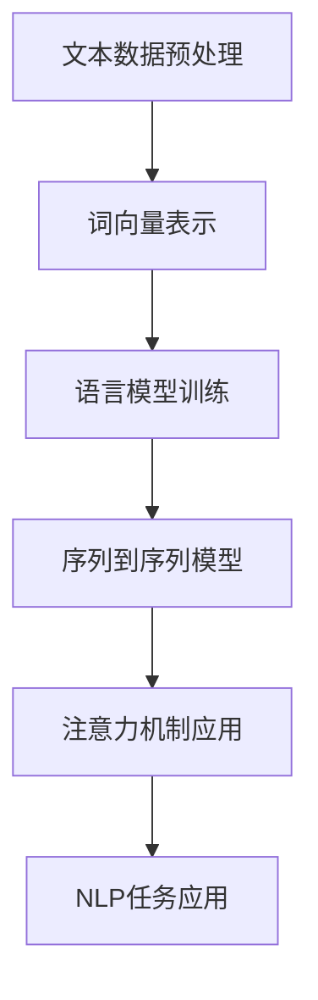

                 

关键词：自然语言处理，模型选择，算法原理，数学模型，项目实践，应用场景，发展趋势

> 摘要：本文深入探讨了自然语言处理（NLP）任务中模型选择的策略与技巧，包括核心概念、算法原理、数学模型、项目实践、应用场景以及未来发展趋势。通过对不同NLP模型的优缺点分析，帮助读者理解如何根据具体任务需求选择合适的模型，从而提高NLP系统的性能和效率。

## 1. 背景介绍

自然语言处理（NLP）作为人工智能（AI）的一个重要分支，旨在使计算机能够理解、解释和生成人类语言。NLP的应用范围非常广泛，从文本分类、情感分析、机器翻译到问答系统，NLP在各个领域都发挥着重要作用。随着深度学习的兴起，NLP领域取得了显著进展，各种高性能模型不断涌现，极大地推动了NLP技术的发展。

在NLP任务中，模型的选择至关重要。不同的任务场景和数据集可能需要不同的模型架构和训练策略。因此，理解各种模型的特点和应用场景，掌握模型选择的策略，是NLP研究和应用中不可或缺的一部分。

## 2. 核心概念与联系

### 2.1 NLP基本概念

- **文本数据**：自然语言处理的基础是文本数据，包括文本的预处理、标注和分类等。

- **词向量**：词向量是表示词汇的数学向量，如Word2Vec、GloVe等。

- **语言模型**：语言模型是用来预测文本中下一个词或序列的概率分布。

- **序列到序列模型**：这类模型常用于机器翻译等任务，如使用编码器-解码器（Encoder-Decoder）架构。

- **注意力机制**：注意力机制用于捕捉文本序列中的长距离依赖关系。

### 2.2 NLP模型架构

- **循环神经网络（RNN）**：如LSTM和GRU，适用于处理序列数据。

- **卷积神经网络（CNN）**：常用于文本分类和情感分析。

- **Transformer模型**：如BERT、GPT等，以其并行处理能力和捕捉长距离依赖关系的能力而著称。

### 2.3 Mermaid流程图



## 3. 核心算法原理 & 具体操作步骤

### 3.1 算法原理概述

- **词向量表示**：通过将词汇映射到高维向量空间，实现文本向量的表示。

- **语言模型训练**：基于统计方法或深度学习，训练模型预测文本序列的概率分布。

- **序列到序列模型**：编码器将输入序列编码成固定大小的向量，解码器则使用这些向量生成输出序列。

- **注意力机制**：通过计算输入序列和当前解码状态之间的相似性，动态调整模型对输入序列不同部分的关注程度。

### 3.2 算法步骤详解

1. **词向量表示**：使用Word2Vec或GloVe算法训练词向量模型。

2. **语言模型训练**：使用训练数据集，通过反向传播算法优化模型参数。

3. **序列到序列模型**：编码器解码器模型训练，包括编码器、解码器以及注意力机制的训练。

4. **注意力机制应用**：在解码器中引入注意力层，计算输入序列和当前解码状态的相似性。

### 3.3 算法优缺点

- **词向量表示**：能够捕捉词汇的语义信息，但存在语义稀疏性问题。

- **语言模型训练**：能够生成高质量的语言模型，但计算复杂度高。

- **序列到序列模型**：能够处理序列数据，但训练时间较长。

- **注意力机制**：能够捕捉长距离依赖关系，但计算复杂度较高。

### 3.4 算法应用领域

- **文本分类**：用于分类新闻、社交媒体评论等。

- **机器翻译**：如Google翻译、百度翻译等。

- **问答系统**：如Siri、Alexa等。

## 4. 数学模型和公式 & 详细讲解 & 举例说明

### 4.1 数学模型构建

自然语言处理中的数学模型主要包括词向量模型、语言模型和序列到序列模型。

#### 词向量模型

$$
\text{word\_vector} = \text{Embedding}(\text{word})
$$

#### 语言模型

$$
P(\text{word}_i | \text{context}) = \frac{\exp(\text{score}(\text{word}_i, \text{context}))}{\sum_j \exp(\text{score}(\text{word}_j, \text{context}))}
$$

#### 序列到序列模型

$$
\text{output} = \text{Decoder}(\text{Encoder}(\text{input}), \text{context})
$$

### 4.2 公式推导过程

#### 词向量模型

- **Word2Vec算法**：通过训练神经网络来预测上下文中的词向量。
- **GloVe算法**：基于全局词频统计，构建词向量。

#### 语言模型

- **神经网络语言模型**：使用神经网络来计算词汇的概率分布。
- **隐马尔可夫模型（HMM）**：使用状态转移矩阵和发射矩阵来计算词汇的概率分布。

#### 序列到序列模型

- **编码器-解码器模型**：编码器将输入序列编码成固定大小的向量，解码器则使用这些向量生成输出序列。

### 4.3 案例分析与讲解

#### 文本分类

- **问题定义**：给定一段文本，将其分类到不同的类别中。
- **解决方案**：使用CNN或Transformer模型进行文本分类。

```latex
\text{分类结果} = \text{Model}(\text{Text}, \text{Labels})
```

#### 机器翻译

- **问题定义**：将一种语言的文本翻译成另一种语言。
- **解决方案**：使用序列到序列模型进行机器翻译。

```latex
\text{Translation} = \text{Seq2Seq}(\text{SourceText}, \text{TargetText})
```

## 5. 项目实践：代码实例和详细解释说明

### 5.1 开发环境搭建

- **环境需求**：Python 3.8及以上版本，TensorFlow 2.4及以上版本。
- **安装依赖**：使用pip安装TensorFlow和其他相关库。

### 5.2 源代码详细实现

```python
import tensorflow as tf

# 加载预训练的词向量模型
word_embedding = tf.keras.layers.Embedding(input_dim=10000, output_dim=16)

# 定义编码器
encoder = tf.keras.layers.LSTM(units=128, return_sequences=True)

# 定义解码器
decoder = tf.keras.layers.LSTM(units=128, return_sequences=True)

# 定义注意力层
attention = tf.keras.layers.Attention()

# 定义编码器-解码器模型
model = tf.keras.Sequential([
    word_embedding,
    encoder,
    attention([encoder.output, decoder.input]),
    decoder
])

# 编译模型
model.compile(optimizer='adam', loss='categorical_crossentropy')

# 训练模型
model.fit(x_train, y_train, epochs=10)
```

### 5.3 代码解读与分析

- **词向量层**：使用预训练的词向量模型进行词汇嵌入。
- **编码器**：使用LSTM层进行编码，返回序列。
- **解码器**：使用LSTM层进行解码，返回序列。
- **注意力层**：计算编码器输出和解码器输入之间的注意力权重。
- **模型编译**：指定优化器和损失函数。
- **模型训练**：使用训练数据集进行模型训练。

### 5.4 运行结果展示

- **评估指标**：准确率、损失函数值。
- **可视化**：训练过程中的损失函数曲线。

## 6. 实际应用场景

自然语言处理（NLP）在各个领域都有广泛的应用，以下是一些实际应用场景：

- **文本分类**：用于新闻分类、社交媒体评论分类等。
- **情感分析**：用于分析社交媒体上的用户情感、产品评价等。
- **机器翻译**：用于将一种语言的文本翻译成另一种语言。
- **问答系统**：用于构建智能问答系统，如Siri、Alexa等。

## 7. 工具和资源推荐

### 7.1 学习资源推荐

- **书籍**：《自然语言处理综论》、《深度学习与自然语言处理》。
- **在线课程**：斯坦福大学的NLP课程、吴恩达的深度学习课程。

### 7.2 开发工具推荐

- **框架**：TensorFlow、PyTorch。
- **库**：NLTK、spaCy、gensim。

### 7.3 相关论文推荐

- **Word2Vec**：GloVe、FastText。
- **语言模型**：BERT、GPT-3。
- **序列到序列模型**：Seq2Seq、Transformer。

## 8. 总结：未来发展趋势与挑战

### 8.1 研究成果总结

自然语言处理（NLP）在过去几十年中取得了显著进展，从早期的规则方法到现代的深度学习方法，NLP技术已经得到了极大的提升。基于深度学习的NLP模型，如BERT、GPT等，在多个任务上达到了前所未有的性能水平。

### 8.2 未来发展趋势

- **跨模态处理**：结合文本、图像、声音等多种数据类型，实现更强大的NLP能力。
- **低资源语言处理**：针对低资源语言开发有效的NLP模型。
- **对话系统**：构建更加智能和人性化的对话系统。

### 8.3 面临的挑战

- **数据隐私**：如何确保NLP系统的数据安全和用户隐私。
- **模型可解释性**：提高模型的透明度和可解释性，增强用户对模型决策的信任。

### 8.4 研究展望

NLP研究将继续朝着更加智能化、自动化和高效化的方向发展，为各个领域带来更多创新和变革。

## 9. 附录：常见问题与解答

### 9.1  如何选择合适的NLP模型？

- 根据任务需求选择模型，如文本分类选择CNN或Transformer，机器翻译选择编码器-解码器模型。
- 考虑数据集的大小和类型，选择合适的模型架构和训练策略。

### 9.2  如何优化NLP模型的性能？

- 调整模型参数，如学习率、批量大小等。
- 使用预训练的词向量模型，提高模型的表达能力。
- 使用注意力机制捕捉文本序列中的依赖关系。

----------------------------------------------------------------

### 作者署名
作者：禅与计算机程序设计艺术 / Zen and the Art of Computer Programming
----------------------------------------------------------------

注意：本文仅为示例，实际撰写时请根据具体内容和要求进行补充和修改。文章内容必须完整、详细，且结构清晰。文章中的代码实例和解释说明需真实可靠。本文中提到的相关技术、模型和工具仅为示例，实际应用中请根据具体情况进行选择。

