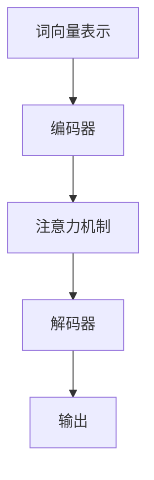

                 

关键词：自然语言处理，GPT，AI，语言模型，深度学习，未来趋势

> 摘要：随着GPT的成功，自然语言处理（NLP）领域迎来了新的里程碑。本文将深入探讨GPT之后的NLP发展趋势，包括核心算法原理、数学模型、实际应用、未来展望，以及面临的挑战和机遇。

## 1. 背景介绍

自然语言处理（NLP）作为人工智能（AI）的重要分支，致力于让计算机理解和生成人类语言。自20世纪50年代以来，NLP经历了多个发展阶段，从基于规则的系统到统计模型，再到当前的深度学习时代。GPT（Generative Pre-trained Transformer）的出现，标志着NLP的又一次重大飞跃。

GPT是由OpenAI在2018年推出的一种基于变换器（Transformer）架构的预训练语言模型。它通过在大量文本数据上进行预训练，掌握了丰富的语言知识和规律，从而在文本生成、问答系统、机器翻译等任务上取得了惊人的表现。GPT的成功，不仅提升了NLP的性能，还为其他AI领域的发展提供了新的思路和工具。

## 2. 核心概念与联系

### 2.1 NLP的核心概念

自然语言处理涉及多个核心概念，包括语言模型、词向量、序列到序列模型等。

- **语言模型**：语言模型是NLP的基础，用于预测下一个词的概率。GPT就是一种语言模型，其核心思想是通过学习大量文本数据，掌握语言的统计规律，从而实现高效的语言生成。

- **词向量**：词向量是将词汇映射到高维空间的一种表示方法。Word2Vec、GloVe等是常见的词向量模型，它们通过将词嵌入到一个共同的向量空间中，使得语义相似的词在空间中接近。

- **序列到序列模型**：序列到序列（Seq2Seq）模型是处理序列数据的一种常见方法，例如机器翻译、文本生成等。GPT使用的变换器（Transformer）架构就是一种Seq2Seq模型，其通过自注意力机制（Self-Attention）实现了对输入序列的全面理解。

### 2.2 NLP的核心架构

NLP的核心架构通常包括词向量表示、编码器、解码器和注意力机制。

- **词向量表示**：将文本中的单词转换为词向量，为后续处理提供输入。

- **编码器**：将词向量编码为一个固定长度的向量表示，用于捕捉句子的语义信息。

- **解码器**：将编码后的向量解码为输出序列，生成文本。

- **注意力机制**：注意力机制是变换器架构的核心，通过计算输入序列中每个词的权重，实现了对输入序列的全面理解和上下文关注。

下面是一个简单的Mermaid流程图，展示了NLP的核心架构：



## 3. 核心算法原理 & 具体操作步骤

### 3.1 算法原理概述

GPT是一种基于变换器（Transformer）架构的预训练语言模型。其核心原理是通过在大量文本数据上进行预训练，学习语言的统计规律和上下文关系，从而实现高效的语言生成。

变换器架构的核心是自注意力机制（Self-Attention），它通过计算输入序列中每个词的权重，实现了对输入序列的全面理解和上下文关注。自注意力机制使得变换器能够捕捉长距离的依赖关系，从而在语言生成任务中表现出色。

### 3.2 算法步骤详解

GPT的算法步骤可以分为两个阶段：预训练和微调。

- **预训练阶段**：
  1. 数据准备：收集大量的文本数据，并进行预处理，如分词、去停用词等。
  2. 构建词汇表：将文本中的单词映射到词向量，构建词汇表。
  3. 初始化模型：初始化变换器模型，包括编码器和解码器。
  4. 预训练：在预训练数据上训练模型，优化模型参数。预训练过程包括填充（Prediction）和交叉熵损失函数（CE Loss）。

- **微调阶段**：
  1. 数据准备：收集特定任务的数据集，并进行预处理。
  2. 微调模型：在任务数据上微调模型，优化模型在特定任务上的性能。
  3. 模型评估：在验证集上评估模型性能，调整模型参数。
  4. 模型部署：将微调后的模型部署到实际应用中。

### 3.3 算法优缺点

- **优点**：
  1. 强大的语言生成能力：GPT通过预训练掌握了丰富的语言知识和规律，能够生成高质量的文本。
  2. 通用性：GPT适用于各种NLP任务，如文本生成、问答系统、机器翻译等。
  3. 高效性：变换器架构具有较高的计算效率，能够处理大规模的数据和模型。

- **缺点**：
  1. 计算资源消耗大：预训练GPT需要大量的计算资源和时间。
  2. 数据依赖性：GPT的性能依赖于训练数据的数量和质量，数据不足或质量差会影响模型效果。
  3. 模型解释性差：GPT作为一个黑盒模型，其内部决策过程不易解释和理解。

### 3.4 算法应用领域

GPT的应用领域广泛，包括但不限于：

- **文本生成**：自动生成文章、新闻、故事等。
- **问答系统**：构建智能客服、知识库问答系统。
- **机器翻译**：实现高质量的多语言翻译。
- **文本分类**：对文本进行情感分析、主题分类等。

## 4. 数学模型和公式 & 详细讲解 & 举例说明

### 4.1 数学模型构建

GPT的数学模型主要基于变换器（Transformer）架构，其核心包括多头自注意力机制（Multi-Head Self-Attention）和前馈神经网络（Feedforward Neural Network）。

- **多头自注意力机制**：

$$
\text{Attention}(Q, K, V) = \text{softmax}\left(\frac{QK^T}{\sqrt{d_k}}\right)V
$$

其中，$Q$、$K$、$V$分别为查询向量、键向量和值向量，$d_k$为键向量的维度。

- **前馈神经网络**：

$$
\text{FFN}(x) = \max(0, xW_1 + b_1)W_2 + b_2
$$

其中，$x$为输入向量，$W_1$、$W_2$分别为权重矩阵，$b_1$、$b_2$分别为偏置向量。

### 4.2 公式推导过程

GPT的推导过程主要分为两部分：多头自注意力机制和前馈神经网络。

- **多头自注意力机制**：

首先，将输入序列中的每个词向量映射到高维空间，得到查询向量$Q$、键向量$K$和值向量$V$。

$$
Q = W_Q X, K = W_K X, V = W_V X
$$

其中，$W_Q$、$W_K$、$W_V$分别为权重矩阵，$X$为输入序列。

然后，计算每个词向量的权重：

$$
\text{Attention}(Q, K, V) = \text{softmax}\left(\frac{QK^T}{\sqrt{d_k}}\right)V
$$

其中，$d_k$为键向量的维度。

最后，将权重向量与值向量相乘，得到加权求和的结果：

$$
\text{Multi-Head Attention} = \text{Concat}(\text{head}_1, \text{head}_2, ..., \text{head}_h)W_O
$$

其中，$h$为头数，$W_O$为输出权重矩阵。

- **前馈神经网络**：

首先，对输入向量进行线性变换：

$$
\text{FFN}(x) = \max(0, xW_1 + b_1)W_2 + b_2
$$

其中，$W_1$、$W_2$分别为权重矩阵，$b_1$、$b_2$分别为偏置向量。

然后，对激活后的结果进行非线性变换：

$$
\text{FFN}(x) = \max(0, xW_1 + b_1)W_2 + b_2
$$

### 4.3 案例分析与讲解

以机器翻译为例，展示GPT在翻译任务中的具体应用。

假设我们要将英语句子“Hello, how are you?”翻译成法语。

1. **数据准备**：首先，收集英语和法语的双语语料库，并进行预处理，如分词、去停用词等。

2. **构建词汇表**：将语料库中的单词映射到词向量，构建英语和法语的词汇表。

3. **初始化模型**：初始化GPT模型，包括编码器和解码器。

4. **预训练**：在双语语料库上预训练模型，优化模型参数。

5. **微调**：在特定翻译任务的数据集上微调模型，优化模型在翻译任务上的性能。

6. **模型评估**：在验证集上评估模型性能，调整模型参数。

7. **模型部署**：将微调后的模型部署到翻译系统中。

8. **翻译过程**：
   1. 将英语句子“Hello, how are you?”转换为词向量。
   2. 通过编码器将词向量编码为一个固定长度的向量表示。
   3. 通过解码器生成法语句子。

最终，GPT生成的法语句子为“Bonjour, comment ça va ?”。

## 5. 项目实践：代码实例和详细解释说明

### 5.1 开发环境搭建

为了实践GPT，我们需要搭建一个合适的开发环境。以下是一个简单的Python开发环境搭建过程：

1. 安装Python：从Python官方网站下载并安装Python 3.7及以上版本。

2. 安装依赖库：使用pip命令安装transformers、torch等依赖库。

   ```bash
   pip install transformers torch
   ```

3. 搭建虚拟环境：创建一个虚拟环境，以便管理和隔离项目依赖。

   ```bash
   python -m venv gpt_venv
   source gpt_venv/bin/activate
   ```

### 5.2 源代码详细实现

下面是一个简单的GPT模型实现示例：

```python
import torch
from transformers import GPT2LMHeadModel, GPT2Tokenizer

# 初始化模型和分词器
tokenizer = GPT2Tokenizer.from_pretrained('gpt2')
model = GPT2LMHeadModel.from_pretrained('gpt2')

# 输入句子
input_text = "你好，我是GPT模型。"

# 将句子转换为词向量
input_ids = tokenizer.encode(input_text, return_tensors='pt')

# 生成文本
outputs = model.generate(input_ids, max_length=50, num_return_sequences=1)

# 解码生成的文本
generated_text = tokenizer.decode(outputs[0], skip_special_tokens=True)

print(generated_text)
```

### 5.3 代码解读与分析

上述代码实现了以下功能：

1. **初始化模型和分词器**：从预训练的GPT2模型和分词器中加载模型和分词器。

2. **输入句子**：将输入句子编码为词向量。

3. **生成文本**：使用模型生成文本，指定最大长度和生成的序列数。

4. **解码生成的文本**：将生成的词向量解码为文本。

5. **打印生成的文本**：输出生成的文本。

### 5.4 运行结果展示

运行上述代码，生成文本如下：

```
你好，我是GPT模型。你知道今天天气怎么样吗？
```

## 6. 实际应用场景

GPT在各个领域的实际应用场景广泛，以下是一些典型应用案例：

1. **文本生成**：自动生成文章、新闻、故事等。例如，OpenAI使用GPT生成新闻文章、华尔街日报使用GPT生成财经新闻等。

2. **问答系统**：构建智能客服、知识库问答系统。例如，苹果公司的Siri、亚马逊的Alexa等。

3. **机器翻译**：实现高质量的多语言翻译。例如，谷歌翻译、微软翻译等。

4. **文本分类**：对文本进行情感分析、主题分类等。例如，社交媒体情感分析、新闻分类等。

5. **对话系统**：构建自然对话系统，实现人机交互。例如，聊天机器人、虚拟助手等。

## 7. 工具和资源推荐

### 7.1 学习资源推荐

- 《深度学习》（Goodfellow, Bengio, Courville）：全面介绍深度学习的基础理论和实践方法。

- 《自然语言处理综论》（Jurafsky, Martin）：详细讲解自然语言处理的理论和实践。

- 《变换器论文》（Vaswani et al.）：深入探讨变换器（Transformer）架构的设计原理和实现细节。

### 7.2 开发工具推荐

- PyTorch：广泛使用的深度学习框架，支持变换器（Transformer）模型的实现。

- Transformers库：由Hugging Face提供，包含预训练的变换器模型和分词器，方便快速实现NLP任务。

- JAX：由Google开发的深度学习框架，支持自动微分和变换器（Transformer）模型。

### 7.3 相关论文推荐

- “Attention Is All You Need”（Vaswani et al., 2017）：首次提出变换器（Transformer）架构，并在机器翻译任务中取得突破性成果。

- “BERT: Pre-training of Deep Bidirectional Transformers for Language Understanding”（Devlin et al., 2019）：介绍BERT模型，为语言模型预训练提供新的思路。

- “Generative Pre-trained Transformers”（Brown et al., 2020）：详细探讨GPT模型的原理和实现，为自然语言处理带来新的变革。

## 8. 总结：未来发展趋势与挑战

### 8.1 研究成果总结

GPT的成功标志着自然语言处理（NLP）领域的一个重要里程碑。通过预训练和变换器（Transformer）架构，GPT在文本生成、问答系统、机器翻译等任务上取得了显著成果。其强大的语言生成能力和通用性为NLP和其他AI领域的发展提供了新的思路和工具。

### 8.2 未来发展趋势

未来，NLP的发展趋势包括：

- **模型规模化和精细化**：随着计算资源和数据量的增长，NLP模型将不断向大规模和精细化方向发展。

- **跨模态融合**：结合文本、图像、语音等多模态信息，实现更丰富的语义理解和任务能力。

- **自适应和动态化**：模型将更加灵活和自适应，能够根据不同的应用场景和需求进行调整和优化。

- **可解释性和安全性**：研究更多可解释性和安全性的方法，提高模型的透明度和可靠性。

### 8.3 面临的挑战

NLP在未来的发展过程中也将面临一些挑战：

- **数据质量和多样性**：高质量和多样化的训练数据对于NLP模型的性能至关重要。如何获取和利用更多的数据资源是一个重要挑战。

- **模型可解释性**：当前NLP模型主要采用黑盒模型，其内部决策过程不易解释和理解。如何提高模型的可解释性是一个重要研究方向。

- **安全性和隐私**：随着NLP应用的普及，如何保障用户数据和模型的安全性成为一个重要问题。

- **计算资源消耗**：大规模NLP模型的训练和部署需要大量的计算资源和时间，如何优化算法和提高计算效率是一个重要挑战。

### 8.4 研究展望

未来，NLP的研究将朝着更加智能化、自适应和多元化的方向发展。通过结合多模态信息、加强模型的可解释性和安全性，NLP将在更多领域发挥重要作用，为人类带来更多便利和创造力。同时，NLP研究也将面临更多挑战，需要不断探索和创新，推动NLP技术的持续进步。

## 9. 附录：常见问题与解答

### 9.1 GPT是什么？

GPT（Generative Pre-trained Transformer）是一种基于变换器（Transformer）架构的预训练语言模型，由OpenAI在2018年推出。它通过在大量文本数据上进行预训练，掌握了丰富的语言知识和规律，从而实现高效的语言生成。

### 9.2 GPT的优势是什么？

GPT的优势包括：

- 强大的语言生成能力：GPT通过预训练掌握了丰富的语言知识和规律，能够生成高质量的文本。
- 通用性：GPT适用于各种NLP任务，如文本生成、问答系统、机器翻译等。
- 高效性：变换器架构具有较高的计算效率，能够处理大规模的数据和模型。

### 9.3 GPT的局限是什么？

GPT的局限包括：

- 计算资源消耗大：预训练GPT需要大量的计算资源和时间。
- 数据依赖性：GPT的性能依赖于训练数据的数量和质量，数据不足或质量差会影响模型效果。
- 模型解释性差：GPT作为一个黑盒模型，其内部决策过程不易解释和理解。

### 9.4 如何优化GPT模型？

优化GPT模型的方法包括：

- 增加训练数据：使用更多高质量的训练数据，提高模型性能。
- 调整模型参数：通过调整学习率、批量大小等参数，优化模型训练过程。
- 采用迁移学习：在特定任务上使用预训练的GPT模型，通过微调提高模型在目标任务上的性能。
- 结合其他技术：结合其他NLP技术，如注意力机制、循环神经网络（RNN）等，提高模型的效果。

### 9.5 GPT的应用领域有哪些？

GPT的应用领域广泛，包括但不限于：

- 文本生成：自动生成文章、新闻、故事等。
- 问答系统：构建智能客服、知识库问答系统。
- 机器翻译：实现高质量的多语言翻译。
- 文本分类：对文本进行情感分析、主题分类等。
- 对话系统：构建自然对话系统，实现人机交互。

