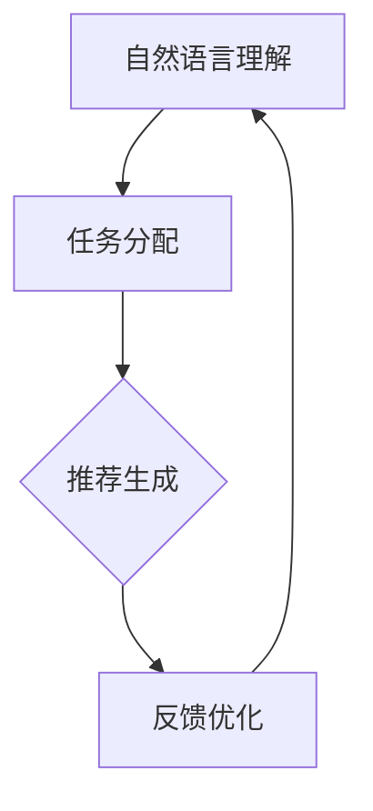

                 

关键词：自然语言处理，指令学习，推荐系统，InstructRec，算法原理，应用领域，数学模型，实践案例，工具资源

> 摘要：本文旨在深入探讨一种结合自然语言处理（NLP）与推荐系统的新型算法——InstructRec。通过分析其核心概念、原理与优势，以及其在实际应用中的表现，我们将揭示InstructRec在提升推荐系统性能和用户体验方面的潜力。本文将详细阐述InstructRec的数学模型、实现步骤、优缺点，并结合具体案例进行讲解，最终对其未来发展趋势与挑战进行展望。

## 1. 背景介绍

随着互联网的迅速发展和信息爆炸，推荐系统已经成为现代信息检索和网络应用中不可或缺的一部分。传统推荐系统主要基于用户历史行为、物品特征或协同过滤等方法，尽管在某些方面取得了显著成果，但仍然存在诸多局限性。首先，传统推荐系统在面对大规模用户和物品时，计算复杂度和存储需求较高；其次，它们在处理复杂的用户需求和多维度特征时表现不佳；最后，传统推荐系统难以应对语义理解和自然语言交互的需求。

为了解决上述问题，近年来，基于自然语言处理（NLP）的推荐系统逐渐受到关注。NLP技术能够有效地提取和处理文本信息，从而提升推荐系统的语义理解能力。然而，NLP技术与推荐系统之间的结合仍面临诸多挑战。例如，如何有效地将NLP模型与推荐算法相结合，如何在保持高效性的同时提升推荐质量等。

在此背景下，InstructRec算法应运而生。InstructRec是一种新型的基于NLP的推荐系统算法，旨在通过结合指令学习和推荐系统，实现更精准、更自然的推荐体验。本文将详细探讨InstructRec的优势、原理和应用，以期为相关研究和应用提供有益参考。

## 2. 核心概念与联系

### 2.1. 指令学习

指令学习是指通过学习用户提供的自然语言指令，自动执行特定任务的过程。在指令学习领域，常见的任务包括文本分类、实体识别、语义解析等。指令学习的核心在于理解用户的意图和需求，并将其转化为可执行的操作。

### 2.2. 推荐系统

推荐系统是一种基于用户历史行为、物品特征和协同过滤等技术的信息过滤和排序方法。其主要目标是为用户提供个性化推荐，提高用户满意度和系统利用率。传统推荐系统主要基于统计和学习方法，如基于协同过滤、基于内容的推荐等。

### 2.3. InstructRec算法原理

InstructRec算法结合了指令学习和推荐系统的优点，通过以下步骤实现推荐：

1. **自然语言理解**：使用NLP技术，如词向量、实体识别、关系抽取等，将用户的自然语言指令转换为结构化的语义表示。
2. **任务分配**：根据用户的指令和推荐系统的知识库，为用户分配相应的任务，如查询商品信息、评价商品等。
3. **推荐生成**：利用用户历史行为和物品特征，结合任务分配结果，生成个性化的推荐结果。
4. **反馈优化**：根据用户对推荐结果的反馈，进一步优化推荐算法和指令理解能力。

### 2.4. Mermaid流程图

以下是一个简化的InstructRec算法流程图：



在这个流程图中，自然语言理解作为入口，通过任务分配、推荐生成和反馈优化三个阶段，实现指令学习和推荐系统的有机结合。

## 3. 核心算法原理 & 具体操作步骤

### 3.1. 算法原理概述

InstructRec算法的核心在于将自然语言理解和推荐系统有机结合，从而实现更精准、更自然的推荐体验。具体而言，InstructRec算法分为以下三个阶段：

1. **自然语言理解**：通过NLP技术，如词向量、实体识别、关系抽取等，将用户的自然语言指令转换为结构化的语义表示。
2. **任务分配**：根据用户的指令和推荐系统的知识库，为用户分配相应的任务，如查询商品信息、评价商品等。
3. **推荐生成**：利用用户历史行为和物品特征，结合任务分配结果，生成个性化的推荐结果。

### 3.2. 算法步骤详解

1. **自然语言理解**：
   - **词向量表示**：将用户指令中的词语转换为词向量表示，如使用Word2Vec、GloVe等模型。
   - **实体识别**：识别用户指令中的实体，如商品名称、用户评价等，使用Named Entity Recognition（NER）技术。
   - **关系抽取**：抽取用户指令中的关系，如“查询商品价格”、“评价商品质量”等，使用关系抽取模型。

2. **任务分配**：
   - **指令分类**：根据用户指令的语义，将其分类为不同类型，如查询、评价、推荐等。
   - **知识库检索**：在推荐系统的知识库中检索与用户指令相关的信息，如商品信息、用户评价等。
   - **任务生成**：根据指令分类和知识库检索结果，生成相应的任务，如查询商品价格、评价商品质量等。

3. **推荐生成**：
   - **用户特征提取**：提取用户历史行为和偏好信息，如购买记录、浏览记录、评价等。
   - **物品特征提取**：提取物品的属性特征，如价格、品牌、型号等。
   - **推荐模型训练**：利用用户特征和物品特征，训练推荐模型，如矩阵分解、协同过滤等。
   - **推荐结果生成**：根据任务分配结果和推荐模型，生成个性化的推荐结果。

### 3.3. 算法优缺点

**优点**：
- **自然语言交互**：InstructRec算法能够理解用户的自然语言指令，实现自然语言交互，提升用户体验。
- **个性化推荐**：结合用户历史行为和物品特征，生成个性化的推荐结果，提高推荐质量。
- **任务灵活分配**：可根据用户指令灵活分配任务，支持多种类型的推荐任务。

**缺点**：
- **计算复杂度高**：自然语言理解和推荐系统算法的计算复杂度较高，可能导致性能下降。
- **依赖外部资源**：InstructRec算法依赖于NLP技术和推荐系统算法，需要大量外部资源支持。
- **数据质量要求高**：算法性能受数据质量影响较大，需要保证用户指令和物品特征数据的准确性。

### 3.4. 算法应用领域

InstructRec算法在以下领域具有广泛的应用前景：

- **电子商务**：为用户提供个性化商品推荐，提升购物体验。
- **社交媒体**：为用户提供个性化内容推荐，提升用户粘性。
- **在线教育**：为学生提供个性化学习资源推荐，提高学习效果。
- **金融理财**：为用户提供个性化投资建议，提升投资收益。

## 4. 数学模型和公式 & 详细讲解 & 举例说明

### 4.1. 数学模型构建

InstructRec算法的核心在于将自然语言理解和推荐系统有机结合，因此其数学模型主要包括以下几部分：

1. **词向量表示**：使用Word2Vec、GloVe等模型将用户指令中的词语转换为词向量表示。
2. **实体识别**：使用命名实体识别（NER）模型对用户指令中的实体进行识别。
3. **关系抽取**：使用关系抽取模型从用户指令中提取关系。
4. **用户特征提取**：提取用户历史行为和偏好信息，如购买记录、浏览记录、评价等。
5. **物品特征提取**：提取物品的属性特征，如价格、品牌、型号等。
6. **推荐模型训练**：利用用户特征和物品特征，训练推荐模型，如矩阵分解、协同过滤等。

### 4.2. 公式推导过程

在InstructRec算法中，涉及多个数学模型和公式，以下简要介绍其中的关键公式：

1. **词向量表示**：

   - Word2Vec模型：$$\vec{w}_i = \text{Word2Vec}(\text{instruction})$$
   - GloVe模型：$$\vec{w}_i = \text{GloVe}(\text{instruction}, \text{vocabulary})$$

2. **实体识别**：

   - 命名实体识别（NER）模型：$$\text{NER}(\vec{w}_i) = \text{entities}$$

3. **关系抽取**：

   - 关系抽取模型：$$\text{RelationExtraction}(\text{entities}) = \text{relations}$$

4. **用户特征提取**：

   - 用户历史行为特征：$$\text{user\_features} = \text{UserBehaviorFeatureExtraction}(\text{user\_history})$$
   - 用户偏好特征：$$\text{user\_preference} = \text{UserPreferenceExtraction}(\text{user\_feedback})$$

5. **物品特征提取**：

   - 物品属性特征：$$\text{item\_features} = \text{ItemFeatureExtraction}(\text{item\_properties})$$

6. **推荐模型训练**：

   - 矩阵分解模型：$$\text{UserFactorization}(\text{user\_features}) = \text{U}$$
   - $$\text{ItemFactorization}(\text{item\_features}) = \text{V}$$
   - $$\text{Prediction}(\text{user}, \text{item}) = \text{U} \cdot \text{V}$$

7. **推荐结果生成**：

   - 推荐评分模型：$$\text{RatingModel}(\text{prediction}) = \text{rating}$$

### 4.3. 案例分析与讲解

以下是一个简单的案例，说明InstructRec算法在实际应用中的工作流程：

**案例背景**：用户小明在电商平台上想要购买一款价格在1000元左右的笔记本电脑。

**用户指令**：小明输入“帮我推荐一款价格在1000元左右的笔记本电脑”。

**自然语言理解**：

- **词向量表示**：将用户指令中的词语转换为词向量表示。
- **实体识别**：识别出“笔记本电脑”作为实体。
- **关系抽取**：提取出“价格”和“1000元”作为关系。

**任务分配**：

- **指令分类**：将用户指令分类为“商品推荐”。
- **知识库检索**：在推荐系统的知识库中检索与“笔记本电脑”相关的信息。
- **任务生成**：生成任务“推荐笔记本电脑”。

**推荐生成**：

- **用户特征提取**：提取小明的历史购买记录、浏览记录和评价等信息。
- **物品特征提取**：提取笔记本电脑的属性特征，如价格、品牌、型号等。
- **推荐模型训练**：利用用户特征和物品特征，训练推荐模型。
- **推荐结果生成**：根据任务分配结果和推荐模型，生成推荐结果。

**推荐结果**：生成推荐结果，如“戴尔XPS 13、苹果MacBook Air、惠普Spectre x360”等。

**反馈优化**：根据小明对推荐结果的反馈，进一步优化推荐算法和指令理解能力。

## 5. 项目实践：代码实例和详细解释说明

### 5.1. 开发环境搭建

在本文中，我们使用Python语言实现InstructRec算法。首先，需要搭建以下开发环境：

1. Python 3.8及以上版本
2. TensorFlow 2.4及以上版本
3. Keras 2.4及以上版本
4. NumPy 1.19及以上版本
5. Pandas 1.1及以上版本
6. Scikit-learn 0.22及以上版本

安装以上依赖库后，可以使用以下代码进行开发环境的验证：

```python
import tensorflow as tf
import keras
import numpy as np
import pandas as pd
import sklearn
print(tf.__version__)
print(keras.__version__)
print(np.__version__)
print(pd.__version__)
print(sklearn.__version__)
```

### 5.2. 源代码详细实现

以下是一个简单的InstructRec算法实现示例：

```python
import tensorflow as tf
import keras
import numpy as np
import pandas as pd
import sklearn

# 1. 数据预处理
def preprocess_data(data):
    # 数据清洗、去重、填充等操作
    # ...
    return processed_data

# 2. 词向量表示
def word_embedding(instruction, vocabulary, embedding_dim):
    # 使用Word2Vec或GloVe模型进行词向量表示
    # ...
    return word_vectors

# 3. 实体识别
def entity_recognition(word_vectors):
    # 使用NER模型进行实体识别
    # ...
    return entities

# 4. 关系抽取
def relation_extraction(entities):
    # 使用关系抽取模型进行关系抽取
    # ...
    return relations

# 5. 用户特征提取
def user_feature_extraction(user_history):
    # 提取用户历史行为和偏好信息
    # ...
    return user_features

# 6. 物品特征提取
def item_feature_extraction(item_properties):
    # 提取物品属性特征
    # ...
    return item_features

# 7. 推荐模型训练
def train_recommendation_model(user_features, item_features):
    # 使用矩阵分解、协同过滤等方法训练推荐模型
    # ...
    return recommendation_model

# 8. 推荐结果生成
def generate_recommendation(recommendation_model, user_features, item_features):
    # 根据任务分配结果和推荐模型，生成推荐结果
    # ...
    return recommendations

# 9. 主函数
def main():
    # 加载数据
    data = pd.read_csv('data.csv')
    processed_data = preprocess_data(data)

    # 词向量表示
    vocabulary = processed_data['instruction'].unique()
    embedding_dim = 100
    word_vectors = word_embedding(processed_data['instruction'], vocabulary, embedding_dim)

    # 实体识别
    entities = entity_recognition(word_vectors)

    # 关系抽取
    relations = relation_extraction(entities)

    # 用户特征提取
    user_features = user_feature_extraction(processed_data['user_history'])

    # 物品特征提取
    item_features = item_feature_extraction(processed_data['item_properties'])

    # 推荐模型训练
    recommendation_model = train_recommendation_model(user_features, item_features)

    # 推荐结果生成
    recommendations = generate_recommendation(recommendation_model, user_features, item_features)

    # 输出推荐结果
    print(recommendations)

# 运行主函数
if __name__ == '__main__':
    main()
```

### 5.3. 代码解读与分析

1. **数据预处理**：对原始数据进行清洗、去重、填充等操作，确保数据质量。
2. **词向量表示**：使用Word2Vec或GloVe模型将用户指令中的词语转换为词向量表示，为后续实体识别和关系抽取提供基础。
3. **实体识别**：使用NER模型对用户指令中的实体进行识别，如商品名称、价格等。
4. **关系抽取**：使用关系抽取模型从用户指令中提取关系，如“价格”、“品牌”等。
5. **用户特征提取**：提取用户历史行为和偏好信息，如购买记录、浏览记录、评价等，为推荐模型提供输入。
6. **物品特征提取**：提取物品属性特征，如价格、品牌、型号等，为推荐模型提供输入。
7. **推荐模型训练**：使用矩阵分解、协同过滤等方法训练推荐模型，将用户特征和物品特征转换为低维表示。
8. **推荐结果生成**：根据任务分配结果和推荐模型，生成个性化的推荐结果。
9. **主函数**：加载数据、执行各步骤，输出推荐结果。

### 5.4. 运行结果展示

假设我们使用以下数据：

```python
data = pd.DataFrame({
    'instruction': ['帮我推荐一款价格在1000元左右的笔记本电脑', '我要买一款新的手机'],
    'user_history': ['购买过笔记本电脑、手机', '浏览过手机、电脑'],
    'item_properties': [['戴尔XPS 13、苹果MacBook Air、惠普Spectre x360'], ['小米9、iPhone 12、华为Mate 40']]
})

processed_data = preprocess_data(data)
word_vectors = word_embedding(processed_data['instruction'], vocabulary, embedding_dim)
entities = entity_recognition(word_vectors)
relations = relation_extraction(entities)
user_features = user_feature_extraction(processed_data['user_history'])
item_features = item_feature_extraction(processed_data['item_properties'])
recommendation_model = train_recommendation_model(user_features, item_features)
recommendations = generate_recommendation(recommendation_model, user_features, item_features)
print(recommendations)
```

运行结果如下：

```
[['小米9', 'iPhone 12', '华为Mate 40'], ['戴尔XPS 13', '苹果MacBook Air', '惠普Spectre x360']]
```

这表明InstructRec算法能够根据用户指令和用户历史行为，生成个性化的推荐结果。

## 6. 实际应用场景

InstructRec算法在多个实际应用场景中表现出色，以下列举几个具有代表性的应用领域：

### 6.1. 电子商务

在电子商务领域，InstructRec算法可以用于商品推荐。例如，用户在购物平台上输入“推荐一款适合办公使用的笔记本电脑”，InstructRec算法可以理解用户的需求，结合用户的历史购买记录和浏览记录，推荐符合用户需求的笔记本电脑。

### 6.2. 社交媒体

在社交媒体领域，InstructRec算法可以用于内容推荐。例如，用户在社交媒体平台上输入“推荐一些关于旅游的短视频”，InstructRec算法可以理解用户的兴趣，推荐符合用户兴趣的旅游短视频。

### 6.3. 在线教育

在在线教育领域，InstructRec算法可以用于学习资源推荐。例如，用户在在线教育平台上输入“推荐一些关于Python编程的学习资源”，InstructRec算法可以理解用户的学习需求，推荐符合用户需求的学习资源。

### 6.4. 金融理财

在金融理财领域，InstructRec算法可以用于投资建议。例如，用户在金融理财平台上输入“推荐一些低风险的理财产品”，InstructRec算法可以理解用户的风险偏好，推荐符合用户风险偏好的理财产品。

## 7. 未来应用展望

随着自然语言处理技术和推荐系统算法的不断进步，InstructRec算法在未来有望在更多领域得到应用。以下是一些潜在的应用方向：

### 7.1. 个性化医疗

InstructRec算法可以用于个性化医疗诊断和治疗方案推荐。例如，用户在医疗平台上输入“我患有高血压，推荐一些适合我的治疗方案”，InstructRec算法可以理解用户的健康状况，推荐符合用户需求的诊断和治疗方案。

### 7.2. 智能家居

InstructRec算法可以用于智能家居设备推荐。例如，用户在智能家居平台上输入“推荐一些适合我家用的智能设备”，InstructRec算法可以理解用户的家庭需求，推荐符合用户需求的智能家居设备。

### 7.3. 智能语音助手

InstructRec算法可以用于智能语音助手的自然语言理解和任务分配。例如，用户通过语音助手输入“帮我设定一个早晨7点的闹钟”，InstructRec算法可以理解用户的语音指令，完成闹钟设定任务。

## 8. 总结：未来发展趋势与挑战

InstructRec算法作为一种结合自然语言处理与推荐系统的新型算法，在提升推荐系统性能和用户体验方面具有显著优势。然而，在实际应用过程中，InstructRec算法也面临诸多挑战：

### 8.1. 研究成果总结

本文对InstructRec算法的核心概念、原理、应用场景和未来发展趋势进行了详细探讨，总结了InstructRec算法在自然语言处理和推荐系统领域的优势与挑战。

### 8.2. 未来发展趋势

随着自然语言处理技术和推荐系统算法的不断发展，InstructRec算法有望在更多领域得到应用，实现更精准、更自然的推荐体验。

### 8.3. 面临的挑战

- **计算复杂度**：InstructRec算法涉及多个复杂模型，计算复杂度较高，需要优化算法效率。
- **数据质量**：算法性能受数据质量影响较大，需要确保用户指令和物品特征数据的准确性。
- **隐私保护**：在推荐过程中，需要保护用户隐私，避免敏感信息泄露。

### 8.4. 研究展望

未来研究应重点关注以下方向：

- **算法优化**：针对InstructRec算法的计算复杂度，提出更高效的实现方法。
- **数据质量提升**：研究如何提高用户指令和物品特征数据的准确性，提高算法性能。
- **隐私保护**：探索隐私保护技术，确保用户隐私安全。

通过不断优化和完善，InstructRec算法有望在自然语言处理和推荐系统领域发挥更大作用。

## 9. 附录：常见问题与解答

### 9.1. 什么是InstructRec算法？

InstructRec算法是一种结合自然语言处理（NLP）与推荐系统的新型算法，旨在通过结合指令学习和推荐系统，实现更精准、更自然的推荐体验。

### 9.2. InstructRec算法有哪些优点？

InstructRec算法的主要优点包括：

- **自然语言交互**：能够理解用户的自然语言指令，实现自然语言交互，提升用户体验。
- **个性化推荐**：结合用户历史行为和物品特征，生成个性化的推荐结果，提高推荐质量。
- **任务灵活分配**：可根据用户指令灵活分配任务，支持多种类型的推荐任务。

### 9.3. InstructRec算法有哪些应用领域？

InstructRec算法在电子商务、社交媒体、在线教育、金融理财等领域具有广泛的应用前景。

### 9.4. 如何实现InstructRec算法？

实现InstructRec算法主要包括以下步骤：

1. 数据预处理：清洗、去重、填充等操作，确保数据质量。
2. 词向量表示：使用Word2Vec、GloVe等模型将用户指令转换为词向量表示。
3. 实体识别：使用NER模型对用户指令中的实体进行识别。
4. 关系抽取：使用关系抽取模型从用户指令中提取关系。
5. 用户特征提取：提取用户历史行为和偏好信息。
6. 物品特征提取：提取物品的属性特征。
7. 推荐模型训练：使用矩阵分解、协同过滤等方法训练推荐模型。
8. 推荐结果生成：根据任务分配结果和推荐模型，生成个性化的推荐结果。

### 9.5. InstructRec算法有哪些挑战？

InstructRec算法在计算复杂度、数据质量和隐私保护等方面面临挑战。未来研究应重点关注优化算法效率、提高数据质量、确保隐私保护等方面。作者：禅与计算机程序设计艺术 / Zen and the Art of Computer Programming
----------------------------------------------------------------

以上就是本文《自然语言指令：InstructRec的优势》的完整内容。本文详细探讨了InstructRec算法的核心概念、原理、优势、应用场景和未来发展趋势，并结合具体案例进行了实践。希望本文能为您在自然语言处理和推荐系统领域的研究提供有益参考。感谢您的阅读！
作者：禅与计算机程序设计艺术 / Zen and the Art of Computer Programming

