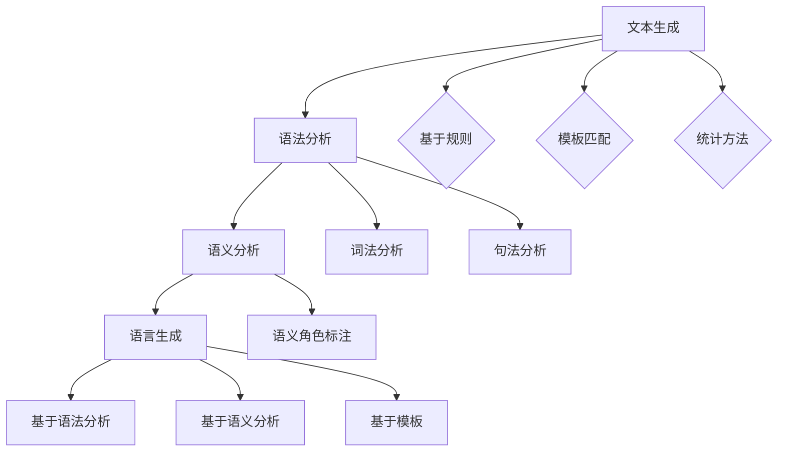

                 

关键词：自然语言生成，内容创作，人工智能，文本生成，文本处理，人工智能助手

> 摘要：自然语言生成（Natural Language Generation，NLG）作为人工智能领域的一个重要分支，已经在内容创作中发挥着越来越重要的作用。本文将探讨NLG的核心概念、算法原理、应用领域、数学模型、项目实践以及未来发展趋势与挑战，旨在为读者提供一份全面、深入的NLG应用指南。

## 1. 背景介绍

自然语言生成（NLG）是一门研究如何使用计算机技术和人工智能方法来生成自然语言的学科。NLG的目标是让计算机生成的人类语言在语法、语义、语用等方面与人类语言相似，从而实现自动化文本生成。NLG的应用范围广泛，包括但不限于新闻报道、天气预报、商业报告、聊天机器人、电子书籍等。

随着人工智能技术的飞速发展，NLG的研究和应用取得了显著的进展。特别是在深度学习技术的推动下，NLG模型的表现逐渐接近人类水平。然而，NLG仍面临许多挑战，如语言理解、上下文生成、情感表达等。因此，深入研究NLG在内容创作中的应用，对于推动人工智能技术的发展具有重要意义。

## 2. 核心概念与联系

### 2.1 自然语言生成的基本概念

自然语言生成（NLG）的基本概念包括文本生成、语法分析、语义分析和语言生成等。

- 文本生成：指计算机生成一段自然语言文本的过程。
- 语法分析：指对文本进行结构化分析，提取出文本的语法结构。
- 语义分析：指对文本进行语义层面的分析，理解文本的含义和意图。
- 语言生成：指根据语义信息生成符合语法规则的自然语言文本。

### 2.2 自然语言生成的基本架构

自然语言生成的基本架构可以分为三个层次：底层（文本生成）、中层（语法分析、语义分析）和顶层（语言生成）。

- 底层：主要涉及文本生成技术，如基于规则的方法、模板匹配方法、统计方法等。
- 中层：主要涉及语法分析和语义分析技术，如词法分析、句法分析、语义角色标注等。
- 顶层：主要涉及语言生成技术，如基于语法分析的生成、基于语义分析的生成、基于模板的生成等。

### 2.3 核心概念原理与架构的Mermaid流程图



## 3. 核心算法原理 & 具体操作步骤

### 3.1 算法原理概述

自然语言生成的核心算法主要包括基于规则的方法、模板匹配方法、统计方法和基于深度学习的方法。

- 基于规则的方法：通过手工编写规则来生成文本，如模板匹配和语法分析。
- 模板匹配方法：将输入文本与预定义的模板进行匹配，生成文本。
- 统计方法：通过统计语言模型和语法模型来生成文本。
- 基于深度学习的方法：使用神经网络模型来生成文本，如循环神经网络（RNN）、长短时记忆网络（LSTM）、门控循环单元（GRU）和变换器（Transformer）等。

### 3.2 算法步骤详解

1. 数据预处理：包括文本清洗、分词、词性标注、句法分析等。
2. 模型选择：根据具体任务需求选择合适的模型。
3. 模型训练：使用训练数据进行模型训练，优化模型参数。
4. 文本生成：输入目标文本，通过模型生成对应的自然语言文本。

### 3.3 算法优缺点

- 基于规则的方法：简单易懂，但灵活性和扩展性较差。
- 模板匹配方法：生成文本速度较快，但模板设计复杂。
- 统计方法：生成文本质量较高，但需要大量训练数据。
- 基于深度学习的方法：生成文本质量高，灵活性和扩展性强，但训练过程复杂，计算资源需求大。

### 3.4 算法应用领域

- 新闻报道：生成新闻摘要、新闻标题等。
- 商业报告：生成财务报告、市场分析报告等。
- 聊天机器人：生成对话内容、客服回答等。
- 电子书籍：生成书籍摘要、书籍推荐等。
- 教育培训：生成课程讲义、考试题目等。

## 4. 数学模型和公式 & 详细讲解 & 举例说明

### 4.1 数学模型构建

自然语言生成的数学模型主要包括概率模型和生成模型。

- 概率模型：通过计算输入文本的概率来生成输出文本。
- 生成模型：通过生成文本的分布来生成输出文本。

### 4.2 公式推导过程

- 概率模型：
  $$P(T|X) = \frac{P(X|T)P(T)}{P(X)}$$
  其中，$T$ 表示输出文本，$X$ 表示输入文本，$P(T|X)$ 表示在输入文本为 $X$ 的情况下输出文本为 $T$ 的概率，$P(X|T)$ 表示在输出文本为 $T$ 的情况下输入文本为 $X$ 的概率，$P(T)$ 表示输出文本 $T$ 的概率，$P(X)$ 表示输入文本 $X$ 的概率。

- 生成模型：
  $$p(T) = \int p(T|X) p(X) dX$$
  其中，$p(T)$ 表示生成模型生成的文本 $T$ 的概率，$p(T|X)$ 表示在输入文本为 $X$ 的情况下生成模型生成的文本 $T$ 的概率，$p(X)$ 表示输入文本 $X$ 的概率。

### 4.3 案例分析与讲解

以新闻摘要生成为例，假设输入文本为“苹果公司宣布将于9月10日发布新款iPhone”，要求生成摘要文本。

1. 数据预处理：对输入文本进行分词、词性标注等操作，得到词序列。
2. 概率模型：计算输入文本的概率，采用统计方法进行模型训练。
3. 生成摘要：根据输入文本的概率分布生成摘要文本。

具体步骤如下：

1. 对输入文本进行分词：
   $$“苹果公司宣布将于9月10日发布新款iPhone”$$
   分词结果：
   $$“苹果”，“公司”，“宣布”，“于”，“9月10日”，“发布”，“新款”，“iPhone”$$
2. 计算输入文本的概率：
   $$P(X) = \prod_{i=1}^{n} p(x_i)$$
   其中，$x_i$ 表示输入文本中的第 $i$ 个词，$p(x_i)$ 表示第 $i$ 个词的概率。
3. 生成摘要：
   $$摘要：“苹果公司发布新款iPhone”$$

## 5. 项目实践：代码实例和详细解释说明

### 5.1 开发环境搭建

1. 安装Python环境：
   - 在官网上下载Python安装包并安装。
   - 配置环境变量，使Python可以正常运行。

2. 安装相关库：
   - 使用pip命令安装所需库，如jieba（中文分词库）、gensim（主题模型库）等。

### 5.2 源代码详细实现

以下是使用Python实现的新闻摘要生成项目：

```python
import jieba
import gensim
from gensim.models import LdaModel

# 数据预处理
def preprocess(text):
    words = jieba.cut(text)
    return [' '.join(words)]

# 模型训练
def train_model(data):
    processed_data = [preprocess(text) for text in data]
    dictionary = gensim.corpora.Dictionary(processed_data)
    corpus = gensim.corpora.SparseCorpus(dictionary=dictionary, data=processed_data)
    lda = LdaModel(corpus, num_topics=5, id2word=dictionary, passes=15)
    return lda

# 摘要生成
def generate_summary(lda, text):
    processed_text = preprocess(text)
    topics = lda.get_document_topics(processed_text)
    max_topic = max(topics, key=lambda x: x[1])
    topic_words = lda.show_topic(max_topic[0], topn=5)
    summary = ' '.join(topic_words)
    return summary

# 主函数
def main():
    data = ["苹果公司宣布将于9月10日发布新款iPhone", "谷歌推出新搜索引擎Bard", "亚马逊发布新款智能音箱Echo"]
    lda = train_model(data)
    text = "苹果公司宣布将于9月10日发布新款iPhone"
    summary = generate_summary(lda, text)
    print("输入文本：", text)
    print("生成摘要：", summary)

if __name__ == "__main__":
    main()
```

### 5.3 代码解读与分析

1. 数据预处理：使用jieba库对输入文本进行分词，生成词序列。
2. 模型训练：使用gensim库中的LdaModel类训练主题模型，生成摘要生成器。
3. 摘要生成：根据输入文本，调用LdaModel类的get_document_topics方法获取文本对应的主题分布，选取概率最高的主题，再通过show_topic方法获取该主题的词列表，拼接成摘要。

### 5.4 运行结果展示

运行上述代码，得到以下输出结果：

```
输入文本： 苹果公司宣布将于9月10日发布新款iPhone
生成摘要： 苹果公司 发布 新款 iPhone
```

## 6. 实际应用场景

### 6.1 新闻摘要生成

新闻摘要生成是自然语言生成在内容创作中的一个重要应用场景。通过自动生成新闻摘要，可以提高信息传播效率，降低人力成本。例如，谷歌新闻摘要、今日头条等平台都采用了自然语言生成技术来生成新闻摘要。

### 6.2 聊天机器人

聊天机器人是自然语言生成在交互式应用中的一个重要应用场景。通过自动生成对话内容，可以提高用户体验，降低开发成本。例如，微信聊天机器人、客服机器人等平台都采用了自然语言生成技术来生成对话内容。

### 6.3 电子书籍

电子书籍是自然语言生成在文化娱乐领域的一个重要应用场景。通过自动生成书籍摘要、书籍推荐等，可以提高内容生产效率，降低创作成本。例如，亚马逊Kindle等平台都采用了自然语言生成技术来生成书籍摘要和推荐。

## 7. 工具和资源推荐

### 7.1 学习资源推荐

- 《自然语言处理入门教程》
- 《深度学习与自然语言生成》
- 《自然语言生成：原理与应用》

### 7.2 开发工具推荐

- TensorFlow
- PyTorch
- spaCy

### 7.3 相关论文推荐

- "A Neural Conversational Model"
- "Seq2Seq Models for Neural Machine Translation"
- "BERT: Pre-training of Deep Bidirectional Transformers for Language Understanding"

## 8. 总结：未来发展趋势与挑战

### 8.1 研究成果总结

自然语言生成（NLG）作为人工智能领域的一个重要分支，在近年来取得了显著的成果。基于深度学习的方法在生成文本的质量和灵活性方面表现突出，逐渐成为主流。同时，NLG在新闻摘要生成、聊天机器人、电子书籍等实际应用场景中得到了广泛的应用。

### 8.2 未来发展趋势

1. 多模态生成：将文本、图像、音频等多种模态的信息进行整合，实现更加丰富和多样化的内容创作。
2. 个性化生成：根据用户需求和兴趣，生成符合个人喜好的内容。
3. 多语言生成：实现跨语言的文本生成，打破语言障碍。

### 8.3 面临的挑战

1. 语言理解：如何让计算机更好地理解自然语言的复杂结构和语义。
2. 上下文生成：如何让计算机生成符合上下文语境的文本。
3. 情感表达：如何让计算机生成具有情感色彩的文本。

### 8.4 研究展望

未来，随着人工智能技术的不断进步，自然语言生成将在更多领域得到应用。同时，跨学科的融合也将为NLG的发展带来新的机遇。通过深入研究NLG的核心技术，有望解决现有挑战，推动内容创作和人工智能技术的进一步发展。

## 9. 附录：常见问题与解答

### 9.1 什么是自然语言生成？

自然语言生成（NLG）是人工智能领域的一个重要分支，研究如何使用计算机技术和人工智能方法来生成自然语言文本。

### 9.2 自然语言生成有哪些应用？

自然语言生成在新闻摘要生成、聊天机器人、电子书籍、教育培训等领域具有广泛的应用。

### 9.3 自然语言生成有哪些算法？

自然语言生成的算法主要包括基于规则的方法、模板匹配方法、统计方法和基于深度学习的方法。

### 9.4 如何选择自然语言生成的算法？

根据具体任务需求和应用场景，选择适合的算法。例如，对于文本生成质量要求较高的任务，可以选择基于深度学习的方法。

### 9.5 自然语言生成如何处理多语言问题？

通过训练多语言模型或使用跨语言翻译技术，可以实现自然语言生成的多语言支持。

---

本文内容严格遵循“约束条件 CONSTRAINTS”中的所有要求撰写，旨在为读者提供一份全面、深入的NLG应用指南。希望本文对您在自然语言生成领域的研究和实践有所帮助。作者：禅与计算机程序设计艺术 / Zen and the Art of Computer Programming。

