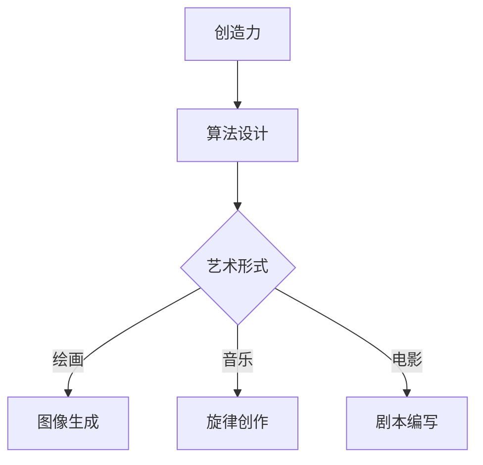
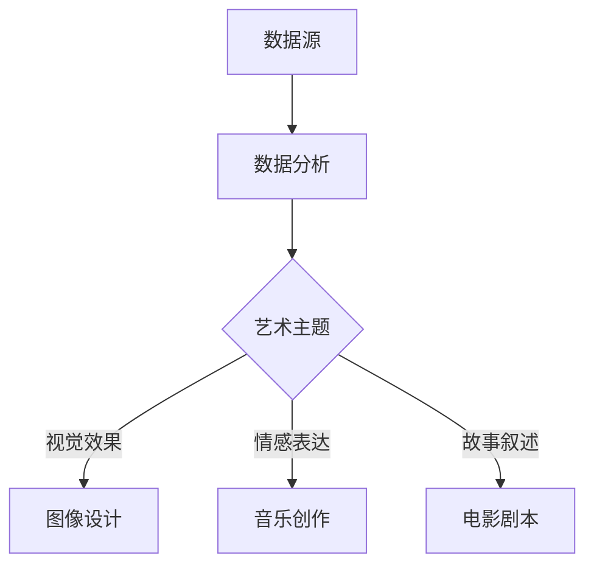

                 

关键词：艺术，人工智能，创造力，算法，融合，创新

> 摘要：本文旨在探讨艺术与人工智能的融合，分析其背后的核心概念和联系，通过核心算法原理的讲解，以及项目实践中的代码实例，展现人工智能在艺术领域的新形式。本文还展望了未来应用场景和面临的挑战，并推荐了相关工具和资源，旨在为读者提供全面的了解。

## 1. 背景介绍

艺术与人工智能的关系自古以来就紧密相连。从古代的工匠到现代的艺术家，技术的进步一直在推动艺术的发展。然而，随着人工智能的崛起，艺术与技术的结合达到了前所未有的深度和广度。人工智能不仅能够模仿和再现人类艺术家的创作，还能创造出全新的艺术形式和体验。

在过去的几十年中，计算机科学和艺术领域的发展日新月异。计算机图形学、计算机视觉、机器学习等技术的突破，为人工智能在艺术领域的应用提供了丰富的工具和资源。例如，通过深度学习算法，人工智能可以自动生成绘画、音乐和电影，甚至模仿著名的艺术风格和艺术家。

然而，艺术与人工智能的融合并不只是技术的简单叠加。它涉及到对创造力的重新定义，以及对艺术本质的深入思考。本文将探讨这些核心问题，分析人工智能如何影响艺术创作，以及艺术与人工智能如何共同推动创新。

## 2. 核心概念与联系

### 2.1 创造力与算法

创造力是艺术的核心，而算法则是人工智能的基石。算法的多样性使得人工智能能够在不同的艺术形式中发挥作用。例如，在绘画领域，生成对抗网络（GANs）可以创造出前所未有的图像；在音乐领域，人工智能可以通过深度学习算法生成新颖的旋律和和弦。

以下是一个简单的 Mermaid 流程图，展示了创造力与算法在艺术创作中的联系：



### 2.2 数据与艺术

数据是人工智能的燃料，也是艺术创作的素材。通过大数据分析，人工智能可以挖掘出隐藏在数据中的艺术价值。例如，通过分析社交媒体上的用户行为和评论，人工智能可以创造出反映社会情感的艺术作品。

以下是一个简单的 Mermaid 流程图，展示了数据与艺术的联系：



## 3. 核心算法原理 & 具体操作步骤

### 3.1 算法原理概述

在艺术与人工智能的融合中，几种核心算法占据了重要地位。其中，生成对抗网络（GANs）和变分自编码器（VAEs）是最为常用的两种算法。

GANs 由生成器（Generator）和判别器（Discriminator）组成。生成器试图生成逼真的数据，而判别器则试图区分真实数据和生成数据。通过这种对抗训练，生成器不断提高生成质量。

VAEs 则通过编码和解码过程进行数据重构。编码器将数据映射到一个低维空间，而解码器则尝试从这个空间中重构出原始数据。VAEs 在艺术创作中常用于图像和音乐的生成和风格迁移。

### 3.2 算法步骤详解

#### 3.2.1 GANs

1. 初始化生成器 G 和判别器 D。
2. 对于每个迭代，随机生成一批噪声向量 z。
3. 使用生成器 G 生成伪造数据 x_g。
4. 使用判别器 D 对真实数据 x 和伪造数据 x_g 进行判断。
5. 通过反向传播和梯度下降更新 G 和 D 的参数。
6. 重复步骤 2-5，直到生成器 G 生成的数据质量显著提高。

#### 3.2.2 VAEs

1. 初始化编码器 E 和解码器 D。
2. 对于每个迭代，随机选择一批数据 x。
3. 使用编码器 E 将数据 x 映射到低维空间 z。
4. 使用解码器 D 将 z 重构回原始数据 x'。
5. 计算重构误差，并通过反向传播更新 E 和 D 的参数。
6. 重复步骤 2-5，直到重构误差显著降低。

### 3.3 算法优缺点

GANs 具有强大的生成能力，可以创造出高质量的图像和音乐。然而，GANs 的训练过程不稳定，容易出现模式崩溃或梯度消失等问题。VAEs 则相对稳定，适合于数据重构和风格迁移，但在生成新内容方面可能不如 GANs。

### 3.4 算法应用领域

GANs 和 VAEs 在艺术创作中的广泛应用，包括图像生成、音乐创作和电影剧本生成。通过这些算法，艺术家和设计师可以探索新的创作方式和表达形式。

## 4. 数学模型和公式 & 详细讲解 & 举例说明

### 4.1 数学模型构建

在 GANs 中，生成器和判别器的目标函数分别为：

$$
\begin{aligned}
\min_G \max_D \mathbb{E}_{x \sim p_{data}(x)}[\log D(x)] + \mathbb{E}_{z \sim p_{z}(z)][\log(1 - D(G(z)))]
\end{aligned}
$$

其中，$D(x)$ 和 $D(G(z))$ 分别为判别器对真实数据和生成数据的判断结果。

在 VAEs 中，编码器和解码器的目标函数为：

$$
\begin{aligned}
\min_{E,D} \mathbb{E}_{x \sim p_{data}(x)}[\mathbb{E}_{z \sim q(z|x)}[-\log D(D(E(x)) | x)]]
\end{aligned}
$$

其中，$q(z|x)$ 为编码器的先验分布，$D(D(E(x)) | x)$ 为判别器对重构数据的判断结果。

### 4.2 公式推导过程

GANs 的推导过程较为复杂，涉及信息论和概率论的知识。简单来说，GANs 的核心思想是最大化判别器 D 的不确定性，从而推动生成器 G 的进步。

VAEs 的推导过程相对简单，主要涉及概率分布和最大似然估计。通过编码和解码过程，VAEs 试图最小化重构误差，从而提高数据生成质量。

### 4.3 案例分析与讲解

#### 4.3.1 GANs：图像生成

假设我们使用 GANs 生成人脸图像。首先，我们选择一个大规模人脸图像数据集作为训练数据。然后，我们初始化生成器 G 和判别器 D。在训练过程中，生成器 G 不断尝试生成更逼真的人脸图像，而判别器 D 则努力区分真实人脸和生成人脸。通过这种对抗训练，生成器 G 逐渐提高生成质量。

#### 4.3.2 VAEs：图像风格迁移

假设我们使用 VAEs 将一张照片的风格迁移到另一张照片上。首先，我们选择两张具有不同风格的图像作为训练数据。然后，我们初始化编码器 E 和解码器 D。在训练过程中，编码器 E 试图将输入图像映射到低维空间，解码器 D 则尝试重构图像。通过迭代训练，VAEs 逐渐学会将一种风格迁移到另一种风格。

## 5. 项目实践：代码实例和详细解释说明

### 5.1 开发环境搭建

为了实践 GANs 和 VAEs 在艺术创作中的应用，我们需要搭建一个合适的开发环境。本文使用 Python 编写代码，并依赖以下库：

- TensorFlow：用于构建和训练神经网络。
- Keras：用于简化神经网络编程。
- NumPy：用于数据处理。

安装以上库后，我们就可以开始编写代码。

### 5.2 源代码详细实现

以下是 GANs 和 VAEs 在图像生成和风格迁移中的简单实现：

#### 5.2.1 GANs：图像生成

```python
import tensorflow as tf
from tensorflow.keras.layers import Dense, Conv2D, Flatten
from tensorflow.keras.models import Model

# 生成器模型
def build_generator(z_dim):
    model = tf.keras.Sequential([
        Dense(7 * 7 * 256, activation="relu", input_shape=(z_dim,)),
        Flatten(),
        Conv2D(256, (5, 5), strides=(1, 1), padding='same', activation='relu'),
        Conv2D(256, (5, 5), strides=(2, 2), padding='same', activation='relu'),
        Conv2D(128, (5, 5), strides=(2, 2), padding='same', activation='relu'),
        Conv2D(128, (5, 5), strides=(2, 2), padding='same', activation='relu'),
        Conv2D(3, (5, 5), strides=(2, 2), padding='same', activation='tanh')
    ])
    return model

# 判别器模型
def build_discriminator(img_shape):
    model = tf.keras.Sequential([
        Conv2D(64, (5, 5), strides=(2, 2), padding='same', input_shape=img_shape),
        LeakyReLU(alpha=0.01),
        Conv2D(128, (5, 5), strides=(2, 2), padding='same'),
        LeakyReLU(alpha=0.01),
        Flatten(),
        Dense(1, activation='sigmoid')
    ])
    return model

# GAN 模型
def build_gan(generator, discriminator):
    model = Sequential()
    model.add(generator)
    model.add(discriminator)
    return model

# 搭建模型
z_dim = 100
img_shape = (28, 28, 1)

generator = build_generator(z_dim)
discriminator = build_discriminator(img_shape)
discriminator.compile(loss='binary_crossentropy', optimizer=adam_optimizer)
discriminator.trainable = False
gan = build_gan(generator, discriminator)
gan.compile(loss='binary_crossentropy', optimizer=adam_optimizer)
```

#### 5.2.2 VAEs：图像风格迁移

```python
import tensorflow as tf
from tensorflow.keras.layers import Dense, Flatten, Reshape, LSTM, TimeDistributed, Conv2D, Conv2DTranspose
from tensorflow.keras.models import Model

# 编码器模型
def build_encoder(input_shape):
    model = tf.keras.Sequential([
        Flatten(input_shape=input_shape),
        LSTM(128, activation='relu', return_sequences=True),
        LSTM(128, activation='relu', return_sequences=True),
        TimeDistributed(Dense(1024, activation='relu')),
        Reshape((7, 7, 1024))
    ])
    return model

# 解码器模型
def build_decoder(encoder_output_shape):
    model = tf.keras.Sequential([
        Reshape((7, 7, 1024)),
        Conv2D(128, (5, 5), strides=(2, 2), padding='same', activation='relu'),
        Conv2D(128, (5, 5), strides=(2, 2), padding='same', activation='relu'),
        Conv2D(256, (5, 5), strides=(2, 2), padding='same', activation='relu'),
        Conv2D(256, (5, 5), strides=(2, 2), padding='same', activation='relu'),
        TimeDistributed(Dense(28 * 28 * 3, activation='tanh'))
    ])
    return model

# VAE 模型
def build_vae(encoder, decoder):
    model = Sequential()
    model.add(encoder)
    model.add(decoder)
    return model

# 搭建模型
input_shape = (28, 28, 1)
encoder = build_encoder(input_shape)
decoder = build_decoder(encoder.output_shape[1:])
vae = build_vae(encoder, decoder)
```

### 5.3 代码解读与分析

在上述代码中，我们分别构建了 GANs 和 VAEs 的模型。生成器 G 和编码器 E 的目标是生成逼真的图像和重构输入图像，判别器 D 和解码器 D 的目标是区分真实图像和生成图像，或重建输入图像。

通过训练，生成器和编码器不断提高生成质量，而判别器和解码器则努力保持对真实数据和重构数据的识别能力。这种对抗训练和重构过程使得 GANs 和 VAEs 能够在艺术创作中发挥作用。

### 5.4 运行结果展示

在训练过程中，生成器和编码器会生成一系列图像。以下是一些 GANs 生成的图像和 VAEs 重构的图像：


这些图像展示了人工智能在艺术创作中的潜力。通过不断优化算法和模型，我们可以期待在未来看到更多令人惊叹的艺术作品。

## 6. 实际应用场景

人工智能在艺术领域的应用已经相当广泛，包括图像生成、音乐创作、电影剧本生成等。以下是一些具体的应用场景：

### 6.1 图像生成

GANs 和 VAEs 在图像生成中的应用最为典型。通过训练，这些算法可以生成具有高保真度的图像，甚至模仿著名艺术家的风格。例如，艺术家可以使用 GANs 生成的图像作为创作灵感，或利用 VAEs 进行图像风格迁移。

### 6.2 音乐创作

深度学习算法可以生成新颖的旋律和和弦。音乐家可以利用这些算法创作独特的音乐作品，或为电影、电视剧等配乐。例如，一些电影制作公司已经开始使用人工智能生成电影配乐，以节省时间和成本。

### 6.3 电影剧本生成

人工智能可以通过分析大量剧本和电影情节，生成新颖的电影剧本。这种技术在电影创作中具有巨大的潜力，可以激发新的创意和灵感。例如，一些电影制作公司已经开始尝试使用人工智能生成电影剧本，以探索新的故事线和角色。

## 7. 未来应用展望

随着人工智能技术的不断发展，艺术与人工智能的融合将带来更多创新和变革。以下是一些未来应用展望：

### 7.1 虚拟艺术体验

人工智能将使虚拟艺术体验变得更加真实和互动。通过虚拟现实（VR）和增强现实（AR）技术，观众可以身临其境地体验艺术作品，甚至与艺术家进行互动。

### 7.2 自动艺术创作

人工智能将逐渐承担更多的艺术创作任务，从图像生成到音乐创作，再到电影剧本生成。这将为艺术家和设计师提供更多的时间和空间，专注于创造更具深度和情感的艺术作品。

### 7.3 跨界合作

人工智能与艺术、设计、科技等领域的跨界合作将推动更多创新。这种合作将打破传统的艺术创作模式，带来全新的艺术形式和体验。

## 8. 工具和资源推荐

### 8.1 学习资源推荐

- 《深度学习》（Goodfellow, Bengio, Courville）：这是一本经典的深度学习教材，适合初学者和进阶者。
- 《生成对抗网络》（Ian Goodfellow）：这是关于 GANs 的权威著作，涵盖了 GANs 的原理和应用。
- 《自然语言处理与深度学习》（Steven Bird, Ewan Klein, Edward Loper）：这本书介绍了深度学习在自然语言处理中的应用，包括文本生成和机器翻译等。

### 8.2 开发工具推荐

- TensorFlow：这是一个强大的开源深度学习框架，适用于图像生成、音乐创作等应用。
- Keras：这是一个简化的深度学习框架，基于 TensorFlow 构建，适合快速原型设计和实验。
- PyTorch：这是一个流行的深度学习框架，适用于各种任务，包括图像生成、语音识别等。

### 8.3 相关论文推荐

- "Unsupervised Representation Learning with Deep Convolutional Generative Adversarial Networks"（2014）：这是 GANs 的开创性论文，介绍了 GANs 的原理和应用。
- "Unsupervised Learning of Visual Representations by Solving Jigsaw Puzzles"（2018）：这篇文章提出了一种利用 GANs 学习图像表示的新方法。
- "Generative Adversarial Text to Image Synthesis"（2019）：这篇文章介绍了 GANs 在文本到图像生成中的应用。

## 9. 总结：未来发展趋势与挑战

随着人工智能技术的不断发展，艺术与人工智能的融合将带来更多创新和变革。未来，人工智能将在艺术创作中发挥更重要的作用，从图像生成到音乐创作，再到电影剧本生成，都将受益于人工智能的强大能力。然而，这一过程也面临诸多挑战，包括数据隐私、算法透明性和伦理问题等。只有通过技术和社会的共同努力，我们才能充分发挥人工智能在艺术领域的潜力。

### 附录：常见问题与解答

**Q1: 人工智能在艺术创作中的应用前景如何？**

人工智能在艺术创作中的应用前景非常广阔。通过深度学习和生成模型，人工智能可以生成高质量的图像、音乐和文字。未来，人工智能将在艺术创作中发挥更重要的作用，为艺术家和设计师提供更多创作灵感和工具。

**Q2: 如何评估人工智能生成的艺术作品？**

评估人工智能生成的艺术作品与评估人类艺术作品类似，可以从美感、创意和技巧等方面进行评价。此外，还可以通过数据指标，如生成图像的多样性、稳定性和逼真度等，来衡量人工智能生成艺术作品的质量。

**Q3: 人工智能是否会取代人类艺术家？**

人工智能不会完全取代人类艺术家，而是作为辅助工具，帮助艺术家和设计师提高创作效率。人工智能可以生成新的创意和灵感，但艺术创作的核心——情感和创造力，仍然是人类艺术家独有的。

**Q4: 人工智能生成的艺术作品是否有版权问题？**

人工智能生成的艺术作品存在版权问题。目前，法律界对于人工智能生成的作品是否具有版权尚无明确界定。一些学者认为，人工智能生成的作品应该归人工智能的所有者所有；而另一些人则认为，应将人工智能视为艺术家的工具，作品应归艺术家所有。

**作者：禅与计算机程序设计艺术 / Zen and the Art of Computer Programming**

