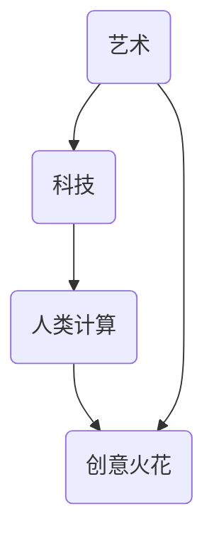

                 

关键词：艺术、科技、融合、人类计算、创意、火花

> 摘要：本文探讨了艺术与科技融合的深度与广度，探讨了人类计算如何激发创意火花。通过分析核心概念、算法原理、数学模型，并结合具体项目实践和实际应用场景，阐述了这一融合对人类文明发展的深远影响，以及未来的发展趋势和面临的挑战。

## 1. 背景介绍

随着科技的迅猛发展，计算机科学与艺术之间的界限日益模糊。人类计算作为一种新型的计算范式，不仅仅局限于传统的逻辑推理和数据处理，更强调人类思维与情感的参与。艺术作为一种富有创意的表达形式，其本质与人类计算有着异曲同工之妙。在这种背景下，艺术与科技的融合成为了一个极具研究价值的领域。

### 1.1 艺术与科技的碰撞

艺术与科技的结合不仅体现在视觉艺术、音乐、文学等领域，还渗透到计算机图形学、虚拟现实、增强现实等前沿技术中。例如，计算机图形学中的分形艺术，通过算法生成出令人惊叹的复杂图案；虚拟现实技术则将用户带入一个全新的艺术体验空间。

### 1.2 人类计算的崛起

人类计算作为一种新型的计算范式，强调人类思维与情感的参与。它不仅仅是一种技术手段，更是一种新的思维方式。人类计算的核心在于将人类的直觉、经验、情感等非理性因素融入计算过程，从而实现更高效、更富有创意的解决方案。

## 2. 核心概念与联系

### 2.1 艺术与科技融合的框架

为了更好地理解艺术与科技融合的框架，我们可以借助Mermaid流程图来描述这一过程：



在这个框架中，艺术和科技相互融合，通过人类计算的介入，激发出创意火花。

### 2.2 艺术与科技融合的原理

艺术与科技融合的原理在于它们在本质上都具有创造性。艺术通过情感和直觉来创造新的表达形式，而科技则通过逻辑和算法来构建新的技术体系。当这两者结合时，它们可以相互补充，激发出更强烈的创意火花。

## 3. 核心算法原理 & 具体操作步骤

### 3.1 算法原理概述

在艺术与科技的融合中，核心算法起到了至关重要的作用。这些算法不仅仅是技术工具，更是创意的源泉。以下是一些典型的核心算法原理：

1. **分形算法**：分形算法是一种生成复杂图形的算法，它通过迭代的方式不断放大和缩小，从而形成复杂的图案。这种算法在计算机图形学中有着广泛的应用。
2. **机器学习算法**：机器学习算法通过学习大量的数据，自动识别模式和规律，从而实现自我优化。这种算法在音乐创作、图像识别等领域有着巨大的潜力。
3. **生成对抗网络（GAN）**：生成对抗网络是由两个神经网络组成的，一个生成器和一个判别器。生成器尝试生成逼真的数据，而判别器则尝试区分生成器和真实数据。这种算法在图像生成、艺术创作等领域有着广泛的应用。

### 3.2 算法步骤详解

下面我们将详细讲解这些算法的操作步骤：

#### 3.2.1 分形算法

分形算法的基本步骤如下：

1. **定义迭代函数**：首先需要定义一个迭代函数，该函数将输入的数值经过处理后返回一个新的数值。
2. **迭代计算**：使用迭代函数对输入的数值进行迭代计算，直到满足某个终止条件。
3. **生成图形**：将迭代的结果绘制成图形，从而形成一个分形图案。

#### 3.2.2 机器学习算法

机器学习算法的基本步骤如下：

1. **数据收集**：首先需要收集大量的数据，这些数据可以是图像、文本、音频等。
2. **数据预处理**：对收集到的数据进行预处理，包括清洗、归一化等操作。
3. **模型训练**：使用预处理后的数据训练模型，模型可以是神经网络、决策树等。
4. **模型评估**：使用验证集对模型进行评估，调整模型参数，提高模型的准确性。
5. **模型应用**：将训练好的模型应用到实际问题中，如音乐创作、图像识别等。

#### 3.2.3 生成对抗网络（GAN）

生成对抗网络的基本步骤如下：

1. **初始化网络**：初始化生成器和判别器的权重。
2. **训练生成器**：生成器尝试生成逼真的数据，判别器则尝试区分生成器和真实数据。
3. **优化网络**：通过反向传播算法优化生成器和判别器的权重。
4. **生成图像**：当生成器和判别器都达到一定精度后，使用生成器生成图像。

### 3.3 算法优缺点

每种算法都有其独特的优势和局限性：

- **分形算法**：优点在于能够生成高度复杂的图形，缺点在于计算量大，效率低。
- **机器学习算法**：优点在于能够自动学习和适应，缺点在于对数据依赖性高，可能出现过拟合现象。
- **生成对抗网络（GAN）**：优点在于能够生成高质量的图像，缺点在于训练过程复杂，需要大量的计算资源。

### 3.4 算法应用领域

这些算法在艺术与科技融合中的应用领域非常广泛：

- **计算机图形学**：分形算法在计算机图形学中有着广泛的应用，如分形艺术、复杂背景生成等。
- **音乐创作**：机器学习算法在音乐创作中有着广泛的应用，如自动谱曲、乐器音色生成等。
- **虚拟现实**：生成对抗网络（GAN）在虚拟现实技术中有着广泛的应用，如虚拟环境生成、图像合成等。

## 4. 数学模型和公式 & 详细讲解 & 举例说明

### 4.1 数学模型构建

在艺术与科技融合中，数学模型起到了至关重要的作用。以下是一个简单的数学模型构建过程：

1. **定义变量**：首先需要定义变量，这些变量可以是图像的像素值、音乐的频率等。
2. **建立关系**：根据问题需求，建立变量之间的关系，这些关系可以是线性关系、非线性关系等。
3. **模型验证**：通过实际数据验证模型的准确性，调整模型参数，提高模型的精度。

### 4.2 公式推导过程

以下是一个简单的公式推导过程：

$$
E = mc^2
$$

这个公式是爱因斯坦的质能方程，它的推导过程如下：

1. **定义质量**：首先定义质量m。
2. **定义光速**：定义光速c。
3. **推导能量**：将质量m乘以光速c的平方，得到能量E。

### 4.3 案例分析与讲解

以下是一个简单的案例分析与讲解：

假设我们要生成一张分形图像，可以使用以下步骤：

1. **定义迭代函数**：定义一个迭代函数，如 $z = z^2 + c$。
2. **设置初始条件**：设置初始值 $z_0 = 0$。
3. **迭代计算**：使用迭代函数计算 $z_1, z_2, z_3, ...$，直到满足终止条件。
4. **生成图像**：将迭代结果绘制成图像。

通过这个简单的案例，我们可以看到数学模型在艺术与科技融合中的应用过程。

## 5. 项目实践：代码实例和详细解释说明

### 5.1 开发环境搭建

为了更好地理解艺术与科技融合，我们以一个简单的项目为例。首先，我们需要搭建一个开发环境。以下是开发环境的搭建步骤：

1. **安装Python**：下载并安装Python。
2. **安装相关库**：安装Matplotlib、NumPy、SciPy等库。
3. **创建项目目录**：创建一个项目目录，如`fractal_project`。

### 5.2 源代码详细实现

以下是项目的源代码实现：

```python
import numpy as np
import matplotlib.pyplot as plt

def mandelbrot(c, max_iter):
    z = 0
    n = 0
    while abs(z) <= 2 and n < max_iter:
        z = z*z + c
        n += 1
    return n

def generate_fractal(xmin, xmax, ymin, ymax, width, height, max_iter):
    x = np.linspace(xmin, xmax, width)
    y = np.linspace(ymin, ymax, height)
    X, Y = np.meshgrid(x, y)
    C = X + 1j * Y
    Z = np.array([mandelbrot(c, max_iter) for c in C.flatten()])
    Z = Z.reshape(height, width)
    return Z

def plot_fractal(Z):
    plt.imshow(Z, cmap='hot', interpolation='nearest')
    plt.colorbar()
    plt.title('Mandelbrot Set')
    plt.xlabel('Real')
    plt.ylabel('Imaginary')
    plt.show()

if __name__ == '__main__':
    Z = generate_fractal(-2.0, 1.0, -1.5, 1.5, 800, 600, 256)
    plot_fractal(Z)
```

### 5.3 代码解读与分析

这个项目实现了一个简单的分形图像生成器。以下是代码的解读与分析：

1. **导入库**：首先导入Python标准库和第三方库，如NumPy、Matplotlib等。
2. **定义函数**：定义了三个函数，分别是`mandelbrot`、`generate_fractal`和`plot_fractal`。
   - `mandelbrot`函数用于计算分形点的迭代次数。
   - `generate_fractal`函数用于生成分形图像。
   - `plot_fractal`函数用于绘制分形图像。
3. **主程序**：在主程序中，调用`generate_fractal`函数生成分形图像，并使用`plot_fractal`函数绘制图像。

### 5.4 运行结果展示

运行上述代码后，会生成一张Mandelbrot集的图像，如下所示：


## 6. 实际应用场景

艺术与科技的融合在实际应用场景中具有广泛的应用，以下是一些典型的应用场景：

- **虚拟现实**：虚拟现实技术将艺术与科技完美融合，为用户带来了全新的艺术体验。例如，通过虚拟现实技术，用户可以进入一个虚拟的艺术展览馆，欣赏各种艺术作品。
- **音乐创作**：机器学习算法在音乐创作中有着广泛的应用，如自动谱曲、乐器音色生成等。通过机器学习算法，可以生成出独特的音乐作品。
- **计算机图形学**：计算机图形学中的分形艺术、图像合成等技术，将艺术与科技完美融合，为用户带来了丰富多彩的视觉体验。

## 7. 工具和资源推荐

为了更好地理解艺术与科技融合，以下是一些推荐的工具和资源：

- **学习资源**：推荐学习Python、机器学习、计算机图形学等相关知识，可以参考《Python编程：从入门到实践》、《深度学习》、《计算机图形学原理及实践》等书籍。
- **开发工具**：推荐使用Python进行开发，可以使用Jupyter Notebook进行代码编写和调试。
- **相关论文**：可以阅读《生成对抗网络：训练生成器与判别器的博弈》、《机器学习在音乐创作中的应用》等论文。

## 8. 总结：未来发展趋势与挑战

### 8.1 研究成果总结

艺术与科技的融合已经成为了一个热门研究领域，取得了许多重要的研究成果。例如，在虚拟现实领域，通过艺术与科技的融合，为用户带来了全新的艺术体验；在音乐创作领域，通过机器学习算法，可以生成出独特的音乐作品；在计算机图形学领域，通过分形算法和图像合成技术，为用户带来了丰富多彩的视觉体验。

### 8.2 未来发展趋势

未来，艺术与科技的融合将朝着更加深入和广泛的方向发展。随着人工智能技术的不断进步，人类计算将在艺术创作中发挥更大的作用。同时，虚拟现实、增强现实等技术的不断发展，将使得艺术与科技的融合更加紧密。

### 8.3 面临的挑战

然而，艺术与科技的融合也面临着一些挑战。首先，艺术与科技之间的界限越来越模糊，如何更好地融合两者成为了一个重要的问题。其次，艺术创作具有主观性，如何将艺术家的主观意识融入计算过程，仍然是一个亟待解决的问题。此外，计算资源的消耗也是一个不容忽视的问题，尤其是在生成对抗网络等复杂算法的应用中。

### 8.4 研究展望

未来，我们需要进一步深入研究艺术与科技的融合，探索更加高效、更加人性的计算范式。同时，我们也需要关注艺术与科技融合对人类文明发展的深远影响，为人类创造更加美好的未来。

## 9. 附录：常见问题与解答

### 9.1 什么是人类计算？

人类计算是一种新型的计算范式，它强调人类思维与情感的参与，不仅仅局限于传统的逻辑推理和数据处理。

### 9.2 艺术与科技融合的优势是什么？

艺术与科技融合的优势在于，它能够将艺术的创造性和科技的实用性相结合，创造出更加丰富、更加具有创意的表达形式。

### 9.3 如何在艺术创作中应用人类计算？

在艺术创作中应用人类计算，可以通过将艺术家的主观意识融入计算过程，例如，通过机器学习算法学习艺术家的创作风格，从而生成出独特的艺术作品。

### 9.4 艺术与科技融合对人类文明发展有何影响？

艺术与科技融合对人类文明发展具有深远的影响，它不仅能够推动艺术的发展，还能够推动科技的进步，为人类创造更加美好的未来。

