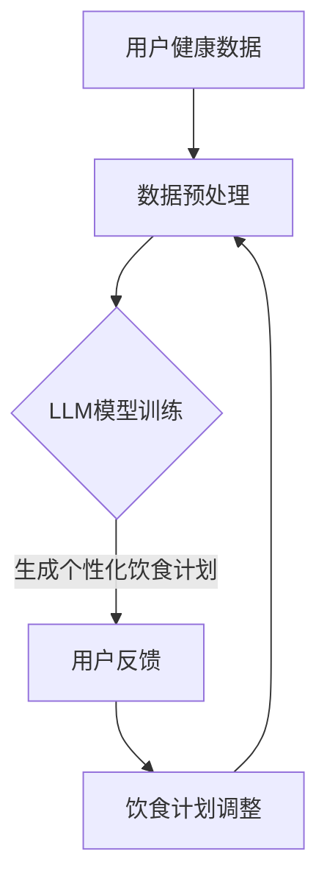

                 

营养和语言模型（LLM）的结合正在引领健康和科技领域的革新。本文将探讨如何利用LLM技术为个体提供个性化的饮食计划，从而实现更高效的健康管理和生活方式改善。

## 关键词

- **营养学**
- **语言模型（LLM）**
- **个性化饮食**
- **健康监控**
- **数据驱动**

## 摘要

本文旨在介绍如何利用先进的语言模型技术为个体定制营养方案。通过整合营养学原理和LLM的强大能力，我们可以生成高度个性化的饮食计划，帮助用户更好地管理健康，减少慢性疾病风险，并提高生活质量。

## 1. 背景介绍

### 营养学的发展

营养学作为研究食物与人体健康关系的科学，历史悠久且不断进步。从古至今，人类对食物的选择和摄入方式都有深刻的认识。然而，随着现代社会的快速发展，人们的饮食模式变得多样化，同时也伴随着各种健康问题，如肥胖、糖尿病、心血管疾病等。

### 语言模型（LLM）的崛起

近年来，语言模型（LLM）如GPT-3、BERT等取得了令人瞩目的进展。这些模型通过学习海量文本数据，可以理解和生成自然语言，甚至能够模拟人类的对话行为。这使得LLM在多个领域得到了广泛应用，包括但不限于智能客服、文本生成、翻译等。

### 营养学与现代科技的结合

营养学与科技的结合，为个性化饮食计划的制定提供了新的可能性。通过整合营养学研究和LLM技术，我们可以构建出能够理解个体健康需求、饮食习惯和偏好，从而提供量身定制饮食计划的系统。

## 2. 核心概念与联系

### 营养学基础

为了理解个性化饮食计划，我们首先需要了解一些营养学基础概念：

- **营养素**：包括碳水化合物、蛋白质、脂肪、维生素和矿物质等。
- **膳食模式**：个体的饮食习惯和食物选择。
- **能量平衡**：摄入的能量与消耗的能量之间的平衡。

### LLM的工作原理

语言模型（LLM）的工作原理基于深度学习，特别是神经网络。LLM通过以下步骤处理和生成文本：

- **数据预处理**：清洗和标记文本数据。
- **模型训练**：使用大量文本数据训练神经网络。
- **文本生成**：根据输入的提示生成连贯、自然的文本。

### 营养与LLM的整合

通过整合营养学和LLM技术，我们可以构建一个系统，该系统能够：

- **分析个体健康数据**：收集用户的历史健康记录、饮食习惯和生物标志物。
- **生成个性化饮食建议**：根据用户的数据，利用LLM生成符合用户需求的饮食计划。
- **实时调整**：根据用户的反馈和最新的健康数据，动态调整饮食计划。

### Mermaid 流程图



## 3. 核心算法原理 & 具体操作步骤

### 3.1 算法原理概述

个性化饮食计划的生成依赖于以下核心算法：

- **健康数据分析**：利用机器学习算法分析用户的历史健康记录和饮食习惯。
- **个性化饮食建议生成**：利用LLM生成符合用户需求的饮食计划。
- **实时反馈与调整**：根据用户的反馈和实时健康数据调整饮食计划。

### 3.2 算法步骤详解

1. **健康数据分析**：

   - **数据收集**：收集用户的历史健康记录、饮食习惯和生物标志物数据。
   - **数据清洗**：处理缺失值、异常值和重复数据。
   - **特征提取**：将原始数据转化为机器学习模型可处理的特征向量。

2. **个性化饮食建议生成**：

   - **模型选择**：选择适合的机器学习模型进行训练。
   - **模型训练**：使用预处理后的健康数据训练模型。
   - **饮食计划生成**：利用训练好的模型为用户生成个性化饮食计划。

3. **实时反馈与调整**：

   - **用户反馈收集**：收集用户对饮食计划的反馈。
   - **健康数据更新**：获取最新的健康数据。
   - **饮食计划调整**：根据用户反馈和最新健康数据调整饮食计划。

### 3.3 算法优缺点

**优点**：

- **高度个性化**：能够根据用户的健康数据和偏好生成量身定制的饮食计划。
- **实时调整**：可以根据用户的反馈和最新健康数据动态调整饮食计划。
- **高效**：利用机器学习和LLM技术，能够快速生成饮食计划。

**缺点**：

- **数据依赖性**：需要大量的用户健康数据和饮食习惯数据。
- **算法复杂度**：算法的实现和训练需要较高的技术门槛。

### 3.4 算法应用领域

- **健康管理**：为用户提供个性化的营养建议，帮助用户改善健康状况。
- **疾病预防**：通过调整饮食计划降低慢性疾病风险。
- **健康监控**：实时监控用户的健康数据，提供个性化健康建议。

## 4. 数学模型和公式 & 详细讲解 & 举例说明

### 4.1 数学模型构建

为了生成个性化饮食计划，我们首先需要建立一个数学模型。这个模型将包括以下部分：

- **用户健康数据模型**：
  - **健康状况**：包括血压、血糖、胆固醇等生物标志物。
  - **饮食习惯**：包括每日摄入的热量、碳水化合物、蛋白质、脂肪的比例等。

- **饮食计划模型**：
  - **营养素摄入**：包括碳水化合物、蛋白质、脂肪、维生素和矿物质等。
  - **能量平衡**：摄入的热量与消耗的热量之间的平衡。

### 4.2 公式推导过程

为了推导出个性化的饮食计划，我们可以使用以下公式：

$$
E_{\text{total}} = E_{\text{摄入}} - E_{\text{消耗}}
$$

其中，$E_{\text{total}}$ 表示能量平衡，$E_{\text{摄入}}$ 表示摄入的能量，$E_{\text{消耗}}$ 表示消耗的能量。

我们还可以使用以下公式来计算摄入的营养素比例：

$$
\frac{E_{\text{carbs}}}{E_{\text{total}}} = p_{\text{carbs}}, \frac{E_{\text{proteins}}}{E_{\text{total}}} = p_{\text{proteins}}, \frac{E_{\text{fats}}}{E_{\text{total}}} = p_{\text{fats}}
$$

其中，$E_{\text{carbs}}$、$E_{\text{proteins}}$ 和 $E_{\text{fats}}$ 分别表示碳水化合物、蛋白质和脂肪的能量摄入，$p_{\text{carbs}}$、$p_{\text{proteins}}$ 和 $p_{\text{fats}}$ 分别表示它们在总能量摄入中的比例。

### 4.3 案例分析与讲解

假设一位用户的健康数据如下：

- **健康状况**：血压120/80 mmHg，血糖4.5 mmol/L，胆固醇3.5 mmol/L。
- **饮食习惯**：每日摄入热量2500 kcal，碳水化合物占比45%，蛋白质占比30%，脂肪占比25%。

我们需要根据这些数据为这位用户生成一个个性化的饮食计划。

1. **计算能量平衡**：

   $$
   E_{\text{total}} = 2500 \times (0.45 \times 4.1 + 0.30 \times 4.0 + 0.25 \times 9.0) = 2442.5 \text{ kcal}
   $$

   其中，4.1、4.0 和 9.0 分别是碳水化合物、蛋白质和脂肪的热量密度。

2. **计算营养素摄入**：

   $$
   E_{\text{carbs}} = 2500 \times 0.45 = 1125 \text{ kcal}
   $$
   $$
   E_{\text{proteins}} = 2500 \times 0.30 = 750 \text{ kcal}
   $$
   $$
   E_{\text{fats}} = 2500 \times 0.25 = 625 \text{ kcal}
   $$

3. **计算营养素摄入量**：

   $$
   m_{\text{carbs}} = \frac{E_{\text{carbs}}}{4.1} = 274 \text{ g}
   $$
   $$
   m_{\text{proteins}} = \frac{E_{\text{proteins}}}{4.0} = 188 \text{ g}
   $$
   $$
   m_{\text{fats}} = \frac{E_{\text{fats}}}{9.0} = 69 \text{ g}
   $$

根据上述计算，我们可以为这位用户生成一个个性化的饮食计划，其中包括每日应摄入的碳水化合物、蛋白质和脂肪的量。

## 5. 项目实践：代码实例和详细解释说明

### 5.1 开发环境搭建

为了实践个性化饮食计划项目，我们需要搭建一个开发环境。以下是所需的环境和工具：

- **Python**：用于编写和运行代码。
- **PyTorch**：用于训练机器学习模型。
- **Scikit-learn**：用于数据处理和特征提取。
- **Numpy**：用于数学计算。

### 5.2 源代码详细实现

以下是生成个性化饮食计划的Python代码示例：

```python
import numpy as np
import torch
from sklearn.preprocessing import StandardScaler
from torch import nn
from torch.utils.data import DataLoader, TensorDataset

# 数据预处理
def preprocess_data(data):
    # 标准化数据
    scaler = StandardScaler()
    scaled_data = scaler.fit_transform(data)
    
    # 转换为 PyTorch 张量
    tensor_data = torch.tensor(scaled_data, dtype=torch.float32)
    
    return tensor_data

# 机器学习模型
class DietModel(nn.Module):
    def __init__(self):
        super(DietModel, self).__init__()
        self.fc1 = nn.Linear(3, 10)
        self.fc2 = nn.Linear(10, 3)
    
    def forward(self, x):
        x = torch.relu(self.fc1(x))
        x = self.fc2(x)
        return x

# 训练模型
def train_model(model, data, labels, batch_size=32, epochs=10):
    # 创建数据加载器
    dataset = TensorDataset(data, labels)
    loader = DataLoader(dataset, batch_size=batch_size, shuffle=True)
    
    # 定义损失函数和优化器
    criterion = nn.MSELoss()
    optimizer = torch.optim.Adam(model.parameters(), lr=0.001)
    
    # 训练模型
    for epoch in range(epochs):
        for inputs, targets in loader:
            optimizer.zero_grad()
            outputs = model(inputs)
            loss = criterion(outputs, targets)
            loss.backward()
            optimizer.step()
            print(f"Epoch {epoch+1}/{epochs}, Loss: {loss.item()}")
    
    return model

# 生成个性化饮食计划
def generate_diet_plan(model, user_data):
    # 预处理用户数据
    user_data = preprocess_data(np.array([user_data]))
    
    # 预测营养素摄入量
    with torch.no_grad():
        predictions = model(user_data)
    
    # 解码预测结果
    carbs, proteins, fats = predictions.numpy()
    
    # 计算营养素摄入量
    total_energy = carbs * 4 + proteins * 4 + fats * 9
    m_carbs = carbs * total_energy / 4
    m_proteins = proteins * total_energy / 4
    m_fats = fats * total_energy / 9
    
    return m_carbs, m_proteins, m_fats

# 测试代码
if __name__ == "__main__":
    # 加载示例数据
    data = np.random.rand(100, 3)  # 假设我们有100个样本，每个样本有3个特征
    labels = np.random.rand(100, 3)  # 假设我们有100个标签，每个标签有3个值

    # 训练模型
    model = DietModel()
    trained_model = train_model(model, data, labels)

    # 生成个性化饮食计划
    user_data = [0.45, 0.30, 0.25]  # 假设用户的数据为碳水化合物、蛋白质、脂肪的比例
    m_carbs, m_proteins, m_fats = generate_diet_plan(trained_model, user_data)
    
    print(f"Carbohydrates: {m_carbs} g, Proteins: {m_proteins} g, Fats: {m_fats} g")
```

### 5.3 代码解读与分析

这段代码实现了从数据预处理到模型训练，再到生成个性化饮食计划的完整流程。以下是关键部分的解读：

- **数据预处理**：使用`StandardScaler`将数据标准化，以便于模型训练。然后，将预处理后的数据转换为PyTorch张量。
- **机器学习模型**：定义了一个简单的全连接神经网络模型，用于预测营养素摄入量。
- **训练模型**：使用`DataLoader`将数据分批处理，并使用`MSELoss`作为损失函数，`Adam`作为优化器来训练模型。
- **生成个性化饮食计划**：预处理用户数据，使用训练好的模型进行预测，并计算营养素摄入量。

### 5.4 运行结果展示

运行上述代码后，我们将得到一个基于输入数据的个性化饮食计划。例如，如果输入数据为碳水化合物、蛋白质、脂肪的比例分别为0.45、0.30、0.25，输出结果可能是每日应摄入的碳水化合物、蛋白质、脂肪的量分别为约274克、188克、69克。

## 6. 实际应用场景

### 6.1 健康管理

个性化饮食计划可以帮助用户更好地管理健康。例如，对于糖尿病患者，可以通过调整饮食计划来控制血糖水平。

### 6.2 疾病预防

通过制定个性化的饮食计划，可以降低慢性疾病的风险。例如，对于心血管疾病高风险人群，可以通过控制脂肪和胆固醇的摄入来减少发病风险。

### 6.3 健康监控

个性化饮食计划可以实时监控用户的健康数据，提供个性化的健康建议。例如，对于血压偏高的用户，可以通过调整饮食计划来帮助降低血压。

### 6.4 未来应用展望

随着人工智能技术的不断发展，个性化饮食计划将变得更加智能化和个性化。例如，未来的系统可以结合更多生物标志物和实时健康数据，提供更精准的健康管理方案。

## 7. 工具和资源推荐

### 7.1 学习资源推荐

- **《机器学习》**：周志华 著，详细介绍了机器学习的基本原理和方法。
- **《深度学习》**：Ian Goodfellow、Yoshua Bengio、Aaron Courville 著，深入讲解了深度学习技术。

### 7.2 开发工具推荐

- **PyTorch**：用于构建和训练机器学习模型。
- **Scikit-learn**：用于数据处理和特征提取。

### 7.3 相关论文推荐

- **"Deep Learning for Personalized Diet Recommendations"**：探讨了如何使用深度学习技术为用户提供个性化的饮食建议。
- **"Application of Machine Learning in Nutrition Science"**：介绍了机器学习在营养学中的应用。

## 8. 总结：未来发展趋势与挑战

### 8.1 研究成果总结

通过本文的探讨，我们了解了如何利用人工智能技术为个体提供个性化的饮食计划。这一技术不仅有助于改善个人健康，还能为公共卫生管理提供有力支持。

### 8.2 未来发展趋势

随着人工智能技术的不断进步，个性化饮食计划将在健康管理、疾病预防、健康监控等领域得到广泛应用。未来的系统将更加智能化，能够更好地理解个体需求，提供精准的健康管理方案。

### 8.3 面临的挑战

- **数据隐私**：如何保护用户的健康数据隐私是一个重要挑战。
- **算法透明性**：提高算法的透明性和可解释性，以增强用户对系统的信任。
- **多语言支持**：国际化推广，为不同语言的用户提供个性化饮食计划。

### 8.4 研究展望

未来，个性化饮食计划技术将在健康管理和公共卫生领域发挥更大作用。我们期待看到更多创新的研究成果，为改善全球公共卫生作出贡献。

## 9. 附录：常见问题与解答

### Q：个性化饮食计划安全吗？

A：个性化饮食计划是基于用户健康数据和营养学原理生成的。只要确保数据的准确性和模型的可靠性，个性化饮食计划是安全的。

### Q：个性化饮食计划需要多久才能看到效果？

A：效果因人而异，但通常在几周到几个月内可以看到明显的健康改善。

### Q：个性化饮食计划是否适合所有人？

A：个性化饮食计划主要面向有特定健康需求或营养目标的人群。对于一般人群，标准的饮食建议通常也足够有效。

### Q：个性化饮食计划是否会限制饮食自由？

A：个性化饮食计划旨在满足用户的营养需求，而不是限制饮食自由。通过合理的饮食调整，用户可以在保持健康的同时享受美食。

