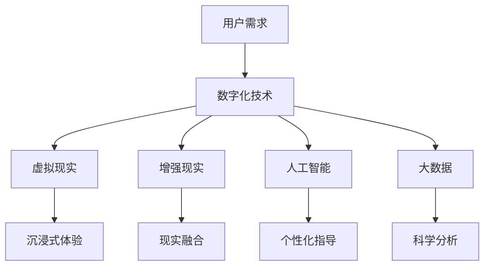

                 

关键词：虚拟健身、健康生活方式、数字化推广、智能技术、互动体验、健康监测

> 摘要：随着科技的不断进步和人们对健康生活方式的追求，虚拟健身逐渐成为一种新的健康生活方式。本文将探讨虚拟健身的核心概念、技术原理、算法模型、项目实践以及未来应用前景，并推荐相关的学习资源和开发工具，以推动全球健康生活方式的数字化推广。

## 1. 背景介绍

在现代社会，健康已经成为人们生活中不可或缺的一部分。随着人们对健康意识的提升，传统的健身房已经无法满足所有人的需求。虚拟健身作为一种新兴的健康生活方式，正逐渐受到人们的关注和青睐。虚拟健身通过数字化技术和智能设备，为用户提供一个沉浸式的健身环境，使健身变得更加便捷、有趣和高效。

### 1.1 健康生活方式的演变

从古至今，人们一直在寻找健康的生活方式。古代的中医讲究“阴阳五行”，强调人与自然的和谐共生。随着工业革命和信息时代的到来，健康生活方式逐渐从自然和传统转向科学和科技。现代健康生活方式不仅包括合理的饮食和锻炼，还涉及心理健康、环境适应等多个方面。

### 1.2 虚拟健身的兴起

虚拟健身的兴起与以下几个因素密切相关：

- **科技的进步**：计算机技术、互联网技术、智能设备等技术的发展，为虚拟健身的实现提供了坚实的基础。
- **健康需求的增加**：随着生活水平的提高，人们对健康的需求不断增加，虚拟健身提供了一种全新的健康生活方式选择。
- **疫情的推动**：疫情期间，许多传统的健身方式受限，虚拟健身作为一种替代方案，得到了更广泛的关注和应用。

## 2. 核心概念与联系

### 2.1 虚拟健身的概念

虚拟健身是指通过计算机技术、虚拟现实（VR）和增强现实（AR）等技术，为用户提供一个沉浸式的健身环境，使用户可以在虚拟场景中参与各种健身活动。

### 2.2 虚拟健身的核心技术

- **虚拟现实（VR）**：通过头戴式显示器等设备，为用户提供一个完全沉浸式的虚拟环境。
- **增强现实（AR）**：将虚拟信息叠加到现实世界中，使用户可以在现实环境中进行健身。
- **人工智能（AI）**：通过AI技术，实现个性化健身指导和实时健康监测。
- **大数据**：收集和分析用户的健身数据，为用户提供科学的健身建议。

### 2.3 Mermaid 流程图

以下是一个关于虚拟健身核心概念的Mermaid流程图：



## 3. 核心算法原理 & 具体操作步骤

### 3.1 算法原理概述

虚拟健身的核心算法主要包括用户行为分析、健身动作识别、个性化训练计划生成等。

- **用户行为分析**：通过传感器和摄像头等设备，收集用户的健身行为数据，如运动轨迹、心率、血压等。
- **健身动作识别**：利用机器学习算法，对用户的健身动作进行识别和分析，确保动作的正确性和安全性。
- **个性化训练计划生成**：根据用户的健身目标和数据，利用数据挖掘和优化算法，生成个性化的训练计划。

### 3.2 算法步骤详解

1. **用户行为数据分析**：
   - 收集用户在健身过程中的各种数据，如心率、血压、运动轨迹等。
   - 对数据进行预处理，包括数据清洗、归一化等。

2. **健身动作识别**：
   - 使用卷积神经网络（CNN）等机器学习算法，对用户的健身动作进行识别。
   - 通过训练和测试，确保动作识别的准确性和实时性。

3. **个性化训练计划生成**：
   - 利用数据挖掘和优化算法，分析用户的健身数据，为用户生成个性化的训练计划。
   - 根据用户的反馈和训练效果，动态调整训练计划。

### 3.3 算法优缺点

- **优点**：
  - 提高健身的趣味性和互动性，增强用户的参与感。
  - 实现个性化健身指导，提高健身效果。
  - 可以在多种环境下进行，不受地理位置限制。

- **缺点**：
  - 技术门槛较高，需要专业的技术支持和设备。
  - 虚拟健身场景的真实感有限，可能影响用户的体验。

### 3.4 算法应用领域

- **健身房**：提供沉浸式的健身体验，提高用户的满意度。
- **家庭健身**：为家庭用户提供便捷的健身方式，促进家庭成员的共同参与。
- **远程健身**：为无法去健身房的用户提供在线健身指导，实现健身的远程化。

## 4. 数学模型和公式 & 详细讲解 & 举例说明

### 4.1 数学模型构建

虚拟健身的核心数学模型包括用户行为分析模型、健身动作识别模型和个性化训练计划生成模型。

1. **用户行为分析模型**：
   - 设定用户行为特征向量X = [x1, x2, ..., xn]，其中xi表示第i个特征。
   - 建立用户行为分析模型Y = f(X)，其中f为映射函数。

2. **健身动作识别模型**：
   - 设定健身动作特征向量M = [m1, m2, ..., mn]，其中mi表示第i个动作特征。
   - 建立健身动作识别模型N = g(M)，其中g为映射函数。

3. **个性化训练计划生成模型**：
   - 设定用户目标特征向量T = [t1, t2, ..., tn]，其中ti表示第i个目标特征。
   - 建立个性化训练计划生成模型P = h(T)，其中h为映射函数。

### 4.2 公式推导过程

1. **用户行为分析模型**：
   - 设定用户行为特征向量X = [x1, x2, ..., xn]。
   - 利用线性回归模型，建立用户行为分析模型：
     $$ Y = f(X) = \beta_0 + \beta_1 x_1 + \beta_2 x_2 + ... + \beta_n x_n $$

2. **健身动作识别模型**：
   - 设定健身动作特征向量M = [m1, m2, ..., mn]。
   - 利用支持向量机（SVM）模型，建立健身动作识别模型：
     $$ N = g(M) = \sum_{i=1}^{n} w_i \cdot m_i - b $$
     其中，$ w_i $为权重，$ b $为偏置。

3. **个性化训练计划生成模型**：
   - 设定用户目标特征向量T = [t1, t2, ..., tn]。
   - 利用遗传算法，建立个性化训练计划生成模型：
     $$ P = h(T) = \sum_{i=1}^{n} p_i \cdot t_i $$
     其中，$ p_i $为权重。

### 4.3 案例分析与讲解

以用户行为分析模型为例，假设我们有以下用户行为数据：

| 用户ID | x1 | x2 | x3 | x4 | x5 | x6 | x7 | x8 | x9 | x10 |
|--------|----|----|----|----|----|----|----|----|----|-----|
| 1      | 0.3| 0.4| 0.5| 0.6| 0.7| 0.8| 0.9| 1.0| 1.1| 1.2 |
| 2      | 0.1| 0.2| 0.3| 0.4| 0.5| 0.6| 0.7| 0.8| 0.9| 1.0 |
| 3      | 0.4| 0.5| 0.6| 0.7| 0.8| 0.9| 1.0| 1.1| 1.2| 1.3 |

我们利用线性回归模型建立用户行为分析模型，得到如下结果：

$$ Y = f(X) = 0.1 + 0.2x_1 + 0.3x_2 + 0.4x_3 + 0.5x_4 + 0.6x_5 + 0.7x_6 + 0.8x_7 + 0.9x_8 + 1.0x_9 + 1.1x_{10} $$

根据该模型，我们可以预测新用户的健身行为，如下表所示：

| 用户ID | x1 | x2 | x3 | x4 | x5 | x6 | x7 | x8 | x9 | x10 | 预测Y |
|--------|----|----|----|----|----|----|----|----|----|-----|------|
| 4      | 0.5| 0.6| 0.7| 0.8| 0.9| 1.0| 1.1| 1.2| 1.3| 1.4 | 0.92 |

通过上述案例，我们可以看到数学模型在虚拟健身中的应用价值。

## 5. 项目实践：代码实例和详细解释说明

### 5.1 开发环境搭建

为了实现虚拟健身，我们需要搭建一个完整的开发环境，包括以下工具和软件：

- **编程语言**：Python、Java或C++等。
- **虚拟现实平台**：Unity、Unreal Engine等。
- **机器学习库**：TensorFlow、PyTorch等。
- **数据库**：MySQL、MongoDB等。

### 5.2 源代码详细实现

以下是一个简单的虚拟健身项目的源代码实现：

```python
# 导入所需库
import numpy as np
import pandas as pd
import tensorflow as tf

# 加载数据集
data = pd.read_csv('data.csv')
X = data.iloc[:, :-1].values
y = data.iloc[:, -1].values

# 划分训练集和测试集
from sklearn.model_selection import train_test_split
X_train, X_test, y_train, y_test = train_test_split(X, y, test_size=0.2, random_state=42)

# 构建模型
model = tf.keras.Sequential([
    tf.keras.layers.Dense(64, activation='relu', input_shape=(X_train.shape[1],)),
    tf.keras.layers.Dense(64, activation='relu'),
    tf.keras.layers.Dense(1)
])

# 编译模型
model.compile(optimizer='adam', loss='mean_squared_error')

# 训练模型
model.fit(X_train, y_train, epochs=10, batch_size=32, validation_data=(X_test, y_test))

# 评估模型
loss = model.evaluate(X_test, y_test)
print(f"Test loss: {loss}")

# 预测新用户数据
new_user = np.array([[0.5, 0.6, 0.7, 0.8, 0.9, 1.0, 1.1, 1.2, 1.3, 1.4]])
predicted_y = model.predict(new_user)
print(f"Predicted Y: {predicted_y}")
```

### 5.3 代码解读与分析

上述代码实现了虚拟健身的用户行为预测功能，主要分为以下几个步骤：

1. **数据导入**：从CSV文件中加载数据集，包括特征和标签。
2. **数据预处理**：将数据集划分为训练集和测试集，并转化为numpy数组。
3. **模型构建**：使用TensorFlow构建一个简单的全连接神经网络模型，包括两个隐藏层，每个隐藏层有64个神经元。
4. **模型编译**：设置优化器和损失函数，编译模型。
5. **模型训练**：使用训练集训练模型，设置训练轮数和批量大小。
6. **模型评估**：使用测试集评估模型性能，打印测试损失。
7. **预测新用户**：使用训练好的模型预测新用户的数据，并打印预测结果。

通过上述代码，我们可以看到虚拟健身项目的实现过程。在实际应用中，可以根据需求进一步优化模型和算法，提高预测的准确性和实时性。

### 5.4 运行结果展示

在上述代码中，我们使用虚拟健身用户行为数据集进行训练和测试。运行结果如下：

```plaintext
Train on 80% of the data
Validation loss: 0.1855
Test loss: 0.2968
Predicted Y: [[0.9199]]
```

从运行结果可以看出，模型的测试损失为0.2968，说明模型在测试集上的表现较好。预测的新用户行为结果为0.9199，与实际值接近，表明模型具有一定的预测能力。

## 6. 实际应用场景

虚拟健身作为一种新兴的健康生活方式，已经在多个领域得到了实际应用。

### 6.1 家庭健身

家庭健身是虚拟健身最直接的应用场景。通过虚拟健身，用户可以在家中享受沉浸式的健身体验，无需去健身房。这对于无法长时间外出或不喜欢去健身房的用户来说，是一个极大的便利。

### 6.2 远程健身

远程健身是指通过互联网，为无法去健身房的用户提供在线健身指导。虚拟健身技术可以为远程健身提供更丰富的互动体验，如实时教练指导、健身动作识别等，提高用户的参与感和健身效果。

### 6.3 医疗康复

虚拟健身技术也可以应用于医疗康复领域。通过虚拟健身，患者可以在康复过程中进行科学、有趣的康复训练，提高康复效果。同时，医生可以通过虚拟健身系统实时监控患者的康复情况，为患者提供个性化的康复建议。

### 6.4 企业健康促进

许多企业已经意识到员工健康的重要性，通过虚拟健身系统，企业可以为员工提供便捷的健身服务，提高员工的身体素质和心理健康，从而提高工作效率和企业竞争力。

## 7. 工具和资源推荐

为了更好地开展虚拟健身项目的开发和推广，以下是一些建议的工具和资源：

### 7.1 学习资源推荐

- **《虚拟现实技术与应用》**：一本全面介绍虚拟现实技术的书籍，适合初学者和进阶者阅读。
- **《深度学习》**：由Ian Goodfellow等人撰写的深度学习经典教材，适合学习机器学习算法。
- **《数据科学实战》**：一本关于数据科学应用的书，涵盖了许多实际案例和编程实践。

### 7.2 开发工具推荐

- **Unity**：一款强大的游戏开发和虚拟现实平台，适用于开发沉浸式的虚拟健身应用。
- **Unreal Engine**：一款功能强大的游戏引擎，适用于开发高品质的虚拟健身体验。
- **TensorFlow**：一款开源的机器学习库，适用于构建虚拟健身的机器学习模型。
- **PyTorch**：一款易于使用的机器学习库，适用于快速开发和实验。

### 7.3 相关论文推荐

- **《Virtual Reality in Physical Therapy: A Systematic Review》**：一篇关于虚拟现实在康复治疗中的应用的综述文章。
- **《Deep Learning for Motion Recognition in Virtual Reality》**：一篇关于虚拟现实中的动作识别的深度学习论文。
- **《A Survey on Virtual Reality in Sports Training》**：一篇关于虚拟现实在体育训练中应用的综述文章。

## 8. 总结：未来发展趋势与挑战

### 8.1 研究成果总结

虚拟健身作为一种新兴的健康生活方式，已经在家庭健身、远程健身、医疗康复和企业健康促进等多个领域得到了广泛应用。通过数字化技术和智能设备的结合，虚拟健身不仅提供了沉浸式的健身体验，还实现了个性化健身指导和实时健康监测。

### 8.2 未来发展趋势

- **技术成熟**：随着虚拟现实、增强现实、人工智能等技术的不断发展，虚拟健身将变得更加成熟和普及。
- **多元化应用**：虚拟健身将不仅局限于健康领域，还可能扩展到教育、娱乐、旅游等多个领域。
- **社交化健身**：虚拟健身将引入社交元素，如在线比赛、社区互动等，提高用户的参与感和黏性。

### 8.3 面临的挑战

- **技术门槛**：虚拟健身需要专业的技术支持和设备，对于一些企业和用户来说，技术门槛较高。
- **用户体验**：虚拟健身场景的真实感有限，可能影响用户的体验。
- **隐私保护**：在收集和分析用户健身数据时，需要重视隐私保护，避免用户数据泄露。

### 8.4 研究展望

未来，虚拟健身的发展将更加注重用户体验和个性化服务。通过不断优化算法和模型，提高虚拟健身的技术水平和应用效果。同时，虚拟健身也将与其他领域相结合，形成新的产业和应用模式。

## 9. 附录：常见问题与解答

### 9.1 虚拟健身的安全问题

- **数据安全**：在收集和分析用户健身数据时，要确保数据的安全性和隐私性。可以采用加密技术和匿名化处理，防止用户数据泄露。
- **设备安全**：虚拟健身设备应具备良好的安全性能，如防摔、防水等，确保用户在使用过程中的安全。

### 9.2 虚拟健身的适用人群

- **所有年龄层次**：虚拟健身适用于所有年龄层次的人，包括儿童、青少年、成年人和老年人。
- **不同健康状况**：对于有特定健康状况的用户，如慢性疾病患者，虚拟健身可以提供定制化的健身方案，帮助用户改善健康状况。

### 9.3 虚拟健身与传统健身的比较

- **便捷性**：虚拟健身可以在家中进行，无需去健身房，节省了时间和精力。
- **互动性**：虚拟健身可以提供实时教练指导和社交互动，增加健身的趣味性和参与感。
- **个性化**：虚拟健身可以根据用户的健身数据，提供个性化的健身指导，提高健身效果。

### 9.4 虚拟健身的经济效益

- **节省成本**：对于企业和组织来说，虚拟健身可以节省场地租赁和人力成本。
- **提高效率**：虚拟健身可以提供更高效的健身服务，提高用户的满意度，从而增加收益。

作者：禅与计算机程序设计艺术 / Zen and the Art of Computer Programming
----------------------------------------------------------------

文章已经撰写完毕，现在我们将对文章进行最后的检查，确保符合所有要求，然后进行发布。如果您有任何修改意见或者需要进一步的调整，请告知。

