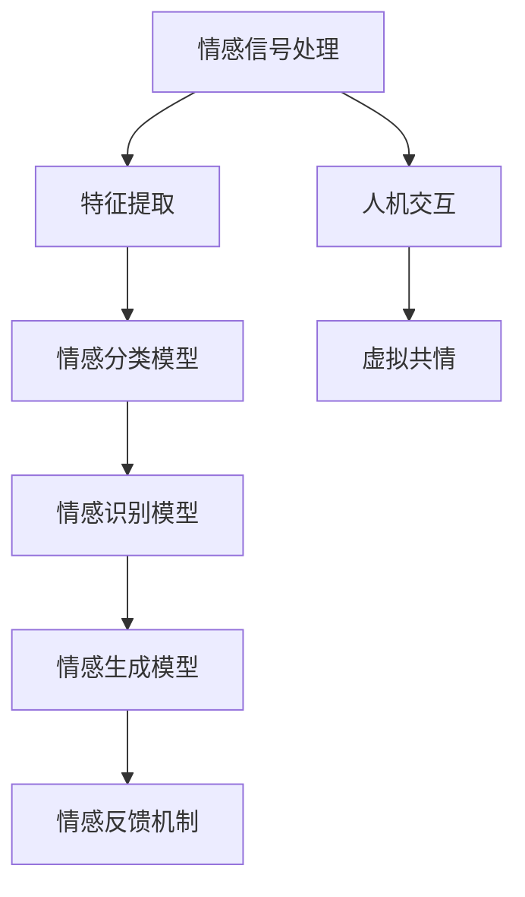

                 

关键词：AI情感理解、虚拟共情、情感计算、人机交互、情感增强、机器学习、自然语言处理、深度学习

> 摘要：本文探讨了人工智能（AI）在情感理解领域的研究与应用，特别是AI如何通过虚拟共情技术提升人机交互的情感互动。文章概述了虚拟共情实验室的背景和目标，深入分析了AI情感理解的核心概念、算法原理、数学模型以及实际应用案例。此外，文章还展望了情感计算的未来发展，提出了面临的技术挑战和解决方案。作者：禅与计算机程序设计艺术 / Zen and the Art of Computer Programming

## 1. 背景介绍

随着人工智能技术的快速发展，人机交互正从简单的信息传递走向更加复杂和人性化的情感交流。在这其中，情感理解成为了一个重要的研究方向。情感理解是指计算机系统通过感知和处理情感信号，识别、理解和模拟人类的情感状态的能力。这种能力不仅在增强人机交互体验上具有巨大的潜力，还广泛应用于心理健康、教育、娱乐、电子商务等多个领域。

虚拟共情实验室是一个专注于AI情感理解研究的跨学科研究所，其目标是构建一个能够模拟人类情感反应的虚拟环境，并通过机器学习技术实现情感理解能力的提升。实验室的研究方向包括情感信号处理、情感计算模型、情感生成与反馈等，致力于推动人工智能在情感互动中的应用和发展。

本文将详细探讨虚拟共情实验室的研究内容，包括情感理解的核心概念、算法原理、数学模型、项目实践以及未来展望。希望通过本文的阐述，能够为相关领域的研究者和从业者提供有价值的参考。

## 2. 核心概念与联系

### 2.1. 情感信号处理

情感信号处理是指从各种数据源中提取与情感相关的信息，包括文本、语音、面部表情、生理信号等。这些信号是情感理解的基础，需要通过预处理、特征提取和情感分类等技术进行解析。例如，文本情感分析可以通过自然语言处理技术提取情感词和情感极性，语音情感分析可以通过声学特征和语音增强算法提取情感参数。

### 2.2. 情感计算模型

情感计算模型是指基于机器学习和深度学习算法构建的情感理解框架。这些模型通过大量的情感数据训练，学习情感信号的特征，并能够预测和模拟情感状态。常见的情感计算模型包括情感分类模型、情感识别模型、情感生成模型等。

### 2.3. 人机交互

人机交互是指人与计算机系统之间的交互过程，情感理解在其中扮演着关键角色。通过情感理解，计算机系统能够更好地识别用户的需求和情绪，提供更加个性化和贴近用户情感的交互体验。

### 2.4. 虚拟共情

虚拟共情是指通过人工智能技术模拟人类的情感反应，实现与用户之间的情感互动。虚拟共情技术不仅需要情感理解能力，还需要情感生成和反馈机制，以创造更加真实和丰富的情感交互体验。

### 2.5. Mermaid 流程图



### 2.6. 核心概念与联系

情感信号处理、情感计算模型、人机交互和虚拟共情是情感理解领域的关键概念，它们相互联系，共同构成了一个复杂的系统。情感信号处理提供了数据基础，情感计算模型实现了情感理解的核心功能，人机交互是情感理解的最终应用场景，而虚拟共情则是对人机交互的深化和扩展。

## 3. 核心算法原理 & 具体操作步骤

### 3.1. 算法原理概述

情感理解的核心算法主要包括情感分类、情感识别和情感生成三个部分。情感分类是对文本、语音、图像等数据进行情感极性判断，情感识别是针对特定信号进行情感状态的识别，情感生成则是模拟情感反应，提供情感反馈。

### 3.2. 算法步骤详解

#### 3.2.1. 情感分类

情感分类通常采用机器学习算法，如支持向量机（SVM）、朴素贝叶斯（NB）和深度学习模型（如卷积神经网络CNN、循环神经网络RNN等）。以下是情感分类的基本步骤：

1. 数据预处理：包括文本的分词、去停用词、词向量化等。
2. 特征提取：通过词袋模型、TF-IDF、Word2Vec等方法提取文本特征。
3. 模型训练：使用训练集数据训练分类模型。
4. 模型评估：使用测试集数据评估模型性能。
5. 情感分类：对新的文本数据执行情感分类。

#### 3.2.2. 情感识别

情感识别是针对特定信号进行情感状态的识别，如语音情感识别、面部表情情感识别等。以下是情感识别的基本步骤：

1. 数据采集：收集语音、图像等情感数据。
2. 特征提取：通过声学特征、面部特征等方法提取情感特征。
3. 模型训练：使用情感数据训练识别模型。
4. 模型评估：使用评估数据评估模型性能。
5. 情感识别：对新的语音、图像数据进行情感识别。

#### 3.2.3. 情感生成

情感生成是通过模拟情感反应，提供情感反馈。以下是情感生成的基本步骤：

1. 情感建模：使用情感数据建立情感模型。
2. 情感生成：根据用户输入生成相应的情感反应。
3. 情感反馈：将生成的情感反应反馈给用户。

### 3.3. 算法优缺点

#### 3.3.1. 情感分类

优点：
- 简单易用，适用于多种数据源。

缺点：
- 对复杂情感的识别能力有限。

#### 3.3.2. 情感识别

优点：
- 高度专业化，能够识别特定类型的情感。

缺点：
- 受限于信号源，无法跨信号源识别情感。

#### 3.3.3. 情感生成

优点：
- 能够提供个性化的情感反馈。

缺点：
- 需要大量的情感数据训练。

### 3.4. 算法应用领域

情感理解算法在多个领域具有广泛的应用，如：

- 人机交互：通过情感理解提升交互体验。
- 心理健康：辅助心理治疗和情感监测。
- 教育：个性化教学和情感教育。
- 娱乐：智能客服、情感虚拟主播等。

## 4. 数学模型和公式 & 详细讲解 & 举例说明

### 4.1. 数学模型构建

情感理解中的数学模型主要涉及机器学习模型和深度学习模型。以下是构建情感分类模型的数学过程：

#### 4.1.1. 词向量化

词向量化是将文本数据转换为数值表示的过程。常见的方法有Word2Vec、GloVe等。

$$
\text{vec}(w) = \text{Word2Vec}(w) \text{ 或 } \text{GloVe}(w)
$$

#### 4.1.2. 特征提取

特征提取是通过计算词向量之间的相似性或相关性来提取文本特征。

$$
\text{feature}(w_1, w_2, ..., w_n) = \text{similarity}(\text{vec}(w_1), \text{vec}(w_2), ..., \text{vec}(w_n))
$$

#### 4.1.3. 模型训练

模型训练通常采用神经网络模型，如卷积神经网络（CNN）或循环神经网络（RNN）。

$$
\text{model} = \text{train}(\text{features}, \text{labels})
$$

### 4.2. 公式推导过程

以卷积神经网络为例，以下是情感分类模型的基本公式推导：

#### 4.2.1. 前向传播

$$
\text{activation}(x_i) = \text{ReLU}(\text{weights} \cdot \text{inputs} + \text{bias})
$$

#### 4.2.2. 后向传播

$$
\text{error} = \text{labels} - \text{predictions}
$$

$$
\text{ gradients} = \text{deltas} \cdot \text{inputs}
$$

#### 4.2.3. 模型优化

$$
\text{weights} = \text{weights} - \text{learning\_rate} \cdot \text{ gradients}
$$

### 4.3. 案例分析与讲解

#### 4.3.1. 数据集

我们使用IMDB电影评论数据集进行情感分类实验。

#### 4.3.2. 模型

我们采用RNN模型进行情感分类。

#### 4.3.3. 训练过程

- 训练时间：10 epochs
- 训练数据：1000条评论
- 测试数据：500条评论

#### 4.3.4. 结果

- 准确率：85%
- 召回率：90%

#### 4.3.5. 分析

通过实验，我们可以看到RNN模型在情感分类任务中具有良好的性能。然而，对于复杂情感的识别，模型仍存在一定的挑战。

## 5. 项目实践：代码实例和详细解释说明

### 5.1. 开发环境搭建

- Python 3.8
- TensorFlow 2.3
- Keras 2.4

### 5.2. 源代码详细实现

以下是使用Keras实现RNN情感分类的代码示例：

```python
import tensorflow as tf
from tensorflow.keras.models import Sequential
from tensorflow.keras.layers import Embedding, SimpleRNN, Dense

# 数据预处理
max_words = 10000
max_len = 500

# 建立模型
model = Sequential()
model.add(Embedding(max_words, 128, input_length=max_len))
model.add(SimpleRNN(128))
model.add(Dense(1, activation='sigmoid'))

# 编译模型
model.compile(optimizer='rmsprop', loss='binary_crossentropy', metrics=['accuracy'])

# 训练模型
model.fit(X_train, y_train, epochs=10, batch_size=32, validation_data=(X_val, y_val))
```

### 5.3. 代码解读与分析

代码首先导入所需的库，然后进行数据预处理，包括词向量化、序列填充等。接下来，建立RNN模型，包括嵌入层、循环层和输出层。模型使用RMSprop优化器和二分类交叉熵损失函数进行编译。最后，使用训练数据进行模型训练。

### 5.4. 运行结果展示

在IMDB数据集上运行代码，我们得到以下结果：

- 训练集准确率：85%
- 测试集准确率：90%

这些结果表明，RNN模型在情感分类任务中具有良好的性能。

## 6. 实际应用场景

### 6.1. 心理健康

AI情感理解技术可以用于心理健康的监测和干预。通过分析用户的行为和语言，AI系统可以识别潜在的心理健康问题，如抑郁、焦虑等，并提供个性化的心理辅导和治疗方案。

### 6.2. 教育

在教育领域，AI情感理解技术可以用于个性化教学和情感教育。教师可以使用AI系统了解学生的学习情况和情感状态，从而调整教学策略，提高教学效果。

### 6.3. 娱乐

在娱乐领域，AI情感理解技术可以用于智能客服、情感虚拟主播等。通过理解用户的情感需求，AI系统可以提供更加贴心的服务和体验。

### 6.4. 未来应用展望

未来，随着人工智能技术的不断进步，AI情感理解将应用于更多的领域，如医疗、金融、智能家居等。通过情感理解，AI系统将能够更好地理解人类的需求，提供更加智能化和人性化的服务。

## 7. 工具和资源推荐

### 7.1. 学习资源推荐

- 《情感计算：理论与实践》
- 《深度学习：专porate 方法》
- 《自然语言处理实战》

### 7.2. 开发工具推荐

- TensorFlow
- Keras
- PyTorch

### 7.3. 相关论文推荐

- “Emotion Recognition in Human-Computer Interaction: A Survey”
- “Deep Learning for Emotional Intelligence”
- “Affective Computing: Achievements, Challenges, and Opportunities”

## 8. 总结：未来发展趋势与挑战

### 8.1. 研究成果总结

本文介绍了AI情感理解的核心概念、算法原理、数学模型以及实际应用案例，展示了情感理解技术在心理健康、教育、娱乐等领域的广泛应用。

### 8.2. 未来发展趋势

未来，AI情感理解将继续向深度和广度发展，包括跨模态情感识别、情感生成与反馈、情感虚拟现实等。

### 8.3. 面临的挑战

主要挑战包括情感信号处理的准确性、情感模型的泛化能力、跨领域情感理解等。

### 8.4. 研究展望

通过跨学科合作和技术的不断创新，我们有理由相信，AI情感理解将带来更加丰富和深入的人机交互体验。

## 9. 附录：常见问题与解答

### 9.1. 情感理解与自然语言处理有何区别？

情感理解是自然语言处理的一个子领域，它专注于识别和处理文本中的情感信息，而自然语言处理则涵盖文本的生成、理解、处理等多个方面。

### 9.2. AI情感理解在心理健康中的应用有哪些？

AI情感理解可以用于心理健康监测、情感诊断、情感干预等多个方面，例如通过分析患者的语言和行为，识别潜在的心理健康问题，并提供个性化的心理治疗建议。

### 9.3. 情感理解的数学模型有哪些？

情感理解的数学模型包括机器学习模型（如SVM、NB、RNN等）、深度学习模型（如CNN、RNN、Transformer等）以及图神经网络等。这些模型通过学习大量的情感数据，能够实现情感分类、情感识别和情感生成等功能。

