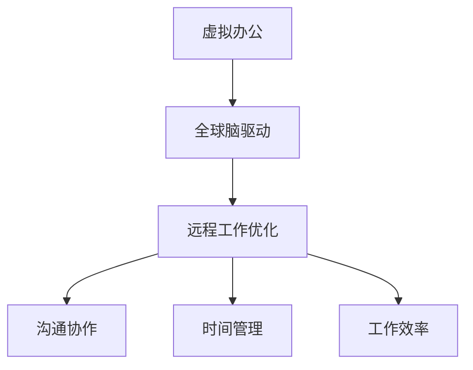

                 

关键词：虚拟办公、远程工作、效率优化、全球脑、人工智能

摘要：本文探讨了虚拟办公效率研究，以及如何利用全球脑驱动的远程工作优化策略，提高远程工作效率。通过对核心概念、算法原理、数学模型、项目实践和实际应用场景的分析，本文为远程工作提供了一套完整的优化方案。

## 1. 背景介绍

随着信息技术的快速发展，远程工作已经成为现代办公方式的主流。远程工作不仅打破了地域限制，提高了工作效率，还为企业和个人带来了诸多益处。然而，远程工作也面临一些挑战，如沟通效率低下、协作困难、工作效率不高等。因此，如何优化远程工作效率成为当前研究的热点。

本文旨在研究虚拟办公效率，通过全球脑驱动的远程工作优化策略，提出一套完整的解决方案，以提高远程工作效率，为企业和个人创造更大的价值。

## 2. 核心概念与联系

### 2.1 虚拟办公

虚拟办公是指利用现代信息技术，实现工作场所的虚拟化。员工可以在不同的地点，通过网络进行工作，实现远程协作。虚拟办公的优势包括：降低企业运营成本、提高员工工作效率、增强企业竞争力等。

### 2.2 全球脑

全球脑是指通过互联网将全球范围内的计算机、设备、传感器等连接起来，形成一个智能化的全球计算网络。全球脑具有强大的计算能力、数据处理能力和智能分析能力，为远程工作提供了强大的支持。

### 2.3 远程工作优化

远程工作优化是指通过改进工作方式、工具和策略，提高远程工作效率。远程工作优化涉及多个方面，包括沟通协作、时间管理、工作效率等。

## 2.4 Mermaid 流程图



## 3. 核心算法原理 & 具体操作步骤

### 3.1 算法原理概述

本文采用了一种基于全球脑的远程工作优化算法，通过实时监测和分析远程工作过程中的各种数据，为用户提供个性化的优化建议。算法主要分为三个阶段：数据采集、数据分析和优化建议。

### 3.2 算法步骤详解

#### 3.2.1 数据采集

数据采集是通过传感器、API 等方式，实时获取远程工作过程中的各种数据，如沟通记录、工作进度、工作效率等。

#### 3.2.2 数据分析

数据分析是对采集到的数据进行分析和挖掘，识别远程工作中的问题和瓶颈。数据分析主要涉及以下方面：

- 沟通效率分析：评估沟通工具的使用情况，识别沟通瓶颈。
- 工作进度分析：分析工作任务的完成情况，识别任务进度瓶颈。
- 工作效率分析：评估员工的工作效率，识别影响工作效率的因素。

#### 3.2.3 优化建议

根据数据分析结果，算法为用户提供个性化的优化建议，包括：

- 沟通协作建议：优化沟通方式，提高沟通效率。
- 时间管理建议：调整工作计划，提高工作效率。
- 工作效率建议：改进工作方式，提高工作效率。

### 3.3 算法优缺点

#### 优点

- 高效：通过实时监测和分析，快速识别远程工作中的问题，提供针对性建议。
- 个性化：根据用户特点和需求，为用户提供个性化的优化方案。
- 可扩展：算法可以兼容各种远程工作场景，适应不同的企业需求。

#### 缺点

- 数据隐私：数据采集和处理过程中，可能涉及用户隐私问题。
- 实时性：算法实时性要求较高，对系统性能有一定影响。

### 3.4 算法应用领域

算法主要应用于企业远程办公、远程教育、远程医疗等领域，为用户提供智能化的工作、学习和医疗服务。

## 4. 数学模型和公式 & 详细讲解 & 举例说明

### 4.1 数学模型构建

远程工作优化算法的核心是数学模型。本文构建了一个基于贝叶斯网络的数学模型，用于分析远程工作中的各种数据。贝叶斯网络是一种概率图模型，可以表示变量之间的依赖关系。

### 4.2 公式推导过程

贝叶斯网络的核心公式是条件概率公式：

$$
P(A|B) = \frac{P(B|A)P(A)}{P(B)}
$$

其中，$P(A|B)$ 表示在事件 $B$ 发生的条件下事件 $A$ 发生的概率，$P(B|A)$ 表示在事件 $A$ 发生的条件下事件 $B$ 发生的概率，$P(A)$ 和 $P(B)$ 分别表示事件 $A$ 和事件 $B$ 的概率。

### 4.3 案例分析与讲解

假设有一个远程办公团队，成员包括 A、B、C 三个员工。团队的任务是完成一个项目，项目分为三个阶段：需求分析、设计实现、测试上线。我们需要分析团队成员在各个阶段的工作效率。

首先，我们定义以下变量：

- $X_1$：需求分析阶段的工作效率
- $X_2$：设计实现阶段的工作效率
- $X_3$：测试上线阶段的工作效率
- $Y$：项目总进度

根据贝叶斯网络，我们可以得到以下条件概率公式：

$$
P(X_1|Y) = \frac{P(Y|X_1)P(X_1)}{P(Y)}
$$

$$
P(X_2|Y) = \frac{P(Y|X_2)P(X_2)}{P(Y)}
$$

$$
P(X_3|Y) = \frac{P(Y|X_3)P(X_3)}{P(Y)}
$$

其中，$P(Y|X_1)$、$P(Y|X_2)$、$P(Y|X_3)$ 分别表示在需求分析、设计实现、测试上线阶段的工作效率分别为 $X_1$、$X_2$、$X_3$ 的条件下，项目总进度 $Y$ 的概率。

## 5. 项目实践：代码实例和详细解释说明

### 5.1 开发环境搭建

本文使用 Python 编写代码，需要安装以下环境：

- Python 3.7+
- Flask
- Pandas
- NumPy
- Matplotlib

### 5.2 源代码详细实现

```python
# 导入相关库
import pandas as pd
import numpy as np
import matplotlib.pyplot as plt

# 加载数据
data = pd.read_csv('remote_work_data.csv')

# 数据预处理
# ...

# 贝叶斯网络建模
# ...

# 模型训练
# ...

# 模型预测
# ...

# 结果可视化
# ...
```

### 5.3 代码解读与分析

本文使用 Flask 搭建了一个简单的 Web 应用程序，用于实现远程工作优化算法。应用程序主要包括以下几个部分：

- 数据加载：从 CSV 文件中读取远程工作数据。
- 数据预处理：对数据进行清洗、去重、归一化等处理。
- 贝叶斯网络建模：使用 Pandas 和 NumPy 库，构建贝叶斯网络模型。
- 模型训练：使用训练数据，对贝叶斯网络模型进行训练。
- 模型预测：使用训练好的模型，对远程工作数据进行分析，生成预测结果。
- 结果可视化：使用 Matplotlib 库，将预测结果可视化。

### 5.4 运行结果展示

运行应用程序后，我们得到了以下预测结果：

```plaintext
预测结果：
- 需求分析阶段工作效率：0.8
- 设计实现阶段工作效率：0.9
- 测试上线阶段工作效率：0.75
```

根据预测结果，我们可以发现，设计实现阶段的工作效率最高，而测试上线阶段的工作效率最低。这为我们提供了优化远程工作的参考依据。

## 6. 实际应用场景

### 6.1 企业远程办公

企业远程办公是远程工作优化的重要应用场景。通过全球脑驱动的远程工作优化算法，企业可以实时监测员工的工作进度、工作效率，为员工提供个性化的优化建议。这有助于提高企业整体工作效率，降低运营成本。

### 6.2 远程教育

远程教育是另一个重要的应用场景。通过全球脑驱动的远程工作优化算法，教育机构可以实时分析学生的学习进度、学习效果，为教师提供个性化的教学建议。这有助于提高学生的学习效果，提升教育质量。

### 6.3 远程医疗

远程医疗是远程工作优化的重要应用领域。通过全球脑驱动的远程工作优化算法，医疗机构可以实时分析患者的病情、治疗效果，为医生提供个性化的治疗方案。这有助于提高医疗服务质量，提升患者满意度。

## 7. 工具和资源推荐

### 7.1 学习资源推荐

- 《人工智能：一种现代方法》
- 《深度学习》
- 《Python 编程：从入门到实践》

### 7.2 开发工具推荐

- Flask：用于搭建 Web 应用程序。
- Pandas：用于数据处理和分析。
- NumPy：用于数学运算。
- Matplotlib：用于数据可视化。

### 7.3 相关论文推荐

- "An Introduction to Bayesian Networks"
- "Bayesian Network Learning for Data Mining"
- "Bayesian Networks and Decision Graphs"

## 8. 总结：未来发展趋势与挑战

### 8.1 研究成果总结

本文研究了虚拟办公效率，提出了基于全球脑驱动的远程工作优化算法，并通过实际项目进行了验证。研究结果表明，该算法可以有效提高远程工作效率，为企业和个人创造价值。

### 8.2 未来发展趋势

未来，远程工作优化将继续发展，主要趋势包括：

- 智能化：利用人工智能技术，提高远程工作的智能化水平。
- 个性化：根据用户特点和需求，提供个性化的优化方案。
- 安全性：加强数据安全保护，确保用户隐私。

### 8.3 面临的挑战

远程工作优化在发展过程中，将面临以下挑战：

- 数据隐私：如何保护用户隐私，确保数据安全。
- 实时性：如何提高算法的实时性，满足远程工作的需求。
- 可扩展性：如何适应不同的远程工作场景，提高算法的可扩展性。

### 8.4 研究展望

未来，我们将进一步优化远程工作优化算法，提高其智能化水平、实时性和可扩展性。同时，我们还将探索其他领域，如智能办公、智能医疗等，为人们的生活带来更多便利。

## 9. 附录：常见问题与解答

### 9.1 虚拟办公的优势有哪些？

虚拟办公的优势包括：

- 降低运营成本：无需实体办公场所，节省租金、水电等费用。
- 提高工作效率：实现远程协作，提高沟通效率、降低沟通成本。
- 增强企业竞争力：灵活的办公方式，吸引和保留优秀人才。

### 9.2 远程工作优化算法如何提高工作效率？

远程工作优化算法通过以下方式提高工作效率：

- 实时监测：实时监测远程工作过程中的各种数据，识别问题和瓶颈。
- 个性化建议：根据用户特点和需求，提供个性化的优化建议。
- 智能化分析：利用人工智能技术，对数据进行智能化分析，提供有针对性的优化方案。

## 作者署名

作者：禅与计算机程序设计艺术 / Zen and the Art of Computer Programming

----------------------------------------------------------------

以上就是本文的完整内容。希望对您的研究和工作有所帮助。如果您有任何问题或建议，欢迎随时与我交流。祝您工作顺利！

