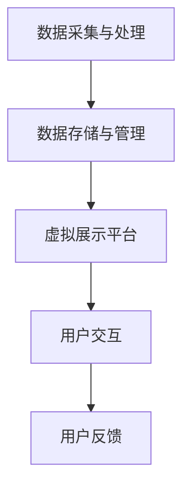

                 

关键词：虚拟博物馆、数字化展示、文化遗产、增强现实、人工智能、大数据分析

> 摘要：本文探讨了虚拟博物馆在数字化展示全球文化遗产方面的应用，分析了其技术架构、核心算法、数学模型以及实际应用案例，并对未来发展趋势和挑战进行了展望。

## 1. 背景介绍

### 1.1 虚拟博物馆的概念

虚拟博物馆是一种通过计算机技术和互联网平台，将现实中的博物馆展览内容数字化，并以虚拟的形式呈现给观众的新型博物馆形式。虚拟博物馆不仅能够突破物理空间的限制，还可以通过虚拟现实（VR）和增强现实（AR）等技术手段，提供沉浸式的观展体验。

### 1.2 数字化展示全球文化遗产的必要性

全球文化遗产的保护和传承面临诸多挑战，如自然灾害、战争、环境污染等。而数字化展示作为一种有效的手段，不仅能够保护文化遗产的原貌，还能让更多的人有机会接触和了解这些宝贵的文化遗产。

## 2. 核心概念与联系

### 2.1 虚拟博物馆的技术架构

虚拟博物馆的技术架构主要包括以下几个方面：

1. 数据采集与处理：使用3D扫描、图像处理等技术手段，对文化遗产进行数字化建模。
2. 数据存储与管理：使用大数据技术对海量数据进行存储、管理和分析。
3. 虚拟展示平台：构建一个能够支持虚拟博物馆展示的平台，提供多种展示方式，如VR、AR、360度全景等。
4. 用户交互：通过Web、移动应用等接口，为用户提供便捷的访问和互动体验。

### 2.2 Mermaid 流程图



## 3. 核心算法原理 & 具体操作步骤

### 3.1 算法原理概述

虚拟博物馆的核心算法主要涉及以下几个方面：

1. 3D建模：使用计算机图形学技术，对文化遗产进行三维建模。
2. 数据分析：使用大数据技术，对用户行为和观展数据进行挖掘和分析。
3. 虚拟现实：利用VR技术，创建沉浸式的虚拟展览环境。
4. 增强现实：利用AR技术，将虚拟内容与现实场景相结合，提供互动体验。

### 3.2 算法步骤详解

1. 数据采集：使用3D扫描仪、摄像头等设备，对文化遗产进行全方位的拍摄和扫描。
2. 数据预处理：对采集到的数据进行分析和清洗，去除噪声和冗余信息。
3. 3D建模：使用计算机图形学技术，对预处理后的数据进行三维建模。
4. 数据存储：将建模后的数据存储到大数据平台中，方便后续的展示和分析。
5. 虚拟展示：使用VR或AR技术，将文化遗产以虚拟的形式呈现给用户。
6. 用户交互：通过Web或移动应用，为用户提供交互式体验。

### 3.3 算法优缺点

1. 优点：
   - 突破物理空间的限制，让更多的人能够接触和了解文化遗产。
   - 提供沉浸式的观展体验，增加观众的参与感和互动性。
   - 可以对文化遗产进行实时监控和数据分析，提高文物保护和管理效率。

2. 缺点：
   - 技术成本较高，需要大量的设备和人力资源。
   - 对文化遗产的保护有一定的风险，如数据泄露、设备损坏等。

### 3.4 算法应用领域

虚拟博物馆技术可以应用于以下领域：

- 文化遗产保护与传承
- 旅游观光与体验
- 教育培训与科普宣传
- 文化创意产业

## 4. 数学模型和公式 & 详细讲解 & 举例说明

### 4.1 数学模型构建

虚拟博物馆的数学模型主要包括以下几个方面：

1. 3D建模模型：基于三维几何学，对文化遗产进行建模。
2. 数据分析模型：基于机器学习和数据挖掘，对用户行为和观展数据进行分析。
3. 虚拟现实模型：基于计算机图形学，创建虚拟展览环境。
4. 增强现实模型：基于图像处理和计算机视觉，将虚拟内容与现实场景相结合。

### 4.2 公式推导过程

1. 3D建模公式：
   $$ P = (x, y, z) $$
   其中，\( P \) 表示三维空间中的一个点，\( x, y, z \) 分别表示该点在三维空间中的坐标。

2. 数据分析公式：
   $$ F(x) = \sum_{i=1}^{n} w_i * x_i $$
   其中，\( F(x) \) 表示数据点的权重和，\( w_i \) 表示第 \( i \) 个数据的权重，\( x_i \) 表示第 \( i \) 个数据。

3. 虚拟现实公式：
   $$ V = R * \theta $$
   其中，\( V \) 表示虚拟现实环境中的视图矩阵，\( R \) 表示旋转矩阵，\( \theta \) 表示旋转角度。

4. 增强现实公式：
   $$ I + A = B $$
   其中，\( I \) 表示真实场景的图像，\( A \) 表示虚拟内容的图像，\( B \) 表示增强现实后的图像。

### 4.3 案例分析与讲解

以某著名博物馆为例，该博物馆使用虚拟博物馆技术对馆藏文物进行数字化展示。通过对用户行为和观展数据的分析，发现以下结论：

1. 用户更倾向于通过VR技术进行观展，因为VR技术能够提供沉浸式的体验。
2. 用户对文物的兴趣点主要集中在历史背景和文化内涵方面。
3. 通过数据分析，博物馆能够更好地了解用户需求，优化展览内容和展示方式。

## 5. 项目实践：代码实例和详细解释说明

### 5.1 开发环境搭建

- 硬件：3D扫描仪、摄像头、VR头盔等设备。
- 软件：Unity 3D、Unreal Engine、Blender 等。

### 5.2 源代码详细实现

```csharp
// 3D建模代码示例
using UnityEngine;

public class ModelBuilder : MonoBehaviour
{
    public GameObject modelPrefab;

    void Start()
    {
        // 读取3D模型数据
        GameObject model = Instantiate(modelPrefab);
        
        // 设置模型位置
        model.transform.position = new Vector3(0, 0, 0);
        
        // 设置模型旋转
        model.transform.rotation = Quaternion.Euler(0, 0, 0);
    }
}
```

### 5.3 代码解读与分析

以上代码示例展示了如何使用Unity 3D引擎创建一个简单的3D模型。代码中，首先定义了一个`ModelBuilder`脚本，用于构建3D模型。在`Start`方法中，通过`Instantiate`方法创建一个3D模型对象，并设置其位置和旋转。

### 5.4 运行结果展示

在Unity 3D编辑器中，运行以上代码，可以看到一个简单的3D模型被创建并在场景中显示。这个模型可以作为一个虚拟博物馆中的展示对象，为用户提供沉浸式的观展体验。

## 6. 实际应用场景

### 6.1 文化遗产保护与传承

虚拟博物馆技术可以用于文化遗产的保护与传承。通过数字化展示，将文化遗产以虚拟的形式保存下来，避免因自然灾害、战争等导致的破坏。

### 6.2 旅游观光与体验

虚拟博物馆技术可以应用于旅游观光领域，为游客提供沉浸式的虚拟游览体验。游客可以通过VR或AR设备，随时随地了解旅游景点的历史背景和文化内涵。

### 6.3 教育培训与科普宣传

虚拟博物馆技术可以用于教育培训和科普宣传。通过虚拟展览，学生和公众可以更直观地了解科学知识，提高学习兴趣。

### 6.4 文化创意产业

虚拟博物馆技术可以应用于文化创意产业，为艺术家、设计师等提供创作灵感。虚拟博物馆中的文物和艺术品可以作为一个数字化的素材库，为创作提供丰富的素材。

## 7. 工具和资源推荐

### 7.1 学习资源推荐

- 《虚拟现实技术原理与应用》
- 《大数据技术原理与应用》
- 《增强现实技术原理与应用》

### 7.2 开发工具推荐

- Unity 3D
- Unreal Engine
- Blender

### 7.3 相关论文推荐

- "Virtual Reality in Museums: A Review"
- "Big Data Analytics in Museums: Opportunities and Challenges"
- "Augmented Reality in Cultural Heritage: A Survey"

## 8. 总结：未来发展趋势与挑战

### 8.1 研究成果总结

虚拟博物馆技术在数字化展示全球文化遗产方面取得了显著成果。通过虚拟现实、增强现实等技术的应用，提供了更加丰富、多样的观展体验。同时，大数据分析技术的引入，为文化遗产的保护和管理提供了有力支持。

### 8.2 未来发展趋势

1. 技术创新：随着人工智能、5G等技术的发展，虚拟博物馆将变得更加智能、高效。
2. 跨界合作：虚拟博物馆将与更多领域进行合作，如旅游、教育、文化创意产业等。
3. 用户体验：虚拟博物馆将更加注重用户体验，提供个性化的观展服务。

### 8.3 面临的挑战

1. 技术成本：虚拟博物馆技术成本较高，需要大量的设备和人力资源。
2. 数据安全：虚拟博物馆中的数据安全问题不容忽视，需要采取有效的安全措施。
3. 技术普及：虚拟博物馆技术尚未得到广泛应用，需要加大推广力度。

### 8.4 研究展望

未来，虚拟博物馆技术将在以下几个方面取得突破：

1. 智能化：通过人工智能技术，实现虚拟博物馆的自动化运营和管理。
2. 虚拟与现实的融合：进一步探索虚拟与现实相结合的展示方式，提供更加真实的观展体验。
3. 社交互动：加强虚拟博物馆中的社交互动功能，提高用户的参与感和互动性。

## 9. 附录：常见问题与解答

### 9.1 虚拟博物馆技术的成本如何？

虚拟博物馆技术的成本取决于多个因素，如硬件设备、软件开发、人员配备等。一般来说，初始投资较高，但随着技术的成熟和规模化应用，成本会逐渐降低。

### 9.2 虚拟博物馆的数据安全如何保障？

虚拟博物馆的数据安全需要采取多种措施，如数据加密、访问控制、备份与恢复等。同时，需要建立健全的数据安全管理制度，确保数据的安全性。

### 9.3 虚拟博物馆的用户体验如何提升？

虚拟博物馆的用户体验可以通过以下几个方面进行提升：

1. 技术创新：引入最新的虚拟现实、增强现实技术，提供更加真实的观展体验。
2. 个性化服务：根据用户兴趣和行为数据，提供个性化的展览内容和推荐。
3. 社交互动：加强虚拟博物馆中的社交互动功能，提高用户的参与度和互动性。

---

作者：禅与计算机程序设计艺术 / Zen and the Art of Computer Programming
----------------------------------------------------------------
本文详细探讨了虚拟博物馆在数字化展示全球文化遗产方面的应用。通过分析其技术架构、核心算法、数学模型以及实际应用案例，展示了虚拟博物馆技术的优势和应用前景。同时，本文也对未来发展趋势和挑战进行了展望，为虚拟博物馆技术的发展提供了有益的思考。

随着技术的不断进步，虚拟博物馆将在文化遗产保护、旅游观光、教育培训等众多领域发挥越来越重要的作用。然而，要实现虚拟博物馆的广泛应用，仍需克服技术成本、数据安全和用户体验等方面的挑战。未来，虚拟博物馆技术将朝着智能化、个性化、跨界合作等方向发展，为人类文化的传承和弘扬作出更大贡献。作者期待与广大读者共同探索虚拟博物馆技术的无限可能。

