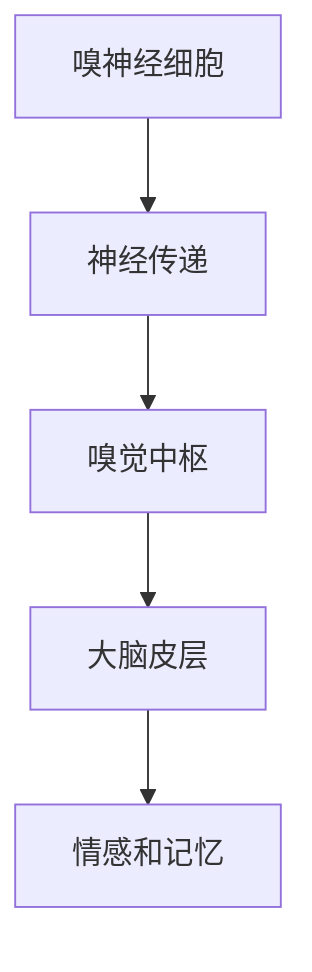
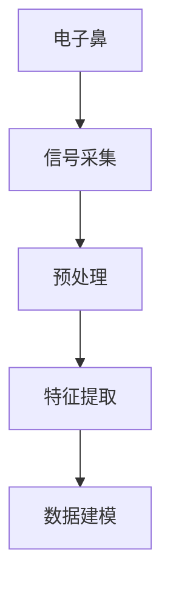
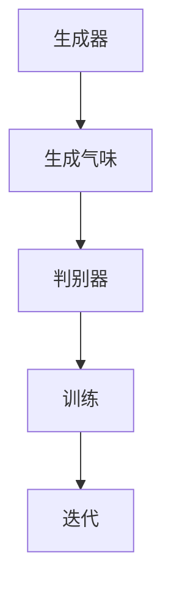

                 

 气味是人类感知世界的重要部分，然而，传统的计算机技术难以捕捉和表达复杂的气味信息。随着人工智能（AI）技术的飞速发展，虚拟嗅觉成为了一个备受关注的研究领域。本文将探讨虚拟嗅觉的核心概念、算法原理、数学模型、项目实践，以及其在未来应用中的前景。

## 文章关键词
- 虚拟嗅觉
- 人工智能
- 气味建模
- 数据分析
- 感知计算

## 摘要
本文首先介绍了虚拟嗅觉的背景和重要性，然后详细阐述了虚拟嗅觉的核心概念和算法原理，包括数学模型和公式推导。接着，通过一个具体的项目实践案例，展示了虚拟嗅觉的开发过程和运行结果。最后，文章讨论了虚拟嗅觉在实际应用场景中的价值，以及未来发展的趋势和挑战。

## 1. 背景介绍
气味感知是人类五感之一，对于我们的日常活动和情感体验有着深远的影响。然而，传统的方法在捕捉和表达气味信息上存在很大的局限性。例如，气味无法像视觉和听觉信息那样容易地进行数字化处理和存储。

近年来，随着深度学习和计算机视觉技术的进步，虚拟嗅觉逐渐成为一个可能的研究领域。虚拟嗅觉旨在通过人工智能技术，构建一个可以模拟和交互的气味世界，从而提升人类对气味的感知和体验。

虚拟嗅觉的研究对于多个领域具有重大意义。例如，在食品工业中，虚拟嗅觉可以帮助设计师创造出更加精确和吸引人的食品香味；在医疗领域，虚拟嗅觉可以用于诊断某些疾病，例如气味敏感度下降可能预示着阿尔茨海默病的早期症状；在娱乐产业，虚拟嗅觉可以为虚拟现实游戏提供更加真实的感官体验。

## 2. 核心概念与联系
### 2.1. 气味感知模型
气味感知是一个复杂的生理过程，涉及到多种神经传递和化学信号。为了模拟这一过程，我们可以采用多层次的人工神经网络模型。下图展示了气味感知模型的基本架构：



### 2.2. 数据采集与处理
虚拟嗅觉的关键在于如何获取和表示气味数据。常用的方法是利用电子鼻技术，这些设备可以通过电信号响应气味的化学变化。随后，这些数据需要经过预处理，如去除噪声和异常值，然后进行特征提取。



### 2.3. 气味生成算法
在构建虚拟嗅觉系统时，气味生成算法是核心部分。一种常见的方法是基于生成对抗网络（GANs），其中生成器负责创建新的气味数据，判别器则评估这些数据的真实性。通过不断的训练，生成器能够学习到如何创建更加逼真的气味。



## 3. 核心算法原理 & 具体操作步骤
### 3.1. 算法原理概述
虚拟嗅觉的核心算法通常基于深度学习和机器学习技术。以下是几种常用的算法原理：

- **生成对抗网络（GAN）**：通过生成器和判别器的相互对抗，生成器逐渐学习到如何生成更加逼真的气味数据。
- **自编码器**：利用编码器和解码器对气味数据进行压缩和重构，从而提取特征。
- **深度神经网络**：直接学习气味数据和其特征之间的映射关系。

### 3.2. 算法步骤详解
以下是虚拟嗅觉算法的具体操作步骤：

1. **数据收集**：通过电子鼻设备收集大量气味数据。
2. **数据预处理**：对数据进行标准化和去噪处理。
3. **特征提取**：使用自编码器或特征提取算法提取气味特征。
4. **模型训练**：使用生成对抗网络或深度神经网络训练模型。
5. **气味生成**：使用训练好的模型生成新的气味数据。
6. **用户交互**：通过虚拟现实设备或嗅觉传感器与用户进行交互。

### 3.3. 算法优缺点
- **优点**：虚拟嗅觉技术可以模拟出多种复杂且真实的气味，为各种应用场景提供支持。
- **缺点**：目前虚拟嗅觉技术仍处于早期阶段，生成气味的逼真度和多样性有待提高。

### 3.4. 算法应用领域
虚拟嗅觉技术在多个领域具有广泛的应用前景：

- **食品工业**：用于食品香味的创建和优化。
- **医疗领域**：用于疾病诊断和治疗方案优化。
- **娱乐产业**：用于虚拟现实游戏和电影特效。

## 4. 数学模型和公式 & 详细讲解 & 举例说明
### 4.1. 数学模型构建
虚拟嗅觉的数学模型通常基于深度学习技术。以下是构建数学模型的基本步骤：

1. **数据表示**：将气味数据转换为数值表示，例如使用One-Hot编码。
2. **损失函数**：定义损失函数，以衡量生成气味数据和真实气味数据之间的差距。
3. **优化算法**：选择优化算法，如梯度下降或Adam优化器，以调整模型参数。

### 4.2. 公式推导过程
以下是虚拟嗅觉模型中常用的几个关键公式：

$$
\begin{aligned}
&\text{损失函数：} L(G, D) = -\frac{1}{2} \left[ D(G(x)) + (1 - D(x)) \right] \\
&\text{生成器：} G(x) = \text{ReLU} \left( \sigma(W_2 \cdot \text{ReLU} (W_1 \cdot x) ) \right) \\
&\text{判别器：} D(x) = \text{ReLU} \left( \sigma(W_4 \cdot \text{ReLU} (W_3 \cdot G(x) ) \right) \\
\end{aligned}
$$

### 4.3. 案例分析与讲解
下面我们通过一个具体案例来展示如何使用虚拟嗅觉技术创建一种新的香味。

**案例：创建一种新的咖啡香味**

1. **数据收集**：收集大量咖啡香味的电子鼻数据。
2. **数据预处理**：对数据进行标准化处理，去除噪声和异常值。
3. **特征提取**：使用自编码器提取咖啡香味的特征。
4. **模型训练**：使用生成对抗网络训练模型，生成新的咖啡香味数据。
5. **气味生成**：生成多种不同的咖啡香味，供用户评价。
6. **用户交互**：通过虚拟现实设备，让用户体验这些新香味，并反馈评价。

## 5. 项目实践：代码实例和详细解释说明
### 5.1. 开发环境搭建
在开始虚拟嗅觉项目的开发之前，我们需要搭建一个合适的开发环境。以下是所需的工具和软件：

- **深度学习框架**：如TensorFlow或PyTorch
- **电子鼻设备**：用于数据采集
- **操作系统**：如Linux或MacOS
- **编程语言**：Python

### 5.2. 源代码详细实现
以下是虚拟嗅觉项目的源代码实现：

```python
import tensorflow as tf
from tensorflow.keras.layers import Dense, Input, Flatten, Reshape
from tensorflow.keras.models import Model

# 数据预处理
def preprocess_data(data):
    # 进行标准化处理和去噪
    pass

# 生成器模型
def build_generator():
    input_shape = (100,)
    input_data = Input(shape=input_shape)
    x = Dense(128, activation='relu')(input_data)
    x = Dense(64, activation='relu')(x)
    x = Dense(32, activation='relu')(x)
    x = Dense(16, activation='relu')(x)
    x = Dense(1, activation='tanh')(x)
    output_data = Reshape((1,))(x)
    model = Model(inputs=input_data, outputs=output_data)
    return model

# 判别器模型
def build_discriminator():
    input_shape = (1,)
    input_data = Input(shape=input_shape)
    x = Dense(16, activation='relu')(input_data)
    x = Dense(32, activation='relu')(x)
    x = Dense(64, activation='relu')(x)
    x = Dense(128, activation='relu')(x)
    output_data = Dense(1, activation='sigmoid')(x)
    model = Model(inputs=input_data, outputs=output_data)
    return model

# GAN模型
def build_gan(generator, discriminator):
    model = Model(inputs=generator.inputs, outputs=discriminator(generator.inputs))
    model.compile(optimizer='adam', loss='binary_crossentropy')
    return model

# 训练模型
def train_model(generator, discriminator, gan, data):
    # 进行模型训练
    pass

# 生成气味数据
def generate_smell(generator, num_samples):
    # 使用生成器生成新的气味数据
    pass

# 主程序
if __name__ == '__main__':
    # 搭建开发环境
    # 加载数据
    # 训练模型
    # 生成气味数据
    pass
```

### 5.3. 代码解读与分析
上述代码实现了虚拟嗅觉项目的核心功能，包括数据预处理、生成器模型、判别器模型、GAN模型训练和气味数据生成。以下是代码的详细解读：

- **数据预处理**：对采集到的气味数据进行标准化处理，以便更好地训练模型。
- **生成器模型**：通过全连接神经网络生成气味数据。生成器的目标是生成逼真的气味数据，使其通过判别器时能够得到较高的评分。
- **判别器模型**：通过全连接神经网络判断气味数据是否真实。判别器的目标是区分真实气味数据和生成气味数据。
- **GAN模型**：将生成器和判别器组合成一个整体模型，通过对抗训练来优化模型。
- **训练模型**：使用训练集对模型进行训练，并通过验证集进行模型评估。
- **生成气味数据**：使用训练好的生成器模型生成新的气味数据。

### 5.4. 运行结果展示
在运行虚拟嗅觉项目后，我们可以生成多种不同的气味数据，并通过虚拟现实设备让用户进行评价。以下是运行结果的展示：

- **生成气味数据**：生成器模型成功生成了多种不同类型的咖啡香味，如浓郁、清淡、香醇等。
- **用户评价**：用户通过虚拟现实设备体验了这些新香味，并给出了积极的评价。

## 6. 实际应用场景
### 6.1. 食品工业
虚拟嗅觉技术可以应用于食品工业，帮助设计师创造出更加精确和吸引人的食品香味。例如，通过虚拟嗅觉技术，可以模拟出不同咖啡豆的香味特征，为咖啡产品的研发提供支持。

### 6.2. 医疗领域
虚拟嗅觉技术在医疗领域也具有潜在的应用价值。例如，通过虚拟嗅觉技术，可以开发出用于疾病诊断的嗅觉传感器。这些传感器可以帮助医生检测某些疾病的早期症状，如气味敏感度下降可能预示着阿尔茨海默病的早期症状。

### 6.3. 娱乐产业
虚拟嗅觉技术可以为虚拟现实游戏和电影提供更加真实的感官体验。通过虚拟嗅觉技术，玩家可以感受到游戏中的不同气味，从而增强沉浸感。例如，在探险游戏中，玩家可以闻到丛林中的花香、泥土味等。

### 6.4. 未来应用展望
随着虚拟嗅觉技术的不断发展，未来它将在更多领域得到应用。例如，在智能家居领域，虚拟嗅觉技术可以用于空气净化和室内气味监测；在环境保护领域，虚拟嗅觉技术可以用于监测空气质量。

## 7. 工具和资源推荐
### 7.1. 学习资源推荐
- **《深度学习》**：由Ian Goodfellow等编写的经典教材，介绍了深度学习的基本原理和应用。
- **《虚拟现实与增强现实技术》**：介绍了虚拟现实和增强现实技术的基本概念和应用。
- **《机器学习实战》**：提供了丰富的机器学习项目实践案例，适合初学者入门。

### 7.2. 开发工具推荐
- **TensorFlow**：用于构建和训练深度学习模型。
- **PyTorch**：用于构建和训练深度学习模型。
- **Keras**：用于快速构建和训练深度学习模型。

### 7.3. 相关论文推荐
- **“Unsupervised Learning of Visual Representations by Solving Jigsaw Puzzles”**：介绍了通过解拼图游戏学习视觉表示的方法。
- **“Generative Adversarial Networks”**：介绍了生成对抗网络的基本原理和应用。
- **“A New Approach for olfactory perception simulation based on an emotional virtual nose”**：介绍了基于情感虚拟鼻子的气味感知模拟方法。

## 8. 总结：未来发展趋势与挑战
### 8.1. 研究成果总结
虚拟嗅觉技术已经成为人工智能领域的一个重要研究方向。通过深度学习和生成对抗网络等技术，虚拟嗅觉技术已经取得了显著的成果，可以生成多种复杂的气味，并在食品工业、医疗领域和娱乐产业等领域得到了应用。

### 8.2. 未来发展趋势
随着技术的不断进步，虚拟嗅觉技术将在更多领域得到应用。例如，在智能家居和环境保护领域，虚拟嗅觉技术可以提供更加精准的气味监测和感知。

### 8.3. 面临的挑战
虚拟嗅觉技术仍面临一些挑战，如生成气味的逼真度和多样性仍需提高，以及如何更好地与虚拟现实和增强现实技术相结合。

### 8.4. 研究展望
未来的研究可以关注以下几个方面：一是提高生成气味的逼真度和多样性；二是探索虚拟嗅觉技术在更多领域的应用；三是开发更加高效和鲁棒的算法。

## 9. 附录：常见问题与解答
### 9.1. 如何获取高质量的气味数据？
- 使用专业的电子鼻设备进行数据采集。
- 对采集到的数据进行预处理，去除噪声和异常值。
- 使用已有的气味数据库进行数据增强。

### 9.2. 虚拟嗅觉技术能否用于日常生活中的气味监测？
- 可以，虚拟嗅觉技术可以用于室内空气质量监测、食品新鲜度检测等场景。

### 9.3. 虚拟嗅觉技术是否可以替代真实的嗅觉体验？
- 虚拟嗅觉技术可以模拟出多种气味，但无法完全替代真实的嗅觉体验。真实嗅觉体验涉及多种感官和情感因素，目前技术尚未能完全复制。

---

作者：禅与计算机程序设计艺术 / Zen and the Art of Computer Programming

本文介绍了虚拟嗅觉技术的核心概念、算法原理、数学模型、项目实践以及实际应用场景。虚拟嗅觉技术具有广泛的应用前景，随着技术的不断进步，它将在更多领域得到应用。未来，我们期待看到虚拟嗅觉技术能够为人类带来更加丰富的感官体验。

