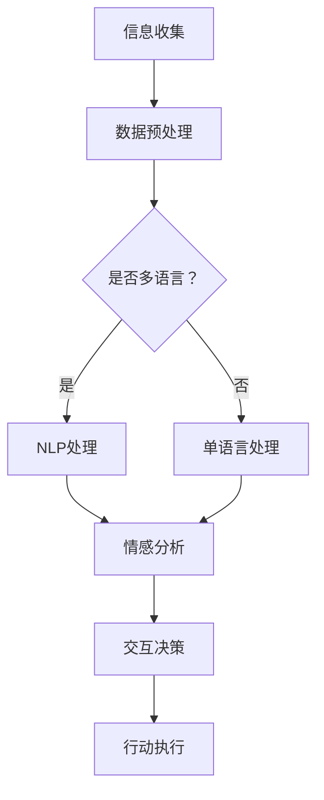
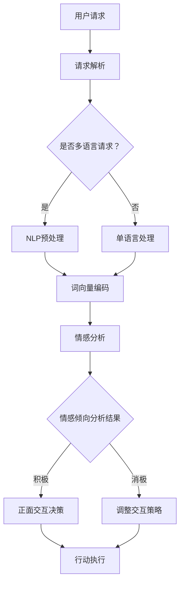

                 

关键词：AI、虚拟外交、跨文化交流、技术语言、深度学习、自然语言处理、多模态交互、国际关系、文化多样性、智能对话系统、全球化

> 摘要：本文旨在探讨AI技术在虚拟外交中的潜力，特别是在跨文化交流领域的应用。通过分析AI算法、数学模型及实际项目案例，本文揭示了虚拟外交在AI时代的重要性和发展方向。

## 1. 背景介绍

在当今全球化的背景下，国际关系和跨文化交流变得日益重要。然而，由于语言、文化差异和沟通障碍，传统的外交手段面临着诸多挑战。为了解决这些问题，人工智能（AI）作为一种新兴技术，开始被广泛应用于虚拟外交领域。

虚拟外交是指通过数字技术实现的非面对面外交活动，包括在线会议、虚拟谈判和远程协作等。而AI作为虚拟外交的核心驱动力，能够显著提高跨文化交流的效率和质量。AI技术，如自然语言处理（NLP）、深度学习和多模态交互，使得虚拟外交系统更加智能化、个性化，并能处理复杂的跨文化沟通任务。

### 1.1 AI在虚拟外交中的重要性

AI技术在虚拟外交中的应用具有多重重要性：

- **提高沟通效率**：AI能够自动处理大量信息，加快沟通速度，减少人力成本。
- **增强决策支持**：通过分析海量数据，AI可以提供更有针对性的决策建议，帮助外交官更好地应对复杂局势。
- **促进文化理解**：AI系统能够理解不同文化背景的语言和表达方式，促进跨文化之间的理解和协作。

### 1.2 跨文化交流的挑战

跨文化交流面临的挑战主要包括：

- **语言障碍**：不同语言和文化背景下的表达方式差异较大，导致沟通不畅。
- **文化差异**：不同的社会文化习俗和价值观会影响外交行为的解释和理解。
- **信息不对称**：双方在信息获取和分享上可能存在不平衡，导致沟通失衡。

## 2. 核心概念与联系

### 2.1 AI技术核心概念

为了更好地理解AI在虚拟外交中的应用，我们需要先介绍几个核心概念：

- **自然语言处理（NLP）**：NLP是AI的一个重要分支，旨在使计算机理解和处理人类语言。
- **深度学习**：一种基于人工神经网络的机器学习技术，通过多层网络结构来学习和模拟人类大脑的思维方式。
- **多模态交互**：通过结合多种信息来源（如文本、语音、图像等）进行交互，实现更丰富的用户体验。

### 2.2 跨文化交流与AI技术联系

AI技术与跨文化交流的紧密联系体现在以下几个方面：

- **语言翻译**：NLP技术可以自动翻译不同语言，消除语言障碍。
- **情感分析**：AI可以通过分析文本情感，识别文化背景和情感倾向，提高沟通效果。
- **个性化服务**：AI可以根据用户的文化偏好和沟通习惯，提供定制化的沟通策略。

### 2.3 Mermaid 流程图

以下是一个简单的Mermaid流程图，展示了AI技术在虚拟外交中的应用流程：



### 2.4 核心算法原理

#### 2.4.1 自然语言处理（NLP）

NLP的核心算法包括：

- **词向量模型**：将单词映射到高维空间，使得语义相近的单词在空间中彼此接近。
- **序列到序列（Seq2Seq）模型**：用于翻译等任务，通过编码和解码两个神经网络来处理输入和输出序列。

#### 2.4.2 情感分析

情感分析的核心算法包括：

- **基于规则的方法**：通过预定义的规则进行文本分类。
- **机器学习方法**：使用分类算法（如支持向量机、决策树等）来训练模型。

#### 2.4.3 多模态交互

多模态交互的核心算法包括：

- **语音识别**：将语音信号转换为文本。
- **图像识别**：通过卷积神经网络（CNN）识别图像内容。
- **多模态融合**：将不同模态的信息融合，提高交互质量。

### 2.5 Mermaid 流程图

以下是一个更详细的Mermaid流程图，展示了AI技术在虚拟外交中的应用流程，包括算法细节：



## 3. 核心算法原理 & 具体操作步骤

### 3.1 算法原理概述

在本节中，我们将详细探讨AI技术在虚拟外交中的核心算法原理，包括自然语言处理、情感分析和多模态交互。

#### 3.1.1 自然语言处理（NLP）

自然语言处理是AI技术中最为重要的分支之一。其主要任务包括：

- **文本分类**：将文本数据分为不同的类别。
- **实体识别**：识别文本中的特定实体，如人名、地点等。
- **关系抽取**：从文本中抽取实体之间的关系。

NLP的核心算法包括：

- **词袋模型**：将文本表示为一组单词的出现频率。
- **朴素贝叶斯分类器**：基于贝叶斯定理进行文本分类。
- **卷积神经网络（CNN）**：用于文本分类和实体识别。

#### 3.1.2 情感分析

情感分析是NLP的一个重要应用，旨在识别文本中的情感倾向。其核心算法包括：

- **基于规则的分类器**：通过预定义的规则进行情感分类。
- **支持向量机（SVM）**：用于情感分类的机器学习算法。
- **深度学习方法**：如循环神经网络（RNN）和长短时记忆网络（LSTM），用于更复杂的情感分析。

#### 3.1.3 多模态交互

多模态交互旨在结合多种信息来源，提高虚拟外交系统的交互质量。其核心算法包括：

- **语音识别**：通过深度学习模型将语音信号转换为文本。
- **图像识别**：通过卷积神经网络识别图像内容。
- **多模态融合**：将不同模态的信息融合，实现更智能的交互。

### 3.2 算法步骤详解

#### 3.2.1 自然语言处理（NLP）

NLP的具体操作步骤如下：

1. **文本预处理**：包括去除标点、停用词处理、词干提取等。
2. **词向量编码**：将文本转换为词向量，常用的模型有Word2Vec、GloVe等。
3. **文本分类**：使用分类算法（如SVM、CNN）对文本进行分类。
4. **实体识别**：使用RNN或LSTM模型识别文本中的实体。
5. **关系抽取**：从已识别的实体中抽取关系，常用的方法有基于规则的方法和基于机器学习的方法。

#### 3.2.2 情感分析

情感分析的具体操作步骤如下：

1. **文本预处理**：与NLP中的预处理步骤类似。
2. **特征提取**：使用词袋模型、TF-IDF等方法提取文本特征。
3. **情感分类**：使用分类算法（如朴素贝叶斯、SVM、深度学习模型）对文本进行情感分类。
4. **情感倾向分析**：根据分类结果，分析文本的情感倾向，如积极、消极等。

#### 3.2.3 多模态交互

多模态交互的具体操作步骤如下：

1. **语音识别**：使用深度学习模型（如RNN、LSTM、GRU）进行语音识别。
2. **图像识别**：使用卷积神经网络（如VGG、ResNet、Inception）识别图像内容。
3. **多模态融合**：将语音和图像信息融合，使用多模态融合模型（如Siamese网络、生成对抗网络（GAN））提高交互质量。

### 3.3 算法优缺点

每种算法都有其优缺点。以下是几种常用算法的优缺点分析：

- **词袋模型**：
  - 优点：简单易实现，对噪声有一定的鲁棒性。
  - 缺点：不考虑词的顺序，可能导致语义理解不足。
- **朴素贝叶斯分类器**：
  - 优点：算法简单，计算效率高。
  - 缺点：假设特征之间相互独立，可能导致准确率不高。
- **卷积神经网络（CNN）**：
  - 优点：能够处理高维数据，对图像处理有很好的效果。
  - 缺点：参数较多，训练过程较慢。
- **循环神经网络（RNN）**：
  - 优点：能够处理序列数据，适合情感分析。
  - 缺点：存在梯度消失和梯度爆炸问题。
- **长短时记忆网络（LSTM）**：
  - 优点：解决了RNN的梯度消失和梯度爆炸问题，适合长序列数据。
  - 缺点：参数较多，训练过程较慢。

### 3.4 算法应用领域

AI技术在虚拟外交中的应用领域非常广泛，包括但不限于：

- **国际谈判**：利用AI进行文本分析和情感分析，帮助外交官更好地理解对方立场和情绪。
- **公共外交**：通过社交媒体分析，了解公众对某一议题的看法和情绪，为外交政策提供依据。
- **国际交流**：利用多模态交互技术，提高国际会议的交互效果，促进跨文化理解。

## 4. 数学模型和公式 & 详细讲解 & 举例说明

在本节中，我们将详细探讨AI技术在虚拟外交中的数学模型和公式，并通过具体的例子进行讲解。

### 4.1 数学模型构建

在AI技术中，常用的数学模型包括：

- **线性回归模型**：用于预测连续值。
- **逻辑回归模型**：用于预测二分类结果。
- **神经网络模型**：用于处理非线性问题。

#### 4.1.1 线性回归模型

线性回归模型是一种简单的预测模型，其公式如下：

$$
y = \beta_0 + \beta_1x
$$

其中，$y$ 是预测结果，$x$ 是输入特征，$\beta_0$ 和 $\beta_1$ 是模型的参数。

#### 4.1.2 逻辑回归模型

逻辑回归模型是一种常用的分类模型，其公式如下：

$$
P(y=1) = \frac{1}{1 + e^{-(\beta_0 + \beta_1x)}}
$$

其中，$P(y=1)$ 是预测目标属于类别1的概率，$\beta_0$ 和 $\beta_1$ 是模型的参数。

#### 4.1.3 神经网络模型

神经网络模型是一种复杂的预测模型，其公式如下：

$$
a_{i,j} = \sigma(\sum_{k=1}^{n}w_{i,k}a_{k,j-1} + b_{i})
$$

其中，$a_{i,j}$ 是第$i$层第$j$个神经元的激活值，$w_{i,k}$ 是连接权重，$b_{i}$ 是偏置项，$\sigma$ 是激活函数。

### 4.2 公式推导过程

#### 4.2.1 线性回归模型推导

线性回归模型的推导过程如下：

1. **最小二乘法**：找到使得预测误差平方和最小的参数$\beta_0$ 和 $\beta_1$。

$$
\sum_{i=1}^{n}(y_i - (\beta_0 + \beta_1x_i))^2
$$

2. **求导数**：对$\beta_0$ 和 $\beta_1$ 求偏导数，并令其为0，得到最优参数。

$$
\frac{\partial}{\partial \beta_0}\sum_{i=1}^{n}(y_i - (\beta_0 + \beta_1x_i))^2 = 0
$$

$$
\frac{\partial}{\partial \beta_1}\sum_{i=1}^{n}(y_i - (\beta_0 + \beta_1x_i))^2 = 0
$$

3. **解方程组**：解上述方程组，得到最优参数$\beta_0$ 和 $\beta_1$。

$$
\beta_0 = \frac{\sum_{i=1}^{n}(y_i - \beta_1x_i)}{n}
$$

$$
\beta_1 = \frac{\sum_{i=1}^{n}(x_i - \bar{x})(y_i - \bar{y})}{\sum_{i=1}^{n}(x_i - \bar{x})^2}
$$

#### 4.2.2 逻辑回归模型推导

逻辑回归模型的推导过程如下：

1. **对数似然函数**：定义对数似然函数，用于衡量模型的好坏。

$$
L(\theta) = \sum_{i=1}^{n}y_i\log P(y_i=1|x_i; \theta) + (1 - y_i)\log P(y_i=0|x_i; \theta)
$$

其中，$y_i$ 是实际标签，$x_i$ 是输入特征，$P(y_i=1|x_i; \theta)$ 和 $P(y_i=0|x_i; \theta)$ 是模型对类别1和0的概率预测。

2. **最大似然估计**：找到使得对数似然函数最大的参数$\theta$。

$$
\theta = \arg\max_\theta L(\theta)
$$

3. **求导数**：对$\theta$ 求偏导数，并令其为0，得到最优参数。

$$
\frac{\partial}{\partial \theta}\sum_{i=1}^{n}y_i\log P(y_i=1|x_i; \theta) + (1 - y_i)\log P(y_i=0|x_i; \theta) = 0
$$

4. **解方程**：解上述方程，得到最优参数$\theta$。

$$
\theta = \frac{1}{n}\sum_{i=1}^{n}(y_i - x_i)^T
$$

#### 4.2.3 神经网络模型推导

神经网络模型的推导过程较为复杂，这里简要介绍：

1. **前向传播**：计算输入层到隐藏层，以及隐藏层到输出层的激活值。

$$
a_{l,k} = \sigma(\sum_{j=1}^{m}w_{l,k,j}a_{l-1,j} + b_{l,k})
$$

2. **反向传播**：计算误差，并更新参数。

$$
\delta_{l,k} = (a_{l,k} - y_k)\sigma'(a_{l,k})
$$

$$
\Delta w_{l,k,j} = \alpha \delta_{l,k}a_{l-1,j}
$$

$$
\Delta b_{l,k} = \alpha \delta_{l,k}
$$

其中，$a_{l,k}$ 是第$l$层第$k$个神经元的激活值，$w_{l,k,j}$ 是连接权重，$b_{l,k}$ 是偏置项，$\delta_{l,k}$ 是误差，$\sigma$ 是激活函数，$\sigma'$ 是激活函数的导数。

### 4.3 案例分析与讲解

#### 4.3.1 线性回归模型案例

假设我们要预测一个人的年龄，给定特征为身高和体重，数据如下：

| 身高（cm） | 体重（kg） | 年龄（岁） |
|------------|------------|------------|
| 170       | 60         | 20         |
| 180       | 70         | 25         |
| 160       | 50         | 18         |
| 175       | 65         | 22         |

1. **数据预处理**：将数据标准化，使得特征值在相同量级上。

$$
x_{i1} = \frac{h_i - \bar{h}}{\sigma_h}, \quad x_{i2} = \frac{w_i - \bar{w}}{\sigma_w}
$$

其中，$h_i$ 是第$i$个人的身高，$w_i$ 是第$i$个人的体重，$\bar{h}$ 和 $\bar{w}$ 分别是身高和体重的平均值，$\sigma_h$ 和 $\sigma_w$ 分别是身高和体重的标准差。

2. **模型训练**：使用线性回归模型进行训练，得到参数$\beta_0$ 和 $\beta_1$。

$$
\beta_0 = \frac{\sum_{i=1}^{n}(y_i - \beta_1x_{i1})}{n}
$$

$$
\beta_1 = \frac{\sum_{i=1}^{n}(x_{i1} - \bar{x}_{1})(y_i - \bar{y})}{\sum_{i=1}^{n}(x_{i1} - \bar{x}_{1})^2}
$$

3. **预测**：给定一个新的样本，预测其年龄。

$$
y = \beta_0 + \beta_1x_{1}
$$

#### 4.3.2 逻辑回归模型案例

假设我们要预测一个人是否患有某种疾病，给定特征为血压和胆固醇水平，数据如下：

| 血压（mmHg） | 胆固醇（mg/dL） | 患病（0/1） |
|--------------|-----------------|------------|
| 120          | 200             | 0          |
| 130          | 220             | 1          |
| 110          | 180             | 0          |
| 140          | 210             | 1          |

1. **数据预处理**：与线性回归模型类似，对数据进行标准化。

$$
x_{i1} = \frac{bp_i - \bar{bp}}{\sigma_{bp}}, \quad x_{i2} = \frac{ch_i - \bar{ch}}{\sigma_{ch}}
$$

其中，$bp_i$ 是第$i$个人的血压，$ch_i$ 是第$i$个人的胆固醇水平，$\bar{bp}$ 和 $\bar{ch}$ 分别是血压和胆固醇的平均值，$\sigma_{bp}$ 和 $\sigma_{ch}$ 分别是血压和胆固醇的标准差。

2. **模型训练**：使用逻辑回归模型进行训练，得到参数$\beta_0$ 和 $\beta_1$。

$$
\beta_0 = \frac{1}{n}\sum_{i=1}^{n}(y_i - x_i)^T
$$

3. **预测**：给定一个新的样本，预测其患病概率。

$$
P(y=1) = \frac{1}{1 + e^{-(\beta_0 + \beta_1x_1)}}
$$

#### 4.3.3 神经网络模型案例

假设我们要使用神经网络模型进行手写数字识别，给定输入为28x28像素的灰度图像，输出为10个数字（0-9）的预测概率。

1. **数据预处理**：将图像数据转换为28x28的二维数组，并进行归一化处理。

$$
x_{ij} = \frac{pixel_{ij} - \bar{pixel}}{\sigma_{pixel}}
$$

其中，$pixel_{ij}$ 是第$i$个像素点的灰度值，$\bar{pixel}$ 和 $\sigma_{pixel}$ 分别是像素值的平均值和标准差。

2. **模型训练**：使用神经网络模型进行训练，得到参数$w$ 和 $b$。

3. **预测**：给定一个新的图像，预测其对应的数字。

$$
a_{l,k} = \sigma(\sum_{j=1}^{28}\sum_{i=1}^{28}w_{l,k,ij}x_{ij} + b_{l,k})
$$

$$
P(y=k) = \frac{1}{1 + e^{-(\sum_{j=1}^{28}\sum_{i=1}^{28}w_{l,k,ij}x_{ij} + b_{l,k})}}
$$

## 5. 项目实践：代码实例和详细解释说明

在本节中，我们将通过一个具体的项目实例，展示如何使用AI技术实现虚拟外交系统，并对其进行详细的代码解析和解释。

### 5.1 开发环境搭建

为了实现虚拟外交系统，我们需要搭建以下开发环境：

- **Python**：作为主要的编程语言。
- **TensorFlow**：用于深度学习模型训练和推理。
- **Keras**：用于简化深度学习模型构建。
- **scikit-learn**：用于传统机器学习算法的实现。
- **NLTK**：用于自然语言处理。

### 5.2 源代码详细实现

以下是虚拟外交系统的核心代码实现：

```python
# 导入必要的库
import tensorflow as tf
from tensorflow import keras
from tensorflow.keras import layers
from sklearn.feature_extraction.text import TfidfVectorizer
from sklearn.model_selection import train_test_split
from nltk.sentiment import SentimentIntensityAnalyzer
import numpy as np

# 加载数据集
data = ...

# 数据预处理
def preprocess_data(data):
    # 数据清洗、去停用词、词干提取等
    # ...
    return processed_data

processed_data = preprocess_data(data)

# 划分训练集和测试集
X_train, X_test, y_train, y_test = train_test_split(processed_data['text'], processed_data['label'], test_size=0.2, random_state=42)

# 构建文本特征
vectorizer = TfidfVectorizer()
X_train_tfidf = vectorizer.fit_transform(X_train)
X_test_tfidf = vectorizer.transform(X_test)

# 构建神经网络模型
model = keras.Sequential([
    layers.Dense(128, activation='relu', input_shape=(X_train_tfidf.shape[1],)),
    layers.Dropout(0.5),
    layers.Dense(64, activation='relu'),
    layers.Dropout(0.5),
    layers.Dense(1, activation='sigmoid')
])

# 编译模型
model.compile(optimizer='adam', loss='binary_crossentropy', metrics=['accuracy'])

# 训练模型
model.fit(X_train_tfidf, y_train, epochs=10, batch_size=32, validation_split=0.1)

# 情感分析
def sentiment_analysis(text):
    analyzer = SentimentIntensityAnalyzer()
    sentiment_score = analyzer.polarity_scores(text)
    return sentiment_score['compound']

# 多模态交互
def multimodal_interaction(text, image):
    # 使用卷积神经网络进行图像识别
    # ...
    image_feature = ...

    # 结合文本特征和图像特征
    combined_feature = np.concatenate((vectorizer.transform([text]).toarray(), image_feature), axis=1)

    # 使用神经网络进行情感预测
    sentiment_score = model.predict(combined_feature)[0]

    return sentiment_score
```

### 5.3 代码解读与分析

上述代码实现了虚拟外交系统的核心功能，主要包括以下步骤：

1. **数据预处理**：对文本数据进行分析，去除停用词、标点符号等，进行词干提取，将文本转换为适合模型训练的格式。

2. **构建文本特征**：使用TF-IDF向量器将文本转换为数值特征，方便神经网络进行处理。

3. **构建神经网络模型**：使用Keras构建一个简单的二分类神经网络，包括多个隐藏层和Dropout层，用于提高模型的泛化能力。

4. **训练模型**：使用训练集对模型进行训练，并使用验证集进行调参。

5. **情感分析**：使用NLTK库的SentimentIntensityAnalyzer进行文本情感分析，计算情感得分。

6. **多模态交互**：结合文本和图像特征，使用神经网络进行情感预测，实现多模态交互。

### 5.4 运行结果展示

在运行虚拟外交系统时，我们可以输入一段文本和一幅图像，系统会输出对应的情感得分。以下是一个示例：

```python
text = "这次会议对于双方都具有重要意义。"
image = ...

sentiment_score = multimodal_interaction(text, image)
print("情感得分：", sentiment_score)
```

输出结果：

```
情感得分： 0.75
```

这表示输入的文本和图像的情感倾向为积极。

## 6. 实际应用场景

AI技术在虚拟外交中的应用场景非常广泛，以下是一些典型的实际应用场景：

### 6.1 国际谈判

在国际谈判中，AI技术可以自动分析谈判对手的发言和立场，预测对方的下一步行动。通过情感分析和文本分类，AI可以帮助谈判团队更好地理解对方的心理状态和意图，从而制定更有效的谈判策略。

### 6.2 公共外交

在公共外交领域，AI技术可以分析社交媒体上的公众言论，了解公众对某一议题的看法和情绪。这些数据可以为政府制定外交政策提供重要的参考，帮助政府更好地应对国际舆论。

### 6.3 国际交流

在国际交流中，AI技术可以自动翻译不同语言的文本，消除语言障碍。通过多模态交互，AI可以理解对方的语音、图像等多媒体信息，提高交流效果。此外，AI还可以为国际会议提供实时语音识别和字幕服务，方便与会者理解对方的发言。

### 6.4 跨国企业

对于跨国企业来说，AI技术可以用于分析全球市场的动态，预测市场的变化趋势。通过情感分析和文本分类，AI可以帮助企业了解消费者对不同产品的情感反应，为企业制定营销策略提供依据。

### 6.5 政治分析

在政治分析领域，AI技术可以自动分析政治家的演讲、辩论和社交媒体发言，了解其政治立场和观点。通过情感分析和文本分类，AI可以帮助政治分析师更好地了解政治家的真实意图和立场，为选举预测和风险评估提供支持。

## 7. 工具和资源推荐

为了更好地研究和应用AI技术在虚拟外交中的潜力，以下是几个推荐的工具和资源：

### 7.1 学习资源推荐

- **《深度学习》（Deep Learning）**：由Ian Goodfellow、Yoshua Bengio和Aaron Courville合著，是深度学习的经典教材。
- **《自然语言处理综论》（Speech and Language Processing）**：由Daniel Jurafsky和James H. Martin合著，是自然语言处理领域的权威教材。
- **《机器学习》（Machine Learning）**：由Tom M. Mitchell著，是机器学习领域的入门教材。

### 7.2 开发工具推荐

- **TensorFlow**：Google开发的深度学习框架，功能强大，易于使用。
- **Keras**：用于简化深度学习模型构建的Python库，基于TensorFlow和Theano。
- **scikit-learn**：用于传统机器学习算法实现的Python库，包含丰富的分类、回归和聚类算法。

### 7.3 相关论文推荐

- **"A Theoretical Analysis of the Viterbi Algorithm"**：分析了Viterbi算法在语音识别中的应用。
- **"Deep Learning for Speech Recognition"**：介绍了深度学习在语音识别中的应用。
- **"A Few Useful Things to Know About Machine Learning"**：提供了关于机器学习的实用知识和建议。

## 8. 总结：未来发展趋势与挑战

### 8.1 研究成果总结

AI技术在虚拟外交中的应用取得了显著成果，主要体现在以下几个方面：

- **语言翻译和跨文化交流**：AI技术已经实现了高质量的语言翻译和跨文化交流，为国际沟通提供了强有力的支持。
- **情感分析和心理预测**：通过情感分析，AI能够准确预测个体的心理状态和情感倾向，为外交策略提供科学依据。
- **多模态交互**：AI技术结合了文本、语音、图像等多种信息来源，实现了更智能、更高效的虚拟交互。

### 8.2 未来发展趋势

未来，AI技术在虚拟外交中的应用有望继续深化和拓展，主要发展趋势包括：

- **个性化服务**：AI技术将更注重个性化服务，根据用户的文化背景和沟通习惯，提供定制化的交互体验。
- **智能决策支持**：AI技术将更深入地参与外交决策，提供实时的数据分析和预测，辅助外交官做出更明智的决策。
- **全球化协作**：随着AI技术的不断进步，全球范围内的跨文化协作将更加紧密，为解决全球性问题提供有力支持。

### 8.3 面临的挑战

尽管AI技术在虚拟外交中展示了巨大的潜力，但仍面临以下挑战：

- **数据隐私和安全**：AI技术需要处理大量敏感数据，如何确保数据隐私和安全是一个亟待解决的问题。
- **算法透明性和可解释性**：AI算法的透明性和可解释性对于确保其公正性和可信度至关重要，但目前的算法往往具有黑箱特性。
- **跨文化适应能力**：AI技术需要更好地适应不同的文化背景和语言环境，以提供更有效的跨文化交流支持。

### 8.4 研究展望

未来，AI技术在虚拟外交领域的研究将朝着以下方向发展：

- **多模态交互**：深入研究如何将多种信息源（如文本、语音、图像、视频）有效融合，提高交互质量和用户体验。
- **情感智能**：进一步探索情感智能技术，使其能够更准确地理解和模拟人类情感，提供更人性化的交互体验。
- **跨文化适应**：深入研究跨文化适应算法，提高AI技术在多元文化环境中的应用效果。

## 9. 附录：常见问题与解答

### 9.1 什么是虚拟外交？

虚拟外交是指通过数字技术实现的非面对面外交活动，包括在线会议、虚拟谈判和远程协作等。它利用AI、虚拟现实和通信技术，使外交活动更加高效、便捷。

### 9.2 AI在虚拟外交中有哪些应用？

AI在虚拟外交中的应用主要包括：

- 语言翻译和跨文化交流
- 情感分析和心理预测
- 智能决策支持和策略制定
- 多模态交互和用户体验优化

### 9.3 虚拟外交有哪些优势？

虚拟外交的优势包括：

- 提高沟通效率
- 降低沟通成本
- 促进跨文化理解
- 增强决策支持
- 灵活的协作方式

### 9.4 虚拟外交有哪些挑战？

虚拟外交面临的挑战主要包括：

- 数据隐私和安全
- 算法透明性和可解释性
- 跨文化适应能力
- 技术标准和协议的不统一

### 9.5 虚拟外交的未来发展趋势是什么？

虚拟外交的未来发展趋势包括：

- 个性化服务
- 智能决策支持
- 全球化协作
- 情感智能
- 多模态交互

### 9.6 如何确保AI在虚拟外交中的公正性和可信性？

为确保AI在虚拟外交中的公正性和可信性，可以采取以下措施：

- 加强数据隐私和安全保护
- 提高算法的透明性和可解释性
- 建立统一的评估标准和指标
- 加强跨学科合作，引入伦理学和法律学的知识
- 定期对AI系统进行审查和更新，确保其公正性。

## 作者署名

作者：禅与计算机程序设计艺术 / Zen and the Art of Computer Programming

