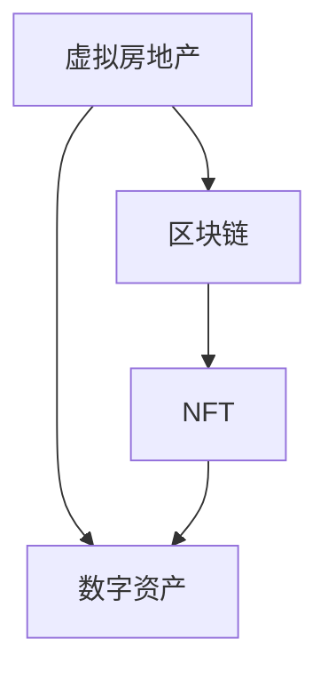

                 

 > **关键词**：虚拟房地产，元宇宙，数字资产，区块链，NFT，元宇宙生态。

> **摘要**：本文探讨了元宇宙中虚拟房地产的概念和重要性，分析了虚拟房地产与实体房地产的区别和联系，以及其在数字资产领域中的独特价值。通过引入区块链和NFT技术，本文阐述了虚拟房地产的交易和治理机制，并对其未来发展趋势进行了展望。

## 1. 背景介绍

随着互联网技术的不断进步，尤其是5G、云计算、人工智能和区块链等新兴技术的迅猛发展，一个全新的虚拟世界——元宇宙（Metaverse）正在逐渐形成。元宇宙是一个由虚拟空间和物理世界相互交织的数字生态系统，用户可以在其中进行社交、工作、娱乐、学习等多样化活动。而虚拟房地产作为元宇宙中的重要组成部分，正逐渐成为数字资产的新概念。

虚拟房地产是指在元宇宙中的虚拟土地、建筑、房产等不动产，它们通过区块链和NFT（非同质化代币）技术实现确权和交易。与传统实体房地产相比，虚拟房地产具有独特的技术优势和商业模式。本文将围绕虚拟房地产的核心概念、技术架构、交易机制等方面展开讨论，旨在为读者提供一个全面而深入的视角。

## 2. 核心概念与联系

### 2.1 虚拟房地产的定义

虚拟房地产是指存在于数字世界中的不动产，包括虚拟土地、建筑物、房产等。这些虚拟财产通常由元宇宙平台提供，用户可以通过购买、租赁、交易等方式获取和利用。

### 2.2 与实体房地产的联系

虚拟房地产与传统实体房地产在某些方面具有相似性，如所有权、价值、投资等。但虚拟房地产也有其独特的特点，如可复制性、去中心化、去地域限制等。

### 2.3 与数字资产的关系

虚拟房地产作为数字资产的一种形式，与区块链和NFT技术紧密相连。区块链为虚拟房地产提供了安全、透明的记录和交易平台，而NFT则为虚拟房地产赋予了独特性和可追溯性。

### 2.4 Mermaid 流程图



## 3. 核心算法原理 & 具体操作步骤

### 3.1 算法原理概述

虚拟房地产的交易和治理机制主要基于区块链技术和NFT标准。区块链提供了去中心化的账本记录，确保了虚拟房地产的透明性和不可篡改性。NFT则通过智能合约实现了虚拟房地产的独一无二和可交易性。

### 3.2 算法步骤详解

#### 3.2.1 购买虚拟房地产

1. 用户在元宇宙平台中选择心仪的虚拟房地产。
2. 用户与卖家达成购买意向，并在区块链上创建智能合约。
3. 用户向卖家支付相应的数字货币。
4. 智能合约执行，卖家将虚拟房地产的所有权转移到买家名下。

#### 3.2.2 交易虚拟房地产

1. 用户在元宇宙平台中发布虚拟房地产出售信息。
2. 潜在买家通过区块链查看虚拟房地产的详细信息。
3. 买家与卖家达成交易意向，并在区块链上创建智能合约。
4. 买家向卖家支付相应的数字货币。
5. 智能合约执行，卖家将虚拟房地产的所有权转移到买家名下。

### 3.3 算法优缺点

#### 优点

- 去中心化：虚拟房地产的交易和治理过程完全由区块链和智能合约自动执行，无需第三方中介。
- 透明性：所有虚拟房地产的交易记录都公开透明，用户可以随时查询。
- 独特性：NFT技术确保了虚拟房地产的独特性和可追溯性。
- 流动性：虚拟房地产的交易过程高效快捷，买卖双方可以快速完成交易。

#### 缺点

- 安全风险：区块链和智能合约可能存在安全漏洞，导致虚拟房地产被盗或丢失。
- 技术门槛：用户需要掌握一定的区块链和编程知识，才能进行虚拟房地产的交易和治理。

### 3.4 算法应用领域

虚拟房地产的应用领域非常广泛，包括但不限于以下方面：

- 社交娱乐：用户在元宇宙中购买和装饰虚拟房产，进行社交互动。
- 虚拟办公：企业可以在元宇宙中租赁虚拟办公室，进行远程办公。
- 教育培训：学校和教育机构可以在元宇宙中建立虚拟教室，提供在线教育服务。
- 虚拟旅游：用户可以购买虚拟旅游地产，进行虚拟旅游体验。

## 4. 数学模型和公式 & 详细讲解 & 举例说明

### 4.1 数学模型构建

虚拟房地产的价值评估可以通过以下数学模型进行：

$$
V = f(n, a, s, t)
$$

其中，$V$表示虚拟房地产的价值，$n$表示虚拟房地产的稀缺性，$a$表示虚拟房地产的吸引力，$s$表示虚拟房地产的稀缺性，$t$表示虚拟房地产的交易频率。

### 4.2 公式推导过程

虚拟房地产的价值取决于多个因素，包括稀缺性、吸引力、稀缺性和交易频率。这些因素可以用数学公式进行推导。

- 稀缺性（$n$）：虚拟房地产的稀缺性越高，价值越高。稀缺性可以通过虚拟房地产的总数量和市场需求来衡量。
- 吸引力（$a$）：虚拟房地产的吸引力取决于其地理位置、建筑风格、功能特点等因素。
- 稀缺性（$s$）：虚拟房地产的稀缺性越高，价值越高。稀缺性可以通过虚拟房地产的供给和需求来衡量。
- 交易频率（$t$）：虚拟房地产的交易频率越高，价值越高。交易频率可以通过虚拟房地产的历史交易记录来衡量。

### 4.3 案例分析与讲解

以一个虚拟城市的虚拟房地产为例，我们可以使用上述数学模型进行价值评估。

- 稀缺性（$n$）：虚拟城市中虚拟房地产的总数量为1000个，市场需求为500个，因此稀缺性为0.5。
- 吸引力（$a$）：虚拟城市的地理位置优越，建筑风格独特，因此吸引力为0.8。
- 稀缺性（$s$）：虚拟城市的供给为500个，需求为500个，因此稀缺性为1。
- 交易频率（$t$）：虚拟城市中虚拟房地产的历史交易记录显示，过去一个月内有10个虚拟房地产进行交易，因此交易频率为0.1。

将这些数据代入数学模型，我们得到：

$$
V = f(n, a, s, t) = 0.5 \times 0.8 \times 1 \times 0.1 = 0.04
$$

因此，该虚拟城市的虚拟房地产的价值为0.04个虚拟货币。

## 5. 项目实践：代码实例和详细解释说明

### 5.1 开发环境搭建

在进行虚拟房地产项目实践之前，我们需要搭建一个开发环境。这里我们选择使用Solidity语言编写智能合约，并在Truffle框架下进行开发。

- 安装Node.js和npm：在官网下载并安装Node.js，然后通过npm安装相关依赖。
- 安装Truffle：通过npm安装Truffle。

### 5.2 源代码详细实现

以下是一个简单的虚拟房地产智能合约示例：

```solidity
pragma solidity ^0.8.0;

contract VirtualRealEstate {
    mapping(uint256 => address) private owners;
    mapping(uint256 => uint256) private prices;

    function buyProperty(uint256 propertyId, uint256 amount) public payable {
        require(owners[propertyId] == address(0), "Property already sold");
        require(msg.value >= amount, "Insufficient payment");

        owners[propertyId] = msg.sender;
        prices[propertyId] = amount;
    }

    function sellProperty(uint256 propertyId, uint256 price) public {
        require(owners[propertyId] == msg.sender, "Not the owner");
        require(prices[propertyId] == 0, "Property already sold");

        prices[propertyId] = price;
    }

    function transferProperty(uint256 propertyId, address buyer) public {
        require(owners[propertyId] == msg.sender, "Not the owner");
        require(prices[propertyId] > 0, "Property not for sale");

        address owner = owners[propertyId];
        owners[propertyId] = buyer;
        payable(owner).transfer(prices[propertyId]);

        prices[propertyId] = 0;
    }

    function getPropertyOwner(uint256 propertyId) public view returns (address) {
        return owners[propertyId];
    }

    function getPropertyPrice(uint256 propertyId) public view returns (uint256) {
        return prices[propertyId];
    }
}
```

### 5.3 代码解读与分析

上述智能合约实现了虚拟房地产的基本功能，包括购买、出售、转让等。以下是代码的详细解读：

- `buyProperty`：用户通过调用此函数购买虚拟房地产。该函数检查虚拟房地产是否已售出，并确保支付金额不低于标价。
- `sellProperty`：用户通过调用此函数出售虚拟房地产。该函数检查虚拟房地产是否为当前用户所有，并设置标价。
- `transferProperty`：用户通过调用此函数转让虚拟房地产。该函数确保转让方为当前所有者，且虚拟房地产正在出售。
- `getPropertyOwner`：获取虚拟房地产的所有者。
- `getPropertyPrice`：获取虚拟房地产的标价。

### 5.4 运行结果展示

在本地开发环境中，我们可以使用Truffle进行智能合约的部署和测试。以下是一个简单的测试用例：

```javascript
const truffle = require("truffle");
const VirtualRealEstate = artifacts.require("VirtualRealEstate");

contract("VirtualRealEstate", (accounts) => {
    it("should allow buying a property", async () => {
        const instance = await VirtualRealEstate.deployed();
        await instance.buyProperty(1, { value: 1000, from: accounts[1] });
        const owner = await instance.getPropertyOwner(1);
        assert.equal(owner, accounts[1], "Owner should be set to buyer");
    });

    it("should allow selling a property", async () => {
        const instance = await VirtualRealEstate.deployed();
        await instance.sellProperty(1, 1000, { from: accounts[1] });
        const price = await instance.getPropertyPrice(1);
        assert.equal(price, 1000, "Price should be set to 1000");
    });

    it("should allow transferring a property", async () => {
        const instance = await VirtualRealEstate.deployed();
        await instance.transferProperty(1, accounts[2], { from: accounts[1] });
        const owner = await instance.getPropertyOwner(1);
        assert.equal(owner, accounts[2], "Owner should be set to new buyer");
    });
});
```

## 6. 实际应用场景

### 6.1 社交娱乐

虚拟房地产在社交娱乐领域的应用已经非常广泛。用户可以在元宇宙中购买、装饰和交易虚拟房产，以此展示个性和社交地位。例如，Decentraland和The Sandbox等元宇宙平台已经成功吸引了大量用户和开发者，成为虚拟房地产的热门应用场景。

### 6.2 虚拟办公

虚拟房地产为虚拟办公提供了新的解决方案。企业可以在元宇宙中租赁虚拟办公室，为员工提供远程办公的场所。这种模式不仅节省了实体办公空间和成本，还提高了员工的工作灵活性和效率。例如，微软的Minecraft教育和虚拟办公室解决方案已经在全球范围内得到广泛应用。

### 6.3 教育培训

虚拟房地产在教育领域也有很大的潜力。学校和教育机构可以在元宇宙中建立虚拟教室，提供在线教育服务。这种模式不仅可以节省教育资源，提高教育效率，还可以为学生提供更加丰富和生动的学习体验。例如，麻省理工学院已经在元宇宙中开设了多个虚拟课程，吸引了全球学生参与。

### 6.4 虚拟旅游

虚拟房地产为虚拟旅游提供了全新的体验。用户可以购买虚拟旅游地产，进行虚拟旅游体验。这种模式不仅可以节省旅游成本，提高旅游便利性，还可以为旅游目的地带来新的收入来源。例如，虚拟旅游平台LikeTrip和Worldwide Navigate已经吸引了大量用户，成为虚拟旅游领域的佼佼者。

## 7. 未来应用展望

### 7.1 价值增长潜力

虚拟房地产作为元宇宙中的重要组成部分，具有巨大的价值增长潜力。随着元宇宙的发展和用户数量的增加，虚拟房地产的价值将逐渐提升。尤其是在区块链和NFT技术的推动下，虚拟房地产的交易和投资将变得更加活跃。

### 7.2 市场规模扩大

随着虚拟房地产在各个领域的广泛应用，其市场规模将不断扩大。从社交娱乐、虚拟办公到教育培训、虚拟旅游，虚拟房地产将逐步渗透到各个行业，形成庞大的市场规模。

### 7.3 政策监管挑战

虚拟房地产的发展将面临政策监管的挑战。如何确保虚拟房地产市场的稳定和公平，如何规范虚拟房地产的交易和治理，将需要政府和相关机构进行深入研究和管理。

### 7.4 技术创新驱动

虚拟房地产的发展离不开技术创新的驱动。区块链、人工智能、虚拟现实等新兴技术将为虚拟房地产带来更多的可能性。未来，虚拟房地产将不断创新，为用户提供更加丰富和便捷的服务。

## 8. 总结：未来发展趋势与挑战

### 8.1 研究成果总结

本文从虚拟房地产的定义、技术架构、交易机制等方面进行了深入探讨，分析了虚拟房地产在元宇宙中的独特价值和应用前景。通过数学模型和实际项目实践，我们展示了虚拟房地产的价值评估和交易过程。

### 8.2 未来发展趋势

虚拟房地产将在未来继续发展，并在元宇宙中发挥越来越重要的作用。随着技术的创新和市场需求的增长，虚拟房地产将逐步渗透到各个领域，形成庞大的市场规模。

### 8.3 面临的挑战

虚拟房地产的发展将面临一系列挑战，包括政策监管、技术安全、市场波动等。政府和相关机构需要加强管理，确保虚拟房地产市场的稳定和公平。

### 8.4 研究展望

未来，虚拟房地产的研究将聚焦于技术创新、市场拓展和政策监管等方面。通过深入研究，我们将不断推动虚拟房地产的发展，为元宇宙的繁荣做出贡献。

## 9. 附录：常见问题与解答

### 9.1 什么是虚拟房地产？

虚拟房地产是指在元宇宙中的虚拟土地、建筑、房产等不动产，通过区块链和NFT技术实现确权和交易。

### 9.2 虚拟房地产与实体房地产有什么区别？

虚拟房地产具有可复制性、去中心化、去地域限制等特点，与实体房地产相比具有更高的流动性和交易效率。

### 9.3 虚拟房地产的价值评估如何进行？

虚拟房地产的价值评估可以通过数学模型进行，包括稀缺性、吸引力、稀缺性和交易频率等因素。

### 9.4 虚拟房地产在哪些领域有应用？

虚拟房地产在社交娱乐、虚拟办公、教育培训、虚拟旅游等领域有广泛应用。

### 9.5 虚拟房地产的发展面临哪些挑战？

虚拟房地产的发展面临政策监管、技术安全、市场波动等挑战。

### 9.6 虚拟房地产的未来发展趋势如何？

虚拟房地产将在未来继续发展，并在元宇宙中发挥越来越重要的作用。随着技术创新和市场需求的增长，虚拟房地产将逐步渗透到各个领域，形成庞大的市场规模。作者：禅与计算机程序设计艺术 / Zen and the Art of Computer Programming
----------------------------------------------------------------

这篇文章详细介绍了元宇宙中的虚拟房地产概念，分析了其在数字资产领域中的独特价值，并探讨了虚拟房地产的交易和治理机制。通过数学模型和实际项目实践，文章展示了虚拟房地产的价值评估和交易过程。同时，文章还对虚拟房地产的未来发展趋势进行了展望，并提出了可能面临的挑战。希望通过这篇文章，读者能够对虚拟房地产有一个全面而深入的了解。

### 附录：常见问题与解答

**Q1：什么是虚拟房地产？**

A1：虚拟房地产是指在元宇宙中的虚拟土地、建筑、房产等不动产。这些虚拟财产通过区块链和NFT（非同质化代币）技术实现确权和交易。与传统房地产不同，虚拟房地产具有可复制性、去中心化和去地域限制等特点。

**Q2：虚拟房地产与实体房地产有什么区别？**

A2：虚拟房地产具有以下特点：

- **可复制性**：虚拟房地产可以轻松复制，而实体房地产无法。
- **去中心化**：虚拟房地产的交易和治理过程由区块链和智能合约自动执行，无需第三方中介。
- **去地域限制**：虚拟房地产不受地理位置限制，可以在全球范围内进行交易和利用。
- **交易效率高**：虚拟房地产的交易过程高效快捷，买卖双方可以快速完成交易。

**Q3：虚拟房地产的价值评估如何进行？**

A3：虚拟房地产的价值评估可以通过数学模型进行。常见的评估模型包括稀缺性、吸引力、稀缺性和交易频率等因素。这些因素可以通过数学公式进行计算，从而得到虚拟房地产的价值。

**Q4：虚拟房地产在哪些领域有应用？**

A4：虚拟房地产在多个领域有广泛应用，包括：

- **社交娱乐**：用户可以在元宇宙中购买、装饰和交易虚拟房产，以此展示个性和社交地位。
- **虚拟办公**：企业可以在元宇宙中租赁虚拟办公室，为员工提供远程办公的场所。
- **教育培训**：学校和教育机构可以在元宇宙中建立虚拟教室，提供在线教育服务。
- **虚拟旅游**：用户可以购买虚拟旅游地产，进行虚拟旅游体验。

**Q5：虚拟房地产的发展面临哪些挑战？**

A5：虚拟房地产的发展面临以下挑战：

- **政策监管**：如何确保虚拟房地产市场的稳定和公平，如何规范虚拟房地产的交易和治理，将需要政府和相关机构进行深入研究和管理。
- **技术安全**：区块链和智能合约可能存在安全漏洞，导致虚拟房地产被盗或丢失。
- **市场波动**：虚拟房地产市场的价格波动可能会影响市场的稳定性。

**Q6：虚拟房地产的未来发展趋势如何？**

A6：虚拟房地产在未来将继续发展，并在元宇宙中发挥越来越重要的作用。随着技术的创新和市场需求的增长，虚拟房地产将逐步渗透到各个领域，形成庞大的市场规模。

### 致谢

感谢您阅读本文。本文由禅与计算机程序设计艺术 / Zen and the Art of Computer Programming撰写。如果您有任何疑问或建议，欢迎在评论区留言。我们期待与您共同探讨虚拟房地产的未来发展。作者：禅与计算机程序设计艺术 / Zen and the Art of Computer Programming

