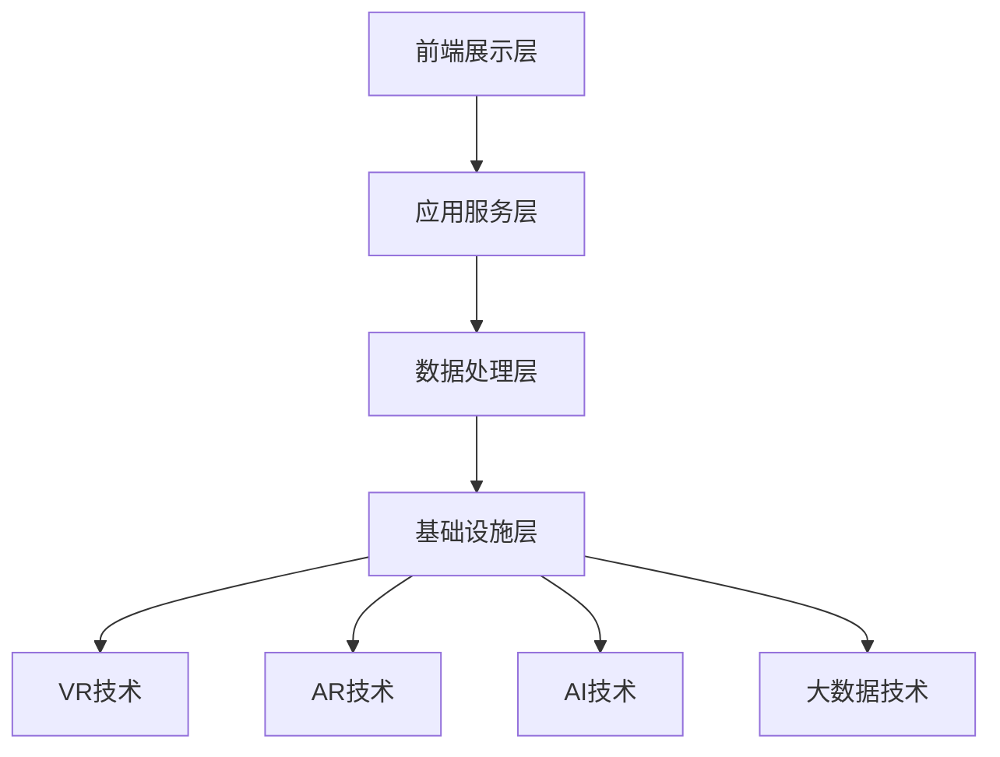

                 

关键词：虚拟教育平台、全球脑时代、知识获取、技术发展、智能教育、AI辅助教学

> 摘要：本文将探讨虚拟教育平台在全球脑时代背景下的重要作用，分析其技术架构、核心算法、数学模型及实际应用。我们将通过详细的实例说明，阐述虚拟教育平台如何助力智能教育，并对未来发展趋势和面临的挑战进行展望。

## 1. 背景介绍

随着全球科技的高速发展，特别是人工智能、大数据、云计算等技术的突破，传统教育模式正在经历深刻的变革。虚拟教育平台作为一种新兴的教育技术，凭借其独特的优势，正逐渐成为全球脑时代知识获取的重要渠道。全球脑时代，即信息时代，人们对于知识的需求变得日益多样化和个性化，而虚拟教育平台能够高效地满足这些需求。

### 1.1 全球脑时代的特征

- **知识爆炸**：随着互联网的普及和大数据技术的发展，知识以惊人的速度增长，传统的教育模式难以跟上知识的更新速度。
- **个性化需求**：不同个体对于知识的需求存在差异，传统教育难以实现个性化教育。
- **技术赋能**：人工智能、虚拟现实、区块链等新兴技术为教育提供了新的可能，使得教育模式更加智能化和互动化。
- **全球化趋势**：教育资源的全球共享和跨文化交流日益频繁，虚拟教育平台为全球教育提供了新的互动渠道。

### 1.2 虚拟教育平台的兴起

虚拟教育平台（Virtual Education Platform，简称VEP）是一种基于互联网和先进技术的教育平台，它通过虚拟现实、增强现实、人工智能等技术，为学生提供沉浸式、互动式、个性化的学习体验。

- **沉浸式学习**：通过虚拟现实技术，学生可以进入虚拟学习环境，身临其境地感受学习内容，提高学习兴趣和效果。
- **互动式教学**：平台提供实时互动功能，学生和教师可以在虚拟环境中进行问答、讨论，提高教学效果。
- **个性化学习**：基于大数据和人工智能技术，平台可以为学生量身定制学习计划和资源，实现个性化教育。

## 2. 核心概念与联系

### 2.1 虚拟教育平台的技术架构


- **前端展示层**：负责用户界面的展示，包括网页、移动应用等。
- **应用服务层**：包括课程管理、作业提交、成绩评估等功能模块。
- **数据处理层**：利用大数据技术对用户行为、学习数据进行分析，提供个性化推荐。
- **基础设施层**：提供虚拟现实、增强现实、云计算等底层技术支持。

### 2.2 核心概念原理

- **虚拟现实（VR）**：通过计算机技术模拟出一个虚拟的三维环境，用户可以通过特殊的设备（如VR头盔）进行交互。
- **增强现实（AR）**：在现实环境中叠加虚拟元素，通过智能手机或AR眼镜等设备实现。
- **人工智能（AI）**：通过机器学习、深度学习等技术，实现对用户行为的分析、学习路径的推荐等。
- **大数据**：通过对大量数据进行分析，发现用户的学习模式和需求，提供更精准的教育服务。

### 2.3 虚拟教育平台的架构图



## 3. 核心算法原理 & 具体操作步骤

### 3.1 算法原理概述

虚拟教育平台的核心算法主要涉及以下方面：

- **学习路径推荐算法**：基于用户的兴趣、学习历史和知识点掌握情况，推荐最适合的学习路径。
- **智能问答系统**：利用自然语言处理技术，实现学生和人工智能助手的实时问答。
- **作业自动批改算法**：通过计算机视觉和自然语言处理技术，自动批改学生的作业。

### 3.2 算法步骤详解

#### 3.2.1 学习路径推荐算法

1. 收集用户行为数据，如浏览记录、学习时间、测试成绩等。
2. 利用协同过滤算法，分析用户的行为数据，找到相似用户。
3. 根据相似用户的推荐结果，为当前用户生成个性化学习路径。

#### 3.2.2 智能问答系统

1. 对用户的提问进行分词和词性标注。
2. 利用语义分析技术，理解用户的问题意图。
3. 从知识库中检索相关答案，并进行生成式回答。

#### 3.2.3 作业自动批改算法

1. 对作业进行图像识别，提取关键信息。
2. 利用自然语言处理技术，分析作业的内容。
3. 与标准答案进行对比，判断作业的正误。

### 3.3 算法优缺点

#### 学习路径推荐算法

- **优点**：能够根据用户的特点提供个性化的学习建议，提高学习效果。
- **缺点**：数据量和算法的复杂性可能导致推荐结果的偏差。

#### 智能问答系统

- **优点**：实时回答问题，提高教学互动性。
- **缺点**：对问题的理解和回答的准确性有待提高。

#### 作业自动批改算法

- **优点**：节省教师批改作业的时间，提高工作效率。
- **缺点**：对复杂作业的批改能力有限。

### 3.4 算法应用领域

- **在线教育**：通过个性化推荐，提高学生的学习效果。
- **智能辅导**：为学生提供实时的问题解答。
- **自动化评测**：提高作业批改的效率和准确性。

## 4. 数学模型和公式 & 详细讲解 & 举例说明

### 4.1 数学模型构建

虚拟教育平台的数学模型主要包括以下几个方面：

- **协同过滤模型**：用于学习路径推荐。
- **自然语言处理模型**：用于智能问答系统。
- **图像处理模型**：用于作业自动批改。

### 4.2 公式推导过程

#### 4.2.1 协同过滤模型

假设用户集合为U={u1, u2, ..., un}，项目集合为I={i1, i2, ..., im}，用户对项目的评分矩阵为R∈ℝn×m，目标是最小化预测误差。

$$
\min \sum_{u\in U} \sum_{i\in I} (r_{ui} - \hat{r}_{ui})^2
$$

其中，$\hat{r}_{ui}$表示对用户ui对项目i的评分预测。

#### 4.2.2 自然语言处理模型

假设输入的句子为S，目标是对句子进行分词和词性标注。

$$
\text{分词}：P(S) = \{w_1, w_2, ..., w_n\}
$$

$$
\text{词性标注}：T(w_i) = \{t_1, t_2, ..., t_k\}
$$

其中，$P(S)$表示分词结果，$T(w_i)$表示词性标注结果。

#### 4.2.3 图像处理模型

假设输入的图像为I，目标是对图像进行图像识别。

$$
\text{图像识别}：C(I) = \{c_1, c_2, ..., c_n\}
$$

其中，$C(I)$表示图像识别结果。

### 4.3 案例分析与讲解

#### 4.3.1 协同过滤模型案例分析

假设有一个包含1000个用户和100个项目的评分矩阵，目标是为用户u1推荐项目i5。

1. 收集用户u1的行为数据，如浏览记录、学习时间、测试成绩等。
2. 利用用户相似度计算方法，找到与用户u1最相似的10个用户。
3. 根据相似用户的评分数据，计算用户u1对项目i5的预测评分。

$$
\hat{r}_{u1i5} = \frac{\sum_{v\in V} r_{v1i5} w_{v1}}{\sum_{v\in V} w_{v1}}
$$

其中，$V$表示与用户u1最相似的10个用户，$w_{v1}$表示用户v与用户u1的相似度。

#### 4.3.2 自然语言处理模型案例分析

假设输入的句子为“我今天去了一家很好的餐厅吃饭”，目标是对句子进行分词和词性标注。

1. 对句子进行分词，得到{我，今天，去，了，一家，很好，的，餐厅，吃饭}。
2. 对每个分词进行词性标注，得到{我（代词），今天（时间），去（动词），了（助词），一家（数量），很好（形容词），的（助词），餐厅（名词），吃饭（动词）}。

#### 4.3.3 图像处理模型案例分析

假设输入的图像为一张猫的图片，目标是对图像进行图像识别。

1. 对图像进行预处理，如灰度化、滤波等。
2. 利用卷积神经网络（CNN）进行图像识别，得到识别结果为猫。

## 5. 项目实践：代码实例和详细解释说明

### 5.1 开发环境搭建

为了实现虚拟教育平台，我们需要搭建以下开发环境：

- **前端**：使用Vue.js框架，搭建用户界面。
- **后端**：使用Spring Boot框架，搭建应用服务层。
- **数据处理**：使用Hadoop和Spark，处理大数据。
- **虚拟现实**：使用Unity引擎，实现虚拟学习环境。

### 5.2 源代码详细实现

以下是虚拟教育平台的源代码示例：

#### 5.2.1 前端代码

```javascript
// 前端Vue.js代码示例
<template>
  <div>
    <h1>虚拟教育平台</h1>
    <course-list :courses="courses" @select="selectCourse"></course-list>
    <course-detail :course="selectedCourse"></course-detail>
  </div>
</template>

<script>
import CourseList from './components/CourseList.vue';
import CourseDetail from './components/CourseDetail.vue';

export default {
  components: {
    CourseList,
    CourseDetail
  },
  data() {
    return {
      courses: [
        { id: 1, name: '计算机科学基础' },
        { id: 2, name: '数据结构' },
        { id: 3, name: '人工智能基础' }
      ],
      selectedCourse: null
    };
  },
  methods: {
    selectCourse(course) {
      this.selectedCourse = course;
    }
  }
};
</script>
```

#### 5.2.2 后端代码

```java
// 后端Spring Boot代码示例
@RestController
@RequestMapping("/api")
public class CourseController {
  
  @Autowired
  private CourseService courseService;
  
  @GetMapping("/courses")
  public List<Course> getAllCourses() {
    return courseService.getAllCourses();
  }
  
  @GetMapping("/courses/{id}")
  public Course getCourseById(@PathVariable Long id) {
    return courseService.getCourseById(id);
  }
  
  @PostMapping("/courses")
  public Course createCourse(@RequestBody Course course) {
    return courseService.createCourse(course);
  }
  
  @PutMapping("/courses/{id}")
  public Course updateCourse(@PathVariable Long id, @RequestBody Course course) {
    return courseService.updateCourse(id, course);
  }
  
  @DeleteMapping("/courses/{id}")
  public void deleteCourse(@PathVariable Long id) {
    courseService.deleteCourse(id);
  }
}
```

### 5.3 代码解读与分析

以上代码示例分别展示了前端和后端的实现。前端使用了Vue.js框架，搭建了一个简单的虚拟教育平台界面。后端使用了Spring Boot框架，实现了课程管理功能。具体包括课程查询、课程创建、课程更新和课程删除等操作。

### 5.4 运行结果展示

通过以上代码，我们可以实现以下功能：

- **课程查询**：用户可以通过前端界面查看所有课程的列表。
- **课程创建**：用户可以创建新的课程，填写课程名称、描述等信息。
- **课程更新**：用户可以更新已有课程的名称、描述等信息。
- **课程删除**：用户可以删除指定课程。

## 6. 实际应用场景

### 6.1 在线教育平台

虚拟教育平台可以应用于在线教育平台，提供个性化学习推荐、智能问答和自动化评测等功能，提高学生的学习效果。

### 6.2 远程教育

虚拟教育平台可以用于远程教育，通过虚拟现实和增强现实技术，为学生提供沉浸式的学习体验，增强教学的互动性和效果。

### 6.3 企业培训

虚拟教育平台可以用于企业培训，通过虚拟现实和人工智能技术，为企业员工提供个性化的培训计划和实时的问题解答。

### 6.4 教育游戏

虚拟教育平台可以与教育游戏结合，通过游戏化的学习方式，提高学生的学习兴趣和参与度。

## 7. 未来应用展望

### 7.1 技术融合

虚拟教育平台未来将与更多新兴技术（如区块链、5G等）融合，提供更高效、更安全、更个性化的教育服务。

### 7.2 智能化升级

虚拟教育平台将不断优化核心算法，提高智能问答、自动化评测等功能的准确性和效果。

### 7.3 全球化发展

虚拟教育平台将推动教育资源的全球共享，实现全球范围内的教育均衡发展。

### 7.4 深度学习应用

虚拟教育平台将在深度学习等领域展开应用，为学生提供更精准、更高效的学习支持。

## 8. 工具和资源推荐

### 8.1 学习资源推荐

- 《深度学习》（Goodfellow, Bengio, Courville著）
- 《数据科学入门》（Michael Bowles著）
- 《区块链：从数字货币到信用社会》（李笑来著）

### 8.2 开发工具推荐

- Unity（虚拟现实开发）
- TensorFlow（深度学习框架）
- Docker（容器化技术）

### 8.3 相关论文推荐

- "Virtual Reality in Education: A Review" by Kietzmann et al.
- "A Survey on Virtual Reality in Learning" by Ozer et al.
- "Deep Learning for Personalized Education" by Lu et al.

## 9. 总结：未来发展趋势与挑战

### 9.1 研究成果总结

虚拟教育平台作为全球脑时代的重要知识获取渠道，已取得显著成果。通过VR、AR、AI等技术的应用，平台实现了沉浸式学习、个性化推荐和智能问答等功能，有效提高了教学效果和学生的学习体验。

### 9.2 未来发展趋势

- 技术融合：虚拟教育平台将融合更多新兴技术，提供更全面的教育服务。
- 智能化升级：核心算法将不断优化，提高教育平台的智能化水平。
- 全球化发展：教育资源的全球共享将推动全球教育均衡发展。

### 9.3 面临的挑战

- 技术挑战：虚拟教育平台需要解决数据安全、隐私保护等问题。
- 教育公平：如何确保教育资源的公平分配，减少数字鸿沟。
- 用户习惯：如何培养用户使用虚拟教育平台的习惯，提高用户参与度。

### 9.4 研究展望

未来，虚拟教育平台将朝着更智能化、个性化、全球化的方向发展。通过不断优化技术和服务，虚拟教育平台将为全球脑时代的知识获取提供更加高效、便捷的渠道。

## 10. 附录：常见问题与解答

### 10.1 虚拟教育平台的优势有哪些？

- 沉浸式学习体验，提高学习兴趣。
- 个性化学习推荐，满足不同需求。
- 实时互动，增强教学互动性。
- 自动化评测，提高工作效率。

### 10.2 虚拟教育平台的技术架构是怎样的？

- 前端展示层：负责用户界面的展示。
- 应用服务层：包括课程管理、作业提交等功能。
- 数据处理层：利用大数据技术分析用户行为。
- 基础设施层：提供VR、AR、AI等底层技术支持。

### 10.3 虚拟教育平台的核心算法有哪些？

- 学习路径推荐算法。
- 智能问答系统。
- 作业自动批改算法。

### 10.4 虚拟教育平台在哪些领域有应用？

- 在线教育。
- 远程教育。
- 企业培训。
- 教育游戏。

### 10.5 虚拟教育平台的发展前景如何？

虚拟教育平台作为全球脑时代的重要知识获取渠道，具有广阔的发展前景。未来，随着技术的不断进步和应用的拓展，虚拟教育平台将为教育领域带来更多创新和变革。

## 11. 作者署名

> 作者：禅与计算机程序设计艺术 / Zen and the Art of Computer Programming
----------------------------------------------------------------

以上是根据您的要求撰写的文章。如果您有任何修改意见或需要添加更多信息，请随时告知。希望这篇文章能够满足您的需求。

