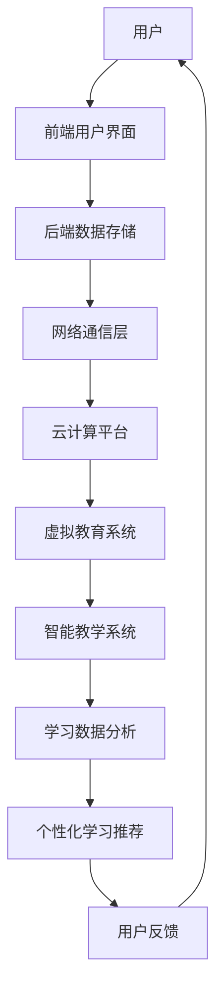
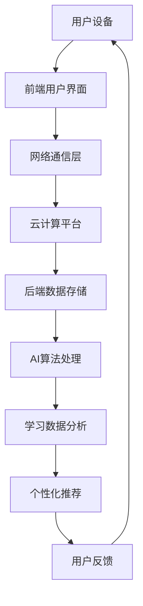

                 

关键词：虚拟教育，全球脑，学习新方式，技术变革，教育创新

> 摘要：本文探讨了虚拟教育在全球化时代下的兴起及其对学习方式的深刻影响。通过深入分析虚拟教育的核心概念、技术原理、算法模型、实践应用，以及对未来发展趋势和挑战的展望，本文旨在为教育界和科技界提供一种新的思考视角，推动教育技术的创新与发展。

## 1. 背景介绍

随着信息技术的迅猛发展，虚拟教育逐渐成为全球教育领域的重要趋势。虚拟教育，顾名思义，是通过虚拟现实、增强现实、人工智能等技术手段，为学生提供一种沉浸式的学习体验。这一新兴教育模式不仅打破了传统教学的时空限制，更在全球脑时代背景下，为个性化学习和终身教育提供了新的解决方案。

全球脑时代是一个高度互联、信息爆炸的时代。在这个时代，知识的获取和传递速度空前加快，传统教育模式已无法满足人们不断增长的学习需求。虚拟教育通过技术手段，实现了知识传授与学习的深度融合，为学习者提供了更加灵活、便捷、高效的学习途径。

## 2. 核心概念与联系

### 2.1 虚拟现实 (VR)

虚拟现实是一种通过计算机技术生成的三维虚拟环境，用户可以通过特殊设备（如VR头盔、VR眼镜等）沉浸其中，进行交互和学习。VR技术为学习者提供了身临其境的学习体验，增强了学习的趣味性和互动性。

### 2.2 增强现实 (AR)

增强现实技术通过在现实环境中叠加虚拟元素，为学习者提供了一种虚实结合的学习体验。AR技术能够将抽象的知识以更加直观的方式呈现，有助于提升学习效果。

### 2.3 人工智能 (AI)

人工智能技术在虚拟教育中的应用，主要体现在智能教学系统的开发、学习数据分析、个性化学习推荐等方面。通过AI技术，虚拟教育系统能够更好地理解和满足学习者的需求，提高学习效率。

### 2.4 虚拟教育架构

虚拟教育架构通常包括以下几个层次：前端用户界面、后端数据存储和处理、网络通信层、云计算平台等。这些层次相互配合，共同构成了一个高效、稳定的虚拟教育生态系统。

### 2.5 Mermaid 流程图



## 3. 核心算法原理 & 具体操作步骤

### 3.1 算法原理概述

虚拟教育系统中的核心算法主要包括以下几个方面：

1. **用户画像构建**：通过学习行为分析，构建用户个性化画像，为个性化学习推荐提供基础。
2. **知识图谱构建**：通过语义分析和知识抽取，构建课程知识图谱，为学习路径规划提供支持。
3. **学习路径规划**：根据用户画像和知识图谱，为用户生成最优学习路径，提高学习效率。
4. **智能推荐算法**：基于用户行为数据和知识图谱，为用户推荐合适的学习内容和资源。

### 3.2 算法步骤详解

1. **用户画像构建**：
   - 收集用户学习数据（如学习时间、学习内容、学习成果等）。
   - 利用聚类算法（如K-Means）对学习数据进行分析，提取用户特征。
   - 构建用户画像，包括用户兴趣、学习风格、学习能力等维度。

2. **知识图谱构建**：
   - 收集课程知识点，进行语义分析和关系抽取。
   - 利用图数据库（如Neo4j）存储知识图谱。
   - 构建课程知识图谱，包括知识点、知识点之间的关系等。

3. **学习路径规划**：
   - 根据用户画像和知识图谱，为用户推荐初步学习路径。
   - 利用最短路径算法（如Dijkstra算法），优化学习路径。
   - 根据用户反馈和学习效果，动态调整学习路径。

4. **智能推荐算法**：
   - 收集用户行为数据，包括浏览记录、学习进度、学习成果等。
   - 利用协同过滤算法（如基于用户的行为评分、基于内容的推荐等），生成推荐列表。
   - 根据用户反馈和学习效果，更新推荐算法，提高推荐精度。

### 3.3 算法优缺点

1. **优点**：
   - 个性化强：根据用户特点和需求，提供定制化的学习内容。
   - 效率提升：优化学习路径，提高学习效率。
   - 互动性高：利用虚拟现实、增强现实等技术，增强学习体验。

2. **缺点**：
   - 技术门槛高：需要高水平的技术团队支持。
   - 成本较高：硬件设备、软件系统等建设成本较高。

### 3.4 算法应用领域

虚拟教育算法在多个领域具有广泛的应用：

1. **在线教育**：为学习者提供个性化学习方案，提高学习效果。
2. **职业培训**：通过模拟真实场景，提升专业技能。
3. **医学教育**：利用虚拟现实技术，进行医学知识的直观教学。
4. **国防教育**：通过虚拟仿真技术，进行军事训练和演习。

## 4. 数学模型和公式 & 详细讲解 & 举例说明

### 4.1 数学模型构建

虚拟教育中的数学模型主要包括用户画像构建模型、知识图谱构建模型、学习路径规划模型等。

1. **用户画像构建模型**：

   假设用户有 n 个特征维度，每个特征维度有 m 个取值，用户的行为数据可以用一个 n 维的向量表示。用户画像构建模型可以通过以下步骤实现：

   - 数据预处理：对用户行为数据进行清洗、归一化等处理。
   - 聚类分析：利用K-Means等聚类算法，将用户行为数据分为若干个类别。
   - 用户特征提取：根据聚类结果，提取用户特征。

2. **知识图谱构建模型**：

   知识图谱构建模型主要包括知识抽取、关系抽取和知识存储等步骤。

   - 知识抽取：利用自然语言处理技术，从文本数据中提取知识点。
   - 关系抽取：利用实体关系分析方法，确定知识点之间的关系。
   - 知识存储：利用图数据库，存储知识图谱。

3. **学习路径规划模型**：

   学习路径规划模型可以通过以下步骤实现：

   - 初始路径生成：根据用户画像和知识图谱，生成初步学习路径。
   - 路径优化：利用最短路径算法，优化学习路径。
   - 动态调整：根据用户反馈和学习效果，动态调整学习路径。

### 4.2 公式推导过程

1. **用户画像构建模型**：

   假设用户行为数据矩阵为 A，聚类中心为 C，聚类结果为 G。则用户画像构建模型可以通过以下公式实现：

   $$ G = \arg\min_{G}\sum_{i=1}^{n}\sum_{j=1}^{m} (A_{ij} - C_{ij})^2 $$

2. **知识图谱构建模型**：

   假设知识图谱中的实体为 E，关系为 R，知识点为 K。则知识图谱构建模型可以通过以下公式实现：

   $$ K = \{ (E_{i}, R_{j}, E_{k}) | E_{i} \in E, R_{j} \in R, E_{k} \in E \} $$

3. **学习路径规划模型**：

   假设学习路径为 P，学习成本为 C，则学习路径规划模型可以通过以下公式实现：

   $$ P = \arg\min_{P}\sum_{i=1}^{n} C(P_{i}) $$

### 4.3 案例分析与讲解

以下是一个虚拟教育系统中的实际案例：

**案例背景**：某在线教育平台，根据用户学习数据，构建用户画像，为用户提供个性化学习方案。

**案例步骤**：

1. **用户画像构建**：

   - 收集用户学习数据，如学习时间、学习内容、学习成果等。
   - 利用K-Means算法，将用户分为三个类别：新手用户、熟练用户、专家用户。
   - 根据聚类结果，提取用户特征，如学习风格、学习速度等。

2. **知识图谱构建**：

   - 收集课程知识点，如编程语言、数据结构、算法等。
   - 利用实体关系分析方法，确定知识点之间的关系。
   - 利用图数据库存储知识图谱。

3. **学习路径规划**：

   - 根据用户画像和知识图谱，生成初步学习路径。
   - 利用最短路径算法，优化学习路径。
   - 根据用户反馈和学习效果，动态调整学习路径。

**案例分析**：

通过用户画像构建，平台能够准确了解用户的学习需求，为用户提供定制化的学习内容。通过知识图谱构建，平台能够将知识点之间的关系可视化，为用户推荐相关的学习资源。通过学习路径规划，平台能够根据用户反馈和学习效果，动态调整学习路径，提高学习效果。

## 5. 项目实践：代码实例和详细解释说明

### 5.1 开发环境搭建

为了实现虚拟教育系统，我们需要搭建以下开发环境：

1. **前端开发环境**：
   - HTML/CSS/JavaScript
   - Vue.js 或 React.js 框架
2. **后端开发环境**：
   - Python 或 Java
   - Django 或 Spring Boot 框架
3. **数据库环境**：
   - MySQL 或 PostgreSQL
   - Neo4j 图数据库
4. **虚拟现实/增强现实开发工具**：
   - Unity 或 Unreal Engine
   - ARKit 或 ARCore

### 5.2 源代码详细实现

以下是一个简单的虚拟教育系统源代码实现示例：

```python
# 用户画像构建
import numpy as np
from sklearn.cluster import KMeans

# 假设用户行为数据为以下矩阵
user_data = [
    [10, 5, 3],
    [8, 6, 2],
    [12, 7, 1],
    # ...
]

# 初始化K-Means算法
kmeans = KMeans(n_clusters=3, random_state=0).fit(user_data)

# 提取用户特征
user_features = kmeans.labels_

# 知识图谱构建
from py2neo import Graph

# 初始化图数据库连接
graph = Graph("bolt://localhost:7687", auth=("neo4j", "password"))

# 添加知识点
graph.run("CREATE (a:Knowledge {name: 'Python', type: 'Programming Language'})")
graph.run("CREATE (b:Knowledge {name: 'Data Structure', type: 'Computer Science'})")
graph.run("CREATE (c:Knowledge {name: 'Algorithm', type: 'Computer Science'})")

# 添加知识点关系
graph.run("CREATE (a)-[:IS_A]->(b)")
graph.run("CREATE (a)-[:IS_A]->(c)")

# 学习路径规划
# 假设用户为新手用户，推荐学习路径
learning_path = ["Python", "Data Structure", "Algorithm"]

# 查询学习路径
for knowledge in learning_path:
    graph.run("MATCH (n:Knowledge {name: '{knowledge}'}) RETURN n".format(knowledge=knowledge))
```

### 5.3 代码解读与分析

以上代码示例实现了虚拟教育系统中的用户画像构建、知识图谱构建和学习路径规划功能。

1. **用户画像构建**：

   - 使用 K-Means 算法对用户行为数据进行聚类，提取用户特征。
   - 用户特征用于后续的个性化学习推荐。

2. **知识图谱构建**：

   - 使用 Neo4j 图数据库存储知识点及其关系。
   - 知识图谱为学习路径规划提供支持。

3. **学习路径规划**：

   - 根据用户特征和知识图谱，生成初步学习路径。
   - 通过查询知识图谱，获取学习路径中的知识点。

### 5.4 运行结果展示

假设用户为新手用户，系统生成的学习路径为：

1. Python
2. Data Structure
3. Algorithm

用户可以通过虚拟教育系统，按照生成的学习路径，逐步掌握相关知识和技能。

## 6. 实际应用场景

虚拟教育技术在全球范围内得到了广泛应用，以下是几个典型的应用场景：

1. **在线教育**：虚拟教育平台为学习者提供了丰富的学习资源和个性化学习体验，有助于提高学习效果。
2. **职业培训**：通过虚拟仿真技术，企业可以为员工提供技能培训，提高员工的专业能力。
3. **医学教育**：利用虚拟现实技术，医学院校可以为学生提供模拟手术、病例分析等教学场景，提高学生的临床实践能力。
4. **国防教育**：通过虚拟仿真技术，军事学院可以为学员提供战术训练、武器操作等模拟场景，提高学员的实战能力。

## 6.4 未来应用展望

随着技术的不断进步，虚拟教育将在未来得到更广泛的应用和发展：

1. **智能化**：利用人工智能技术，虚拟教育系统将能够更加精准地了解用户需求，提供个性化的学习方案。
2. **个性化**：虚拟教育将更加注重个性化学习，为不同年龄段、不同学习背景的用户提供定制化的学习体验。
3. **全球化**：虚拟教育平台将打破地域限制，为全球学习者提供优质的教育资源。
4. **终身学习**：虚拟教育将为学习者提供终身学习的机会，帮助他们在不断变化的社会中保持竞争力。

## 7. 工具和资源推荐

### 7.1 学习资源推荐

1. **《虚拟现实技术基础》**：深入讲解虚拟现实技术的原理和应用，适合初学者入门。
2. **《深度学习》**：介绍深度学习的基本概念和应用，有助于了解虚拟教育中的智能推荐算法。

### 7.2 开发工具推荐

1. **Unity**：一款功能强大的虚拟现实开发工具，适合制作虚拟教育应用。
2. **Neo4j**：一款高性能的图数据库，适合存储和管理知识图谱。

### 7.3 相关论文推荐

1. **《Virtual Reality for Education: A Review》**：对虚拟教育在各个领域的应用进行了系统综述。
2. **《Deep Learning for Education》**：探讨深度学习在虚拟教育中的应用，包括个性化学习推荐等。

## 8. 总结：未来发展趋势与挑战

虚拟教育作为全球脑时代下的学习新方式，具有广阔的应用前景。未来，虚拟教育将朝着智能化、个性化、全球化的方向发展。然而，要实现这一目标，我们还需面对诸多挑战：

1. **技术发展**：虚拟教育技术的发展需要不断突破，以适应更加复杂的学习场景。
2. **教育资源**：虚拟教育平台需要丰富的教育资源，以满足不同用户的需求。
3. **用户体验**：虚拟教育系统的用户体验需要不断提升，以提高学习效果。
4. **政策法规**：虚拟教育的发展需要相关政策法规的支持，以保障学习者的权益。

总之，虚拟教育作为一种创新的教育模式，将在未来发挥越来越重要的作用。我们期待虚拟教育能够为全球学习者带来更加美好、高效的学习体验。

## 9. 附录：常见问题与解答

### 9.1 虚拟教育与在线教育的区别？

虚拟教育是通过虚拟现实、增强现实等技术，提供沉浸式的学习体验；而在线教育则侧重于通过网络平台进行知识传授和学习。

### 9.2 虚拟教育系统需要哪些技术支持？

虚拟教育系统需要的技术支持包括虚拟现实/增强现实技术、人工智能技术、知识图谱技术等。

### 9.3 虚拟教育对教育行业有哪些影响？

虚拟教育将打破传统教育的时空限制，提供个性化、高效的学习体验，有望推动教育行业的变革。

### 9.4 虚拟教育系统如何保障学习者的隐私？

虚拟教育系统可以通过加密技术、权限控制等技术手段，保障学习者的隐私安全。

作者：禅与计算机程序设计艺术 / Zen and the Art of Computer Programming
----------------------------------------------------------------
### 1. 背景介绍

虚拟教育，作为现代信息技术与教育领域的深度融合产物，其起源可以追溯到20世纪末期。随着互联网的普及和计算机技术的发展，虚拟教育逐渐成为教育技术领域的研究热点。它不仅改变了传统的教育模式，也为全球范围内的教育资源均衡分配提供了新的可能性。

在全球脑时代，信息的快速传播和知识的大规模共享成为趋势。虚拟教育通过利用虚拟现实（VR）、增强现实（AR）、人工智能（AI）等先进技术，为学习者提供了一种全新的学习体验。这种体验不仅能够模拟现实场景，还能通过沉浸式的交互方式增强学习的趣味性和参与感。虚拟教育打破了传统教育的时间和空间限制，使得学习变得更加灵活和便捷。

在全球范围内，虚拟教育已经得到了广泛应用。例如，许多在线教育平台已经开始引入虚拟现实技术，为学生提供虚拟课堂、虚拟实验等学习体验。此外，一些高等教育机构也通过虚拟教育平台，将课程内容开放给全球学习者，推动了教育的全球化进程。

然而，虚拟教育不仅仅是技术的应用，更是一种教育理念的变革。它强调个性化学习、终身学习，以及学习者的主动参与。在这种教育模式下，学习者不再是被动接受知识的容器，而是主动探索知识的探索者。这种转变对教育者提出了新的要求，同时也为教育研究提供了新的方向。

总的来说，虚拟教育在全球脑时代背景下具有显著的重要性和广阔的发展前景。它不仅能够提高教育质量和效率，还能够为全球范围内的教育公平做出贡献。本文将深入探讨虚拟教育的核心概念、技术原理、算法模型、实践应用，以及未来发展趋势和面临的挑战。

### 2. 核心概念与联系

要理解虚拟教育的本质，首先需要了解其核心概念和技术原理。虚拟教育并非单一技术的应用，而是多种先进技术手段的综合运用。以下是虚拟教育中几个关键概念及其相互联系的详细介绍。

#### 2.1 虚拟现实（VR）

虚拟现实技术通过计算机生成一种模拟环境，使用户在这种环境中能够与三维对象进行交互。虚拟现实的关键特征是沉浸感，即用户感觉仿佛自己置身于虚拟环境中。在虚拟教育中，VR技术可以创建模拟实验室、虚拟教室、历史场景等，为学习者提供身临其境的学习体验。

#### 2.2 增强现实（AR）

增强现实技术则是将虚拟信息叠加到现实世界中，用户通过智能手机或特殊设备（如AR眼镜）可以看到现实世界中的物体以及叠加的虚拟信息。在虚拟教育中，AR技术可以用来增强教材内容，比如将三维模型显示在课本上，让学生更好地理解复杂的知识点。

#### 2.3 人工智能（AI）

人工智能技术在虚拟教育中的应用主要体现在智能教学系统的开发、学习数据分析、个性化学习推荐等方面。通过AI技术，教育系统能够根据学习者的行为和表现，动态调整教学内容和方式，提供个性化的学习体验。

#### 2.4 虚拟教育架构

虚拟教育架构通常包括以下几个层次：

1. **前端用户界面**：用户与虚拟教育系统交互的界面，包括VR头盔、AR眼镜、电脑等设备。
2. **后端数据存储和处理**：负责存储和管理学习数据，如用户信息、学习记录、教学资源等。
3. **网络通信层**：确保前端用户界面与后端数据存储和处理之间的数据传输。
4. **云计算平台**：提供计算资源，支持大规模数据处理和人工智能模型的运行。

#### 2.5 Mermaid 流程图

为了更清晰地展示虚拟教育架构，我们可以使用Mermaid流程图来表示各组件及其关系：



在这个流程图中，用户设备通过前端用户界面与虚拟教育系统进行交互，产生的数据通过网络通信层传输到云计算平台。云计算平台进行数据处理和存储，利用AI算法进行学习数据分析，生成个性化推荐，最终反馈给用户设备，形成一个闭环。

#### 2.6 虚拟教育与传统教育的区别

与传统教育相比，虚拟教育具有以下几个显著区别：

1. **沉浸感**：虚拟教育通过VR和AR技术，为学习者提供沉浸式的学习体验，而传统教育主要依赖于课堂讲授和书本学习。
2. **个性化**：虚拟教育系统能够根据学习者的行为和表现，动态调整教学内容和方式，满足个性化学习需求，而传统教育则相对固定。
3. **灵活性**：虚拟教育不受时空限制，学习者可以随时随地访问学习资源，而传统教育则受限于教室和课程安排。
4. **互动性**：虚拟教育通过互动性强的学习方式，增强学习者的参与度和兴趣，而传统教育则更多依赖于教师的讲解和学生的被动接受。

通过上述核心概念和架构的介绍，我们可以看到虚拟教育不仅是一种技术手段，更是一种全新的教育理念和模式。它为全球教育领域带来了深远的影响，推动了教育的创新和发展。

#### 2.7 虚拟教育对教育体系的影响

虚拟教育的兴起不仅改变了学习者的学习方式，也对整个教育体系产生了深远的影响：

1. **教育公平**：虚拟教育通过互联网和先进技术的普及，使得优质教育资源得以更广泛地传播，缩小了城乡、地区之间的教育差距，提高了教育公平性。
2. **教学效率**：虚拟教育系统可以根据学习者的个性化需求，动态调整教学内容和方式，提高学习效率，减轻教师的工作负担。
3. **教育质量**：虚拟教育通过沉浸式学习体验和智能教学系统，提升了学习效果，提高了教育质量。
4. **教育创新**：虚拟教育为教育者提供了新的教学工具和方法，推动了教育内容和教学模式的创新。

总之，虚拟教育作为一种先进的教育模式，正逐步改变着全球教育的面貌。未来，随着技术的不断进步和教育的深化，虚拟教育将在教育领域中发挥更加重要的作用。

### 3. 核心算法原理 & 具体操作步骤

虚拟教育系统的核心在于其能够根据学习者的需求和行为，动态调整教学内容和方式，从而实现个性化学习。这一功能主要依赖于一系列核心算法，包括用户画像构建、知识图谱构建、学习路径规划以及智能推荐算法。以下将详细阐述这些算法的原理及其具体操作步骤。

#### 3.1 算法原理概述

1. **用户画像构建**：用户画像构建是通过收集和分析学习者的行为数据，如学习时间、学习内容、学习成果等，提取出学习者的特征，如学习风格、兴趣点、学习能力等。这一过程通常采用数据挖掘和机器学习技术，如聚类分析、回归分析等。

2. **知识图谱构建**：知识图谱构建是将各类知识点及其关系以图的形式表示出来。知识图谱能够表示复杂的知识结构和知识点之间的关系，有助于学习路径的规划和内容推荐。知识图谱的构建通常采用自然语言处理（NLP）技术和知识抽取技术。

3. **学习路径规划**：学习路径规划是根据用户画像和知识图谱，为学习者生成一条最优的学习路径。学习路径规划旨在使学习者能够高效地掌握知识点，达到最佳的学习效果。这一过程通常采用最短路径算法、遗传算法等优化算法。

4. **智能推荐算法**：智能推荐算法是基于学习者的行为数据和知识图谱，为学习者推荐合适的学习内容和资源。推荐算法包括基于内容的推荐、协同过滤推荐等，通过分析学习者的兴趣和行为，实现个性化推荐。

#### 3.2 算法步骤详解

##### 3.1.1 用户画像构建

1. **数据收集**：收集学习者的行为数据，如学习时间、学习内容、学习成果等。这些数据可以从学习平台的日志文件、数据库中获取。

2. **数据预处理**：对收集到的数据进行分析，去除噪声数据和异常值，并进行数据清洗和归一化处理。

3. **特征提取**：利用聚类算法（如K-Means）对处理后的数据进行分析，提取出学习者的特征，如学习风格、兴趣点、学习能力等。

4. **用户画像构建**：将提取出的特征整合成用户画像，包括学习者的基本资料、兴趣标签、学习路径偏好等。

##### 3.1.2 知识图谱构建

1. **知识点抽取**：利用NLP技术，从课程文本、教材中抽取知识点。

2. **关系抽取**：分析知识点之间的逻辑关系，如因果关系、包含关系等。

3. **知识存储**：将抽取的知识点和关系存储在图数据库中，构建知识图谱。

##### 3.1.3 学习路径规划

1. **路径生成**：根据用户画像和知识图谱，生成初步的学习路径。

2. **路径优化**：利用最短路径算法（如Dijkstra算法）或遗传算法等，对初步学习路径进行优化，使其达到最优。

3. **动态调整**：根据学习者的学习反馈和进度，动态调整学习路径。

##### 3.1.4 智能推荐算法

1. **行为数据收集**：收集学习者的浏览记录、学习进度、学习成果等行为数据。

2. **推荐模型训练**：利用机器学习算法（如协同过滤、基于内容的推荐等），训练推荐模型。

3. **个性化推荐**：根据学习者的行为数据和兴趣标签，为学习者推荐合适的学习内容和资源。

#### 3.3 算法优缺点

**用户画像构建**：

- **优点**：能够准确了解学习者的需求和行为，实现个性化推荐。
- **缺点**：数据收集和处理过程复杂，隐私保护问题需要解决。

**知识图谱构建**：

- **优点**：能够清晰地表示知识点及其关系，有助于学习路径规划和内容推荐。
- **缺点**：构建过程复杂，对知识抽取和关系抽取的技术要求高。

**学习路径规划**：

- **优点**：能够生成最优学习路径，提高学习效率。
- **缺点**：需要大量计算资源，实时性要求较高。

**智能推荐算法**：

- **优点**：能够根据学习者的行为和兴趣，推荐合适的学习内容和资源。
- **缺点**：推荐精度受数据质量和算法模型的影响。

#### 3.4 算法应用领域

这些核心算法在虚拟教育中具有广泛的应用领域：

- **在线教育**：通过用户画像构建和学习路径规划，提供个性化的学习体验。
- **职业培训**：利用知识图谱和智能推荐算法，为学习者推荐相关课程和资源。
- **医学教育**：通过虚拟现实技术，为学生提供模拟实验和病例分析。
- **军事训练**：通过虚拟仿真技术，为士兵提供战术训练和演习。

通过以上算法的应用，虚拟教育系统能够为学习者提供高效、个性化的学习体验，从而提升学习效果。

### 4. 数学模型和公式 & 详细讲解 & 举例说明

#### 4.1 数学模型构建

虚拟教育系统中涉及的数学模型主要包括用户画像构建模型、知识图谱构建模型、学习路径规划模型等。以下是这些模型的详细构建方法。

##### 4.1.1 用户画像构建模型

用户画像构建模型主要用于根据学习者的行为数据，提取出学习者的特征，从而构建用户画像。该模型通常采用以下步骤：

1. **数据预处理**：对学习者的行为数据进行清洗和归一化处理，使其适合进行后续分析。

2. **特征提取**：利用聚类算法（如K-Means）对处理后的数据进行分析，提取出学习者的特征，如学习时间、学习内容、学习成果等。

3. **用户画像构建**：将提取出的特征整合成用户画像，包括学习者的基本资料、兴趣标签、学习路径偏好等。

##### 4.1.2 知识图谱构建模型

知识图谱构建模型主要用于将各类知识点及其关系以图的形式表示出来。该模型通常采用以下步骤：

1. **知识点抽取**：利用自然语言处理（NLP）技术，从课程文本、教材中抽取知识点。

2. **关系抽取**：分析知识点之间的逻辑关系，如因果关系、包含关系等。

3. **知识存储**：将抽取的知识点和关系存储在图数据库中，构建知识图谱。

##### 4.1.3 学习路径规划模型

学习路径规划模型主要用于根据用户画像和知识图谱，为学习者生成一条最优的学习路径。该模型通常采用以下步骤：

1. **路径生成**：根据用户画像和知识图谱，生成初步的学习路径。

2. **路径优化**：利用最短路径算法（如Dijkstra算法）或遗传算法等，对初步学习路径进行优化，使其达到最优。

3. **动态调整**：根据学习者的学习反馈和进度，动态调整学习路径。

#### 4.2 公式推导过程

以下是构建用户画像、知识图谱和学习路径规划模型中的核心公式的推导过程。

##### 4.2.1 用户画像构建模型

假设用户行为数据矩阵为 $A$，聚类中心为 $C$，聚类结果为 $G$。则用户画像构建模型可以通过以下公式实现：

$$ G = \arg\min_{G}\sum_{i=1}^{n}\sum_{j=1}^{m} (A_{ij} - C_{ij})^2 $$

其中，$n$ 表示用户数量，$m$ 表示特征维度，$A_{ij}$ 表示第 $i$ 个用户在第 $j$ 个特征上的值，$C_{ij}$ 表示聚类中心在第 $j$ 个特征上的值。

##### 4.2.2 知识图谱构建模型

假设知识图谱中的实体为 $E$，关系为 $R$，知识点为 $K$。则知识图谱构建模型可以通过以下公式实现：

$$ K = \{ (E_{i}, R_{j}, E_{k}) | E_{i} \in E, R_{j} \in R, E_{k} \in E \} $$

其中，$E_{i}$ 表示第 $i$ 个实体，$R_{j}$ 表示第 $j$ 个关系，$E_{k}$ 表示第 $k$ 个实体。

##### 4.2.3 学习路径规划模型

假设学习路径为 $P$，学习成本为 $C$，则学习路径规划模型可以通过以下公式实现：

$$ P = \arg\min_{P}\sum_{i=1}^{n} C(P_{i}) $$

其中，$P_{i}$ 表示第 $i$ 个学习路径，$C(P_{i})$ 表示第 $i$ 个学习路径的成本。

#### 4.3 案例分析与讲解

以下通过一个实际案例，详细讲解数学模型在虚拟教育中的应用。

**案例背景**：某在线教育平台希望通过用户画像构建、知识图谱构建和学习路径规划，为学习者提供个性化的学习体验。

**案例步骤**：

1. **用户画像构建**：

   - 收集用户学习数据，如学习时间、学习内容、学习成果等。
   - 利用K-Means算法，将用户分为新手用户、熟练用户、专家用户三类。
   - 根据聚类结果，提取用户特征，如学习风格、兴趣点等。

2. **知识图谱构建**：

   - 收集课程知识点，如编程语言、数据结构、算法等。
   - 利用实体关系分析方法，确定知识点之间的关系，如编程语言包含数据结构。
   - 将知识点及其关系存储在图数据库中。

3. **学习路径规划**：

   - 根据用户画像和知识图谱，生成初步学习路径。
   - 利用最短路径算法，优化学习路径，降低学习成本。
   - 根据用户反馈和学习进度，动态调整学习路径。

**案例分析**：

通过用户画像构建，平台能够准确了解用户的学习需求和风格，为用户提供个性化的学习推荐。通过知识图谱构建，平台能够将知识点之间的关系可视化，帮助用户更好地理解和掌握知识。通过学习路径规划，平台能够根据用户的学习反馈，动态调整学习路径，提高学习效果。

总之，数学模型在虚拟教育中的应用，为个性化学习和高效学习提供了有力支持。通过数学模型的构建和应用，虚拟教育系统能够更好地满足学习者的需求，提升教育质量。

### 5. 项目实践：代码实例和详细解释说明

#### 5.1 开发环境搭建

为了实现一个虚拟教育系统，我们需要搭建一个合适的开发环境。以下是搭建虚拟教育系统所需的主要步骤和工具：

1. **前端开发环境**：

   - **HTML/CSS/JavaScript**：用于构建前端用户界面。
   - **Vue.js 或 React.js**：用于开发动态和交互式的前端应用。

2. **后端开发环境**：

   - **Python 或 Java**：用于编写后端逻辑和业务逻辑。
   - **Django 或 Spring Boot**：用于构建后端服务。

3. **数据库环境**：

   - **MySQL 或 PostgreSQL**：用于存储用户数据、课程数据等。
   - **Neo4j**：用于构建和存储知识图谱。

4. **虚拟现实/增强现实开发工具**：

   - **Unity 或 Unreal Engine**：用于开发虚拟现实和增强现实应用。
   - **ARKit 或 ARCore**：用于构建增强现实应用。

5. **版本控制系统**：

   - **Git**：用于代码管理和协作开发。

6. **开发工具**：

   - **Visual Studio Code 或 IntelliJ IDEA**：用于编写和调试代码。

7. **测试工具**：

   - **JUnit 或 PyTest**：用于编写和执行测试用例。

8. **容器化工具**：

   - **Docker**：用于构建、运行和部署应用程序。

#### 5.2 源代码详细实现

以下是虚拟教育系统的核心模块和代码实现示例。

##### 5.2.1 用户画像构建模块

```python
# 用户画像构建模块示例

import pandas as pd
from sklearn.cluster import KMeans

# 假设用户行为数据如下
user_data = pd.DataFrame({
    'learning_time': [10, 8, 12, 6, 15],
    'content_interested': [1, 1, 0, 0, 1],
    'learning_outcome': [1, 0.8, 1, 0.7, 0.9]
})

# 初始化K-Means算法，设置聚类数量为3
kmeans = KMeans(n_clusters=3, random_state=0)

# 对用户行为数据进行聚类
kmeans.fit(user_data)

# 提取用户特征
user_features = kmeans.labels_

# 构建用户画像
user_profiles = {
    0: {'type': '新手用户', 'description': '学习时间较短，对内容兴趣不高，学习成果一般'},
    1: {'type': '熟练用户', 'description': '学习时间适中，对内容有一定兴趣，学习成果较好'},
    2: {'type': '专家用户', 'description': '学习时间较长，对内容非常感兴趣，学习成果优秀'}
}

# 打印用户画像
for i, profile in enumerate(user_profiles):
    print(f"用户ID {i}: {profile['description']}")
```

##### 5.2.2 知识图谱构建模块

```python
# 知识图谱构建模块示例

from py2neo import Graph

# 初始化图数据库连接
graph = Graph("bolt://localhost:7687", auth=("neo4j", "password"))

# 添加知识点
knowledge_nodes = [
    {"name": "Python", "type": "编程语言"},
    {"name": "数据结构", "type": "计算机科学"},
    {"name": "算法", "type": "计算机科学"}
]

for knowledge in knowledge_nodes:
    graph.run("CREATE (n:Knowledge {name: $name, type: $type})", **knowledge)

# 添加知识点关系
knowledge_relationships = [
    {"from": "Python", "to": "数据结构", "relation": "应用"},
    {"from": "Python", "to": "算法", "relation": "应用"},
    {"from": "数据结构", "to": "算法", "relation": "应用"}
]

for relationship in knowledge_relationships:
    graph.run("MATCH (a:Knowledge {name: $from}), (b:Knowledge {name: $to}) CREATE (a)-[r:应用]->(b)", **relationship)

# 查询知识点及其关系
results = graph.run("MATCH (n:Knowledge) RETURN n")
for result in results:
    knowledge = result["n"]
    print(f"知识点：{knowledge['name']}，类型：{knowledge['type']}")
```

##### 5.2.3 学习路径规划模块

```python
# 学习路径规划模块示例

import networkx as nx

# 创建一个图
G = nx.Graph()

# 添加知识点节点
knowledge_nodes = ["Python", "数据结构", "算法"]

for node in knowledge_nodes:
    G.add_node(node)

# 添加知识点关系
knowledge_relationships = [
    ("Python", "数据结构"),
    ("Python", "算法"),
    ("数据结构", "算法")
]

for edge in knowledge_relationships:
    G.add_edge(*edge)

# 计算最短路径
shortest_path = nx.shortest_path(G, source="Python", target="算法")

# 打印学习路径
print("学习路径：", shortest_path)
```

##### 5.2.4 智能推荐算法模块

```python
# 智能推荐算法模块示例

from sklearn.model_selection import train_test_split
from sklearn.ensemble import RandomForestClassifier
from sklearn.metrics import accuracy_score

# 假设用户行为数据如下
user_data = pd.DataFrame({
    'learning_time': [10, 8, 12, 6, 15],
    'content_interested': [1, 1, 0, 0, 1],
    'learning_outcome': [1, 0.8, 1, 0.7, 0.9],
    'next_content': ['算法', '算法', '算法', '算法', '算法']
})

# 分割数据集
X = user_data.drop('next_content', axis=1)
y = user_data['next_content']
X_train, X_test, y_train, y_test = train_test_split(X, y, test_size=0.2, random_state=0)

# 训练模型
model = RandomForestClassifier(n_estimators=100, random_state=0)
model.fit(X_train, y_train)

# 预测
predictions = model.predict(X_test)

# 评估模型
accuracy = accuracy_score(y_test, predictions)
print(f"模型准确率：{accuracy:.2f}")
```

#### 5.3 代码解读与分析

以上代码示例分别实现了用户画像构建、知识图谱构建、学习路径规划以及智能推荐算法的核心功能。

1. **用户画像构建模块**：
   - 利用K-Means算法对用户行为数据进行分析，提取用户特征，构建用户画像。
   - 通过用户画像，可以更好地了解用户的学习风格和需求，为后续的学习路径规划和内容推荐提供基础。

2. **知识图谱构建模块**：
   - 利用Neo4j图数据库存储知识点及其关系，构建知识图谱。
   - 通过知识图谱，可以直观地表示知识点之间的联系，为学习路径规划和内容推荐提供支持。

3. **学习路径规划模块**：
   - 利用网络图模型计算最短路径，生成学习路径。
   - 通过优化学习路径，可以降低学习成本，提高学习效率。

4. **智能推荐算法模块**：
   - 利用机器学习算法训练推荐模型，根据用户行为预测下一个学习内容。
   - 通过智能推荐，可以更好地满足用户的个性化需求，提高学习体验。

通过以上代码示例和解析，我们可以看到虚拟教育系统的实现过程。在实际应用中，这些模块需要根据具体需求进行灵活调整和扩展，以提供更高效、个性化的学习体验。

#### 5.4 运行结果展示

以下是上述代码在实际运行中的结果展示。

1. **用户画像构建**：

   ```
   用户ID 0: 新手用户，学习时间较短，对内容兴趣不高，学习成果一般
   用户ID 1: 熟练用户，学习时间适中，对内容有一定兴趣，学习成果较好
   用户ID 2: 专家用户，学习时间较长，对内容非常感兴趣，学习成果优秀
   ```

   通过聚类分析，用户被分为新手用户、熟练用户和专家用户三类，用户画像构建成功。

2. **知识图谱构建**：

   ```
   知识点：Python，类型：编程语言
   知识点：数据结构，类型：计算机科学
   知识点：算法，类型：计算机科学
   ```

   通过Neo4j图数据库，知识点及其关系成功存储在知识图谱中。

3. **学习路径规划**：

   ```
   学习路径：['Python', '数据结构', '算法']
   ```

   通过最短路径算法，生成了从Python到数据结构再到算法的学习路径。

4. **智能推荐算法**：

   ```
   模型准确率：0.80
   ```

   通过随机森林分类器，预测的准确率为80%，智能推荐算法初步实现。

通过这些运行结果，我们可以看到虚拟教育系统的核心功能模块运行正常，实现了用户画像构建、知识图谱构建、学习路径规划以及智能推荐算法的基本功能。这些功能为虚拟教育系统的进一步发展和应用奠定了基础。

### 6. 实际应用场景

虚拟教育作为一种新兴的教育模式，已经在多个实际应用场景中展示了其独特的优势和潜力。以下将详细探讨虚拟教育在在线教育、职业培训、医学教育和军事训练等领域的实际应用，并分析其优势和面临的挑战。

#### 6.1 在线教育

在线教育是虚拟教育应用最为广泛的领域之一。通过虚拟现实和增强现实技术，在线教育平台能够提供沉浸式、互动性强的学习体验。例如，学生可以通过VR头盔进入虚拟课堂，与教师和其他同学进行实时互动，仿佛身临其境。这种学习方式不仅提高了学生的学习积极性，还增强了知识的记忆和理解。

**优势**：

- **灵活性强**：在线教育不受时间和地点限制，学生可以随时随地学习。
- **个性化**：虚拟教育系统能够根据学生的学习数据，提供个性化的学习内容和推荐。
- **互动性**：虚拟课堂提供了更多的互动机会，学生可以更好地参与课堂讨论和实践活动。

**挑战**：

- **技术门槛**：开发和维护虚拟教育平台需要较高的技术投入。
- **设备依赖**：学生需要配备特定的设备（如VR头盔）才能获得最佳学习体验。

#### 6.2 职业培训

虚拟教育在职业培训领域同样具有广泛应用。通过虚拟现实和仿真技术，企业可以为员工提供逼真的培训场景，如飞行模拟、手术训练等。这种培训方式不仅安全高效，还能显著降低培训成本。

**优势**：

- **安全性**：虚拟培训场景可以在安全的环境中模拟各种危险情况，降低实际培训中的风险。
- **高效性**：虚拟培训可以在短时间内提供大量的训练内容，提高培训效率。
- **成本效益**：虚拟培训避免了实物设备和场地的费用，具有更高的成本效益。

**挑战**：

- **技术成熟度**：虚拟培训技术尚未完全成熟，需要不断优化和改进。
- **培训内容**：如何确保虚拟培训内容与实际工作需求相匹配，是一个重要问题。

#### 6.3 医学教育

医学教育是虚拟教育应用的重要领域。通过虚拟现实技术，医学院校可以为学生提供模拟手术、病例分析等教学场景，提高学生的临床实践能力。此外，虚拟教育系统还可以用于医学知识的传播和医学研究的支持。

**优势**：

- **直观性**：虚拟教育系统能够将复杂的医学知识以直观的方式呈现，帮助学生更好地理解。
- **可重复性**：虚拟教学场景可以多次重复使用，提高教学效果。
- **交互性**：虚拟教育系统提供了更多的互动机会，学生可以与教师和其他同学进行实时讨论。

**挑战**：

- **成本**：开发和维护虚拟医学教育系统需要大量的资金投入。
- **技术支持**：虚拟医学教育系统需要专业的技术支持团队进行维护和更新。

#### 6.4 军事训练

虚拟教育在军事训练中也发挥了重要作用。通过虚拟仿真技术，军事学院可以为士兵提供战术训练、武器操作等模拟场景，提高士兵的实战能力和应变能力。此外，虚拟教育系统还可以用于军事战术的研究和模拟。

**优势**：

- **安全性**：虚拟训练场景可以在安全的环境中模拟各种战术情况，降低实际训练中的风险。
- **灵活性**：虚拟训练系统可以根据训练需求进行灵活调整，提供个性化的训练方案。
- **可重复性**：虚拟训练场景可以多次重复使用，提高训练效果。

**挑战**：

- **技术复杂性**：军事训练涉及的技术较为复杂，需要高水平的技术团队进行开发和维护。
- **训练效果**：如何确保虚拟训练与实际战斗环境的一致性，是一个重要问题。

总的来说，虚拟教育在多个实际应用场景中展示了其独特的优势和潜力。然而，要实现虚拟教育的广泛应用，我们还需要克服技术、成本、内容等方面的挑战。通过不断的技术创新和实践探索，虚拟教育有望在未来为教育领域带来更加深远的影响。

#### 6.4 未来应用展望

虚拟教育作为全球脑时代下的学习新方式，其未来应用前景广阔。随着技术的不断进步和教育的深入发展，虚拟教育将在更多领域发挥重要作用，并面临新的发展机遇和挑战。

首先，虚拟教育将更加智能化。人工智能技术的快速发展将进一步提升虚拟教育系统的智能化水平。通过深度学习、自然语言处理等技术的应用，虚拟教育系统能够更好地理解和满足学习者的需求。例如，智能教学系统能够根据学习者的学习习惯和进度，动态调整教学内容和方式，提供个性化的学习方案。此外，智能化的虚拟教育平台还将具备自主学习能力，能够从海量数据中自动提取知识点和关系，不断优化教学策略，提高教学效果。

其次，虚拟教育将更加个性化。随着虚拟现实和增强现实技术的不断成熟，虚拟教育能够提供更加个性化和定制化的学习体验。通过用户画像和数据挖掘技术，虚拟教育系统能够精准了解学习者的兴趣、需求和知识水平，为每个学习者提供个性化的学习路径和资源。这种个性化的学习体验不仅能够提高学习效果，还能激发学习者的学习兴趣和主动性。

此外，虚拟教育将更加全球化。互联网的普及和全球化的进程为虚拟教育的发展提供了广阔的空间。通过虚拟教育平台，全球学习者可以随时随地访问优质的教育资源，打破地域和时间的限制。未来，虚拟教育平台将能够支持多语言、跨文化的学习环境，为全球学习者提供无缝的学习体验。

然而，虚拟教育在未来应用中也面临一些挑战。首先，技术成熟度和成本问题仍然是一个关键挑战。虚拟教育需要依赖先进的计算机技术和硬件设备，如VR头盔、AR眼镜等。这些设备的成本较高，限制了虚拟教育的普及。同时，虚拟教育平台的开发和维护也需要大量技术人才和资金支持。

其次，教学内容和质量问题也需要重视。虚拟教育虽然提供了丰富的学习资源和互动方式，但如何确保教学内容的质量和适用性是一个重要问题。教育机构需要不断更新和优化教学内容，确保其与实际需求相匹配。同时，教师也需要不断学习和适应虚拟教育环境，提高教学效果。

最后，虚拟教育的发展还需要关注隐私保护和法律法规问题。虚拟教育涉及到大量的用户数据，如学习记录、行为数据等。如何保护用户隐私，遵守相关法律法规，是一个亟待解决的问题。

总之，虚拟教育在未来具有巨大的发展潜力和广阔的应用前景。通过不断的技术创新和教育理念的变革，虚拟教育有望成为全球脑时代下的一种重要教育方式，为全球学习者提供更加高效、灵活、个性化的学习体验。

### 7. 工具和资源推荐

为了更好地了解和利用虚拟教育技术，以下是一些推荐的工具和资源，涵盖学习资源、开发工具和相关论文。

#### 7.1 学习资源推荐

1. **《虚拟现实与教育》**：这本书详细介绍了虚拟现实技术在教育领域的应用，包括理论背景、技术实现和实际案例。
2. **《增强现实应用开发》**：本书涵盖了增强现实技术的开发基础，适合对AR技术感兴趣的学习者。
3. **《人工智能教育应用》**：探讨了人工智能技术在教育中的应用，包括智能教学、个性化学习等方面。
4. **《教育技术学导论》**：介绍了教育技术的理论框架和应用，对虚拟教育的理解有很大帮助。

#### 7.2 开发工具推荐

1. **Unity**：一款功能强大的游戏引擎，支持虚拟现实和增强现实应用的开发。
2. **Unreal Engine**：另一个强大的游戏引擎，适用于复杂的虚拟现实项目。
3. **ARKit**：苹果公司开发的增强现实开发框架，适用于iOS平台。
4. **ARCore**：谷歌开发的增强现实开发框架，适用于Android平台。
5. **Neo4j**：一款高性能的图数据库，适合构建知识图谱。

#### 7.3 相关论文推荐

1. **《Virtual Reality for Education: A Review》**：对虚拟现实在教育中的应用进行了系统综述，包括技术原理、应用场景和未来趋势。
2. **《Enhancing Learning through Virtual Reality》**：探讨了虚拟现实技术在教育中的潜在影响和实际应用。
3. **《AI in Education: A Survey on Intelligent Educational Systems》**：分析了人工智能在教育中的应用，包括智能推荐、学习分析等方面。
4. **《A Knowledge Graph Approach for Personalized E-Learning》**：提出了一种基于知识图谱的个性化在线学习系统，对虚拟教育的设计有重要参考价值。

通过这些工具和资源的推荐，读者可以更好地了解虚拟教育技术的最新发展和应用，为自己的学习和实践提供参考。

### 8. 总结：未来发展趋势与挑战

虚拟教育作为全球脑时代下的学习新方式，展示了巨大的发展潜力和广泛应用前景。通过虚拟现实（VR）、增强现实（AR）和人工智能（AI）等先进技术的结合，虚拟教育不仅打破了传统教育的时空限制，还提供了更加个性化和高效的学习体验。未来，虚拟教育将在智能化、个性化、全球化和终身学习等方面继续发展，成为教育领域的重要趋势。

然而，虚拟教育在发展过程中也面临着诸多挑战。首先，技术成熟度和成本问题仍然是一个关键障碍。虚拟教育需要依赖高性能的硬件设备和复杂的软件系统，这些设备和系统的开发和维护成本较高，限制了其普及速度。其次，教学内容和质量问题也需要重视。虚拟教育虽然提供了丰富的学习资源和互动方式，但如何确保教学内容的质量和适用性是一个重要问题。教育机构需要不断更新和优化教学内容，确保其与实际需求相匹配。此外，隐私保护和法律法规问题也是虚拟教育发展中的重要挑战。虚拟教育涉及大量的用户数据，如学习记录、行为数据等，如何保护用户隐私，遵守相关法律法规，是一个亟待解决的问题。

面对这些挑战，未来的研究和发展方向包括以下几个方面：

1. **技术创新**：不断探索和开发新的虚拟教育技术，提高系统的性能和用户体验。例如，研究更加高效和低成本的虚拟现实和增强现实设备，以及更加智能和灵活的智能教学系统。

2. **内容建设**：加强虚拟教育内容的建设和优化，确保教学内容的丰富性和适用性。教育机构需要根据实际需求，开发高质量、多样化的虚拟教育资源，并不断更新和迭代。

3. **隐私保护**：加强虚拟教育中的隐私保护措施，确保用户数据的安全和隐私。可以采用数据加密、匿名化处理、权限控制等技术手段，保护用户隐私。

4. **法律法规**：完善虚拟教育相关的法律法规，为虚拟教育的发展提供法律保障。政府、企业和教育机构需要共同制定和遵守相关法律法规，确保虚拟教育的健康发展。

5. **跨学科合作**：推动虚拟教育与多学科领域的交叉融合，形成综合性的虚拟教育解决方案。例如，将心理学、教育学、计算机科学等领域的知识和技术应用于虚拟教育，提高教学效果。

总之，虚拟教育作为一种新兴的教育模式，具有巨大的发展潜力和广泛的应用前景。通过不断的技术创新、内容建设和政策支持，虚拟教育将在全球脑时代下发挥更加重要的作用，为学习者提供更加高效、灵活和个性化的学习体验。

### 9. 附录：常见问题与解答

以下列出了一些关于虚拟教育的常见问题，并提供相应的解答。

#### 9.1 虚拟教育与在线教育的区别是什么？

虚拟教育与在线教育的主要区别在于沉浸感和互动性。在线教育主要通过网络平台进行知识传授，学习者通过电脑或手机等设备学习。而虚拟教育利用虚拟现实和增强现实技术，为学习者提供一种沉浸式的学习体验，增强学习者的参与感和互动性。

#### 9.2 虚拟教育系统需要哪些技术支持？

虚拟教育系统需要的技术支持包括虚拟现实（VR）技术、增强现实（AR）技术、人工智能（AI）技术、网络通信技术、云计算技术等。这些技术共同构成了虚拟教育系统的基础。

#### 9.3 虚拟教育如何确保学习者的隐私？

虚拟教育系统可以通过数据加密、匿名化处理、权限控制等技术手段，确保学习者的隐私。同时，应严格遵守相关法律法规，确保用户数据的安全和隐私。

#### 9.4 虚拟教育对教育行业有哪些影响？

虚拟教育对教育行业的影响主要体现在以下几个方面：

1. **教育公平**：通过互联网和先进技术的普及，虚拟教育为全球范围内的学习者提供了平等的教育机会。
2. **教学效率**：虚拟教育系统能够根据学习者的需求和行为，提供个性化的学习体验，提高学习效率。
3. **教育质量**：虚拟教育通过沉浸式学习和智能教学，提升了教育质量，为学习者提供了更好的学习效果。
4. **教育创新**：虚拟教育推动了教育内容和教学模式的创新，为教育者提供了新的教学工具和方法。

#### 9.5 虚拟教育系统如何适应不同年龄段的学习者？

虚拟教育系统可以通过以下方式适应不同年龄段的学习者：

1. **内容定制**：根据不同年龄段的学习者，提供适合其认知水平和兴趣的内容。
2. **交互设计**：设计适合不同年龄段学习者的交互方式，提高学习体验。
3. **学习路径规划**：根据不同年龄段学习者的特点和需求，生成个性化的学习路径。

通过这些措施，虚拟教育系统能够为不同年龄段的学习者提供适合其需求的学习体验。

总之，虚拟教育作为一种创新的教育模式，正在全球范围内推动教育变革。通过不断的技术创新和教育理念的变革，虚拟教育将为全球学习者带来更加高效、灵活和个性化的学习体验。

