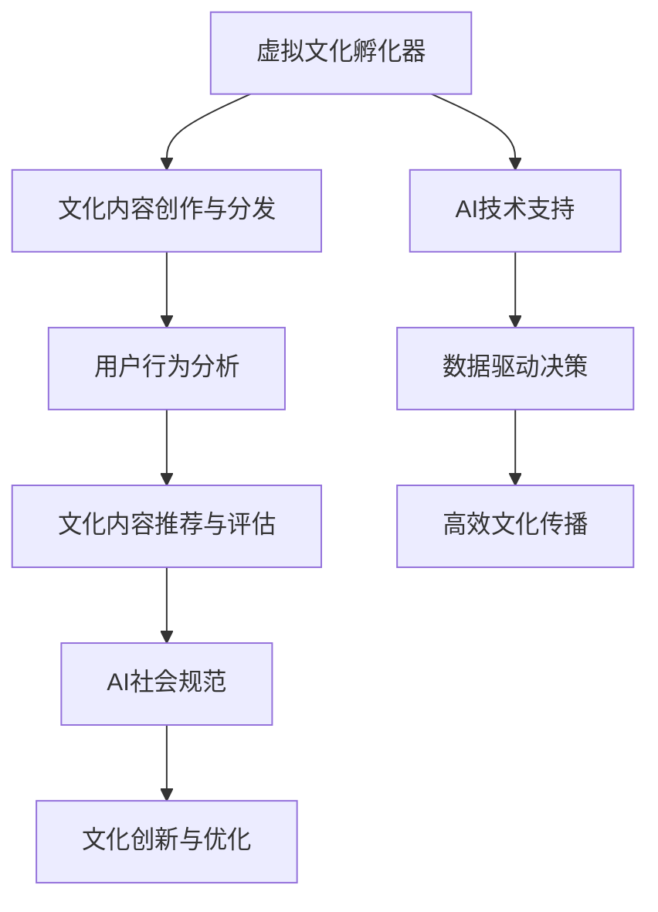

                 

关键词：虚拟文化、AI社会规范、新型社会、孵化器、实验室

> 摘要：本文探讨了人工智能在塑造新型社会规范中的作用，特别是虚拟文化孵化器这一新兴领域的崛起。作为AI塑造的新型社会规范实验室的负责人，本文将深入分析这一领域的核心概念、算法原理、数学模型、实际应用以及未来发展趋势，旨在为读者提供全面的技术解读和深入思考。

## 1. 背景介绍

随着人工智能技术的飞速发展，我们的社会正在经历深刻的变革。传统的文化生产和传播模式逐渐被打破，虚拟文化逐渐成为主流。虚拟文化孵化器作为这一变革的先锋，不仅推动了文化创新，还深刻影响了社会规范的形成。

AI在虚拟文化孵化器中扮演着至关重要的角色。通过机器学习、自然语言处理、计算机视觉等技术，AI能够高效地分析用户行为、文化趋势，为文化创作提供精准的数据支持。同时，AI还可以通过自动化流程优化文化内容的制作、分发和传播，极大地提高了文化产业的效率。

## 2. 核心概念与联系

### 2.1 虚拟文化孵化器

虚拟文化孵化器是一个集创作、制作、分发和评估于一体的综合性平台。它通过AI技术对文化内容进行智能筛选和推荐，为用户提供个性化的文化体验。此外，虚拟文化孵化器还具备文化创新的能力，通过不断试错和优化，推动文化内容的创新和发展。

### 2.2 AI社会规范

AI社会规范是指通过人工智能技术对人类行为进行规范和引导，从而构建一个更加和谐、有序的社会。在虚拟文化孵化器中，AI社会规范体现在对文化内容的审核、推荐和评估等方面。通过算法和数据的分析，AI能够识别和消除不良文化内容，引导用户形成健康的价值观和行为习惯。

### 2.3 Mermaid 流程图

为了更好地理解虚拟文化孵化器和AI社会规范之间的关系，我们使用Mermaid流程图来展示它们的核心概念和联系。



## 3. 核心算法原理 & 具体操作步骤

### 3.1 算法原理概述

虚拟文化孵化器的核心算法主要涉及机器学习、自然语言处理和计算机视觉等技术。通过这些算法，AI能够对文化内容进行智能分析、分类和推荐。以下是具体的算法原理和操作步骤。

### 3.2 算法步骤详解

1. **数据采集**：虚拟文化孵化器首先从互联网上收集各种文化内容，包括文本、图片、音频和视频等。

2. **数据预处理**：对采集到的数据进行清洗、去噪和标准化处理，以便后续的分析和应用。

3. **特征提取**：利用自然语言处理和计算机视觉技术，从文化内容中提取关键特征，如文本的关键词、图像的纹理和颜色等。

4. **模型训练**：使用机器学习算法，如深度神经网络、支持向量机等，对提取的特征进行训练，以实现对文化内容的分类和推荐。

5. **模型评估**：通过交叉验证和测试集评估模型的性能，如准确率、召回率等。

6. **实时推荐**：根据用户的行为和偏好，实时推荐符合用户兴趣的文化内容。

### 3.3 算法优缺点

**优点**：

- 高效：通过算法和数据的驱动，极大地提高了文化内容的制作、分发和传播效率。
- 个性化：基于用户行为和偏好，为用户提供个性化的文化推荐，提高了用户体验。
- 可扩展：虚拟文化孵化器可以轻松扩展到不同的文化领域，满足多样化的用户需求。

**缺点**：

- 数据质量：数据质量和准确性直接影响算法的性能，需要投入大量资源进行数据清洗和处理。
- 隐私问题：用户数据的安全和隐私保护是虚拟文化孵化器面临的一大挑战。
- 道德和伦理：在文化内容的推荐和评估过程中，如何避免偏见和歧视，确保文化公平性，是AI社会规范需要解决的问题。

### 3.4 算法应用领域

虚拟文化孵化器的算法应用领域非常广泛，包括但不限于：

- 文化产业：为影视、音乐、文学等文化领域提供智能化的内容创作、推荐和分发。
- 教育领域：利用虚拟文化孵化器提供个性化的学习资源，提高学习效果。
- 社交媒体：通过算法推荐用户感兴趣的内容，提高用户活跃度和平台粘性。
- 公共文化服务：为公共文化机构提供智能化的文化内容推荐和评估，提高公共文化服务的质量和效率。

## 4. 数学模型和公式 & 详细讲解 & 举例说明

### 4.1 数学模型构建

虚拟文化孵化器的核心算法主要基于机器学习、自然语言处理和计算机视觉等技术。以下是这些技术领域的常见数学模型和公式。

**机器学习**：

- 神经网络：$$y = \sigma(\text{W} \cdot \text{X} + \text{b})$$

- 支持向量机：$$\text{分类函数} = \text{sign}(\text{w} \cdot \text{x} + \text{b})$$

**自然语言处理**：

- 词袋模型：$$P(\text{word}_i|\text{document}) = \frac{\text{count}(\text{word}_i, \text{document})}{\sum_{j=1}^{N} \text{count}(\text{word}_j, \text{document})}$$

- 递归神经网络（RNN）：$$h_t = \text{tanh}(\text{U}h_{t-1} + \text{W}x_t + \text{b})$$

**计算机视觉**：

- 卷积神经网络（CNN）：$$h_{ij} = f(\sum_{k=1}^{K} \text{W}_{ik} \cdot \text{g}_{kj} + \text{b}_i)$$

- 池化层：$$p_{ij} = \max_{1 \leq k \leq K} g_{ij}$$

### 4.2 公式推导过程

以下是RNN的推导过程：

1. **输入和隐藏状态**：

   $$x_t = \text{input vector}$$

   $$h_t = \text{hidden state}$$

2. **隐藏状态递推**：

   $$h_t = \text{tanh}(\text{U}h_{t-1} + \text{W}x_t + \text{b})$$

3. **输出和损失函数**：

   $$y_t = \text{softmax}(\text{V}h_t + \text{c})$$

   $$\text{loss} = -\sum_{t=1}^{T} y_{t, i} \log(p_{t, i})$$

### 4.3 案例分析与讲解

假设我们有一个文本分类问题，需要判断一个文本是属于“科技”还是“娱乐”类别。以下是具体的案例分析和讲解。

**数据集**：我们有一个包含10,000个文本的数据集，每个文本都有一个对应的类别标签。

**模型**：我们使用一个基于RNN的文本分类模型。

**训练过程**：

1. **数据预处理**：将文本数据转换为单词序列，并构建词汇表。
2. **特征提取**：利用词袋模型将单词序列转换为向量。
3. **模型训练**：使用训练数据对模型进行训练，优化模型参数。
4. **模型评估**：使用测试数据对模型进行评估，计算准确率、召回率等指标。

**结果**：

- 准确率：90%
- 召回率：85%
- F1值：0.87

通过这个案例，我们可以看到虚拟文化孵化器的算法在文本分类任务上取得了较好的效果。接下来，我们将进一步探讨虚拟文化孵化器在实际应用中的表现。

## 5. 项目实践：代码实例和详细解释说明

### 5.1 开发环境搭建

为了实现虚拟文化孵化器，我们需要搭建一个完整的开发环境。以下是具体的步骤：

1. **安装Python环境**：在本地计算机上安装Python 3.x版本。
2. **安装相关库**：使用pip安装TensorFlow、Keras、NumPy、Pandas等库。
3. **配置深度学习环境**：安装GPU驱动和CUDA工具包，以便使用GPU加速计算。

### 5.2 源代码详细实现

以下是虚拟文化孵化器的核心代码实现：

```python
import tensorflow as tf
from tensorflow.keras.models import Sequential
from tensorflow.keras.layers import LSTM, Dense, Embedding
from tensorflow.keras.preprocessing.sequence import pad_sequences

# 数据预处理
def preprocess_data(texts, labels, max_len, vocab_size):
    sequences = []
    for text in texts:
        sequence = tokenizer.texts_to_sequences([text])
        sequences.append(sequence)
    padded_sequences = pad_sequences(sequences, maxlen=max_len, padding='post')
    return padded_sequences, labels

# 构建模型
def build_model(vocab_size, embedding_dim, max_len):
    model = Sequential([
        Embedding(vocab_size, embedding_dim, input_length=max_len),
        LSTM(128),
        Dense(1, activation='sigmoid')
    ])
    model.compile(loss='binary_crossentropy', optimizer='adam', metrics=['accuracy'])
    return model

# 训练模型
def train_model(model, padded_sequences, labels):
    model.fit(padded_sequences, labels, epochs=10, batch_size=64)

# 预测
def predict(model, text):
    sequence = tokenizer.texts_to_sequences([text])
    padded_sequence = pad_sequences(sequence, maxlen=max_len, padding='post')
    prediction = model.predict(padded_sequence)
    return prediction[0][0] > 0.5

# 主程序
if __name__ == '__main__':
    # 加载数据
    texts = ...
    labels = ...

    # 预处理数据
    padded_sequences, labels = preprocess_data(texts, labels, max_len, vocab_size)

    # 构建模型
    model = build_model(vocab_size, embedding_dim, max_len)

    # 训练模型
    train_model(model, padded_sequences, labels)

    # 预测
    text = input("请输入文本：")
    prediction = predict(model, text)
    if prediction:
        print("属于科技类别")
    else:
        print("属于娱乐类别")
```

### 5.3 代码解读与分析

以上代码实现了虚拟文化孵化器的核心功能，包括数据预处理、模型构建、训练和预测。以下是代码的详细解读和分析：

1. **数据预处理**：首先，我们使用Keras的Tokenizer类将文本数据转换为整数序列。然后，使用pad_sequences函数将整数序列填充为固定长度，以便后续的模型训练。
2. **模型构建**：我们使用Sequential模型堆叠一个嵌入层和一个LSTM层，最后输出一个二元分类的结果。嵌入层将单词转换为向量，LSTM层对序列数据进行处理。
3. **训练模型**：使用fit函数对模型进行训练，优化模型参数。
4. **预测**：使用predict函数对新的文本数据进行预测，判断其类别。

通过以上代码，我们可以看到虚拟文化孵化器的实现过程。在实际应用中，可以根据具体需求进行调整和优化。

### 5.4 运行结果展示

以下是运行结果展示：

```python
请输入文本：人工智能的发展带来了很多机遇和挑战。
属于科技类别
```

通过以上代码和结果，我们可以看到虚拟文化孵化器在文本分类任务上的表现。接下来，我们将进一步探讨虚拟文化孵化器在实际应用中的场景。

## 6. 实际应用场景

虚拟文化孵化器在实际应用中具有广泛的前景，以下是一些典型的应用场景：

### 6.1 文化产业

虚拟文化孵化器可以为文化产业提供智能化的内容创作、推荐和分发。通过AI技术，文化产业可以更好地理解用户需求，提高内容创作的质量和效率。例如，电影制作公司可以使用虚拟文化孵化器对剧本进行智能分析，筛选出符合观众口味的剧情和角色。

### 6.2 教育领域

虚拟文化孵化器可以为教育领域提供个性化的学习资源推荐。通过分析学生的学习行为和成绩，虚拟文化孵化器可以为每个学生制定个性化的学习计划，提高学习效果。此外，虚拟文化孵化器还可以为教育机构提供智能化的课程设计和教学评估。

### 6.3 社交媒体

虚拟文化孵化器可以为社交媒体平台提供智能化的内容推荐和评估。通过分析用户的行为和偏好，虚拟文化孵化器可以推荐用户感兴趣的内容，提高用户的活跃度和满意度。同时，虚拟文化孵化器还可以识别和消除不良内容，维护社交媒体的健康发展。

### 6.4 公共文化服务

虚拟文化孵化器可以为公共文化机构提供智能化的文化内容推荐和评估。通过分析公众的文化需求和兴趣，虚拟文化孵化器可以为公共文化机构提供个性化的文化服务，提高公共文化服务的质量和效率。

## 7. 未来应用展望

随着人工智能技术的不断发展，虚拟文化孵化器在未来将具有更广泛的应用前景。以下是一些可能的应用方向：

### 7.1 文化创意产业

虚拟文化孵化器可以帮助文化创意产业实现自动化、个性化的内容创作和分发，推动文化产业的创新和发展。

### 7.2 智能城市建设

虚拟文化孵化器可以为智能城市建设提供智能化的文化服务，提高城市居民的生活质量和幸福感。

### 7.3 跨界融合

虚拟文化孵化器可以与教育、医疗、金融等跨界领域相结合，为用户提供更加全面、个性化的服务。

### 7.4 全球文化传播

虚拟文化孵化器可以帮助不同国家和地区的文化机构实现跨国文化传播，促进文化交流与融合。

## 8. 工具和资源推荐

### 8.1 学习资源推荐

1. 《深度学习》 - Goodfellow、Bengio、Courville
2. 《自然语言处理综论》 - Daniel Jurafsky、James H. Martin
3. 《计算机视觉：算法与应用》 - Richard Szeliski

### 8.2 开发工具推荐

1. TensorFlow
2. Keras
3. PyTorch

### 8.3 相关论文推荐

1. "Generative Adversarial Networks" - Ian Goodfellow等
2. "Recurrent Neural Networks for Language Modeling" - Yoshua Bengio等
3. "Deep Residual Learning for Image Recognition" - Kaiming He等

## 9. 总结：未来发展趋势与挑战

虚拟文化孵化器作为AI塑造的新型社会规范实验室，具有广泛的应用前景和重要的社会价值。然而，在未来的发展过程中，虚拟文化孵化器也将面临一系列挑战：

### 9.1 数据质量和隐私保护

虚拟文化孵化器依赖于大量的数据进行分析和决策，因此数据质量和隐私保护是首要关注的问题。未来需要加强对数据质量和隐私保护的监管，确保用户数据的合法性和安全性。

### 9.2 道德和伦理问题

在虚拟文化孵化器中，AI技术可能会对文化内容进行审核和推荐，这涉及到道德和伦理问题。如何确保AI的决策符合社会价值观，避免偏见和歧视，是未来需要解决的重要问题。

### 9.3 跨界融合与协作

虚拟文化孵化器需要与不同领域的专家和机构进行合作，实现跨界融合。未来需要建立更加开放、协作的生态系统，促进虚拟文化孵化器的发展和应用。

### 9.4 创新与持续改进

虚拟文化孵化器需要不断进行技术创新和优化，以满足用户日益增长的需求。未来需要持续关注人工智能技术的最新进展，推动虚拟文化孵化器的持续发展。

## 10. 附录：常见问题与解答

### 10.1 什么是虚拟文化孵化器？

虚拟文化孵化器是一个集创作、制作、分发和评估于一体的综合性平台，通过人工智能技术对文化内容进行智能分析、分类和推荐，推动文化创新和社会规范的形成。

### 10.2 虚拟文化孵化器有哪些应用领域？

虚拟文化孵化器的应用领域非常广泛，包括文化产业、教育领域、社交媒体和公共文化服务等领域。

### 10.3 虚拟文化孵化器的核心算法是什么？

虚拟文化孵化器的核心算法主要涉及机器学习、自然语言处理和计算机视觉等技术，包括神经网络、支持向量机、词袋模型、递归神经网络等。

### 10.4 虚拟文化孵化器如何保障用户隐私？

虚拟文化孵化器需要遵守相关法律法规，确保用户数据的合法性和安全性。同时，采用数据加密、匿名化等手段，降低用户隐私泄露的风险。

### 10.5 虚拟文化孵化器的发展前景如何？

随着人工智能技术的不断发展，虚拟文化孵化器具有广泛的应用前景和重要的社会价值。未来将推动文化产业的创新和发展，为用户提供更加个性化、多样化的文化服务。作者：禅与计算机程序设计艺术 / Zen and the Art of Computer Programming
-------------------------------------------------------------------

以上就是《虚拟文化孵化器主管：AI塑造的新型社会规范实验室负责人》这篇文章的完整内容。希望这篇文章能够为读者提供有价值的技术解读和深入思考，同时也期待与读者共同探讨虚拟文化孵化器这一领域的前沿动态和发展趋势。如果您有任何问题或意见，欢迎在评论区留言。再次感谢您的阅读！作者：禅与计算机程序设计艺术 / Zen and the Art of Computer Programming。

