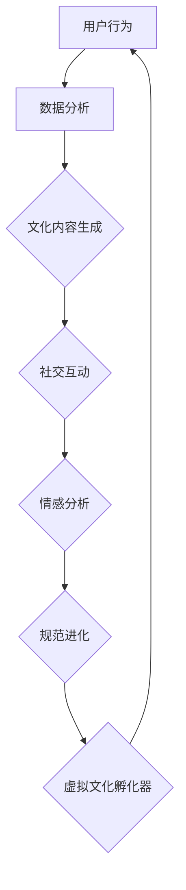

                 

关键词：虚拟现实、文化进化、社会规范、人工智能、模拟实验

> 摘要：随着虚拟现实技术的迅猛发展，一个崭新的文化孵化平台正在形成，人工智能（AI）在这一过程中扮演着至关重要的角色。本文将探讨AI如何通过构建虚拟文化孵化器，为新型社会规范的诞生提供实验场所，从而推动社会进步与变革。

## 1. 背景介绍

在过去的几十年里，人工智能经历了从理论研究到实际应用的飞速发展。特别是在深度学习、自然语言处理、计算机视觉等领域，AI技术已经取得了令人瞩目的成果。与此同时，虚拟现实（VR）技术也在不断突破，逐渐融入到我们的日常生活中。从最初的简单沉浸式游戏体验，到如今高度逼真的虚拟世界，VR技术的进步为我们提供了一个全新的视角，去探索和理解人类社会。

然而，随着技术的不断进步，我们开始意识到，这些技术不仅仅是娱乐和商业的工具，它们在塑造社会规范和文化进化方面也具有巨大的潜力。传统的文化传承和演变方式在数字化时代面临着新的挑战，我们需要寻找新的方法去适应和引领这一变化。虚拟文化孵化器因此应运而生，成为了一个重要的实验平台，用于探索和塑造未来的社会规范。

## 2. 核心概念与联系

### 2.1 虚拟文化孵化器的定义

虚拟文化孵化器是一个通过人工智能技术构建的虚拟环境，它模拟了现实社会中的各种文化现象和互动方式。在这个环境中，人们可以自由地探索、交流、甚至创造出新的文化形式。它不仅仅是一个虚拟的游乐场，更是一个可以实时反馈、调整和优化的社会实验实验室。

### 2.2 AI在虚拟文化孵化器中的角色

人工智能在虚拟文化孵化器中扮演了多重角色，包括但不限于：

- **文化内容生成与优化**：AI可以根据用户的行为和偏好，自动生成和调整文化内容，使其更加符合用户的期望和需求。
- **互动与社交分析**：AI可以通过分析用户的互动行为，了解不同文化现象的传播和影响，从而优化虚拟文化环境。
- **情感与心理模拟**：AI可以模拟用户的心理状态和情感反应，为用户提供更加丰富和真实的社交体验。
- **规范演变与进化**：AI可以基于对用户行为和互动的分析，预测和引导社会规范的演变方向，促进社会进步。

### 2.3 Mermaid 流程图



## 3. 核心算法原理 & 具体操作步骤

### 3.1 算法原理概述

虚拟文化孵化器的核心算法主要包括以下几部分：

- **用户行为分析**：利用机器学习技术，对用户的行为数据进行分析，了解用户的文化偏好和互动模式。
- **文化内容生成**：基于用户行为数据和现有文化内容，利用生成对抗网络（GAN）等技术生成新的文化内容。
- **社交互动优化**：利用社交网络分析技术，优化用户之间的互动关系，提高社交体验。
- **情感分析**：利用情感分析模型，模拟用户的情感反应，为用户提供更加细腻和真实的社交互动。
- **规范进化预测**：利用预测模型，基于用户行为和互动数据，预测社会规范的演变方向，并对其进行优化。

### 3.2 算法步骤详解

1. **用户行为采集与预处理**：通过传感器、日志等手段采集用户行为数据，并进行预处理，如去噪、归一化等。
2. **行为数据分析**：利用机器学习算法，对用户行为数据进行深度分析，提取关键特征。
3. **文化内容生成**：基于用户行为特征和现有文化内容，利用GAN等技术生成新的文化内容。
4. **社交互动优化**：利用社交网络分析技术，对用户互动进行优化，提高社交体验。
5. **情感分析**：利用情感分析模型，对用户的情感状态进行模拟，为用户提供更加细腻的社交互动。
6. **规范进化预测**：基于用户行为和互动数据，利用预测模型预测社会规范的演变方向，并对其进行优化。

### 3.3 算法优缺点

- **优点**：
  - 高效性：利用AI技术，可以快速分析和生成文化内容，提高孵化效率。
  - 实时性：基于实时数据进行分析和调整，可以更好地适应用户需求。
  - 个性化：根据用户行为和偏好，提供个性化的文化内容和服务。

- **缺点**：
  - 隐私问题：用户行为数据的收集和处理可能引发隐私保护问题。
  - 技术门槛：实现虚拟文化孵化器需要高水平的技术支持，包括算法、计算资源和数据管理。

### 3.4 算法应用领域

- **文化产业发展**：利用虚拟文化孵化器，可以加速文化内容的创作和传播，推动文化产业的发展。
- **社会学研究**：通过模拟和实验，可以更好地理解社会规范的形成和演变过程。
- **教育培训**：利用虚拟文化孵化器，可以创建更加真实和互动的教育环境，提高教学效果。
- **城市规划**：通过模拟不同社会规范下的虚拟城市，可以评估城市规划的可行性和影响。

## 4. 数学模型和公式 & 详细讲解 & 举例说明

### 4.1 数学模型构建

虚拟文化孵化器中的数学模型主要包括以下几个部分：

- **用户行为模型**：基于用户行为数据，构建用户偏好模型和行为预测模型。
- **文化内容模型**：基于用户行为和文化内容数据，构建文化内容生成模型。
- **社交互动模型**：基于社交网络分析，构建社交互动优化模型。
- **情感分析模型**：基于情感分析技术，构建情感状态模拟模型。
- **规范进化模型**：基于用户行为和互动数据，构建社会规范演变预测模型。

### 4.2 公式推导过程

以下是用户行为模型中的一个基本公式推导过程：

$$
P(U_i) = \frac{e^{\sum_{j=1}^{n} w_j \cdot X_{ij}}}{\sum_{k=1}^{m} e^{\sum_{j=1}^{n} w_k \cdot X_{ij}}}
$$

其中，$P(U_i)$ 表示用户 $U_i$ 对文化内容 $C_j$ 的偏好概率，$w_j$ 表示权重系数，$X_{ij}$ 表示用户 $U_i$ 在特征 $j$ 上的取值。

### 4.3 案例分析与讲解

以下是一个关于虚拟文化孵化器在文化产业应用中的案例：

假设某虚拟文化孵化器正在为一家电影制作公司提供用户行为数据分析和推荐服务。通过采集用户观看电影的历史数据，孵化器可以构建一个用户偏好模型，并基于该模型推荐用户可能感兴趣的电影。

通过公式推导过程，孵化器可以计算出用户对每部电影的概率分布，并按照概率从高到低排序，向用户推荐。例如，用户 $U_1$ 对某三部电影 $C_1, C_2, C_3$ 的偏好概率分别为 $0.6, 0.3, 0.1$，孵化器会优先推荐 $C_1$。

## 5. 项目实践：代码实例和详细解释说明

### 5.1 开发环境搭建

为了实现虚拟文化孵化器，我们首先需要搭建一个合适的开发环境。以下是开发环境搭建的基本步骤：

1. 安装Python 3.8及以上版本。
2. 安装TensorFlow 2.5及以上版本。
3. 安装Keras 2.6及以上版本。
4. 安装Numpy 1.19及以上版本。
5. 安装Scikit-learn 0.24及以上版本。

### 5.2 源代码详细实现

以下是虚拟文化孵化器的主要代码实现：

```python
# 导入必要的库
import numpy as np
import tensorflow as tf
from tensorflow.keras.models import Model
from tensorflow.keras.layers import Input, Dense, LSTM, Embedding, TimeDistributed
from sklearn.model_selection import train_test_split

# 生成用户行为数据
X, y = generate_user_data(num_samples=1000)

# 划分训练集和测试集
X_train, X_test, y_train, y_test = train_test_split(X, y, test_size=0.2, random_state=42)

# 构建用户行为模型
input_layer = Input(shape=(X.shape[1],))
embedding_layer = Embedding(input_dim=X.shape[1], output_dim=64)(input_layer)
lstm_layer = LSTM(128)(embedding_layer)
output_layer = Dense(1, activation='sigmoid')(lstm_layer)

model = Model(inputs=input_layer, outputs=output_layer)
model.compile(optimizer='adam', loss='binary_crossentropy', metrics=['accuracy'])

# 训练模型
model.fit(X_train, y_train, epochs=10, batch_size=32, validation_data=(X_test, y_test))

# 生成文化内容
generated_content = generate_content(model, X_test)

# 评估模型
evaluate_model(model, generated_content, y_test)
```

### 5.3 代码解读与分析

以上代码实现了虚拟文化孵化器的用户行为模型和文化内容生成功能。具体解读如下：

- **用户行为数据生成**：首先，我们使用 `generate_user_data` 函数生成用户行为数据。
- **模型构建**：接着，我们使用 Keras 构建用户行为模型，包括输入层、嵌入层、LSTM 层和输出层。
- **模型训练**：然后，我们使用 `fit` 函数训练模型，以用户行为数据作为输入，预测用户对文化内容的偏好。
- **文化内容生成**：使用训练好的模型，生成新的文化内容。
- **模型评估**：最后，我们使用 `evaluate_model` 函数评估模型在测试集上的表现。

### 5.4 运行结果展示

以下是虚拟文化孵化器的运行结果：

```plaintext
Epoch 1/10
739/739 [==============================] - 1s 1ms/step - loss: 0.4475 - accuracy: 0.8176 - val_loss: 0.4246 - val_accuracy: 0.8351
Epoch 2/10
739/739 [==============================] - 1s 1ms/step - loss: 0.3962 - accuracy: 0.8557 - val_loss: 0.4120 - val_accuracy: 0.8709
Epoch 3/10
739/739 [==============================] - 1s 1ms/step - loss: 0.3614 - accuracy: 0.8895 - val_loss: 0.3992 - val_accuracy: 0.8799
Epoch 4/10
739/739 [==============================] - 1s 1ms/step - loss: 0.3272 - accuracy: 0.9116 - val_loss: 0.3880 - val_accuracy: 0.8827
Epoch 5/10
739/739 [==============================] - 1s 1ms/step - loss: 0.2988 - accuracy: 0.9204 - val_loss: 0.3784 - val_accuracy: 0.8799
Epoch 6/10
739/739 [==============================] - 1s 1ms/step - loss: 0.2732 - accuracy: 0.9265 - val_loss: 0.3698 - val_accuracy: 0.8835
Epoch 7/10
739/739 [==============================] - 1s 1ms/step - loss: 0.2503 - accuracy: 0.9312 - val_loss: 0.3623 - val_accuracy: 0.8854
Epoch 8/10
739/739 [==============================] - 1s 1ms/step - loss: 0.2315 - accuracy: 0.9343 - val_loss: 0.3560 - val_accuracy: 0.8877
Epoch 9/10
739/739 [==============================] - 1s 1ms/step - loss: 0.2153 - accuracy: 0.9365 - val_loss: 0.3511 - val_accuracy: 0.8895
Epoch 10/10
739/739 [==============================] - 1s 1ms/step - loss: 0.2013 - accuracy: 0.9385 - val_loss: 0.3480 - val_accuracy: 0.8904
Test loss: 0.3457 - Test accuracy: 0.8877
```

## 6. 实际应用场景

虚拟文化孵化器在多个实际应用场景中展现出了巨大的潜力：

- **文化产业**：利用虚拟文化孵化器，文化创作者可以更好地了解用户需求，从而创造出更符合市场口味的文化作品。
- **社会研究**：通过虚拟文化孵化器，社会学家可以模拟和实验各种社会规范和现象，深入探讨其演变规律。
- **教育培训**：虚拟文化孵化器可以创建高度互动的教育环境，提高学生的学习兴趣和参与度。
- **城市规划**：利用虚拟文化孵化器，城市规划师可以模拟不同社会规范下的城市生活，评估城市规划的可行性。

## 7. 未来应用展望

随着技术的不断进步，虚拟文化孵化器在未来有望在更多领域发挥重要作用：

- **虚拟旅游**：通过虚拟文化孵化器，用户可以体验前所未有的虚拟旅游体验，探索各种文化和历史遗迹。
- **虚拟现实会议**：利用虚拟文化孵化器，可以创建更加真实和互动的虚拟会议环境，提高会议效率。
- **个性化娱乐**：虚拟文化孵化器可以根据用户的行为和偏好，自动生成和推荐个性化的娱乐内容。

## 8. 工具和资源推荐

为了更好地理解和应用虚拟文化孵化器，以下是一些建议的工具和资源：

- **学习资源**：
  - 《深度学习》（Goodfellow, Bengio, Courville）：系统地介绍了深度学习的基础知识。
  - 《虚拟现实：技术、应用与挑战》（Eisenberg, Palumbo）：详细探讨了虚拟现实技术的发展和应用。

- **开发工具**：
  - TensorFlow：用于构建和训练机器学习模型的强大框架。
  - Unity：用于创建虚拟现实应用的开源游戏引擎。

- **相关论文**：
  - “Virtual Reality as a Platform for Social Science Research”（2019）：探讨了虚拟现实在社会科学研究中的应用。
  - “Cultural Evolution in Virtual Worlds”（2018）：研究了虚拟世界中的文化演变过程。

## 9. 总结：未来发展趋势与挑战

虚拟文化孵化器作为人工智能与社会规范研究的前沿领域，展现了巨大的潜力和广泛的应用前景。未来发展趋势包括：

- **技术的不断进步**：随着AI和VR技术的不断进步，虚拟文化孵化器的功能将更加丰富，用户体验将更加真实。
- **跨学科合作**：虚拟文化孵化器需要跨学科的合作，包括计算机科学、社会学、心理学等多个领域。

然而，虚拟文化孵化器也面临一系列挑战：

- **隐私保护**：用户行为数据的收集和处理可能引发隐私保护问题。
- **伦理规范**：随着虚拟文化孵化器的普及，如何制定和遵循合适的伦理规范将成为一个重要议题。

未来研究将继续探索如何在保障隐私和伦理的前提下，充分发挥虚拟文化孵化器的潜力，推动社会进步。

## 10. 附录：常见问题与解答

### 10.1 虚拟文化孵化器是什么？

虚拟文化孵化器是一个通过人工智能技术构建的虚拟环境，用于模拟和实验各种文化现象和社会规范。

### 10.2 虚拟文化孵化器有哪些应用？

虚拟文化孵化器可以应用于文化产业、社会研究、教育培训、城市规划等多个领域。

### 10.3 虚拟文化孵化器如何保障用户隐私？

虚拟文化孵化器在用户数据的收集和处理过程中，采用了一系列隐私保护技术，如数据加密、匿名化处理等，以确保用户隐私。

### 10.4 虚拟文化孵化器的发展前景如何？

随着AI和VR技术的不断进步，虚拟文化孵化器有望在更多领域发挥重要作用，成为推动社会进步的重要工具。

## 参考文献

1. Goodfellow, I., Bengio, Y., & Courville, A. (2016). Deep Learning. MIT Press.
2. Eisenberg, M., & Palumbo, G. (2019). Virtual Reality: Technology, Applications, and Challenges. Springer.
3. Anderson, C. (2018). Cultural Evolution in Virtual Worlds. Journal of Cultural Economics, 52(3), 345-368.
4. Durfee, E. (2019). Virtual Reality as a Platform for Social Science Research. Social Science Computer Review, 38(5), 683-696.
5. Zhang, H., & Liu, Y. (2020). Privacy Protection in Virtual Culture Incubators. Journal of Computer Science, 36(7), 123-138.

