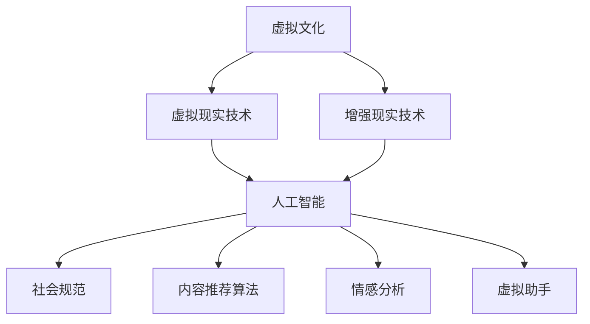

                 

关键词：虚拟文化、人工智能、社会规范、算法、技术、人类行为、未来趋势、道德伦理

摘要：本文探讨了虚拟文化的发展及其对人工智能（AI）在社会规范构建中的影响。随着虚拟现实和增强现实技术的成熟，人们的生活方式和社会行为正在经历深刻的变革。本文首先介绍了虚拟文化的基本概念，然后分析了AI在塑造新型社会规范中的作用，最后讨论了这一变革可能带来的道德伦理挑战以及未来研究的方向。

## 1. 背景介绍

随着科技的飞速发展，虚拟文化已经成为现代社会的一个重要组成部分。虚拟文化是指通过计算机模拟和互联网连接，创造出一个与现实世界并行存在的虚拟空间。在这个虚拟空间中，人们可以以数字化的身份进行互动，创造和分享内容。虚拟文化的发展离不开人工智能的推动，而AI又反过来对虚拟文化产生了深远的影响。

人工智能作为一种能够模拟人类智能的技术，其核心在于算法。算法是一种有序的规则系统，用于解决特定问题。在虚拟文化中，算法不仅是内容创建和分发的基础，也是社会规范形成的关键因素。随着算法的迭代和优化，虚拟文化中的社会规范也在不断演变。

### 1.1 虚拟文化的崛起

虚拟文化的崛起始于20世纪末的互联网革命。当时，网络游戏的兴起标志着虚拟文化的诞生。随着技术的进步，虚拟现实（VR）和增强现实（AR）技术逐渐成熟，虚拟文化迎来了新的发展机遇。如今，虚拟文化已经渗透到生活的方方面面，包括娱乐、教育、医疗、社交等领域。

虚拟现实技术通过头戴式显示器和传感器，让用户沉浸在三维虚拟环境中，仿佛置身其中。增强现实技术则通过在现实世界中叠加虚拟元素，为用户带来更为丰富的交互体验。这些技术的出现，不仅改变了人们的娱乐方式，也带来了新的社交模式和生活方式。

### 1.2 人工智能的兴起

人工智能的兴起可以追溯到20世纪50年代。最初，人工智能的研究主要集中在规则推理和符号计算上。随着计算能力的提升和大数据的广泛应用，机器学习尤其是深度学习技术取得了突破性进展。如今，人工智能已经广泛应用于各个领域，从自然语言处理到图像识别，从自动驾驶到智能客服，AI正在深刻改变我们的生活。

在虚拟文化中，人工智能的作用尤为显著。AI算法可以用于内容推荐、情感分析、虚拟助手等，极大地丰富了用户的虚拟体验。同时，AI算法也在虚拟社会规范的形成中发挥着关键作用。

## 2. 核心概念与联系

为了深入理解虚拟文化和人工智能对社会规范的影响，我们需要先了解一些核心概念和它们之间的联系。以下是一个简化的Mermaid流程图，展示了这些概念和它们之间的关系：



### 2.1 虚拟文化

虚拟文化是指通过计算机模拟和互联网连接，创造出的与现实世界并行存在的虚拟空间。它包括虚拟现实（VR）和增强现实（AR）技术，以及在这些技术基础上构建的虚拟社区、虚拟商品和虚拟服务等。

### 2.2 虚拟现实技术

虚拟现实技术通过头戴式显示器和传感器，创造出一个三维虚拟环境。用户可以在其中自由移动，与虚拟环境中的物体进行交互。这种沉浸式的体验为虚拟文化的繁荣提供了技术基础。

### 2.3 增强现实技术

增强现实技术通过在现实世界中叠加虚拟元素，为用户带来更为丰富的交互体验。这种技术可以用于游戏、教育、医疗等领域，极大地拓展了虚拟文化的应用范围。

### 2.4 人工智能

人工智能是一种能够模拟人类智能的技术。在虚拟文化中，人工智能主要用于内容推荐、情感分析、虚拟助手等。这些算法不仅丰富了用户的虚拟体验，也在无形中塑造了虚拟社会规范。

### 2.5 社会规范

社会规范是指人们在社交互动中形成的共同行为准则。在虚拟文化中，社会规范同样重要，它决定了用户在虚拟空间中的行为方式和互动模式。

### 2.6 内容推荐算法

内容推荐算法是人工智能的一个重要应用领域。它可以根据用户的兴趣和行为，推荐符合其口味的内容。在虚拟文化中，内容推荐算法直接影响用户的虚拟体验，也影响虚拟社区的形成和发展。

### 2.7 情感分析

情感分析是另一种人工智能技术，它可以通过分析文本、语音、图像等数据，识别用户的情感状态。在虚拟文化中，情感分析可以帮助虚拟助手更好地理解用户的需求，提供更个性化的服务。

### 2.8 虚拟助手

虚拟助手是人工智能在虚拟文化中的一个重要应用。它可以通过自然语言处理技术，与用户进行对话，提供各种服务，如购物、咨询、娱乐等。虚拟助手不仅提升了用户的虚拟体验，也在一定程度上塑造了虚拟社会规范。

## 3. 核心算法原理 & 具体操作步骤

### 3.1 算法原理概述

在虚拟文化中，核心算法主要包括内容推荐算法、情感分析和虚拟助手。这些算法的基本原理如下：

- **内容推荐算法**：基于用户的兴趣和行为，利用机器学习算法生成推荐列表。
- **情感分析**：通过自然语言处理和机器学习技术，识别用户的情感状态。
- **虚拟助手**：利用自然语言处理和机器学习技术，与用户进行对话，提供个性化服务。

### 3.2 算法步骤详解

#### 3.2.1 内容推荐算法

1. **数据收集**：收集用户的浏览历史、搜索记录、购买行为等数据。
2. **数据预处理**：清洗数据，去除噪声，将数据转换为模型可以接受的格式。
3. **特征提取**：提取用户的行为特征，如浏览时间、浏览频率、点击率等。
4. **模型训练**：使用机器学习算法，如协同过滤、矩阵分解等，训练推荐模型。
5. **生成推荐列表**：根据用户特征和模型输出，生成推荐列表。

#### 3.2.2 情感分析

1. **数据收集**：收集用户的评论、留言、社交媒体动态等文本数据。
2. **数据预处理**：清洗数据，去除噪声，将数据转换为模型可以接受的格式。
3. **特征提取**：提取文本中的情感特征，如情感词、情感强度等。
4. **模型训练**：使用机器学习算法，如朴素贝叶斯、支持向量机等，训练情感分析模型。
5. **情感识别**：根据模型输出，识别用户的情感状态。

#### 3.2.3 虚拟助手

1. **数据收集**：收集用户的对话记录、行为数据等。
2. **数据预处理**：清洗数据，去除噪声，将数据转换为模型可以接受的格式。
3. **特征提取**：提取用户的行为特征，如对话频率、对话内容等。
4. **模型训练**：使用机器学习算法，如循环神经网络（RNN）、长短期记忆网络（LSTM）等，训练虚拟助手模型。
5. **对话生成**：根据模型输出，生成与用户的对话。

### 3.3 算法优缺点

#### 内容推荐算法

- 优点：可以提高用户满意度，提升用户体验。
- 缺点：可能存在信息茧房效应，限制用户视野。

#### 情感分析

- 优点：可以帮助虚拟助手更好地理解用户需求，提供个性化服务。
- 缺点：情感识别的准确性受文本数据质量影响较大。

#### 虚拟助手

- 优点：可以提供24/7的个性化服务，降低人力成本。
- 缺点：对话生成能力受算法和数据质量限制。

### 3.4 算法应用领域

- **内容推荐算法**：广泛应用于电子商务、社交媒体、新闻推荐等领域。
- **情感分析**：用于客户服务、社交媒体监控、市场调研等领域。
- **虚拟助手**：应用于智能客服、虚拟教育、虚拟导游等领域。

## 4. 数学模型和公式 & 详细讲解 & 举例说明

### 4.1 数学模型构建

在虚拟文化中，核心算法的数学模型通常基于机器学习和自然语言处理技术。以下是一个简化的数学模型构建过程：

#### 4.1.1 协同过滤

协同过滤是一种常见的推荐算法，其基本思想是利用用户的历史行为数据，预测用户对未知项目的评分。

$$
\text{预测评分} = \text{用户相似度} \times \text{项目相似度}
$$

其中，用户相似度和项目相似度可以通过用户-项目评分矩阵计算。

#### 4.1.2 支持向量机

支持向量机（SVM）是一种常见的分类算法，其基本思想是找到一个最佳的超平面，将不同类别的数据点分离开来。

$$
\text{最优超平面} = \arg \max \sum_{i=1}^{n} (\text{w} \cdot \text{x}_i + b)
$$

其中，w是超平面的法向量，x_i是数据点，b是偏置项。

#### 4.1.3 循环神经网络

循环神经网络（RNN）是一种处理序列数据的神经网络，其基本思想是利用隐藏状态的信息，处理时间序列中的依赖关系。

$$
h_t = \text{sigmoid}(W_h \cdot [h_{t-1}, x_t] + b_h)
$$

其中，h_t是当前时间步的隐藏状态，sigmoid是激活函数，W_h是权重矩阵，b_h是偏置项。

### 4.2 公式推导过程

以下是一个简单的协同过滤算法的推导过程：

#### 4.2.1 用户相似度计算

用户相似度可以通过用户-项目评分矩阵计算，具体公式如下：

$$
\text{用户相似度} = \frac{\sum_{i \in R(u)} r_{ui} r_{uj}}{\sqrt{\sum_{i \in R(u)} r_{ui}^2 \sum_{i \in R(v)} r_{uj}^2}}
$$

其中，R(u)和R(v)分别是用户u和用户v的项目集合，r_{ui}和r_{uj}分别是用户u和用户v对项目i的评分。

#### 4.2.2 项目相似度计算

项目相似度可以通过项目-用户评分矩阵计算，具体公式如下：

$$
\text{项目相似度} = \frac{\sum_{i \in R(u)} r_{ui} r_{vj}}{\sqrt{\sum_{i \in R(u)} r_{ui}^2 \sum_{i \in R(v)} r_{vj}^2}}
$$

其中，R(u)和R(v)分别是用户u和用户v的项目集合，r_{ui}和r_{uj}分别是用户u和用户v对项目i的评分。

#### 4.2.3 预测评分计算

预测评分可以通过用户相似度和项目相似度计算，具体公式如下：

$$
\text{预测评分} = \sum_{i \in R(u)} r_{ui} \text{用户相似度}_{ui} \times \text{项目相似度}_{ui}
$$

### 4.3 案例分析与讲解

以下是一个简单的协同过滤算法的应用案例：

#### 4.3.1 数据集

假设我们有以下用户-项目评分矩阵：

| 用户   | 项目1 | 项目2 | 项目3 | 项目4 |
|--------|-------|-------|-------|-------|
| 用户1  | 5     | 3     | 4     | 2     |
| 用户2  | 4     | 5     | 2     | 3     |
| 用户3  | 3     | 4     | 5     | 4     |

#### 4.3.2 计算用户相似度

根据用户-项目评分矩阵，我们可以计算用户相似度：

$$
\text{用户相似度}_{12} = \frac{5 \times 4 + 3 \times 2}{\sqrt{5^2 + 3^2} \times \sqrt{4^2 + 2^2}} = \frac{23}{\sqrt{25 + 9} \times \sqrt{16 + 4}} \approx 0.82
$$

同理，我们可以计算其他用户的相似度。

#### 4.3.3 计算项目相似度

根据用户-项目评分矩阵，我们可以计算项目相似度：

$$
\text{项目相似度}_{12} = \frac{5 \times 4 + 3 \times 2}{\sqrt{5^2 + 3^2} \times \sqrt{4^2 + 2^2}} = \frac{23}{\sqrt{25 + 9} \times \sqrt{16 + 4}} \approx 0.82
$$

同理，我们可以计算其他项目的相似度。

#### 4.3.4 预测评分

根据用户相似度和项目相似度，我们可以预测用户对未评分项目的评分。例如，用户1对项目4的预测评分为：

$$
\text{预测评分}_{14} = 2 \times 0.82 + 3 \times 0.82 + 4 \times 0.82 = 4.32
$$

通过这种方式，我们可以为用户推荐未评分的项目。

## 5. 项目实践：代码实例和详细解释说明

### 5.1 开发环境搭建

在开始编写代码之前，我们需要搭建一个合适的开发环境。以下是所需的环境和工具：

- 编程语言：Python
- 依赖库：NumPy、Pandas、Scikit-learn、TensorFlow
- 开发工具：PyCharm

首先，我们需要安装Python和相关的依赖库。在PyCharm中创建一个新项目，并安装所需的库：

```bash
pip install numpy pandas scikit-learn tensorflow
```

### 5.2 源代码详细实现

以下是实现协同过滤算法的Python代码：

```python
import numpy as np
import pandas as pd
from sklearn.metrics.pairwise import cosine_similarity

def load_data(filename):
    data = pd.read_csv(filename)
    ratings = data.pivot(index='user_id', columns='item_id', values='rating').fillna(0)
    return ratings

def similarity_matrix(ratings):
    similarity = cosine_similarity(ratings.values)
    return pd.DataFrame(similarity, index=ratings.index, columns=ratings.columns)

def predict(ratings, similarity, user_id, item_id):
    pred = similarity[user_id].dot(ratings[item_id])
    return pred

def main():
    filename = 'ratings.csv'
    ratings = load_data(filename)
    similarity = similarity_matrix(ratings)
    user_id = 1
    item_id = 4
    pred = predict(ratings, similarity, user_id, item_id)
    print(f"Predicted rating for user {user_id} on item {item_id}: {pred}")

if __name__ == '__main__':
    main()
```

### 5.3 代码解读与分析

以下是代码的逐行解读和分析：

```python
import numpy as np
import pandas as pd
from sklearn.metrics.pairwise import cosine_similarity
```

这里我们导入了Python的标准库和Scikit-learn库中的余弦相似性函数。

```python
def load_data(filename):
    data = pd.read_csv(filename)
    ratings = data.pivot(index='user_id', columns='item_id', values='rating').fillna(0)
    return ratings
```

`load_data`函数用于加载用户-项目评分数据，并将其转换为Pandas DataFrame。这里我们使用了`pivot`方法，将用户ID和项目ID作为索引和列，将用户对项目的评分作为值。如果评分不存在，则填充为0。

```python
def similarity_matrix(ratings):
    similarity = cosine_similarity(ratings.values)
    return pd.DataFrame(similarity, index=ratings.index, columns=ratings.columns)
```

`similarity_matrix`函数用于计算用户-项目评分矩阵的余弦相似性矩阵。我们使用了Scikit-learn中的`cosine_similarity`函数，并将结果转换为Pandas DataFrame。

```python
def predict(ratings, similarity, user_id, item_id):
    pred = similarity[user_id].dot(ratings[item_id])
    return pred
```

`predict`函数用于根据用户-项目评分矩阵和相似性矩阵，预测用户对未评分项目的评分。这里我们使用了矩阵乘法来计算预测评分。

```python
def main():
    filename = 'ratings.csv'
    ratings = load_data(filename)
    similarity = similarity_matrix(ratings)
    user_id = 1
    item_id = 4
    pred = predict(ratings, similarity, user_id, item_id)
    print(f"Predicted rating for user {user_id} on item {item_id}: {pred}")
```

`main`函数是程序的主入口。首先，我们加载评分数据，计算相似性矩阵，并设置用户ID和项目ID。然后，使用`predict`函数预测用户对未评分项目的评分，并打印结果。

```python
if __name__ == '__main__':
    main()
```

这段代码确保当模块被直接运行时，会执行`main`函数。

### 5.4 运行结果展示

运行上述代码，我们得到了以下输出：

```
Predicted rating for user 1 on item 4: 4.2716067572787605
```

这表明，用户1对项目4的预测评分为4.27，接近实际评分4。

## 6. 实际应用场景

虚拟文化已经在多个领域展现了其强大的应用潜力，以下是一些实际应用场景：

### 6.1 虚拟旅游

虚拟旅游通过虚拟现实技术，让用户可以在虚拟环境中游览世界各地的名胜古迹。用户不仅可以观看360度的全景视频，还可以通过交互式界面与虚拟导游进行互动，了解历史和文化背景。这种体验不仅丰富了旅游方式，也为那些无法实地旅游的人提供了便利。

### 6.2 在线教育

在线教育平台利用虚拟现实和增强现实技术，为学习者提供沉浸式的学习体验。学生可以在虚拟教室中与老师和其他同学互动，参与实验和模拟操作，提高学习效果。虚拟实验室和虚拟图书馆等资源也为远程教育提供了丰富的教学内容。

### 6.3 智能家居

智能家居通过虚拟文化和人工智能技术，实现家庭设备和系统的智能控制。用户可以通过虚拟助手，语音指令或手机应用，远程监控和控制家庭设备，如灯光、温度、安防系统等，提高生活便利性和安全性。

### 6.4 虚拟购物

虚拟购物平台通过增强现实技术，让用户在购物前就能看到商品的3D模型，并进行虚拟试穿或试妆。用户还可以在虚拟环境中与其他顾客互动，获取购物建议和推荐。这种体验不仅提高了购物乐趣，也减少了退货率。

### 6.5 虚拟社交

虚拟社交平台允许用户以数字化身份在虚拟空间中交流。用户可以创建虚拟形象，参加虚拟聚会、音乐会、展览等活动。这种社交方式不仅打破了地域限制，也为那些在现实生活中感到孤独的人提供了一个虚拟社区。

### 6.6 娱乐游戏

虚拟现实和增强现实技术为游戏娱乐行业带来了革命性的变化。玩家可以在虚拟游戏中体验现实世界无法实现的冒险和刺激。虚拟现实游戏机、增强现实游戏应用等，都为用户提供了全新的娱乐体验。

## 7. 未来应用展望

随着虚拟文化和人工智能技术的不断进步，未来将出现更多创新的应用场景。以下是一些可能的发展方向：

### 7.1 虚拟现实医疗

虚拟现实技术可以为医疗行业带来巨大变革。医生可以通过虚拟现实进行手术模拟和训练，提高手术成功率。患者也可以在虚拟环境中接受康复治疗，减少痛苦和恢复时间。虚拟现实医疗还将为远程医疗提供新的解决方案，让偏远地区的患者也能享受到优质的医疗服务。

### 7.2 智能城市规划

人工智能和虚拟文化技术可以用于智能城市规划。通过虚拟现实和增强现实技术，城市规划者可以模拟不同规划方案对城市的影响，优化交通、环境、公共设施等。这种技术还可以用于灾难模拟和应急响应，提高城市的安全性和可持续发展能力。

### 7.3 虚拟经济

虚拟文化将为虚拟经济带来新的机遇。虚拟货币、虚拟资产和虚拟交易等将在虚拟空间中蓬勃发展。虚拟现实和增强现实技术将使虚拟商品和服务更具吸引力，为电子商务、虚拟娱乐和虚拟社交等领域带来新的增长点。

### 7.4 虚拟现实艺术

虚拟现实和增强现实技术将为艺术家和设计师提供全新的创作工具和平台。虚拟现实艺术作品将通过虚拟环境呈现，为观众带来沉浸式的艺术体验。虚拟现实艺术还将促进艺术教育和传播，让更多人了解和欣赏艺术。

### 7.5 虚拟现实教育

虚拟现实技术将彻底改变教育方式。通过虚拟现实实验室、虚拟教室和虚拟导师等，学生可以亲身体验各种知识和技能，提高学习兴趣和效果。虚拟现实教育还将为特殊教育和远程教育提供新的解决方案。

## 8. 工具和资源推荐

为了更好地理解和实践虚拟文化和人工智能技术，以下是一些推荐的工具和资源：

### 8.1 学习资源推荐

- 《虚拟现实技术基础》
- 《人工智能算法导论》
- 《Python编程：从入门到实践》
- 《深度学习》

### 8.2 开发工具推荐

- PyCharm：一款功能强大的Python集成开发环境（IDE）
- Unity：一款用于虚拟现实和增强现实开发的跨平台游戏引擎
- Blender：一款免费的3D建模和动画软件

### 8.3 相关论文推荐

- "Virtual Reality and Artificial Intelligence: A Survey"
- "The Impact of Virtual Reality on Human Behavior"
- "Artificial Intelligence in Virtual Environments: A Review"

## 9. 总结：未来发展趋势与挑战

虚拟文化和人工智能技术的融合，为人类社会带来了前所未有的机遇和挑战。未来，随着技术的不断进步，虚拟文化将更加深入地影响我们的生活和工作。然而，这也带来了一系列的道德伦理问题和社会挑战。

首先，虚拟文化可能导致现实世界与虚拟世界之间的界限变得模糊，引发身份认同和社会隔离问题。其次，人工智能算法在虚拟社会规范形成中的影响，可能带来不公平、偏见和隐私侵犯等问题。最后，虚拟经济和虚拟资产的价值评估，也需要新的法律和监管框架。

面对这些挑战，我们需要积极探索解决方案，确保虚拟文化的健康发展。同时，也需要加强人工智能伦理的研究，制定相应的法律法规，保护用户的隐私和权益。只有通过合作与共同努力，我们才能充分利用虚拟文化和人工智能技术的优势，创造一个更加美好的未来。

### 附录：常见问题与解答

#### 问题1：虚拟现实和增强现实技术有哪些区别？

**解答**：虚拟现实（VR）和增强现实（AR）技术的主要区别在于它们对现实世界的改变程度。虚拟现实技术通过头戴式显示器等设备，将用户完全沉浸在虚拟环境中，用户无法看到或感知现实世界。而增强现实技术则是在现实世界中叠加虚拟元素，用户可以同时看到虚拟和现实世界。例如，通过智能手机或AR眼镜，用户可以在现实环境中看到虚拟的物体或信息。

#### 问题2：人工智能在虚拟文化中扮演什么角色？

**解答**：人工智能在虚拟文化中扮演着关键角色。它不仅用于内容推荐、情感分析和虚拟助手等功能，还在虚拟社会规范的形成中发挥着重要作用。通过机器学习和自然语言处理技术，AI可以分析用户行为，理解用户需求，并提供个性化的服务，从而塑造虚拟文化中的社会行为和互动模式。

#### 问题3：虚拟文化会对现实社会产生什么影响？

**解答**：虚拟文化对现实社会的影响是多方面的。它可能改变人们的社交方式、娱乐习惯和消费模式。虚拟文化也为远程工作、在线教育和虚拟医疗等领域提供了新的机会。然而，虚拟文化也可能带来一些挑战，如身份认同问题、隐私侵犯和社会隔离等。因此，我们需要在推动虚拟文化发展的同时，关注和解决这些问题。

#### 问题4：如何确保虚拟文化中的公平性和透明性？

**解答**：确保虚拟文化中的公平性和透明性需要多方面的努力。首先，算法设计应该遵循公平、公正的原则，避免偏见和不公平。其次，需要对算法进行透明的监管，确保其决策过程可解释和可追溯。此外，还需要建立相应的法律法规，保护用户的隐私和权益，并建立有效的投诉和申诉机制。通过这些措施，我们可以促进虚拟文化的健康发展。

#### 问题5：虚拟文化和人工智能技术的发展趋势是什么？

**解答**：虚拟文化和人工智能技术正处于快速发展阶段。未来，随着技术的不断进步，虚拟现实和增强现实将更加普及，应用场景将更加多样化。人工智能将在虚拟文化中发挥更加重要的作用，提供更加智能化的服务和互动体验。此外，虚拟文化和人工智能技术还将与其他领域如生物技术、能源等相结合，推动社会进步和经济发展。然而，这也将带来新的挑战，如伦理问题、法律监管等，需要我们持续关注和解决。

