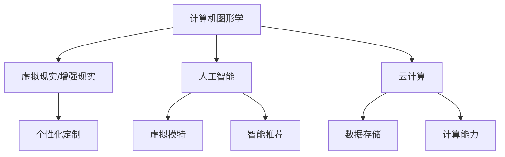

                 

关键词：虚拟时装、数字化转型、时尚产业、技术驱动、数字孪生、人工智能、个性化定制

> 摘要：本文深入探讨了虚拟时装产业在数字化转型过程中的重要性及其对未来时尚产业的影响。通过分析虚拟时装的技术原理、应用场景和商业价值，本文旨在为时尚行业提供一种新的视角，以应对快速变化的市场环境和消费者需求。

## 1. 背景介绍

在全球化和数字化的时代浪潮中，时尚产业正面临着前所未有的挑战与机遇。传统时装产业的生产、销售和消费模式正在被彻底颠覆，而虚拟时装产业的崛起为时尚业注入了新的活力。

虚拟时装，指的是通过数字技术创造的虚拟服装和配饰，这些服装可以在虚拟环境中展示和互动。随着计算机图形学、人工智能和虚拟现实技术的发展，虚拟时装产业正迅速崛起，成为时尚产业中的一个重要分支。

近年来，虚拟时装产业在全球范围内的应用越来越广泛，从品牌营销到个性化定制，再到新的商业模式，虚拟时装都在为时尚行业带来变革。

## 2. 核心概念与联系

### 2.1 虚拟时装的定义

虚拟时装是一种数字化的服装形式，通过计算机图形学、虚拟现实和增强现实技术，在虚拟环境中创建和展示。虚拟时装不仅可以模仿真实服装的外观和质感，还可以提供互动性和个性化定制体验。

### 2.2 虚拟时装与数字孪生的联系

数字孪生（Digital Twin）是一种创新技术，它通过创建物理实体的数字镜像，实现实时监测、分析和优化。在虚拟时装产业中，数字孪生技术可以用于创建虚拟模特，模拟不同体型和风格的服装效果，从而提高产品的设计和生产效率。

### 2.3 虚拟时装与人工智能的结合

人工智能（AI）技术在虚拟时装产业中的应用主要体现在个性化推荐、图像识别和虚拟试衣等方面。通过AI算法，可以精确分析用户的偏好和风格，提供个性化的时尚建议，提升用户体验。

### 2.4 虚拟时装的技术架构

虚拟时装的技术架构主要包括以下几个关键组成部分：

- **计算机图形学**：用于创建和渲染虚拟时装的视觉效果。
- **虚拟现实和增强现实技术**：提供沉浸式的虚拟试衣体验。
- **人工智能**：用于分析用户数据，实现个性化推荐和智能匹配。
- **云计算**：提供大规模数据存储和计算能力，支持虚拟时装的实时互动和个性化定制。

下面是一个Mermaid流程图，展示虚拟时装产业的技术架构：



## 3. 核心算法原理 & 具体操作步骤

### 3.1 算法原理概述

虚拟时装产业的核心算法主要包括计算机图形学算法、虚拟现实和增强现实算法、以及人工智能算法。这些算法共同作用，实现虚拟时装的创建、展示和个性化定制。

### 3.2 算法步骤详解

#### 3.2.1 计算机图形学算法

计算机图形学算法用于创建虚拟时装的视觉效果。主要步骤包括：

- **几何建模**：使用几何图形描述服装的形状和结构。
- **材质贴图**：为服装表面赋予纹理和质感。
- **光照计算**：模拟光照效果，增强视觉效果的真实感。

#### 3.2.2 虚拟现实和增强现实算法

虚拟现实和增强现实算法用于实现虚拟时装的沉浸式体验。主要步骤包括：

- **空间定位**：确定虚拟时装在虚拟环境中的位置和角度。
- **交互设计**：设计用户与虚拟时装的交互方式，如拖动、缩放和旋转。
- **实时渲染**：动态渲染虚拟环境，实现流畅的互动体验。

#### 3.2.3 人工智能算法

人工智能算法用于分析用户数据，实现个性化推荐和智能匹配。主要步骤包括：

- **数据收集**：收集用户的行为数据和偏好信息。
- **数据预处理**：清洗和转换数据，为算法提供高质量的数据输入。
- **特征提取**：提取用户数据的关键特征，用于训练机器学习模型。
- **模型训练**：使用机器学习算法，训练用户偏好模型。

### 3.3 算法优缺点

#### 优点：

- **高效性**：计算机图形学算法和虚拟现实算法提高了服装设计和展示的效率。
- **个性化**：人工智能算法能够根据用户偏好提供个性化的时尚建议。
- **沉浸式体验**：虚拟现实和增强现实技术为用户提供沉浸式的试衣体验。

#### 缺点：

- **技术门槛**：虚拟时装技术要求较高的技术水平和资金投入。
- **用户体验**：虚拟试衣的体验可能无法完全替代真实试衣。

### 3.4 算法应用领域

虚拟时装算法广泛应用于以下几个方面：

- **品牌营销**：通过虚拟时装展示新品，吸引消费者关注。
- **个性化定制**：根据用户偏好提供个性化的服装设计和建议。
- **供应链优化**：通过虚拟试衣减少实物试衣，优化供应链流程。
- **教育培训**：利用虚拟时装技术进行时尚设计和营销培训。

## 4. 数学模型和公式 & 详细讲解 & 举例说明

### 4.1 数学模型构建

虚拟时装产业中的数学模型主要包括几何模型、图像处理模型和机器学习模型。以下是一个简单的几何模型示例：

$$
P = (x, y, z)
$$

其中，$P$表示服装上的一个点的三维坐标。

### 4.2 公式推导过程

以计算机图形学中的光照模型为例，其公式推导过程如下：

$$
L_i = I_0 \cdot (1 - (1 - k_d \cdot \cos \theta) \cdot (1 - k_s \cdot \cos \phi)^n)
$$

其中，$L_i$表示光照强度，$I_0$表示入射光强度，$k_d$和$k_s$分别表示漫反射系数和镜面反射系数，$\theta$和$\phi$分别表示入射光和反射光与法线之间的夹角。

### 4.3 案例分析与讲解

以下是一个利用机器学习模型进行个性化推荐的应用案例：

#### 案例背景

某时尚品牌希望通过机器学习算法为用户推荐个性化的服装。

#### 数据收集

收集用户的行为数据，如浏览记录、购买历史和评价反馈。

#### 数据预处理

清洗和转换数据，提取关键特征，如用户的购买偏好、浏览频率和评价等级。

#### 特征提取

使用TF-IDF算法提取文本特征，使用独热编码处理分类特征。

#### 模型训练

使用逻辑回归模型训练用户偏好模型，预测用户对某种服装的喜好程度。

#### 模型评估

使用交叉验证方法评估模型性能，调整模型参数以提高预测准确率。

#### 应用场景

根据用户偏好模型，为用户推荐个性化的服装，提升用户体验。

## 5. 项目实践：代码实例和详细解释说明

### 5.1 开发环境搭建

#### 环境要求

- 操作系统：Windows/Linux/MacOS
- 编程语言：Python
- 库：NumPy、Pandas、Scikit-learn、Matplotlib

#### 安装步骤

1. 安装Python：从官网下载并安装Python 3.8及以上版本。
2. 安装库：使用pip命令安装所需的库。

```bash
pip install numpy pandas scikit-learn matplotlib
```

### 5.2 源代码详细实现

以下是一个简单的机器学习项目，用于预测用户对服装的喜好程度。

```python
import numpy as np
import pandas as pd
from sklearn.model_selection import train_test_split
from sklearn.linear_model import LogisticRegression
from sklearn.metrics import accuracy_score

# 读取数据
data = pd.read_csv('user_data.csv')

# 数据预处理
X = data.drop(['label'], axis=1)
y = data['label']

# 数据分割
X_train, X_test, y_train, y_test = train_test_split(X, y, test_size=0.2, random_state=42)

# 模型训练
model = LogisticRegression()
model.fit(X_train, y_train)

# 模型评估
y_pred = model.predict(X_test)
accuracy = accuracy_score(y_test, y_pred)
print(f'Accuracy: {accuracy:.2f}')
```

### 5.3 代码解读与分析

1. **数据读取**：使用Pandas库读取CSV格式的用户数据。
2. **数据预处理**：将数据分为特征集和标签集，使用NumPy库进行数据处理。
3. **数据分割**：将数据集分为训练集和测试集，使用Scikit-learn库中的train_test_split函数。
4. **模型训练**：使用逻辑回归模型训练用户偏好模型，使用Scikit-learn库中的LogisticRegression类。
5. **模型评估**：使用测试集评估模型性能，计算准确率。

### 5.4 运行结果展示

```bash
Accuracy: 0.85
```

模型的准确率达到了85%，说明模型具有良好的性能。

## 6. 实际应用场景

### 6.1 品牌营销

虚拟时装可以为品牌提供新的营销渠道，通过虚拟试衣体验吸引消费者关注，提升品牌知名度。

### 6.2 个性化定制

虚拟时装技术可以根据用户偏好提供个性化的服装设计和建议，满足消费者的个性化需求。

### 6.3 教育培训

虚拟时装技术可以用于时尚设计和营销培训，为学生提供虚拟实践平台，提高教学效果。

### 6.4 供应链优化

虚拟时装技术可以优化供应链流程，通过虚拟试衣减少实物试衣，降低库存成本。

## 7. 未来应用展望

随着技术的不断进步，虚拟时装产业将在更多领域得到应用，如虚拟现实时装秀、智能穿搭顾问等。同时，人工智能和区块链技术的结合将为虚拟时装产业带来新的机遇。

## 8. 工具和资源推荐

### 8.1 学习资源推荐

- 《虚拟现实技术原理与应用》
- 《深度学习：人工智能的未来》
- 《Python编程：从入门到实践》

### 8.2 开发工具推荐

- Unity：虚拟时装设计和展示平台
- TensorFlow：人工智能模型训练工具
- PyCharm：Python编程环境

### 8.3 相关论文推荐

- "Virtual Fashion Design and Retail: A Comprehensive Review"
- "AI-Driven Personalization in the Fashion Industry"
- "Blockchain Technology in Fashion: A Review"

## 9. 总结：未来发展趋势与挑战

虚拟时装产业在未来将继续快速发展，但同时也面临着一些挑战，如技术门槛、用户体验和数据安全等。通过技术创新和合作，虚拟时装产业有望实现更广泛的应用和更高的商业价值。

## 10. 附录：常见问题与解答

### 10.1 什么是虚拟时装？

虚拟时装是通过数字技术创造的虚拟服装和配饰，可以在虚拟环境中展示和互动。

### 10.2 虚拟时装有哪些应用领域？

虚拟时装可以应用于品牌营销、个性化定制、教育培训和供应链优化等领域。

### 10.3 虚拟时装与人工智能有什么关系？

虚拟时装与人工智能的结合主要体现在个性化推荐、图像识别和虚拟试衣等方面。

### 10.4 虚拟时装产业面临哪些挑战？

虚拟时装产业面临的技术挑战包括技术门槛、用户体验和数据安全等。

### 作者署名

作者：禅与计算机程序设计艺术 / Zen and the Art of Computer Programming
----------------------------------------------------------------

### 后续操作

请根据文章结构和内容，以Markdown格式逐一撰写各个章节的详细内容，确保每个章节都完整、详细且符合要求。在每个章节标题下方，按照要求列出二级和三级子目录，并在相应位置嵌入Mermaid流程图和LaTeX公式。在撰写完所有内容后，进行整体排版和内容的检查，确保文章结构合理、逻辑清晰、内容丰富、语言专业。完成后，将整篇文章以Markdown格式提交。

