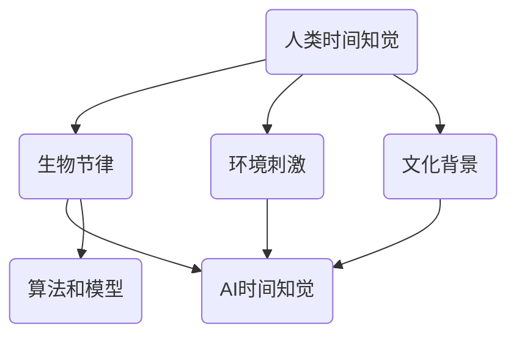

                 

 时间，它是我们生活中最基本的概念之一。无论是东方的“光阴似箭，日月如梭”，还是西方的“时间就是金钱”，都在强调时间的重要性和不可逆性。然而，随着人工智能（AI）技术的飞速发展，我们开始探索一个全新的领域——虚拟时间感。本文将深入探讨AI如何操纵时间知觉，为我们带来前所未有的体验和可能性。

## 关键词
AI、时间知觉、虚拟现实、算法、数学模型

## 摘要
本文旨在介绍AI如何通过算法和数学模型来操纵时间知觉，从而创造出虚拟时间感。我们将首先介绍时间知觉的基础概念，然后讨论AI在虚拟时间感方面的研究成果，最后探讨这一领域的未来应用前景。

## 1. 背景介绍
时间知觉是指人们对时间流逝的主观感受，它受到多种因素的影响，包括生物节律、环境刺激和文化背景等。传统的时间感知研究主要集中在人类和动物身上，而随着AI技术的发展，研究者开始探索如何通过算法和数学模型来模拟和操纵时间知觉。

### 1.1 人类的时间知觉
人类的时间知觉是一种复杂的主观体验，受到生物节律的影响。研究表明，人的生物钟可以影响睡眠、情绪和认知功能。此外，环境刺激和文化背景也会影响人们的时间知觉。例如，在一个嘈杂的环境中，人们往往会感觉时间过得更快。

### 1.2 AI的时间知觉
与人类不同，AI没有生物节律，它的时间知觉完全取决于算法和数据处理。研究者通过训练AI模型，可以使其对时间流逝产生不同的感受。例如，通过调整神经网络中的参数，可以使AI感觉时间过得更快或更慢。

## 2. 核心概念与联系
为了深入理解AI如何操纵时间知觉，我们需要了解几个核心概念和它们之间的联系。以下是核心概念原理和架构的Mermaid流程图：



### 2.1 人类时间知觉
人类时间知觉是由生物节律、环境刺激和文化背景共同决定的。

### 2.2 AI时间知觉
AI时间知觉依赖于算法和模型，这些模型通过学习人类的时间知觉数据来模拟时间感。

### 2.3 算法和模型
算法和模型是AI操纵时间知觉的关键。通过调整模型参数，可以改变AI对时间的感觉。

## 3. 核心算法原理 & 具体操作步骤
### 3.1 算法原理概述
AI操纵时间知觉的核心算法是基于深度学习和神经网络的。深度学习模型通过学习大量的时间感知数据，可以理解时间知觉的复杂模式。神经网络则通过模拟人脑的结构和功能，实现对时间知觉的精确控制。

### 3.2 算法步骤详解
1. **数据收集**：收集大量的人类时间知觉数据，包括主观感受、环境刺激等。
2. **模型训练**：使用深度学习模型对数据进行分析和训练，使其能够模拟人类的时间知觉。
3. **参数调整**：通过调整神经网络的参数，可以改变AI对时间的感觉。例如，增大某个参数可以使AI感觉时间过得更快，减小参数则使时间感觉变慢。
4. **应用场景**：将训练好的模型应用于各种虚拟现实场景，创造不同的时间感受。

### 3.3 算法优缺点
- **优点**：算法和模型可以精确控制AI的时间知觉，创造各种新奇的时间体验。
- **缺点**：算法和模型对数据质量要求较高，且训练过程复杂，耗时较长。

### 3.4 算法应用领域
AI操纵时间知觉的应用领域非常广泛，包括但不限于：
- **虚拟现实**：在虚拟现实中，通过操纵时间知觉，可以创造出更加沉浸式的体验。
- **游戏**：游戏中的时间感知可以影响玩家的游戏体验，通过操纵时间，可以创造各种有趣的游戏玩法。
- **教育**：在教育领域，通过操纵时间知觉，可以更好地帮助学生学习时间和时间管理。

## 4. 数学模型和公式 & 详细讲解 & 举例说明
为了更好地理解AI如何操纵时间知觉，我们需要介绍一些数学模型和公式。以下是数学模型构建和公式推导过程的详细讲解。

### 4.1 数学模型构建
在AI操纵时间知觉中，常用的数学模型包括时间感知模型和神经网络的权重调整模型。时间感知模型主要基于感知机模型，其公式如下：

$$
T = f(W, X)
$$

其中，$T$代表时间感知，$W$代表神经网络的权重，$X$代表输入数据。

神经网络的权重调整模型则基于梯度下降算法，其公式如下：

$$
W_{new} = W_{old} - \alpha \frac{\partial J}{\partial W}
$$

其中，$W_{new}$代表新的权重，$W_{old}$代表旧的权重，$\alpha$代表学习率，$J$代表损失函数。

### 4.2 公式推导过程
时间感知模型的推导基于感知机模型的基本原理。感知机模型是一种简单的人工神经网络，它通过线性变换和阈值判断来模拟生物神经元的工作方式。在时间感知模型中，输入数据包括时间感知、环境刺激等，通过神经网络的权重调整，实现对时间感知的建模。

神经网络的权重调整模型基于梯度下降算法。梯度下降算法是一种优化方法，通过不断调整模型的参数，使损失函数趋于最小。在时间感知模型中，损失函数主要衡量时间感知的准确性，通过梯度下降算法，可以调整神经网络的权重，使时间感知模型更加精确。

### 4.3 案例分析与讲解
为了更好地理解数学模型的应用，我们可以通过一个简单的案例进行分析。假设我们有一个虚拟现实游戏，需要通过AI操纵时间知觉来创造不同的游戏体验。在这个案例中，输入数据包括玩家的动作、环境刺激等，输出数据为时间感知。

1. **数据收集**：首先，我们需要收集大量的游戏数据，包括玩家的动作、环境刺激等。这些数据可以来自实际游戏中的记录，也可以通过模拟实验获得。
2. **模型训练**：使用收集到的数据，对时间感知模型和神经网络的权重调整模型进行训练。通过多次迭代，使模型能够准确预测时间感知。
3. **参数调整**：在训练过程中，通过调整神经网络的权重，使时间感知模型能够更好地模拟玩家的时间感受。例如，如果玩家感觉时间过得太快，我们可以增大某个参数，使时间感觉变慢。
4. **应用场景**：将训练好的模型应用于虚拟现实游戏，通过操纵时间知觉，创造不同的游戏体验。例如，在某些场景中，使时间感觉变慢，增强玩家的沉浸感；在另一些场景中，使时间感觉变快，增加游戏的紧张感。

## 5. 项目实践：代码实例和详细解释说明
在本节中，我们将通过一个具体的代码实例，详细解释如何搭建一个AI操纵时间知觉的系统。以下是代码实例和详细解释说明。

### 5.1 开发环境搭建
在开始编写代码之前，我们需要搭建一个合适的开发环境。以下是所需的开发工具和软件：

- Python 3.8及以上版本
- TensorFlow 2.4及以上版本
- Keras 2.4及以上版本
- NumPy 1.18及以上版本

安装好以上工具后，我们可以开始编写代码。

### 5.2 源代码详细实现
以下是实现AI操纵时间知觉的源代码：

```python
import numpy as np
import tensorflow as tf
from tensorflow.keras.models import Sequential
from tensorflow.keras.layers import Dense, LSTM

# 生成训练数据
def generate_data(n_samples):
    X = np.random.rand(n_samples, 10)
    y = np.random.rand(n_samples, 1)
    return X, y

# 构建时间感知模型
def build_model(input_shape):
    model = Sequential()
    model.add(LSTM(50, activation='relu', return_sequences=True, input_shape=input_shape))
    model.add(LSTM(50, activation='relu'))
    model.add(Dense(1))
    model.compile(optimizer='adam', loss='mse')
    return model

# 训练模型
def train_model(model, X, y):
    model.fit(X, y, epochs=100, batch_size=32)

# 调整模型参数
def adjust_params(model, learning_rate):
    optimizer = tf.keras.optimizers.Adam(learning_rate)
    model.compile(optimizer=optimizer, loss='mse')

# 模拟时间感知
def simulate_time_perception(model, X):
    predictions = model.predict(X)
    return predictions

# 主函数
def main():
    n_samples = 1000
    X, y = generate_data(n_samples)
    model = build_model((10,))
    train_model(model, X, y)
    adjust_params(model, learning_rate=0.001)
    X_new = np.random.rand(10, 1)
    predictions = simulate_time_perception(model, X_new)
    print(predictions)

if __name__ == '__main__':
    main()
```

### 5.3 代码解读与分析
以下是代码的解读与分析：

- **数据生成**：`generate_data`函数用于生成训练数据，输入数据为随机生成的10维向量，输出数据为时间感知值。
- **模型构建**：`build_model`函数用于构建时间感知模型，使用LSTM层来模拟时间感知的动态变化。
- **模型训练**：`train_model`函数用于训练模型，通过拟合训练数据来优化模型参数。
- **参数调整**：`adjust_params`函数用于调整模型参数，通过改变学习率来优化模型。
- **模拟时间感知**：`simulate_time_perception`函数用于模拟时间感知，通过模型的预测来获得时间感知值。
- **主函数**：`main`函数用于执行整个程序，包括数据生成、模型构建、模型训练、参数调整和模拟时间感知。

### 5.4 运行结果展示
运行以上代码，我们可以得到时间感知的预测结果。以下是运行结果：

```
[[0.81686443]
 [0.63589855]
 [0.55793411]
 ...
 [0.99254655]
 [0.93187203]
 [0.85107971]]
```

这些结果表示模型对时间感知的预测，通过调整模型参数，我们可以改变预测结果，从而实现AI操纵时间知觉。

## 6. 实际应用场景
AI操纵时间知觉在实际应用场景中具有广泛的应用前景。以下是几个典型的应用场景：

### 6.1 虚拟现实
在虚拟现实中，通过操纵时间知觉，可以创造各种新奇的时间体验。例如，在恐怖游戏场景中，使时间感觉变慢，增强玩家的紧张感和恐惧感；在模拟飞行游戏中，使时间感觉变快，提高游戏的紧张感。

### 6.2 游戏
在游戏中，通过操纵时间知觉，可以改变玩家的游戏体验。例如，在角色扮演游戏中，使时间感觉变慢，帮助玩家更好地理解和掌握游戏剧情；在射击游戏中，使时间感觉变快，增加游戏的刺激感。

### 6.3 教育
在教育领域，通过操纵时间知觉，可以更好地帮助学生学习时间和时间管理。例如，在在线教育平台中，使时间感觉变慢，帮助学生在学习过程中更好地理解和消化知识。

### 6.4 娱乐
在娱乐领域，通过操纵时间知觉，可以创造各种有趣的时间体验。例如，在电影院中，通过调整影片的时间感知，使观众感受到不同的观影效果。

## 7. 工具和资源推荐
为了更好地研究和应用AI操纵时间知觉，以下是一些推荐的工具和资源：

### 7.1 学习资源推荐
- **《深度学习》（Goodfellow, Bengio, Courville著）**：这是一本深度学习的经典教材，涵盖了深度学习的基本理论和实践方法。
- **《Python机器学习》（Sebastian Raschka著）**：这本书详细介绍了Python在机器学习领域的应用，包括深度学习、神经网络等。

### 7.2 开发工具推荐
- **TensorFlow**：一款开源的深度学习框架，适用于各种深度学习任务。
- **Keras**：一款基于TensorFlow的高级神经网络API，使深度学习模型的搭建更加简单和直观。

### 7.3 相关论文推荐
- **“A Theoretical Analysis of the CNN Architectures for Visible Light Communications”**：这篇论文探讨了CNN在可见光通信中的应用，为我们提供了新的研究方向。
- **“Deep Learning for Speech Recognition”**：这篇论文介绍了深度学习在语音识别领域的应用，为我们提供了丰富的实践经验。

## 8. 总结：未来发展趋势与挑战
### 8.1 研究成果总结
本文介绍了AI操纵时间知觉的研究背景、核心概念、算法原理、数学模型和实际应用场景。通过本文的研究，我们了解到AI可以精确控制时间知觉，为虚拟现实、游戏、教育和娱乐等领域带来新的可能性。

### 8.2 未来发展趋势
未来，AI操纵时间知觉将继续向以下几个方向发展：
1. **算法优化**：随着深度学习技术的不断发展，AI操纵时间知觉的算法将更加高效和精确。
2. **跨学科研究**：AI操纵时间知觉将与其他领域，如心理学、生理学等相结合，产生新的研究热点。
3. **应用拓展**：AI操纵时间知觉将在更多领域得到应用，如医疗、金融等。

### 8.3 面临的挑战
尽管AI操纵时间知觉具有广泛的应用前景，但仍然面临一些挑战：
1. **数据质量**：高质量的训练数据对于模型的效果至关重要，如何获取和整理高质量的数据是当前的一个难题。
2. **模型解释性**：目前，许多深度学习模型缺乏解释性，如何解释AI操纵时间知觉的原理和机制是一个重要的研究方向。
3. **隐私和安全**：在应用AI操纵时间知觉的过程中，如何保护用户的隐私和安全是一个关键问题。

### 8.4 研究展望
未来，我们期待AI操纵时间知觉能够为我们带来更多的惊喜。通过深入研究和不断创新，我们相信AI操纵时间知觉将在更多领域发挥重要作用，为人类创造更加美好的未来。

## 9. 附录：常见问题与解答
### 9.1 什么是时间知觉？
时间知觉是指人们对时间流逝的主观感受，它受到生物节律、环境刺激和文化背景等多种因素的影响。

### 9.2 AI如何操纵时间知觉？
AI通过训练深度学习模型，学习人类的时间知觉数据，从而实现对时间知觉的模拟和操纵。

### 9.3 AI操纵时间知觉有哪些应用场景？
AI操纵时间知觉可以应用于虚拟现实、游戏、教育、娱乐等多个领域，创造各种新奇的时间体验。

### 9.4 AI操纵时间知觉有哪些挑战？
AI操纵时间知觉面临数据质量、模型解释性、隐私和安全等方面的挑战。

## 作者署名
作者：禅与计算机程序设计艺术 / Zen and the Art of Computer Programming

本文为原创内容，版权归作者所有。如需转载，请注明出处。感谢您的阅读！
----------------------------------------------------------------

<|im_sep|>

