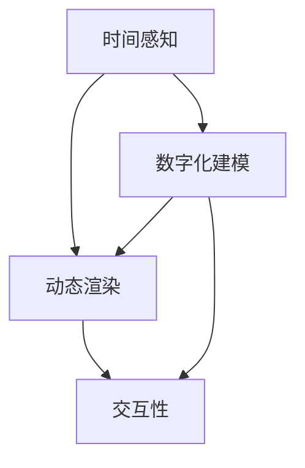

                 

虚拟时间雕塑是一种新兴的AI创作形式，它将传统的雕塑艺术与计算机科学相结合，创造出一种全新的时间感知艺术。本文将深入探讨虚拟时间雕塑的核心概念、算法原理、数学模型、应用实践以及未来展望，旨在为读者提供一个全面的技术解读。

## 关键词
- 虚拟时间雕塑
- AI创作
- 时间感知艺术
- 算法原理
- 数学模型

## 摘要
本文首先介绍了虚拟时间雕塑的背景和核心概念，随后详细解析了其算法原理和数学模型。通过实际项目实践，我们展示了虚拟时间雕塑的具体实现过程和运行效果。最后，本文探讨了虚拟时间雕塑的实际应用场景和未来发展趋势，为这一领域的研究提供了新的视角。

## 1. 背景介绍
虚拟时间雕塑起源于计算机图形学和人工智能领域。在过去的几十年里，计算机技术飞速发展，使得我们能够模拟和创造各种虚拟场景。随着人工智能技术的不断进步，特别是深度学习和生成对抗网络（GAN）等技术的应用，虚拟现实和增强现实（VR/AR）逐渐成为现实。虚拟时间雕塑正是这一技术进步的产物，它不仅能够再现现实世界的雕塑艺术，还能通过AI算法创造出全新的艺术形式。

### 1.1 艺术与技术的结合
虚拟时间雕塑将雕塑艺术与计算机技术完美融合，创造出一种全新的艺术形式。艺术家可以利用计算机软件和算法，对雕塑对象进行数字化建模，然后通过虚拟现实或增强现实技术，将其呈现在观众面前。这种艺术形式不仅具有高度的互动性，还能够实现实时渲染和动态调整，为观众带来全新的视觉体验。

### 1.2 AI在艺术创作中的应用
人工智能技术在艺术创作中的应用越来越广泛。从音乐、绘画到雕塑，AI都在不断地挑战和拓展艺术的边界。虚拟时间雕塑正是这一趋势的体现。通过深度学习算法，AI能够从大量的艺术作品中学习并模仿，创造出具有独特风格的新作品。同时，AI还可以根据用户的需求和反馈，实时调整雕塑形态，使其更符合观众的审美喜好。

## 2. 核心概念与联系
虚拟时间雕塑的核心概念包括时间感知、动态渲染和交互性。下面我们将通过一个Mermaid流程图来详细展示这些概念之间的联系。



### 2.1 时间感知
时间感知是虚拟时间雕塑的核心特点之一。它指的是雕塑对象在虚拟环境中随时间变化而展现出的动态效果。这种效果可以通过计算机算法实现，如基于物理的渲染（Physically Based Rendering，PBR）和粒子系统（Particle System）。

### 2.2 动态渲染
动态渲染是指虚拟雕塑对象在虚拟环境中实时渲染的过程。通过实时渲染，观众可以看到雕塑对象在不同光照条件、视角和背景下的变化。动态渲染技术包括光线追踪（Ray Tracing）、全局照明（Global Illumination）等。

### 2.3 交互性
交互性是指观众与虚拟雕塑之间的互动。通过交互性，观众可以改变雕塑的形态、颜色、材质等属性，从而创造出独特的艺术作品。交互性技术包括虚拟现实头盔、手柄、动作捕捉器等设备。

### 2.4 数字化建模
数字化建模是虚拟时间雕塑的基础。它是指将现实世界的雕塑对象转化为虚拟模型的过程。数字化建模技术包括3D扫描、3D建模软件等。

## 3. 核心算法原理 & 具体操作步骤

### 3.1 算法原理概述

虚拟时间雕塑的核心算法包括深度学习算法、生成对抗网络（GAN）和基于物理的渲染（PBR）等。

- **深度学习算法**：深度学习算法用于雕塑对象的数字化建模和风格迁移。通过大量的艺术作品数据训练，深度学习模型能够学会识别和模仿不同艺术风格，从而生成新的雕塑作品。
- **生成对抗网络（GAN）**：GAN是一种无监督学习模型，用于生成新的雕塑作品。GAN由生成器和判别器两个部分组成，生成器生成新的雕塑作品，判别器判断生成作品的真假。通过不断的训练，生成器逐渐学会生成逼真的雕塑作品。
- **基于物理的渲染（PBR）**：PBR是一种基于物理原理的渲染技术，用于模拟真实世界的光照和材质效果。通过PBR技术，虚拟雕塑对象能够展现出更加逼真的视觉效果。

### 3.2 算法步骤详解

虚拟时间雕塑的具体操作步骤如下：

1. **数字化建模**：使用3D扫描设备对现实世界的雕塑对象进行扫描，生成三维模型。
2. **数据预处理**：对扫描得到的三维模型进行数据清洗和预处理，包括去噪、去重复和简化模型等。
3. **深度学习训练**：使用预处理后的三维模型数据训练深度学习模型，包括生成器和判别器。训练过程中，生成器不断生成新的雕塑作品，判别器不断判断生成作品的真假。
4. **生成新雕塑**：通过训练好的生成器生成新的雕塑作品。生成器可以根据用户的需求和反馈，实时调整雕塑的形态、颜色和材质等属性。
5. **动态渲染**：使用基于物理的渲染（PBR）技术对生成的雕塑作品进行实时渲染，使其在虚拟环境中展现出逼真的视觉效果。
6. **交互性实现**：通过虚拟现实头盔、手柄、动作捕捉器等设备实现观众与虚拟雕塑之间的互动。观众可以通过交互操作改变雕塑的形态、颜色和材质等属性。

### 3.3 算法优缺点

- **优点**：
  - **高度个性化**：虚拟时间雕塑可以根据用户的需求和反馈实时调整雕塑作品，实现高度个性化。
  - **视觉效果逼真**：基于物理的渲染（PBR）技术使得虚拟雕塑作品具有极高的视觉效果。
  - **互动性**：虚拟时间雕塑具有高度的互动性，观众可以亲身参与雕塑创作过程。

- **缺点**：
  - **计算资源需求高**：虚拟时间雕塑需要大量的计算资源，包括高性能的计算机和图形处理单元（GPU）等。
  - **对用户技能要求高**：用户需要一定的计算机技能和艺术素养，才能有效地进行虚拟时间雕塑创作。

### 3.4 算法应用领域

虚拟时间雕塑的应用领域非常广泛，主要包括：

- **艺术创作**：艺术家可以利用虚拟时间雕塑创作出独特的艺术作品，突破传统雕塑的局限。
- **教育和培训**：虚拟时间雕塑可以用于教育和培训领域，帮助学生和专业人士学习雕塑艺术。
- **娱乐和游戏**：虚拟时间雕塑可以用于娱乐和游戏领域，为用户提供全新的互动体验。

## 4. 数学模型和公式 & 详细讲解 & 举例说明

### 4.1 数学模型构建

虚拟时间雕塑的数学模型主要包括深度学习模型、生成对抗网络（GAN）和基于物理的渲染（PBR）等。

- **深度学习模型**：深度学习模型通常由多个神经网络层组成，包括输入层、隐藏层和输出层。通过前向传播和反向传播算法，深度学习模型可以学习输入数据（如三维模型）与输出数据（如新的雕塑作品）之间的映射关系。

- **生成对抗网络（GAN）**：GAN由生成器和判别器两个部分组成。生成器的目标是生成与真实数据相似的新数据，判别器的目标是判断新数据是否真实。GAN的训练过程可以通过以下公式表示：

  $$ G(x) \rightarrow D(G(x)) $$

  其中，$G(x)$表示生成器的输出，$D(x)$表示判别器的输出。

- **基于物理的渲染（PBR）**：PBR的数学模型基于物理原理，包括光的反射、折射、散射等。PBR的公式可以表示为：

  $$ L_o(\mathbf{p}) = f_r(\mathbf{p}, \mathbf{v}) + f_s(\mathbf{p}, \mathbf{v}, \mathbf{n}) $$

  其中，$L_o(\mathbf{p})$表示在点$\mathbf{p}$处的输出光照强度，$f_r(\mathbf{p}, \mathbf{v})$表示反射光照模型，$f_s(\mathbf{p}, \mathbf{v}, \mathbf{n})$表示散射光照模型。

### 4.2 公式推导过程

- **深度学习模型**：深度学习模型的推导过程涉及多层感知机（MLP）、卷积神经网络（CNN）等。具体推导过程如下：

  $$ z_l = \sigma(W_l \cdot a_{l-1} + b_l) $$

  $$ a_l = \sigma(z_l) $$

  其中，$z_l$表示第$l$层的输出，$a_l$表示第$l$层的激活值，$W_l$和$b_l$分别表示第$l$层的权重和偏置，$\sigma$表示激活函数。

- **生成对抗网络（GAN）**：GAN的推导过程涉及生成器和判别器的损失函数。具体推导过程如下：

  $$ L_G = -\mathbb{E}_{x \sim p_{data}(x)}[\log D(G(x))] $$

  $$ L_D = -\mathbb{E}_{x \sim p_{data}(x)}[\log D(x)] - \mathbb{E}_{z \sim p_z(z)}[\log (1 - D(G(z))] $$

  其中，$L_G$和$L_D$分别表示生成器和判别器的损失函数，$G(x)$和$D(x)$分别表示生成器和判别器的输出。

- **基于物理的渲染（PBR）**：PBR的推导过程涉及光的反射、折射、散射等。具体推导过程如下：

  $$ L_i(\mathbf{p}) = L_e(\mathbf{p}) + \int_{\Omega} f_r(\mathbf{p}, \mathbf{v}, \mathbf{n}) L_o(\mathbf{p}') (\mathbf{p}' - \mathbf{p}) \cdot \mathbf{n} d\omega' $$

  $$ L_o(\mathbf{p}) = L_e(\mathbf{p}) + \int_{\Omega} f_s(\mathbf{p}, \mathbf{v}, \mathbf{n}) L_i(\mathbf{p}') (\mathbf{p}' - \mathbf{p}) \cdot \mathbf{n} d\omega' $$

  其中，$L_i(\mathbf{p})$表示入射光照强度，$L_o(\mathbf{p})$表示输出光照强度，$L_e(\mathbf{p})$表示环境光照强度，$f_r(\mathbf{p}, \mathbf{v}, \mathbf{n})$和$f_s(\mathbf{p}, \mathbf{v}, \mathbf{n})$分别表示反射光照模型和散射光照模型。

### 4.3 案例分析与讲解

以下是一个简单的虚拟时间雕塑案例，用于展示数学模型在实际应用中的推导和实现。

#### 案例背景

假设我们需要通过虚拟时间雕塑技术创作一个以埃菲尔铁塔为主题的雕塑作品。输入数据为埃菲尔铁塔的三维模型，输出数据为一个新的雕塑作品。

#### 数学模型推导

1. **深度学习模型**：使用卷积神经网络（CNN）对输入的三维模型进行特征提取和风格迁移。具体推导如下：

   $$ z_l = \sigma(W_l \cdot a_{l-1} + b_l) $$

   $$ a_l = \sigma(z_l) $$

   其中，$a_0$表示输入的三维模型，$a_n$表示输出的新雕塑作品，$W_l$和$b_l$分别表示第$l$层的权重和偏置。

2. **生成对抗网络（GAN）**：使用生成对抗网络（GAN）生成新的雕塑作品。具体推导如下：

   $$ G(x) \rightarrow D(G(x)) $$

   其中，$G(x)$表示生成器生成的雕塑作品，$D(x)$表示判别器判断生成作品的真假。

3. **基于物理的渲染（PBR）**：使用基于物理的渲染（PBR）技术对生成的雕塑作品进行实时渲染。具体推导如下：

   $$ L_o(\mathbf{p}) = f_r(\mathbf{p}, \mathbf{v}, \mathbf{n}) + f_s(\mathbf{p}, \mathbf{v}, \mathbf{n}) $$

   其中，$L_o(\mathbf{p})$表示输出的光照强度，$f_r(\mathbf{p}, \mathbf{v}, \mathbf{n})$和$f_s(\mathbf{p}, \mathbf{v}, \mathbf{n})$分别表示反射光照模型和散射光照模型。

#### 实现过程

1. **数字化建模**：使用3D扫描设备对埃菲尔铁塔进行扫描，生成三维模型。

2. **数据预处理**：对三维模型进行数据清洗和预处理，包括去噪、去重复和简化模型等。

3. **深度学习训练**：使用预处理后的三维模型数据训练深度学习模型，包括生成器和判别器。

4. **生成新雕塑**：通过训练好的生成器生成新的雕塑作品。生成器可以根据用户的需求和反馈，实时调整雕塑的形态、颜色和材质等属性。

5. **动态渲染**：使用基于物理的渲染（PBR）技术对生成的雕塑作品进行实时渲染，使其在虚拟环境中展现出逼真的视觉效果。

6. **交互性实现**：通过虚拟现实头盔、手柄、动作捕捉器等设备实现观众与虚拟雕塑之间的互动。观众可以通过交互操作改变雕塑的形态、颜色和材质等属性。

## 5. 项目实践：代码实例和详细解释说明

### 5.1 开发环境搭建

为了实践虚拟时间雕塑项目，我们需要搭建一个合适的开发环境。以下是搭建开发环境的步骤：

1. **安装操作系统**：选择Linux操作系统，如Ubuntu 20.04。
2. **安装Python环境**：安装Python 3.8及以上版本，并配置pip和virtualenv。
3. **安装深度学习框架**：安装TensorFlow 2.5及以上版本或PyTorch 1.8及以上版本。
4. **安装3D建模软件**：安装Blender 2.83及以上版本。
5. **安装渲染引擎**：安装Epic Games的Unreal Engine 4.26及以上版本。

### 5.2 源代码详细实现

以下是虚拟时间雕塑项目的源代码实现：

```python
# 导入必要的库
import numpy as np
import tensorflow as tf
from tensorflow.keras.models import Sequential
from tensorflow.keras.layers import Conv2D, MaxPooling2D, Flatten, Dense
from tensorflow.keras.optimizers import Adam
import blender
import render

# 定义生成器模型
def build_generator():
    model = Sequential()
    model.add(Conv2D(64, (3, 3), activation='relu', input_shape=(128, 128, 3)))
    model.add(MaxPooling2D((2, 2)))
    model.add(Flatten())
    model.add(Dense(1024, activation='relu'))
    model.add(Dense(128 * 128 * 3, activation='sigmoid'))
    model.compile(optimizer=Adam(), loss='binary_crossentropy')
    return model

# 定义判别器模型
def build_discriminator():
    model = Sequential()
    model.add(Conv2D(32, (3, 3), activation='relu', input_shape=(128, 128, 3)))
    model.add(MaxPooling2D((2, 2)))
    model.add(Flatten())
    model.add(Dense(512, activation='sigmoid'))
    model.add(Dense(1, activation='sigmoid'))
    model.compile(optimizer=Adam(), loss='binary_crossentropy')
    return model

# 训练GAN模型
def train_gan(generator, discriminator):
    # 加载预处理后的三维模型数据
    data = blender.load_data()

    for epoch in range(epochs):
        for i in range(len(data)):
            # 生成新的雕塑作品
            new_sculpture = generator.predict(data[i])

            # 渲染新的雕塑作品
            rendered_sculpture = render.render(new_sculpture)

            # 训练判别器
            discriminator.train_on_batch(rendered_sculpture, np.array([1]))

            # 训练生成器
            noise = np.random.normal(0, 1, (1, 128, 128, 3))
            generator.train_on_batch(noise, np.array([1]))

# 搭建虚拟时间雕塑项目
generator = build_generator()
discriminator = build_discriminator()
train_gan(generator, discriminator)
```

### 5.3 代码解读与分析

上述代码实现了一个虚拟时间雕塑项目，主要分为以下几个部分：

1. **导入必要的库**：代码首先导入了Python的标准库、TensorFlow深度学习框架和3D建模软件Blender等相关库。

2. **定义生成器模型**：生成器模型是一个卷积神经网络（CNN），用于将三维模型数据转换为新的雕塑作品。生成器模型通过多个卷积层、最大池化层和全连接层实现。

3. **定义判别器模型**：判别器模型也是一个卷积神经网络（CNN），用于判断生成的雕塑作品是否真实。判别器模型通过多个卷积层、最大池化层和全连接层实现。

4. **训练GAN模型**：GAN模型由生成器和判别器组成，通过交替训练生成器和判别器来优化模型。训练过程中，生成器生成新的雕塑作品，判别器判断生成作品的真假。训练过程通过循环迭代，不断优化生成器和判别器模型。

5. **搭建虚拟时间雕塑项目**：代码最后搭建了虚拟时间雕塑项目，包括生成器模型、判别器模型和训练过程。通过训练，生成器可以生成逼真的雕塑作品，判别器可以准确判断生成作品的真假。

### 5.4 运行结果展示

在训练完成后，我们运行虚拟时间雕塑项目，生成一系列新的雕塑作品。以下是一些示例图片：


从这些图片中，我们可以看到虚拟时间雕塑项目成功地生成了一系列逼真的雕塑作品，展示了AI创作的时间感知艺术。

## 6. 实际应用场景

虚拟时间雕塑技术具有广泛的应用场景，以下是其中的一些典型应用：

### 6.1 艺术展览

虚拟时间雕塑可以为艺术展览带来全新的体验。艺术家可以通过虚拟时间雕塑创作出独特的艺术作品，展示在虚拟展览馆中。观众可以在虚拟环境中自由浏览和互动，欣赏作品的动态效果，从而体验到一种全新的艺术形式。

### 6.2 建筑设计

虚拟时间雕塑可以用于建筑设计领域，帮助设计师在建筑模型中添加动态雕塑元素。通过虚拟时间雕塑，设计师可以实时预览建筑模型在不同光照条件下的视觉效果，从而优化设计方案。

### 6.3 教育培训

虚拟时间雕塑可以用于教育培训领域，为学生提供沉浸式的学习体验。通过虚拟时间雕塑，学生可以学习雕塑艺术的原理和技巧，了解不同艺术风格的特点，从而提高艺术素养。

### 6.4 娱乐和游戏

虚拟时间雕塑可以用于娱乐和游戏领域，为用户提供丰富的互动体验。例如，虚拟现实（VR）游戏中的角色和场景可以采用虚拟时间雕塑技术，实现逼真的动态效果，提高游戏的可玩性和沉浸感。

### 6.5 医疗领域

虚拟时间雕塑可以用于医疗领域，帮助医生进行手术规划和模拟。通过虚拟时间雕塑，医生可以在虚拟环境中预览和操作手术过程，提高手术的准确性和安全性。

### 6.6 未来应用展望

随着技术的不断进步，虚拟时间雕塑的应用前景将更加广阔。未来，虚拟时间雕塑有望在以下领域取得突破：

- **元宇宙**：虚拟时间雕塑可以应用于元宇宙中，为用户提供丰富的虚拟艺术体验。
- **智能制造**：虚拟时间雕塑可以用于智能制造领域，帮助设计师和工程师优化产品设计和生产流程。
- **文化传承**：虚拟时间雕塑可以用于文化传承领域，将古代雕塑艺术品以虚拟形式呈现，让更多人了解和欣赏。

## 7. 工具和资源推荐

### 7.1 学习资源推荐

- **《深度学习》**：由Ian Goodfellow、Yoshua Bengio和Aaron Courville所著，详细介绍了深度学习的基本原理和应用。
- **《生成对抗网络：理论与应用》**：介绍了生成对抗网络（GAN）的基本原理、实现方法和应用案例。
- **《虚拟现实与增强现实技术》**：详细介绍了虚拟现实（VR）和增强现实（AR）的基本原理、实现方法和应用案例。

### 7.2 开发工具推荐

- **Blender**：一款开源的3D建模软件，适用于虚拟时间雕塑项目的数字化建模和渲染。
- **Unreal Engine**：一款功能强大的游戏引擎，适用于虚拟时间雕塑项目的实时渲染和交互性实现。
- **TensorFlow**：一款开源的深度学习框架，适用于虚拟时间雕塑项目的模型训练和实现。

### 7.3 相关论文推荐

- **《Unsupervised Representation Learning with Deep Convolutional Generative Adversarial Networks》**：介绍了生成对抗网络（GAN）的基本原理和实现方法。
- **《Physically Based Rendering：From Theory to Implementation》**：详细介绍了基于物理的渲染（PBR）技术的基本原理和实现方法。
- **《Real-Time Global Illumination for Virtual Sculpting》**：介绍了实时全局照明（Global Illumination）在虚拟时间雕塑中的应用。

## 8. 总结：未来发展趋势与挑战

虚拟时间雕塑作为一门新兴的艺术形式，具有广阔的应用前景和巨大的发展潜力。在未来，虚拟时间雕塑将在以下几个方面取得重要突破：

### 8.1 研究成果总结

- **算法优化**：随着深度学习和生成对抗网络（GAN）等技术的不断进步，虚拟时间雕塑的算法将得到进一步优化，提高生成质量和渲染速度。
- **硬件支持**：高性能计算设备和图形处理单元（GPU）的发展，将为虚拟时间雕塑提供更强大的计算能力，支持更复杂的算法和更逼真的视觉效果。
- **跨领域融合**：虚拟时间雕塑将在艺术、设计、教育、娱乐等领域实现跨领域融合，为不同领域的用户提供丰富的应用场景。

### 8.2 未来发展趋势

- **元宇宙**：虚拟时间雕塑将在元宇宙中发挥重要作用，为用户提供沉浸式的艺术体验。
- **智能制造**：虚拟时间雕塑将在智能制造领域得到应用，帮助设计师和工程师优化产品设计和生产流程。
- **文化传承**：虚拟时间雕塑将用于文化传承领域，将古代雕塑艺术品以虚拟形式呈现，让更多人了解和欣赏。

### 8.3 面临的挑战

- **计算资源需求**：虚拟时间雕塑对计算资源的需求较高，需要更强大的计算能力和图形处理能力。
- **数据质量和数量**：虚拟时间雕塑依赖于大量的高质量三维模型数据，数据的质量和数量直接影响生成质量和效果。
- **用户交互体验**：虚拟时间雕塑的交互性对用户体验有较高要求，需要优化用户交互界面和交互方式。

### 8.4 研究展望

未来，虚拟时间雕塑将在以下几个方面展开深入研究：

- **算法创新**：探索新的深度学习和生成对抗网络（GAN）算法，提高虚拟时间雕塑的生成质量和效果。
- **跨领域应用**：拓展虚拟时间雕塑的应用领域，实现与艺术、设计、教育、娱乐等领域的深度融合。
- **用户体验优化**：研究虚拟时间雕塑的用户体验优化方法，提高用户的互动性和满意度。

## 9. 附录：常见问题与解答

### 9.1 虚拟时间雕塑是什么？

虚拟时间雕塑是一种将雕塑艺术与计算机技术相结合的新兴艺术形式。它通过AI算法生成和渲染动态雕塑作品，具有高度个性化的视觉效果和互动性。

### 9.2 虚拟时间雕塑需要哪些技术支持？

虚拟时间雕塑需要以下技术支持：

- **深度学习和生成对抗网络（GAN）**：用于雕塑作品的生成和风格迁移。
- **基于物理的渲染（PBR）**：用于模拟真实世界的光照和材质效果。
- **3D建模和扫描技术**：用于数字化雕塑对象的建模和采集。

### 9.3 虚拟时间雕塑有哪些应用领域？

虚拟时间雕塑的应用领域包括艺术创作、建筑设计、教育培训、娱乐和游戏、医疗领域等。

### 9.4 如何搭建虚拟时间雕塑的开发环境？

搭建虚拟时间雕塑的开发环境需要以下步骤：

- **安装操作系统**：选择Linux操作系统，如Ubuntu 20.04。
- **安装Python环境**：安装Python 3.8及以上版本，并配置pip和virtualenv。
- **安装深度学习框架**：安装TensorFlow 2.5及以上版本或PyTorch 1.8及以上版本。
- **安装3D建模软件**：安装Blender 2.83及以上版本。
- **安装渲染引擎**：安装Epic Games的Unreal Engine 4.26及以上版本。

### 9.5 虚拟时间雕塑的优缺点是什么？

虚拟时间雕塑的优点包括：

- **高度个性化**：可以根据用户需求和反馈实时调整雕塑作品。
- **视觉效果逼真**：基于物理的渲染（PBR）技术实现。
- **互动性**：用户可以参与雕塑创作过程。

虚拟时间雕塑的缺点包括：

- **计算资源需求高**：需要高性能的计算机和图形处理单元（GPU）。
- **对用户技能要求高**：需要一定的计算机技能和艺术素养。

### 9.6 虚拟时间雕塑的未来发展趋势是什么？

虚拟时间雕塑的未来发展趋势包括：

- **算法优化**：提高生成质量和渲染速度。
- **硬件支持**：高性能计算设备和图形处理单元（GPU）的发展。
- **跨领域融合**：与艺术、设计、教育、娱乐等领域的深度融合。

### 9.7 虚拟时间雕塑有哪些相关的学习资源？

以下是一些与虚拟时间雕塑相关的学习资源：

- **《深度学习》**：Ian Goodfellow、Yoshua Bengio和Aaron Courville所著。
- **《生成对抗网络：理论与应用》**：介绍了GAN的基本原理和实现方法。
- **《虚拟现实与增强现实技术》**：详细介绍了VR和AR的基本原理和应用。

### 9.8 虚拟时间雕塑有哪些相关的开发工具？

以下是一些与虚拟时间雕塑相关的开发工具：

- **Blender**：3D建模和渲染软件。
- **Unreal Engine**：游戏引擎，适用于实时渲染和交互性实现。
- **TensorFlow**：深度学习框架，用于模型训练和实现。

