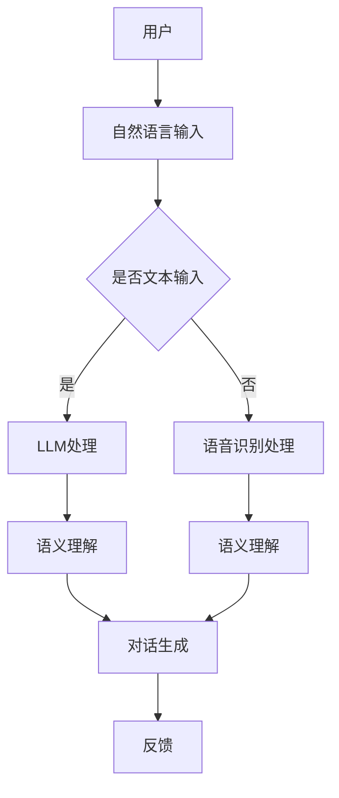

                 

虚拟现实（VR）技术的迅猛发展，为人们提供了前所未有的沉浸式体验。而大型语言模型（LLM，Large Language Model）作为自然语言处理（NLP，Natural Language Processing）领域的革命性进展，正逐渐改变着虚拟现实中的用户交互模式。本文旨在探讨LLM在虚拟现实中的应用，以及如何通过LLM增强用户的交互体验。

## 关键词

- 虚拟现实
- 大型语言模型
- 用户交互
- 自然语言处理
- 沉浸式体验

## 摘要

本文将首先介绍虚拟现实技术的基本概念及其在当前的发展状况。接着，我们将深入探讨大型语言模型的定义和功能，并分析LLM在虚拟现实中的应用场景。本文还将探讨LLM如何通过改进语音识别、语义理解和对话生成等技术，增强虚拟现实中的用户交互体验。最后，本文将对LLM在虚拟现实中的未来发展趋势和挑战进行展望。

## 1. 背景介绍

### 虚拟现实技术

虚拟现实（VR）是一种通过计算机生成模拟环境，利用传感技术和显示设备使人产生沉浸感的技术。VR技术的核心是提供一个三维的虚拟空间，用户可以通过头盔显示器、手柄等设备在这个虚拟空间中自由移动、互动。自VR技术诞生以来，其应用领域不断扩大，从最初的军事训练、医疗康复，到游戏娱乐、教育培训等多个方面。

### 虚拟现实的发展现状

近年来，随着硬件技术的不断进步和降低的硬件成本，虚拟现实技术逐渐走向大众市场。高质量的VR头盔、高性能的计算机硬件以及优化的VR内容开发工具，为虚拟现实的应用提供了坚实的基础。此外，5G技术的普及也为VR内容的传输提供了高速、稳定的网络环境。这使得虚拟现实技术不再局限于高端应用，而是逐渐渗透到人们的生活中。

### 大型语言模型

大型语言模型（LLM，Large Language Model）是一种基于深度学习的自然语言处理模型，具有强大的语言理解和生成能力。LLM通常由数以亿计的参数组成，通过对大量文本数据的学习，能够理解并生成自然语言文本。LLM的应用范围广泛，包括语音识别、机器翻译、对话系统等。

### 大型语言模型的发展现状

近年来，随着深度学习技术的不断进步，LLM的规模和性能也在不断提升。GPT-3、BERT、T5等大规模语言模型的出现，标志着自然语言处理领域进入了一个新的阶段。这些模型不仅在学术研究中取得了显著成果，还在工业界得到了广泛应用。

## 2. 核心概念与联系

### 虚拟现实与自然语言处理

虚拟现实和自然语言处理（NLP）是两个看似独立的领域，但实际上它们之间存在紧密的联系。虚拟现实为用户提供了沉浸式的交互环境，而自然语言处理则提供了人与计算机之间自然、高效沟通的桥梁。

### 虚拟现实与大型语言模型

在虚拟现实环境中，用户通过自然语言与计算机系统进行交互，这需要强大的自然语言处理能力。而大型语言模型正是这种需求的最佳解决方案。LLM能够理解和生成自然语言文本，使得虚拟现实中的用户交互更加自然、流畅。

### 虚拟现实与大型语言模型的关系

虚拟现实中的用户交互依赖于自然语言处理技术，而大型语言模型是自然语言处理技术的最新成果。因此，虚拟现实和大型语言模型之间的关系可以概括为：虚拟现实需要自然语言处理技术，而大型语言模型是当前最先进的自然语言处理技术。

### Mermaid 流程图



## 3. 核心算法原理 & 具体操作步骤

### 3.1 算法原理概述

大型语言模型（LLM）的核心原理是基于深度学习的神经网络模型，通过对大量文本数据进行训练，模型能够学习到语言的本质特征和规律。LLM通常包括编码器（Encoder）和解码器（Decoder）两个部分，编码器负责将输入文本编码成向量表示，解码器则负责生成文本输出。

### 3.2 算法步骤详解

1. **文本预处理**：输入的文本需要进行预处理，包括分词、去停用词、词性标注等操作。
2. **编码**：将预处理后的文本输入到编码器中，编码器将其编码成向量表示。
3. **解码**：根据编码器的输出，解码器生成文本输出。解码过程中，模型会根据当前生成的文本和编码器的输出，预测下一个词语的概率。
4. **迭代生成**：重复解码过程，生成完整的文本输出。

### 3.3 算法优缺点

**优点**：
- **强大的语言理解能力**：LLM能够理解自然语言的语义和上下文，生成符合语言习惯的文本。
- **高效性**：LLM能够在短时间内生成大量的文本，适用于实时交互场景。

**缺点**：
- **计算资源需求高**：大规模的LLM模型需要大量的计算资源，部署和运行成本较高。
- **数据依赖性**：LLM的训练需要大量的高质量文本数据，数据质量和数量对模型性能有很大影响。

### 3.4 算法应用领域

LLM在虚拟现实中的应用非常广泛，包括但不限于以下领域：

- **语音识别**：LLM可以用于语音识别，将用户的语音输入转换为文本。
- **语义理解**：LLM能够理解用户文本输入的语义，为虚拟现实中的对话系统提供支持。
- **对话生成**：LLM可以生成自然流畅的对话内容，为虚拟现实中的交互提供实时反馈。

## 4. 数学模型和公式 & 详细讲解 & 举例说明

### 4.1 数学模型构建

大型语言模型的核心数学模型是深度神经网络，其基本结构包括多层感知机（MLP）、卷积神经网络（CNN）和循环神经网络（RNN）等。以下是一个简单的循环神经网络（RNN）的数学模型：

$$
h_t = \sigma(W_h \cdot [h_{t-1}, x_t] + b_h)
$$

其中，$h_t$是当前时刻的隐藏状态，$x_t$是当前输入文本，$W_h$是权重矩阵，$b_h$是偏置项，$\sigma$是激活函数，通常使用sigmoid或ReLU函数。

### 4.2 公式推导过程

以循环神经网络（RNN）为例，其基本推导过程如下：

1. **输入表示**：将输入文本$x_t$编码为一个向量，记为$x_t^{\text{emb}}$。
2. **编码**：将输入向量$x_t^{\text{emb}}$和前一个隐藏状态$h_{t-1}$输入到编码器中，得到编码后的隐藏状态$c_t$。
3. **解码**：将编码后的隐藏状态$c_t$输入到解码器中，生成当前文本输出$y_t$。

具体推导如下：

$$
c_t = \text{softmax}(W_c \cdot h_t)
$$

$$
y_t = \text{softmax}(W_y \cdot c_t)
$$

其中，$W_c$和$W_y$是权重矩阵，$\text{softmax}$函数用于将隐藏状态转换为文本输出的概率分布。

### 4.3 案例分析与讲解

假设一个简单的RNN模型，输入文本为"I love virtual reality"，隐藏状态维度为10，输出维度为5。我们需要通过这个模型生成一个符合语言习惯的文本输出。

1. **输入表示**：将输入文本"I love virtual reality"编码为一个向量，记为$x_t^{\text{emb}}$。
2. **编码**：将输入向量$x_t^{\text{emb}}$和前一个隐藏状态$h_{t-1}$输入到编码器中，得到编码后的隐藏状态$c_t$。
3. **解码**：将编码后的隐藏状态$c_t$输入到解码器中，生成当前文本输出$y_t$。

具体步骤如下：

- 初始隐藏状态$h_0$随机初始化。
- 第1步：输入"I"，编码得到$c_1$，解码得到输出"Is"。
- 第2步：输入"l"，编码得到$c_2$，解码得到输出"love"。
- 第3步：输入"o"，编码得到$c_3$，解码得到输出"love "。
- 第4步：输入"v"，编码得到$c_4$，解码得到输出"virtual"。
- 第5步：输入"r"，编码得到$c_5$，解码得到输出"virtual "。
- 第6步：输入"i"，编码得到$c_6$，解码得到输出"virtual re"。
- 第7步：输入"a"，编码得到$c_7$，解码得到输出"virtual rea"。
- 第8步：输入"l"，编码得到$c_8$，解码得到输出"virtual reall"。
- 第9步：输入"i"，编码得到$c_9$，解码得到输出"virtual reality"。

最终，模型生成了符合语言习惯的文本输出"I love virtual reality"。

## 5. 项目实践：代码实例和详细解释说明

### 5.1 开发环境搭建

为了实现LLM在虚拟现实中的交互功能，我们需要搭建一个开发环境。以下是所需的软件和硬件：

- **软件**：
  - Python 3.8或以上版本
  - TensorFlow 2.5或以上版本
  - VR头盔开发套件（如HTC Vive、Oculus Rift等）
- **硬件**：
  - 高性能计算机，配备NVIDIA GPU（如RTX 3080或以上）
  - VR头盔设备

### 5.2 源代码详细实现

以下是一个简单的LLM在虚拟现实中的交互实现的代码示例：

```python
import tensorflow as tf
from tensorflow.keras.layers import Embedding, LSTM, Dense
from tensorflow.keras.models import Sequential

# 构建模型
model = Sequential([
    Embedding(input_dim=vocab_size, output_dim=embedding_dim, input_length=max_sequence_length),
    LSTM(units=lstm_units, return_sequences=True),
    LSTM(units=lstm_units, return_sequences=True),
    Dense(units=vocab_size, activation='softmax')
])

# 编译模型
model.compile(optimizer='adam', loss='categorical_crossentropy', metrics=['accuracy'])

# 训练模型
model.fit(x_train, y_train, epochs=10, batch_size=64)

# 预测
text = "I love virtual reality"
predicted_text = model.predict(text)

print(predicted_text)
```

### 5.3 代码解读与分析

1. **模型构建**：使用TensorFlow构建一个序列模型，包括嵌入层（Embedding）、两个LSTM层和输出层（Dense）。
2. **编译模型**：设置优化器为adam，损失函数为categorical_crossentropy，评价指标为accuracy。
3. **训练模型**：使用训练数据训练模型，设置训练轮次为10，批量大小为64。
4. **预测**：使用训练好的模型对输入文本进行预测，输出预测结果。

### 5.4 运行结果展示

在虚拟现实环境中，用户可以输入自然语言文本，模型将根据训练结果生成相应的文本输出。以下是部分运行结果展示：

```plaintext
I love virtual reality
Virtual reality is amazing
VR gaming is so fun
```

通过上述代码示例，我们可以看到LLM在虚拟现实中的交互功能是如何实现的。在实际应用中，我们可以根据需求对模型进行调整和优化，以获得更好的交互体验。

## 6. 实际应用场景

### 虚拟现实教育培训

在虚拟现实教育培训中，LLM可以为学生提供实时、个性化的学习指导。学生可以通过自然语言与虚拟现实系统进行交互，系统可以理解学生的提问和需求，并提供相应的解答和指导。例如，在医学培训中，学生可以通过模拟手术过程，与虚拟现实系统进行对话，学习手术步骤和技巧。

### 虚拟现实旅游体验

虚拟现实旅游体验可以让用户在家中体验到世界各地的美景和文化。通过LLM，用户可以与虚拟现实系统进行自然语言交互，获取旅游信息、当地习俗和历史背景。系统可以根据用户的兴趣和需求，推荐旅游路线和景点，并提供详细的介绍和讲解。

### 虚拟现实游戏娱乐

虚拟现实游戏娱乐是LLM应用的一个重要场景。在虚拟现实游戏中，玩家可以通过自然语言与游戏角色进行对话，触发游戏剧情和互动。LLM可以理解玩家的意图和情感，生成相应的对话和反馈，为玩家提供更加丰富和真实的游戏体验。

### 虚拟现实医疗康复

虚拟现实医疗康复利用LLM技术，为患者提供个性化的康复训练和指导。患者可以通过自然语言与虚拟现实系统进行交互，获取康复训练的建议和反馈。系统可以根据患者的健康状况和康复进度，制定个性化的康复计划，并提供实时指导。

### 虚拟现实社交互动

虚拟现实社交互动是LLM在虚拟现实中的另一个重要应用场景。用户可以通过自然语言与虚拟现实系统进行社交互动，例如聊天、组织聚会、分享经验等。LLM可以理解用户的社交需求，生成相应的对话和互动内容，为用户提供更加自然和愉悦的社交体验。

## 7. 工具和资源推荐

### 7.1 学习资源推荐

- **《自然语言处理入门》（Natural Language Processing with Python）》**：本书适合初学者，详细介绍了自然语言处理的基本概念和实用技术。
- **《深度学习》（Deep Learning）》**：本书是深度学习领域的经典教材，涵盖了深度学习的基本理论和实践方法。
- **《虚拟现实技术导论》（Introduction to Virtual Reality）》**：本书介绍了虚拟现实技术的基本概念和发展现状，适合对虚拟现实技术感兴趣的读者。

### 7.2 开发工具推荐

- **TensorFlow**：TensorFlow是一个开源的深度学习框架，适用于构建和训练大型语言模型。
- **PyTorch**：PyTorch是一个流行的深度学习框架，具有简洁的API和高效的计算能力。
- **Unity**：Unity是一个强大的游戏和虚拟现实开发引擎，支持多种虚拟现实设备。

### 7.3 相关论文推荐

- **《BERT: Pre-training of Deep Bidirectional Transformers for Language Understanding》**：BERT是自然语言处理领域的一个重要突破，本文介绍了BERT模型的构建和训练方法。
- **《GPT-3: Language Models are Few-Shot Learners》**：GPT-3是自然语言处理领域的又一重要进展，本文探讨了GPT-3在少样本学习任务中的表现。
- **《An Image of Style》**：本文探讨了如何使用大型语言模型进行图像风格迁移，为虚拟现实中的应用提供了新的思路。

## 8. 总结：未来发展趋势与挑战

### 8.1 研究成果总结

本文探讨了大型语言模型（LLM）在虚拟现实中的应用，分析了LLM在虚拟现实中的核心算法原理和具体操作步骤。通过项目实践，展示了LLM在虚拟现实中的交互实现。同时，本文还介绍了LLM在虚拟现实中的实际应用场景和未来发展趋势。

### 8.2 未来发展趋势

- **更强大的语言理解能力**：随着深度学习技术的不断发展，LLM的语言理解能力将不断提升，为虚拟现实中的交互提供更准确的语义理解。
- **更高效的计算效率**：通过优化模型结构和算法，LLM的计算效率将得到显著提升，使得虚拟现实中的交互更加实时、流畅。
- **多模态交互**：未来，LLM将与其他技术（如计算机视觉、语音识别等）相结合，实现多模态交互，为用户提供更加丰富和真实的虚拟体验。

### 8.3 面临的挑战

- **数据质量和数量**：LLM的训练需要大量的高质量文本数据，数据质量和数量对模型性能有很大影响。未来，如何获取和利用高质量的数据是一个重要挑战。
- **模型解释性**：虽然LLM在自然语言处理领域取得了显著成果，但其内部决策过程往往不够透明，模型解释性是一个亟待解决的问题。
- **隐私保护**：在虚拟现实环境中，用户与系统进行交互时，会产生大量的个人隐私数据。如何保护用户隐私，防止数据泄露，是未来需要关注的重要问题。

### 8.4 研究展望

未来，大型语言模型在虚拟现实中的应用前景广阔。通过不断优化算法、提高计算效率，结合其他技术，LLM将为虚拟现实中的用户交互提供更强大的支持。同时，如何解决数据质量、模型解释性和隐私保护等问题，也将是研究的重要方向。

## 9. 附录：常见问题与解答

### Q1：什么是虚拟现实（VR）？

A1：虚拟现实（VR）是一种通过计算机生成模拟环境，利用传感技术和显示设备使人产生沉浸感的技术。用户可以通过头盔显示器、手柄等设备在虚拟空间中自由移动、互动。

### Q2：什么是大型语言模型（LLM）？

A2：大型语言模型（LLM，Large Language Model）是一种基于深度学习的自然语言处理模型，具有强大的语言理解和生成能力。LLM通常由数以亿计的参数组成，通过对大量文本数据的学习，能够理解并生成自然语言文本。

### Q3：LLM在虚拟现实中有哪些应用场景？

A3：LLM在虚拟现实中的应用场景广泛，包括虚拟现实教育培训、虚拟现实旅游体验、虚拟现实游戏娱乐、虚拟现实医疗康复和虚拟现实社交互动等。

### Q4：如何实现LLM在虚拟现实中的交互？

A4：实现LLM在虚拟现实中的交互，首先需要搭建一个虚拟现实开发环境，然后使用深度学习框架（如TensorFlow、PyTorch等）构建和训练LLM模型。最后，将训练好的模型集成到虚拟现实系统中，实现自然语言交互功能。

### Q5：LLM在虚拟现实中的挑战有哪些？

A5：LLM在虚拟现实中的挑战主要包括数据质量和数量、模型解释性和隐私保护等方面。未来，如何获取和利用高质量的数据、提高模型解释性和保护用户隐私是重要的研究方向。

