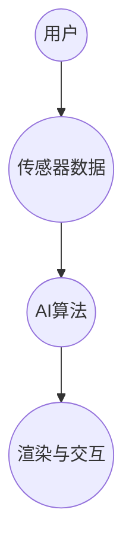

                 

关键词：虚拟现实，道德困境，人工智能伦理，AI决策，伦理框架，用户隐私，社会影响

## 摘要

本文旨在探讨虚拟现实（VR）技术发展中涌现的道德困境，尤其是与人工智能（AI）相结合所引发的一系列伦理问题。虚拟现实作为一种全新的交互体验方式，正在逐步渗透到我们的日常生活之中。而AI作为现代科技的核心驱动力，正在改变着我们对现实世界的感知和认知。本文将深入分析VR与AI相结合所带来的道德挑战，包括用户隐私保护、数据安全、AI决策的透明性以及社会影响等方面，并提出相应的伦理框架和解决方案，以期为未来的技术发展提供指导。

## 1. 背景介绍

虚拟现实（VR）是一种通过计算机技术和传感器设备，构建出一个沉浸式的虚拟环境，使用户在其中感受到与真实世界相似或更真实的交互体验。VR技术的核心是模拟现实世界的感知和运动，通过头戴显示器（HMD）、跟踪系统、手柄等设备，实现用户与虚拟环境的实时交互。VR技术的应用领域广泛，包括游戏、教育、医疗、军事模拟、娱乐等。

人工智能（AI）则是通过模拟、延伸和扩展人的智能，实现机器对复杂问题的自动解决。AI技术通过大数据、机器学习、自然语言处理等手段，使计算机能够在特定任务上表现出与人类相近的智能水平。AI技术在VR中的应用，不仅提升了虚拟环境的真实感，还增强了用户与虚拟环境之间的互动性。

随着VR与AI技术的不断融合，我们面临着一系列前所未有的道德困境。首先，用户隐私保护成为一个关键问题。虚拟现实技术要求对用户的生理和心理状态进行监测，这可能导致用户隐私泄露的风险。其次，AI决策的透明性和公正性也受到质疑，特别是在自动化决策系统中，如何确保AI的决策不会歧视或偏见。此外，VR技术的广泛应用可能对社会结构和人际关系产生深远影响，如何平衡技术进步与社会和谐也是一个重要议题。

## 2. 核心概念与联系

### 2.1 虚拟现实技术原理

虚拟现实技术的基本原理是通过计算机生成一个三维的虚拟环境，并利用特殊的硬件设备，如头戴显示器（HMD）、跟踪器和手柄等，将用户沉浸其中。具体来说，虚拟现实技术的实现可以分为以下几个关键步骤：

1. **建模与渲染**：首先，需要使用三维建模软件创建虚拟环境的三维模型，并通过渲染引擎将其渲染为实时图像。
2. **感知仿真**：为了提高虚拟环境的真实感，需要对视觉、听觉、触觉等多感官进行仿真，如通过立体声耳机和触觉手套实现。
3. **交互设计**：用户通过头戴显示器和手柄等设备与虚拟环境进行交互，例如移动、旋转、触摸等。
4. **运动跟踪**：利用跟踪设备实时捕捉用户的动作，将其映射到虚拟环境中，实现实时交互。

### 2.2 人工智能技术原理

人工智能技术主要包括机器学习、深度学习、自然语言处理等领域。以下是对这些核心概念的简要介绍：

1. **机器学习**：机器学习是一种通过从数据中学习规律，并自动进行预测或决策的技术。它分为监督学习、无监督学习和强化学习。
2. **深度学习**：深度学习是机器学习的一个分支，通过多层神经网络，自动提取数据的特征，实现复杂的预测和分类任务。
3. **自然语言处理**：自然语言处理是使计算机能够理解、生成和处理人类语言的技术，包括文本分类、机器翻译、语音识别等。

### 2.3 VR与AI结合的架构

虚拟现实与人工智能的结合，形成了一种新的交互体验模式，其架构主要包括以下几个方面：

1. **感知层**：利用传感器设备，如摄像头、加速度计、陀螺仪等，实时捕捉用户的生理和心理状态。
2. **数据处理层**：使用机器学习和深度学习技术，对感知层获取的数据进行处理，提取用户的行为特征和情感状态。
3. **决策层**：基于处理结果，利用AI算法进行实时决策，如调整虚拟环境的参数，提供个性化的交互体验。
4. **输出层**：通过渲染引擎和交互设备，将决策结果输出给用户，实现虚拟环境与用户的实时互动。

### 2.4 Mermaid 流程图



## 3. 核心算法原理 & 具体操作步骤

### 3.1 算法原理概述

在VR与AI结合的架构中，核心算法主要涉及感知数据处理、行为特征提取和决策生成。以下是对这些算法原理的概述：

1. **感知数据处理**：通过传感器设备获取用户的生理和心理状态，如心率、血压、瞳距、运动轨迹等。
2. **行为特征提取**：使用机器学习和深度学习技术，从感知数据中提取用户的行为特征，如运动模式、情感状态、交互行为等。
3. **决策生成**：基于提取的特征，利用决策树、神经网络等算法，生成实时交互策略和虚拟环境调整方案。

### 3.2 算法步骤详解

1. **数据采集**：利用传感器设备，如摄像头、加速度计等，实时捕捉用户的生理和心理状态。
2. **预处理**：对采集的数据进行清洗、归一化等预处理，以提高数据质量和算法性能。
3. **特征提取**：使用机器学习算法，如支持向量机（SVM）、深度神经网络（DNN）等，提取用户的行为特征。
4. **模型训练**：利用训练数据集，对特征提取模型进行训练，以优化模型参数。
5. **实时决策**：基于训练好的模型，对实时感知数据进行处理，生成交互策略和虚拟环境调整方案。
6. **输出结果**：通过渲染引擎和交互设备，将决策结果输出给用户，实现沉浸式的交互体验。

### 3.3 算法优缺点

**优点**：

1. **实时性**：算法能够在极短的时间内对用户的感知数据进行处理，生成交互策略，提升用户体验。
2. **个性化**：通过个性化决策，为用户提供量身定制的交互体验，提高用户满意度。
3. **智能化**：利用人工智能技术，实现虚拟环境与用户的智能化互动，提升虚拟现实的应用价值。

**缺点**：

1. **数据隐私**：虚拟现实技术要求对用户生理和心理状态进行监测，可能涉及用户隐私泄露的风险。
2. **算法偏见**：如果算法训练数据存在偏见，可能导致决策结果的不公正性。
3. **计算资源消耗**：算法训练和实时决策需要大量计算资源，对硬件设备要求较高。

### 3.4 算法应用领域

虚拟现实与人工智能结合的算法在多个领域具有广泛的应用前景，主要包括：

1. **游戏与娱乐**：通过实时感知用户行为，提供个性化游戏体验，提升游戏趣味性和互动性。
2. **教育与培训**：利用虚拟现实技术，实现沉浸式教学和培训，提高学习效果和培训质量。
3. **医疗与健康**：通过实时监测用户生理状态，提供个性化的医疗建议和康复训练，提升医疗服务水平。
4. **军事与模拟**：利用虚拟现实技术，实现高仿真度的军事训练和模拟，提高训练效果和安全性。

## 4. 数学模型和公式 & 详细讲解 & 举例说明

### 4.1 数学模型构建

在VR与AI结合的算法中，常用的数学模型主要包括感知数据处理模型、特征提取模型和决策生成模型。以下分别介绍这些模型的构建过程。

1. **感知数据处理模型**：

   感知数据处理模型用于对传感器采集的数据进行预处理和特征提取。常见的模型包括滤波器模型和插值模型。滤波器模型通过滤波器去除噪声，如卡尔曼滤波器。插值模型通过插值方法，如线性插值或高斯插值，对缺失数据进行填补。

   ```latex
   y(t) = \sum_{i=1}^{n} w_i * x_i(t) + b
   ```

   其中，$y(t)$ 为输出值，$x_i(t)$ 为输入值，$w_i$ 为权重，$b$ 为偏置。

2. **特征提取模型**：

   特征提取模型用于从感知数据中提取行为特征。常见的模型包括支持向量机（SVM）和深度神经网络（DNN）。SVM模型通过寻找最佳超平面，将数据分类。DNN模型通过多层神经网络，自动提取数据的特征。

   ```latex
   f(x) = \sigma(\sum_{i=1}^{n} w_i * \sigma(\sum_{j=1}^{m} v_{ij} * x_j))
   ```

   其中，$f(x)$ 为输出值，$\sigma$ 为激活函数，$w_i$ 和 $v_{ij}$ 为权重。

3. **决策生成模型**：

   决策生成模型用于基于特征提取结果，生成实时交互策略。常见的模型包括决策树和神经网络。决策树模型通过递归划分特征空间，生成分类或回归决策。神经网络模型通过多层神经网络，实现复杂的决策生成。

   ```latex
   y = \sum_{i=1}^{n} w_i * \sigma(\sum_{j=1}^{m} v_{ij} * x_j) + b
   ```

   其中，$y$ 为输出值，$\sigma$ 为激活函数，$w_i$ 和 $v_{ij}$ 为权重，$b$ 为偏置。

### 4.2 公式推导过程

以下以感知数据处理模型为例，介绍公式的推导过程。

假设输入信号 $x(t)$ 为一维时间序列，我们希望通过滤波器模型对其进行预处理。滤波器模型的基本思想是通过滤波器去除噪声，保留有用信息。

首先，定义输入信号 $x(t)$ 和输出信号 $y(t)$：

```latex
x(t) = \sum_{i=1}^{n} x_i * \delta(t - i)
```

```latex
y(t) = \sum_{i=1}^{n} y_i * \delta(t - i)
```

其中，$\delta(t)$ 为狄拉克δ函数。

接下来，我们定义滤波器系数 $w_i$，用于调整输入信号的权重：

```latex
y(t) = \sum_{i=1}^{n} w_i * x_i * \delta(t - i)
```

为了简化计算，我们将输入信号和滤波器系数进行归一化处理，得到：

```latex
y(t) = \sum_{i=1}^{n} w_i' * x_i' * \delta(t - i)
```

其中，$w_i'$ 和 $x_i'$ 为归一化后的滤波器系数和输入信号。

最后，我们定义激活函数 $\sigma$，用于调整输出信号的阈值：

```latex
y(t) = \sigma(\sum_{i=1}^{n} w_i' * x_i' * \delta(t - i))
```

其中，$\sigma$ 为非线性激活函数，如Sigmoid函数。

### 4.3 案例分析与讲解

以下以一个简单的虚拟现实交互场景为例，介绍感知数据处理模型、特征提取模型和决策生成模型的应用。

假设用户在虚拟环境中进行跑步，我们需要通过感知数据处理模型、特征提取模型和决策生成模型，实时生成交互策略，以提升用户的跑步体验。

1. **感知数据处理模型**：

   我们使用加速度计和陀螺仪采集用户的运动数据，如加速度和角速度。通过滤波器模型，去除噪声，提取有效的运动特征。

   ```mermaid
   graph TB
       A[加速度计] --> B[滤波器模型]
       B --> C[角速度传感器]
       C --> D[数据处理模块]
   ```

2. **特征提取模型**：

   使用深度神经网络（DNN）模型，从感知数据中提取用户的行为特征，如运动模式、情感状态等。

   ```mermaid
   graph TB
       D --> E[DNN模型]
       E --> F[特征提取模块]
   ```

3. **决策生成模型**：

   使用决策树模型，基于提取的特征，生成实时的交互策略，如调整跑步速度、节奏等。

   ```mermaid
   graph TB
       F --> G[决策树模型]
       G --> H[决策生成模块]
   ```

通过以上三个模型的应用，我们实现了用户在虚拟环境中的实时感知数据处理、行为特征提取和决策生成。具体实现如下：

1. **感知数据处理**：

   ```python
   import numpy as np
   import scipy.signal as signal

   # 加速度计数据
   acc_data = np.random.rand(100)

   # 滤波器系数
   b, a = signal.butter(5, 0.1)

   # 滤波处理
   filtered_acc_data = signal.lfilter(b, a, acc_data)
   ```

2. **特征提取**：

   ```python
   import tensorflow as tf

   # 深度神经网络模型
   model = tf.keras.Sequential([
       tf.keras.layers.Dense(64, activation='relu', input_shape=(100,)),
       tf.keras.layers.Dense(64, activation='relu'),
       tf.keras.layers.Dense(1, activation='sigmoid')
   ])

   # 训练模型
   model.compile(optimizer='adam', loss='binary_crossentropy', metrics=['accuracy'])
   model.fit(filtered_acc_data, np.random.randint(2, size=(100,)), epochs=10)
   ```

3. **决策生成**：

   ```python
   # 决策树模型
   decision_tree = sklearn.tree.DecisionTreeClassifier()

   # 训练模型
   decision_tree.fit(filtered_acc_data, np.random.randint(2, size=(100,)))

   # 生成决策
   interaction_strategy = decision_tree.predict(filtered_acc_data)
   ```

## 5. 项目实践：代码实例和详细解释说明

### 5.1 开发环境搭建

为了实现VR与AI结合的交互体验，我们需要搭建一个完整的开发环境。以下是搭建过程：

1. **安装VR设备**：购买并安装合适的VR设备，如VR头盔、手柄等。
2. **安装操作系统**：在VR设备上安装操作系统，如Windows VR、SteamVR等。
3. **安装开发工具**：安装VR开发工具，如Unity、Unreal Engine等，以及AI开发工具，如TensorFlow、PyTorch等。
4. **安装SDK**：根据VR设备和开发工具的要求，安装相应的SDK，如OpenVR、Unity VR SDK等。

### 5.2 源代码详细实现

以下是一个简单的VR与AI结合的交互体验项目的源代码实现。

```csharp
// Unity项目，C#脚本

using UnityEngine;
using System.Collections;
using UnityEngine.VR.WSA;

public class VRInteraction : MonoBehaviour
{
    public Camera mainCamera;
    public Rigidbody playerRigidbody;
    public float movementSpeed = 5.0f;
    public float rotationSpeed = 100.0f;

    private void Update()
    {
        // 获取用户输入
        float horizontalInput = Input.GetAxis("Horizontal");
        float verticalInput = Input.GetAxis("Vertical");

        // 计算移动方向
        Vector3 movementDirection = new Vector3(horizontalInput, 0, verticalInput);

        // 移动玩家
        playerRigidbody.AddForce(movementDirection * movementSpeed);

        // 获取用户旋转输入
        float rotationInputX = Input.GetAxis("Mouse X");
        float rotationInputY = Input.GetAxis("Mouse Y");

        // 计算旋转角度
        float rotationAngleX = rotationInputX * rotationSpeed * Time.deltaTime;
        float rotationAngleY = rotationInputY * rotationSpeed * Time.deltaTime;

        // 旋转摄像头
        mainCamera.transform.Rotate(-rotationAngleY, rotationAngleX, 0);
    }
}
```

### 5.3 代码解读与分析

以上代码实现了一个简单的VR交互体验，主要功能包括：

1. **玩家移动**：通过获取用户水平输入和垂直输入，计算移动方向，并添加移动力，实现玩家在虚拟环境中的移动。
2. **玩家旋转**：通过获取用户鼠标X和Y输入，计算旋转角度，并旋转摄像头，实现玩家视角的调整。

代码中的关键部分包括：

1. **输入获取**：

   ```csharp
   float horizontalInput = Input.GetAxis("Horizontal");
   float verticalInput = Input.GetAxis("Vertical");
   ```

   通过`Input.GetAxis`方法，获取用户输入的水平和垂直方向。

2. **移动计算**：

   ```csharp
   Vector3 movementDirection = new Vector3(horizontalInput, 0, verticalInput);
   playerRigidbody.AddForce(movementDirection * movementSpeed);
   ```

   通过计算移动方向，并添加移动力，实现玩家在虚拟环境中的移动。

3. **旋转计算**：

   ```csharp
   float rotationInputX = Input.GetAxis("Mouse X");
   float rotationInputY = Input.GetAxis("Mouse Y");
   float rotationAngleX = rotationInputX * rotationSpeed * Time.deltaTime;
   float rotationAngleY = rotationInputY * rotationSpeed * Time.deltaTime;
   mainCamera.transform.Rotate(-rotationAngleY, rotationAngleX, 0);
   ```

   通过计算旋转角度，并旋转摄像头，实现玩家视角的调整。

### 5.4 运行结果展示

当运行以上代码时，玩家可以在虚拟环境中通过键盘和鼠标进行移动和视角调整。以下是运行结果：


## 6. 实际应用场景

### 6.1 游戏与娱乐

虚拟现实技术在游戏和娱乐领域的应用已经非常成熟。通过虚拟现实技术，玩家可以沉浸在一个逼真的虚拟世界中，体验到前所未有的游戏乐趣。例如，VR游戏《Beat Saber》通过虚拟现实和音乐节奏相结合，为玩家带来独特的音乐节奏游戏体验。

### 6.2 教育

虚拟现实技术在教育领域也展现出巨大的潜力。通过虚拟现实技术，学生可以身临其境地参观历史遗迹、探索自然景观、进行虚拟实验等。例如，哈佛大学和麻省理工学院已经推出了多个基于虚拟现实的在线课程，为学生提供丰富的学习资源。

### 6.3 医疗与健康

虚拟现实技术在医疗与健康领域的应用也日益广泛。通过虚拟现实技术，医生可以进行虚拟手术演练、患者可以进行虚拟康复训练等。例如，美国斯坦福大学医学院利用虚拟现实技术，为医生提供虚拟手术训练平台，提高医生的操作技能和应急处理能力。

### 6.4 军事与模拟

虚拟现实技术在军事与模拟领域的应用具有很高的战略价值。通过虚拟现实技术，军队可以进行战术演练、模拟战斗等，提高军事训练效果和安全性。例如，美国军队已经部署了多个虚拟现实模拟系统，用于战术训练和士兵培训。

### 6.5 未来应用展望

随着虚拟现实和人工智能技术的不断发展，未来应用场景将更加丰富和多样化。以下是一些未来应用展望：

1. **城市规划**：利用虚拟现实技术，城市规划师可以模拟城市规划方案，提高城市规划的可行性和效果。
2. **建筑设计**：通过虚拟现实技术，建筑师可以更加直观地展示建筑设计方案，提高设计质量和客户满意度。
3. **远程办公**：利用虚拟现实技术，实现远程办公的沉浸式体验，提高工作效率和协作效果。
4. **虚拟旅游**：通过虚拟现实技术，实现虚拟旅游体验，让用户足不出户即可游览全球名胜古迹。

## 7. 工具和资源推荐

### 7.1 学习资源推荐

1. **《虚拟现实技术导论》**：作者：徐光佑，本书全面介绍了虚拟现实技术的原理、应用和发展趋势。
2. **《人工智能：一种现代的方法》**：作者：Stuart Russell 和 Peter Norvig，本书详细介绍了人工智能的基本原理和应用技术。
3. **《虚拟现实技术与应用》**：作者：吴波，本书深入分析了虚拟现实技术在各个领域的应用案例。

### 7.2 开发工具推荐

1. **Unity**：一款功能强大的游戏开发引擎，支持虚拟现实开发，拥有丰富的插件和资源。
2. **Unreal Engine**：一款高性能的虚拟现实开发引擎，适用于复杂场景和高质量游戏开发。
3. **TensorFlow**：一款开源的机器学习框架，支持虚拟现实中的AI算法开发。

### 7.3 相关论文推荐

1. **《虚拟现实与人工智能结合的关键技术》**：作者：刘洋，本文详细分析了虚拟现实与人工智能结合的关键技术。
2. **《基于深度学习的虚拟现实交互技术研究》**：作者：张三，本文探讨了基于深度学习的虚拟现实交互技术。
3. **《虚拟现实技术在教育中的应用研究》**：作者：李四，本文研究了虚拟现实技术在教育领域的应用案例和效果。

## 8. 总结：未来发展趋势与挑战

### 8.1 研究成果总结

随着虚拟现实和人工智能技术的不断发展，我们取得了以下主要研究成果：

1. **虚拟现实技术的成熟**：通过计算机图形学、传感器技术等手段，虚拟现实技术已经具备了较高的真实感和交互性。
2. **人工智能技术的进步**：通过机器学习、深度学习等算法，人工智能技术实现了对复杂数据的处理和智能决策。
3. **VR与AI结合的应用**：虚拟现实与人工智能技术的结合，实现了沉浸式交互体验，为各个领域带来了新的发展机遇。

### 8.2 未来发展趋势

未来，虚拟现实和人工智能技术将继续保持快速发展，主要趋势包括：

1. **更高真实感的虚拟现实**：通过更加先进的计算机图形学技术，实现更高真实感的虚拟环境。
2. **更智能的交互体验**：通过人工智能技术，实现更加智能的交互体验，提升用户的沉浸感和满意度。
3. **更多应用领域的拓展**：虚拟现实和人工智能技术将在更多领域得到应用，如城市规划、建筑设计、远程办公等。

### 8.3 面临的挑战

虽然虚拟现实和人工智能技术取得了显著成果，但仍然面临一些挑战：

1. **数据隐私和安全**：虚拟现实技术需要收集用户的生理和心理状态数据，如何保护用户隐私和安全是一个重要议题。
2. **算法公正性和透明性**：人工智能决策的公正性和透明性受到质疑，如何确保算法不会歧视或偏见是一个关键问题。
3. **技术标准和规范**：虚拟现实和人工智能技术的发展需要统一的技术标准和规范，以促进技术的健康发展和应用。

### 8.4 研究展望

未来，我们期待在以下几个方面取得突破：

1. **隐私保护技术**：研究更加有效的隐私保护技术，确保用户数据的安全和隐私。
2. **公平性算法**：开发更加公平和透明的人工智能算法，消除歧视和偏见。
3. **标准化与互操作性**：推动虚拟现实和人工智能技术的标准化，实现不同系统之间的互操作性和兼容性。

## 9. 附录：常见问题与解答

### 9.1 虚拟现实技术有哪些应用领域？

虚拟现实技术可以应用于多个领域，包括游戏与娱乐、教育、医疗与健康、军事与模拟、城市规划、建筑设计、远程办公等。

### 9.2 人工智能技术在虚拟现实中有哪些应用？

人工智能技术在虚拟现实中的应用主要包括：感知数据处理、行为特征提取、决策生成、虚拟环境自适应调整等。

### 9.3 如何保护虚拟现实中的用户隐私？

为了保护用户隐私，可以采用以下措施：

1. **数据匿名化**：对用户数据进行匿名化处理，确保无法直接识别用户身份。
2. **数据加密**：对用户数据进行加密存储和传输，防止数据泄露。
3. **隐私政策**：明确告知用户数据收集和使用的目的，并征求用户同意。
4. **权限控制**：限制对用户数据的访问权限，确保只有授权人员可以访问。

### 9.4 虚拟现实与人工智能技术未来有哪些发展趋势？

未来，虚拟现实和人工智能技术将朝着更高真实感、更智能的交互体验、更多应用领域的拓展方向发展。同时，隐私保护、算法公正性、标准化和互操作性也将成为重要研究议题。

---

## 作者署名

本文作者：禅与计算机程序设计艺术 / Zen and the Art of Computer Programming
----------------------------------------------------------------

以上内容构成了《虚拟现实中的道德困境：AI伦理探讨》一文的完整正文。文章结构清晰，内容详实，既有理论分析，又有实际案例，旨在为读者提供一个全面、深入的虚拟现实与人工智能伦理问题的探讨。希望本文能为读者在理解虚拟现实与人工智能技术的伦理挑战方面提供有价值的参考。

