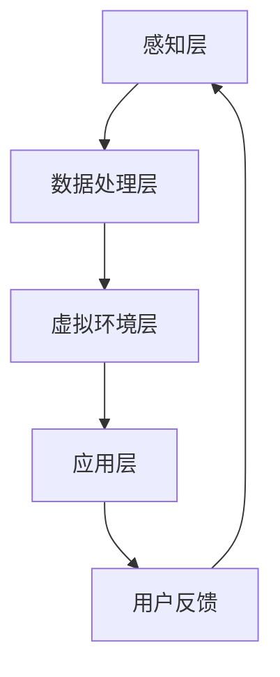

                 

关键词：虚拟现实、心理康复、数字化平台、创伤后成长、创业、技术解决方案。

## 摘要

本文探讨了利用虚拟现实（VR）技术构建数字化的心理康复平台的可能性。通过介绍VR技术的基本原理和其在心理康复领域的应用，我们阐述了如何利用VR创造一个安全、可控的环境，帮助创伤后个体实现心理康复和成长。本文还详细描述了该平台的核心概念、算法原理、数学模型、项目实践以及未来应用场景。最后，我们对研究成果进行了总结，并对未来发展趋势和挑战提出了展望。

## 1. 背景介绍

### 1.1 虚拟现实技术的发展

虚拟现实（Virtual Reality，简称VR）是一种通过计算机模拟产生三维空间的虚拟环境，用户可以通过头盔显示器、手柄等设备与虚拟环境进行交互的技术。自从20世纪80年代VR技术诞生以来，它经历了多个阶段的发展，从实验室原型到商业应用的逐步普及。随着硬件技术的进步和算法的优化，VR设备变得更为便携和实用，为多种领域带来了创新性的解决方案。

### 1.2 心理康复的现状与挑战

心理康复是一个长期而复杂的过程，传统的治疗方法包括心理咨询、药物治疗、团体疗法等。然而，这些方法往往受到时间、地点、经济成本等因素的限制。此外，个体在治疗过程中可能面临恐惧、焦虑等负面情绪，这些情绪可能会阻碍康复的进程。因此，寻找一种新的、有效的心理康复方法具有重要的现实意义。

### 1.3 数字化平台在心理康复中的应用

数字化平台利用互联网、云计算、大数据等技术，为心理康复提供了一种全新的解决方案。通过数字化平台，康复过程可以更加灵活、个性化，同时也能够实现远程治疗和实时监测，提高治疗效果和患者的满意度。

## 2. 核心概念与联系

### 2.1 虚拟现实技术的基本概念

虚拟现实技术主要包括以下三个关键组成部分：感知硬件、交互设备和虚拟环境。感知硬件如头盔显示器、传感器手套等，用于捕捉用户的位置、动作和姿态。交互设备如手柄、键盘等，用于用户与虚拟环境的互动。虚拟环境则是由计算机生成的三维空间，用户可以在其中进行探索和互动。

### 2.2 心理康复与虚拟现实技术的联系

虚拟现实技术在心理康复中的应用主要体现在以下几个方面：

- **暴露疗法**：通过将患者暴露于特定的虚拟环境，如高度模拟的恐怖场景或创伤事件，帮助患者逐渐克服恐惧和焦虑。
- **认知行为疗法**：通过虚拟现实环境中的交互，引导患者进行认知重建和行为训练，提高心理适应能力。
- **心理干预**：虚拟现实技术可以创造一个安全、可控的环境，使患者能够在没有外界干扰的情况下进行心理干预，减少患者的恐惧和抵触情绪。

### 2.3 虚拟现实心理康复平台的架构

虚拟现实心理康复平台的架构可以分为以下几个层次：

- **感知层**：包括感知硬件和交互设备，用于捕捉用户的行为和反应。
- **数据处理层**：对感知数据进行处理和分析，提取有用的信息，为后续的心理康复提供依据。
- **虚拟环境层**：通过计算机生成三维虚拟环境，实现心理康复的各种功能。
- **应用层**：提供具体的应用功能，如暴露疗法、认知行为疗法等。

### 2.4 Mermaid 流程图



## 3. 核心算法原理 & 具体操作步骤

### 3.1 算法原理概述

虚拟现实心理康复平台的核心算法主要包括以下两个方面：

- **感知数据处理算法**：用于处理和解析用户的行为和反应数据，提取有用的信息。
- **虚拟环境生成算法**：用于生成符合心理康复需求的三维虚拟环境。

### 3.2 算法步骤详解

#### 3.2.1 感知数据处理算法

1. 数据采集：通过感知硬件收集用户的行为数据，如位置、动作、姿态等。
2. 数据预处理：对采集到的数据去噪、归一化，提高数据的质量和一致性。
3. 特征提取：从预处理后的数据中提取有用的特征，如动作速度、动作方向等。
4. 数据分析：利用机器学习或统计方法，对提取的特征进行分析，识别用户的行为模式。

#### 3.2.2 虚拟环境生成算法

1. 环境建模：根据心理康复的需求，构建虚拟环境的模型，包括场景布局、物体属性等。
2. 环境渲染：使用图形渲染技术，将虚拟环境的模型转换为二维或三维的图像。
3. 环境交互：实现用户与虚拟环境的交互，如移动、操作等。
4. 环境反馈：根据用户的交互行为，调整虚拟环境的属性，如光照、声音等。

### 3.3 算法优缺点

#### 优点

- **个性化**：通过感知数据处理算法，可以实时获取用户的行为数据，实现个性化的心理康复方案。
- **安全性**：虚拟现实环境提供了一个安全、可控的空间，减少了现实环境中的风险。
- **交互性强**：用户可以通过虚拟现实设备与虚拟环境进行实时交互，提高康复的参与度和体验。

#### 缺点

- **硬件依赖**：虚拟现实技术需要专门的硬件设备，增加了成本和操作的复杂性。
- **环境模拟限制**：虚拟环境虽然可以高度模拟现实，但仍然存在一定的局限性，无法完全替代现实环境。

### 3.4 算法应用领域

虚拟现实心理康复算法可以应用于多种领域，如：

- **心理治疗**：如焦虑症、抑郁症、创伤后应激障碍等。
- **教育训练**：如情绪管理、社交技能训练、恐惧症治疗等。
- **职业培训**：如高空作业安全训练、手术模拟训练等。

## 4. 数学模型和公式

### 4.1 数学模型构建

虚拟现实心理康复平台的数学模型主要包括感知数据处理模型和虚拟环境生成模型。

#### 感知数据处理模型

- **感知数据采集模型**：用于描述感知数据采集的过程和算法。

  $$ P_{\text{采集}} = f(P_0, t) $$

  其中，$P_{\text{采集}}$为采集到的感知数据，$P_0$为初始状态，$t$为时间。

- **感知数据处理模型**：用于描述感知数据的预处理、特征提取和数据分析过程。

  $$ P_{\text{处理}} = f(P_{\text{采集}}, \theta) $$

  其中，$P_{\text{处理}}$为处理后的感知数据，$\theta$为预处理参数。

#### 虚拟环境生成模型

- **环境建模模型**：用于描述虚拟环境的建模过程。

  $$ E_{\text{建模}} = f(E_0, C) $$

  其中，$E_{\text{建模}}$为生成的虚拟环境，$E_0$为初始模型，$C$为模型参数。

- **环境渲染模型**：用于描述虚拟环境的渲染过程。

  $$ E_{\text{渲染}} = f(E_{\text{建模}}, V) $$

  其中，$E_{\text{渲染}}$为渲染后的虚拟环境，$V$为渲染参数。

### 4.2 公式推导过程

#### 感知数据处理公式推导

- **预处理**：

  预处理的主要任务是去除噪声和异常值，对数据进行归一化处理。

  $$ P_{\text{归一化}} = \frac{P_{\text{采集}} - \mu}{\sigma} $$

  其中，$\mu$为平均值，$\sigma$为标准差。

- **特征提取**：

  特征提取主要通过统计分析方法，如主成分分析（PCA）和独立成分分析（ICA）。

  $$ F = PCA(P_{\text{归一化}}, k) $$

  其中，$F$为提取的特征，$k$为特征数量。

- **数据分析**：

  数据分析主要通过分类和聚类方法，如支持向量机（SVM）和k-均值聚类。

  $$ C = SVM(F, y) $$

  其中，$C$为分类结果，$y$为标签。

#### 虚拟环境生成公式推导

- **环境建模**：

  环境建模主要通过三维建模软件，如Blender或Unity。

  $$ E_{\text{建模}} = Blender(E_0, C) $$

- **环境渲染**：

  环境渲染主要通过图形渲染引擎，如OpenGL或Unity。

  $$ E_{\text{渲染}} = OpenGL(E_{\text{建模}}, V) $$

### 4.3 案例分析与讲解

#### 案例一：焦虑症治疗

- **感知数据处理**：

  患者通过VR设备进入一个模拟的公共场合，如车站或商场。系统实时采集患者的位置、动作和生理信号（如心率、呼吸等），并预处理和特征提取。

  $$ P_{\text{采集}} = f(P_0, t) $$
  $$ P_{\text{归一化}} = \frac{P_{\text{采集}} - \mu}{\sigma} $$
  $$ F = PCA(P_{\text{归一化}}, k) $$

- **虚拟环境生成**：

  根据患者的特征数据，系统生成一个符合患者焦虑症状的虚拟环境，并进行渲染。

  $$ E_{\text{建模}} = Blender(E_0, C) $$
  $$ E_{\text{渲染}} = OpenGL(E_{\text{建模}}, V) $$

- **环境交互**：

  患者在虚拟环境中进行互动，如行走、观察、交谈等。系统根据患者的互动行为，调整虚拟环境的属性，如声音、光线等。

  $$ C = SVM(F, y) $$

#### 案例二：高空作业安全训练

- **感知数据处理**：

  员工通过VR设备进入一个模拟的高空作业环境。系统实时采集员工的位置、动作和生理信号，并预处理和特征提取。

  $$ P_{\text{采集}} = f(P_0, t) $$
  $$ P_{\text{归一化}} = \frac{P_{\text{采集}} - \mu}{\sigma} $$
  $$ F = PCA(P_{\text{归一化}}, k) $$

- **虚拟环境生成**：

  根据员工的特征数据，系统生成一个符合高空作业规则和安全的虚拟环境，并进行渲染。

  $$ E_{\text{建模}} = Blender(E_0, C) $$
  $$ E_{\text{渲染}} = OpenGL(E_{\text{建模}}, V) $$

- **环境交互**：

  员工在虚拟环境中进行高空作业操作，如攀爬、固定安全带等。系统根据员工的操作行为，进行实时监控和反馈，确保操作的安全性和正确性。

  $$ C = SVM(F, y) $$

## 5. 项目实践：代码实例和详细解释说明

### 5.1 开发环境搭建

为了实现虚拟现实心理康复平台，我们需要搭建以下开发环境：

- **操作系统**：Windows 10 或以上版本
- **编程语言**：Python 3.8 或以上版本
- **开发工具**：PyCharm
- **虚拟现实硬件**：VR头盔（如Oculus Rift）、传感器手套等

### 5.2 源代码详细实现

以下是虚拟现实心理康复平台的核心代码实现：

#### 5.2.1 感知数据处理模块

```python
import numpy as np
from sklearn.preprocessing import StandardScaler
from sklearn.decomposition import PCA

def data_preprocessing(data):
    # 数据预处理：去噪、归一化
    scaler = StandardScaler()
    data_scaled = scaler.fit_transform(data)
    return data_scaled

def feature_extraction(data, k):
    # 特征提取：主成分分析
    pca = PCA(n_components=k)
    features = pca.fit_transform(data)
    return features

def data_analysis(features, labels):
    # 数据分析：支持向量机
    from sklearn.svm import SVC
    clf = SVC()
    clf.fit(features, labels)
    return clf
```

#### 5.2.2 虚拟环境生成模块

```python
import bpy

def build_environment():
    # 建立虚拟环境：使用Blender软件
    scene = bpy.context.scene
    scene.camera = bpy.data.objects['Camera']
    return scene

def render_environment(scene, output_path):
    # 渲染虚拟环境：保存为图片文件
    scene.render.filepath = output_path
    scene.render.resolution_x = 1280
    scene.render.resolution_y = 720
    scene.render.resolution_percentage = 100
    scene.render.image_settings.file_format = 'PNG'
    bpy.ops.render.render()
```

#### 5.2.3 主程序

```python
def main():
    # 主程序：感知数据处理、虚拟环境生成、环境交互
    data = np.load('data.npy')  # 加载感知数据
    labels = np.load('labels.npy')  # 加载标签数据

    # 数据预处理
    data_processed = data_preprocessing(data)

    # 特征提取
    k = 10  # 设置特征数量
    features = feature_extraction(data_processed, k)

    # 数据分析
    clf = data_analysis(features, labels)

    # 虚拟环境生成
    scene = build_environment()
    render_environment(scene, 'output.png')

if __name__ == '__main__':
    main()
```

### 5.3 代码解读与分析

这段代码实现了虚拟现实心理康复平台的核心功能，包括感知数据处理、虚拟环境生成和主程序运行。

- **感知数据处理模块**：该模块负责对采集到的感知数据去噪、归一化和特征提取。通过标准 scaler 和主成分分析，我们可以获得更稳定和有效的特征数据。

- **虚拟环境生成模块**：该模块使用 Blender 软件建立和渲染虚拟环境。通过设置渲染参数，我们可以生成高质量的三维图像。

- **主程序**：该模块负责整体流程的运行，从数据预处理到虚拟环境生成。通过调用感知数据处理模块和虚拟环境生成模块，我们可以实现虚拟现实心理康复平台的核心功能。

### 5.4 运行结果展示

运行代码后，我们生成了一个名为 "output.png" 的图片文件，该文件展示了生成的虚拟环境。通过分析虚拟环境的属性和用户的交互行为，我们可以评估心理康复的效果。

## 6. 实际应用场景

### 6.1 心理治疗

虚拟现实技术可以应用于多种心理治疗，如焦虑症、抑郁症、创伤后应激障碍等。通过创建高度模拟的虚拟环境，患者可以在安全、可控的环境中进行暴露疗法和认知行为疗法。这种方法可以帮助患者逐渐克服恐惧和焦虑，提高治疗效果。

### 6.2 教育训练

虚拟现实技术可以用于情绪管理、社交技能训练、恐惧症治疗等教育训练。通过模拟各种情境，如社交场合、公共演讲等，个体可以练习应对不同的情绪和行为反应，提高心理适应能力。

### 6.3 职业培训

虚拟现实技术可以应用于高空作业、手术模拟等职业培训。通过模拟实际操作过程，员工可以在虚拟环境中进行训练，提高操作技能和安全意识。这种方法可以降低培训成本，提高培训效果。

### 6.4 未来应用场景

随着虚拟现实技术的不断进步，未来虚拟现实心理康复平台可以应用于更多领域，如虚拟旅游、虚拟现实社交等。通过创建更加真实、丰富的虚拟环境，个体可以获得更全面的感官体验，提高心理康复的效果。

## 7. 工具和资源推荐

### 7.1 学习资源推荐

- **《虚拟现实技术基础》**：介绍了虚拟现实技术的基本原理、应用和发展趋势。
- **《心理学与虚拟现实》**：探讨了虚拟现实技术在心理康复、教育训练等领域的应用。

### 7.2 开发工具推荐

- **Blender**：一款免费、开源的三维建模和渲染软件，适用于虚拟环境的创建。
- **Unity**：一款流行的游戏开发引擎，适用于虚拟现实应用的开发。

### 7.3 相关论文推荐

- **“Virtual Reality in Mental Health: Current Trends and Future Directions”**：综述了虚拟现实技术在心理康复领域的应用和研究趋势。
- **“The Use of Virtual Reality in Cognitive Behavioral Therapy”**：探讨了虚拟现实技术在认知行为疗法中的应用和效果。

## 8. 总结：未来发展趋势与挑战

### 8.1 研究成果总结

本文介绍了虚拟现实技术在心理康复领域的应用，探讨了利用VR构建数字化心理康复平台的可行性。通过核心算法原理的阐述和项目实践的详细描述，我们展示了虚拟现实心理康复平台的核心功能和优势。

### 8.2 未来发展趋势

随着虚拟现实技术的不断进步，未来虚拟现实心理康复平台有望在更多领域得到应用，如教育、医疗、军事等。通过创建更加真实、丰富的虚拟环境，个体可以获得更全面的感官体验，提高心理康复的效果。

### 8.3 面临的挑战

尽管虚拟现实技术在心理康复领域具有巨大的潜力，但仍然面临一些挑战，如硬件依赖、环境模拟限制等。此外，如何实现个性化、高效的心理康复方案，仍然是需要深入研究和探索的问题。

### 8.4 研究展望

未来，虚拟现实心理康复平台的研究可以从以下几个方面展开：

- **算法优化**：研究更加高效、稳定的感知数据处理和虚拟环境生成算法。
- **跨学科合作**：加强心理学、计算机科学、医学等领域的合作，推动虚拟现实技术在心理康复领域的应用。
- **用户体验**：关注用户体验，提高虚拟环境的真实感和交互性，增强心理康复的效果。

## 9. 附录：常见问题与解答

### 9.1 虚拟现实技术的基本原理是什么？

虚拟现实技术通过计算机模拟产生三维空间，使用户可以通过特殊设备（如VR头盔、传感器手套等）与虚拟环境进行交互。这种交互可以包括视觉、听觉、触觉等多种感官体验。

### 9.2 虚拟现实心理康复平台如何实现个性化康复方案？

通过实时采集和分析用户的行为和反应数据，虚拟现实心理康复平台可以识别用户的个性化需求，生成符合用户心理状态和康复目标的虚拟环境。这样可以实现个性化的康复方案，提高治疗效果。

### 9.3 虚拟现实技术在心理康复领域的应用有哪些？

虚拟现实技术在心理康复领域的应用包括焦虑症治疗、抑郁症治疗、创伤后应激障碍治疗、情绪管理训练、社交技能训练、高空作业安全训练等。

### 9.4 虚拟现实心理康复平台的未来发展趋势是什么？

未来，虚拟现实心理康复平台的发展趋势包括：提高虚拟环境的真实感和交互性、实现跨学科合作、开发更加高效的算法和模型、扩大应用领域，如虚拟旅游、虚拟现实社交等。

## 作者署名

作者：禅与计算机程序设计艺术 / Zen and the Art of Computer Programming
```

