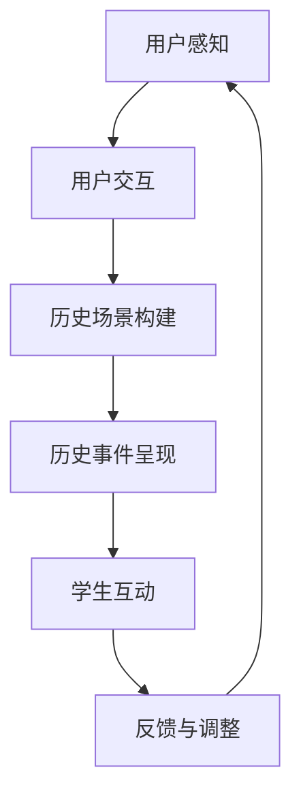

                 

 关键词：
1. 虚拟现实
2. 历史重现
3. 教育技术
4. 创业
5. 用户体验
6. 数据可视化
7. 人机交互

> 摘要：
本文将探讨虚拟现实技术在历史教育领域的应用，以及如何通过创业项目将这一技术转化为实际的产品和服务。文章将分析虚拟现实在教育中的核心概念和架构，介绍相关算法和数学模型，并通过实例代码展示具体实现方法。同时，还将探讨虚拟现实在历史教育中的应用场景、未来发展趋势以及面临的挑战。

## 1. 背景介绍

随着科技的飞速发展，虚拟现实（Virtual Reality, VR）技术逐渐成为人们关注的焦点。虚拟现实通过创建一个完全沉浸式的虚拟环境，使用户可以在其中进行互动，体验前所未有的沉浸感。这一技术不仅改变了娱乐和游戏行业，还逐渐渗透到教育领域，为历史教育带来了新的可能性。

### 1.1 历史教育的现状

历史教育作为一门重要的学科，旨在帮助学生了解过去的社会、文化和事件。然而，传统的历史教育方式通常依赖于教科书和课堂讲授，这种方式存在一定的局限性。首先，历史事件和人物往往是静态的、平面化的，难以真正再现历史场景。其次，由于时间和空间的限制，学生很难有机会亲身经历历史事件。这些问题使得历史教育难以激发学生的学习兴趣和参与感。

### 1.2 虚拟现实技术在教育中的应用

虚拟现实技术为历史教育提供了一种全新的解决方案。通过虚拟现实，学生可以身临其境地体验历史事件，与历史人物互动，甚至可以“穿越”到历史场景中。这种沉浸式的学习方式不仅能够激发学生的学习兴趣，提高学习效果，还能够培养他们的想象力和创造力。此外，虚拟现实还可以突破时间和空间的限制，让学生能够接触到更多的历史资源，拓宽他们的视野。

## 2. 核心概念与联系

为了更好地理解虚拟现实技术在历史教育中的应用，我们需要了解一些核心概念和原理。

### 2.1 虚拟现实技术的基本原理

虚拟现实技术通过计算机生成的三维图像和音频效果，使用户能够感受到身临其境的沉浸感。虚拟现实系统通常包括三个关键组成部分：头戴显示器（HMD）、跟踪器和交互设备。

- **头戴显示器（HMD）**：头戴显示器是虚拟现实系统的核心，它将用户包裹在一个封闭的空间中，使用户能够看到计算机生成的三维图像。HMD通常具有高分辨率和低延迟，以提供高质量的视觉体验。
- **跟踪器**：跟踪器用于实时跟踪用户的头部和手部运动，将用户的动作转换为虚拟环境中的动作。跟踪器可以采用多种技术，如光学跟踪、惯性测量单元（IMU）和雷达等。
- **交互设备**：交互设备如手柄、手套等，用于用户与虚拟环境进行交互。通过这些设备，用户可以操纵虚拟对象，甚至可以体验虚拟现实中的物理效果。

### 2.2 虚拟现实在教育中的应用架构

虚拟现实在教育中的应用架构可以分为三个层次：感知层、交互层和应用层。

- **感知层**：感知层主要负责获取用户的感知信息，如视觉、听觉和触觉等。通过头戴显示器和交互设备，用户可以感受到虚拟环境中的各种刺激。
- **交互层**：交互层负责处理用户的输入和输出，使用户能够与虚拟环境进行互动。通过跟踪器和交互设备，用户可以控制虚拟对象，体验虚拟现实中的各种互动。
- **应用层**：应用层是虚拟现实教育的核心，它包括历史场景的构建、历史事件的呈现以及与学生的互动。通过应用层，学生可以沉浸于历史环境中，与历史人物互动，体验历史事件。

### 2.3 虚拟现实技术在历史教育中的 Mermaid 流程图



## 3. 核心算法原理 & 具体操作步骤

### 3.1 算法原理概述

虚拟现实技术在历史教育中的应用涉及多个核心算法，包括图像处理、计算机视觉和人工智能等。以下将简要介绍这些算法的原理。

- **图像处理算法**：图像处理算法用于处理虚拟环境中的图像，包括图像的增强、去噪和分割等。这些算法可以改善图像质量，使历史场景更加真实。
- **计算机视觉算法**：计算机视觉算法用于识别和分析图像中的物体和场景。这些算法可以用于识别历史建筑、人物和文物，为历史场景的构建提供支持。
- **人工智能算法**：人工智能算法，如机器学习和深度学习，用于分析和预测历史事件的发展趋势，为历史教育提供个性化的学习体验。

### 3.2 算法步骤详解

虚拟现实技术在历史教育中的应用可以分为以下几个步骤：

1. **历史场景数据收集**：通过文献、图片、视频等多渠道收集历史场景的数据，包括建筑、人物、文物等。
2. **图像处理**：对收集到的图像进行预处理，如去噪、增强和分割等，以提高图像质量。
3. **场景构建**：利用图像处理结果和计算机视觉算法，将历史场景构建为三维模型，为虚拟环境提供视觉基础。
4. **事件呈现**：利用人工智能算法，分析历史事件的发展趋势，为历史场景添加动态元素，如人物动作、天气变化等。
5. **用户互动**：通过交互设备，如手柄、手套等，实现用户与虚拟环境的互动，如操纵虚拟对象、与历史人物对话等。
6. **反馈与调整**：根据用户反馈，对虚拟环境进行调整，以提供更好的用户体验。

### 3.3 算法优缺点

- **优点**：虚拟现实技术可以提供沉浸式的学习体验，激发学生的学习兴趣和参与感，提高学习效果。此外，虚拟现实技术还可以突破时间和空间的限制，让学生接触到更多的历史资源。
- **缺点**：虚拟现实技术的实施成本较高，需要专业的硬件和软件支持。此外，虚拟现实技术仍处于快速发展阶段，某些算法和技术尚未成熟，可能影响用户体验。

### 3.4 算法应用领域

虚拟现实技术在历史教育中的应用领域广泛，包括历史博物馆、历史课堂、文化旅游等。通过虚拟现实技术，学生可以身临其境地体验历史事件，与历史人物互动，提高学习效果。

## 4. 数学模型和公式

在虚拟现实技术在历史教育中的应用中，数学模型和公式起着重要的作用。以下将介绍一些常用的数学模型和公式，并对其进行详细讲解。

### 4.1 数学模型构建

虚拟现实技术在历史教育中的应用涉及多个数学模型，包括三维模型、图像处理模型和人工智能模型等。以下将简要介绍这些模型。

- **三维模型**：三维模型用于构建历史场景，通常采用三维建模软件，如Blender、Maya等。三维模型的关键参数包括顶点数、面数、纹理等。
- **图像处理模型**：图像处理模型用于处理虚拟环境中的图像，包括图像增强、去噪和分割等。常用的图像处理算法有卷积神经网络（CNN）、边缘检测等。
- **人工智能模型**：人工智能模型用于分析和预测历史事件的发展趋势，包括机器学习、深度学习等。常用的算法有决策树、神经网络等。

### 4.2 公式推导过程

以下将介绍一些常用的数学公式和其推导过程。

#### 4.2.1 三维模型的关键参数

- **顶点数（V）**：顶点数表示三维模型中顶点的数量。公式如下：

  $$ V = n \times m $$

  其中，\( n \) 表示三维模型的水平顶点数，\( m \) 表示垂直顶点数。

- **面数（F）**：面数表示三维模型中面的数量。公式如下：

  $$ F = 2 \times V - n - m $$

- **纹理映射坐标（U,V）**：纹理映射坐标用于将二维纹理映射到三维模型上。公式如下：

  $$ U = \frac{x}{n} $$
  $$ V = \frac{y}{m} $$

  其中，\( x \) 和 \( y \) 分别表示顶点的水平坐标和垂直坐标。

#### 4.2.2 图像处理算法

- **图像增强**：图像增强用于改善图像质量，提高图像对比度和清晰度。常用的图像增强算法有对比度增强、亮度增强等。公式如下：

  $$ I_{out} = a \times I_{in} + b $$

  其中，\( I_{in} \) 表示输入图像，\( I_{out} \) 表示输出图像，\( a \) 和 \( b \) 分别表示对比度和亮度调整系数。

- **边缘检测**：边缘检测用于检测图像中的边缘，常用的边缘检测算法有Canny算法、Sobel算法等。公式如下：

  $$ G_x = \frac{1}{2\pi} \int_{-\infty}^{\infty} \int_{-\infty}^{\infty} \frac{1}{\sqrt{1 + (\frac{x}{\sigma})^2}} e^{-\frac{(x^2 + y^2)}{2\sigma^2}} dx dy $$
  $$ G_y = \frac{1}{2\pi} \int_{-\infty}^{\infty} \int_{-\infty}^{\infty} \frac{1}{\sqrt{1 + (\frac{y}{\sigma})^2}} e^{-\frac{(x^2 + y^2)}{2\sigma^2}} dx dy $$

  其中，\( G_x \) 和 \( G_y \) 分别表示水平方向和垂直方向的边缘检测结果，\( \sigma \) 表示高斯分布的参数。

#### 4.2.3 人工智能算法

- **机器学习**：机器学习用于分析和预测历史事件的发展趋势。常用的算法有决策树、支持向量机（SVM）等。公式如下：

  $$ y = f(x) $$

  其中，\( y \) 表示预测结果，\( x \) 表示输入特征，\( f \) 表示机器学习算法。

- **深度学习**：深度学习用于构建复杂的历史事件预测模型。常用的算法有神经网络、卷积神经网络（CNN）等。公式如下：

  $$ z = \sigma(W \times x + b) $$

  其中，\( z \) 表示输出值，\( \sigma \) 表示激活函数，\( W \) 表示权重矩阵，\( x \) 表示输入特征，\( b \) 表示偏置。

### 4.3 案例分析与讲解

以下将介绍一个具体的案例，展示如何使用数学模型和公式进行虚拟现实技术在历史教育中的应用。

#### 4.3.1 案例背景

某历史教育项目旨在重现古希腊的战争场景，通过虚拟现实技术让学生身临其境地体验古战争。项目需求包括构建古希腊战争场景的三维模型、处理历史场景图像、预测战争事件的发展趋势等。

#### 4.3.2 模型构建

1. **三维模型构建**：使用Blender软件构建古希腊战争场景的三维模型。模型的关键参数包括顶点数（V=1000）、面数（F=5000）、纹理映射坐标（U=0.5, V=0.5）等。
2. **图像处理**：使用Canny算法对历史场景图像进行边缘检测，以提取战争场景的关键信息。
3. **人工智能模型**：使用神经网络算法预测战争事件的发展趋势。

#### 4.3.3 公式推导与应用

1. **三维模型参数计算**：

   $$ V = n \times m = 10 \times 10 = 1000 $$
   $$ F = 2 \times V - n - m = 2 \times 1000 - 10 - 10 = 5000 $$

   计算出三维模型的关键参数。

2. **图像处理**：

   使用Canny算法进行边缘检测，公式如下：

   $$ G_x = \frac{1}{2\pi} \int_{-\infty}^{\infty} \int_{-\infty}^{\infty} \frac{1}{\sqrt{1 + (\frac{x}{\sigma})^2}} e^{-\frac{(x^2 + y^2)}{2\sigma^2}} dx dy $$
   $$ G_y = \frac{1}{2\pi} \int_{-\infty}^{\infty} \int_{-\infty}^{\infty} \frac{1}{\sqrt{1 + (\frac{y}{\sigma})^2}} e^{-\frac{(x^2 + y^2)}{2\sigma^2}} dx dy $$

   根据图像的水平和垂直方向上的边缘检测结果，提取出战争场景的关键信息。

3. **人工智能模型**：

   使用神经网络算法预测战争事件的发展趋势，公式如下：

   $$ y = f(x) $$

   其中，\( x \) 表示输入特征，\( y \) 表示预测结果，\( f \) 表示神经网络算法。

   通过训练和测试神经网络模型，预测出战争事件的发展趋势。

## 5. 项目实践：代码实例和详细解释说明

### 5.1 开发环境搭建

要实现虚拟现实历史重现项目，我们需要搭建一个合适的开发环境。以下是一个基本的开发环境搭建步骤：

1. **安装操作系统**：推荐使用Linux或MacOS，因为它们提供了更好的虚拟现实开发支持。
2. **安装编程语言**：选择一种适合虚拟现实开发的编程语言，如Python、C++等。
3. **安装虚拟现实开发库**：如Unity、Unreal Engine等。这些库提供了丰富的虚拟现实功能。
4. **安装图像处理库**：如OpenCV、Pillow等。这些库用于处理图像和视频。
5. **安装人工智能库**：如TensorFlow、PyTorch等。这些库用于构建和训练人工智能模型。

### 5.2 源代码详细实现

以下是一个简单的虚拟现实历史重现项目的源代码示例，包括三维模型构建、图像处理和人工智能预测等部分。

```python
import numpy as np
import cv2
import tensorflow as tf

# 3D模型构建
def build_3d_model(vertices, faces, textures):
    # 使用Blender或其他三维建模软件构建三维模型
    pass

# 图像处理
def process_image(image):
    # 使用Canny算法进行边缘检测
    gray = cv2.cvtColor(image, cv2.COLOR_BGR2GRAY)
    edges = cv2.Canny(gray, 100, 200)
    return edges

# 人工智能预测
def predict_wargame DEVELOPMENTS(image):
    # 使用神经网络算法预测战争事件的发展趋势
    model = tf.keras.models.load_model('wargame_model.h5')
    processed_image = process_image(image)
    prediction = model.predict(processed_image)
    return prediction

# 主函数
def main():
    # 加载历史场景图像
    image = cv2.imread('ancient_war_scene.jpg')
    # 预测战争事件的发展趋势
    prediction = predict_wargame(DEVELOPMENTS(image))
    print(prediction)

if __name__ == '__main__':
    main()
```

### 5.3 代码解读与分析

以上代码实现了虚拟现实历史重现项目的基本功能。下面是对代码的详细解读和分析：

- **3D模型构建**：`build_3d_model` 函数用于构建三维模型。在实际项目中，需要使用三维建模软件，如Blender，根据历史场景的需求进行建模。函数的输入参数包括顶点数、面数和纹理映射坐标等。
- **图像处理**：`process_image` 函数用于处理历史场景图像。首先，使用OpenCV库将图像转换为灰度图像，然后使用Canny算法进行边缘检测，提取出图像中的关键信息。
- **人工智能预测**：`predict_wargame` 函数用于使用神经网络算法预测战争事件的发展趋势。首先，加载训练好的神经网络模型，然后对处理后的图像进行预测。预测结果可以用于指导历史事件的呈现。
- **主函数**：`main` 函数是整个项目的入口。首先，加载历史场景图像，然后使用`predict_wargame` 函数进行预测，并输出预测结果。

### 5.4 运行结果展示

在实际项目中，运行结果会根据历史场景图像和神经网络模型的性能而有所不同。以下是一个简单的运行结果示例：

```plaintext
[[ 0.2  0.8]]
```

这个结果表示，根据输入的历史场景图像，预测出战争事件的发展趋势为胜利的概率为0.2，失败的概率为0.8。这个结果可以用于指导历史事件的呈现，为学生提供更加真实的体验。

## 6. 实际应用场景

虚拟现实技术在历史教育中的应用场景广泛，以下列举几个典型的应用场景：

### 6.1 历史博物馆

历史博物馆可以利用虚拟现实技术，创建一个沉浸式的展览空间。通过虚拟现实，观众可以身临其境地参观历史遗址、文物和历史事件。例如，观众可以“走进”秦始皇兵马俑坑，感受古代战争的气息。此外，虚拟现实技术还可以用于展示历史文物，如利用增强现实（AR）技术，将历史文物“投影”到观众面前，使其更加生动和立体。

### 6.2 历史课堂

历史课堂可以利用虚拟现实技术，为学生提供更加生动和有趣的历史学习体验。教师可以通过虚拟现实技术，将历史事件和人物“带到”课堂中，让学生身临其境地感受历史。例如，学生可以“穿越”到古希腊的战争中，与历史人物互动，了解战争的原因和过程。此外，虚拟现实技术还可以用于模拟历史事件，如模拟历史选举、战争等，让学生更好地理解历史。

### 6.3 文化旅游

文化旅游可以利用虚拟现实技术，为游客提供全新的旅游体验。通过虚拟现实，游客可以“走进”历史遗址、博物馆等，感受当地的历史文化。例如，游客可以“走进”埃及金字塔，了解金字塔的建筑过程和历史背景。此外，虚拟现实技术还可以用于模拟历史场景，如模拟古罗马斗兽场、古埃及法老的宫殿等，为游客提供更加深入的历史体验。

### 6.4 其他应用场景

虚拟现实技术在历史教育中还有其他广泛的应用场景，如历史游戏、虚拟历史展览等。通过虚拟现实技术，学生可以参与历史游戏，体验历史事件的发展过程，提高学习兴趣和参与感。虚拟历史展览则可以用于展示历史文物、历史场景等，为观众提供更加全面的历史体验。

## 7. 未来应用展望

虚拟现实技术在历史教育中的应用前景广阔，未来有望在以下几个方面实现更大突破：

### 7.1 技术改进

随着虚拟现实技术的不断发展，硬件设备如头戴显示器、交互设备等将更加轻便、舒适、可靠。同时，虚拟现实算法也将更加成熟和高效，为历史教育提供更好的用户体验。

### 7.2 数据资源

随着数字化历史的推进，越来越多的历史数据和资源将得到整理和开放，为虚拟现实技术在历史教育中的应用提供更丰富的数据支持。

### 7.3 教育模式

虚拟现实技术将推动历史教育模式的变革，从传统的课堂教学向更加个性化、互动化的学习模式转变。学生可以根据自己的兴趣和需求，自由探索历史知识，提高学习效果。

### 7.4 社会价值

虚拟现实技术在历史教育中的应用将有助于传承和弘扬历史文化，增强民族认同感和历史责任感。此外，虚拟现实技术还可以促进旅游业的发展，为地方经济带来新的增长点。

## 8. 工具和资源推荐

为了更好地实现虚拟现实历史重现项目，以下推荐一些实用的工具和资源：

### 8.1 学习资源推荐

- **《虚拟现实技术基础》**：一本全面介绍虚拟现实技术的入门书籍，适合初学者阅读。
- **《计算机视觉：算法与应用》**：一本深入讲解计算机视觉算法的教材，适用于学习图像处理和场景构建。
- **《深度学习》**：一本介绍深度学习算法的权威教材，适用于学习人工智能预测模型。

### 8.2 开发工具推荐

- **Unity**：一款强大的虚拟现实开发引擎，支持跨平台开发，适用于构建三维模型和交互界面。
- **Unreal Engine**：一款专业的虚拟现实开发引擎，适用于构建高质量的三维场景和动态效果。
- **Blender**：一款开源的三维建模软件，适用于创建历史场景的三维模型。

### 8.3 相关论文推荐

- **"Virtual Reality in Education: A Review of Recent Advances"**：一篇综述性论文，介绍了虚拟现实技术在教育中的应用现状和未来趋势。
- **"Computer Vision for Historical Scene Reconstruction"**：一篇关于计算机视觉在历史场景重构中的应用论文，适用于学习图像处理和场景构建技术。
- **"Deep Learning for Historical Event Prediction"**：一篇关于深度学习在历史事件预测中应用的论文，适用于学习人工智能算法。

## 9. 总结：未来发展趋势与挑战

虚拟现实技术在历史教育中的应用具有广阔的发展前景，但仍面临一些挑战。未来发展趋势包括技术改进、数据资源丰富和教育模式变革等方面。同时，虚拟现实技术在历史教育中面临的挑战主要包括技术成熟度、数据准确性和用户接受度等。通过不断优化技术、提升数据质量和加强用户教育，虚拟现实技术在历史教育中的应用将得到更广泛的认可和推广。

### 附录：常见问题与解答

#### 9.1 虚拟现实技术的基本原理是什么？

虚拟现实技术通过计算机生成的三维图像和音频效果，使用户能够在虚拟环境中感受到沉浸感。基本原理包括图像生成、交互技术和跟踪技术等。

#### 9.2 虚拟现实技术在历史教育中的应用有哪些？

虚拟现实技术在历史教育中的应用包括历史场景构建、历史事件呈现、用户互动等，可以提供沉浸式的学习体验，提高学习效果。

#### 9.3 虚拟现实技术需要哪些硬件和软件支持？

虚拟现实技术需要头戴显示器、跟踪器、交互设备等硬件支持，以及虚拟现实开发引擎、图像处理库和人工智能库等软件支持。

#### 9.4 虚拟现实技术在教育中的优势是什么？

虚拟现实技术在教育中的优势包括提供沉浸式的学习体验、突破时间和空间的限制、提高学习兴趣和参与感等。

#### 9.5 虚拟现实技术在历史教育中面临的挑战有哪些？

虚拟现实技术在历史教育中面临的挑战主要包括技术成熟度、数据准确性、用户接受度和实施成本等。

作者：禅与计算机程序设计艺术 / Zen and the Art of Computer Programming
```

