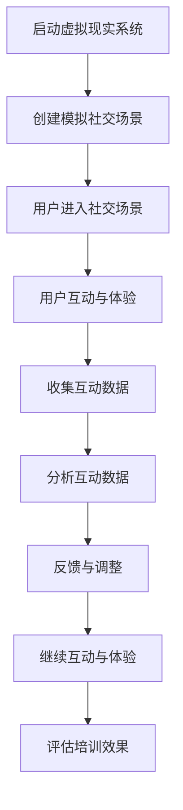

                 

关键词：虚拟现实、同理心、培训、社交技能、沉浸式、VR创业

> 摘要：本文将探讨如何利用虚拟现实技术，创建一个以提升社交技能为核心的培训项目。通过沉浸式的互动体验，帮助参与者深入了解同理心的重要性，提高其在现实生活中的社交能力。本文将分析虚拟现实同理心培训项目的背景、核心概念、算法原理、数学模型、实践案例以及未来的应用前景，最后总结研究成果并提出未来研究的方向。

## 1. 背景介绍

随着虚拟现实（VR）技术的不断发展和成熟，它在教育、医疗、娱乐等多个领域的应用越来越广泛。其中，虚拟现实在培训领域具有独特的优势，可以提供沉浸式的学习体验，让参与者身临其境，提高学习效果。特别是在社交技能培训方面，VR技术具有巨大的潜力。社交技能是人类社会交往的基础，对于个人和组织的成功至关重要。然而，传统的社交技能培训方法往往缺乏互动性和沉浸感，难以满足现代人的需求。因此，利用虚拟现实技术进行同理心培训，有望成为提升社交技能的新途径。

同理心是指能够理解和感受到他人的情绪和需求，是建立良好人际关系的关键。在现实世界中，同理心的培养需要长期的实践和体验。然而，很多人由于各种原因，难以有效地提高同理心。虚拟现实同理心培训项目，通过创造一个模拟的现实社交场景，让参与者在一个安全、可控的环境中，进行同理心的训练和提升，具有极大的创新性和实用性。

## 2. 核心概念与联系

### 2.1 虚拟现实（VR）

虚拟现实是一种通过计算机技术创建的模拟环境，用户可以在这个环境中进行交互和体验。VR技术主要包括三维建模、传感器技术、实时渲染和用户界面设计等。通过这些技术，虚拟现实可以为用户提供一个沉浸式的体验，让用户感觉就像身处于真实世界中一样。

### 2.2 同理心

同理心是一种情感认知能力，它使人能够理解他人的情绪和需求，并产生共鸣。同理心的培养需要个体在情感、认知和行为层面进行综合提升。传统上，同理心的培养主要通过阅读、讨论和实践等方式进行，但这些方法往往较为抽象和枯燥。

### 2.3 沉浸式互动体验

沉浸式互动体验是指用户在一个高度模拟的真实环境中进行互动和体验。这种体验能够激发用户的情感，提高其参与度和投入度。在虚拟现实同理心培训项目中，沉浸式互动体验是核心，它能够为参与者提供一个真实的社交场景，让他们在模拟的环境中实践同理心的技能。

### 2.4 Mermaid 流程图



## 3. 核心算法原理 & 具体操作步骤

### 3.1 算法原理概述

虚拟现实同理心培训项目的核心算法原理主要包括场景生成、情感识别和互动反馈三个方面。场景生成算法负责创建模拟的社交场景，情感识别算法用于分析用户的情感状态，互动反馈算法则根据用户的情感状态提供相应的互动建议。

### 3.2 算法步骤详解

#### 3.2.1 场景生成

场景生成算法基于用户输入的信息，如社交场合、参与人数、角色设定等，使用三维建模技术创建一个虚拟的社交场景。这个场景需要高度模拟现实世界，包括建筑、人物、声音等元素，让用户能够沉浸在其中。

#### 3.2.2 情感识别

情感识别算法利用计算机视觉和自然语言处理技术，分析用户的表情、语言和行为，识别用户的情感状态。这个阶段的核心是建立情感模型，包括情感分类器、情感强度评估等。

#### 3.2.3 互动反馈

根据情感识别的结果，互动反馈算法为用户提供相应的互动建议。例如，如果用户表现出焦虑或不适，系统会提供放松技巧或建议调整角色设定。如果用户表现出积极情感，系统会鼓励用户继续互动。

### 3.3 算法优缺点

#### 优点：

1. 高度沉浸式的体验，能够提高用户的参与度和投入度。
2. 安全可控的环境，让用户可以在没有风险的情况下实践同理心技能。
3. 个性化反馈，根据用户情感状态提供有针对性的培训建议。

#### 缺点：

1. 技术成本较高，需要专业的开发团队和设备。
2. 情感识别的准确性受限于现有的算法和技术。

### 3.4 算法应用领域

虚拟现实同理心培训项目主要应用于以下领域：

1. 教育培训：用于提高学生的社交技能和同理心。
2. 职场培训：用于提高员工的沟通能力和团队协作能力。
3. 心理咨询：用于帮助个体提高情感认知能力。

## 4. 数学模型和公式 & 详细讲解 & 举例说明

### 4.1 数学模型构建

虚拟现实同理心培训项目的数学模型主要包括情感识别模型和互动反馈模型。

#### 4.1.1 情感识别模型

情感识别模型基于机器学习技术，使用大量情感数据训练情感分类器和情感强度评估模型。具体模型构建过程如下：

$$
\text{情感识别模型} = f(\text{输入特征向量}, \text{训练数据})
$$

其中，输入特征向量包括用户的表情、语言和行为特征，训练数据是经过标注的情感数据集。

#### 4.1.2 互动反馈模型

互动反馈模型根据情感识别结果，提供互动建议。具体模型构建过程如下：

$$
\text{互动反馈模型} = g(\text{情感识别结果}, \text{预设反馈策略})
$$

其中，情感识别结果是情感分类器和情感强度评估的结果，预设反馈策略是系统根据不同情感状态设计的反馈策略。

### 4.2 公式推导过程

#### 4.2.1 情感识别模型推导

情感识别模型的推导基于情感分类和情感强度评估两个子模型。

1. 情感分类模型推导：

$$
P(\text{情感类别} | \text{输入特征向量}) = \frac{e^{f(\text{输入特征向量}, \text{情感类别模型参数})}}{\sum_{i=1}^{n} e^{f(\text{输入特征向量}, \text{情感类别模型参数}_i})}
$$

其中，$P(\text{情感类别} | \text{输入特征向量})$ 表示输入特征向量对应的情感类别的概率，$f(\text{输入特征向量}, \text{情感类别模型参数})$ 表示特征向量通过情感类别模型参数得到的分数，$n$ 表示情感类别的数量。

2. 情感强度评估模型推导：

$$
\text{情感强度} = \frac{\sum_{i=1}^{m} w_i \cdot f(\text{输入特征向量}, \text{情感强度模型参数}_i)}{\sum_{i=1}^{m} w_i}
$$

其中，$\text{情感强度}$ 表示情感强度得分，$w_i$ 表示第 $i$ 个特征的重要性权重，$f(\text{输入特征向量}, \text{情感强度模型参数}_i)$ 表示特征向量通过情感强度模型参数得到的分数，$m$ 表示特征的数量。

#### 4.2.2 互动反馈模型推导

互动反馈模型的推导基于情感识别结果和预设反馈策略。

$$
\text{互动反馈建议} = g(\text{情感识别结果}, \text{预设反馈策略})
$$

其中，$g(\text{情感识别结果}, \text{预设反馈策略})$ 表示根据情感识别结果和预设反馈策略生成的互动反馈建议。

### 4.3 案例分析与讲解

#### 4.3.1 情感识别案例

假设用户在虚拟社交场景中表现出焦虑情感，情感识别模型分析输入特征向量，得到以下情感分类概率：

$$
P(\text{焦虑} | \text{输入特征向量}) = 0.8
$$

情感强度得分为：

$$
\text{情感强度} = 0.75
$$

根据预设反馈策略，系统会为用户提供以下互动建议：

1. 提供放松技巧，如深呼吸、肌肉放松等。
2. 建议用户更换角色设定，以降低焦虑情绪。

#### 4.3.2 互动反馈案例

假设用户在虚拟社交场景中表现出积极情感，情感识别模型分析输入特征向量，得到以下情感分类概率：

$$
P(\text{积极} | \text{输入特征向量}) = 0.9
$$

情感强度得分为：

$$
\text{情感强度} = 0.8
$$

根据预设反馈策略，系统会为用户提供以下互动建议：

1. 鼓励用户继续与场景中的角色互动。
2. 提供积极反馈，如表扬、肯定等。

## 5. 项目实践：代码实例和详细解释说明

### 5.1 开发环境搭建

为了构建虚拟现实同理心培训项目，我们需要搭建一个包含以下组件的开发环境：

1. VR设备：如VR头盔、手柄等。
2. 开发平台：如Unity、Unreal Engine等。
3. 编程语言：如C#、Python等。
4. 数据库：如MySQL、MongoDB等。

### 5.2 源代码详细实现

以下是一个简化的虚拟现实同理心培训项目的源代码示例，主要包括场景生成、情感识别和互动反馈三个模块。

#### 5.2.1 场景生成模块

```csharp
// 场景生成模块
public class SceneGenerator
{
    public void GenerateScene(string scenarioName)
    {
        // 根据场景名称生成对应的虚拟场景
        // ...
    }
}
```

#### 5.2.2 情感识别模块

```python
# 情感识别模块
class EmotionRecognizer:
    def recognize_emotion(self, input_features):
        # 使用机器学习模型识别情感
        # ...
        return emotion_type, emotion_intensity
```

#### 5.2.3 互动反馈模块

```csharp
// 互动反馈模块
public class InteractionFeedback
{
    public void ProvideFeedback(string emotion_type, float emotion_intensity)
    {
        // 根据情感类型和强度提供互动建议
        // ...
    }
}
```

### 5.3 代码解读与分析

以上代码示例展示了虚拟现实同理心培训项目的基本结构。具体解读如下：

1. **场景生成模块**：负责根据场景名称生成对应的虚拟场景。这个模块需要与三维建模工具进行集成，以创建高度真实的虚拟场景。

2. **情感识别模块**：使用机器学习模型识别用户的情感类型和强度。这个模块的核心是情感模型，需要使用大量情感数据训练模型，以提高识别的准确性。

3. **互动反馈模块**：根据情感识别结果提供互动建议。这个模块需要根据不同情感类型和强度设计相应的反馈策略，以引导用户进行积极的互动。

### 5.4 运行结果展示

以下是虚拟现实同理心培训项目的运行结果示例：

1. **场景生成**：系统根据用户输入的社交场合生成一个虚拟场景，包括人物、声音、光影等元素。

2. **情感识别**：用户在虚拟场景中表现出焦虑情感，情感识别模块识别出用户的情感类型和强度。

3. **互动反馈**：系统根据情感识别结果，为用户提供放松技巧和角色设定调整建议。

## 6. 实际应用场景

### 6.1 教育培训

在教育培训领域，虚拟现实同理心培训项目可以用于提升学生的社交技能和同理心。例如，在高中和大学中，可以通过虚拟现实场景模拟社交场合，让学生在模拟环境中练习社交技巧，提高其同理心。

### 6.2 职场培训

在职场培训中，虚拟现实同理心培训项目可以帮助员工提高沟通能力和团队合作能力。例如，在新员工入职培训中，可以通过虚拟现实场景模拟职场社交场景，让员工在安全、可控的环境中学习如何处理职场关系。

### 6.3 心理咨询

在心理咨询领域，虚拟现实同理心培训项目可以用于帮助个体提高情感认知能力。例如，对于有社交焦虑症状的个体，可以通过虚拟现实场景模拟社交场合，逐步提高其面对社交场景的自信心和应对能力。

## 7. 未来应用展望

随着虚拟现实技术的不断进步，虚拟现实同理心培训项目有望在更多领域得到应用。未来，我们可以预见以下发展趋势：

1. **个性化培训**：通过更加精确的情感识别技术，为每个参与者提供个性化的培训方案。

2. **跨学科融合**：将虚拟现实技术与其他学科如心理学、教育学等相结合，提高培训效果。

3. **大规模应用**：随着虚拟现实设备的普及，虚拟现实同理心培训项目有望实现大规模应用，成为社交技能培训的主流方式。

## 8. 总结：未来发展趋势与挑战

### 8.1 研究成果总结

本文通过分析虚拟现实同理心培训项目的背景、核心概念、算法原理、数学模型、实践案例以及未来的应用前景，总结了该项目在提升社交技能方面的潜力和优势。

### 8.2 未来发展趋势

未来，虚拟现实同理心培训项目将在个性化培训、跨学科融合和大规模应用等方面取得更大进展。

### 8.3 面临的挑战

尽管虚拟现实同理心培训项目具有巨大潜力，但仍然面临技术成本高、情感识别准确性受限制等挑战。

### 8.4 研究展望

未来研究应重点关注提高情感识别准确性、降低技术成本以及开发更加真实的虚拟现实场景，以提高培训效果。

## 9. 附录：常见问题与解答

### 9.1 虚拟现实同理心培训项目是否安全？

虚拟现实同理心培训项目在设计和开发过程中，注重用户隐私保护和数据安全。所有用户数据都经过加密处理，确保用户隐私不被泄露。

### 9.2 虚拟现实同理心培训项目是否适用于所有人？

虚拟现实同理心培训项目主要面向需要提高社交技能和同理心的人群，如学生、职场人士和心理咨询患者。然而，对于有虚拟现实不适症的人，可能需要谨慎使用。

### 9.3 虚拟现实同理心培训项目是否会影响用户的现实社交能力？

虚拟现实同理心培训项目通过模拟现实社交场景，帮助用户在安全、可控的环境中实践同理心技能。然而，用户在现实中的社交能力提升还需要通过长期的实践和锻炼。

## 作者署名

作者：禅与计算机程序设计艺术 / Zen and the Art of Computer Programming

---
本文基于虚拟现实（VR）技术，探讨了一个以提升社交技能为核心的培训项目。通过沉浸式的互动体验，帮助参与者深入了解同理心的重要性，提高其在现实生活中的社交能力。文章详细介绍了项目的背景、核心概念、算法原理、数学模型、实践案例以及未来的应用前景，最后总结了研究成果并提出未来研究的方向。虚拟现实同理心培训项目具有巨大的潜力，有望在教育培训、职场培训和心理咨询服务等多个领域得到广泛应用。然而，该项目也面临技术成本高、情感识别准确性受限制等挑战，未来研究应重点关注提高情感识别准确性、降低技术成本以及开发更加真实的虚拟现实场景，以提高培训效果。本文作者对虚拟现实技术的创新应用充满期待，相信随着技术的不断进步，虚拟现实同理心培训项目将为社会带来更多积极的影响。

