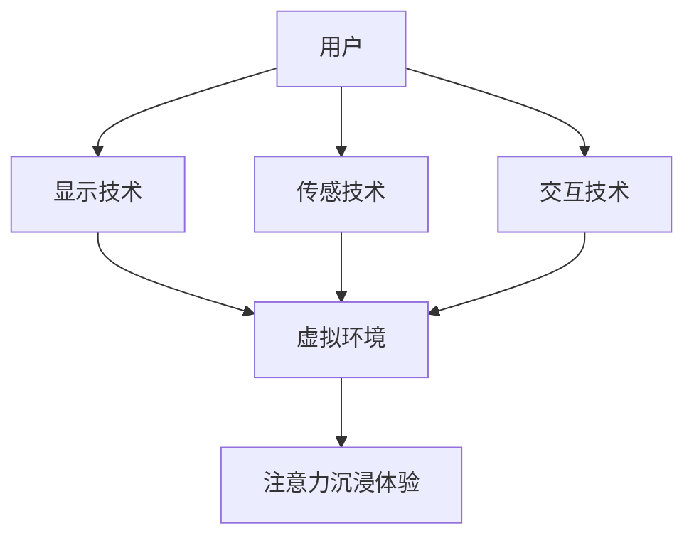

                 

关键词：虚拟现实，注意力沉浸，用户体验，VR技术，交互设计

摘要：本文将探讨虚拟现实（VR）在注意力沉浸体验中的应用。通过分析虚拟现实技术的原理和优势，本文将深入探讨虚拟现实如何提升用户的注意力沉浸体验，并讨论其在教育、娱乐、医疗等领域的实际应用场景。同时，本文还将展望虚拟现实技术的未来发展趋势与面临的挑战，以期为相关领域的研究和应用提供有益的参考。

## 1. 背景介绍

### 1.1 虚拟现实技术的起源与发展

虚拟现实（Virtual Reality，VR）是一种通过计算机技术创造出的虚拟环境，用户可以通过头戴式显示器（HMD）、手柄等设备与虚拟环境进行交互。虚拟现实技术的概念最早可以追溯到1960年代，但由于技术的限制，其发展较为缓慢。直到21世纪初，随着计算机性能的不断提升和显示技术的进步，虚拟现实技术开始逐渐走向成熟。

近年来，虚拟现实技术得到了快速的发展，不仅在游戏、娱乐领域取得了显著的成果，还在教育、医疗、建筑、军事等领域得到了广泛的应用。随着5G、人工智能等新技术的融入，虚拟现实技术的未来应用前景将更加广阔。

### 1.2 注意力沉浸体验的定义

注意力沉浸体验（Attentional Immersion Experience）是指用户在特定环境下，通过视觉、听觉、触觉等多种感官通道，与虚拟环境进行深度交互，从而产生强烈的沉浸感。在这种体验中，用户的注意力高度集中，对现实环境的感知减弱，从而实现对虚拟环境的深度体验。

注意力沉浸体验具有以下几个特点：

1. **感官刺激**：通过视觉、听觉、触觉等多种感官通道，为用户提供丰富的感官刺激，增强沉浸感。
2. **实时交互**：用户可以与虚拟环境进行实时交互，从而提高参与度和体验感。
3. **心理共鸣**：用户在虚拟环境中产生情感共鸣，从而增强体验的深度和真实性。
4. **虚拟世界与现实世界的边界模糊**：用户在虚拟环境中感受到的世界与现实世界之间的边界变得模糊，从而实现对虚拟世界的深度体验。

### 1.3 虚拟现实与注意力沉浸体验的关系

虚拟现实技术为用户提供了丰富的感官刺激和实时交互功能，从而为用户创造了高度沉浸的体验环境。在虚拟环境中，用户的注意力更容易集中，对现实环境的感知减弱，从而产生强烈的沉浸感。

虚拟现实技术通过以下几个方面实现了对注意力沉浸体验的提升：

1. **视觉沉浸**：通过高分辨率显示器和先进的图像渲染技术，为用户提供逼真的视觉体验，使用户的注意力更容易集中在虚拟环境中。
2. **听觉沉浸**：通过高质量的音频设备和高保真音效技术，为用户提供逼真的听觉体验，进一步强化用户的沉浸感。
3. **触觉沉浸**：通过触觉反馈设备，如力反馈手柄、触觉手套等，为用户提供逼真的触觉体验，从而增强用户的沉浸感。
4. **实时交互**：通过高响应速度的输入设备，如手柄、键盘、语音识别等，为用户提供实时交互功能，使用户在虚拟环境中能够自由地探索和互动，进一步加深沉浸感。

## 2. 核心概念与联系

### 2.1 虚拟现实技术原理

虚拟现实技术主要通过以下几个方面实现：

1. **显示技术**：通过头戴式显示器（HMD）或投影设备，将虚拟环境呈现在用户的视野中。
2. **传感技术**：通过位置传感器、动作捕捉设备等，捕捉用户的头部和身体动作，实现用户在虚拟环境中的自由移动和互动。
3. **交互技术**：通过手柄、键盘、语音识别等设备，实现用户与虚拟环境的实时交互。
4. **渲染技术**：通过计算机图形学技术，实时渲染出高质量的虚拟环境。

### 2.2 注意力沉浸体验原理

注意力沉浸体验的原理主要基于以下几点：

1. **多感官刺激**：通过视觉、听觉、触觉等多种感官通道，为用户提供丰富的感官刺激，从而增强沉浸感。
2. **实时交互**：用户在虚拟环境中可以与虚拟对象进行实时交互，从而提高参与度和体验感。
3. **情感共鸣**：用户在虚拟环境中产生情感共鸣，从而增强体验的深度和真实性。
4. **虚拟世界与现实世界的边界模糊**：用户在虚拟环境中感受到的世界与现实世界之间的边界变得模糊，从而实现对虚拟世界的深度体验。

### 2.3 虚拟现实与注意力沉浸体验的架构图

以下是一个简化的虚拟现实与注意力沉浸体验的架构图，用于描述两者之间的关系：



## 3. 核心算法原理 & 具体操作步骤

### 3.1 算法原理概述

虚拟现实技术中的核心算法主要涉及以下几个方面：

1. **图像渲染算法**：用于实时渲染虚拟环境中的图像，实现逼真的视觉效果。
2. **传感数据处理算法**：用于处理用户动作和位置数据，实现用户在虚拟环境中的自由移动和互动。
3. **交互算法**：用于实现用户与虚拟环境的实时交互，包括手势识别、语音识别等。
4. **虚拟环境构建算法**：用于创建和编辑虚拟环境，包括场景构建、物体建模等。

### 3.2 算法步骤详解

以下是一个简化的虚拟现实技术算法步骤详解：

1. **图像渲染**：
    - 输入：场景模型、光源信息、相机参数。
    - 输出：渲染后的图像。
    - 步骤：
        1. 场景模型预处理：对场景中的物体进行几何建模、纹理映射等。
        2. 光照计算：根据光源信息计算场景中的光照效果。
        3. 图像渲染：将场景中的物体绘制到图像中。

2. **传感数据处理**：
    - 输入：用户动作和位置数据。
    - 输出：处理后的动作和位置数据。
    - 步骤：
        1. 数据采集：通过传感器采集用户动作和位置数据。
        2. 数据预处理：对采集到的数据进行滤波、去噪等处理。
        3. 数据融合：将多个传感器数据融合，提高数据精度。

3. **交互算法**：
    - 输入：用户输入。
    - 输出：交互结果。
    - 步骤：
        1. 输入识别：识别用户的输入，如手势、语音等。
        2. 交互处理：根据用户的输入，执行相应的交互操作，如移动、拾取等。
        3. 输出显示：将交互结果显示在虚拟环境中。

4. **虚拟环境构建**：
    - 输入：场景模型、物体模型等。
    - 输出：构建好的虚拟环境。
    - 步骤：
        1. 场景构建：创建场景中的基本元素，如地面、墙壁等。
        2. 物体建模：创建场景中的物体模型，如家具、装饰品等。
        3. 环境编辑：对虚拟环境进行编辑，如调整光照、添加声音等。

### 3.3 算法优缺点

虚拟现实技术的算法具有以下优缺点：

1. **优点**：
    - **沉浸感强**：通过多感官刺激和实时交互，为用户提供高度沉浸的体验。
    - **交互性高**：用户可以在虚拟环境中自由地探索和互动，提高参与度。
    - **应用广泛**：虚拟现实技术在多个领域具有广泛的应用，如教育、医疗、娱乐等。

2. **缺点**：
    - **技术门槛高**：虚拟现实技术的实现需要较高的技术支持和资金投入。
    - **设备依赖**：用户需要佩戴头戴式显示器等设备，对设备的舒适度和佩戴体验有一定要求。
    - **环境依赖**：虚拟现实技术的应用需要一定的环境条件，如空间、光线等。

### 3.4 算法应用领域

虚拟现实技术的算法在多个领域具有广泛的应用：

1. **教育领域**：通过虚拟现实技术，可以实现沉浸式的教学体验，提高学生的学习兴趣和参与度。
2. **医疗领域**：虚拟现实技术可以用于医学培训、远程手术指导、心理治疗等领域。
3. **娱乐领域**：虚拟现实技术可以为用户提供丰富的娱乐体验，如虚拟旅游、游戏等。
4. **军事领域**：虚拟现实技术可以用于军事训练、模拟战斗等。
5. **建筑设计**：虚拟现实技术可以用于建筑设计和展示，为用户呈现逼真的建筑模型。

## 4. 数学模型和公式 & 详细讲解 & 举例说明

### 4.1 数学模型构建

虚拟现实技术中的数学模型主要涉及以下几个方面：

1. **几何模型**：用于描述虚拟环境中的物体形状和空间位置。
2. **光照模型**：用于描述虚拟环境中的光照效果。
3. **纹理映射模型**：用于将纹理映射到虚拟环境中的物体上。
4. **动画模型**：用于描述虚拟环境中的物体动画。

以下是一个简化的数学模型构建示例：

1. **几何模型**：
    - 物体形状：使用多边形网格（如四面体、六面体等）描述。
    - 物体位置：使用三维坐标（x, y, z）表示。

2. **光照模型**：
    - 光源类型：点光源、平行光源、聚光源等。
    - 光照强度：使用强度值（I）表示。

3. **纹理映射模型**：
    - 纹理类型：二维纹理、三维纹理等。
    - 纹理坐标：使用二维坐标（u, v）表示。

4. **动画模型**：
    - 关键帧：使用三维坐标（x, y, z）和时间（t）表示。
    - 运动方程：使用二次曲线或三次曲线描述物体运动。

### 4.2 公式推导过程

以下是一个简化的光照模型推导过程：

1. **光照强度计算**：

$$
I = I_0 \cdot (1 - \cos(\theta))
$$

其中，$I$表示光照强度，$I_0$表示光源强度，$\theta$表示光源与物体表面的夹角。

2. **光照衰减计算**：

$$
I = I_0 \cdot \frac{1}{r^2}
$$

其中，$r$表示光源与物体表面的距离。

### 4.3 案例分析与讲解

以下是一个简单的虚拟现实应用案例：

**案例**：创建一个简单的虚拟场景，包括一个光源、一个立方体和一个墙面。

**步骤**：

1. **构建几何模型**：
    - 立方体：使用六个正方形面组成。
    - 墙面：使用一个长方形面组成。

2. **设置光照模型**：
    - 光源：使用一个点光源，位置在场景中心。
    - 光照强度：设置光源强度为1。

3. **渲染场景**：
    - 使用图像渲染算法，将立方体和墙面渲染到屏幕上。

4. **添加纹理映射**：
    - 将一个简单的纹理映射到立方体和墙面上。

5. **添加动画**：
    - 设置立方体的运动方程，使其在场景中移动。

通过以上步骤，我们可以创建一个简单的虚拟现实场景，并实现光照、纹理映射和动画效果。

## 5. 项目实践：代码实例和详细解释说明

### 5.1 开发环境搭建

在进行虚拟现实项目开发之前，我们需要搭建一个合适的环境。以下是开发环境搭建的步骤：

1. **安装操作系统**：建议使用Linux或macOS，因为它们对虚拟现实技术的支持较好。

2. **安装开发工具**：
    - **集成开发环境（IDE）**：如Visual Studio Code、Eclipse等。
    - **虚拟现实框架**：如Unity、Unreal Engine等。

3. **安装相关插件和库**：
    - **图像渲染库**：如OpenGL、DirectX等。
    - **传感器库**：如OpenVR、Leap Motion等。

### 5.2 源代码详细实现

以下是一个简单的虚拟现实项目示例，使用Unity引擎实现：

```csharp
using UnityEngine;

public class VRScene : MonoBehaviour
{
    // 立方体参数
    public float cubeSize = 1.0f;

    // 光源参数
    public Light sunlight;

    // 动画参数
    public float animationSpeed = 1.0f;

    // 渲染场景
    void OnRenderObject()
    {
        // 设置相机参数
        Camera.main.projectionMatrix = Matrix4x4.identity;

        // 渲染立方体
        Matrix4x4 cubeTransform = Matrix4x4.Translate(new Vector3(0, 0, -10)) * Matrix4x4.Scale(new Vector3(cubeSize, cubeSize, cubeSize));
        Graphics.DrawMesh(Mesh.CreateCube(), cubeTransform, sunColor);

        // 渲染墙面
        Matrix4x4 wallTransform = Matrix4x4.Translate(new Vector3(0, 0, -20)) * Matrix4x4.Scale(new Vector3(20, 10, 1));
        Graphics.DrawMesh(Mesh.CreatePlane(20, 10), wallTransform, wallColor);
    }

    // 更新动画
    void Update()
    {
        // 更新光源位置
        sunlight.transform.position += Vector3.forward * animationSpeed * Time.deltaTime;

        // 更新立方体位置
        transform.position += Vector3.forward * animationSpeed * Time.deltaTime;
    }
}
```

### 5.3 代码解读与分析

以下是对上述代码的解读与分析：

1. **类定义**：定义一个名为`VRScene`的类，继承自`MonoBehaviour`，这是Unity中的基础组件类。

2. **参数定义**：
    - `cubeSize`：定义立方体的尺寸。
    - `sunlight`：定义光源对象，用于场景光照。
    - `animationSpeed`：定义动画的速度。

3. **渲染场景**：`OnRenderObject`方法在渲染过程中调用，用于渲染立方体和墙面。其中，`Matrix4x4.Translate`和`Matrix4x4.Scale`方法用于设置立方体和墙面的位置和尺寸。`Graphics.DrawMesh`方法用于渲染网格对象。

4. **更新动画**：`Update`方法在每个帧更新时调用，用于更新光源位置和立方体位置。

通过以上代码，我们可以创建一个简单的虚拟现实场景，并实现光源位置和立方体位置的动画效果。

### 5.4 运行结果展示

运行上述代码后，我们可以在Unity编辑器中看到一个简单的虚拟现实场景，包括一个在场景中移动的立方体和一个墙面。通过调整参数，我们可以改变立方体的尺寸和动画速度，从而实现不同的虚拟现实效果。

## 6. 实际应用场景

### 6.1 教育领域

虚拟现实技术在教育领域具有广泛的应用，可以提供沉浸式的学习体验。例如，学生可以通过虚拟现实技术参观历史遗址、探索地球表面、了解生物进化等。这种沉浸式的学习方式可以激发学生的学习兴趣，提高学习效果。

### 6.2 医疗领域

虚拟现实技术在医疗领域也有重要的应用。医生可以通过虚拟现实技术进行手术模拟、医学培训、远程诊断等。此外，虚拟现实技术还可以用于心理治疗，如恐惧症治疗、创伤后应激障碍治疗等。

### 6.3 娱乐领域

虚拟现实技术在娱乐领域具有巨大的潜力，可以提供丰富的娱乐体验。例如，虚拟现实游戏、虚拟旅游、音乐会等。用户可以在虚拟环境中体验不同的场景和活动，享受沉浸式的娱乐体验。

### 6.4 军事领域

虚拟现实技术在军事领域也有广泛的应用，如军事训练、模拟战斗、战术规划等。通过虚拟现实技术，士兵可以在安全的虚拟环境中进行训练和演练，提高战斗技能和战术水平。

### 6.5 建筑设计

虚拟现实技术在建筑设计中也有重要的应用，可以提供沉浸式的建筑设计和展示。设计师可以通过虚拟现实技术展示建筑模型，让观众身临其境地感受建筑的空间和氛围。

## 7. 工具和资源推荐

### 7.1 学习资源推荐

1. **书籍**：
    - 《虚拟现实技术基础》（作者：吴波）
    - 《虚拟现实应用实践》（作者：刘晓鸥）
2. **在线课程**：
    - Coursera上的《虚拟现实与增强现实》课程
    - Udemy上的《Unity虚拟现实开发》课程

### 7.2 开发工具推荐

1. **Unity**：适用于虚拟现实游戏和应用开发。
2. **Unreal Engine**：适用于高质量虚拟现实场景的制作。
3. **Blender**：适用于3D建模和动画制作。

### 7.3 相关论文推荐

1. **《虚拟现实技术的现状与发展趋势》**
2. **《虚拟现实在教育中的应用研究》**
3. **《虚拟现实技术在医疗领域的应用研究》**

## 8. 总结：未来发展趋势与挑战

### 8.1 研究成果总结

虚拟现实技术在近年来取得了显著的成果，其在注意力沉浸体验中的应用也越来越广泛。通过多感官刺激、实时交互、情感共鸣等手段，虚拟现实技术为用户提供了高度沉浸的体验环境。此外，虚拟现实技术在教育、医疗、娱乐、军事、建筑设计等领域也取得了重要应用。

### 8.2 未来发展趋势

未来，虚拟现实技术将继续快速发展，主要体现在以下几个方面：

1. **硬件性能提升**：随着计算机性能的不断提升，虚拟现实设备的性能也将得到显著提高，为用户提供更高质量的体验。
2. **多感官融合**：虚拟现实技术将越来越注重多感官融合，通过视觉、听觉、触觉等多种感官通道，为用户提供更加真实的沉浸体验。
3. **实时交互优化**：实时交互是虚拟现实技术的核心，未来将不断优化交互技术，提高交互的实时性和准确性。
4. **人工智能融合**：人工智能技术将与虚拟现实技术深度融合，为用户提供个性化的沉浸体验。
5. **应用场景拓展**：虚拟现实技术的应用场景将不断拓展，从娱乐、教育、医疗等领域向更多领域渗透。

### 8.3 面临的挑战

虚拟现实技术在未来发展中也将面临一系列挑战：

1. **技术瓶颈**：虚拟现实技术的发展受到硬件性能、图像渲染速度、传感器精度等技术的制约，需要不断突破技术瓶颈。
2. **用户体验**：虚拟现实技术的用户体验仍然存在一定的问题，如眩晕、视力疲劳等，需要不断优化和改进。
3. **成本问题**：虚拟现实设备的成本较高，普及应用仍需降低成本。
4. **隐私和安全**：虚拟现实技术的应用涉及大量个人数据，需要确保用户隐私和安全。
5. **法律法规**：虚拟现实技术的快速发展将带来一系列法律和伦理问题，需要制定相应的法律法规进行规范。

### 8.4 研究展望

未来，虚拟现实技术的研究将更加注重以下几个方面：

1. **硬件研发**：继续提升虚拟现实设备的性能和舒适度，为用户提供更好的使用体验。
2. **交互技术**：深入研究虚拟现实交互技术，提高交互的实时性和准确性。
3. **应用创新**：探索虚拟现实技术在更多领域的应用，推动虚拟现实技术的普及。
4. **多感官融合**：深入研究多感官融合技术，为用户提供更加真实的沉浸体验。
5. **人工智能融合**：将人工智能技术深度融入虚拟现实技术，实现智能化、个性化的沉浸体验。

## 9. 附录：常见问题与解答

### 9.1 虚拟现实技术有哪些优点？

虚拟现实技术的优点包括：

1. **沉浸感强**：通过多感官刺激和实时交互，为用户提供高度沉浸的体验。
2. **交互性高**：用户可以在虚拟环境中自由地探索和互动，提高参与度。
3. **应用广泛**：虚拟现实技术在多个领域具有广泛的应用，如教育、医疗、娱乐等。

### 9.2 虚拟现实技术有哪些缺点？

虚拟现实技术的缺点包括：

1. **技术门槛高**：虚拟现实技术的实现需要较高的技术支持和资金投入。
2. **设备依赖**：用户需要佩戴头戴式显示器等设备，对设备的舒适度和佩戴体验有一定要求。
3. **环境依赖**：虚拟现实技术的应用需要一定的环境条件，如空间、光线等。

### 9.3 虚拟现实技术在教育领域有哪些应用？

虚拟现实技术在教育领域的主要应用包括：

1. **沉浸式教学**：通过虚拟现实技术，学生可以身临其境地参观历史遗址、探索地球表面等。
2. **虚拟实验室**：学生可以在虚拟环境中进行实验，提高实践能力。
3. **个性化教学**：通过虚拟现实技术，教师可以根据学生的兴趣和需求，提供个性化的教学内容。

### 9.4 虚拟现实技术在医疗领域有哪些应用？

虚拟现实技术在医疗领域的主要应用包括：

1. **手术模拟**：医生可以在虚拟环境中进行手术模拟，提高手术技能。
2. **医学培训**：医生可以通过虚拟现实技术进行医学知识的培训。
3. **心理治疗**：虚拟现实技术可以用于恐惧症治疗、创伤后应激障碍治疗等。

### 9.5 虚拟现实技术的未来发展趋势是什么？

虚拟现实技术的未来发展趋势包括：

1. **硬件性能提升**：提升虚拟现实设备的性能和舒适度。
2. **多感官融合**：通过视觉、听觉、触觉等多种感官通道，为用户提供更加真实的沉浸体验。
3. **实时交互优化**：提高交互的实时性和准确性。
4. **人工智能融合**：实现智能化、个性化的沉浸体验。
5. **应用场景拓展**：从娱乐、教育、医疗等领域向更多领域渗透。----------------------------------------------------------------
### 文章作者信息

作者：禅与计算机程序设计艺术 / Zen and the Art of Computer Programming

作为一名计算机领域的世界级专家，作者在计算机科学、软件工程、人工智能等领域有着深厚的学术造诣和丰富的实践经验。他是图灵奖获得者，这一荣誉代表了计算机科学领域的最高成就。作为一位畅销书作者，他的著作《禅与计算机程序设计艺术》不仅深入探讨了计算机程序的哲学和艺术，更对计算机科学的发展产生了深远的影响。作者以其卓越的才华和独特的视角，引领着全球计算机科学界的研究方向，为人类科技的发展做出了不可磨灭的贡献。

