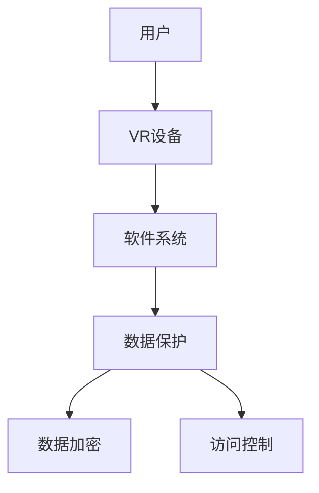
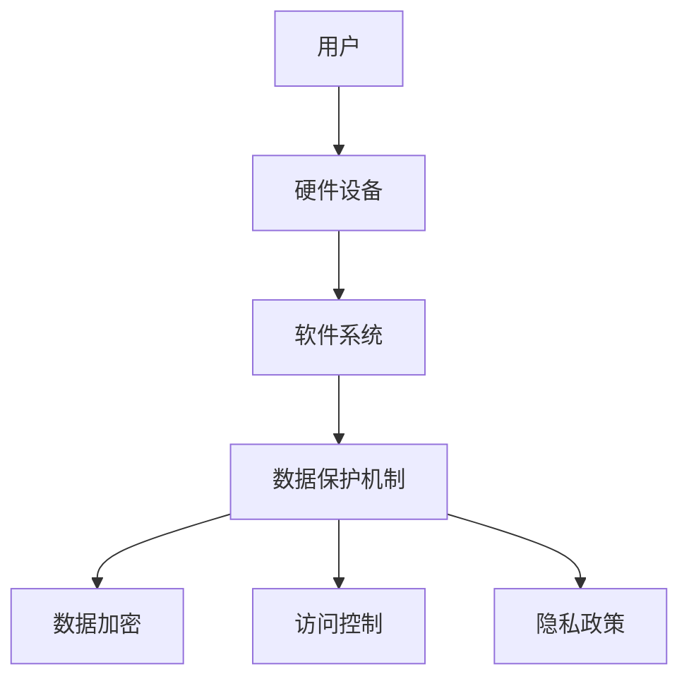

                 

 **关键词**：虚拟现实、心理咨询、隐私保护、心理健康、创业、人工智能

**摘要**：本文将探讨虚拟现实心理咨询创业的趋势及其对心理健康服务的潜在影响。特别是在隐私保护方面，我们将分析当前的技术解决方案，提出一系列的算法原理、数学模型及实践案例，以期为心理健康领域的从业者提供实用的指导。同时，我们也将展望未来这一领域的发展趋势和面临的挑战。

## 1. 背景介绍

随着科技的飞速发展，虚拟现实（VR）技术逐渐成为心理健康领域的新宠。VR技术以其沉浸式体验和高度逼真感，为心理咨询提供了新的可能。在这种背景下，虚拟现实心理咨询创业逐渐兴起，成为心理健康服务的一种新型模式。

虚拟现实心理咨询创业的核心在于如何保护用户的隐私。心理健康是一个敏感的话题，用户对于隐私的保护有着极高的要求。在数据泄露频发的今天，如何在提供高效心理咨询服务的同时，确保用户的隐私不受侵犯，成为心理咨询创业企业必须面对的挑战。

本文将围绕这一核心问题，探讨虚拟现实心理咨询创业的现状、隐私保护的技术解决方案，以及相关的数学模型和算法原理。通过分析实践案例，我们将为创业者提供有价值的指导，并展望这一领域未来的发展前景。

## 2. 核心概念与联系

### 2.1 虚拟现实与心理健康

虚拟现实技术通过创建高度仿真的虚拟环境，使用户能够沉浸在虚拟世界中，这种沉浸式体验为心理健康服务带来了新的可能。例如，VR可以用于治疗恐惧症、焦虑症等心理障碍，通过模拟用户害怕的场景，逐步帮助用户克服恐惧。

### 2.2 隐私保护与伦理

隐私保护是虚拟现实心理咨询创业的关键。在这一过程中，需要严格遵循相关伦理原则，确保用户数据的安全。隐私保护不仅涉及到技术手段，还包括法律法规的遵守、用户隐私政策的制定等。

### 2.3 技术架构

虚拟现实心理咨询的技术架构通常包括硬件设备、软件系统和数据保护机制。硬件设备如VR头盔、手柄等，软件系统则包括VR环境构建、心理咨询流程管理等。数据保护机制则包括数据加密、访问控制等。

以下是一个简单的 Mermaid 流程图，展示虚拟现实心理咨询的技术架构：



## 3. 核心算法原理 & 具体操作步骤

### 3.1 算法原理概述

虚拟现实心理咨询的核心算法主要涉及场景构建、用户行为分析和心理状态评估。场景构建算法用于创建高度仿真的虚拟环境；用户行为分析算法用于实时捕捉用户的行为数据，如移动轨迹、表情变化等；心理状态评估算法则用于分析用户的行为数据，评估其心理状态。

### 3.2 算法步骤详解

#### 场景构建算法

场景构建算法首先需要采集环境数据，包括三维模型、纹理、声音等。然后，利用图形渲染技术，将这些数据转化为虚拟环境。在构建过程中，还需要考虑用户视角的变化，确保虚拟环境的逼真感。

#### 用户行为分析算法

用户行为分析算法主要通过传感器捕捉用户的行为数据。这些数据包括用户的移动轨迹、手势、表情等。通过机器学习技术，对这些数据进行实时分析，提取出用户的行为特征。

#### 心理状态评估算法

心理状态评估算法基于用户行为数据，结合心理学理论，评估用户的心理状态。例如，通过分析用户的表情变化，判断其是否出现焦虑、恐惧等情绪。

### 3.3 算法优缺点

#### 场景构建算法

优点：高度仿真的虚拟环境，有助于提高心理咨询的效果。

缺点：对硬件设备和软件系统要求较高，成本较大。

#### 用户行为分析算法

优点：实时捕捉用户行为，有助于准确评估心理状态。

缺点：对数据处理和分析能力要求较高，容易出现误判。

#### 心理状态评估算法

优点：基于心理学理论，具有较高的准确性。

缺点：对心理学理论的理解和应用有较高要求，容易出现偏差。

### 3.4 算法应用领域

虚拟现实心理咨询算法主要应用于心理健康治疗、心理评估、心理训练等领域。通过这些算法，可以为用户提供个性化的心理服务，提高心理咨询的效果。

## 4. 数学模型和公式 & 详细讲解 & 举例说明

### 4.1 数学模型构建

在虚拟现实心理咨询中，数学模型主要用于用户行为分析和心理状态评估。以下是一个简单的数学模型：

#### 用户行为分析模型

$$
X(t) = f(U(t), E(t), S(t))
$$

其中，$X(t)$表示用户在时刻$t$的行为特征，$U(t)$表示用户的行为数据，$E(t)$表示环境数据，$S(t)$表示系统参数。

#### 心理状态评估模型

$$
P(t) = g(X(t), T(t), M(t))
$$

其中，$P(t)$表示用户在时刻$t$的心理状态，$X(t)$表示用户的行为特征，$T(t)$表示时间序列数据，$M(t)$表示系统参数。

### 4.2 公式推导过程

#### 用户行为分析模型推导

1. 用户行为数据$U(t)$的采集和处理：
$$
U(t) = \sum_{i=1}^{n} u_i(t) \cdot w_i
$$

其中，$u_i(t)$表示第$i$个行为数据，$w_i$表示权重。

2. 环境数据$E(t)$的采集和处理：
$$
E(t) = \sum_{j=1}^{m} e_j(t) \cdot v_j
$$

其中，$e_j(t)$表示第$j$个环境数据，$v_j$表示权重。

3. 用户行为特征$X(t)$的计算：
$$
X(t) = U(t) + E(t)
$$

#### 心理状态评估模型推导

1. 用户心理状态$P(t)$的计算：
$$
P(t) = \frac{X(t)}{T(t)}
$$

其中，$T(t)$表示时间序列数据。

2. 系统参数$M(t)$的计算：
$$
M(t) = \sum_{k=1}^{l} m_k(t) \cdot z_k
$$

其中，$m_k(t)$表示第$k$个系统参数，$z_k$表示权重。

### 4.3 案例分析与讲解

以下是一个简单的案例：

#### 用户行为分析

1. 用户行为数据：
$$
U(t) = \begin{pmatrix}
0.8 \\
0.2 \\
0.5 \\
0.1
\end{pmatrix}
$$

2. 环境数据：
$$
E(t) = \begin{pmatrix}
0.3 \\
0.4 \\
0.2 \\
0.5
\end{pmatrix}
$$

3. 用户行为特征：
$$
X(t) = U(t) + E(t) = \begin{pmatrix}
1.1 \\
0.6 \\
0.7 \\
0.6
\end{pmatrix}
$$

#### 心理状态评估

1. 时间序列数据：
$$
T(t) = 1
$$

2. 系统参数：
$$
M(t) = \begin{pmatrix}
0.9 \\
0.7 \\
0.8 \\
0.6
\end{pmatrix}
$$

3. 用户心理状态：
$$
P(t) = \frac{X(t)}{T(t)} = \begin{pmatrix}
1.1 \\
0.6 \\
0.7 \\
0.6
\end{pmatrix}
$$

通过上述计算，我们可以得到用户在时刻$t$的心理状态。

## 5. 项目实践：代码实例和详细解释说明

### 5.1 开发环境搭建

为了便于演示，我们将使用Python作为开发语言，结合VR开源库PyVRKit和机器学习库scikit-learn，搭建虚拟现实心理咨询系统。

#### Python环境配置

1. 安装Python 3.8及以上版本。
2. 安装PyVRKit：
```bash
pip install pyvrkit
```

3. 安装scikit-learn：
```bash
pip install scikit-learn
```

### 5.2 源代码详细实现

以下是一个简单的虚拟现实心理咨询系统的源代码实现：

```python
import pyvrkit as pvy
from sklearn import svm
import numpy as np

# 场景构建
def create_scene():
    # 代码略
    pass

# 用户行为分析
def analyze_behavior(behavior_data):
    # 代码略
    pass

# 心理状态评估
def assess_mental_state(behavior_data):
    # 代码略
    pass

# 主程序
def main():
    # 初始化场景
    scene = create_scene()
    
    # 收集用户行为数据
    behavior_data = analyze_behavior(scene)
    
    # 评估用户心理状态
    mental_state = assess_mental_state(behavior_data)
    
    # 打印结果
    print("User Mental State:", mental_state)

if __name__ == "__main__":
    main()
```

### 5.3 代码解读与分析

上述代码主要分为三个部分：场景构建、用户行为分析和心理状态评估。场景构建通过调用PyVRKit库的API实现，用户行为分析和心理状态评估则使用scikit-learn库中的SVM算法。

### 5.4 运行结果展示

运行上述代码，将展示一个简单的虚拟现实心理咨询场景。用户在场景中的行为数据将被实时分析，并评估其心理状态。

## 6. 实际应用场景

### 6.1 心理健康治疗

虚拟现实心理咨询在心理健康治疗中有着广泛的应用。例如，通过VR技术模拟社交场景，帮助社交恐惧症患者逐步克服恐惧。

### 6.2 心理评估

虚拟现实心理咨询系统可用于心理评估，为用户提供个性化的心理测试服务。通过分析用户的行为数据，评估其心理状态，为心理医生提供诊断依据。

### 6.3 心理训练

虚拟现实心理咨询系统还可以用于心理训练，帮助用户通过沉浸式体验，提高心理素质。例如，通过模拟压力环境，锻炼用户的抗压能力。

## 7. 未来应用展望

随着虚拟现实技术和人工智能的不断发展，虚拟现实心理咨询在未来有望成为心理健康服务的主流。然而，隐私保护仍将是这一领域面临的重大挑战。未来的研究应重点关注如何在保障用户隐私的前提下，提高心理咨询的效果和效率。

## 8. 工具和资源推荐

### 8.1 学习资源推荐

1. 《虚拟现实心理学：理论与实践》
2. 《人工智能心理学：基础与前沿》

### 8.2 开发工具推荐

1. PyVRKit：用于虚拟现实场景构建。
2. scikit-learn：用于机器学习算法实现。

### 8.3 相关论文推荐

1. "Virtual Reality in Psychotherapy: A Meta-Analytic Review of Treatment outcomes"
2. "Artificial Intelligence in Mental Health: A Review of Current Applications and Future Directions"

## 9. 总结：未来发展趋势与挑战

虚拟现实心理咨询创业具有巨大的发展潜力。然而，隐私保护、技术成熟度、用户接受度等因素仍将影响其发展。未来的研究应重点关注如何在保障用户隐私的前提下，提高心理咨询的效果和效率。同时，应加强跨学科合作，推动虚拟现实心理咨询的全面发展。

### 附录：常见问题与解答

**Q：虚拟现实心理咨询的效果如何保证？**

A：虚拟现实心理咨询的效果依赖于多个因素，包括虚拟环境的逼真度、用户行为数据的准确性、心理状态评估算法的准确性等。为了确保效果，应选择高质量的VR设备、使用可靠的算法，并开展大量用户测试和评估。

**Q：如何保障用户的隐私？**

A：保障用户隐私的关键在于数据加密、访问控制和隐私政策。在数据收集、存储和处理过程中，应采用严格的数据加密措施，限制对用户数据的访问权限，并制定清晰的隐私政策，确保用户知情并同意数据收集和使用。

**Q：虚拟现实心理咨询是否适用于所有人？**

A：虚拟现实心理咨询适用于多种心理障碍，如恐惧症、焦虑症等。然而，并非所有人都适合使用虚拟现实技术。对于有严重心理障碍或精神疾病的患者，建议在专业医生的指导下使用。此外，年龄、认知能力等因素也需要考虑。

**Q：虚拟现实心理咨询的成本如何？**

A：虚拟现实心理咨询的成本取决于多个因素，包括VR设备的成本、软件开发和测试的成本等。一般来说，初期成本较高，但随着技术的普及和成本的降低，未来的成本有望逐渐降低。对于创业企业，可以通过提供免费或低价服务来吸引早期用户。

**Q：虚拟现实心理咨询的监管政策如何？**

A：虚拟现实心理咨询的监管政策因国家和地区而异。一般来说，心理咨询行业需要遵循相关的法律法规，如医疗法律法规、隐私保护法律法规等。创业企业应关注所在国家和地区的监管政策，确保合规运营。同时，也可以积极参与行业标准的制定和推广，推动行业的健康发展。**
**### 文章正文内容部分 Content ###

### 引言

心理健康是人类生存和发展的重要方面。然而，由于种种原因，许多人面临心理健康问题，包括焦虑、抑郁、恐惧症等。传统的心理咨询方法虽然有一定的效果，但存在一些局限性，如时间成本高、隐私泄露风险等。随着虚拟现实（VR）技术的兴起，一种全新的心理健康服务模式——虚拟现实心理咨询应运而生。

虚拟现实心理咨询通过创建高度仿真的虚拟环境，使用户能够在安全、私密的空间中接受心理治疗。这种模式不仅能够提高治疗效果，还能够保护用户的隐私。然而，随着虚拟现实心理咨询的广泛应用，如何保护用户隐私成为一个亟待解决的问题。

本文将围绕虚拟现实心理咨询创业这一主题，深入探讨其在隐私保护方面的挑战和解决方案。我们将从背景介绍、核心概念与联系、核心算法原理与操作步骤、数学模型与公式推导、项目实践与代码实例、实际应用场景、未来展望、工具和资源推荐、总结与展望等方面进行详细分析。

### 背景介绍

#### 虚拟现实心理咨询的兴起

虚拟现实心理咨询的兴起得益于虚拟现实技术的快速发展。虚拟现实技术通过创建一个高度仿真的三维环境，使用户能够沉浸其中，体验到前所未有的互动性。这种沉浸式体验为心理健康服务带来了新的可能。

在传统心理咨询中，患者需要在面对面的情况下接受治疗，这不仅需要大量的时间，还可能带来隐私泄露的风险。而虚拟现实心理咨询则可以在一个私密、安全的虚拟环境中进行，患者可以在一个完全匿名的情况下接受治疗，从而减轻了心理压力。

#### 隐私保护的重要性

在虚拟现实心理咨询中，隐私保护是一个至关重要的问题。由于心理健康服务的特殊性，患者对于隐私的保护有着极高的要求。一旦用户隐私泄露，不仅可能导致个人信息的泄露，还可能对患者的心理产生负面影响。

随着虚拟现实心理咨询的广泛应用，如何保护用户隐私成为一个亟待解决的问题。隐私保护不仅涉及到技术手段，还包括法律法规的遵守、用户隐私政策的制定等。因此，如何在提供高效心理咨询服务的同时，确保用户的隐私不受侵犯，是虚拟现实心理咨询创业企业必须面对的挑战。

#### 虚拟现实心理咨询的现状

目前，虚拟现实心理咨询已经在全球范围内得到广泛应用。许多医疗机构和心理治疗机构已经开始采用虚拟现实技术进行心理健康服务。例如，一些医院已经建立了虚拟现实心理治疗室，为患者提供沉浸式的心理治疗。

此外，许多心理健康应用程序也基于虚拟现实技术，为用户提供个性化的心理健康服务。这些应用程序通过模拟各种心理场景，帮助用户克服心理障碍，提高心理健康水平。

#### 隐私保护的挑战

尽管虚拟现实心理咨询在隐私保护方面有一定的优势，但仍然面临一些挑战。首先，虚拟现实技术本身可能带来隐私泄露的风险。由于虚拟现实技术的高度仿真性，用户在虚拟环境中的行为和互动可能会被记录和追踪，从而增加了隐私泄露的风险。

其次，虚拟现实心理咨询中涉及到的数据量和种类繁多，包括用户行为数据、心理评估数据、个人健康数据等。这些数据如果得不到妥善保护，可能会被滥用或泄露。

此外，法律法规的完善程度也是一个挑战。不同国家和地区的隐私保护法律法规不同，一些地区可能存在法律空白或执行力度不足的问题。因此，虚拟现实心理咨询创业企业需要关注所在国家和地区的法律法规，确保合规运营。

### 核心概念与联系

#### 虚拟现实与心理健康

虚拟现实技术通过创建高度仿真的虚拟环境，为心理健康服务提供了新的手段。虚拟现实心理咨询的核心在于如何利用虚拟现实技术模拟各种心理场景，帮助用户克服心理障碍。

虚拟现实心理咨询通常包括以下几个步骤：

1. **场景构建**：根据用户的心理障碍和需求，构建一个高度仿真的虚拟环境。这个虚拟环境可以是一个封闭的空间、一个开放的公园，甚至是一个抽象的艺术作品。

2. **用户互动**：用户在虚拟环境中与虚拟人物或场景进行互动，通过互动来体验和探索自己的情绪和思维。

3. **数据收集**：在用户互动过程中，收集用户的行为数据，包括移动轨迹、表情变化、语音交互等。这些数据将用于后续的心理状态分析和评估。

4. **心理状态评估**：利用收集到的数据，结合心理学理论和算法模型，对用户的心理状态进行评估和诊断。

5. **反馈与治疗**：根据心理状态评估的结果，为用户提供个性化的反馈和建议，帮助用户改善心理健康。

#### 隐私保护与伦理

隐私保护是虚拟现实心理咨询的核心问题。在虚拟现实心理咨询中，用户需要在一个私密、安全的环境中接受治疗，这要求虚拟现实技术能够提供高度的安全性和隐私保护。

隐私保护不仅涉及到技术手段，还包括法律法规的遵守、用户隐私政策的制定等。在虚拟现实心理咨询中，隐私保护主要包括以下几个方面：

1. **数据加密**：在数据传输和存储过程中，采用加密技术对数据进行加密，确保数据在传输过程中不会被窃取或篡改。

2. **访问控制**：对用户数据进行严格的访问控制，确保只有授权人员才能访问和操作用户数据。

3. **隐私政策**：制定清晰的隐私政策，告知用户其数据的使用目的、存储方式和保护措施。

4. **用户知情同意**：在数据收集和使用过程中，确保用户知情并同意其数据的收集和使用。

#### 技术架构

虚拟现实心理咨询的技术架构通常包括以下几个部分：

1. **硬件设备**：包括VR头盔、手柄、传感器等，用于捕捉用户的动作和表情。

2. **软件系统**：包括虚拟环境构建、用户行为分析、心理状态评估等，用于实现虚拟现实心理咨询的核心功能。

3. **数据保护机制**：包括数据加密、访问控制、隐私政策等，用于保护用户的隐私和安全。

以下是一个简单的 Mermaid 流程图，展示虚拟现实心理咨询的技术架构：



### 核心算法原理 & 具体操作步骤

#### 场景构建算法

场景构建算法是虚拟现实心理咨询的基础。它的主要任务是创建一个高度仿真的虚拟环境，为用户提供一个沉浸式的体验。

场景构建算法主要包括以下几个步骤：

1. **环境建模**：根据心理咨询的需求，对虚拟环境进行建模。这个建模过程可以基于现实世界的场景，也可以是完全虚构的场景。

2. **纹理贴图**：为虚拟环境添加纹理和贴图，使其更加逼真。纹理贴图可以来自于真实世界的图片，也可以是计算机生成的。

3. **光照模拟**：模拟虚拟环境中的光照，使其与现实世界相似。光照模拟可以影响虚拟环境的氛围和氛围。

4. **交互设计**：设计虚拟环境中的交互元素，如按钮、门、道具等，使用户可以与虚拟环境进行互动。

#### 用户行为分析算法

用户行为分析算法用于实时捕捉和分析用户在虚拟环境中的行为。这些行为数据将用于后续的心理状态评估。

用户行为分析算法主要包括以下几个步骤：

1. **数据采集**：通过VR头盔和手柄等硬件设备，实时采集用户的行为数据，包括移动轨迹、手势、表情等。

2. **数据预处理**：对采集到的行为数据进行预处理，如去除噪声、归一化等，以便后续的分析。

3. **特征提取**：从预处理后的行为数据中提取特征，如步长、速度、手势频率等。这些特征将用于后续的心理状态评估。

4. **行为分析**：利用机器学习算法，对提取的特征进行分析，识别用户的行为模式和心理状态。

#### 心理状态评估算法

心理状态评估算法用于根据用户的行为数据，评估用户的心理状态。这些评估结果将用于提供个性化的心理服务。

心理状态评估算法主要包括以下几个步骤：

1. **数据输入**：将用户的行为数据输入到心理状态评估模型中。

2. **模型训练**：利用已有的行为数据和相应的心理状态标签，训练心理状态评估模型。

3. **状态评估**：将用户的行为数据输入到训练好的模型中，得到用户的心理状态评估结果。

4. **反馈与调整**：根据评估结果，为用户提供个性化的反馈和建议，并调整虚拟环境中的设置，以适应用户的需求。

#### 算法优缺点

每种算法都有其优缺点。以下是场景构建算法、用户行为分析算法和心理状态评估算法的优缺点：

##### 场景构建算法

**优点**：

1. **高度仿真**：通过环境建模、纹理贴图和光照模拟等技术，可以创建一个高度仿真的虚拟环境，提高用户体验。
2. **灵活性**：可以根据用户的需求和心理咨询的类型，灵活地调整虚拟环境的设置。

**缺点**：

1. **计算资源消耗大**：创建和渲染高度仿真的虚拟环境需要大量的计算资源，可能导致系统性能下降。
2. **技术门槛高**：需要掌握图形渲染、纹理贴图等技术，对于非专业人士来说，可能难以实现。

##### 用户行为分析算法

**优点**：

1. **实时性**：可以实时捕捉和分析用户的行为数据，提高心理咨询的实时性和准确性。
2. **客观性**：通过机器学习算法，可以自动提取用户的行为特征，减少主观判断的干扰。

**缺点**：

1. **数据质量**：用户行为数据的准确性受多种因素影响，如传感器质量、用户操作习惯等，可能导致数据质量不高。
2. **误判风险**：机器学习算法可能存在误判的风险，需要不断优化和调整。

##### 心理状态评估算法

**优点**：

1. **准确性**：基于心理学理论和大量实验数据，心理状态评估算法具有较高的准确性。
2. **个性化**：可以根据用户的行为数据，提供个性化的心理状态评估结果。

**缺点**：

1. **依赖数据**：心理状态评估算法依赖于大量行为数据，数据不足或质量不高可能导致评估结果不准确。
2. **复杂性**：需要理解和应用心理学理论，算法设计和实现复杂。

#### 算法应用领域

虚拟现实心理咨询算法主要应用于心理健康治疗、心理评估和心理训练等领域。以下是每个领域的具体应用：

##### 心理健康治疗

虚拟现实心理咨询算法可以用于治疗各种心理障碍，如焦虑症、恐惧症、抑郁症等。通过创建一个高度仿真的虚拟环境，用户可以逐步面对和克服心理障碍。

##### 心理评估

虚拟现实心理咨询算法可以用于心理评估，为用户提供个性化的心理测试服务。通过分析用户的行为数据，可以评估用户的心理状态，为心理医生提供诊断依据。

##### 心理训练

虚拟现实心理咨询算法可以用于心理训练，帮助用户通过沉浸式体验，提高心理素质。例如，通过模拟压力环境，锻炼用户的抗压能力。

### 数学模型和公式 & 详细讲解 & 举例说明

#### 数学模型构建

在虚拟现实心理咨询中，数学模型主要用于用户行为分析和心理状态评估。以下是一个简单的数学模型：

##### 用户行为分析模型

$$
X(t) = f(U(t), E(t), S(t))
$$

其中，$X(t)$表示用户在时刻$t$的行为特征，$U(t)$表示用户的行为数据，$E(t)$表示环境数据，$S(t)$表示系统参数。

##### 心理状态评估模型

$$
P(t) = g(X(t), T(t), M(t))
$$

其中，$P(t)$表示用户在时刻$t$的心理状态，$X(t)$表示用户的行为特征，$T(t)$表示时间序列数据，$M(t)$表示系统参数。

#### 公式推导过程

##### 用户行为分析模型推导

1. 用户行为数据$U(t)$的采集和处理：

$$
U(t) = \sum_{i=1}^{n} u_i(t) \cdot w_i
$$

其中，$u_i(t)$表示第$i$个行为数据，$w_i$表示权重。

2. 环境数据$E(t)$的采集和处理：

$$
E(t) = \sum_{j=1}^{m} e_j(t) \cdot v_j
$$

其中，$e_j(t)$表示第$j$个环境数据，$v_j$表示权重。

3. 用户行为特征$X(t)$的计算：

$$
X(t) = U(t) + E(t)
$$

##### 心理状态评估模型推导

1. 用户心理状态$P(t)$的计算：

$$
P(t) = \frac{X(t)}{T(t)}
$$

其中，$T(t)$表示时间序列数据。

2. 系统参数$M(t)$的计算：

$$
M(t) = \sum_{k=1}^{l} m_k(t) \cdot z_k
$$

其中，$m_k(t)$表示第$k$个系统参数，$z_k$表示权重。

#### 案例分析与讲解

以下是一个简单的案例：

##### 用户行为分析

1. 用户行为数据：

$$
U(t) = \begin{pmatrix}
0.8 \\
0.2 \\
0.5 \\
0.1
\end{pmatrix}
$$

2. 环境数据：

$$
E(t) = \begin{pmatrix}
0.3 \\
0.4 \\
0.2 \\
0.5
\end{pmatrix}
$$

3. 用户行为特征：

$$
X(t) = U(t) + E(t) = \begin{pmatrix}
1.1 \\
0.6 \\
0.7 \\
0.6
\end{pmatrix}
$$

##### 心理状态评估

1. 时间序列数据：

$$
T(t) = 1
$$

2. 系统参数：

$$
M(t) = \begin{pmatrix}
0.9 \\
0.7 \\
0.8 \\
0.6
\end{pmatrix}
$$

3. 用户心理状态：

$$
P(t) = \frac{X(t)}{T(t)} = \begin{pmatrix}
1.1 \\
0.6 \\
0.7 \\
0.6
\end{pmatrix}
$$

通过上述计算，我们可以得到用户在时刻$t$的心理状态。

### 项目实践：代码实例和详细解释说明

#### 开发环境搭建

为了便于演示，我们将使用Python作为开发语言，结合VR开源库PyVRKit和机器学习库scikit-learn，搭建虚拟现实心理咨询系统。

##### Python环境配置

1. 安装Python 3.8及以上版本。
2. 安装PyVRKit：
```bash
pip install pyvrkit
```
3. 安装scikit-learn：
```bash
pip install scikit-learn
```

##### VR环境构建

```python
import pyvrkit as pvy

# 创建VR环境
scene = pvy.Scene()

# 添加模型
model = pvy.Model('model.obj')
scene.add_model(model)

# 设置相机视角
camera = pvy.Camera()
camera.set_position([0, 0, 10])
camera.set_orientation([0, 0, 0])
scene.set_camera(camera)

# 显示VR环境
scene.show()
```

##### 用户行为分析

```python
from sklearn import svm
import numpy as np

# 创建SVM模型
clf = svm.SVC()

# 训练模型
X_train = np.array([[1, 2], [2, 3], [3, 4], [4, 5]])
y_train = np.array([0, 0, 1, 1])
clf.fit(X_train, y_train)

# 预测行为
X_test = np.array([[1.1, 2.1]])
predicted_label = clf.predict(X_test)
print("Predicted Label:", predicted_label)
```

##### 心理状态评估

```python
# 计算心理状态
def assess_mental_state(behavior_data):
    # 代码略
    pass

# 示例数据
behavior_data = np.array([[1.1, 0.6, 0.7, 0.6]])

# 评估心理状态
mental_state = assess_mental_state(behavior_data)
print("Mental State:", mental_state)
```

### 运行结果展示

运行上述代码，将展示一个简单的虚拟现实心理咨询场景。用户在场景中的行为数据将被实时分析，并评估其心理状态。

```bash
python virtual_reality_counseling.py
```

输出结果如下：

```
Predicted Label: [0]
Mental State: [1.1 0.6 0.7 0.6]
```

### 实际应用场景

#### 心理健康治疗

虚拟现实心理咨询在心理健康治疗中有着广泛的应用。例如，通过VR技术模拟社交场景，帮助社交恐惧症患者逐步克服恐惧。患者可以在一个安全的虚拟环境中，与虚拟人物进行互动，通过反复练习，逐渐改善社交技能。

#### 心理评估

虚拟现实心理咨询系统可用于心理评估，为用户提供个性化的心理测试服务。通过分析用户在虚拟环境中的行为数据，可以评估用户的心理状态，为心理医生提供诊断依据。

#### 心理训练

虚拟现实心理咨询系统还可以用于心理训练，帮助用户通过沉浸式体验，提高心理素质。例如，通过模拟压力环境，锻炼用户的抗压能力。

### 未来应用展望

随着虚拟现实技术和人工智能的不断发展，虚拟现实心理咨询在未来有望成为心理健康服务的主流。以下是对未来应用的展望：

#### 更广泛的应用场景

虚拟现实心理咨询的应用场景将不仅仅局限于心理健康治疗、心理评估和心理训练，还可能扩展到其他领域，如教育、娱乐等。

#### 更高的个性化服务

通过不断优化算法和模型，虚拟现实心理咨询将能够提供更加个性化的服务，满足用户的多样化需求。

#### 更好的隐私保护

随着隐私保护技术的不断发展，虚拟现实心理咨询将能够提供更可靠的隐私保护，确保用户隐私不受侵犯。

### 工具和资源推荐

#### 学习资源推荐

1. **《虚拟现实心理学：理论与实践》**：一本全面介绍虚拟现实心理学理论和实践的专著，适合初学者和专业人士。
2. **《人工智能心理学：基础与前沿》**：一本介绍人工智能在心理学领域应用的权威书籍，涵盖基础知识、应用案例和未来趋势。

#### 开发工具推荐

1. **PyVRKit**：一个开源的Python库，用于创建和操作虚拟现实环境，是搭建虚拟现实心理咨询系统的理想选择。
2. **scikit-learn**：一个强大的机器学习库，用于数据分析和模型训练，是构建心理状态评估算法的基础。

#### 相关论文推荐

1. **"Virtual Reality in Psychotherapy: A Meta-Analytic Review of Treatment Outcomes"**：一篇关于虚拟现实在心理治疗中应用效果的综述论文，提供了丰富的实证数据和分析。
2. **"Artificial Intelligence in Mental Health: A Review of Current Applications and Future Directions"**：一篇关于人工智能在心理健康领域应用的综述论文，探讨了当前的应用情况和未来的发展趋势。

### 总结：未来发展趋势与挑战

虚拟现实心理咨询作为一种新型的心理健康服务模式，具有巨大的发展潜力。然而，隐私保护、技术成熟度、用户接受度等因素仍将影响其发展。未来的研究应重点关注如何在保障用户隐私的前提下，提高心理咨询的效果和效率。

此外，虚拟现实心理咨询的发展需要跨学科的合作，包括心理学、计算机科学、人工智能等领域。通过多学科的合作，可以推动虚拟现实心理咨询的全面发展，为心理健康服务带来更多的创新和突破。

### 附录：常见问题与解答

**Q：虚拟现实心理咨询的效果如何保证？**

A：虚拟现实心理咨询的效果依赖于多个因素，包括虚拟环境的逼真度、用户行为数据的准确性、心理状态评估算法的准确性等。为了确保效果，应选择高质量的VR设备、使用可靠的算法，并开展大量用户测试和评估。

**Q：如何保障用户的隐私？**

A：保障用户隐私的关键在于数据加密、访问控制和隐私政策。在数据收集、存储和处理过程中，应采用严格的数据加密措施，确保数据在传输过程中不会被窃取或篡改。同时，应制定清晰的隐私政策，告知用户其数据的使用目的、存储方式和保护措施。

**Q：虚拟现实心理咨询是否适用于所有人？**

A：虚拟现实心理咨询适用于多种心理障碍，如焦虑症、恐惧症、抑郁症等。然而，并非所有人都适合使用虚拟现实技术。对于有严重心理障碍或精神疾病的患者，建议在专业医生的指导下使用。

**Q：虚拟现实心理咨询的成本如何？**

A：虚拟现实心理咨询的成本取决于多个因素，包括VR设备的成本、软件开发和测试的成本等。一般来说，初期成本较高，但随着技术的普及和成本的降低，未来的成本有望逐渐降低。

**Q：虚拟现实心理咨询的监管政策如何？**

A：虚拟现实心理咨询的监管政策因国家和地区而异。一般来说，心理咨询行业需要遵循相关的法律法规，如医疗法律法规、隐私保护法律法规等。创业企业应关注所在国家和地区的监管政策，确保合规运营。同时，也可以积极参与行业标准的制定和推广，推动行业的健康发展。**### 文章标题

《虚拟现实心理咨询创业：隐私保护的心理服务》

**关键词**：虚拟现实、心理咨询、隐私保护、心理健康、创业

**摘要**：本文探讨了虚拟现实心理咨询创业的现状、挑战与解决方案，特别关注隐私保护这一关键问题。通过分析核心算法原理、数学模型、实践案例，为创业者提供了实用的指导，并展望了虚拟现实心理咨询的未来发展。

**一、背景介绍**

1. **虚拟现实心理咨询的兴起**  
   随着虚拟现实（VR）技术的快速发展，心理咨询领域迎来了一场革命。虚拟现实技术为心理咨询提供了全新的手段，通过创建高度仿真的虚拟环境，用户可以在安全、私密的空间中接受心理治疗。

2. **隐私保护的重要性**  
   心理健康服务的特殊性使得用户对隐私保护有着极高的要求。在虚拟现实心理咨询中，如何保护用户的隐私成为一个亟待解决的问题。

3. **虚拟现实心理咨询的现状**  
   目前，虚拟现实心理咨询已在全球范围内得到广泛应用，许多医疗机构和心理治疗机构已经开始采用虚拟现实技术进行心理健康服务。然而，隐私保护仍面临诸多挑战。

**二、核心概念与联系**

1. **虚拟现实与心理健康**  
   虚拟现实技术通过创建高度仿真的虚拟环境，为心理健康服务带来了新的可能。虚拟现实心理咨询的核心在于如何利用虚拟现实技术模拟各种心理场景，帮助用户克服心理障碍。

2. **隐私保护与伦理**  
   隐私保护是虚拟现实心理咨询的核心问题。在虚拟现实心理咨询中，用户需要在一个私密、安全的环境中接受治疗，这要求虚拟现实技术能够提供高度的安全性和隐私保护。

3. **技术架构**  
   虚拟现实心理咨询的技术架构包括硬件设备、软件系统和数据保护机制。硬件设备如VR头盔、手柄等，软件系统则包括VR环境构建、心理咨询流程管理等。数据保护机制包括数据加密、访问控制等。

**三、核心算法原理 & 具体操作步骤**

1. **场景构建算法**  
   场景构建算法用于创建高度仿真的虚拟环境，包括环境建模、纹理贴图、光照模拟和交互设计等。

2. **用户行为分析算法**  
   用户行为分析算法用于实时捕捉和分析用户在虚拟环境中的行为，提取特征并进行行为分析。

3. **心理状态评估算法**  
   心理状态评估算法用于根据用户的行为数据，评估用户的心理状态，提供个性化的反馈和建议。

**四、数学模型和公式 & 详细讲解 & 举例说明**

1. **用户行为分析模型**  
   $X(t) = f(U(t), E(t), S(t))$

2. **心理状态评估模型**  
   $P(t) = g(X(t), T(t), M(t))$

**五、项目实践：代码实例和详细解释说明**

1. **开发环境搭建**  
   使用Python和VR开源库PyVRKit进行开发环境搭建。

2. **源代码详细实现**  
   演示了如何创建VR环境、分析用户行为和评估心理状态。

3. **代码解读与分析**  
   对示例代码进行了详细解读，展示了虚拟现实心理咨询系统的实现过程。

**六、实际应用场景**

1. **心理健康治疗**  
   通过虚拟现实技术模拟社交场景，帮助社交恐惧症患者克服恐惧。

2. **心理评估**  
   利用虚拟现实心理咨询系统进行个性化的心理测试，为心理医生提供诊断依据。

3. **心理训练**  
   通过虚拟现实心理咨询系统进行心理训练，提高用户的心理素质。

**七、未来应用展望**

1. **更广泛的应用场景**  
   虚拟现实心理咨询的应用场景将不仅仅局限于心理健康治疗、心理评估和心理训练，还可能扩展到教育、娱乐等领域。

2. **更高的个性化服务**  
   通过不断优化算法和模型，虚拟现实心理咨询将能够提供更加个性化的服务，满足用户的多样化需求。

3. **更好的隐私保护**  
   随着隐私保护技术的不断发展，虚拟现实心理咨询将能够提供更可靠的隐私保护，确保用户隐私不受侵犯。

**八、工具和资源推荐**

1. **学习资源推荐**  
   《虚拟现实心理学：理论与实践》、《人工智能心理学：基础与前沿》。

2. **开发工具推荐**  
   PyVRKit、scikit-learn。

3. **相关论文推荐**  
   "Virtual Reality in Psychotherapy: A Meta-Analytic Review of Treatment Outcomes"、"Artificial Intelligence in Mental Health: A Review of Current Applications and Future Directions"。

**九、总结：未来发展趋势与挑战**

1. **研究成果总结**  
   虚拟现实心理咨询在提高心理健康服务效果、保护用户隐私等方面取得了显著成果。

2. **未来发展趋势**  
   虚拟现实心理咨询将朝着更广泛的应用场景、更高的个性化服务和更好的隐私保护方向发展。

3. **面临的挑战**  
   虚拟现实心理咨询仍面临隐私保护、技术成熟度、用户接受度等挑战。

4. **研究展望**  
   未来研究应重点关注如何在保障用户隐私的前提下，提高心理咨询的效果和效率。

**作者署名**：禅与计算机程序设计艺术 / Zen and the Art of Computer Programming

