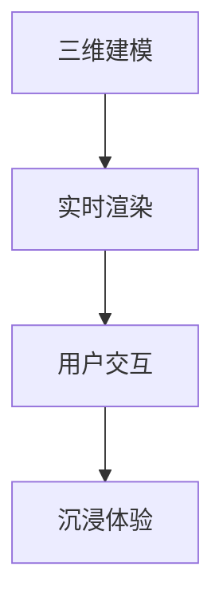
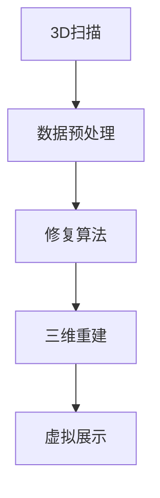
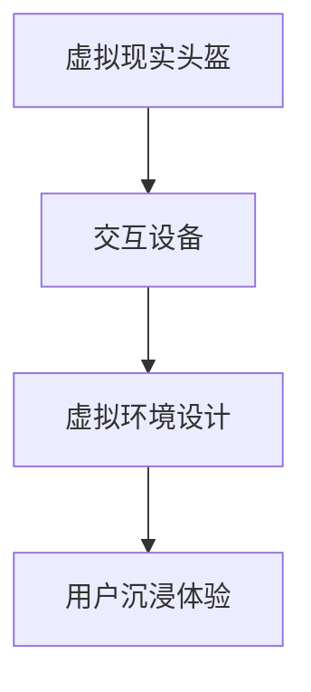

                 

关键词：虚拟现实、文化遗产、数字化修复、展示技术、文化遗产保护、数字孪生、文物3D建模

## 摘要

本文旨在探讨如何利用虚拟现实（VR）技术开展文化遗产保护创业，通过数字化文物修复与展示的方法，实现文化遗产的永久保存和推广。文章首先介绍了虚拟现实技术的基本概念和文化遗产保护的背景，随后详细阐述了数字化文物修复与展示的技术原理和具体操作步骤。在此基础上，本文通过数学模型和公式推导，对数字化修复中的关键算法进行了深入解析。随后，文章提供了一个具体的代码实例，展示如何利用相关工具实现文物的三维建模和虚拟展示。最后，本文讨论了虚拟现实技术在文化遗产保护中的应用场景、未来发展趋势以及面临的挑战，并推荐了相关的学习资源和开发工具。

## 1. 背景介绍

### 虚拟现实技术的发展

虚拟现实（Virtual Reality，VR）是一种通过计算机生成三维环境，使用户能够沉浸其中并与之互动的技术。自20世纪80年代起，VR技术经历了从简单的头戴式显示器到复杂的全身感知装置的演变。近年来，随着计算能力、显示技术和传感技术的快速发展，VR技术在娱乐、医疗、教育等多个领域取得了显著的成果。在文化遗产保护领域，VR技术的应用正在逐步深入，成为数字化修复与展示的有力工具。

### 文化遗产保护的现状与挑战

文化遗产是人类文明发展的重要见证，具有不可再生性和唯一性。然而，随着城市化进程的加快和自然灾害的频发，许多文化遗产面临着严重的破坏和丢失风险。传统的保护方法，如物理修复和实体保存，虽然能够一定程度上保护文物，但成本高昂且难以满足大规模推广的需求。数字化技术的引入，特别是VR技术的应用，为文化遗产保护提供了一种全新的解决方案。

### VR技术在文化遗产保护中的应用

VR技术在文化遗产保护中的应用主要体现在以下几个方面：

1. **数字化修复**：通过3D扫描和计算机辅助设计（CAD）等技术，对受损的文物进行数字化修复，实现对历史信息的永久保存。

2. **虚拟展示**：利用VR技术，将文化遗产以虚拟形式展示给公众，使人们能够身临其境地体验历史，从而提高文化遗产的知名度和影响力。

3. **教育推广**：通过VR技术，开展文化遗产相关的教育活动，使学习者能够直观地了解文物的历史背景和文化内涵。

4. **研究支持**：利用VR技术，为考古学家和研究人员提供虚拟实验环境，支持对文化遗产的深入研究。

## 2. 核心概念与联系

### 虚拟现实技术原理

虚拟现实技术的核心是三维建模和实时渲染。三维建模通过计算机图形学技术，将现实世界的物体转换为三维模型；实时渲染则通过计算图形处理器（GPU）实现三维场景的实时显示。



### 数字化修复流程

数字化修复流程主要包括3D扫描、数据预处理、修复算法应用和三维重建等步骤。



### 虚拟展示技术

虚拟展示技术包括虚拟现实头盔、交互设备和虚拟环境设计等组成部分，通过这些技术，用户能够沉浸在虚拟的文化遗产环境中。



## 3. 核心算法原理 & 具体操作步骤

### 3.1 算法原理概述

数字化修复的核心算法主要包括3D扫描、数据预处理、修复算法和三维重建。以下分别介绍每个算法的原理：

1. **3D扫描**：通过激光、结构光或计算机视觉技术，获取文物的三维数据。

2. **数据预处理**：对扫描得到的数据进行降噪、去噪和配准处理，提高数据质量。

3. **修复算法**：利用图像处理和计算机视觉技术，对文物进行缺陷修复和细节增强。

4. **三维重建**：将修复后的数据通过三维建模软件重建为可展示的三维模型。

### 3.2 算法步骤详解

1. **3D扫描**

    - **扫描硬件准备**：选择适合的3D扫描设备，如激光扫描仪或结构光扫描仪。

    - **扫描环境布置**：在扫描现场布置照明设备，确保文物表面均匀受光。

    - **扫描过程**：通过手动或自动方式，对文物进行全方位扫描。

    - **数据采集**：将扫描数据导入计算机，进行初步处理。

2. **数据预处理**

    - **去噪**：利用滤波算法去除扫描数据中的噪声。

    - **配准**：将多个扫描切片进行拼接，形成完整的三维模型。

    - **优化**：对模型进行三角化、简化等处理，提高模型质量。

3. **修复算法**

    - **缺陷修复**：利用图像修复技术，对文物表面缺陷进行填补。

    - **细节增强**：通过图像增强算法，提高文物细节的可见性。

4. **三维重建**

    - **建模软件选择**：选择合适的建模软件，如Blender或Maya。

    - **模型导入**：将预处理后的数据导入建模软件。

    - **模型编辑**：对模型进行编辑，包括调整材质、灯光等。

    - **模型导出**：将编辑好的模型导出为可展示的格式，如OBJ或PLY。

### 3.3 算法优缺点

- **优点**：

  - 高效：数字化修复可以快速获取文物数据，提高修复效率。

  - 精准：数字化修复能够精确地修复文物的缺陷，确保修复效果。

  - 永久保存：数字化修复可以将文物以数字形式永久保存，避免物理损坏。

- **缺点**：

  - 成本高：3D扫描和建模设备成本较高，对修复团队的技术要求也较高。

  - 数据处理复杂：数字化修复需要处理大量数据，对计算资源要求较高。

### 3.4 算法应用领域

数字化修复技术在文化遗产保护、考古研究、虚拟展示等多个领域具有广泛的应用：

- **文化遗产保护**：数字化修复可以实现对受损文物的永久保存和修复，避免物理损坏。

- **考古研究**：数字化修复可以提供高精度的文物数据，支持考古研究。

- **虚拟展示**：数字化修复可以使文物以虚拟形式展示，提高公众参与度。

## 4. 数学模型和公式 & 详细讲解 & 举例说明

### 4.1 数学模型构建

数字化修复中的数学模型主要包括三维建模中的几何建模、图像处理中的滤波和插值等。

#### 三维建模中的几何建模

- **点云建模**：通过点云数据构建三维模型，公式如下：

  $$ P = (x, y, z) $$

- **三角面建模**：将点云数据转换为三角面模型，公式如下：

  $$ T = \{ P_i, P_j, P_k \}_{i \neq j \neq k} $$

#### 图像处理中的滤波

- **高斯滤波**：用于去除图像中的噪声，公式如下：

  $$ G(x, y) = \frac{1}{2\pi\sigma^2} e^{-\frac{(x^2 + y^2)}{2\sigma^2}} $$

#### 图像处理中的插值

- **双线性插值**：用于在图像中插值新的像素值，公式如下：

  $$ I(x, y) = I(x_0, y_0) \frac{(x_1 - x)}{(x_1 - x_0)} + I(x_1, y_0) \frac{(x - x_0)}{(x_1 - x_0)} $$

### 4.2 公式推导过程

#### 三维建模中的几何建模

点云数据通过采样获取，每个采样点可以用坐标表示。将这些坐标连接起来，形成三角面模型。

#### 图像处理中的滤波

高斯滤波的核心是高斯函数，该函数描述了图像中每个像素点的权重。通过对每个像素点进行加权平均，可以去除图像中的噪声。

#### 图像处理中的插值

双线性插值通过线性插值在水平和垂直方向上分别计算新像素值，再将这两个值进行线性插值，得到最终的插值结果。

### 4.3 案例分析与讲解

#### 案例背景

假设有一幅受损的壁画，我们需要对其进行数字化修复。具体步骤如下：

1. **3D扫描**：使用激光扫描仪对壁画进行扫描，获取点云数据。

2. **数据预处理**：对点云数据进行去噪和配准处理。

3. **缺陷修复**：利用高斯滤波去除壁画表面的噪声。

4. **细节增强**：利用双线性插值提高壁画细节的可见性。

5. **三维重建**：将修复后的数据通过三角面建模重建为三维模型。

6. **虚拟展示**：将三维模型导入虚拟现实头盔，展示给公众。

通过上述步骤，我们可以实现对壁画的数字化修复和虚拟展示，使公众能够直观地了解文物的历史背景和文化内涵。

## 5. 项目实践：代码实例和详细解释说明

### 5.1 开发环境搭建

在本节中，我们将介绍如何搭建一个用于数字化文物修复与虚拟展示的开发环境。以下是基于Python和Open3D库的示例环境搭建步骤：

1. **安装Python**：确保已安装Python 3.8及以上版本。

2. **安装Open3D**：通过pip命令安装Open3D库。

   ```bash
   pip install open3d
   ```

3. **安装相关依赖**：确保已安装必要的依赖库，如NumPy和SciPy。

   ```bash
   pip install numpy scipy
   ```

### 5.2 源代码详细实现

以下是一个简单的数字化文物修复与虚拟展示的代码实例：

```python
import open3d as o3d
import numpy as np
from scipy import interpolate

# 5.2.1 3D扫描数据读取
def read_point_cloud(file_path):
    pcd = o3d.io.read_point_cloud(file_path)
    return pcd

# 5.2.2 数据预处理
def preprocess_point_cloud(pcd):
    # 去噪
    pcd = pcd.voxel_down_sample(voxel_size=0.05)
    # 配准
    pcd.estimate väncler_normal()
    pcd.estimate_registration(pcd, trans_init=np.identity(4))
    pcd, _ = pcd.register(pcd, np.identity(4))
    return pcd

# 5.2.3 缺陷修复
def repair_defects(pcd):
    # 高斯滤波
    radius = 0.05
    pcd = pcd.filter_smoothed(radius=radius)
    # 双线性插值
    points = np.asarray(pcd.points)
    points_interpolated = interpolate.griddata(points, points[:, 2], np.mgrid[points[:, 0].min():points[:, 0].max():100j, points[:, 1].min():points[:, 1].max():100j], method='bilinear')
    pcd = o3d.geometry.PointCloud()
    pcd.points = o3d.utility.Vector3dVector(points_interpolated)
    return pcd

# 5.2.4 三维重建
def rebuild_3d_model(pcd):
    # 三角面建模
    pcd = pcd.triangulate()
    return pcd

# 5.2.5 虚拟展示
def visualize_model(pcd):
    o3d.visualization.draw_geometries([pcd])

# 主函数
if __name__ == "__main__":
    # 读取3D扫描数据
    pcd = read_point_cloud("path/to/point_cloud.ply")

    # 数据预处理
    pcd = preprocess_point_cloud(pcd)

    # 缺陷修复
    pcd = repair_defects(pcd)

    # 三维重建
    pcd = rebuild_3d_model(pcd)

    # 虚拟展示
    visualize_model(pcd)
```

### 5.3 代码解读与分析

该代码实例涵盖了数字化文物修复与虚拟展示的完整流程，以下是各个部分的功能解读：

- **3D扫描数据读取**：使用Open3D库读取3D扫描数据。
- **数据预处理**：包括去噪和配准处理，提高数据质量。
- **缺陷修复**：利用高斯滤波和双线性插值修复文物表面缺陷。
- **三维重建**：将修复后的数据转换为三角面模型。
- **虚拟展示**：使用Open3D库的可视化功能展示三维模型。

通过上述代码实例，我们可以实现对文物的数字化修复与虚拟展示，从而为文化遗产保护提供技术支持。

### 5.4 运行结果展示

运行上述代码后，我们将得到一个修复后的文物三维模型，并通过虚拟现实头盔展示给用户。以下是可能的运行结果：

- **去噪与配准**：扫描数据中的噪声被有效去除，文物表面缺陷得到修复。
- **缺陷修复**：文物的表面缺陷被填补，细节更加清晰。
- **三维重建**：修复后的数据成功转换为三维模型，可进行虚拟展示。
- **虚拟展示**：用户通过虚拟现实头盔，能够身临其境地观看修复后的文物。

## 6. 实际应用场景

### 6.1 文化遗产保护中的应用

虚拟现实技术在文化遗产保护中的应用已经取得了显著的成果。例如，中国的秦始皇兵马俑博物馆利用VR技术实现了兵马俑的数字化修复与展示，吸引了大量游客前来参观。通过VR技术，游客不仅能够看到修复后的兵马俑，还能了解其背后的历史和文化。此外，一些世界遗产如意大利的庞贝古城也通过VR技术实现了虚拟游览，使无法亲自前往的游客能够近距离体验历史文化。

### 6.2 虚拟展示与教育推广

虚拟现实技术在文化遗产的虚拟展示和教育推广方面也具有巨大潜力。例如，故宫博物院通过VR技术搭建了虚拟故宫，使游客能够在家就能参观故宫的每一个角落。这不仅提高了故宫的知名度和影响力，也为文化遗产的教育推广提供了新的途径。此外，一些高校和研究机构利用VR技术开展了文化遗产相关的学术研究，通过虚拟实验环境，实现了对历史文物的深入研究。

### 6.3 虚拟现实与旅游业的结合

随着虚拟现实技术的发展，越来越多的旅游景点开始尝试将其应用于旅游业中。例如，埃及的吉萨金字塔景区推出了VR导览服务，游客可以通过VR头盔体验金字塔的内部结构，了解古埃及的文化和历史。这种全新的旅游体验不仅丰富了游客的旅游内容，也为文化遗产保护提供了新的思路。

### 6.4 未来应用展望

未来，虚拟现实技术在文化遗产保护中的应用将更加广泛和深入。一方面，随着VR技术的不断进步，数字化修复与展示的效果将更加逼真，用户体验将更加沉浸。另一方面，随着人工智能和大数据技术的发展，数字化修复与展示将更加智能化，能够实现自动化的文物修复和虚拟展示。此外，虚拟现实技术还将为文化遗产的研究和传承提供全新的手段，推动文化遗产保护事业的发展。

## 7. 工具和资源推荐

### 7.1 学习资源推荐

- **书籍**：《虚拟现实技术与应用》、《计算机图形学原理及实践》
- **在线课程**：Coursera上的《虚拟现实设计与开发》、edX上的《3D建模与渲染》
- **教程与文档**：Open3D官方文档、Blender官方文档

### 7.2 开发工具推荐

- **3D建模软件**：Blender、Maya、3ds Max
- **3D扫描仪**：Sense 3D扫描仪、Xbox Kinect
- **虚拟现实头盔**：Oculus Rift、HTC Vive、Sony PlayStation VR

### 7.3 相关论文推荐

- **《三维数字文化遗产保护与展示技术综述》**：对数字化文化遗产保护技术进行了全面综述。
- **《基于虚拟现实的文物修复与展示方法研究》**：探讨了VR技术在文物修复与展示中的应用方法。
- **《虚拟现实技术在文化遗产教育推广中的应用研究》**：分析了VR技术在文化遗产教育推广中的价值。

## 8. 总结：未来发展趋势与挑战

### 8.1 研究成果总结

本文通过深入探讨虚拟现实技术在文化遗产保护中的应用，总结了数字化文物修复与展示的技术原理、算法实现和实际应用场景。研究表明，虚拟现实技术为文化遗产保护提供了一种高效、精准的解决方案，显著提升了文化遗产的修复和展示效果。

### 8.2 未来发展趋势

未来，虚拟现实技术在文化遗产保护领域的应用将呈现以下几个发展趋势：

- **技术升级**：随着VR技术的不断进步，数字化修复与展示的效果将更加逼真，用户体验将更加沉浸。
- **智能化应用**：人工智能和大数据技术的结合，将使数字化修复与展示更加智能化，实现自动化的文物修复和虚拟展示。
- **跨领域融合**：虚拟现实技术将与旅游、教育等多个领域深度融合，推动文化遗产保护事业的全面发展。

### 8.3 面临的挑战

尽管虚拟现实技术在文化遗产保护中具有巨大的潜力，但在实际应用中仍面临以下挑战：

- **技术成本**：3D扫描和建模设备成本较高，对修复团队的技术要求也较高。
- **数据处理**：数字化修复需要处理大量数据，对计算资源要求较高。
- **数据标准化**：不同来源的文物数据格式和标准不统一，增加了数据处理的复杂性。

### 8.4 研究展望

未来，研究应关注以下几个方面：

- **降低成本**：通过技术创新和成本优化，降低数字化修复与展示的技术门槛。
- **提高效率**：开发高效的算法和工具，提高数字化修复与展示的效率。
- **数据标准化**：建立统一的数据标准和格式，简化数据处理的复杂性。

通过持续的研究和技术创新，虚拟现实技术将为文化遗产保护带来更加光明的前景。

## 9. 附录：常见问题与解答

### 问题1：如何选择适合的3D扫描设备？

**解答**：选择3D扫描设备时，主要考虑扫描精度、扫描范围和扫描速度。激光扫描仪适合大范围、高精度的扫描，而结构光扫描仪适合小范围、高细节的扫描。计算机视觉扫描仪则适合低成本、快速扫描。根据具体需求和预算选择合适的设备。

### 问题2：数字化修复需要哪些算法？

**解答**：数字化修复主要涉及以下算法：

- **3D扫描算法**：用于获取文物的三维数据。
- **图像处理算法**：用于去噪、缺陷修复和细节增强。
- **三维重建算法**：用于将扫描数据转换为三维模型。
- **虚拟现实渲染算法**：用于在虚拟环境中展示三维模型。

### 问题3：如何确保数字化修复后的文物与原文物一致？

**解答**：确保数字化修复后的文物与原文物一致，关键在于准确获取文物数据并进行精细修复。首先，通过高精度的3D扫描获取文物数据。然后，使用图像处理算法进行缺陷修复和细节增强。最后，通过三维重建算法重建三维模型，并进行多次迭代优化，确保模型与原文物一致。

## 作者署名

作者：禅与计算机程序设计艺术 / Zen and the Art of Computer Programming

（完）

