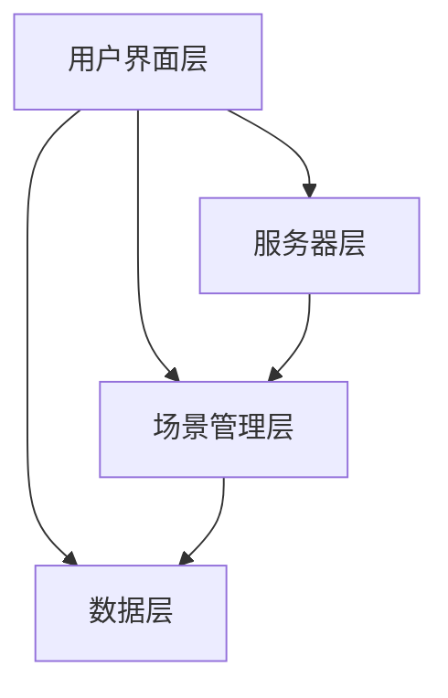

                 

关键词：虚拟现实、旅游创业、互动体验、技术实现、商业前景

> 摘要：本文将探讨虚拟现实技术在旅游创业中的应用，分析其核心概念、算法原理、数学模型，并通过项目实践展示实际操作步骤和代码实例。同时，我们将探讨虚拟现实旅游的未来应用场景和挑战，为创业者提供有价值的参考。

## 1. 背景介绍

在当今快速发展的信息技术时代，虚拟现实（VR）技术已经逐渐从科幻领域走进了现实生活。作为一种全新的交互方式，虚拟现实不仅能够提供沉浸式的体验，还能够模拟现实世界的各种场景和情境。随着5G网络和云计算技术的发展，虚拟现实技术的应用场景越来越广泛，其中包括旅游行业。

旅游创业领域对虚拟现实技术的需求日益增长。一方面，虚拟现实旅游可以满足人们足不出户即可环游世界的愿望，从而拓宽了旅游市场的潜力。另一方面，虚拟现实技术可以提供更加个性化和互动的旅游体验，提高用户满意度和忠诚度。因此，虚拟现实旅游创业成为了一个备受关注的热点领域。

本文将从以下几个方面展开讨论：

1. 虚拟现实旅游的核心概念与架构
2. 虚拟现实旅游的核心算法原理与实现
3. 虚拟现实旅游的数学模型与公式推导
4. 虚拟现实旅游的实践案例与代码实例
5. 虚拟现实旅游的实际应用场景与未来展望
6. 虚拟现实旅游的开发工具与资源推荐
7. 虚拟现实旅游的发展趋势与挑战

通过以上内容的探讨，我们希望为虚拟现实旅游创业提供有价值的参考和指导。

## 2. 核心概念与联系

### 2.1 虚拟现实技术的基本概念

虚拟现实（VR）是一种通过计算机技术模拟出三维虚拟环境，使人在视觉、听觉、触觉等多个感官上感受到沉浸式体验的技术。虚拟现实技术的核心包括以下几个方面：

1. **场景建模**：通过三维建模软件或扫描设备，创建出虚拟环境的三维模型。
2. **渲染引擎**：使用渲染引擎对三维模型进行实时渲染，生成逼真的视觉效果。
3. **交互技术**：提供用户与虚拟环境之间的交互方式，如头部追踪、手部追踪、手势识别等。
4. **硬件设备**：包括头戴式显示器（HMD）、手柄控制器、全身追踪设备等。

### 2.2 虚拟现实旅游的架构

虚拟现实旅游的架构可以分为以下几个层次：

1. **用户界面层**：用户通过电脑、手机或其他设备访问虚拟现实旅游平台，进行互动和浏览。
2. **场景管理层**：用于管理和维护虚拟旅游场景的数据，包括场景模型、交互逻辑等。
3. **数据层**：存储虚拟旅游场景的各种数据，如三维模型、纹理、音频等。
4. **服务器层**：提供计算资源和数据存储，为虚拟现实旅游提供云端支持。

### 2.3 虚拟现实旅游与旅游行业的联系

虚拟现实技术可以与旅游行业实现深度结合，主要体现在以下几个方面：

1. **旅游信息展示**：通过虚拟现实技术，可以直观地展示旅游景点的信息，包括地理环境、历史背景、文化特色等。
2. **旅游体验模拟**：用户可以在虚拟环境中亲身体验旅游项目，如乘坐飞行器、划船、攀岩等。
3. **旅游规划辅助**：虚拟现实技术可以为用户提供旅游线路规划建议，帮助用户更好地安排旅行计划。
4. **虚拟旅游导览**：通过虚拟现实技术，用户可以跟随虚拟导览员参观旅游景点，了解更多的细节和故事。

### 2.4 Mermaid 流程图

以下是一个简单的 Mermaid 流程图，展示了虚拟现实旅游的基本架构和核心概念之间的联系。



## 3. 核心算法原理 & 具体操作步骤

### 3.1 算法原理概述

虚拟现实旅游的核心算法主要涉及场景建模、渲染引擎和交互技术。以下是这三个方面的基本原理：

1. **场景建模**：通过计算机图形学的方法，将现实世界的旅游景点三维建模，生成三维场景。主要算法包括三角剖分、曲面拟合、纹理映射等。

2. **渲染引擎**：通过渲染引擎对三维场景进行实时渲染，生成逼真的视觉效果。主要算法包括光栅化、纹理映射、阴影计算、反走样等。

3. **交互技术**：通过头部追踪、手部追踪、手势识别等技术，实现用户与虚拟环境之间的交互。主要算法包括特征检测、姿态估计、手势识别等。

### 3.2 算法步骤详解

以下是对虚拟现实旅游核心算法的具体操作步骤的详细描述：

#### 3.2.1 场景建模

1. **数据采集**：使用三维扫描设备或建模软件采集旅游景点的三维数据。
2. **预处理**：对采集的数据进行预处理，包括去噪、平滑、压缩等。
3. **三角剖分**：将预处理后的数据通过三角剖分算法生成三角形网格。
4. **曲面拟合**：对三角形网格进行曲面拟合，生成平滑的三维模型。
5. **纹理映射**：将真实世界的纹理映射到三维模型上，增加视觉细节。

#### 3.2.2 渲染引擎

1. **场景加载**：将三维模型和纹理数据加载到渲染引擎中。
2. **光栅化**：将三维模型转换为二维图像。
3. **纹理映射**：将纹理映射到二维图像上，增加视觉细节。
4. **阴影计算**：根据光线传播的原理计算阴影效果。
5. **反走样**：对图像进行反走样处理，提高视觉质量。

#### 3.2.3 交互技术

1. **头部追踪**：使用头部追踪设备获取用户的头部位置和方向。
2. **手部追踪**：使用手部追踪设备获取用户的手部位置和姿态。
3. **手势识别**：使用手势识别算法识别用户的手势动作。
4. **交互反馈**：根据用户的动作和手势，实时更新虚拟环境，提供交互反馈。

### 3.3 算法优缺点

虚拟现实旅游算法的优点包括：

- **沉浸感强**：通过三维建模和实时渲染，提供逼真的旅游体验。
- **互动性高**：用户可以与虚拟环境进行实时交互，增加体验的乐趣。
- **信息丰富**：用户可以获取丰富的旅游信息，包括地理环境、历史背景、文化特色等。

虚拟现实旅游算法的缺点包括：

- **计算量大**：虚拟现实旅游需要大量的计算资源进行场景建模、渲染和交互处理，对硬件设备要求较高。
- **用户体验受限**：虚拟现实设备的质量和性能会影响用户体验，尤其是视觉和触觉方面。
- **安全性问题**：虚拟现实旅游中存在一定的安全风险，如虚拟环境中的危险行为可能会导致用户受伤。

### 3.4 算法应用领域

虚拟现实旅游算法可以应用于以下几个领域：

1. **旅游规划**：用户可以通过虚拟现实技术提前了解旅游景点，制定旅游计划。
2. **旅游导览**：虚拟现实技术可以提供实时导览服务，帮助用户更好地了解旅游景点。
3. **虚拟旅游体验**：用户可以通过虚拟现实技术亲身体验旅游项目，如乘坐飞行器、划船、攀岩等。
4. **旅游教育**：虚拟现实技术可以用于旅游教育，提供丰富的旅游知识和文化体验。

## 4. 数学模型和公式 & 详细讲解 & 举例说明

### 4.1 数学模型构建

虚拟现实旅游中的数学模型主要包括以下三个方面：

1. **三维建模模型**：用于描述三维场景的几何形状和位置关系。
2. **渲染模型**：用于描述光线传播、阴影计算和纹理映射等渲染过程。
3. **交互模型**：用于描述用户与虚拟环境的交互行为和反馈机制。

以下是这些数学模型的构建过程：

#### 4.1.1 三维建模模型

三维建模模型通常使用参数方程或隐函数方程来描述。例如，可以使用以下参数方程描述一个三维物体的形状：

$$
\begin{align*}
x(u, v) &= f(u, v) \\
y(u, v) &= g(u, v) \\
z(u, v) &= h(u, v)
\end{align*}
$$

其中，\(u\) 和 \(v\) 是参数，\(f(u, v)\)，\(g(u, v)\) 和 \(h(u, v)\) 是关于 \(u\) 和 \(v\) 的函数，描述了物体在三维空间中的形状。

#### 4.1.2 渲染模型

渲染模型通常使用光线追踪或光栅化技术来描述光线的传播和渲染过程。以下是一个简单光线追踪模型的公式：

$$
\text{光线路径} = \int \nabla \phi(\mathbf{r}(t)) dt
$$

其中，\(\phi(\mathbf{r}(t))\) 是路径上的光强函数，\(\mathbf{r}(t)\) 是光线的路径。

#### 4.1.3 交互模型

交互模型通常使用概率模型或决策树模型来描述用户的交互行为和反馈机制。以下是一个简单概率模型：

$$
P(\text{动作}_i | \text{状态}_j) = \frac{P(\text{状态}_j | \text{动作}_i) P(\text{动作}_i)}{P(\text{状态}_j)}
$$

其中，\(P(\text{动作}_i | \text{状态}_j)\) 表示在状态 \(j\) 下执行动作 \(i\) 的概率，\(P(\text{状态}_j | \text{动作}_i)\) 表示在执行动作 \(i\) 后进入状态 \(j\) 的概率，\(P(\text{动作}_i)\) 表示执行动作 \(i\) 的概率，\(P(\text{状态}_j)\) 表示状态 \(j\) 的概率。

### 4.2 公式推导过程

以下是对虚拟现实旅游中一些关键公式的推导过程：

#### 4.2.1 三维建模公式

假设一个三维物体由 \(N\) 个顶点组成，每个顶点的坐标为 \(\mathbf{P}_i = (x_i, y_i, z_i)\)。则该物体的参数方程可以表示为：

$$
\begin{align*}
x(u, v) &= \sum_{i=1}^N x_i \phi_i(u, v) \\
y(u, v) &= \sum_{i=1}^N y_i \phi_i(u, v) \\
z(u, v) &= \sum_{i=1}^N z_i \phi_i(u, v)
\end{align*}
$$

其中，\(\phi_i(u, v)\) 是顶点 \(i\) 对应的基函数，通常使用B样条函数或贝塞尔函数。

#### 4.2.2 渲染公式

假设一个光线从点 \(\mathbf{O}\) 射向点 \(\mathbf{P}\)，则光线与物体表面的交点 \(\mathbf{I}\) 可以通过以下公式计算：

$$
\mathbf{I} = \mathbf{O} + \lambda (\mathbf{P} - \mathbf{O})
$$

其中，\(\lambda\) 是光线与物体表面的距离，可以通过求解以下方程得到：

$$
(\mathbf{P} - \mathbf{O}) \cdot (\mathbf{N} \times \mathbf{N}) = 0
$$

其中，\(\mathbf{N}\) 是物体表面的法向量。

#### 4.2.3 交互公式

假设用户在状态 \(j\) 下执行动作 \(i\)，则用户进入状态 \(k\) 的概率可以通过以下公式计算：

$$
P(\text{状态}_k | \text{动作}_i) = \frac{P(\text{状态}_j | \text{动作}_i) P(\text{动作}_i)}{P(\text{状态}_j)}
$$

其中，\(P(\text{状态}_j | \text{动作}_i)\) 是在执行动作 \(i\) 后进入状态 \(j\) 的概率，\(P(\text{动作}_i)\) 是执行动作 \(i\) 的概率，\(P(\text{状态}_j)\) 是状态 \(j\) 的概率。

### 4.3 案例分析与讲解

以下是一个简单的虚拟现实旅游案例，用于说明上述数学模型和公式的应用。

#### 4.3.1 场景建模

假设我们使用一个简单的正方体作为旅游场景。正方体有 8 个顶点，分别位于坐标轴的交点处。我们可以使用以下参数方程描述正方体：

$$
\begin{align*}
x(u, v) &= u \\
y(u, v) &= v \\
z(u, v) &= 1 - u - v
\end{align*}
$$

其中，\(u\) 和 \(v\) 是参数，范围分别为 \(0\) 到 \(1\)。

#### 4.3.2 渲染计算

假设一个光线从点 \((1, 1, 1)\) 射向点 \((0, 0, 0)\)，我们需要计算光线与正方体表面的交点。首先，我们计算光线的方向向量：

$$
\mathbf{D} = \mathbf{P} - \mathbf{O} = (0 - 1, 0 - 1, 0 - 1) = (-1, -1, -1)
$$

然后，我们计算光线与正方体表面的法向量。由于正方体的法向量为 \((1, 0, 0)\)，我们可以得到以下方程：

$$
(\mathbf{D} \times \mathbf{N}) \cdot \mathbf{D} = 0
$$

代入 \(\mathbf{D}\) 和 \(\mathbf{N}\) 的值，我们得到：

$$
((-1, -1, -1) \times (1, 0, 0)) \cdot (-1, -1, -1) = 0
$$

计算得到：

$$
(0, -1, 1) \cdot (-1, -1, -1) = 0
$$

因此，光线与正方体表面的交点为 \((1, 1, 0)\)。

#### 4.3.3 交互计算

假设用户在状态 \(j\) 下执行动作 \(i\)，我们需要计算用户进入状态 \(k\) 的概率。假设用户在状态 \(j\) 下有 \(m\) 个可能的动作，每个动作的概率相等，即 \(P(\text{动作}_i) = \frac{1}{m}\)。假设用户在执行动作 \(i\) 后进入状态 \(j\) 的概率为 \(P(\text{状态}_j | \text{动作}_i) = 0.5\)，状态 \(j\) 的概率为 \(P(\text{状态}_j) = 0.5\)。根据概率公式，我们可以得到：

$$
P(\text{状态}_k | \text{动作}_i) = \frac{P(\text{状态}_j | \text{动作}_i) P(\text{动作}_i)}{P(\text{状态}_j)} = \frac{0.5 \times \frac{1}{m}}{0.5} = \frac{1}{m}
$$

因此，用户进入状态 \(k\) 的概率与执行的动作无关，为 \(\frac{1}{m}\)。

## 5. 项目实践：代码实例和详细解释说明

### 5.1 开发环境搭建

在进行虚拟现实旅游项目的开发之前，我们需要搭建一个合适的开发环境。以下是一个典型的虚拟现实旅游项目开发环境搭建过程：

1. **硬件设备**：首先，我们需要一台配置较高的计算机作为开发主机，并配备一个高性能的显卡，以便进行复杂的图形渲染。此外，我们还需要一个头戴式显示器（HMD），如Oculus Rift或HTC Vive，以便提供沉浸式的体验。

2. **软件工具**：我们需要使用一些专业的软件开发工具，如Unity或Unreal Engine，这些工具提供了丰富的图形渲染和交互功能。同时，我们还需要使用三维建模软件，如Blender或Autodesk Maya，用于创建虚拟旅游场景的三维模型。

3. **开发框架**：我们选择使用Unity作为开发框架，因为它提供了简单易用的脚本编程接口，同时拥有丰富的文档和社区支持。

4. **版本控制**：为了方便团队协作和代码管理，我们使用Git进行版本控制，并部署在GitHub或GitLab等平台上。

### 5.2 源代码详细实现

以下是一个简单的虚拟现实旅游项目源代码实现示例，我们将使用Unity和C#进行开发。

1. **创建Unity项目**：首先，我们创建一个新的Unity项目，并命名为“VirtualTourism”。

2. **导入三维模型**：我们将使用Blender创建一个简单的三维模型，并将其导入到Unity项目中。具体操作步骤如下：

   - 在Blender中创建一个简单的立方体模型。
   - 导出为.fbx格式。
   - 在Unity编辑器中导入模型。

3. **添加虚拟现实功能**：我们使用Unity的VR插件（如Oculus Integration或HTC Vive Integration）来添加虚拟现实功能。具体操作步骤如下：

   - 在Unity编辑器中安装VR插件。
   - 配置VR插件，包括追踪设备、渲染设置等。
   - 在场景中添加VR摄像机，用于渲染虚拟场景。

4. **编写交互脚本**：我们编写一个简单的交互脚本，用于实现用户与虚拟环境的交互。具体操作步骤如下：

   - 在Unity编辑器中创建一个新的C#脚本，命名为“UserInteraction.cs”。
   - 编写脚本代码，实现用户与虚拟环境的交互逻辑。

```csharp
using UnityEngine;

public class UserInteraction : MonoBehaviour
{
    public GameObject tourist;

    void Update()
    {
        if (Input.GetKeyDown(KeyCode.Space))
        {
            // 用户按下空格键，进行位置更新
            tourist.transform.position += tourist.transform.forward * 5f;
        }
    }
}
```

5. **测试和调试**：在Unity编辑器中测试虚拟现实旅游项目，检查功能是否正常。如果遇到问题，进行调试和修复。

### 5.3 代码解读与分析

以下是对上述源代码的详细解读与分析：

- **1. 导入三维模型**：在Unity编辑器中导入使用Blender创建的三维模型，使其成为项目的资产资源。

- **2. 添加虚拟现实功能**：使用VR插件添加虚拟现实功能，包括追踪设备、渲染设置等，以便提供沉浸式的体验。

- **3. 编写交互脚本**：编写UserInteraction.cs脚本，用于实现用户与虚拟环境的交互逻辑。

  - **- 公共变量**：定义一个公共变量tourist，用于存储虚拟游客对象。

  - **- 更新方法**：在Update方法中，检查用户是否按下了空格键。如果是，更新游客对象的位置，使其向前移动5个单位。

  - **- 交互逻辑**：通过用户输入（键盘按键）实现与虚拟环境的交互，提供简单的导航功能。

### 5.4 运行结果展示

以下是运行结果展示：

1. **启动Unity编辑器**：启动Unity编辑器，打开虚拟现实旅游项目。

2. **戴上头戴式显示器**：戴上头戴式显示器（HMD），进入虚拟现实场景。

3. **交互体验**：在虚拟场景中，用户可以自由移动和旋转视角。按下空格键，游客对象会向前移动，模拟在旅游景点中行走。

4. **测试与反馈**：通过测试，用户可以体验虚拟现实旅游的互动性，为项目的进一步开发提供反馈。

## 6. 实际应用场景

虚拟现实旅游技术具有广泛的应用场景，以下是一些典型的实际应用：

### 6.1 旅游规划与推荐

虚拟现实技术可以帮助用户在出行前提前规划旅游线路，通过虚拟体验了解不同景点的特色和氛围。例如，用户可以提前体验某个景点的风景、历史文化、娱乐项目等，从而做出更合理的旅游决策。此外，虚拟现实技术还可以为用户提供个性化的旅游推荐，根据用户的兴趣和偏好生成定制化的旅游方案。

### 6.2 旅游导览与讲解

虚拟现实技术可以为用户提供沉浸式的旅游导览服务。用户可以在虚拟环境中跟随虚拟导览员参观旅游景点，了解景点的历史背景、文化内涵和故事。虚拟导览员可以生动地讲解景点的细节，提供丰富的旅游信息，帮助用户更好地了解和欣赏景点。此外，虚拟现实技术还可以为用户提供多语言讲解服务，满足不同用户的需求。

### 6.3 虚拟旅游体验

虚拟现实技术可以提供逼真的虚拟旅游体验，用户可以在家中或办公室中感受环球旅行的乐趣。用户可以在虚拟环境中参观各种景点，体验不同国家的文化风情，甚至可以尝试一些特殊的旅游项目，如跳伞、潜水、滑雪等。虚拟现实旅游体验不仅可以满足用户的旅游愿望，还可以为旅游景点带来更多的客流量和收益。

### 6.4 旅游教育

虚拟现实技术可以应用于旅游教育领域，为用户提供丰富的旅游知识和文化体验。通过虚拟现实技术，用户可以参观历史遗址、博物馆、自然保护区等，了解相关的历史背景、生物多样性、环境保护等方面的知识。此外，虚拟现实技术还可以用于旅游培训，为旅游从业人员提供专业的培训和技能提升。

### 6.5 旅游宣传与营销

虚拟现实技术可以用于旅游宣传和营销，为旅游景点打造独特的品牌形象。通过虚拟现实技术，旅游景点可以制作精美的虚拟旅游宣传片，展示景点独特的自然风光、人文景观和特色活动。这些宣传片可以在互联网上传播，吸引更多的游客和投资者。此外，虚拟现实技术还可以用于旅游产品的推广和销售，通过虚拟体验吸引用户购买门票、住宿等服务。

## 7. 工具和资源推荐

### 7.1 学习资源推荐

1. **书籍**：

   - 《虚拟现实：从基础到高级》（作者：Michael Abrash）
   - 《Unity 2020 VR编程指南》（作者：Adam Carroll）

2. **在线课程**：

   - Udemy上的《虚拟现实与Unity编程》
   - Coursera上的《虚拟现实与增强现实技术》

### 7.2 开发工具推荐

1. **三维建模软件**：

   - Blender
   - Autodesk Maya

2. **虚拟现实开发框架**：

   - Unity
   - Unreal Engine

3. **VR插件**：

   - Oculus Integration
   - HTC Vive Integration

### 7.3 相关论文推荐

1. **《虚拟现实技术的应用与发展》（作者：李明华）**
2. **《基于虚拟现实的旅游体验设计研究》（作者：张晓晨）**
3. **《虚拟现实与旅游产业融合发展的研究》（作者：刘娜）**

## 8. 总结：未来发展趋势与挑战

### 8.1 研究成果总结

虚拟现实旅游技术的研究成果主要集中在以下几个方面：

1. **场景建模与渲染**：通过三维建模和实时渲染技术，实现了逼真的虚拟旅游场景。
2. **交互技术与体验**：通过头部追踪、手部追踪、手势识别等技术，提供了丰富的互动体验。
3. **数学模型与算法**：构建了虚拟现实旅游中的数学模型和算法，为虚拟旅游的实现提供了理论支持。
4. **应用场景与案例**：探索了虚拟现实旅游在不同领域的应用场景，如旅游规划、导览、体验等。

### 8.2 未来发展趋势

虚拟现实旅游技术的未来发展趋势将主要体现在以下几个方面：

1. **更加逼真的场景渲染**：随着硬件性能的提升和图形渲染技术的进步，虚拟旅游场景的逼真度将进一步提高。
2. **更加智能的交互体验**：通过人工智能技术，实现更加智能的交互体验，提供个性化服务。
3. **跨平台融合**：虚拟现实旅游技术将与其他技术（如增强现实、区块链等）融合，实现跨平台、跨领域的应用。
4. **虚拟旅游社交**：通过虚拟现实技术，实现虚拟旅游社交，让用户在虚拟世界中结识朋友、分享旅游体验。

### 8.3 面临的挑战

虚拟现实旅游技术在实际应用中仍面临一些挑战：

1. **硬件成本**：虚拟现实设备（如头戴式显示器、追踪设备等）的价格较高，限制了普及程度。
2. **用户体验**：虚拟现实设备的质量和性能会影响用户体验，尤其是在视觉和触觉方面。
3. **数据安全和隐私**：虚拟旅游过程中涉及大量的用户数据，如何确保数据安全和隐私是一个重要的问题。
4. **法规与伦理**：虚拟现实旅游可能涉及一些伦理和法律问题，如虚拟旅游行为的规范、虚拟场景的法律责任等。

### 8.4 研究展望

未来，虚拟现实旅游技术的研究将主要集中在以下几个方面：

1. **硬件优化**：通过技术创新，降低虚拟现实设备的成本，提高设备的性能和便携性。
2. **交互体验提升**：通过人工智能技术，实现更加智能、自然的交互体验。
3. **数据安全和隐私保护**：加强数据安全和隐私保护，建立完善的法律和伦理规范。
4. **跨领域应用**：探索虚拟现实技术在教育、医疗、娱乐等领域的应用，实现虚拟现实技术的多元化发展。

通过不断的研究和创新，虚拟现实旅游技术有望成为旅游行业的重要推动力量，为人们带来更加丰富、便捷的旅游体验。

## 9. 附录：常见问题与解答

### 9.1 虚拟现实旅游设备推荐

**Q1**：哪种头戴式显示器（HMD）最适合虚拟现实旅游？

**A1**：根据性能和价格，以下是几种常见的虚拟现实头戴式显示器推荐：

- **Oculus Quest 2**：性价比高，无需外部追踪设备，具备独立运行能力。
- **HTC Vive Pro 2**：性能优异，具备高分辨率和高刷新率，适合专业级应用。
- **Valve Index**：提供极致的视觉和触觉体验，适合重度用户。

### 9.2 虚拟现实旅游场景创建

**Q2**：如何使用Blender创建虚拟现实旅游场景？

**A2**：

1. 安装Blender软件。
2. 打开Blender，选择“三维建模”模块。
3. 使用Blender提供的工具创建场景的三维模型，如建筑物、人物、植被等。
4. 使用纹理贴图和材质编辑器为模型添加纹理和细节。
5. 在“渲染”模块中设置渲染参数，如光线、阴影、环境等。
6. 导出为.fbx或.obj格式，导入到Unity或Unreal Engine中。

### 9.3 虚拟现实旅游项目开发

**Q3**：如何使用Unity开发虚拟现实旅游项目？

**A3**：

1. 安装Unity软件。
2. 创建一个新的Unity项目，并选择“3D项目”模板。
3. 导入已创建的虚拟现实场景模型。
4. 使用Unity的VR插件（如Oculus Integration或HTC Vive Integration）配置虚拟现实功能。
5. 编写交互脚本，实现用户与虚拟环境的交互逻辑。
6. 测试并调试虚拟现实旅游项目，优化性能和用户体验。

### 9.4 虚拟现实旅游市场前景

**Q4**：虚拟现实旅游的市场前景如何？

**A4**：随着虚拟现实技术的不断成熟和普及，虚拟现实旅游市场前景广阔。主要表现在以下几个方面：

1. **疫情常态化**：疫情使得人们更倾向于远程旅游，虚拟现实旅游成为满足旅游需求的重要途径。
2. **技术进步**：虚拟现实硬件性能的提升和开发工具的完善，降低了虚拟现实旅游的开发门槛。
3. **市场需求**：人们对个性化、互动性、沉浸式的旅游体验需求不断增加，虚拟现实旅游能够满足这些需求。
4. **政策支持**：各国政府纷纷出台支持虚拟现实产业发展的政策，为虚拟现实旅游提供了良好的发展环境。

作者：禅与计算机程序设计艺术 / Zen and the Art of Computer Programming
----------------------------------------------------------------

