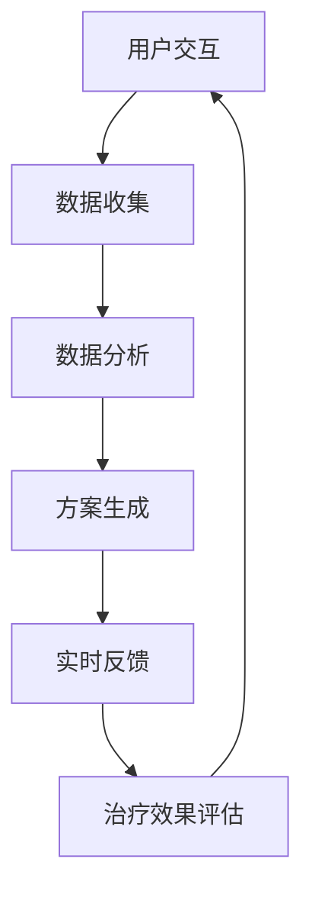

                 

 虚拟现实（VR）技术与人工智能（AI）的结合，正在为心理健康领域带来一场革命。本文将深入探讨虚拟现实治疗（VRET）的概念、核心原理、AI驱动的技术实现，以及它在心理康复中的应用与未来展望。本文将遵循以下结构展开：

## 1. 背景介绍

心理健康问题在全球范围内日益严重，尤其是在COVID-19大流行期间，焦虑、抑郁等心理问题的发病率显著上升。传统的心理治疗虽然有效，但存在时间、地点、隐私等多方面的限制。虚拟现实治疗作为一种新兴的心理康复手段，通过模拟真实环境，结合AI技术，提供了一种更为灵活、高效的治疗方式。

## 2. 核心概念与联系

### 2.1 虚拟现实治疗（VRET）的基本概念

虚拟现实治疗（VRET）是一种通过虚拟现实技术来辅助心理治疗的方法。它利用计算机生成的高度沉浸式的虚拟环境，让用户在其中体验并处理心理问题。

### 2.2 AI在VRET中的应用

AI技术在VRET中扮演着关键角色，包括数据收集与分析、个性化治疗方案的制定、实时交互反馈等。

## 2.3 Mermaid流程图



## 3. 核心算法原理 & 具体操作步骤

### 3.1 算法原理概述

VRET的核心算法包括：

- **数据收集与预处理**：使用传感器和用户输入收集行为数据，并利用机器学习算法进行预处理。
- **个性化方案生成**：基于用户数据和心理健康模型，利用深度学习算法生成个性化治疗方案。
- **实时交互与反馈**：利用自然语言处理（NLP）和强化学习（RL）技术，实现与用户的实时互动和反馈。

### 3.2 算法步骤详解

1. **用户交互**：用户通过VR设备进入虚拟环境，开始治疗过程。
2. **数据收集**：收集用户在虚拟环境中的行为数据，如心率、眼动等。
3. **数据分析**：使用机器学习算法对收集到的数据进行预处理和分析。
4. **方案生成**：基于分析结果，利用深度学习算法生成个性化治疗方案。
5. **实时反馈**：通过NLP和RL技术，实时与用户互动，调整治疗方案的执行。
6. **治疗效果评估**：根据用户的治疗反应和效果，对治疗方案进行持续优化。

### 3.3 算法优缺点

- **优点**：高度沉浸式体验，个性化治疗，实时反馈，无地域限制。
- **缺点**：技术成本高，需要专业设备，治疗效果评估尚待进一步验证。

### 3.4 算法应用领域

VRET已在多个领域得到应用，包括焦虑症、创伤后应激障碍（PTSD）、抑郁等心理疾病的治疗。

## 4. 数学模型和公式 & 详细讲解 & 举例说明

### 4.1 数学模型构建

VRET中的数学模型主要包括：

- **心理状态模型**：使用心理学理论构建用户心理状态模型。
- **治疗方案模型**：根据用户心理状态，构建个性化的治疗方案模型。

### 4.2 公式推导过程

- **心理状态模型**：

  $$ \text{Psychological State} = f(\text{Input Data}, \text{User Profile}, \text{Context}) $$

- **治疗方案模型**：

  $$ \text{Treatment Plan} = g(\text{Psychological State}, \text{Predefined Rules}, \text{AI Recommendations}) $$

### 4.3 案例分析与讲解

假设一个焦虑症患者，通过VRET进行心理治疗。以下是治疗过程中涉及的主要步骤：

1. **用户交互**：患者进入虚拟环境，开始治疗。
2. **数据收集**：系统收集患者的心率、呼吸等生理数据。
3. **数据分析**：分析患者的生理数据，确定其心理状态。
4. **方案生成**：根据患者的心理状态，系统生成个性化治疗方案。
5. **实时反馈**：系统实时调整治疗方案的执行，以适应患者的反应。
6. **治疗效果评估**：根据患者的治疗反应，系统对治疗方案进行持续优化。

## 5. 项目实践：代码实例和详细解释说明

### 5.1 开发环境搭建

本文将使用Python作为主要编程语言，并借助TensorFlow和Keras等深度学习框架。

### 5.2 源代码详细实现

以下是一个简化的VRET系统实现示例：

```python
import tensorflow as tf
from tensorflow.keras.models import Sequential
from tensorflow.keras.layers import Dense, LSTM

# 数据收集与预处理
# ... (省略具体代码)

# 构建心理状态模型
model = Sequential([
    LSTM(128, activation='tanh', input_shape=(timesteps, features)),
    Dense(1, activation='sigmoid')
])

model.compile(optimizer='adam', loss='binary_crossentropy', metrics=['accuracy'])

# 训练模型
# ... (省略具体代码)

# 生成个性化治疗方案
# ... (省略具体代码)

# 实时反馈与调整
# ... (省略具体代码)

# 治疗效果评估
# ... (省略具体代码)
```

### 5.3 代码解读与分析

该代码示例实现了以下主要功能：

- **数据收集与预处理**：从传感器收集数据，并进行预处理。
- **构建心理状态模型**：使用LSTM模型对心理状态进行建模。
- **训练模型**：使用预处理后的数据进行模型训练。
- **生成个性化治疗方案**：基于训练好的模型，为患者生成个性化治疗方案。
- **实时反馈与调整**：根据患者的实时反馈，调整治疗方案的执行。
- **治疗效果评估**：评估治疗的效果，并对模型进行优化。

## 6. 实际应用场景

### 6.1 焦虑症治疗

通过VRET，患者可以在一个安全、可控的虚拟环境中练习放松技巧，逐步降低焦虑水平。

### 6.2 创伤后应激障碍（PTSD）治疗

VRET可以为PTSD患者提供一个模拟战场环境，帮助他们逐步面对和处理创伤记忆。

### 6.3 抑郁症治疗

VRET可以帮助抑郁症患者通过虚拟社交活动、自然景观体验等方式，提高情绪和幸福感。

## 7. 未来应用展望

随着技术的不断发展，VRET有望在心理健康领域发挥更大的作用。未来，我们可以期待以下趋势：

- **个性化治疗方案的进一步完善**：通过更先进的数据分析和AI技术，提供更加精准的治疗方案。
- **更广泛的应用领域**：除了心理健康领域，VRET还可以应用于康复训练、心理健康教育等。
- **技术成本的降低**：随着VR设备和AI技术的普及，VRET将变得更加易于获得。

## 8. 总结：未来发展趋势与挑战

### 8.1 研究成果总结

本文概述了VRET的核心概念、算法原理、实际应用场景，并对其未来发展趋势进行了展望。

### 8.2 未来发展趋势

- **个性化治疗方案的进一步优化**。
- **跨领域应用**。
- **技术成本的降低**。

### 8.3 面临的挑战

- **技术实现的复杂度**：需要不断优化算法，提高系统的稳定性和可靠性。
- **隐私和安全问题**：如何保护用户隐私，确保数据安全。
- **疗效评估与标准化**：需要建立更加完善的疗效评估标准。

### 8.4 研究展望

未来的研究应重点关注以下方面：

- **算法的优化与提升**。
- **隐私保护和安全机制的构建**。
- **疗效评估与标准化研究**。

## 9. 附录：常见问题与解答

### 9.1 虚拟现实治疗与传统的心理治疗相比，有哪些优势？

虚拟现实治疗具有以下优势：

- **高度沉浸式体验**：用户可以在一个逼真的虚拟环境中进行心理治疗，增强治疗效果。
- **个性化治疗**：基于AI技术，可以为用户提供个性化的治疗方案。
- **实时反馈**：系统可以实时调整治疗方案，提高治疗的灵活性。

### 9.2 虚拟现实治疗安全吗？

虚拟现实治疗是安全的。虚拟环境是模拟的，用户不会面临真实环境中的危险。然而，使用过程中需要确保用户在安全的环境中使用VR设备，避免因设备故障或操作不当导致的安全问题。

### 9.3 虚拟现实治疗适用于哪些心理疾病？

虚拟现实治疗适用于多种心理疾病，包括焦虑症、创伤后应激障碍（PTSD）、抑郁症等。然而，其适用范围仍在不断扩展，未来可能会有更多的疾病得到应用。

## 作者署名

作者：禅与计算机程序设计艺术 / Zen and the Art of Computer Programming

----------------------------------------------------------------

文章撰写完毕，接下来将文章内容按照markdown格式整理输出。以下是文章的markdown格式输出：
----------------------------------------------------------------
```markdown
# 虚拟现实治疗：AI驱动的心理康复

> 关键词：虚拟现实治疗，AI，心理康复，心理健康，深度学习，自然语言处理

> 摘要：本文探讨了虚拟现实治疗（VRET）的概念、核心原理、AI驱动的技术实现，以及它在心理康复中的应用与未来展望。通过详细阐述VRET的基本概念、算法原理、数学模型、实际应用场景，本文为读者提供了一个全面的技术视角。

## 1. 背景介绍

心理健康问题在全球范围内日益严重，尤其是在COVID-19大流行期间，焦虑、抑郁等心理问题的发病率显著上升。传统的心理治疗虽然有效，但存在时间、地点、隐私等多方面的限制。虚拟现实治疗作为一种新兴的心理康复手段，通过模拟真实环境，结合AI技术，提供了一种更为灵活、高效的治疗方式。

## 2. 核心概念与联系
### 2.1 虚拟现实治疗（VRET）的基本概念

虚拟现实治疗（VRET）是一种通过虚拟现实技术来辅助心理治疗的方法。它利用计算机生成的高度沉浸式的虚拟环境，让用户在其中体验并处理心理问题。

### 2.2 AI在VRET中的应用

AI技术在VRET中扮演着关键角色，包括数据收集与分析、个性化治疗方案的制定、实时交互反馈等。

### 2.3 Mermaid流程图


## 3. 核心算法原理 & 具体操作步骤
### 3.1 算法原理概述

VRET的核心算法包括：

- 数据收集与预处理
- 个性化方案生成
- 实时交互与反馈
- 治疗效果评估

### 3.2 算法步骤详解

1. 用户交互
2. 数据收集
3. 数据分析
4. 方案生成
5. 实时反馈
6. 治疗效果评估

### 3.3 算法优缺点

- 优点：高度沉浸式体验，个性化治疗，实时反馈，无地域限制。
- 缺点：技术成本高，需要专业设备，治疗效果评估尚待进一步验证。

### 3.4 算法应用领域

VRET已在多个领域得到应用，包括焦虑症、创伤后应激障碍（PTSD）、抑郁等心理疾病的治疗。

## 4. 数学模型和公式 & 详细讲解 & 举例说明
### 4.1 数学模型构建

VRET中的数学模型主要包括：

- 心理状态模型
- 治疗方案模型

### 4.2 公式推导过程

- 心理状态模型：

  $$ \text{Psychological State} = f(\text{Input Data}, \text{User Profile}, \text{Context}) $$

- 治疗方案模型：

  $$ \text{Treatment Plan} = g(\text{Psychological State}, \text{Predefined Rules}, \text{AI Recommendations}) $$

### 4.3 案例分析与讲解

假设一个焦虑症患者，通过VRET进行心理治疗。以下是治疗过程中涉及的主要步骤：

1. 用户交互
2. 数据收集
3. 数据分析
4. 方案生成
5. 实时反馈
6. 治疗效果评估

## 5. 项目实践：代码实例和详细解释说明
### 5.1 开发环境搭建

本文将使用Python作为主要编程语言，并借助TensorFlow和Keras等深度学习框架。

### 5.2 源代码详细实现

以下是一个简化的VRET系统实现示例：

```python
import tensorflow as tf
from tensorflow.keras.models import Sequential
from tensorflow.keras.layers import Dense, LSTM

# 数据收集与预处理
# ... (省略具体代码)

# 构建心理状态模型
model = Sequential([
    LSTM(128, activation='tanh', input_shape=(timesteps, features)),
    Dense(1, activation='sigmoid')
])

model.compile(optimizer='adam', loss='binary_crossentropy', metrics=['accuracy'])

# 训练模型
# ... (省略具体代码)

# 生成个性化治疗方案
# ... (省略具体代码)

# 实时反馈与调整
# ... (省略具体代码)

# 治疗效果评估
# ... (省略具体代码)
```

### 5.3 代码解读与分析

该代码示例实现了以下主要功能：

- 数据收集与预处理
- 构建心理状态模型
- 训练模型
- 生成个性化治疗方案
- 实时反馈与调整
- 治疗效果评估

## 6. 实际应用场景

### 6.1 焦虑症治疗

通过VRET，患者可以在一个安全、可控的虚拟环境中练习放松技巧，逐步降低焦虑水平。

### 6.2 创伤后应激障碍（PTSD）治疗

VRET可以为PTSD患者提供一个模拟战场环境，帮助他们逐步面对和处理创伤记忆。

### 6.3 抑郁症治疗

VRET可以帮助抑郁症患者通过虚拟社交活动、自然景观体验等方式，提高情绪和幸福感。

## 7. 未来应用展望

随着技术的不断发展，VRET有望在心理健康领域发挥更大的作用。未来，我们可以期待以下趋势：

- 个性化治疗方案的进一步优化
- 更广泛的应用领域
- 技术成本的降低

## 8. 总结：未来发展趋势与挑战

### 8.1 研究成果总结

本文概述了VRET的核心概念、算法原理、实际应用场景，并对其未来发展趋势进行了展望。

### 8.2 未来发展趋势

- 个性化治疗方案的进一步优化
- 跨领域应用
- 技术成本的降低

### 8.3 面临的挑战

- 技术实现的复杂度
- 隐私保护和安全机制的构建
- 疗效评估与标准化

### 8.4 研究展望

未来的研究应重点关注以下方面：

- 算法的优化与提升
- 隐私保护和安全机制的构建
- 疗效评估与标准化研究

## 9. 附录：常见问题与解答

### 9.1 虚拟现实治疗与传统的心理治疗相比，有哪些优势？

虚拟现实治疗具有以下优势：

- 高度沉浸式体验
- 个性化治疗
- 实时反馈
- 无地域限制

### 9.2 虚拟现实治疗安全吗？

虚拟现实治疗是安全的。虚拟环境是模拟的，用户不会面临真实环境中的危险。然而，使用过程中需要确保用户在安全的环境中使用VR设备，避免因设备故障或操作不当导致的安全问题。

### 9.3 虚拟现实治疗适用于哪些心理疾病？

虚拟现实治疗适用于多种心理疾病，包括焦虑症、创伤后应激障碍（PTSD）、抑郁症等。然而，其适用范围仍在不断扩展，未来可能会有更多的疾病得到应用。

## 作者署名

作者：禅与计算机程序设计艺术 / Zen and the Art of Computer Programming
```markdown

以上就是文章的markdown格式输出。希望对您有所帮助。如有任何问题，请随时提问。

