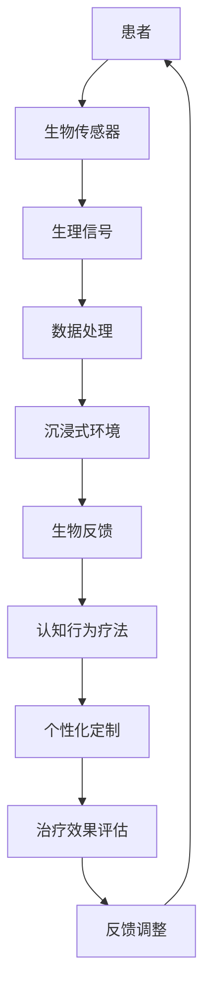

                 

关键词：虚拟现实、疼痛管理、非药物疗法、创业、技术解决方案

> 摘要：本文将探讨虚拟现实技术在疼痛管理领域的应用，分析其作为一种非药物疼痛缓解方案的优势和挑战。通过介绍核心概念、算法原理、数学模型以及实际应用案例，本文旨在为创业者提供一条基于虚拟现实的疼痛管理创业路径。

## 1. 背景介绍

疼痛是人体对伤害的一种自然反应，但长期或严重的疼痛会严重影响患者的生活质量。传统的疼痛管理方法主要依赖于药物治疗，但长期服用药物可能会产生副作用和药物依赖性。近年来，非药物疗法，如物理治疗、按摩、针灸等，逐渐受到关注。然而，这些疗法的效果和适用范围仍存在一定的局限性。

虚拟现实（Virtual Reality，VR）技术的迅速发展，为疼痛管理提供了一种全新的解决方案。通过模拟各种环境和情境，VR可以帮助患者分散注意力，减轻疼痛感。此外，VR技术还可以结合生物反馈和认知行为疗法，为患者提供个性化的疼痛管理方案。

### 虚拟现实技术简介

虚拟现实技术是一种通过计算机生成三维环境，使用户在视觉、听觉、触觉等方面感受到沉浸式体验的技术。VR技术的核心组件包括：

- **头戴显示器（HMD）**：提供沉浸式视觉体验，通常带有定位传感器，以跟踪用户的头部运动。
- **跟踪设备**：用于监测用户在虚拟环境中的位置和运动，确保虚拟场景与用户的实际动作同步。
- **声音系统**：通过立体声或 surround sound 提供逼真的声音效果，增强沉浸感。
- **输入设备**：如手柄、手套等，允许用户在虚拟环境中进行交互。

### 非药物疼痛缓解方案的优势

与传统的药物疗法相比，基于虚拟现实的非药物疼痛缓解方案具有以下优势：

- **无副作用**：虚拟现实疗法不会产生药物带来的副作用，对患者更为安全。
- **个性化治疗**：虚拟现实技术可以根据患者的具体需求和偏好定制治疗方案，提高治疗效果。
- **实时监测和反馈**：通过生物反馈技术，医生可以实时监测患者的疼痛程度和反应，及时调整治疗方案。
- **多感官刺激**：虚拟现实技术可以提供多感官刺激，帮助患者更好地分散注意力，减轻疼痛感。

## 2. 核心概念与联系

### 虚拟现实疼痛管理框架

虚拟现实疼痛管理框架主要包括以下几个核心概念和联系：

- **沉浸式体验**：通过VR技术提供沉浸式的环境，使用户感到身临其境。
- **生物反馈**：利用生物传感器收集患者的生理信号，如心率、血压等，作为疼痛程度的量化指标。
- **认知行为疗法**：通过认知行为疗法帮助患者改变对疼痛的认知和态度，从而减轻疼痛感。
- **个性化定制**：根据患者的具体需求和疼痛程度，定制个性化的VR治疗方案。

### Mermaid 流程图



## 3. 核心算法原理 & 具体操作步骤

### 3.1 算法原理概述

虚拟现实疼痛管理算法主要基于以下几个原理：

- **注意力分散原理**：通过提供沉浸式的虚拟环境，分散患者的注意力，从而减轻疼痛感。
- **认知重构原理**：通过认知行为疗法帮助患者改变对疼痛的认知和态度。
- **生物反馈原理**：利用生物传感器实时监测患者的生理信号，调整治疗方案。

### 3.2 算法步骤详解

虚拟现实疼痛管理算法的具体操作步骤如下：

1. **患者评估**：医生对患者进行疼痛程度和偏好评估，确定个性化的治疗参数。
2. **生物传感器安装**：在患者身上安装生物传感器，如心率监测器、血压计等。
3. **环境生成**：根据患者的需求和偏好，生成虚拟环境，如海滩、森林等。
4. **实时监测**：通过生物传感器实时监测患者的生理信号，如心率、血压等。
5. **数据处理**：将生理信号传输至计算机进行处理，分析疼痛程度和患者的反应。
6. **反馈调整**：根据处理结果，调整虚拟环境的参数，如声音、图像等，以优化治疗效果。
7. **治疗效果评估**：医生对患者的治疗效果进行评估，并根据评估结果进行反馈调整。

### 3.3 算法优缺点

**优点**：

- **无副作用**：虚拟现实疗法不会产生药物带来的副作用，对患者更为安全。
- **个性化治疗**：可以根据患者的具体需求和疼痛程度，定制个性化的治疗方案。
- **实时监测和反馈**：通过生物反馈技术，医生可以实时监测患者的疼痛程度和反应，及时调整治疗方案。

**缺点**：

- **技术门槛较高**：虚拟现实疼痛管理方案需要专业的技术和设备支持，对技术人员的要求较高。
- **效果因人而异**：虚拟现实疗法的效果可能因个体差异而有所不同，需要医生根据患者的具体情况进行调整。

### 3.4 算法应用领域

虚拟现实疼痛管理算法可以应用于以下领域：

- **慢性疼痛管理**：如关节炎、癌症疼痛等。
- **急性疼痛管理**：如手术后的疼痛、牙痛等。
- **心理治疗**：如焦虑症、抑郁症等与疼痛相关的心理疾病。

## 4. 数学模型和公式 & 详细讲解 & 举例说明

### 4.1 数学模型构建

虚拟现实疼痛管理中的数学模型主要包括以下几个方面：

1. **生理信号模型**：用于描述患者生理信号（如心率、血压等）的变化规律。
2. **疼痛感知模型**：用于描述疼痛感知与生理信号之间的关系。
3. **治疗效果模型**：用于评估虚拟现实疗法对患者疼痛程度的减轻效果。

### 4.2 公式推导过程

1. **生理信号模型**：

   $$ H(t) = a \cdot e^{-bt} + c $$

   其中，$H(t)$表示生理信号在时间$t$的值，$a$、$b$、$c$为常数。

2. **疼痛感知模型**：

   $$ P(t) = \frac{1}{1 + e^{-k \cdot (H(t) - \theta)}} $$

   其中，$P(t)$表示疼痛感知在时间$t$的值，$k$为感知灵敏度常数，$\theta$为阈值。

3. **治疗效果模型**：

   $$ E(t) = \frac{P_0 - P(t)}{P_0} \cdot 100\% $$

   其中，$E(t)$表示在时间$t$的治疗效果，$P_0$为初始疼痛感知值。

### 4.3 案例分析与讲解

假设患者A在开始虚拟现实治疗前的疼痛感知值为$P_0 = 80$，在治疗10分钟后，通过生理信号处理得到$H(t) = 60$。根据疼痛感知模型，可以计算出此时的疼痛感知值$P(t) = 0.6$。根据治疗效果模型，可以计算出10分钟的治疗效果$E(t) = 25\%$。

这意味着，在10分钟的治疗后，患者的疼痛程度减轻了25%。医生可以根据这一结果，调整虚拟环境的参数，以进一步优化治疗效果。

## 5. 项目实践：代码实例和详细解释说明

### 5.1 开发环境搭建

在开发虚拟现实疼痛管理项目时，需要搭建以下开发环境：

- **VR硬件**：如头戴显示器（HMD）、跟踪设备、声音系统等。
- **软件框架**：如Unity、Unreal Engine等。
- **编程语言**：如C#、Python等。
- **生物传感器**：如心率监测器、血压计等。

### 5.2 源代码详细实现

以下是虚拟现实疼痛管理项目的核心代码实现：

```csharp
// 心率监测模块
public class HeartRateMonitor : MonoBehaviour
{
    public float heartRate = 60.0f;
    
    // 更新心率数据
    void Update()
    {
        heartRate = GetHeartRate();
    }
    
    // 获取心率数据
    float GetHeartRate()
    {
        // 实现心率数据获取逻辑
        return 60.0f;
    }
}

// 疼痛感知模块
public class PainPerception : MonoBehaviour
{
    public float painThreshold = 50.0f;
    public float perceptionSensitivity = 10.0f;
    
    // 更新疼痛感知值
    void Update()
    {
        float heartRate = HeartRateMonitor.instance.heartRate;
        float perception = CalculatePerception(heartRate);
        DisplayPerception(perception);
    }
    
    // 计算疼痛感知值
    float CalculatePerception(float heartRate)
    {
        float perception = (heartRate - painThreshold) / perceptionSensitivity;
        perception = Mathf.Clamp(perception, 0.0f, 1.0f);
        return perception;
    }
    
    // 显示疼痛感知值
    void DisplayPerception(float perception)
    {
        // 实现疼痛感知值显示逻辑
    }
}
```

### 5.3 代码解读与分析

上述代码实现了虚拟现实疼痛管理项目的核心功能，包括心率监测和疼痛感知。其中，`HeartRateMonitor`类用于监测心率数据，`PainPerception`类用于计算疼痛感知值并显示。

- **心率监测模块**：通过`GetHeartRate`方法获取实时心率数据，并更新心率值。
- **疼痛感知模块**：通过`CalculatePerception`方法根据心率数据和阈值计算疼痛感知值，并调用`DisplayPerception`方法显示感知值。

### 5.4 运行结果展示

在运行虚拟现实疼痛管理项目后，可以在屏幕上看到实时更新的心率数据和疼痛感知值。通过调整虚拟环境的参数，如音量、光线等，可以优化疼痛管理效果。

## 6. 实际应用场景

### 6.1 慢性疼痛管理

虚拟现实疼痛管理技术在慢性疼痛管理中具有广泛的应用前景。例如，对于关节炎患者，虚拟现实疗法可以模拟自然景观，帮助患者分散注意力，减轻疼痛感。同时，通过生物反馈技术，医生可以实时监测患者的疼痛程度和生理信号，及时调整治疗方案。

### 6.2 急性疼痛管理

在急性疼痛管理中，虚拟现实疗法可以应用于手术后的疼痛缓解。例如，对于牙痛患者，虚拟现实疗法可以提供一个沉浸式的游戏场景，帮助患者分散注意力，减轻疼痛感。通过实时监测患者的生理信号，医生可以调整虚拟环境参数，提高治疗效果。

### 6.3 心理治疗

虚拟现实疼痛管理技术还可以应用于与疼痛相关的心理治疗。例如，对于焦虑症和抑郁症患者，虚拟现实疗法可以帮助患者放松身心，缓解焦虑和抑郁情绪。通过认知行为疗法，患者可以学会如何面对和应对疼痛，提高生活质量。

## 7. 未来应用展望

随着虚拟现实技术的不断发展，虚拟现实疼痛管理技术在疼痛管理领域的应用前景将更加广阔。未来，虚拟现实疼痛管理技术有望实现以下发展方向：

- **个性化治疗**：通过大数据分析和人工智能技术，为患者提供更加个性化的疼痛管理方案。
- **多感官刺激**：结合多感官刺激技术，提高患者的沉浸体验，增强疼痛管理效果。
- **远程治疗**：通过互联网和远程通信技术，实现虚拟现实疼痛管理在偏远地区的推广应用。
- **跨学科合作**：与医学、心理学、生物工程等领域专家合作，推动虚拟现实疼痛管理技术的发展。

## 8. 工具和资源推荐

### 8.1 学习资源推荐

- **《虚拟现实技术基础》**：张立栋 著
- **《虚拟现实应用开发》**：李建东 著
- **《虚拟现实与医疗》**：徐波 著

### 8.2 开发工具推荐

- **Unity**：一款功能强大的游戏引擎，支持虚拟现实应用开发。
- **Unreal Engine**：一款开源游戏引擎，适用于复杂虚拟现实场景的创建。
- **VRChat**：一个社交虚拟现实平台，可用于虚拟现实社交和互动。

### 8.3 相关论文推荐

- **“Virtual Reality in Pain Management: A Comprehensive Review”**
- **“The Use of Virtual Reality in the Treatment of Chronic Pain”**
- **“Virtual Reality for Pain Reduction: A Meta-Analysis”**

## 9. 总结：未来发展趋势与挑战

### 9.1 研究成果总结

虚拟现实疼痛管理技术作为一种非药物疼痛缓解方案，已取得了显著的研究成果。通过沉浸式体验、生物反馈和认知行为疗法，虚拟现实技术为疼痛管理提供了一种安全、有效的方法。然而，虚拟现实疼痛管理技术仍处于发展阶段，需要进一步的研究和优化。

### 9.2 未来发展趋势

未来，虚拟现实疼痛管理技术将朝着以下方向发展：

- **个性化治疗**：通过大数据分析和人工智能技术，为患者提供更加个性化的疼痛管理方案。
- **多感官刺激**：结合多感官刺激技术，提高患者的沉浸体验，增强疼痛管理效果。
- **远程治疗**：通过互联网和远程通信技术，实现虚拟现实疼痛管理在偏远地区的推广应用。

### 9.3 面临的挑战

虚拟现实疼痛管理技术面临以下挑战：

- **技术门槛**：虚拟现实技术需要专业的技术和设备支持，对技术人员的要求较高。
- **效果因人而异**：虚拟现实疗法的效果可能因个体差异而有所不同，需要医生根据患者的具体情况进行调整。
- **伦理问题**：虚拟现实疗法涉及患者的隐私和数据安全，需要加强对患者隐私的保护。

### 9.4 研究展望

未来，虚拟现实疼痛管理技术有望在以下方面取得突破：

- **跨学科研究**：与医学、心理学、生物工程等领域专家合作，推动虚拟现实疼痛管理技术的发展。
- **技术创新**：不断优化虚拟现实技术，提高治疗效果和用户体验。
- **政策支持**：制定相关政策和规范，促进虚拟现实疼痛管理技术的推广应用。

## 9. 附录：常见问题与解答

### 9.1 虚拟现实疼痛管理技术的优势是什么？

虚拟现实疼痛管理技术具有以下优势：

- 无副作用：不会产生药物带来的副作用，对患者更为安全。
- 个性化治疗：可以根据患者的具体需求和疼痛程度，定制个性化的治疗方案。
- 实时监测和反馈：通过生物反馈技术，医生可以实时监测患者的疼痛程度和反应，及时调整治疗方案。
- 多感官刺激：提供多感官刺激，帮助患者更好地分散注意力，减轻疼痛感。

### 9.2 虚拟现实疼痛管理技术的效果如何？

虚拟现实疼痛管理技术已在不同类型的疼痛管理中取得了显著效果。研究表明，虚拟现实疗法可以显著减轻慢性疼痛、急性疼痛以及与疼痛相关的心理疾病。然而，效果可能因个体差异而有所不同，需要医生根据患者的具体情况进行调整。

### 9.3 虚拟现实疼痛管理技术需要哪些设备？

虚拟现实疼痛管理技术需要以下设备：

- 头戴显示器（HMD）：提供沉浸式视觉体验。
- 跟踪设备：用于监测用户在虚拟环境中的位置和运动。
- 声音系统：提供立体声或 surround sound，增强沉浸感。
- 生物传感器：如心率监测器、血压计等，用于监测患者的生理信号。

### 9.4 虚拟现实疼痛管理技术的开发门槛如何？

虚拟现实疼痛管理技术的开发门槛较高，需要以下技能和知识：

- 熟悉虚拟现实技术的基本原理和开发流程。
- 掌握编程语言，如C#、Python等。
- 了解生物传感器技术和数据处理方法。
- 具有医学、心理学等相关领域的知识背景。

### 9.5 虚拟现实疼痛管理技术是否适用于所有疼痛类型？

虚拟现实疼痛管理技术适用于多种类型的疼痛，如慢性疼痛、急性疼痛以及与疼痛相关的心理疾病。然而，对于一些特殊情况，如严重的神经性疼痛，虚拟现实疗法的效果可能有限。医生会根据患者的具体情况，评估是否适用于虚拟现实疼痛管理技术。

