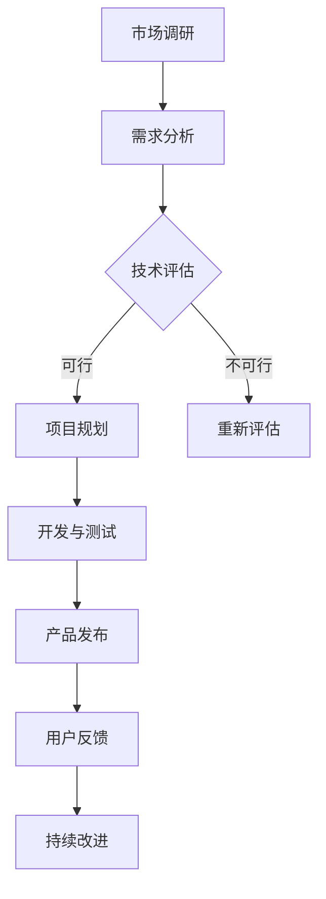

                 

 

> **关键词**：虚拟现实、社交创业、元宇宙、人际交往、技术发展。

> **摘要**：本文探讨了虚拟现实技术在社交创业中的应用，特别是在构建元宇宙中的人际交往模式。文章首先介绍了虚拟现实技术的发展背景，接着讨论了元宇宙的概念及其对社交模式的影响，随后分析了在元宇宙中构建人际关系的挑战与机遇。最后，文章提出了未来的发展趋势与面临的挑战，为虚拟现实社交创业提供了方向性建议。

## 1. 背景介绍

虚拟现实（Virtual Reality，VR）技术自20世纪90年代以来，经历了从实验室原型到商业应用的快速转变。随着硬件设备的不断进步和算法的优化，VR技术正逐渐渗透到人们的生活和工作中。特别是在游戏、娱乐和教育等领域，VR已经取得了显著成果。然而，随着技术的进一步发展，虚拟现实开始向更广泛的领域扩展，包括社交互动。

社交创业是指基于社交网络和平台，利用创新的商业模式和工具，为用户提供新的社交体验和服务的创业活动。随着互联网的普及，社交创业已经成为推动经济增长和创新的重要力量。然而，传统的线上社交方式，如文本、图片和视频，已经无法满足用户日益增长的社交需求。这为虚拟现实社交创业提供了广阔的市场空间。

元宇宙（Metaverse）是一个虚拟的3D空间，由多个平台和应用程序组成，用户可以在其中进行各种活动，如社交、工作、娱乐和购物。元宇宙被认为是互联网的下一个重要发展方向，预计将在未来几年内成为数字经济的核心组成部分。在元宇宙中，用户可以通过虚拟角色（Avatar）进行互动，这种沉浸式的体验有望彻底改变人们的社交方式。

## 2. 核心概念与联系

### 2.1 虚拟现实技术

虚拟现实技术是通过计算机生成模拟环境，使用户能够沉浸其中并进行交互。主要组成部分包括：

- **显示设备**：如头戴式显示器（HMD）和投影设备。
- **传感器**：如头部追踪器、手部追踪器和位置追踪器。
- **计算机系统**：用于生成和渲染虚拟环境。


### 2.2 元宇宙

元宇宙是由多个虚拟世界组成的网络，用户可以在其中自由穿梭和互动。关键组成部分包括：

- **虚拟世界**：用户可以访问和交互的虚拟空间。
- **数字资产**：如虚拟货币、虚拟土地和虚拟物品。
- **社交平台**：支持用户在虚拟世界中的互动。


### 2.3 人际关系

在元宇宙中，人际关系是通过虚拟角色（Avatar）进行的。人际关系的特点包括：

- **虚拟身份**：用户可以通过虚拟角色表达自己，这种身份可以是真实的扩展，也可以是完全虚构的。
- **沉浸式互动**：用户可以在虚拟世界中与他人进行面对面的互动，增强了社交体验。
- **隐私和安全**：虚拟世界中的隐私和安全问题需要特别关注，以防止欺诈和网络犯罪。


### 2.4 Mermaid 流程图

以下是一个简单的Mermaid流程图，展示了虚拟现实社交创业的流程：



## 3. 核心算法原理 & 具体操作步骤

### 3.1 算法原理概述

虚拟现实社交创业的核心算法涉及以下几个方面：

- **3D建模与渲染**：用于创建虚拟环境和角色。
- **运动追踪与交互**：实时追踪用户动作，实现虚拟世界的交互。
- **语音与文本通信**：支持用户之间的实时通信。

### 3.2 算法步骤详解

1. **3D建模与渲染**：
   - 收集用户需求，设计虚拟环境和角色。
   - 使用3D建模软件（如Blender）创建模型。
   - 使用渲染引擎（如Unity或Unreal Engine）进行渲染。

2. **运动追踪与交互**：
   - 使用传感器（如头部追踪器和手部追踪器）实时捕捉用户动作。
   - 将动作数据转换为虚拟世界中的动作。

3. **语音与文本通信**：
   - 集成语音识别和语音合成技术，实现语音通信。
   - 集成文本输入和输出，实现文本通信。

### 3.3 算法优缺点

- **优点**：
  - 提供沉浸式的社交体验。
  - 支持多样化的社交场景和活动。
  - 有助于减少社交距离，促进跨文化交流。

- **缺点**：
  - 技术门槛较高，需要专业的开发团队。
  - 可能引发隐私和安全问题。
  - 对硬件设备要求较高，可能影响用户体验。

### 3.4 算法应用领域

虚拟现实社交创业算法主要应用于以下领域：

- **社交平台**：如虚拟现实聊天室、虚拟社交活动等。
- **娱乐与游戏**：如虚拟现实游戏、虚拟现实演唱会等。
- **教育**：如虚拟现实课堂、虚拟现实实训等。

## 4. 数学模型和公式 & 详细讲解 & 举例说明

### 4.1 数学模型构建

虚拟现实社交创业中的数学模型主要涉及以下几个方面：

- **3D空间建模**：包括点的坐标、向量、矩阵等基本概念。
- **运动学模型**：包括刚体运动、非刚体运动等。
- **交互模型**：包括碰撞检测、物理仿真等。

### 4.2 公式推导过程

以下是一个简单的碰撞检测公式推导过程：

$$
p_{\text{current}} = p_{\text{start}} + v \cdot t
$$

其中，$p_{\text{current}}$ 是当前位置，$p_{\text{start}}$ 是起始位置，$v$ 是速度向量，$t$ 是时间。

### 4.3 案例分析与讲解

假设一个用户在虚拟世界中移动，速度为 $v = [1, 1, 0]^T$，起始位置为 $p_{\text{start}} = [0, 0, 0]^T$。经过 $t = 5$ 秒后，用户的位置为：

$$
p_{\text{current}} = [0, 0, 0]^T + [1, 1, 0]^T \cdot 5 = [5, 5, 0]^T
$$

这意味着用户在5秒后到达了 $[5, 5, 0]^T$ 位置。

## 5. 项目实践：代码实例和详细解释说明

### 5.1 开发环境搭建

在进行虚拟现实社交创业项目之前，我们需要搭建一个合适的开发环境。以下是所需的步骤：

1. 安装Unity编辑器。
2. 安装Unity的VR插件。
3. 配置必要的硬件设备，如VR头戴设备和手柄。

### 5.2 源代码详细实现

以下是一个简单的Unity脚本，用于实现用户在虚拟世界中的移动：

```csharp
using UnityEngine;

public class PlayerMovement : MonoBehaviour
{
    public float speed = 5.0f;

    private Vector3 moveDirection;

    // Update is called once per frame
    void Update()
    {
        // 计算移动方向
        moveDirection = new Vector3(Input.GetAxis("Horizontal"), 0, Input.GetAxis("Vertical"));

        // 应用移动
        transform.position += moveDirection * speed * Time.deltaTime;
    }
}
```

### 5.3 代码解读与分析

这个脚本通过获取用户的输入来计算移动方向，并将这个方向与预设的速度相乘，最后将结果应用到玩家的位置上。这样可以实现玩家在虚拟世界中的移动。

### 5.4 运行结果展示

当用户在VR环境中运行这个脚本时，他们可以通过移动头部和手柄来控制角色的移动，体验沉浸式的虚拟现实社交。

## 6. 实际应用场景

虚拟现实社交创业在多个领域有着广泛的应用场景：

- **社交平台**：如Facebook的Horizon Workrooms，允许用户在虚拟会议室中开会和协作。
- **娱乐与游戏**：如《Second Life》和《VRChat》，提供了沉浸式的社交和游戏体验。
- **教育**：如哈佛大学的虚拟现实课程，为学生提供了全新的学习体验。

## 7. 工具和资源推荐

### 7.1 学习资源推荐

- **《Virtual Reality Programming All-in-One for Dummies》**：提供了虚拟现实编程的基础知识。
- **Unity官方文档**：提供了详细的Unity和VR开发指南。

### 7.2 开发工具推荐

- **Unity**：一个功能强大的游戏和VR开发平台。
- **Blender**：一个免费且开源的3D建模和渲染软件。

### 7.3 相关论文推荐

- **"The Metaverse: A Vision for the Future of Social Interaction"**：探讨了元宇宙对未来社交模式的影响。
- **"Virtual Reality and Social Interaction: A Review"**：回顾了虚拟现实社交互动的研究现状。

## 8. 总结：未来发展趋势与挑战

虚拟现实社交创业正处于快速发展阶段，预计将在未来几年内取得显著进展。然而，这也带来了许多挑战，包括隐私保护、用户接受度和技术发展等。未来，我们需要持续探索和创新，以推动虚拟现实社交创业的发展。

### 8.1 研究成果总结

本文通过对虚拟现实技术、元宇宙和人际关系的深入探讨，总结了虚拟现实社交创业的核心概念和操作步骤，并提出了一系列实际应用场景。

### 8.2 未来发展趋势

虚拟现实社交创业将在以下方面取得进展：

- **技术突破**：硬件设备和算法的进一步优化。
- **商业模式创新**：更多的社交平台和企业将加入元宇宙。
- **用户体验提升**：更逼真的虚拟世界和更自然的交互方式。

### 8.3 面临的挑战

虚拟现实社交创业面临的挑战包括：

- **隐私和安全**：如何保护用户的隐私和安全。
- **用户接受度**：如何吸引更多的用户参与。
- **技术瓶颈**：如何克服硬件和算法的限制。

### 8.4 研究展望

未来的研究应重点关注以下几个方面：

- **隐私保护技术**：开发更有效的隐私保护措施。
- **跨平台互操作性**：实现不同平台之间的无缝交互。
- **用户体验优化**：提高虚拟世界的沉浸感和互动性。

## 9. 附录：常见问题与解答

### Q：什么是元宇宙？

A：元宇宙是一个虚拟的3D空间，由多个平台和应用程序组成，用户可以在其中进行各种活动，如社交、工作、娱乐和购物。

### Q：虚拟现实社交创业有哪些挑战？

A：虚拟现实社交创业面临的挑战包括隐私保护、用户接受度和技术发展等。

### Q：如何开始一个虚拟现实社交创业项目？

A：开始一个虚拟现实社交创业项目需要以下几个步骤：确定市场需求、搭建开发环境、设计虚拟世界、编写代码、进行测试和发布。

---

作者：禅与计算机程序设计艺术 / Zen and the Art of Computer Programming

【END】

