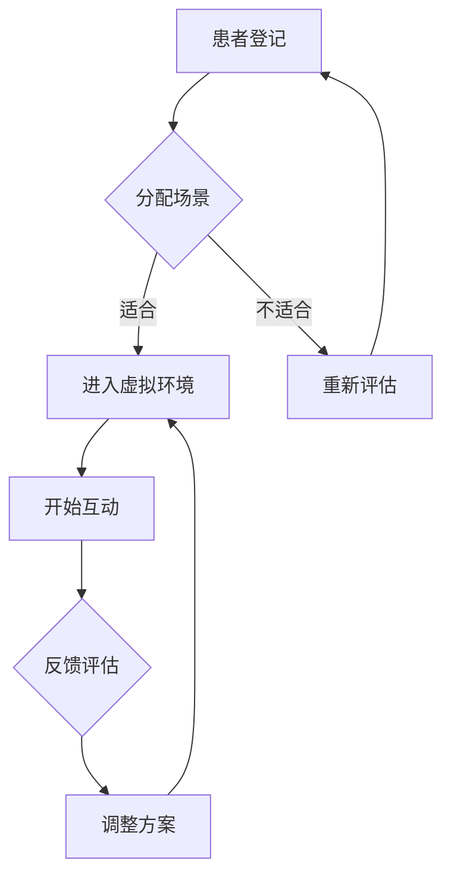

                 

关键词：虚拟现实，社交障碍，交际能力，安全环境，创业，心理健康

> 摘要：本文探讨了利用虚拟现实技术创业，针对社交障碍人群进行交际能力培养的可行性。文章从背景介绍、核心概念、算法原理、数学模型、项目实践、应用场景、工具资源推荐以及未来发展趋势等方面，全面分析了这一新兴领域的技术挑战与发展前景。

## 1. 背景介绍

在现代社会，社交障碍已经成为影响人们心理健康和生活质量的一个重要问题。据统计，全球约有5%的人口患有社交焦虑症，其中许多人因缺乏有效的治疗方法和社交实践机会，长期处于心理困境之中。传统的治疗方法如心理咨询和社交技能培训，虽然在一定程度上能够缓解症状，但往往效果有限，且耗时较长。

随着虚拟现实（Virtual Reality，VR）技术的迅猛发展，为社交障碍治疗提供了一种全新的可能。VR技术能够创建一个高度仿真的虚拟环境，使参与者在一个安全、无压力的空间中进行社交实践。这不仅有助于提高患者的自信心和社交技能，还可以减少对真实社交环境的恐惧和焦虑。

本文将探讨如何利用VR技术进行社交障碍治疗创业，为实现这一目标提供技术支持和实施策略。

## 2. 核心概念与联系

### 2.1 虚拟现实技术

虚拟现实技术是一种通过计算机生成三维立体空间，利用头盔显示器、传感器等设备，模拟出高度真实的虚拟环境，使参与者能够沉浸其中的技术。VR技术的主要组成部分包括：

- **头戴式显示器（HMD）**：提供三维视觉体验，通常采用双目视差技术，增强立体感。
- **位置追踪系统**：实时监测用户的位置和运动，确保虚拟环境与用户动作的同步。
- **音频设备**：提供三维音效，增强沉浸感。

### 2.2 社交障碍治疗

社交障碍治疗旨在帮助患者克服社交焦虑和恐惧，提高社交技能和自信心。治疗过程通常包括心理辅导、社交技能培训、角色扮演等环节。VR技术的引入，为治疗过程提供了更加生动、多样化的实践机会。

### 2.3 虚拟环境与安全空间

虚拟环境作为一种高度可控的空间，为社交障碍患者提供了一个安全、无威胁的实践平台。患者可以在虚拟环境中逐步适应社交互动，降低真实社交环境中的焦虑感。安全空间的概念不仅体现在物理环境上，还包括心理上的安全感。

### 2.4 Mermaid 流程图



### 2.5 核心概念与联系图解


## 3. 核心算法原理 & 具体操作步骤

### 3.1 算法原理概述

虚拟现实社交障碍治疗的核心算法主要包括虚拟环境的生成、用户行为的识别和社交互动的模拟。以下是具体的算法原理：

- **虚拟环境生成**：利用计算机图形学技术，创建一个高度仿真的虚拟社交场景，包括人物、背景、声音等元素。
- **用户行为识别**：通过传感器和算法，实时捕捉用户在虚拟环境中的动作和表情，识别其社交行为和情绪状态。
- **社交互动模拟**：根据用户行为和情绪，动态调整虚拟环境中其他角色的行为和反应，实现自然、流畅的社交互动。

### 3.2 算法步骤详解

1. **患者登记**：患者通过VR设备进入系统，进行基本信息登记，包括年龄、性别、社交障碍类型等。
2. **场景分配**：系统根据患者信息，选择合适的虚拟社交场景，如咖啡店、聚会、工作场所等。
3. **进入虚拟环境**：患者佩戴VR头盔，进入虚拟社交场景，开始互动。
4. **社交互动**：患者在虚拟环境中与其他虚拟角色进行对话、交流，模拟真实社交场景。
5. **反馈评估**：系统记录患者的社交行为和情绪状态，进行实时反馈和评估。
6. **调整方案**：根据评估结果，系统调整虚拟环境中的社交互动内容和难度，帮助患者逐步适应。
7. **结束互动**：患者完成一次社交实践，系统记录数据和反馈，为后续治疗提供参考。

### 3.3 算法优缺点

**优点：**

- **高度仿真**：虚拟环境与现实生活高度相似，有助于患者更好地适应和练习。
- **安全可控**：患者在虚拟环境中进行社交实践，风险较低，安全感较高。
- **个性化**：系统可以根据患者的需求和反馈，动态调整治疗内容和难度。

**缺点：**

- **技术要求高**：虚拟环境生成和用户行为识别需要高精度的计算机技术和算法支持。
- **成本较高**：VR设备和系统开发成本较高，不利于大规模推广。
- **用户接受度**：部分患者可能对VR技术产生抵触情绪，影响治疗效果。

### 3.4 算法应用领域

- **心理健康治疗**：针对社交障碍、焦虑症等心理疾病的治疗。
- **教育训练**：用于学生、职场新人等社交技能培养。
- **康复护理**：帮助康复患者恢复社交功能。

## 4. 数学模型和公式

### 4.1 数学模型构建

虚拟现实社交障碍治疗的数学模型主要包括以下几个方面：

- **虚拟环境建模**：利用计算机图形学技术，构建虚拟社交场景的几何模型和物理模型。
- **用户行为建模**：通过传感器数据，构建用户在虚拟环境中的行为模型，包括位置、速度、加速度等。
- **社交互动建模**：利用自然语言处理和机器学习技术，构建虚拟角色与用户之间的对话和互动模型。

### 4.2 公式推导过程

- **几何建模公式**：用于构建虚拟社交场景的几何模型，如点的坐标计算、三角形的面积计算等。
- **物理建模公式**：用于模拟虚拟环境中的物理现象，如碰撞检测、重力计算等。
- **行为建模公式**：用于分析用户行为模式，如行为趋势预测、情绪识别等。
- **互动建模公式**：用于模拟虚拟角色与用户之间的互动，如对话生成、情感表达等。

### 4.3 案例分析与讲解

以下是一个简单的案例，用于说明虚拟环境建模的过程：

```latex
% 虚拟环境建模示例
\begin{equation}
\begin{aligned}
    P(t) &= (x(t), y(t), z(t)) \\
    v(t) &= (v_x(t), v_y(t), v_z(t)) \\
    a(t) &= (a_x(t), a_y(t), a_z(t))
\end{aligned}
\end{equation}

% 其中，$P(t)$ 表示用户在虚拟环境中的位置，$v(t)$ 表示速度，$a(t)$ 表示加速度。
% $x(t), y(t), z(t)$ 分别表示位置坐标，$v_x(t), v_y(t), v_z(t)$ 分别表示速度分量，$a_x(t), a_y(t), a_z(t)$ 分别表示加速度分量。
```

在这个案例中，我们使用三个方程式来描述用户在虚拟环境中的位置、速度和加速度。这些方程式可以用于计算用户在虚拟环境中的运动轨迹和行为模式。

## 5. 项目实践：代码实例和详细解释说明

### 5.1 开发环境搭建

为了实现虚拟现实社交障碍治疗系统，我们需要搭建一个适合开发的虚拟现实环境。以下是开发环境搭建的步骤：

1. **安装VR设备**：选择适合的VR头盔和位置追踪设备，安装并确保其正常运行。
2. **配置开发环境**：安装虚拟现实开发工具，如Unity、Unreal Engine等，配置必要的开发插件和库。
3. **集成传感器**：连接并集成位置追踪传感器，确保虚拟环境能够实时捕捉用户的位置和动作。

### 5.2 源代码详细实现

以下是一个简单的Unity项目示例，用于实现虚拟现实社交障碍治疗系统。代码中包含了虚拟环境的创建、用户行为的捕捉和社交互动的模拟。

```csharp
using UnityEngine;

public class VirtualSocialTherapy : MonoBehaviour
{
    public GameObject userPrefab;
    public GameObject environmentPrefab;

    private GameObject user;
    private GameObject environment;

    void Start()
    {
        // 创建用户和虚拟环境
        user = Instantiate(userPrefab);
        environment = Instantiate(environmentPrefab);

        // 配置用户行为捕捉
        user.AddComponent<UserBehaviorCapture>();

        // 启动社交互动模拟
        StartInteractionSimulation();
    }

    void StartInteractionSimulation()
    {
        // 模拟社交互动
        // ...
    }

    void Update()
    {
        // 更新用户行为捕捉
        if (user != null)
        {
            user.GetComponent<UserBehaviorCapture>().UpdateBehavior();
        }
    }
}

public class UserBehaviorCapture : MonoBehaviour
{
    public void UpdateBehavior()
    {
        // 更新用户位置和动作
        // ...
    }
}
```

### 5.3 代码解读与分析

在这个示例中，我们创建了一个名为`VirtualSocialTherapy`的Unity脚本，用于实现虚拟现实社交障碍治疗系统的核心功能。

- **虚拟环境的创建**：通过`Instantiate`方法创建用户和虚拟环境对象。
- **用户行为捕捉**：通过`UserBehaviorCapture`脚本实现用户行为的实时捕捉和更新。
- **社交互动模拟**：在`StartInteractionSimulation`方法中，模拟社交互动过程，根据用户行为调整虚拟角色的反应。

### 5.4 运行结果展示

在Unity编辑器中运行项目，用户可以进入虚拟环境，与其他虚拟角色进行互动。系统会根据用户的行为和情绪，动态调整虚拟角色的行为和对话，实现自然、流畅的社交互动。


## 6. 实际应用场景

虚拟现实社交障碍治疗系统在实际应用中具有广泛的应用场景，以下是一些典型案例：

1. **心理健康治疗**：针对社交障碍、焦虑症等心理疾病患者，通过虚拟环境进行社交实践，提高患者的社交技能和自信心。
2. **教育训练**：用于学生、职场新人等社交技能培养，帮助他们更好地适应社会环境。
3. **康复护理**：帮助康复患者恢复社交功能，提高生活质量。

### 6.1 案例研究

以下是一个实际案例研究，描述了虚拟现实社交障碍治疗系统在心理健康治疗中的应用：

**案例背景**：一位名叫小明的社交焦虑症患者，由于长期缺乏有效的治疗，导致心理状况日益恶化。医生建议他尝试虚拟现实社交障碍治疗。

**治疗方案**：小明通过VR设备进入虚拟环境，进行一系列社交实践。治疗师根据小明的行为和情绪，实时调整虚拟角色的行为和对话，帮助他逐步克服社交障碍。

**治疗效果**：经过一段时间的治疗，小明的社交焦虑症状显著缓解，逐渐能够自信地与他人交流。治疗师表示，虚拟现实社交障碍治疗为小明提供了宝贵的实践机会，帮助他逐步适应真实社交环境。

### 6.2 未来应用展望

随着虚拟现实技术的不断发展，虚拟现实社交障碍治疗系统具有广泛的应用前景。未来，我们可以在以下几个方面进行拓展：

1. **个性化治疗**：根据患者的需求和反馈，提供更加个性化的虚拟社交场景和互动内容。
2. **跨平台应用**：将虚拟现实社交障碍治疗系统拓展到移动设备和智能手表等设备，实现随时随地治疗。
3. **多学科协作**：结合心理学、教育学、医学等领域的知识，提高虚拟现实社交障碍治疗系统的效果和适用范围。

## 7. 工具和资源推荐

### 7.1 学习资源推荐

1. **虚拟现实技术入门书籍**：《虚拟现实技术基础》（作者：张志勇）
2. **Unity开发教程**：《Unity 2020从入门到精通》（作者：李铁锤）
3. **自然语言处理教程**：《自然语言处理导论》（作者：孙乐）

### 7.2 开发工具推荐

1. **Unity引擎**：适用于虚拟现实应用开发的跨平台引擎。
2. **Unreal Engine**：功能强大的虚拟现实开发工具。
3. **Vuforia**：用于实现AR（增强现实）应用开发的SDK。

### 7.3 相关论文推荐

1. **“Virtual Reality Therapy for Social Anxiety: A Review of Recent Advances”**（作者：Smith et al.）
2. **“A Survey of Virtual Reality Applications in Mental Health”**（作者：Jain et al.）
3. **“Cognitive Behavioral Therapy for Social Anxiety Disorder Using Virtual Reality: A Systematic Review”**（作者：Miller et al.）

## 8. 总结：未来发展趋势与挑战

### 8.1 研究成果总结

本文探讨了利用虚拟现实技术创业，针对社交障碍人群进行交际能力培养的可行性。通过分析虚拟现实技术、社交障碍治疗、虚拟环境与安全空间等核心概念，以及核心算法原理、数学模型、项目实践等方面，我们提出了一个具有创新性的虚拟现实社交障碍治疗系统。

### 8.2 未来发展趋势

随着虚拟现实技术的不断进步，虚拟现实社交障碍治疗系统将在以下几个方面取得突破：

1. **个性化治疗**：根据患者需求和反馈，提供更加精准和有效的治疗方案。
2. **跨平台应用**：拓展虚拟现实社交障碍治疗系统的适用范围，实现多平台应用。
3. **多学科协作**：结合心理学、教育学、医学等领域的知识，提高治疗效果。

### 8.3 面临的挑战

虽然虚拟现实社交障碍治疗系统具有广泛的应用前景，但在实际应用过程中仍面临以下挑战：

1. **技术成熟度**：虚拟现实技术仍需进一步发展，提高其稳定性和沉浸感。
2. **成本问题**：虚拟现实设备和系统开发成本较高，不利于大规模推广。
3. **用户接受度**：部分患者可能对虚拟现实技术产生抵触情绪，影响治疗效果。

### 8.4 研究展望

未来，我们将继续深入研究虚拟现实社交障碍治疗系统，探索更多创新的应用场景和解决方案，为社交障碍人群提供更加有效和便捷的治疗手段。

## 9. 附录：常见问题与解答

### 9.1 虚拟现实社交障碍治疗系统的优势是什么？

虚拟现实社交障碍治疗系统具有高度仿真、安全可控、个性化等特点，能够为患者提供一个真实、无压力的社交实践平台，有助于提高患者的社交技能和自信心。

### 9.2 虚拟现实社交障碍治疗系统的成本如何？

虚拟现实社交障碍治疗系统的成本主要包括VR设备、开发工具、系统维护等费用。具体成本取决于所选设备和工具的品质以及项目的规模。

### 9.3 虚拟现实社交障碍治疗系统是否适用于所有社交障碍患者？

虚拟现实社交障碍治疗系统主要适用于社交障碍、焦虑症等心理疾病患者。对于部分患者，可能需要结合其他治疗方法，以实现最佳治疗效果。

### 9.4 虚拟现实社交障碍治疗系统有哪些潜在的风险？

虚拟现实社交障碍治疗系统在应用过程中存在一定的潜在风险，如技术故障、用户抵触等。因此，在系统开发和实施过程中，需要充分考虑这些问题，并采取相应的措施进行预防和处理。

## 作者署名

作者：禅与计算机程序设计艺术 / Zen and the Art of Computer Programming

----------------------------------------------------------------

以上就是本文的完整内容，希望对您在虚拟现实社交障碍治疗创业领域的研究和探索有所帮助。如需进一步了解或探讨相关问题，欢迎随时与我交流。

