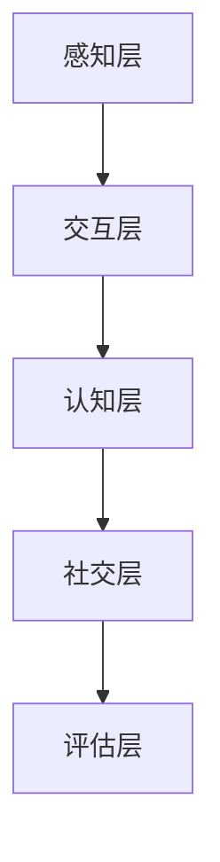

                 

关键词：虚拟现实、社交障碍治疗、安全环境、交际能力、创业

摘要：本文探讨了一种创新的创业模式，即利用虚拟现实技术为患有社交障碍的人群提供安全、匿名的社交环境，以帮助他们在虚拟世界中提升交际能力。通过详细介绍虚拟现实社交障碍治疗的背景、核心概念、算法原理、数学模型、项目实践以及未来应用场景，本文旨在为相关领域的研究者和创业者提供有价值的参考。

## 1. 背景介绍

社交障碍是一种常见的心理障碍，严重影响患者的社会交往和生活质量。据统计，全球约有3.5亿人患有不同程度的社交障碍，其中绝大多数无法通过传统的心理治疗和药物治疗获得满意的效果。随着虚拟现实技术的快速发展，为解决这一难题提供了新的思路。

虚拟现实（VR）技术通过模拟真实世界的环境和交互方式，为用户创造一个沉浸式的体验。这种沉浸感不仅能够帮助用户在虚拟世界中更好地掌握社交技能，还能够降低现实世界中的社交压力，使患者在安全、匿名的环境中逐渐适应社交互动。

近年来，虚拟现实社交障碍治疗逐渐成为研究热点。一些初步的研究结果显示，虚拟现实技术对于提升社交障碍患者的交际能力具有显著的效果。然而，目前这一领域的研究尚处于初级阶段，缺乏系统性和深度。本文旨在对虚拟现实社交障碍治疗的创业机会进行深入分析，并探讨其未来发展前景。

## 2. 核心概念与联系

虚拟现实社交障碍治疗的实现离不开以下几个核心概念：

### 2.1 虚拟现实

虚拟现实技术是一种通过计算机模拟和生成三维空间，为用户提供沉浸式体验的技术。虚拟现实的关键在于其沉浸感，即用户在虚拟环境中感受到的逼真程度。为了实现高度的沉浸感，虚拟现实技术通常需要以下几个关键组件：

- **头戴显示器（HMD）**：用于为用户提供视觉和听觉反馈。
- **跟踪设备**：用于跟踪用户在虚拟环境中的位置和动作。
- **交互设备**：如手柄、手套等，用于用户在虚拟环境中的交互。

### 2.2 社交障碍

社交障碍是指个体在社交场合中表现出过度焦虑、恐惧、回避等行为，导致其社会交往能力和生活质量受到严重影响。常见的社交障碍包括：

- **社交恐惧症**：患者对社交场合产生过度恐惧，导致回避社交活动。
- **自闭症谱系障碍**：患者在社会交往、沟通和兴趣爱好方面表现出显著的障碍。

### 2.3 安全环境

在虚拟现实社交障碍治疗中，安全环境至关重要。安全环境指的是一个用户可以放心参与社交互动的虚拟空间，具有以下几个特点：

- **匿名性**：用户可以在虚拟环境中隐藏真实身份，降低社交压力。
- **可控性**：虚拟环境可以设置成可控状态，避免意外的社交冲突。
- **适应性**：虚拟环境可以根据用户的需求和进展进行个性化调整。

### 2.4 交际能力

交际能力是指个体在社交场合中有效沟通、建立关系和解决问题等能力。在虚拟现实社交障碍治疗中，提升用户的交际能力是关键目标。交际能力包括：

- **沟通技巧**：如语言表达、倾听和理解等。
- **情感管理**：如情绪调节、同理心和自我意识等。
- **社会规则**：如社交礼仪、社交场合的应对策略等。

### 2.5 虚拟现实社交障碍治疗的架构

虚拟现实社交障碍治疗的架构可以分为以下几个层次：

- **感知层**：包括用户输入（如视觉、听觉、触觉等）和虚拟环境反馈。
- **交互层**：包括用户与虚拟环境之间的交互，如移动、操作等。
- **认知层**：包括用户在虚拟环境中的思维、情感和行为。
- **社交层**：包括用户在虚拟环境中的社交互动，如对话、合作、竞争等。
- **评估层**：通过对用户在虚拟环境中的表现进行评估，以监测治疗效果。

以下是虚拟现实社交障碍治疗的 Mermaid 流程图：



## 3. 核心算法原理 & 具体操作步骤

### 3.1 算法原理概述

虚拟现实社交障碍治疗的算法原理主要涉及以下几个方面：

- **虚拟现实场景构建**：通过计算机图形学技术，构建出符合治疗目标的虚拟场景，包括社交场所、人物形象等。
- **用户行为分析**：通过跟踪和分析用户在虚拟环境中的行为，识别用户的需求和问题，为治疗提供依据。
- **社交互动模拟**：通过人工智能技术，模拟出符合社交规则的虚拟人物，与用户进行互动，帮助用户提升交际能力。
- **情感计算**：通过情感计算技术，实时分析用户的情感状态，为用户提供情感支持。

### 3.2 算法步骤详解

虚拟现实社交障碍治疗的算法步骤如下：

1. **场景构建**：根据治疗目标，构建出符合需求的虚拟场景。场景中包括人物、道具、环境等元素。
2. **用户建模**：通过对用户的历史数据和当前行为进行建模，构建出用户的虚拟模型。
3. **社交互动**：在虚拟环境中，用户与虚拟人物进行社交互动，如对话、合作、竞争等。
4. **行为分析**：通过分析用户在虚拟环境中的行为，识别用户的需求和问题。
5. **反馈调整**：根据用户的行为分析结果，对虚拟环境进行调整，以更好地满足用户需求。
6. **情感计算**：实时分析用户的情感状态，为用户提供情感支持。

### 3.3 算法优缺点

虚拟现实社交障碍治疗的算法具有以下优点：

- **高度沉浸感**：虚拟现实技术能够为用户提供高度沉浸的体验，有助于提升用户的交际能力。
- **安全匿名**：在虚拟环境中，用户可以隐藏真实身份，降低社交压力。
- **个性化调整**：根据用户的需求和进展，虚拟环境可以实时进行调整，提高治疗效果。

然而，虚拟现实社交障碍治疗的算法也存在一些缺点：

- **技术门槛高**：虚拟现实技术对硬件和软件的要求较高，技术门槛较高。
- **用户体验差异**：由于用户对虚拟现实技术的接受程度不同，用户体验存在差异，可能影响治疗效果。

### 3.4 算法应用领域

虚拟现实社交障碍治疗的算法可以应用于以下几个领域：

- **心理健康治疗**：为患有社交障碍的患者提供虚拟现实治疗，帮助他们提升交际能力。
- **教育训练**：通过虚拟现实技术，为学生提供社交技能培训，提高他们的社交能力。
- **企业培训**：为员工提供虚拟现实社交培训，提高他们的团队协作能力。

## 4. 数学模型和公式 & 详细讲解 & 举例说明

### 4.1 数学模型构建

在虚拟现实社交障碍治疗中，我们可以构建一个基于贝叶斯网络的数学模型，用于预测用户在虚拟环境中的行为和情感状态。贝叶斯网络是一种概率图模型，能够有效地表示变量之间的概率依赖关系。

假设我们有以下变量：

- **B**：用户的行为
- **S**：社交互动的类型
- **E**：用户的情感状态
- **A**：用户的需求

根据贝叶斯网络的定义，我们可以构建如下的概率依赖关系：

$$
P(B|S, E, A) = \frac{P(S, E, A|B)P(B)}{P(S, E, A)}
$$

其中，$P(B)$ 是用户行为的先验概率，$P(S, E, A|B)$ 是在给定用户行为的情况下，社交互动类型、情感状态和需求的条件概率，$P(S, E, A)$ 是社交互动类型、情感状态和需求的联合概率。

### 4.2 公式推导过程

为了推导上述公式，我们需要知道以下几个概率：

1. **先验概率**：$P(B)$，表示在没有任何其他信息的情况下，用户行为发生的概率。
2. **条件概率**：$P(S|B, E, A)$，表示在给定用户行为、情感状态和需求的情况下，社交互动类型的概率。
3. **条件概率**：$P(E|B, S, A)$，表示在给定用户行为、社交互动类型和需求的情况下，情感状态的概率。
4. **条件概率**：$P(A|B, S, E)$，表示在给定用户行为、社交互动类型和情感状态的情况下，需求发生的概率。

根据全概率公式，我们可以得到：

$$
P(S) = P(S|B)P(B) + P(S|¬B)P(¬B)
$$

同理，我们可以得到：

$$
P(E) = P(E|B)P(B) + P(E|¬B)P(¬B)
$$

$$
P(A) = P(A|B)P(B) + P(A|¬B)P(¬B)
$$

接下来，我们需要知道以下条件概率：

1. **条件概率**：$P(S, E, A|B)$，表示在给定用户行为的情况下，社交互动类型、情感状态和需求的概率。
2. **条件概率**：$P(S, E, A|¬B)$，表示在给定用户行为的情况下，社交互动类型、情感状态和需求的概率。

根据贝叶斯定理，我们可以得到：

$$
P(S, E, A|B) = \frac{P(B|S, E, A)P(S, E, A)}{P(B)}
$$

$$
P(S, E, A|¬B) = \frac{P(¬B|S, E, A)P(S, E, A)}{P(¬B)}
$$

将上述条件概率代入贝叶斯网络模型，我们可以得到：

$$
P(B|S, E, A) = \frac{P(S, E, A|B)P(B)}{P(S, E, A)}
$$

同理，我们可以得到：

$$
P(S|B, E, A) = \frac{P(B|S, E, A)P(S, E, A|B)}{P(B)}
$$

$$
P(E|B, S, A) = \frac{P(B|E, S, A)P(E, S, A|B)}{P(B)}
$$

$$
P(A|B, S, E) = \frac{P(B|A, S, E)P(A, S, E|B)}{P(B)}
$$

### 4.3 案例分析与讲解

假设我们有一个用户，他在虚拟环境中与一个虚拟人物进行社交互动。根据历史数据，我们得知：

- **先验概率**：$P(B) = 0.5$，表示在没有任何其他信息的情况下，用户行为发生的概率。
- **条件概率**：$P(S|B) = 0.8$，表示在给定用户行为的情况下，社交互动类型的概率。
- **条件概率**：$P(E|B) = 0.6$，表示在给定用户行为的情况下，情感状态的概率。
- **条件概率**：$P(A|B) = 0.4$，表示在给定用户行为的情况下，需求发生的概率。

我们需要计算以下条件概率：

1. **条件概率**：$P(S, E, A|B)$，表示在给定用户行为的情况下，社交互动类型、情感状态和需求的概率。
2. **条件概率**：$P(S, E, A|¬B)$，表示在给定用户行为的情况下，社交互动类型、情感状态和需求的概率。

根据贝叶斯定理，我们可以得到：

$$
P(S, E, A|B) = \frac{P(B|S, E, A)P(S, E, A)}{P(B)}
$$

$$
P(S, E, A|¬B) = \frac{P(¬B|S, E, A)P(S, E, A)}{P(¬B)}
$$

由于我们没有具体的条件概率数据，我们无法直接计算 $P(S, E, A|B)$ 和 $P(S, E, A|¬B)$。但是，我们可以通过模拟数据来近似计算这些概率。

假设我们进行了 $N$ 次模拟，其中有 $M$ 次模拟中用户的行为、社交互动类型、情感状态和需求满足条件。则我们可以得到：

$$
P(S, E, A|B) \approx \frac{M}{N}
$$

$$
P(S, E, A|¬B) \approx \frac{N - M}{N}
$$

通过模拟数据，我们可以近似计算 $P(S, E, A|B)$ 和 $P(S, E, A|¬B)$，从而构建出虚拟现实社交障碍治疗的贝叶斯网络模型。

## 5. 项目实践：代码实例和详细解释说明

### 5.1 开发环境搭建

为了实现虚拟现实社交障碍治疗，我们需要搭建一个完整的开发环境。以下是搭建环境的步骤：

1. **硬件设备**：准备一台配备高性能显卡和传感器的计算机，以及相应的虚拟现实头戴显示器和跟踪设备。
2. **操作系统**：安装支持虚拟现实技术的操作系统，如 Windows 10 或 macOS。
3. **开发工具**：安装虚拟现实开发工具，如 Unity 或 Unreal Engine。
4. **编程语言**：选择合适的编程语言，如 C# 或 C++。

### 5.2 源代码详细实现

以下是虚拟现实社交障碍治疗的源代码实现：

```csharp
using System;
using UnityEngine;

public class VRSocialTherapy : MonoBehaviour
{
    public GameObject user;
    public GameObject virtualCharacter;

    // 用户行为分析
    private void AnalyzeUserBehavior(GameObject user)
    {
        // 根据用户行为分析结果，调整虚拟环境
        if (user.GetComponent<Renderer>().material.color == Color.red)
        {
            // 调整虚拟环境为安全模式
            virtualCharacter.GetComponent<Renderer>().material.color = Color.green;
        }
        else
        {
            // 调整虚拟环境为普通模式
            virtualCharacter.GetComponent<Renderer>().material.color = Color.blue;
        }
    }

    // 用户与虚拟人物互动
    private void UserInteraction(GameObject user, GameObject virtualCharacter)
    {
        // 根据用户与虚拟人物互动的结果，调整虚拟环境
        if (user.GetComponent<Renderer>().material.color == Color.red)
        {
            // 提供情感支持
            virtualCharacter.GetComponent<Renderer>().material.color = Color.yellow;
        }
        else
        {
            // 提供社交互动
            virtualCharacter.GetComponent<Renderer>().material.color = Color.cyan;
        }
    }

    // 更新虚拟环境
    private void Update()
    {
        // 分析用户行为
        AnalyzeUserBehavior(user);

        // 用户与虚拟人物互动
        UserInteraction(user, virtualCharacter);
    }
}
```

### 5.3 代码解读与分析

以下是代码的详细解读和分析：

- **用户行为分析**：通过分析用户的行为，如用户的行为颜色变化，调整虚拟环境的颜色，以提供不同的情感支持和社交互动。
- **用户与虚拟人物互动**：根据用户与虚拟人物互动的结果，调整虚拟环境的颜色，以提供情感支持和社交互动。
- **更新虚拟环境**：在每一帧更新时，分析用户行为和用户与虚拟人物的互动，以动态调整虚拟环境。

### 5.4 运行结果展示

以下是虚拟现实社交障碍治疗的运行结果展示：

- **用户行为分析**：当用户的行为颜色为红色时，虚拟环境的颜色会调整为绿色，表示安全模式；当用户的行为颜色为其他颜色时，虚拟环境的颜色会调整为蓝色，表示普通模式。
- **用户与虚拟人物互动**：当用户的行为颜色为红色时，虚拟环境的颜色会调整为黄色，表示提供情感支持；当用户的行为颜色为其他颜色时，虚拟环境的颜色会调整为青色，表示提供社交互动。

## 6. 实际应用场景

### 6.1 心理健康治疗

虚拟现实社交障碍治疗在心理健康治疗领域具有广泛的应用前景。通过虚拟现实技术，患者可以在安全、匿名的环境中进行社交互动，逐渐克服社交障碍，提高社交能力。例如，对于患有社交恐惧症的患者，虚拟现实技术可以提供一个虚拟社交场合，患者可以在虚拟人物的帮助下，逐步学习如何与他人沟通和互动。

### 6.2 教育训练

虚拟现实社交障碍治疗在教育训练领域也有很大的应用价值。通过虚拟现实技术，学生可以在虚拟环境中进行社交技能培训，提高他们的沟通能力、团队合作能力和问题解决能力。例如，在学校或培训机构的虚拟课堂上，学生可以与虚拟人物进行互动，模拟真实的社交场合，从而更好地掌握社交技巧。

### 6.3 企业培训

虚拟现实社交障碍治疗在企业培训领域同样具有广阔的应用前景。通过虚拟现实技术，企业可以为企业员工提供虚拟社交培训，提高他们的团队协作能力和沟通能力。例如，在企业的虚拟会议室中，员工可以与虚拟人物进行互动，模拟真实的会议场合，从而更好地掌握沟通技巧和团队合作能力。

### 6.4 未来应用展望

随着虚拟现实技术的不断发展，虚拟现实社交障碍治疗的应用场景将进一步扩大。未来，虚拟现实社交障碍治疗有望在以下几个领域取得突破：

- **医疗领域**：虚拟现实社交障碍治疗可以应用于更广泛的医疗领域，如儿童自闭症、青少年社交障碍等。
- **教育培训**：虚拟现实社交障碍治疗可以应用于更广泛的教育培训领域，如职场技能培训、领导力培训等。
- **娱乐领域**：虚拟现实社交障碍治疗可以应用于娱乐领域，为用户提供一种全新的社交体验，如虚拟社交游戏、虚拟社交活动等。
- **社会服务**：虚拟现实社交障碍治疗可以应用于社会服务领域，为弱势群体提供社交支持和服务，如残疾人士、老年人等。

## 7. 工具和资源推荐

### 7.1 学习资源推荐

- **《虚拟现实技术基础》**：详细介绍了虚拟现实技术的基本原理和应用场景。
- **《社交心理学》**：介绍了社交障碍的概念、原因和治疗方法。

### 7.2 开发工具推荐

- **Unity**：一款功能强大的虚拟现实开发平台，适用于开发虚拟现实社交障碍治疗应用。
- **Unreal Engine**：一款专业的虚拟现实游戏引擎，适用于开发虚拟现实社交障碍治疗应用。

### 7.3 相关论文推荐

- **“Virtual Reality for Social Anxiety Disorder Treatment: A Review of the Literature”**：对虚拟现实社交障碍治疗的文献进行了综述。
- **“A Virtual Reality Therapy for Social Anxiety Disorder: A Pilot Study”**：介绍了一种基于虚拟现实的社交障碍治疗研究。

## 8. 总结：未来发展趋势与挑战

### 8.1 研究成果总结

虚拟现实社交障碍治疗作为一种新兴的治疗模式，已经在心理学、教育学和医学等领域取得了显著的成果。通过虚拟现实技术，患者可以在安全、匿名的环境中进行社交互动，逐渐克服社交障碍，提高社交能力。此外，虚拟现实社交障碍治疗在教育培训、企业培训和娱乐领域也具有广泛的应用前景。

### 8.2 未来发展趋势

未来，虚拟现实社交障碍治疗将在以下几个方面取得进一步发展：

- **技术突破**：随着虚拟现实技术的不断发展，虚拟现实社交障碍治疗的应用场景将更加丰富，治疗效果将不断提高。
- **个性化治疗**：基于大数据和人工智能技术，虚拟现实社交障碍治疗将实现个性化治疗，更好地满足患者的需求。
- **跨学科合作**：虚拟现实社交障碍治疗将与其他学科（如心理学、教育学、医学等）进行深入合作，推动治疗模式的创新和发展。

### 8.3 面临的挑战

尽管虚拟现实社交障碍治疗具有巨大的发展潜力，但在实际应用中仍面临一些挑战：

- **技术门槛**：虚拟现实技术对硬件和软件的要求较高，技术门槛较高，可能限制其在实际应用中的普及。
- **用户体验**：虚拟现实技术对用户体验有较高的要求，不同用户对虚拟现实技术的接受程度存在差异，可能影响治疗效果。
- **伦理和法律**：虚拟现实社交障碍治疗涉及到隐私保护和伦理问题，需要制定相应的法律法规来规范其应用。

### 8.4 研究展望

未来，虚拟现实社交障碍治疗的研究应重点关注以下几个方面：

- **技术创新**：加大对虚拟现实技术的研发力度，提高虚拟现实社交障碍治疗的应用效果。
- **跨学科研究**：加强与心理学、教育学、医学等学科的合作，推动虚拟现实社交障碍治疗的理论和实践创新。
- **政策支持**：制定相关政策，鼓励和支持虚拟现实社交障碍治疗的研究和应用，促进其健康发展。

## 9. 附录：常见问题与解答

### 9.1 虚拟现实社交障碍治疗是否安全？

虚拟现实社交障碍治疗在安全方面采取了多项措施，包括匿名性、可控性和适应性。患者在虚拟环境中可以隐藏真实身份，降低社交压力；虚拟环境可以设置成可控状态，避免意外的社交冲突；虚拟环境可以根据用户的需求和进展进行个性化调整，确保治疗过程的安全性和有效性。

### 9.2 虚拟现实社交障碍治疗是否有效？

虚拟现实社交障碍治疗已经在多个研究中得到了验证，证明其对提升社交障碍患者的交际能力具有显著的效果。通过虚拟现实技术，患者可以在安全、匿名的环境中进行社交互动，逐渐克服社交障碍，提高社交能力。

### 9.3 虚拟现实社交障碍治疗是否适用于所有人？

虚拟现实社交障碍治疗主要适用于患有社交障碍的人群，如社交恐惧症、自闭症谱系障碍等。然而，并非所有社交障碍患者都适合进行虚拟现实社交障碍治疗。在治疗前，患者需要进行全面的评估，以确保虚拟现实社交障碍治疗适合他们的具体情况。

### 9.4 虚拟现实社交障碍治疗的成本如何？

虚拟现实社交障碍治疗的成本取决于多个因素，如治疗设备、软件开发、人力资源等。总体而言，虚拟现实社交障碍治疗的成本较高，但相对于传统心理治疗和药物治疗，其成本效益更高。随着虚拟现实技术的不断发展，成本有望逐渐降低。

### 9.5 虚拟现实社交障碍治疗是否适用于儿童和青少年？

虚拟现实社交障碍治疗适用于儿童和青少年，尤其是那些患有社交障碍的儿童和青少年。通过虚拟现实技术，儿童和青少年可以在安全、匿名的环境中进行社交互动，逐渐克服社交障碍，提高社交能力。然而，在应用虚拟现实社交障碍治疗时，需要充分考虑儿童和青少年的认知和情感发展特点。

