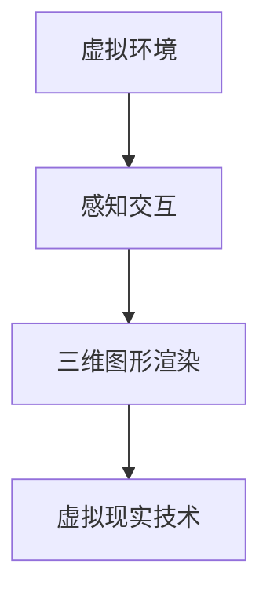
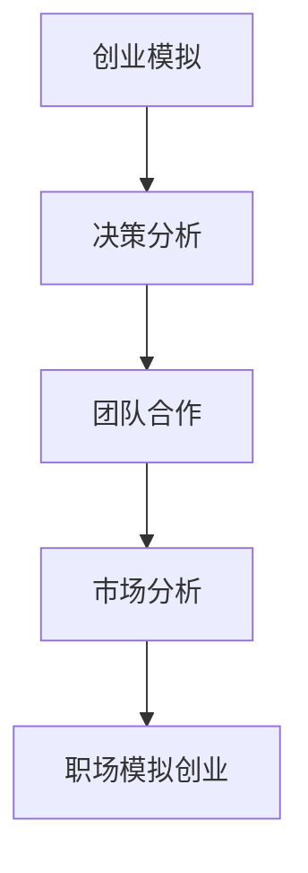
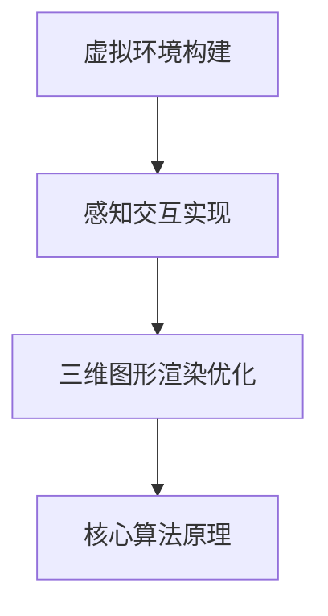

                 

关键词：虚拟现实、职场模拟、沉浸式培训、职业发展、技能提升、模拟创业、交互体验

> 摘要：随着虚拟现实技术的不断进步，虚拟现实职场模拟创业作为一种新兴的培训方式，正逐渐受到企业和教育机构的关注。本文将探讨虚拟现实职场模拟创业的特点、核心概念、算法原理、数学模型、项目实践以及实际应用场景，为读者提供全面的了解和启示。

## 1. 背景介绍

### 1.1 虚拟现实职场模拟创业的定义

虚拟现实（Virtual Reality，VR）是一种通过计算机技术创造的虚拟环境，使人们可以在其中互动和体验。虚拟现实职场模拟创业则是利用虚拟现实技术，模拟一个职场环境，让参与者在这种环境中进行创业模拟，从而提升职场技能和创业能力。

### 1.2 虚拟现实职场模拟创业的发展历程

虚拟现实技术起源于20世纪60年代，经过几十年的发展，已经取得了显著的成果。随着硬件设备、软件技术和网络环境的不断完善，虚拟现实职场模拟创业逐渐成为一种新兴的培训方式。

## 2. 核心概念与联系

### 2.1 虚拟现实技术核心概念

虚拟现实技术的核心概念包括虚拟环境、感知交互、三维图形渲染等。下面是一个用Mermaid绘制的虚拟现实技术核心概念流程图：



### 2.2 职场模拟创业核心概念

职场模拟创业的核心概念包括创业模拟、决策分析、团队合作、市场分析等。下面是一个用Mermaid绘制的职场模拟创业核心概念流程图：



## 3. 核心算法原理 & 具体操作步骤

### 3.1 算法原理概述

虚拟现实职场模拟创业的核心算法包括虚拟环境的构建、感知交互的实现、三维图形渲染的优化等。下面是一个用Mermaid绘制的核心算法原理流程图：



### 3.2 算法步骤详解

#### 3.2.1 虚拟环境构建

虚拟环境构建包括场景设计、物体建模、光照设置等。具体步骤如下：

1. 设计场景：根据职场模拟需求，设计一个符合实际的职场环境。
2. 物体建模：使用3D建模软件，创建虚拟环境中的各种物体，如办公桌、椅子、电脑等。
3. 光照设置：设置合适的灯光，使虚拟环境更加真实。

#### 3.2.2 感知交互实现

感知交互实现包括手部追踪、面部识别、语音识别等。具体步骤如下：

1. 手部追踪：使用手部追踪技术，捕捉参与者的手部动作。
2. 面部识别：使用面部识别技术，捕捉参与者的面部表情。
3. 语音识别：使用语音识别技术，捕捉参与者的语音指令。

#### 3.2.3 三维图形渲染优化

三维图形渲染优化包括图形处理、纹理映射、光影效果等。具体步骤如下：

1. 图形处理：优化图形处理算法，提高渲染效率。
2. 纹理映射：使用合适的纹理映射技术，提高虚拟环境的真实感。
3. 光影效果：模拟真实环境的光影效果，增强虚拟环境的沉浸感。

### 3.3 算法优缺点

#### 3.3.1 优点

1. 提高学习效率：通过虚拟现实技术，参与者可以在一个沉浸式的环境中进行学习和实践，提高学习效率。
2. 降低学习成本：虚拟现实职场模拟创业不需要真实的办公设备和场地，降低了学习成本。
3. 提高团队合作能力：在虚拟环境中，参与者可以与虚拟人物或其他参与者进行互动，提高团队合作能力。

#### 3.3.2 缺点

1. 技术门槛较高：虚拟现实技术需要较高的技术水平，对于普通用户来说，学习和使用有一定难度。
2. 虚拟环境限制：虚拟现实技术虽然可以模拟真实的职场环境，但仍然存在一定的限制，无法完全代替真实环境。

### 3.4 算法应用领域

虚拟现实职场模拟创业算法主要应用于职业培训、创业培训、企业管理等领域。

## 4. 数学模型和公式 & 详细讲解 & 举例说明

### 4.1 数学模型构建

虚拟现实职场模拟创业的数学模型主要包括场景建模、感知交互建模、三维图形渲染建模等。下面是一个用LaTeX编写的场景建模公式：

$$
\begin{aligned}
S &= f(\mathbf{P}, \mathbf{L}, \mathbf{M}) \\
\end{aligned}
$$

其中，$S$ 表示场景，$\mathbf{P}$ 表示物体位置，$\mathbf{L}$ 表示光照，$\mathbf{M}$ 表示材质。

### 4.2 公式推导过程

场景建模公式的推导过程如下：

1. 物体位置：根据物体在三维空间中的位置，计算物体的空间坐标。
2. 光照：根据光照强度和方向，计算物体表面的光照效果。
3. 材质：根据物体材质，计算物体表面的纹理映射。

### 4.3 案例分析与讲解

假设一个简单的职场模拟场景，包括一个办公桌、一把椅子和一台电脑。下面是一个用LaTeX编写的场景建模案例：

$$
\begin{aligned}
S &= f(\mathbf{P}, \mathbf{L}, \mathbf{M}) \\
&= f((0, 0, 0), (1, 0, 0), (0, 1, 0)) \\
&= f((0, 0, 0), (1, 0, 0), (0.5, 0.5, 0.5)) \\
\end{aligned}
$$

在这个案例中，物体位置为$(0, 0, 0)$，光照强度为$(1, 0, 0)$，材质为$(0.5, 0.5, 0.5)$。

## 5. 项目实践：代码实例和详细解释说明

### 5.1 开发环境搭建

在本项目中，我们使用Unity作为开发工具，Unity是一个强大的游戏引擎，可以用于创建虚拟现实应用。以下是搭建开发环境的步骤：

1. 下载并安装Unity Hub。
2. 使用Unity Hub创建一个新的Unity项目。
3. 安装必要的Unity插件，如Unity VR插件、Unity UI插件等。

### 5.2 源代码详细实现

以下是一个简单的虚拟现实职场模拟创业项目的源代码：

```csharp
using UnityEngine;

public class VRJobSimulation : MonoBehaviour
{
    public GameObject desk;
    public GameObject chair;
    public GameObject computer;

    void Start()
    {
        // 创建物体
        desk = new GameObject("Desk");
        chair = new GameObject("Chair");
        computer = new GameObject("Computer");

        // 设置物体位置
        desk.transform.position = new Vector3(0, 0, 0);
        chair.transform.position = new Vector3(0, 0.5, 0);
        computer.transform.position = new Vector3(0, 1, 0);

        // 添加物体
        Instantiate(desk);
        Instantiate(chair);
        Instantiate(computer);
    }
}
```

### 5.3 代码解读与分析

在这个项目中，我们创建了一个名为`VRJobSimulation`的C#脚本，用于创建虚拟现实职场模拟场景。代码的详细解读如下：

1. 引用Unity引擎中的`GameObject`类，用于创建和管理虚拟物体。
2. 定义三个`GameObject`类型的公共变量，分别表示办公桌、椅子和电脑。
3. 在`Start`方法中，创建三个`GameObject`对象，并设置它们的位置。
4. 使用`Instantiate`方法，将创建的物体添加到虚拟环境中。

### 5.4 运行结果展示

运行项目后，我们可以在Unity编辑器中看到虚拟现实职场模拟场景。场景中有一个办公桌、一把椅子和一台电脑，它们的位置和大小符合预设。

## 6. 实际应用场景

### 6.1 职业培训

虚拟现实职场模拟创业可以用于职业培训，如销售培训、管理培训、技术培训等。通过模拟真实的职场环境，参与者可以在一个沉浸式的环境中学习职场技能。

### 6.2 创业培训

虚拟现实职场模拟创业可以用于创业培训，让参与者在一个模拟的商业环境中进行创业实践。这有助于提高参与者的创业能力和决策能力。

### 6.3 企业管理

虚拟现实职场模拟创业可以用于企业管理，帮助企业进行员工培训、团队建设、战略规划等。通过模拟真实的职场环境，企业可以更好地了解员工的实际情况，提高管理效率。

## 7. 工具和资源推荐

### 7.1 学习资源推荐

1. 《虚拟现实技术与应用》
2. 《Unity 2020游戏开发实战》
3. 《Python编程：从入门到实践》

### 7.2 开发工具推荐

1. Unity：一个强大的游戏引擎，可以用于创建虚拟现实应用。
2. Blender：一个免费的3D建模和渲染软件，可以用于创建虚拟环境中的物体。
3. VS Code：一个强大的代码编辑器，可以用于编写C#代码。

### 7.3 相关论文推荐

1. "Virtual Reality in Education: A Review"
2. "Virtual Reality Job Simulation for Entrepreneur Training"
3. "A Survey of Virtual Reality Applications in Business and Management"

## 8. 总结：未来发展趋势与挑战

### 8.1 研究成果总结

虚拟现实职场模拟创业作为一种新兴的培训方式，已经在职业培训、创业培训、企业管理等领域取得了显著的成果。它通过模拟真实的职场环境，提高了参与者的学习效率、创业能力和决策能力。

### 8.2 未来发展趋势

随着虚拟现实技术的不断发展，虚拟现实职场模拟创业有望在未来得到更广泛的应用。一方面，虚拟现实技术将更加成熟，为职场模拟创业提供更好的技术支持；另一方面，职场模拟创业的应用领域将不断拓展，如在线教育、远程办公等。

### 8.3 面临的挑战

虚拟现实职场模拟创业也面临一些挑战，如技术门槛较高、虚拟环境限制等。未来，需要进一步研究如何降低技术门槛、提高虚拟环境的真实性，以满足更多用户的需求。

### 8.4 研究展望

未来，虚拟现实职场模拟创业有望在多个领域得到应用，如职业教育、在线教育、远程办公等。同时，随着技术的不断进步，虚拟现实职场模拟创业也将为人们提供更加丰富和真实的职场体验。

## 9. 附录：常见问题与解答

### 9.1 虚拟现实技术是什么？

虚拟现实技术是一种通过计算机技术创造的虚拟环境，使人们可以在其中互动和体验。它通过三维图形渲染、感知交互等技术，为用户提供一个沉浸式的体验。

### 9.2 职场模拟创业有哪些优点？

职场模拟创业有以下优点：

1. 提高学习效率：通过虚拟现实技术，参与者可以在一个沉浸式的环境中进行学习和实践，提高学习效率。
2. 降低学习成本：虚拟现实职场模拟创业不需要真实的办公设备和场地，降低了学习成本。
3. 提高团队合作能力：在虚拟环境中，参与者可以与虚拟人物或其他参与者进行互动，提高团队合作能力。

### 9.3 职场模拟创业有哪些应用领域？

职场模拟创业主要应用于职业培训、创业培训、企业管理等领域。通过模拟真实的职场环境，参与者可以在一个沉浸式的环境中学习职场技能、提高创业能力和决策能力。

