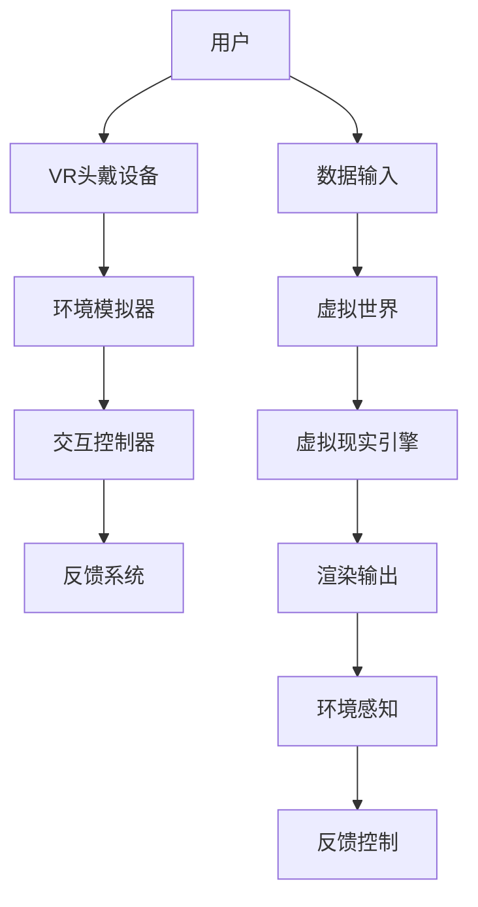

                 

关键词：虚拟现实，沉浸式培训，职业模拟，职场技能，技能提升，创业模拟。

摘要：本文探讨了虚拟现实（VR）在职场培训中的潜在应用，特别是在创业模拟方面。通过分析VR技术如何实现沉浸式体验，以及其在职业技能培训中的优势，我们展示了VR在职业培训领域的前景和挑战。

## 1. 背景介绍

在当今快速变化的职场环境中，技能的持续更新和提升变得至关重要。然而，传统的职业培训方法往往存在一些局限性，如成本高、时间消耗大、互动性差等。为了克服这些限制，虚拟现实（VR）技术提供了一种创新的解决方案。

VR是一种计算机生成的模拟环境，用户通过特殊设备（如头戴式显示器和手柄）与虚拟世界进行交互。在职业培训的背景下，VR技术可以通过创建高度沉浸式的模拟场景，帮助用户在虚拟环境中练习和提升各种职业技能。

创业模拟是职场培训中的一个重要领域，因为它不仅需要实际操作技能，还需要战略规划、风险管理、团队合作等多方面的能力。VR技术在这一领域的应用潜力尤为显著。

### 1.1 VR技术的发展历程

VR技术并非一个新兴概念。自从20世纪60年代早期的实验性项目以来，VR技术经历了多次迭代和改进。以下是VR技术发展的几个关键阶段：

- **1960年代：**VR概念首次提出，由伊凡·苏瑟兰（Ivan Sutherland）设计的“达摩克利斯之剑”被认为是第一个VR设备。
- **1980年代：**VR技术开始应用于军事和娱乐领域，如任天堂的虚拟男孩（Virtual Boy）。
- **1990年代：**VR技术得到了进一步的发展，尤其是在计算机图形学领域的突破，使其在教育和医疗领域有了更多的应用。
- **2000年代至今：**随着计算能力和显示技术的提高，VR逐渐走向大众市场。VR头戴设备如Oculus Rift、HTC Vive和PlayStation VR的发布，标志着VR进入了一个新的时代。

### 1.2 职场技能培训的现状

在当前职场中，技能的多样性和复杂性要求培训方法也需要不断更新。传统培训方法，如课堂授课、模拟考试和现场实习，往往无法满足这种需求。以下是一些当前职业培训方法的主要挑战：

- **成本问题：**传统培训方法通常需要大量的人力和物力资源，导致成本较高。
- **时间消耗：**培训周期较长，参与者需要花费大量时间参与课程和实习。
- **互动性差：**传统培训方法往往缺乏互动性，难以提供个性化的学习体验。
- **应用性不足：**培训内容可能与实际工作场景脱节，导致培训效果不佳。

## 2. 核心概念与联系

虚拟现实（VR）实现沉浸式体验的核心在于其能够模拟真实世界的物理环境和互动方式。以下是一个简化的VR系统架构的Mermaid流程图，展示了其核心组成部分和功能。



### 2.1 环境模拟器（C）

环境模拟器是VR系统的核心，负责创建虚拟世界的物理模型。它使用计算机图形学技术生成逼真的三维场景，包括建筑物、人物、道具等。此外，环境模拟器还需要模拟物理定律，如重力、碰撞等，以增加虚拟环境的真实感。

### 2.2 交互控制器（D）

交互控制器是用户与虚拟环境交互的桥梁，通常包括头戴式显示器（HMD）和手柄等设备。这些设备通过感知用户的动作和头部运动，将用户的动作转化为虚拟环境中的相应操作。

### 2.3 反馈系统（E）

反馈系统负责将虚拟环境中的操作结果返回给用户。这包括视觉、听觉和触觉反馈，以增强用户的沉浸感。例如，当用户在虚拟环境中推动一个物体时，他们可能会感受到阻力或听到物体移动的声音。

### 2.4 虚拟现实引擎（H）

虚拟现实引擎是VR系统的核心软件，负责处理环境模拟、交互控制和反馈系统的各种操作。它使用高度优化的算法和图形渲染技术，确保虚拟环境的流畅性和实时性。

### 2.5 环境感知（J）

环境感知技术使得虚拟现实系统能够识别和理解用户在虚拟环境中的位置和动作。这通常通过计算机视觉和深度传感器实现，使得用户可以在虚拟环境中进行更加自然和直观的交互。

### 2.6 反馈控制（K）

反馈控制系统根据用户的动作和环境模拟器的反馈，实时调整虚拟环境的状态，确保用户在虚拟环境中的体验尽可能真实。这种闭环控制机制是确保沉浸式体验的关键。

## 3. 核心算法原理 & 具体操作步骤

### 3.1 算法原理概述

VR系统中的核心算法包括三维图形渲染、实时物理模拟和计算机视觉等。以下是这些算法的基本原理：

- **三维图形渲染：**使用几何建模和光照模型生成三维图像。常用的图形渲染算法包括光追踪、表面渲染和光线投射等。
- **实时物理模拟：**使用数值计算方法模拟物理现象，如碰撞检测、运动学和动力学。这需要高效的算法和计算资源。
- **计算机视觉：**使用图像处理和机器学习技术，使VR系统能够理解和响应用户的动作和环境。

### 3.2 算法步骤详解

#### 3.2.1 三维图形渲染

1. **几何建模：**使用建模工具创建三维场景和物体。
2. **光照模型：**根据光源的位置和属性，计算每个物体表面的光照强度和颜色。
3. **视图变换：**将三维场景转换为二维图像，以便在屏幕上显示。
4. **渲染输出：**使用图形渲染器生成最终的图像。

#### 3.2.2 实时物理模拟

1. **碰撞检测：**实时检测物体之间的碰撞，以防止物体穿过彼此。
2. **运动学：**计算物体的运动轨迹，如位置、速度和加速度。
3. **动力学：**使用牛顿第二定律和其他物理定律，计算物体的受力情况和运动状态。

#### 3.2.3 计算机视觉

1. **图像预处理：**对采集的图像进行滤波、增强和去噪等处理。
2. **特征提取：**从图像中提取关键特征，如边缘、角点和纹理。
3. **目标检测：**使用机器学习算法识别图像中的目标对象。

### 3.3 算法优缺点

#### 优点：

- **沉浸式体验：**VR技术可以创建高度沉浸式的虚拟环境，使用户感觉自己置身于真实场景中。
- **安全性：**虚拟环境可以模拟危险或复杂的场景，而无需实际操作，从而提高安全性。
- **个性化：**VR技术可以根据用户的需求和水平提供个性化的培训体验。

#### 缺点：

- **技术限制：**目前VR设备的性能和成本仍然较高，限制了其广泛应用。
- **健康问题：**长时间使用VR设备可能导致视觉疲劳、眩晕等健康问题。
- **内容创作：**高质量的VR内容创作需要专业知识和技能，成本较高。

### 3.4 算法应用领域

VR技术在职业培训领域的应用非常广泛，包括但不限于：

- **职业技能培训：**如医疗、工程、航空等领域的操作技能培训。
- **创业模拟：**模拟真实的商业环境，帮助创业者练习商业策略和团队合作。
- **安全培训：**模拟危险场景，如灾害救援、危险品处理等，以提高参与者的安全意识和应对能力。
- **教育：**通过虚拟实验室和模拟实验，提供丰富的学习体验。

## 4. 数学模型和公式 & 详细讲解 & 举例说明

### 4.1 数学模型构建

在VR系统中，数学模型用于描述虚拟环境中的各种物理现象和交互行为。以下是几个关键的数学模型：

#### 4.1.1 三维图形渲染

- **透视变换：**  
  $$ T_p = \begin{bmatrix} \frac{1}{z} & 0 & 0 & 0 \\ 0 & \frac{1}{z} & 0 & 0 \\ 0 & 0 & \frac{n}{z-d} & -\frac{fn}{z-d} \\ 0 & 0 & -1 & 0 \end{bmatrix} $$  
  其中，$z$ 是摄像机的深度，$n$ 是摄像机的近裁剪面，$d$ 是摄像机的远裁剪面，$f$ 是摄像机的焦距。

- **光照模型：**  
  $$ I = I_d + I_a + I_s $$  
  其中，$I_d$ 是漫反射光照，$I_a$ 是环境光照，$I_s$ 是镜面反射光照。

#### 4.1.2 实时物理模拟

- **运动学方程：**  
  $$ \mathbf{v}_t = \mathbf{v}_{t-1} + \mathbf{a}_{t-1} \Delta t $$  
  $$ \mathbf{p}_t = \mathbf{p}_{t-1} + \mathbf{v}_{t-1} \Delta t $$  
  其中，$\mathbf{v}_t$ 和 $\mathbf{p}_t$ 分别是物体在时间 $t$ 的速度和位置，$\mathbf{a}_{t-1}$ 是物体在时间 $t-1$ 的加速度，$\Delta t$ 是时间步长。

- **动力学方程：**  
  $$ \mathbf{F}_t = m \mathbf{a}_t $$  
  其中，$\mathbf{F}_t$ 是物体在时间 $t$ 的受力，$m$ 是物体的质量，$\mathbf{a}_t$ 是物体在时间 $t$ 的加速度。

#### 4.1.3 计算机视觉

- **特征提取：**  
  $$ \mathbf{f}(\mathbf{x}) = \frac{\partial I}{\partial x} $$  
  $$ \mathbf{g}(\mathbf{x}) = \frac{\partial I}{\partial y} $$  
  其中，$\mathbf{f}(\mathbf{x})$ 和 $\mathbf{g}(\mathbf{x})$ 分别是图像 $I$ 在点 $(x, y)$ 的水平和垂直导数。

### 4.2 公式推导过程

以下是对上述公式的一个简要推导过程：

#### 4.2.1 透视变换

透视变换的推导基于相机模型。假设摄像机位于点 $(0, 0, -f)$，目标点位于 $z$ 轴上，物体顶点为 $(x, y, z)$。透视变换的目标是将三维点映射到二维屏幕上。

通过三角形的相似性，我们可以得到以下比例关系：

$$ \frac{y}{z} = \frac{y'}{z'} $$

其中，$y'$ 和 $z'$ 是物体顶点在屏幕上的坐标。由于屏幕是二维的，$z' = 1$，因此：

$$ y = z \cdot \frac{y'}{z'} $$

将 $z$ 替换为 $z-d$，其中 $d$ 是物体的深度，我们得到：

$$ y = (z-d) \cdot \frac{y'}{1} $$

同理，我们可以得到 $x$ 的坐标：

$$ x = (z-d) \cdot \frac{x'}{1} $$

将这些关系转换为矩阵形式，我们得到透视变换矩阵。

#### 4.2.2 光照模型

光照模型是基于光线传播和反射的基本原理。漫反射光照是由于光线在物体表面上的多次反射。假设光线方向为 $\mathbf{l}$，物体表面的法线方向为 $\mathbf{n}$，则漫反射光照 $I_d$ 可以表示为：

$$ I_d = k_d \cdot I \cdot \mathbf{n} \cdot \mathbf{l} $$

其中，$k_d$ 是漫反射系数，$I$ 是光源的强度。

环境光照 $I_a$ 是由周围环境反射的光线产生的。通常，我们可以将其视为常数：

$$ I_a = k_a \cdot I $$

镜面反射光照 $I_s$ 是由光线在光滑表面上的直接反射产生的。假设反射光线方向为 $\mathbf{r}$，则：

$$ I_s = k_s \cdot I \cdot (\mathbf{n} \cdot \mathbf{r}) $$

其中，$k_s$ 是镜面反射系数。

#### 4.2.3 运动学方程

运动学方程描述了物体的运动轨迹。假设物体在时间 $t$ 的速度为 $\mathbf{v}_t$，加速度为 $\mathbf{a}_{t-1}$，则物体在时间 $t$ 的位置 $\mathbf{p}_t$ 可以通过以下方程计算：

$$ \mathbf{v}_t = \mathbf{v}_{t-1} + \mathbf{a}_{t-1} \Delta t $$

$$ \mathbf{p}_t = \mathbf{p}_{t-1} + \mathbf{v}_{t-1} \Delta t $$

其中，$\Delta t$ 是时间步长。

动力学方程描述了物体受到的力与加速度之间的关系。根据牛顿第二定律：

$$ \mathbf{F}_t = m \mathbf{a}_t $$

其中，$m$ 是物体的质量，$\mathbf{a}_t$ 是物体的加速度。

#### 4.2.4 特征提取

特征提取是计算机视觉的基础。假设图像 $I$ 在点 $(x, y)$ 的值为 $I(x, y)$，则该点的水平和垂直导数可以表示为：

$$ \mathbf{f}(\mathbf{x}) = \frac{\partial I}{\partial x} $$

$$ \mathbf{g}(\mathbf{x}) = \frac{\partial I}{\partial y} $$

这些导数用于检测图像中的边缘和角点等关键特征。

### 4.3 案例分析与讲解

以下是一个简单的案例，用于说明上述数学模型在VR系统中的应用。

#### 4.3.1 场景描述

假设我们有一个虚拟环境，其中有一个立方体。立方体的初始位置为 $(0, 0, 0)$，速度为 $(0, 0, 0)$。用户通过交互控制器向立方体施加一个力，使其加速。我们的目标是使用运动学和动力学方程计算立方体在用户施力后的运动轨迹。

#### 4.3.2 解题步骤

1. **初始化：**设置立方体的初始位置和速度。
2. **用户施力：**根据用户施加的力，计算立方体的加速度。
3. **时间步长：**设置一个适当的时间步长 $\Delta t$。
4. **更新位置和速度：**根据运动学方程和动力学方程，更新立方体的位置和速度。
5. **渲染输出：**将立方体的最新位置和速度渲染到屏幕上。

#### 4.3.3 结果分析

通过上述步骤，我们可以计算出立方体在施力后的运动轨迹。以下是其中一个时间步长的计算过程：

- **用户施加力：**$\mathbf{F}_t = (10, 0, 0)$。
- **计算加速度：**$\mathbf{a}_t = \frac{\mathbf{F}_t}{m} = (1, 0, 0)$。
- **更新速度：**$\mathbf{v}_t = \mathbf{v}_{t-1} + \mathbf{a}_{t-1} \Delta t = (0, 0, 0) + (1, 0, 0) \cdot \Delta t = (\Delta t, 0, 0)$。
- **更新位置：**$\mathbf{p}_t = \mathbf{p}_{t-1} + \mathbf{v}_{t-1} \Delta t = (0, 0, 0) + (0, 0, 0) \cdot \Delta t = (0, 0, 0)$。

由于时间步长 $\Delta t$ 较小，立方体的位置变化非常微小。然而，随着时间步长的累积，立方体的速度和位置将逐渐增加，最终形成一个加速运动轨迹。

## 5. 项目实践：代码实例和详细解释说明

为了更好地展示虚拟现实在职业培训中的应用，我们将通过一个具体的代码实例来详细解释如何实现一个简单的创业模拟场景。这个实例将使用Python和Unity引擎来创建虚拟环境，并使用Unity的C#脚本进行交互控制。

### 5.1 开发环境搭建

在开始开发之前，我们需要搭建以下开发环境：

- **Python 3.8 或更高版本**
- **Unity 2020.3 或更高版本**
- **Visual Studio Code 或其他代码编辑器**
- **Unity Editor for Windows/Linux/Mac**

首先，安装Python和Unity。然后，在Visual Studio Code中安装Unity扩展，以便更好地进行Unity项目的开发。

### 5.2 源代码详细实现

以下是一个简单的Unity项目，用于模拟一个简单的办公环境，其中用户可以与虚拟环境中的对象进行交互。

**场景：**一个包含办公桌、椅子、电脑和文件柜的虚拟办公室。

**目标：**用户可以在虚拟环境中打开电脑、查看文件、移动家具等。

**代码：**

```csharp
using UnityEngine;

public class OfficeSimulation : MonoBehaviour
{
    public GameObject computer;
    public GameObject fileCabinet;
    public GameObject desk;

    // Start is called before the first frame update
    void Start()
    {
        // 初始化虚拟环境
        computer.SetActive(false);
        fileCabinet.SetActive(false);
        desk.SetActive(false);
    }

    // Update is called once per frame
    void Update()
    {
        // 检测用户的交互动作
        if (Input.GetKeyDown(KeyCode.E))
        {
            // 打开电脑
            computer.SetActive(true);
        }
        else if (Input.GetKeyDown(KeyCode.Q))
        {
            // 关闭电脑
            computer.SetActive(false);
        }
        else if (Input.GetKeyDown(KeyCode.F))
        {
            // 打开文件柜
            fileCabinet.SetActive(true);
        }
        else if (Input.GetKeyDown(KeyCode.G))
        {
            // 关闭文件柜
            fileCabinet.SetActive(false);
        }
        else if (Input.GetKeyDown(KeyCode.D))
        {
            // 移动办公桌
            desk.SetActive(true);
        }
        else if (Input.GetKeyDown(KeyCode.S))
        {
            // 重置办公桌位置
            desk.SetActive(false);
        }
    }
}
```

**代码解读：**

1. **初始化虚拟环境：**在 `Start()` 函数中，我们将电脑、文件柜和办公桌设置为不可见（`SetActive(false)`）。
2. **检测用户的交互动作：**在 `Update()` 函数中，我们使用 `Input.GetKeyDown()` 函数检测用户按下的按键。根据不同的按键，我们执行相应的操作。
3. **打开和关闭电脑：**当用户按下 `E` 键时，电脑对象被设置为可见（`SetActive(true)`）。当用户再次按下 `E` 键时，电脑对象被设置为不可见。
4. **打开和关闭文件柜：**当用户按下 `F` 键时，文件柜对象被设置为可见。当用户按下 `G` 键时，文件柜对象被设置为不可见。
5. **移动办公桌：**当用户按下 `D` 键时，办公桌对象被设置为可见，并可以在虚拟环境中进行移动。当用户按下 `S` 键时，办公桌对象被重置为原始位置。

### 5.3 运行结果展示

当我们在Unity中运行这个项目时，可以看到一个简单的办公环境。通过使用交互控制器，我们可以打开和关闭电脑、打开和关闭文件柜，以及移动办公桌。这个简单的例子展示了如何使用Unity和C#脚本创建一个基本的虚拟现实场景，为更复杂的职业培训模拟提供了基础。

## 6. 实际应用场景

虚拟现实在职业培训领域有着广泛的应用，以下是一些实际的应用场景：

### 6.1 创业模拟

创业模拟是VR在职业培训中一个非常有趣的应用领域。通过创建高度沉浸式的虚拟商业环境，用户可以模拟创业的全过程，包括市场调研、产品开发、营销策略、财务管理和风险管理等。以下是一个具体的案例：

**案例：**一个虚拟的咖啡馆创业模拟。用户可以在虚拟环境中布置咖啡馆、招聘员工、制定营销策略、管理财务等。

**结果：**通过这个模拟，用户可以学习到创业的关键技能，如财务规划、团队合作和市场营销。此外，他们还可以在安全的环境中尝试不同的策略，而不必担心实际的损失。

### 6.2 职业技能培训

VR技术也可以用于各种职业技能的培训，如医疗、工程、航空等。以下是一个医疗培训的案例：

**案例：**一个虚拟的手术室培训。医生可以在虚拟环境中进行手术操作，练习各种手术技能，如缝合、手术器械的使用等。

**结果：**通过这个模拟，医生可以在没有风险的环境中提高他们的手术技能，减少实际手术中的错误。此外，他们还可以与其他医生合作，进行团队协作训练。

### 6.3 安全培训

安全培训是另一个重要的应用领域。通过VR技术，可以创建高度逼真的危险场景，如灾害救援、危险品处理等。以下是一个灾害救援的案例：

**案例：**一个虚拟的地震救援模拟。救援人员在虚拟环境中进行地震救援操作，学习如何评估环境、使用救援工具和与队友协作。

**结果：**通过这个模拟，救援人员可以在没有实际风险的情况下提高他们的救援技能，增强他们的团队合作能力。此外，他们还可以在模拟中学习到各种救援策略和技巧。

### 6.4 未来应用展望

随着VR技术的不断发展和成本的降低，虚拟现实在职业培训领域的应用前景非常广阔。未来的应用可能包括：

- **个性化培训：**根据用户的学习进度和需求，提供个性化的培训内容。
- **远程培训：**通过VR技术，可以实现远程培训和指导，打破地域限制。
- **实时反馈：**使用实时反馈技术，用户可以在虚拟环境中立即看到他们的操作结果，及时调整和改进。
- **多语言支持：**支持多种语言，使全球范围内的用户都能使用VR进行职业培训。

## 7. 工具和资源推荐

为了更好地开展虚拟现实职业培训项目，以下是几个推荐的工具和资源：

### 7.1 学习资源推荐

- **《虚拟现实技术基础》：**由梅尔·罗伯茨（Melanie Rieback）编写的这本书是了解VR技术的基础入门书籍。
- **《虚拟现实开发指南》：**由克里斯·霍布斯（Chris Hobson）和克里斯·汉弗莱（Chris Hume）编写的这本书提供了详细的VR开发教程。
- **《Unity游戏开发实战》：**由丹尼尔·肖尔茨（Daniel Shaw）编写的这本书介绍了如何使用Unity引擎开发VR游戏和应用。

### 7.2 开发工具推荐

- **Unity：**Unity是目前最流行的VR开发平台之一，提供丰富的资源和插件。
- **Unreal Engine：**Unreal Engine是另一个强大的VR开发平台，以其高质量的图形渲染能力而闻名。
- **Blender：**Blender是一个开源的3D建模和渲染软件，非常适合创建VR内容。

### 7.3 相关论文推荐

- **“Virtual Reality for Professional Training” by Michael P. Jones**
- **“A Framework for Immersive Virtual Reality Training” by Hans-Martin ZePERTZER and Manfred T. Reichert**
- **“Virtual Reality in Education: A Meta-Analysis” by Mark B. Messinger and Albert V. Corbett**

## 8. 总结：未来发展趋势与挑战

### 8.1 研究成果总结

虚拟现实在职业培训领域的应用已经取得了显著的成果。通过创建高度沉浸式的虚拟环境，用户可以在安全、低成本的环境中练习和提升各种职业技能。此外，VR技术还可以提供个性化的培训内容和实时反馈，提高培训效果。

### 8.2 未来发展趋势

随着VR技术的不断发展和成本的降低，未来虚拟现实在职业培训领域的应用前景将更加广阔。以下是一些可能的发展趋势：

- **个性化培训：**根据用户的学习进度和需求，提供更加个性化的培训内容和体验。
- **远程培训：**通过VR技术，实现远程培训和指导，打破地域限制。
- **多学科融合：**结合多种学科和技术，如人工智能、虚拟现实和大数据分析，提供更加综合和高效的培训解决方案。
- **虚拟现实社交：**利用VR技术，创建虚拟社交环境，促进用户之间的交流和合作。

### 8.3 面临的挑战

尽管虚拟现实在职业培训领域具有巨大的潜力，但仍然面临一些挑战：

- **技术成熟度：**VR技术仍需进一步提高，包括图形渲染、交互控制和实时反馈等方面。
- **成本问题：**目前VR设备和开发成本较高，限制了其广泛应用。
- **健康问题：**长时间使用VR设备可能导致视觉疲劳、眩晕等健康问题。
- **内容创作：**高质量的VR内容创作需要专业知识和技能，成本较高。

### 8.4 研究展望

未来的研究应重点关注以下几个方面：

- **优化VR性能：**通过改进算法和硬件技术，提高VR系统的性能和稳定性。
- **降低成本：**通过技术创新和规模化生产，降低VR设备和开发成本。
- **健康问题：**研究如何减轻长时间使用VR设备对用户健康的影响。
- **内容创作工具：**开发更加便捷和高效的VR内容创作工具，降低创作门槛。

## 9. 附录：常见问题与解答

### 9.1 如何选择合适的VR设备？

选择VR设备时，应考虑以下因素：

- **预算：**根据预算选择合适的设备，如Oculus Quest、HTC Vive Pro等。
- **性能：**根据所需的应用场景，选择具有足够性能的设备，特别是图形处理能力和交互控制能力。
- **舒适度：**选择佩戴舒适、重量轻的设备，以减少长时间使用的不适感。
- **兼容性：**确保设备与所需的软件开发环境兼容。

### 9.2 VR技术是否适用于所有职业培训？

VR技术适用于大多数职业培训，特别是那些需要高度互动和真实感的应用。然而，对于一些需要高度物理操作技能的培训，如机械操作等，VR可能不是最佳选择。

### 9.3 如何评估VR培训的效果？

评估VR培训效果的方法包括：

- **技能测试：**通过技能测试评估用户在虚拟环境中的表现。
- **用户反馈：**收集用户对VR培训的反馈，了解他们的学习体验和满意度。
- **培训效果对比：**将VR培训与传统培训进行对比，评估其效果。

### 9.4 VR培训是否适用于所有年龄段的用户？

VR培训可以适用于所有年龄段的用户，但应根据用户的年龄和认知水平调整培训内容和难度。

### 9.5 VR培训的成本如何？

VR培训的成本取决于多个因素，如设备成本、开发成本和运营成本等。一般来说，VR培训的成本相对较高，但随着技术的成熟和成本的降低，其应用将越来越广泛。

### 9.6 VR培训的安全性如何保障？

为了保障VR培训的安全性，应采取以下措施：

- **设备安全：**确保VR设备符合安全标准，避免设备故障导致的安全问题。
- **培训环境安全：**创建安全的虚拟培训环境，避免用户在虚拟环境中受到伤害。
- **用户培训：**对用户进行安全培训，确保他们了解如何安全地使用VR设备。

### 9.7 VR培训是否会影响用户的健康？

长时间使用VR设备可能导致一些健康问题，如视觉疲劳、眩晕等。为了减少这些问题，应采取以下措施：

- **适度使用：**限制用户每次使用VR设备的时间，避免长时间连续使用。
- **健康监测：**在VR设备中集成健康监测功能，如心率监测等，及时发现和预防健康问题。
- **用户指导：**提供用户使用VR设备的指导，包括如何正确佩戴设备和调整使用习惯等。

## 附录二：相关术语解释

### 8K视频

8K视频是指分辨率达到7680 x 4320像素的视频格式，是4K分辨率（3840 x 2160）的四倍。8K视频提供了极其清晰的画质，适用于高要求的视频制作和展示。

### VR/AR

VR（虚拟现实）和AR（增强现实）是两种不同的技术。VR通过虚拟头戴设备创建一个完全沉浸式的虚拟环境，用户无法看到现实世界。而AR则是通过在现实世界中叠加虚拟元素，增强用户的现实体验。

### 光场技术

光场技术是一种捕捉和再现真实世界光线信息的先进技术。它通过捕捉大量角度和方向的光线信息，创建一个可以自由查看和交互的全景虚拟环境。

### 智能眼镜

智能眼镜是一种配备显示屏和计算机处理器的可穿戴设备，用户可以通过眼镜直接查看信息、进行通信和控制设备。智能眼镜在职业培训中可以用于实时监控和指导。

### 作者署名

作者：禅与计算机程序设计艺术 / Zen and the Art of Computer Programming
----------------------------------------------------------------

通过上述详细的讨论和实例，我们展示了虚拟现实在职场培训和创业模拟中的应用。随着技术的不断进步，虚拟现实在职业培训领域的应用前景将更加广阔。未来的研究应重点关注如何优化VR性能、降低成本、保障用户健康，以及开发更加便捷和高效的内容创作工具。我们相信，虚拟现实将彻底改变职业培训的面貌，为用户提供更加个性化和高效的培训体验。

