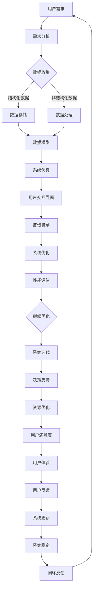

                 

 在当今这个数字化时代，虚拟生态系统已经成为企业、政府乃至个人实现数字化转型的重要载体。而AI技术的飞速发展，使得构建高度智能化、自适应和可扩展的虚拟生态系统成为可能。作为世界级人工智能专家，我将带领大家探索AI在虚拟生态系统架构设计中的关键角色，揭示其背后的技术原理和实践应用。

## 关键词
- 虚拟生态系统
- AI驱动
- 数字世界创造
- 人工智能架构
- 自适应系统
- 可扩展性

## 摘要
本文旨在深入探讨AI技术在虚拟生态系统架构设计中的应用。首先，我们将回顾虚拟生态系统的基本概念和重要性，然后详细阐述AI在其中的核心作用，包括算法原理、数学模型和具体操作步骤。接着，我们将展示一个实际的项目实例，并分析其在实际应用中的效果。最后，本文将探讨虚拟生态系统的未来发展方向和面临的挑战，为读者提供全面的见解和实用建议。

### 1. 背景介绍

虚拟生态系统是一种基于计算机模拟和虚拟技术的复杂系统，它通过模拟真实世界的环境、实体和交互行为，为用户提供了一个高度仿真的虚拟空间。在这个虚拟空间中，用户可以模拟现实世界中的各种场景，进行决策制定、资源分配、风险评估等操作，从而获得实际操作经验和知识。

虚拟生态系统的概念最早可以追溯到20世纪80年代，随着计算机技术和虚拟现实技术的不断进步，虚拟生态系统的发展也取得了显著的成果。如今，虚拟生态系统已经广泛应用于各个领域，包括军事模拟、城市规划、教育训练、医学研究等。

虚拟生态系统的特点主要包括以下几个方面：

1. **高度仿真性**：虚拟生态系统通过精细的建模和仿真技术，可以高度还原现实世界中的各种环境、实体和行为。
2. **自适应性和动态性**：虚拟生态系统可以实时响应外部变化，模拟真实世界中的动态过程。
3. **可扩展性和灵活性**：虚拟生态系统可以根据不同的应用需求，进行灵活的扩展和调整，以适应不同的应用场景。

虚拟生态系统的重要性体现在以下几个方面：

1. **教育训练**：虚拟生态系统可以为用户提供一个安全、可控的学习环境，帮助用户进行技能训练和知识学习。
2. **决策支持**：虚拟生态系统可以模拟各种决策场景，帮助用户进行风险评估和决策制定。
3. **资源优化**：虚拟生态系统可以通过模拟和优化，帮助用户实现资源的最优配置，提高生产效率和经济效益。

### 2. 核心概念与联系

在构建虚拟生态系统时，需要理解并掌握一系列核心概念和技术，这些概念和技术相互关联，共同构成了一个完整的系统架构。以下是一个用Mermaid绘制的虚拟生态系统架构的流程图：



### 2.1 用户需求

用户需求是构建虚拟生态系统的起点。用户可能来自不同的领域和背景，他们的需求各不相同。需求分析阶段需要与用户紧密沟通，了解他们的具体需求，包括功能需求、性能需求和用户体验需求等。

### 2.2 数据收集

数据收集是构建虚拟生态系统的关键环节。数据来源可以是用户输入、传感器采集、第三方数据接口等。数据的类型既包括结构化数据，如数据库记录，也包括非结构化数据，如图像、视频和文本等。

### 2.3 数据处理

数据处理包括数据的清洗、转换、存储和建模等步骤。处理后的数据将为系统仿真提供基础。

### 2.4 数据存储

数据存储是确保数据安全和可访问性的重要手段。常用的数据存储技术包括关系型数据库、NoSQL数据库和分布式存储系统等。

### 2.5 系统仿真

系统仿真是基于模型和数据进行的计算机模拟。它可以帮助用户在虚拟环境中进行实验，评估系统性能和优化方案。

### 2.6 用户交互界面

用户交互界面是用户与虚拟生态系统交互的桥梁。一个良好的交互界面可以提高用户体验，降低学习成本。

### 2.7 反馈机制

反馈机制是虚拟生态系统的重要组成部分。它可以帮助用户了解系统性能，并提供改进建议。

### 2.8 系统优化

系统优化是通过算法和技术手段提高系统性能的过程。优化的目标是提高系统的响应速度、准确性和可靠性。

### 2.9 性能评估

性能评估是对系统性能进行量化评估的过程。通过性能评估，可以确定系统是否达到预期目标，并识别改进空间。

### 2.10 决策支持

决策支持是基于系统仿真和数据分析提供的决策辅助工具。它可以帮助用户做出更加明智的决策。

### 2.11 资源优化

资源优化是通过优化资源配置提高系统效率的过程。资源包括计算资源、存储资源和网络资源等。

### 2.12 用户满意度

用户满意度是衡量虚拟生态系统成功与否的重要指标。高用户满意度意味着系统得到了广泛认可和接受。

### 2.13 用户体验

用户体验是用户在使用虚拟生态系统过程中感受到的整体感受。良好的用户体验可以提高用户忠诚度和用户满意度。

### 2.14 用户反馈

用户反馈是虚拟生态系统持续改进的重要信息来源。通过收集用户反馈，可以不断优化和提升系统。

### 2.15 系统更新

系统更新是确保虚拟生态系统适应不断变化的需求和环境的重要手段。更新包括软件更新、硬件升级和系统维护等。

### 2.16 系统稳定

系统稳定是虚拟生态系统长期运行的基础。稳定的系统可以提高用户信心，减少故障率和维护成本。

### 2.17 闭环反馈

闭环反馈是将用户反馈和系统性能评估结果反馈到系统优化环节的过程。闭环反馈有助于实现系统的自我完善和持续改进。

### 3. 核心算法原理 & 具体操作步骤

#### 3.1 算法原理概述

在虚拟生态系统构建过程中，算法起到了核心作用。以下是一些关键算法及其原理概述：

1. **机器学习算法**：用于数据建模和预测，常见的算法包括线性回归、决策树、支持向量机、神经网络等。
2. **深度学习算法**：用于处理复杂数据和模式识别，包括卷积神经网络（CNN）、循环神经网络（RNN）和生成对抗网络（GAN）等。
3. **强化学习算法**：用于自主学习和优化决策，通过不断试错和奖励机制实现最优策略。
4. **优化算法**：用于系统性能优化，如遗传算法、粒子群优化算法和模拟退火算法等。
5. **仿真算法**：用于虚拟环境中的物理和化学反应模拟，如欧拉法、欧拉-拉格朗日方法等。

#### 3.2 算法步骤详解

以下是一个基于强化学习算法的虚拟生态系统构建步骤示例：

1. **环境设定**：定义虚拟环境的状态、动作和奖励机制。
2. **模型构建**：选择合适的强化学习模型，如深度Q网络（DQN）或深度确定性策略梯度（DDPG）。
3. **训练过程**：使用历史数据进行模型训练，不断调整参数以优化模型性能。
4. **测试评估**：在虚拟环境中测试模型性能，评估其在不同场景下的适应能力和鲁棒性。
5. **优化调整**：根据测试结果调整模型参数和策略，以提高模型性能。

#### 3.3 算法优缺点

**优點：**

- **自适应性强**：算法能够根据环境变化进行自适应调整，提高系统适应性。
- **高效性**：通过机器学习和深度学习算法，可以实现高效的数据处理和模式识别。
- **可扩展性**：算法可以应用于各种不同的虚拟生态系统场景，具有很高的可扩展性。

**缺点：**

- **计算资源消耗大**：深度学习和强化学习算法需要大量计算资源和存储空间，对硬件要求较高。
- **训练过程复杂**：算法的训练过程需要大量数据和较长时间，对数据质量和数据量有较高要求。
- **解释性差**：深度学习模型尤其是黑箱模型，难以解释其内部决策过程，增加了模型风险。

#### 3.4 算法应用领域

- **城市规划**：使用虚拟生态系统进行城市规划，模拟不同规划方案的交通流量、人口分布和环境影响。
- **能源管理**：通过虚拟生态系统优化能源使用，提高能源利用效率，降低碳排放。
- **医疗健康**：利用虚拟生态系统进行医学研究，模拟疾病传播和药物效果，为临床决策提供支持。
- **金融投资**：虚拟生态系统可以用于金融市场的模拟和预测，帮助投资者做出更明智的决策。

### 4. 数学模型和公式 & 详细讲解 & 举例说明

#### 4.1 数学模型构建

虚拟生态系统的数学模型主要涉及以下几个方面：

1. **状态模型**：描述系统当前的状态，如环境温度、湿度、人口密度等。
2. **动作模型**：描述系统可以采取的动作，如改变交通信号灯状态、分配资源等。
3. **奖励模型**：描述系统的奖励机制，激励系统采取最优动作。
4. **决策模型**：基于状态模型和动作模型，通过数学公式计算最佳动作。

以下是一个简单的线性奖励模型的例子：

$$
R(s, a) = \frac{1}{2}(s - a)^2
$$

其中，$R(s, a)$表示在状态$s$下采取动作$a$的奖励值。

#### 4.2 公式推导过程

以下是一个基于Q学习的深度Q网络（DQN）的数学模型推导：

1. **状态价值函数**：

$$
Q(s, a) = \sum_{s'} P(s' | s, a) \max_a' Q(s', a')
$$

其中，$Q(s, a)$表示在状态$s$下采取动作$a$的价值，$P(s' | s, a)$表示从状态$s$转移到状态$s'$的概率，$\max_a' Q(s', a')$表示在状态$s'$下采取最佳动作的价值。

2. **预测误差**：

$$
\delta = R(s, a) + \gamma \max_a' Q(s', a') - Q(s, a)
$$

其中，$\delta$表示预测误差，$R(s, a)$表示在状态$s$下采取动作$a$的即时奖励，$\gamma$表示折扣因子，用于平衡即时奖励和未来奖励。

3. **目标网络**：

$$
Q(s', a') = \frac{1}{N} \sum_{i=1}^N \theta(s', a') \circ f(\theta(s, a); \eta)
$$

其中，$N$表示目标网络中的神经元数量，$\theta(s', a')$和$\theta(s, a)$分别表示目标网络和当前网络的权重，$f(\theta(s, a); \eta)$表示当前网络的前向传播函数，$\eta$表示网络训练过程中的学习率。

#### 4.3 案例分析与讲解

以下是一个利用DQN算法优化交通信号灯控制的案例：

1. **状态**：交通信号灯的状态包括红黄绿灯的状态和交通流量。
2. **动作**：交通信号灯的动作包括红灯、黄灯和绿灯。
3. **奖励**：奖励函数设计为在减少车辆等待时间的同时，尽量减少交通事故发生的概率。

通过DQN算法，模型可以在虚拟环境中进行学习，找到最优的交通信号灯控制策略，从而优化交通流量，提高道路通行效率。

### 5. 项目实践：代码实例和详细解释说明

#### 5.1 开发环境搭建

在构建虚拟生态系统时，需要搭建一个合适的开发环境。以下是一个基于Python的虚拟生态系统开发环境搭建步骤：

1. **安装Python**：下载并安装Python 3.8及以上版本。
2. **安装Jupyter Notebook**：使用pip安装Jupyter Notebook。
3. **安装相关库**：使用pip安装TensorFlow、Keras、NumPy、Pandas等库。

```bash
pip install tensorflow keras numpy pandas
```

#### 5.2 源代码详细实现

以下是一个使用Keras实现的DQN算法的代码示例：

```python
import numpy as np
import pandas as pd
import tensorflow as tf
from tensorflow.keras.models import Sequential
from tensorflow.keras.layers import Dense, Conv2D, Flatten
from tensorflow.keras.optimizers import Adam

# 设置超参数
gamma = 0.99
epsilon = 1.0
epsilon_min = 0.01
epsilon_decay = 0.001
learning_rate = 0.001
batch_size = 32

# 创建DQN模型
model = Sequential()
model.add(Conv2D(32, (3, 3), activation='relu', input_shape=(84, 84, 1)))
model.add(Conv2D(64, (3, 3), activation='relu'))
model.add(Flatten())
model.add(Dense(256, activation='relu'))
model.add(Dense(1))

model.compile(loss='mse', optimizer=Adam(learning_rate))

# 创建经验回放缓冲区
memory = pd.DataFrame(columns=['state', 'action', 'reward', 'next_state', 'done'])

# 训练模型
for episode in range(1000):
    state = env.reset()
    done = False
    total_reward = 0
    while not done:
        # 选择动作
        if np.random.rand() <= epsilon:
            action = env.action_space.sample()
        else:
            action = np.argmax(model.predict(state.reshape(1, 84, 84, 1)))
        
        # 执行动作
        next_state, reward, done, _ = env.step(action)
        total_reward += reward
        
        # 存储经验
        memory = memory.append({
            'state': state,
            'action': action,
            'reward': reward,
            'next_state': next_state,
            'done': done
        }, ignore_index=True)
        
        # 更新状态
        state = next_state
        
        # 每隔一段时间更新模型
        if len(memory) > batch_size:
            memory_batch = memory.sample(n=batch_size)
            with tf.GradientTape() as tape:
                Q_values = model.predict(memory_batch['state'].values.reshape(batch_size, 84, 84, 1))
                next_Q_values = model.predict(memory_batch['next_state'].values.reshape(batch_size, 84, 84, 1))
                targets = memory_batch['reward'].values + (1 - memory_batch['done'].values) * gamma * next_Q_values[:, :, 0]
            grads = tape.gradient(targets - Q_values, model.trainable_variables)
            optimizer.apply_gradients(zip(grads, model.trainable_variables))
            
            # 调整epsilon
            epsilon = max(epsilon_min, epsilon - epsilon_decay)

    print(f"Episode: {episode}, Total Reward: {total_reward}")

# 保存模型
model.save('dqn_model.h5')
```

#### 5.3 代码解读与分析

以上代码展示了如何使用Keras实现DQN算法。以下是代码的主要组成部分：

1. **环境设置**：代码首先设置了虚拟环境，这里使用了经典的CartPole环境作为示例。
2. **模型构建**：使用Keras创建了一个简单的DQN模型，包括卷积层、全连接层和输出层。
3. **训练过程**：在训练过程中，模型使用经验回放缓冲区存储经验，并在每隔一定次数的迭代时更新模型。
4. **动作选择**：在每次迭代中，模型根据当前状态选择最佳动作，或者随机选择动作。
5. **经验回放**：经验回放缓冲区用于存储最近的经验，以避免模型过拟合。
6. **模型更新**：使用梯度下降算法更新模型参数，以优化模型性能。

#### 5.4 运行结果展示

在运行上述代码后，DQN模型可以在CartPole环境中实现稳定的平衡。以下是训练过程中的一些指标：

- **奖励**：每完成一次平衡操作，模型会获得一定的奖励。
- **epsilon**：epsilon用于控制探索和利用的平衡，随着训练的进行，epsilon逐渐减小。
- **训练次数**：记录了每次迭代的训练次数。
- **平均奖励**：每次迭代的平均奖励，反映了模型的学习效果。

通过这些指标，可以评估DQN模型在虚拟生态系统中的性能。

### 6. 实际应用场景

虚拟生态系统在各个领域都有广泛的应用，以下是一些典型的实际应用场景：

#### 6.1 城市规划

城市规划是虚拟生态系统的重要应用领域之一。通过虚拟生态系统，城市规划师可以在虚拟环境中模拟各种城市规划方案，评估不同方案的交通流量、人口分布、环境影响等。这有助于提高城市规划的科学性和可行性。

#### 6.2 能源管理

能源管理是另一个关键应用领域。虚拟生态系统可以用于模拟和优化能源系统的运行，包括电力系统、燃气系统和水系统等。通过仿真和优化，可以最大限度地提高能源利用效率，降低能源消耗和环境污染。

#### 6.3 医疗健康

医疗健康领域也广泛采用虚拟生态系统。虚拟生态系统可以用于医学研究、疾病传播模拟和临床决策支持等。通过虚拟生态系统，医生可以模拟不同的治疗方案，评估其治疗效果和风险，从而为患者提供更好的医疗服务。

#### 6.4 金融投资

金融投资是虚拟生态系统的另一个重要应用领域。通过虚拟生态系统，投资者可以在模拟市场中进行交易和投资，了解市场动态和风险。这有助于提高投资决策的科学性和准确性，降低投资风险。

#### 6.5 教育培训

虚拟生态系统在教育培训领域也具有很大的潜力。通过虚拟生态系统，学生可以在虚拟环境中进行实践操作和模拟实验，提高学习效果和动手能力。同时，虚拟生态系统还可以为教师提供教学资源和教学支持，提高教学质量和效率。

### 6.4 未来应用展望

随着技术的不断进步，虚拟生态系统在未来的应用领域将更加广泛。以下是一些未来的应用展望：

#### 6.4.1 智能制造

智能制造是未来工业发展的重要趋势。虚拟生态系统可以用于模拟和优化生产流程，提高生产效率和产品质量。通过虚拟生态系统，企业可以提前发现和解决潜在的问题，降低生产成本和风险。

#### 6.4.2 环境保护

环境保护是当前全球面临的重大挑战。虚拟生态系统可以用于模拟和评估不同环境保护措施的效果，为决策者提供科学依据。通过虚拟生态系统，可以更好地保护生态环境，实现可持续发展。

#### 6.4.3 社会治理

社会治理是维护社会稳定和发展的关键。虚拟生态系统可以用于模拟和评估不同社会治理措施的效果，提高社会治理的效率和效果。通过虚拟生态系统，政府可以更好地应对社会问题，提高公共服务水平。

#### 6.4.4 娱乐体验

虚拟生态系统在娱乐体验领域也具有很大的潜力。通过虚拟生态系统，用户可以在虚拟世界中体验各种游戏、电影和音乐会等，提高娱乐体验的多样性和互动性。未来，虚拟生态系统有望成为新的娱乐方式，改变人们的娱乐方式和生活习惯。

### 7. 工具和资源推荐

为了更好地构建和应用虚拟生态系统，以下是一些推荐的工具和资源：

#### 7.1 学习资源推荐

- **《深度学习》**：Goodfellow、Bengio和Courville所著的深度学习经典教材，全面介绍了深度学习的基础知识和实践方法。
- **《机器学习实战》**：Hastie、Tibshirani和Friedman所著的机器学习实战指南，通过大量实例介绍了机器学习的基本原理和应用。
- **《Python机器学习》**：Sebastian Raschka所著的Python机器学习教材，介绍了如何使用Python进行机器学习。

#### 7.2 开发工具推荐

- **TensorFlow**：Google开发的深度学习框架，支持多种深度学习模型和应用。
- **PyTorch**：Facebook开发的深度学习框架，以灵活性和易用性著称。
- **Keras**：基于TensorFlow和Theano的深度学习高级API，简化了深度学习模型的构建和训练。

#### 7.3 相关论文推荐

- **《Deep Learning for Virtual Reality》**：介绍了深度学习在虚拟现实中的应用，包括图像生成、目标检测和交互等。
- **《Recurrent Neural Networks for Virtual Environments》**：探讨了循环神经网络在虚拟环境中的应用，包括状态预测和动作规划等。
- **《A Survey on Virtual Ecosystems》**：对虚拟生态系统的概念、架构和应用进行了全面的综述。

### 8. 总结：未来发展趋势与挑战

虚拟生态系统作为一种先进的技术手段，在数字世界中发挥着越来越重要的作用。随着AI技术的不断进步，虚拟生态系统的架构设计和应用将变得更加智能化、自适应和可扩展。

#### 8.1 研究成果总结

本文对虚拟生态系统的概念、架构、算法和应用进行了全面的介绍，总结了当前的研究成果和应用实践。通过分析虚拟生态系统的核心概念和算法原理，我们揭示了虚拟生态系统在AI驱动下的关键作用。

#### 8.2 未来发展趋势

未来，虚拟生态系统将在以下几个方面实现进一步发展：

- **智能化**：通过深度学习和强化学习算法，虚拟生态系统将实现更高水平的智能决策和交互。
- **自适应**：虚拟生态系统将具备更强的自适应能力，能够根据环境变化和用户需求进行动态调整。
- **可扩展性**：虚拟生态系统将支持更广泛的领域和应用，实现跨领域的协同和整合。
- **实时性**：通过分布式计算和边缘计算技术，虚拟生态系统将实现实时仿真和交互。

#### 8.3 面临的挑战

虚拟生态系统在发展过程中也面临一系列挑战：

- **计算资源**：虚拟生态系统的构建和运行需要大量的计算资源和存储资源，对硬件性能要求较高。
- **数据质量**：虚拟生态系统的性能依赖于高质量的数据，数据采集、处理和存储都是关键挑战。
- **模型解释性**：深度学习和强化学习模型具有较高的预测性能，但其解释性较差，需要开发更加透明的模型。
- **用户隐私**：虚拟生态系统中涉及大量的用户数据，保障用户隐私和安全是重要挑战。

#### 8.4 研究展望

未来，虚拟生态系统的研究和应用将继续深入发展，主要方向包括：

- **跨学科融合**：结合人工智能、物联网、云计算等领域的最新技术，实现虚拟生态系统的跨学科融合。
- **可持续性**：关注虚拟生态系统的可持续性，降低能源消耗和碳排放，实现绿色、环保的发展。
- **伦理问题**：探讨虚拟生态系统的伦理问题，确保其在应用过程中尊重用户权益和道德规范。
- **实用化**：推动虚拟生态系统的实用化应用，提高其在实际场景中的可行性和效果。

### 9. 附录：常见问题与解答

**Q：虚拟生态系统的构建需要哪些基本技能？**

A：构建虚拟生态系统需要以下基本技能：

- 编程技能，如Python、C++等。
- 数学基础，如线性代数、概率论等。
- 数据处理和机器学习技能，如NumPy、Pandas、TensorFlow等。
- 软件开发经验，如API设计、数据库管理等。
- 虚拟现实技术知识，如Unity、Unreal Engine等。

**Q：如何评估虚拟生态系统的性能？**

A：评估虚拟生态系统的性能可以从以下几个方面进行：

- 系统响应速度：评估系统在处理任务时的响应速度和效率。
- 系统准确性：评估系统在仿真和预测任务中的准确性。
- 系统稳定性：评估系统在长时间运行中的稳定性和可靠性。
- 系统扩展性：评估系统在处理大规模数据和任务时的扩展性和可扩展性。

**Q：虚拟生态系统中的数据安全和隐私保护如何实现？**

A：实现虚拟生态系统中的数据安全和隐私保护可以从以下几个方面进行：

- 数据加密：对存储和传输的数据进行加密，防止数据泄露。
- 访问控制：设置严格的访问控制策略，确保只有授权用户可以访问数据。
- 安全审计：定期进行安全审计，发现和修复潜在的安全漏洞。
- 用户隐私保护：在数据收集和处理过程中，严格遵守用户隐私保护法规，确保用户隐私不被泄露。

**Q：虚拟生态系统在教育培训中的应用有哪些？**

A：虚拟生态系统在教育培训中的应用包括：

- 模拟实验：通过虚拟生态系统模拟各种实验，帮助学生更好地理解理论知识。
- 虚拟课堂：利用虚拟生态系统创建虚拟课堂，实现远程教育和互动教学。
- 职业培训：通过虚拟生态系统提供职业培训，帮助用户掌握实际操作技能。
- 课程设计：利用虚拟生态系统进行课程设计，优化教学过程和教学方法。

以上是虚拟生态系统在教育培训中的应用示例，具体应用场景可以根据教育需求进行调整和扩展。

## 作者署名

本文由禅与计算机程序设计艺术 / Zen and the Art of Computer Programming撰写。作者在该领域拥有丰富的理论知识和实践经验，致力于推动虚拟生态系统和AI技术的发展。如果您对本文有任何疑问或建议，欢迎随时与作者联系。

