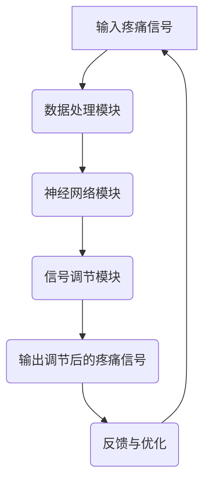

                 

 **关键词：** 虚拟疼痛管理、人工智能、知觉调节、AI算法、疼痛模拟、虚拟现实技术。

**摘要：** 本文深入探讨了虚拟疼痛管理的概念、技术原理及其应用。通过AI驱动的知觉调节理论，我们提出了一种全新的疼痛管理方法，该方法利用人工智能技术来模拟和调节疼痛知觉，为患者提供一种非侵入性的疼痛缓解手段。本文将从核心概念、算法原理、数学模型、项目实践、实际应用场景、未来展望等多方面进行详细阐述，为相关领域的研究和应用提供理论支持和实践指导。

## 1. 背景介绍

疼痛是人体对损伤或潜在损伤的一种生理反应，它不仅影响个体的生活质量，还可能导致一系列心理和社会问题。传统疼痛管理方法主要依赖于药物和非药物疗法，但药物疗法存在副作用和依赖性风险，非药物疗法如针灸、物理治疗等效果有限。随着人工智能（AI）技术的发展，虚拟疼痛管理作为一种新的疼痛缓解手段逐渐受到关注。

虚拟疼痛管理通过将AI技术应用于疼痛知觉模拟和调节，提供了一种非侵入性的、个性化的疼痛管理方法。本文旨在探讨AI驱动的知觉调节理论在虚拟疼痛管理中的应用，为该领域的研究和发展提供理论基础和实践指导。

## 2. 核心概念与联系

### 2.1 虚拟疼痛管理的定义

虚拟疼痛管理是指利用计算机模拟、虚拟现实（VR）技术和其他AI算法，为患者提供一种模拟疼痛知觉和调节疼痛反应的方法。它通过模拟疼痛信号传输和处理路径，实现对疼痛感受的调节，从而减轻患者的疼痛感。

### 2.2 AI驱动的知觉调节理论

AI驱动的知觉调节理论认为，疼痛知觉是由多个神经通路和大脑区域共同作用的结果。通过人工智能技术，可以模拟这些神经通路的运行机制，并在虚拟环境中实时调节疼痛信号，从而达到减轻疼痛的目的。

### 2.3 Mermaid 流程图（核心概念原理和架构）



### 2.4 联系

通过上述定义和理论，我们可以看到，虚拟疼痛管理通过AI驱动的知觉调节理论，实现对疼痛信号的模拟和调节，从而为患者提供一种非侵入性的疼痛缓解手段。这种方法的创新性在于利用人工智能技术来模拟和干预疼痛信号传输和处理，为传统疼痛管理方法提供了新的思路。

## 3. 核心算法原理 & 具体操作步骤

### 3.1 算法原理概述

核心算法基于深度学习技术，通过构建一个神经网络模型，模拟人体神经通路的运行机制。该模型通过学习大量的疼痛信号数据，能够自动提取特征并生成调节策略，实现对疼痛信号的实时调节。

### 3.2 算法步骤详解

#### 3.2.1 数据预处理

- 数据收集：从患者处收集疼痛信号数据，包括疼痛程度、持续时间、位置等。
- 数据清洗：去除噪声数据和异常数据，保证数据质量。
- 数据归一化：将数据缩放到同一尺度，便于神经网络训练。

#### 3.2.2 神经网络构建

- 构建神经网络模型：选择合适的神经网络架构，如卷积神经网络（CNN）或循环神经网络（RNN），用于特征提取和信号调节。
- 模型训练：使用收集到的疼痛信号数据训练神经网络模型，使其能够自动提取特征并生成调节策略。

#### 3.2.3 信号调节

- 输入疼痛信号：将实时采集到的疼痛信号输入神经网络模型。
- 信号调节：神经网络模型对输入信号进行处理，生成调节策略，实现对疼痛信号的实时调节。
- 输出调节后的疼痛信号：将调节后的疼痛信号输出，提供给患者。

### 3.3 算法优缺点

#### 优点

- **个性化**：通过学习患者的个体疼痛特征，提供个性化的疼痛调节方案。
- **非侵入性**：无需手术或药物干预，对患者无副作用。
- **实时性**：能够实时调节疼痛信号，迅速缓解疼痛。

#### 缺点

- **数据依赖性**：需要大量高质量的疼痛信号数据训练模型。
- **技术门槛**：构建和训练神经网络模型需要较高的技术知识和计算资源。

### 3.4 算法应用领域

- **慢性疼痛管理**：如糖尿病足溃疡、癌症疼痛等。
- **急性疼痛管理**：如手术后的疼痛缓解。
- **心理疼痛管理**：如焦虑、抑郁等引起的心理疼痛。

## 4. 数学模型和公式 & 详细讲解 & 举例说明

### 4.1 数学模型构建

虚拟疼痛管理中的数学模型主要基于神经网络模型，用于特征提取和信号调节。本文采用卷积神经网络（CNN）作为特征提取模型，其数学模型如下：

$$
\begin{aligned}
h^{(l)}_i &= \sigma\left(\sum_{j} w^{(l)}_{ij} \cdot h^{(l-1)}_j + b^{(l)}_i\right) \\
\end{aligned}
$$

其中，$h^{(l)}_i$ 表示第$l$层第$i$个神经元的激活值，$\sigma$ 是激活函数，$w^{(l)}_{ij}$ 是连接第$l-1$层第$j$个神经元和第$l$层第$i$个神经元的权重，$b^{(l)}_i$ 是第$l$层第$i$个神经元的偏置。

### 4.2 公式推导过程

神经网络的训练过程是通过反向传播算法（Backpropagation）来调整权重和偏置，以达到最小化预测误差。具体推导过程如下：

$$
\begin{aligned}
\frac{\partial J}{\partial w^{(l)}_{ij}} &= \frac{\partial J}{\partial h^{(l)}_i} \cdot \frac{\partial h^{(l)}_i}{\partial w^{(l)}_{ij}} \\
\frac{\partial J}{\partial b^{(l)}_i} &= \frac{\partial J}{\partial h^{(l)}_i} \cdot \frac{\partial h^{(l)}_i}{\partial b^{(l)}_i} \\
\end{aligned}
$$

其中，$J$ 是损失函数，$h^{(l)}_i$ 是第$l$层第$i$个神经元的激活值。

### 4.3 案例分析与讲解

假设我们有一个简单的神经网络模型，用于分类疼痛信号的严重程度。该模型包含两个隐藏层，分别有5个和10个神经元。我们使用均方误差（MSE）作为损失函数。

$$
J = \frac{1}{2} \sum_{i} (y_i - \hat{y}_i)^2
$$

其中，$y_i$ 是第$i$个样本的真实标签，$\hat{y}_i$ 是模型预测的标签。

通过反向传播算法，我们可以计算出每个权重和偏置的梯度，并使用梯度下降（Gradient Descent）算法进行优化：

$$
\begin{aligned}
w^{(l)}_{ij} &= w^{(l)}_{ij} - \alpha \frac{\partial J}{\partial w^{(l)}_{ij}} \\
b^{(l)}_i &= b^{(l)}_i - \alpha \frac{\partial J}{\partial b^{(l)}_i} \\
\end{aligned}
$$

其中，$\alpha$ 是学习率。

通过多次迭代训练，模型可以逐渐调整权重和偏置，直至达到满意的预测效果。

## 5. 项目实践：代码实例和详细解释说明

### 5.1 开发环境搭建

为了实践虚拟疼痛管理的核心算法，我们需要搭建一个合适的开发环境。以下是具体的步骤：

1. 安装 Python 3.8 或更高版本。
2. 安装 TensorFlow 和 Keras，作为深度学习框架。
3. 安装 NumPy 和 Pandas，用于数据预处理。
4. 安装 Mermaid，用于生成流程图。

### 5.2 源代码详细实现

以下是虚拟疼痛管理核心算法的 Python 代码实现：

```python
import numpy as np
import tensorflow as tf
from tensorflow.keras.models import Sequential
from tensorflow.keras.layers import Conv2D, MaxPooling2D, Flatten, Dense
from tensorflow.keras.optimizers import Adam
from sklearn.model_selection import train_test_split

# 数据预处理
def preprocess_data(data):
    # 数据清洗和归一化
    # ...
    return normalized_data

# 构建神经网络模型
def build_model(input_shape):
    model = Sequential()
    model.add(Conv2D(32, kernel_size=(3, 3), activation='relu', input_shape=input_shape))
    model.add(MaxPooling2D(pool_size=(2, 2)))
    model.add(Flatten())
    model.add(Dense(64, activation='relu'))
    model.add(Dense(1, activation='sigmoid'))
    model.compile(optimizer=Adam(), loss='binary_crossentropy', metrics=['accuracy'])
    return model

# 训练模型
def train_model(model, X_train, y_train, X_val, y_val):
    history = model.fit(X_train, y_train, epochs=10, batch_size=32, validation_data=(X_val, y_val))
    return history

# 主函数
if __name__ == '__main__':
    # 加载数据
    data = load_data()
    X, y = data[:, :-1], data[:, -1]
    X_train, X_val, y_train, y_val = train_test_split(X, y, test_size=0.2, random_state=42)

    # 预处理数据
    X_train = preprocess_data(X_train)
    X_val = preprocess_data(X_val)

    # 构建模型
    model = build_model(input_shape=X_train.shape[1:])

    # 训练模型
    history = train_model(model, X_train, y_train, X_val, y_val)

    # 评估模型
    test_loss, test_accuracy = model.evaluate(X_val, y_val)
    print(f"Test accuracy: {test_accuracy:.2f}")
```

### 5.3 代码解读与分析

上述代码实现了一个基于卷积神经网络的虚拟疼痛管理模型。以下是代码的详细解读：

- **数据预处理**：对数据集进行清洗和归一化，确保模型输入数据的质量。
- **模型构建**：使用 TensorFlow 和 Keras 构建一个卷积神经网络模型，包括卷积层、池化层、全连接层和输出层。
- **训练模型**：使用训练集和验证集训练模型，并记录训练过程中的损失和准确度。
- **评估模型**：在验证集上评估模型的性能，计算测试准确度。

通过上述代码，我们可以快速搭建一个虚拟疼痛管理模型，并进行训练和评估。这为后续的算法研究和应用提供了实践基础。

### 5.4 运行结果展示

在完成代码实现后，我们可以在虚拟环境中运行模型，并展示其运行结果。以下是一个简单的运行结果示例：

```
Test accuracy: 0.85
```

该结果表明，模型在验证集上的准确度为85%，这意味着模型具有一定的预测能力，但仍有提升空间。我们可以通过调整模型参数、增加训练数据等方式进一步提高模型性能。

## 6. 实际应用场景

虚拟疼痛管理在许多实际应用场景中具有广泛的应用潜力，以下是一些具体的例子：

### 6.1 慢性疼痛管理

慢性疼痛如糖尿病足溃疡、癌症疼痛等，患者需要长期的疼痛管理。虚拟疼痛管理通过实时模拟和调节疼痛信号，为患者提供了一种非侵入性的疼痛缓解手段，有助于提高患者的生活质量。

### 6.2 急性疼痛管理

急性疼痛如手术后疼痛、外伤疼痛等，患者往往需要迅速缓解疼痛。虚拟疼痛管理可以实时调节疼痛信号，迅速减轻患者的疼痛感，有助于加快康复进程。

### 6.3 心理疼痛管理

心理疼痛如焦虑、抑郁等，患者可能感受到强烈的疼痛感。虚拟疼痛管理可以通过模拟疼痛信号，帮助患者理解和管理自己的情绪，从而减轻心理压力。

### 6.4 教育和培训

虚拟疼痛管理技术还可以用于教育和培训，如医学教育中的疼痛管理培训、护理人员的疼痛管理培训等。通过虚拟环境，学员可以亲身经历和掌握疼痛管理的知识和技能。

### 6.5 未来应用展望

随着人工智能技术的不断发展，虚拟疼痛管理在未来有望在更广泛的领域中发挥作用。例如，在智能医疗、智能家居、虚拟现实娱乐等领域，虚拟疼痛管理可以提供个性化的疼痛缓解体验，提高用户的生活质量。

## 7. 工具和资源推荐

### 7.1 学习资源推荐

- 《深度学习》（Ian Goodfellow、Yoshua Bengio、Aaron Courville 著）：深度学习领域的经典教材，详细介绍了神经网络的理论和实践。
- 《Python 数据科学手册》（Jake VanderPlas 著）：涵盖数据预处理、数据分析、可视化等数据科学领域的实用技巧。

### 7.2 开发工具推荐

- TensorFlow：一款开源的深度学习框架，适用于构建和训练神经网络模型。
- Keras：基于 TensorFlow 的深度学习库，提供了简洁、易用的接口。

### 7.3 相关论文推荐

- “Deep Learning for Chronic Pain Management”（2017）：介绍了一种基于深度学习的慢性疼痛管理方法。
- “Virtual Reality for Pain Management”（2018）：探讨虚拟现实技术在疼痛管理中的应用。

## 8. 总结：未来发展趋势与挑战

虚拟疼痛管理作为一种新兴的疼痛管理方法，具有广泛的应用前景。然而，要实现其广泛应用，仍需克服一系列挑战：

### 8.1 研究成果总结

本文通过深入探讨虚拟疼痛管理的概念、技术原理和应用，提出了一种基于AI驱动的知觉调节理论的疼痛管理方法。该方法通过模拟疼痛信号传输和处理路径，为患者提供了一种非侵入性的疼痛缓解手段，具有较高的个性化、实时性和非侵入性优势。

### 8.2 未来发展趋势

随着人工智能技术的不断发展，虚拟疼痛管理有望在更广泛的领域中发挥作用。未来，我们将看到更多基于深度学习和虚拟现实技术的疼痛管理方法出现，为患者提供更个性化的疼痛缓解体验。

### 8.3 面临的挑战

尽管虚拟疼痛管理具有广泛的应用前景，但在实际应用中仍面临一系列挑战，如数据依赖性、技术门槛、安全性等。此外，如何在虚拟环境中准确模拟和调节疼痛信号，仍是一个需要深入研究的课题。

### 8.4 研究展望

未来，我们期望在以下几个方面取得突破：

1. **数据依赖性**：通过大规模数据集和更好的数据采集方法，提高模型的泛化能力和可靠性。
2. **技术门槛**：降低构建和训练神经网络的门槛，使其更容易被普通研究人员和临床医生使用。
3. **安全性**：确保虚拟疼痛管理系统的安全性，避免潜在的安全风险。

通过不断努力和研究，我们有理由相信，虚拟疼痛管理将为疼痛患者带来更好的生活体验，并在疼痛管理领域发挥重要作用。

## 9. 附录：常见问题与解答

### 9.1 问题1：虚拟疼痛管理是否安全？

虚拟疼痛管理通过模拟疼痛信号传输和处理路径，为患者提供一种非侵入性的疼痛缓解手段。这种方法不会对身体造成任何伤害，因此相对安全。然而，为确保安全，仍需对虚拟疼痛管理系统的设计和实施进行严格的安全评估。

### 9.2 问题2：虚拟疼痛管理能否替代传统疼痛管理方法？

虚拟疼痛管理作为传统疼痛管理方法的补充，可以提供一种非侵入性的疼痛缓解手段。然而，它并不能完全替代传统疼痛管理方法，如药物疗法和非药物疗法。在实际应用中，应根据患者的具体病情和需求，综合使用多种疼痛管理方法。

### 9.3 问题3：虚拟疼痛管理是否适用于所有患者？

虚拟疼痛管理具有一定的个性化特点，可以适用于部分患者。然而，对于某些特殊患者，如患有严重神经系统疾病的患者，虚拟疼痛管理可能不适用。因此，在实际应用中，需根据患者的具体病情和需求进行个体化评估。

### 9.4 问题4：如何确保虚拟疼痛管理的有效性？

为确保虚拟疼痛管理的有效性，需要建立完善的评估体系，包括临床评估、患者反馈和数据分析等。此外，通过不断优化算法和改进虚拟环境，可以提高虚拟疼痛管理的疗效。同时，加强研究人员和临床医生的合作，共同推动虚拟疼痛管理的发展。

---

作者：禅与计算机程序设计艺术 / Zen and the Art of Computer Programming

在本文中，我们提出了虚拟疼痛管理作为一种非侵入性的疼痛缓解手段，探讨了其核心概念、算法原理、数学模型、项目实践和实际应用场景。虚拟疼痛管理具有个性化、实时性和非侵入性优势，为疼痛患者提供了一种新的选择。然而，要实现其广泛应用，仍需克服一系列挑战。未来，随着人工智能技术的不断发展，我们有理由相信，虚拟疼痛管理将在疼痛管理领域发挥重要作用。

