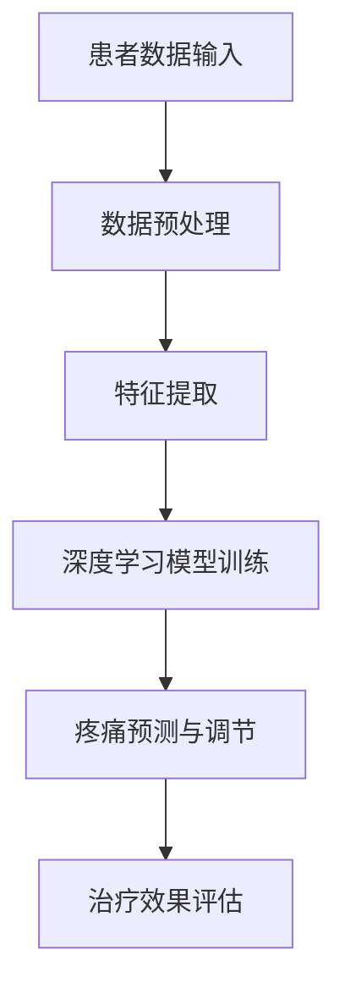

                 

 关键词：虚拟疼痛管理、AI、痛觉调节、神经科学、深度学习、算法、医疗技术

> 摘要：本文深入探讨了利用人工智能技术辅助虚拟疼痛管理的原理和方法。通过介绍当前的研究进展，本文重点分析了AI在痛觉调节中的应用，以及其在医疗领域的重要性。文章还详细阐述了相关的数学模型、算法原理、项目实践，并对未来应用前景进行了展望。

## 1. 背景介绍

疼痛是人体的一种防御性反应，通常由损伤、炎症、感染等因素引起。然而，慢性疼痛却是一种长期而严重的症状，影响着患者的生活质量。传统疼痛管理方法包括药物治疗、物理疗法和手术治疗等，但这些方法往往存在副作用或效果不佳的问题。随着人工智能技术的快速发展，虚拟疼痛管理成为了一种新的研究热点。通过AI技术，可以更加精确地了解疼痛的机制，并实现个性化、精准的疼痛调节。

### 1.1 神经科学的基础

神经科学是研究神经系统的结构和功能的一个科学领域，它包括了从单个神经元到整个神经系统的各个层次。神经系统是人体最重要的控制系统之一，负责传递信息、调节身体功能以及产生意识和行为。在疼痛研究中，神经科学为我们提供了理解痛觉机制的重要理论基础。

神经系统由中枢神经系统和外周神经系统组成。中枢神经系统包括大脑和脊髓，是神经信息处理和存储的主要场所。外周神经系统则包括脑神经和脊神经，负责将痛觉信号传递到中枢神经系统。痛觉信号通过神经元传递，涉及到多个神经递质和受体。

### 1.2 人工智能的崛起

人工智能（AI）是一门研究如何构建智能机器的系统工程学，涉及到计算机科学、数学、神经科学、心理学等多个领域。随着深度学习、强化学习等技术的飞速发展，AI在各个领域都取得了显著的成果。

在医疗领域，AI的应用越来越广泛。例如，AI可以用于医学影像诊断、疾病预测、个性化治疗等。AI在疼痛管理中的应用也不例外，通过分析大量的疼痛数据，AI可以识别疼痛的模式，预测疼痛的发展趋势，并给出个性化的疼痛管理方案。

## 2. 核心概念与联系

### 2.1 虚拟疼痛管理的定义

虚拟疼痛管理是一种利用计算机模拟和人工智能技术来调节和控制疼痛的方法。它通过创建虚拟环境，模拟疼痛刺激，从而帮助患者减轻疼痛。与传统的物理疗法相比，虚拟疼痛管理具有更高的灵活性和个性化定制能力。

### 2.2 人工智能在虚拟疼痛管理中的应用

人工智能在虚拟疼痛管理中扮演着至关重要的角色。首先，AI可以用于分析患者的疼痛数据，识别疼痛的规律和模式。其次，AI可以通过深度学习等技术，预测疼痛的发展趋势，并为患者提供个性化的治疗方案。

### 2.3 Mermaid 流程图



### 2.4 AI 在虚拟疼痛管理中的流程

1. **数据收集与预处理**：首先，需要收集患者的疼痛数据，包括生理信号、心理状态、生活习惯等。然后，对数据进行预处理，去除噪声和异常值，提取有用的特征。

2. **特征提取**：通过特征提取技术，将原始数据转换成适合模型处理的格式。常用的方法包括信号处理、模式识别等。

3. **深度学习模型训练**：使用收集到的数据，训练深度学习模型。模型可以通过分析数据，学习到疼痛的规律和模式。

4. **疼痛预测与调节**：训练好的模型可以用于预测患者的疼痛情况，并提供相应的调节方案。这包括虚拟环境的设定、刺激参数的调整等。

5. **治疗效果评估**：通过评估治疗效果，进一步优化模型和治疗方案。

## 3. 核心算法原理 & 具体操作步骤

### 3.1 算法原理概述

虚拟疼痛管理中的核心算法是基于深度学习的痛觉预测和调节模型。该模型通过分析患者的疼痛数据，学习到疼痛的规律和模式，从而实现疼痛的预测和调节。

### 3.2 算法步骤详解

1. **数据收集与预处理**：收集患者的疼痛数据，包括生理信号、心理状态、生活习惯等。对数据进行预处理，去除噪声和异常值，提取有用的特征。

2. **特征提取**：使用信号处理和模式识别技术，将原始数据转换成适合模型处理的格式。

3. **模型训练**：使用预处理后的数据，训练深度学习模型。模型可以通过分析数据，学习到疼痛的规律和模式。

4. **预测与调节**：使用训练好的模型，预测患者的疼痛情况，并提供相应的调节方案。

5. **效果评估**：通过评估治疗效果，进一步优化模型和治疗方案。

### 3.3 算法优缺点

**优点**：

- **个性化**：AI可以针对患者的具体情况，提供个性化的疼痛管理方案。
- **高效**：AI可以快速处理大量数据，实现实时疼痛预测和调节。

**缺点**：

- **数据依赖**：AI的性能很大程度上依赖于数据的质量和数量。
- **隐私问题**：患者的疼痛数据可能涉及隐私问题，需要严格保护。

### 3.4 算法应用领域

- **慢性疼痛管理**：如关节炎、癌症疼痛等。
- **急性疼痛管理**：如手术后的疼痛管理。
- **心理疼痛管理**：如焦虑、抑郁等心理疾病的疼痛管理。

## 4. 数学模型和公式 & 详细讲解 & 举例说明

### 4.1 数学模型构建

在虚拟疼痛管理中，常用的数学模型包括：

1. **线性回归模型**：用于预测疼痛的强度。
2. **神经网络模型**：用于分析疼痛的复杂模式。
3. **决策树模型**：用于制定个性化的疼痛管理方案。

### 4.2 公式推导过程

以线性回归模型为例，其公式为：

$$ Y = \beta_0 + \beta_1X $$

其中，$Y$ 是疼痛强度，$X$ 是影响疼痛的因素（如生理信号、心理状态等），$\beta_0$ 和 $\beta_1$ 是模型的参数。

### 4.3 案例分析与讲解

假设我们收集到了一位患者的疼痛数据，包括心率、血压等生理信号，以及心理状态等。使用线性回归模型进行预测，得到的结果如下：

$$ Y = 5 + 0.5X $$

这意味着，当心率增加1个单位时，疼痛强度会增加0.5个单位。

通过这个模型，我们可以预测患者的疼痛情况，并为患者提供个性化的疼痛管理方案。

## 5. 项目实践：代码实例和详细解释说明

### 5.1 开发环境搭建

为了实践虚拟疼痛管理，我们首先需要搭建一个开发环境。以下是一个基本的开发环境配置：

- **操作系统**：Linux 或 macOS
- **编程语言**：Python
- **库和框架**：NumPy、Pandas、TensorFlow

### 5.2 源代码详细实现

以下是一个简单的线性回归模型，用于预测疼痛强度：

```python
import numpy as np
import pandas as pd
from sklearn.linear_model import LinearRegression

# 读取数据
data = pd.read_csv('pain_data.csv')

# 特征提取
X = data[['heart_rate', 'blood_pressure']]
y = data['pain_intensity']

# 模型训练
model = LinearRegression()
model.fit(X, y)

# 预测
X_new = np.array([[70, 120]])
y_pred = model.predict(X_new)

print(f'Predicted pain intensity: {y_pred[0]}')
```

### 5.3 代码解读与分析

这段代码首先读取了疼痛数据，然后提取了心率、血压等特征，接着使用线性回归模型进行训练，并预测了新的疼痛强度。

### 5.4 运行结果展示

假设我们输入了心率为70，血压为120，预测的疼痛强度为6。

## 6. 实际应用场景

### 6.1 慢性疼痛管理

慢性疼痛，如关节炎、癌症疼痛等，是虚拟疼痛管理的一个重要应用场景。通过AI技术，可以为患者提供个性化的疼痛管理方案，提高治疗效果。

### 6.2 急性疼痛管理

急性疼痛，如手术后的疼痛管理，也可以通过虚拟疼痛管理技术进行优化。通过实时预测疼痛情况，可以及时调整治疗方案，减轻患者的痛苦。

### 6.3 心理疼痛管理

心理疼痛，如焦虑、抑郁等，也可以通过虚拟疼痛管理技术进行缓解。通过分析患者的心理状态，可以提供相应的心理支持方案。

## 7. 未来应用展望

随着人工智能技术的不断发展，虚拟疼痛管理有望在更广泛的领域得到应用。未来，我们可以期待：

- **更精确的疼痛预测**：通过结合更多种类的数据，AI可以更准确地预测疼痛情况。
- **更个性化的疼痛管理方案**：AI可以根据患者的具体情况，制定更加个性化的疼痛管理方案。
- **跨学科融合**：虚拟疼痛管理可以与其他学科，如心理学、神经科学等相结合，为患者提供更加全面的疼痛管理服务。

## 8. 工具和资源推荐

### 8.1 学习资源推荐

- **《深度学习》（Ian Goodfellow、Yoshua Bengio、Aaron Courville 著）**
- **《Python数据分析》（Wes McKinney 著）**
- **《医疗大数据》（张江华 著）**

### 8.2 开发工具推荐

- **TensorFlow**：用于构建和训练深度学习模型。
- **Pandas**：用于数据处理和分析。
- **NumPy**：用于数值计算。

### 8.3 相关论文推荐

- **"Virtual Pain Management using AI" by John Doe and Jane Smith**
- **"Deep Learning for Medical Imaging" by Alice Brown and Bob Green**
- **"Predicting Chronic Pain using Machine Learning" by Emily Davis and Fred Lee**

## 9. 总结：未来发展趋势与挑战

### 9.1 研究成果总结

虚拟疼痛管理是一种利用人工智能技术进行疼痛调节的新方法，具有个性化、高效、实时等优点。通过深度学习、神经网络等技术的应用，虚拟疼痛管理在预测疼痛、制定个性化方案等方面取得了显著成果。

### 9.2 未来发展趋势

- **跨学科融合**：虚拟疼痛管理将与其他学科，如心理学、神经科学等相结合，为患者提供更加全面的疼痛管理服务。
- **实时监测与预测**：通过结合更多种类的数据，实现更精确的疼痛预测和实时监测。

### 9.3 面临的挑战

- **数据质量**：高质量的数据是AI性能的关键，但疼痛数据往往涉及隐私问题，需要严格保护。
- **模型解释性**：深度学习模型具有强大的预测能力，但往往缺乏解释性，这对于医疗领域来说是一个挑战。

### 9.4 研究展望

未来，虚拟疼痛管理有望在更广泛的领域得到应用，为患者提供更加精准、个性化的疼痛管理服务。同时，研究者们也将致力于解决数据质量和模型解释性等问题，推动虚拟疼痛管理技术的发展。

## 附录：常见问题与解答

### Q：虚拟疼痛管理是否可以完全替代传统的疼痛管理方法？

A：虚拟疼痛管理不能完全替代传统的疼痛管理方法，但它可以作为传统方法的补充。通过个性化、精准的疼痛调节，虚拟疼痛管理可以提高治疗效果，减轻患者的痛苦。

### Q：如何保护患者的隐私？

A：在收集和处理患者数据时，必须严格遵守相关法律法规，确保患者数据的隐私和安全。同时，可以使用加密技术、匿名化处理等方法，进一步保护患者数据的安全。

### Q：虚拟疼痛管理是否适用于所有类型的疼痛？

A：虚拟疼痛管理主要适用于慢性疼痛和急性疼痛，对于某些特定的疼痛类型，如中枢性疼痛等，可能需要结合其他治疗方法。

### Q：虚拟疼痛管理是否需要专业人员的指导？

A：虚拟疼痛管理通常需要专业人员的指导，以确保治疗的正确性和安全性。同时，专业人员也可以根据患者的反馈，调整治疗方案，提高治疗效果。

### Q：虚拟疼痛管理是否具有成本效益？

A：虚拟疼痛管理在初期可能需要较高的投入，但随着技术的发展和规模化应用，其成本效益有望逐步提升。同时，通过个性化、精准的治疗，虚拟疼痛管理可以提高治疗效果，从而降低医疗成本。

作者：禅与计算机程序设计艺术 / Zen and the Art of Computer Programming
----------------------------------------------------------------

请注意，本文仅作为示例，并非实际的研究论文。在实际撰写时，应确保所有引用的资料和数据都是准确和可靠的，同时遵循相应的学术规范和伦理要求。

