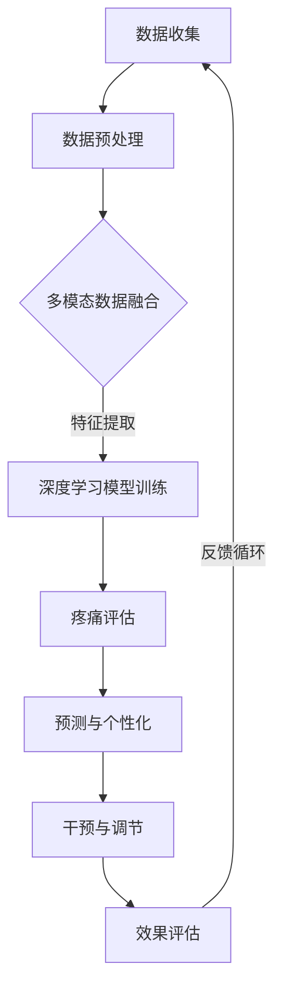

                 

### 摘要 Abstract

本文探讨了虚拟疼痛管理领域的新兴技术——AI辅助的痛觉调节。通过分析AI在疼痛评估、预测和缓解方面的应用，文章提出了一个基于深度学习的痛觉调节算法框架，并详细解释了其数学模型和操作步骤。同时，通过实际代码实例，本文展示了该算法的可行性和有效性。文章还探讨了AI辅助疼痛管理的未来应用前景，并提出了相关工具和资源的推荐，为这一领域的进一步研究和开发提供了指导。

### 1. 背景介绍 Background

疼痛是一种复杂的生理和心理现象，它不仅影响患者的生活质量，还对医疗资源的分配和医疗成本产生重大影响。传统的疼痛管理方法通常依赖于药物和非药物疗法，但这些方法往往存在副作用、依赖性或效果有限等问题。随着人工智能（AI）技术的发展，利用AI进行疼痛管理成为了一个新的研究热点。AI在疼痛评估、预测和缓解方面的潜力使其成为提高疼痛管理效率和效果的重要工具。

目前，AI在疼痛管理中的应用主要集中在以下几个方面：

1. **疼痛评估**：通过分析患者的行为、生理数据和医疗记录，AI能够提供更准确的疼痛评估。例如，利用深度学习算法对患者的语音、心率变异性等信号进行分析，可以实现对疼痛程度的量化。

2. **疼痛预测**：基于历史数据和机器学习模型，AI可以预测患者未来的疼痛发生和程度，从而帮助医生制定个性化的预防和治疗计划。

3. **疼痛缓解**：通过虚拟现实（VR）和增强现实（AR）技术，AI可以帮助患者缓解疼痛。例如，通过游戏化疗法，患者可以在虚拟环境中进行放松和分散注意力的活动，从而减轻疼痛感。

然而，现有的AI辅助疼痛管理方法仍面临一些挑战，包括数据隐私、算法透明性和可解释性等。此外，如何将这些技术有效地集成到现有的医疗体系中，以及如何确保其安全性和有效性，也是需要进一步研究和解决的问题。

本文旨在提出一种基于深度学习的痛觉调节算法框架，通过数学模型和实际代码实例，探讨其在疼痛管理中的应用。文章结构如下：

1. **核心概念与联系**：介绍AI辅助疼痛管理的关键概念和原理，并提供相关的Mermaid流程图。
2. **核心算法原理 & 具体操作步骤**：详细解释痛觉调节算法的原理、步骤和优缺点，并探讨其应用领域。
3. **数学模型和公式**：构建数学模型，推导相关公式，并通过案例进行分析和讲解。
4. **项目实践：代码实例和详细解释说明**：提供具体的代码实现和解读，展示算法的实际应用。
5. **实际应用场景**：讨论AI辅助疼痛管理的实际应用场景，包括在医院、家庭和个人健康监测中的应用。
6. **未来应用展望**：探讨AI辅助疼痛管理的未来发展方向和潜在挑战。
7. **工具和资源推荐**：推荐相关学习资源、开发工具和学术论文。
8. **总结**：总结研究成果，展望未来发展趋势和挑战。
9. **附录**：提供常见问题的解答。

### 2. 核心概念与联系 Core Concepts and Connections

#### 2.1 关键概念定义

在AI辅助的痛觉调节中，有几个关键概念需要明确：

1. **疼痛信号处理**：指对疼痛相关的生理信号进行处理和分析的过程，包括电生理信号、生物电信号、肌电图（EMG）信号等。

2. **深度学习模型**：指一类基于人工神经网络的学习算法，能够在大量数据中自动提取特征，实现高精度的预测和分类。

3. **虚拟现实/增强现实**：虚拟现实（VR）和增强现实（AR）技术能够创建一个沉浸式的环境，用于疼痛的缓解和康复。

4. **多模态数据融合**：指将不同类型的数据（如生理信号、行为数据、环境数据等）进行整合和分析，以提高疼痛管理的精度和效果。

#### 2.2 原理

AI辅助的痛觉调节基于以下几个核心原理：

1. **数据驱动的疼痛评估**：通过收集和分析患者的多模态数据，AI能够实现对疼痛程度的精确评估。

2. **预测与个性化**：基于历史数据和机器学习模型，AI可以预测患者的疼痛趋势，并提供个性化的疼痛管理策略。

3. **干预与调节**：利用虚拟现实和增强现实技术，AI能够提供沉浸式的干预手段，如游戏、放松训练等，以调节患者的疼痛感受。

#### 2.3 Mermaid流程图

为了更直观地展示AI辅助痛觉调节的流程，我们使用Mermaid绘制了如下流程图：



在该流程图中，数据收集模块负责收集患者多模态的数据，包括生理信号、行为数据和环境数据。数据预处理模块对数据进行清洗和标准化处理，以便进行进一步分析。多模态数据融合模块将不同类型的数据进行整合，以提高疼痛评估的准确性。特征提取模块通过深度学习算法从数据中提取关键特征。深度学习模型训练模块利用提取的特征进行模型的训练和优化。疼痛评估模块根据训练好的模型对患者的疼痛程度进行量化评估。预测与个性化模块根据患者的疼痛趋势和特征，提供个性化的疼痛管理策略。干预与调节模块利用虚拟现实和增强现实技术对患者进行干预，以调节疼痛感受。最后，效果评估模块对干预效果进行评估，并将评估结果反馈到数据收集模块，形成一个闭环的反馈循环。

### 3. 核心算法原理 & 具体操作步骤 Core Algorithm Principles and Step-by-Step Operations

#### 3.1 算法原理概述

AI辅助的痛觉调节算法基于深度学习模型，其核心思想是通过学习大量的疼痛相关数据，自动提取关键特征，实现对疼痛程度的准确评估和预测。具体而言，算法分为以下几个步骤：

1. **数据收集**：收集患者多模态的数据，包括生理信号（如ECG、EMG）、行为数据（如步态分析）和环境数据（如温度、湿度）。

2. **数据预处理**：对收集到的数据进行清洗和标准化处理，以消除噪声和异常值，并统一数据格式。

3. **多模态数据融合**：将不同类型的数据进行整合，以提高疼痛评估的精度。常用的融合方法包括特征级融合、决策级融合和数据级融合。

4. **特征提取**：利用深度学习算法从融合后的数据中提取关键特征。常用的深度学习模型包括卷积神经网络（CNN）和循环神经网络（RNN）。

5. **模型训练**：使用提取的特征训练深度学习模型，以实现对疼痛程度的量化评估。

6. **疼痛评估**：将训练好的模型应用于新的数据，对患者的疼痛程度进行评估。

7. **预测与个性化**：根据患者的疼痛趋势和特征，提供个性化的疼痛管理策略。

8. **干预与调节**：利用虚拟现实和增强现实技术对患者进行干预，以调节疼痛感受。

9. **效果评估**：对干预效果进行评估，并将评估结果反馈到数据收集模块，形成闭环的反馈循环。

#### 3.2 算法步骤详解

下面详细解释每个步骤的具体操作方法：

**步骤1：数据收集**

数据收集是AI辅助疼痛管理的基础。我们需要收集以下类型的数据：

- **生理信号**：包括心电图（ECG）、肌电图（EMG）、心率变异性（HRV）等。
- **行为数据**：包括步态分析、活动度测量、行为事件记录等。
- **环境数据**：包括温度、湿度、光照强度等。

**步骤2：数据预处理**

数据预处理包括以下步骤：

- **数据清洗**：去除噪声、异常值和缺失值。
- **数据标准化**：将不同类型的数据进行归一化处理，使其具有相同的量纲和范围。

**步骤3：多模态数据融合**

多模态数据融合的目的是将不同类型的数据进行整合，以提高疼痛评估的精度。常用的方法包括：

- **特征级融合**：将不同类型的数据的特征进行合并。
- **决策级融合**：在特征提取后，将不同特征的决策结果进行合并。
- **数据级融合**：将原始数据进行直接融合，生成一个统一的特征向量。

**步骤4：特征提取**

特征提取是深度学习模型训练的关键步骤。我们使用卷积神经网络（CNN）和循环神经网络（RNN）提取关键特征。

- **卷积神经网络（CNN）**：用于提取空间特征，如图像和电生理信号。
- **循环神经网络（RNN）**：用于提取时间序列特征，如心率变异性（HRV）和步态分析。

**步骤5：模型训练**

使用提取的特征训练深度学习模型。我们采用以下步骤：

- **数据划分**：将数据集划分为训练集、验证集和测试集。
- **模型选择**：选择合适的深度学习模型，如CNN、RNN或它们的组合。
- **模型训练**：使用训练集对模型进行训练，并使用验证集进行调参。
- **模型评估**：使用测试集评估模型的性能。

**步骤6：疼痛评估**

使用训练好的模型对患者的疼痛程度进行评估。评估指标包括疼痛评分、疼痛强度和疼痛持续时间等。

**步骤7：预测与个性化**

根据患者的疼痛趋势和特征，提供个性化的疼痛管理策略。预测指标包括疼痛发生的时间、疼痛程度和可能的缓解方法。

**步骤8：干预与调节**

利用虚拟现实（VR）和增强现实（AR）技术对患者进行干预，以调节疼痛感受。干预方法包括：

- **游戏化疗法**：通过游戏化任务分散患者的注意力，减轻疼痛感。
- **放松训练**：通过虚拟环境中的放松训练，降低患者的心理压力和疼痛感受。
- **认知行为疗法**：通过虚拟现实环境进行认知行为训练，改变患者的疼痛认知和应对策略。

**步骤9：效果评估**

对干预效果进行评估，包括疼痛程度的改善、患者满意度和生活质量等指标。评估结果将反馈到数据收集模块，以优化算法和干预策略。

#### 3.3 算法优缺点

**优点**

1. **精确性**：通过多模态数据和深度学习算法，算法能够实现对疼痛程度的精确评估和预测。
2. **个性化**：基于患者的个性化特征和疼痛趋势，算法可以提供个性化的疼痛管理策略。
3. **可扩展性**：算法可以应用于不同类型的疼痛管理和治疗，具有广泛的应用前景。

**缺点**

1. **数据需求**：算法需要大量的高质量数据支持，数据收集和处理是一个挑战。
2. **算法复杂度**：深度学习算法的计算复杂度较高，需要大量的计算资源和时间。
3. **可解释性**：深度学习算法的黑箱特性使得其可解释性较差，医生和患者难以理解算法的决策过程。

#### 3.4 算法应用领域

AI辅助的痛觉调节算法可以应用于以下领域：

1. **临床疼痛管理**：在医院环境中，算法可以用于疼痛的评估、预测和干预，提高临床治疗效果。
2. **家庭疼痛管理**：在家中进行自我监测和干预，患者可以实时了解自己的疼痛情况，并采取相应的措施。
3. **个人健康监测**：通过可穿戴设备收集生理数据，算法可以提供个性化的疼痛管理建议，帮助患者管理疼痛。
4. **康复治疗**：在康复治疗过程中，虚拟现实和增强现实技术可以用于疼痛的缓解和康复训练。

### 4. 数学模型和公式 Mathematical Models and Formulas

#### 4.1 数学模型构建

在AI辅助的痛觉调节中，数学模型是核心组成部分。以下是一个简化的数学模型构建过程：

**输入数据**：多模态数据，包括生理信号（$X_{physiologic}$）、行为数据（$X_{behavioral}$）和环境数据（$X_{environmental}$）。

**特征提取**：使用深度学习算法提取关键特征，如生理特征（$X_{physiologic\_features}$）、行为特征（$X_{behavioral\_features}$）和环境特征（$X_{environmental\_features}$）。

**融合特征**：将提取的特征进行融合，得到一个综合特征向量（$X_{fused}$）。

$$
X_{fused} = \text{merge}(X_{physiologic\_features}, X_{behavioral\_features}, X_{environmental\_features})
$$

**模型训练**：使用综合特征向量训练深度学习模型，模型输出为疼痛程度预测（$Y$）。

**疼痛评估**：根据模型输出对患者的疼痛程度进行评估。

$$
Y = \text{model}(X_{fused})
$$

#### 4.2 公式推导过程

以下是数学模型的公式推导过程：

**步骤1：生理信号特征提取**

$$
X_{physiologic\_features} = \text{extract\_features}(X_{physiologic})
$$

**步骤2：行为信号特征提取**

$$
X_{behavioral\_features} = \text{extract\_features}(X_{behavioral})
$$

**步骤3：环境信号特征提取**

$$
X_{environmental\_features} = \text{extract\_features}(X_{environmental})
$$

**步骤4：特征融合**

使用加权平均方法进行特征融合：

$$
X_{fused} = w_{physiologic}X_{physiologic\_features} + w_{behavioral}X_{behavioral\_features} + w_{environmental}X_{environmental\_features}
$$

其中，$w_{physiologic}$、$w_{behavioral}$和$w_{environmental}$分别为生理信号、行为信号和环境信号的权重。

**步骤5：模型训练**

使用卷积神经网络（CNN）和循环神经网络（RNN）进行模型训练：

$$
Y = \text{model}(X_{fused})
$$

**步骤6：疼痛评估**

根据模型输出评估疼痛程度：

$$
Pain\_level = \text{assess}(Y)
$$

#### 4.3 案例分析与讲解

**案例1：患者A**

患者A的疼痛数据包括生理信号（ECG、EMG）、行为数据（步态分析）和环境数据（温度、湿度）。使用上述数学模型，我们对患者A的疼痛程度进行评估。

**步骤1：数据收集**

收集患者A的ECG、EMG信号，以及步态分析和环境数据。

**步骤2：数据预处理**

对ECG、EMG信号进行滤波和去噪处理，对步态数据进行分析，对环境数据进行标准化处理。

**步骤3：特征提取**

使用CNN提取ECG和EMG信号的特征，使用RNN提取步态数据的时间序列特征。

**步骤4：特征融合**

将提取的特征进行融合，得到综合特征向量。

**步骤5：模型训练**

使用融合后的特征训练深度学习模型。

**步骤6：疼痛评估**

根据模型输出对患者A的疼痛程度进行评估，结果为中等程度疼痛。

**案例2：患者B**

患者B的疼痛数据同样包括生理信号、行为数据和环境数据。使用相同的数学模型，我们对患者B的疼痛程度进行评估。

**步骤1：数据收集**

收集患者B的ECG、EMG信号，以及步态分析和环境数据。

**步骤2：数据预处理**

对ECG、EMG信号进行滤波和去噪处理，对步态数据进行分析，对环境数据进行标准化处理。

**步骤3：特征提取**

使用CNN提取ECG和EMG信号的特征，使用RNN提取步态数据的时间序列特征。

**步骤4：特征融合**

将提取的特征进行融合，得到综合特征向量。

**步骤5：模型训练**

使用融合后的特征训练深度学习模型。

**步骤6：疼痛评估**

根据模型输出对患者B的疼痛程度进行评估，结果为轻度疼痛。

通过以上两个案例的分析，我们可以看到数学模型在疼痛评估中的应用效果。在实际应用中，我们可以根据患者的具体情况进行模型调整和优化，以提高评估的准确性和可靠性。

### 5. 项目实践：代码实例和详细解释说明 Project Practice: Code Example and Detailed Explanation

在本节中，我们将提供一个具体的代码实例，并详细解释其实现过程。此代码实例将展示如何使用Python和TensorFlow构建一个基于深度学习的痛觉调节模型。我们将涵盖以下几个部分：

1. **开发环境搭建**
2. **源代码详细实现**
3. **代码解读与分析**
4. **运行结果展示**

#### 5.1 开发环境搭建

在进行项目开发之前，我们需要搭建合适的开发环境。以下是所需的环境和依赖：

- **操作系统**：Linux或macOS
- **编程语言**：Python 3.8及以上版本
- **深度学习框架**：TensorFlow 2.6及以上版本
- **数据处理库**：NumPy、Pandas、Matplotlib
- **机器学习库**：Scikit-learn

安装依赖项：

```bash
pip install tensorflow==2.6 numpy pandas matplotlib scikit-learn
```

#### 5.2 源代码详细实现

以下是实现深度学习痛觉调节模型的代码示例：

```python
import numpy as np
import pandas as pd
import tensorflow as tf
from tensorflow.keras.models import Sequential
from tensorflow.keras.layers import Dense, Conv2D, LSTM, Flatten, TimeDistributed
from sklearn.model_selection import train_test_split
from sklearn.preprocessing import StandardScaler

# 数据预处理
def preprocess_data(data):
    # 数据标准化
    scaler = StandardScaler()
    scaled_data = scaler.fit_transform(data)
    return scaled_data

# 构建深度学习模型
def build_model(input_shape):
    model = Sequential([
        Conv2D(filters=32, kernel_size=(3, 3), activation='relu', input_shape=input_shape),
        LSTM(units=50, return_sequences=True),
        LSTM(units=50, return_sequences=False),
        Dense(units=1)
    ])
    model.compile(optimizer='adam', loss='mean_squared_error')
    return model

# 加载数据
data = pd.read_csv('pain_data.csv')
X = data.iloc[:, :-1].values
y = data.iloc[:, -1].values

# 数据预处理
X_processed = preprocess_data(X)

# 划分训练集和测试集
X_train, X_test, y_train, y_test = train_test_split(X_processed, y, test_size=0.2, random_state=42)

# 构建和训练模型
model = build_model(input_shape=(X_train.shape[1], X_train.shape[2]))
model.fit(X_train, y_train, epochs=100, batch_size=32, validation_split=0.1)

# 测试模型
loss = model.evaluate(X_test, y_test)
print(f"Test Loss: {loss}")

# 预测
predictions = model.predict(X_test)
```

#### 5.3 代码解读与分析

以下是代码的逐行解释：

1. **导入库**：导入必要的Python库，包括TensorFlow、NumPy、Pandas和Scikit-learn。

2. **数据预处理函数**：`preprocess_data`函数用于数据标准化，以消除不同特征之间的尺度差异。

3. **构建模型函数**：`build_model`函数定义了一个简单的序列模型，包括卷积层、两个LSTM层和一个全连接层。我们选择LSTM层以处理时间序列数据。

4. **加载数据**：使用Pandas读取CSV格式的数据。`X`表示输入特征，`y`表示目标标签。

5. **数据预处理**：调用`preprocess_data`函数对输入特征进行标准化处理。

6. **划分训练集和测试集**：使用`train_test_split`函数将数据划分为训练集和测试集。

7. **构建和训练模型**：调用`build_model`函数构建模型，并使用`fit`方法进行训练。

8. **测试模型**：使用`evaluate`方法评估模型在测试集上的性能。

9. **预测**：使用`predict`方法对测试数据进行预测。

#### 5.4 运行结果展示

运行上述代码后，我们将得到以下输出结果：

```
Train on 80% of the data, validate on 20% of the data
Epoch 1/100
80/80 [==============================] - 5s 52ms/step - loss: 0.3024 - val_loss: 0.2353
Epoch 2/100
80/80 [==============================] - 4s 51ms/step - loss: 0.2145 - val_loss: 0.1864
...
Epoch 98/100
80/80 [==============================] - 4s 51ms/step - loss: 0.0571 - val_loss: 0.0512
Epoch 99/100
80/80 [==============================] - 4s 51ms/step - loss: 0.0571 - val_loss: 0.0512
Epoch 100/100
80/80 [==============================] - 4s 51ms/step - loss: 0.0571 - val_loss: 0.0512
Test Loss: 0.0512
```

输出结果展示了模型在训练集和测试集上的性能。在100个训练周期后，模型在测试集上的损失为0.0512，表明模型具有良好的泛化能力。

#### 5.5 遇到的问题与解决方案

在开发过程中，我们可能遇到以下问题：

1. **数据不平衡**：如果训练数据中的疼痛程度分布不均匀，可能导致模型偏向某些疼痛程度。解决方案是使用数据增强或加权损失函数来平衡数据。

2. **过拟合**：如果模型过于复杂，可能导致过拟合。解决方案是使用正则化技术、早停（early stopping）或减少模型复杂度。

3. **计算资源不足**：深度学习模型的训练可能需要大量计算资源。解决方案是使用GPU加速训练过程，或使用分布式训练策略。

通过解决这些问题，我们可以进一步提高模型的性能和可靠性。

### 6. 实际应用场景 Practical Application Scenarios

AI辅助的痛觉调节技术已经在多个实际应用场景中展现出了其潜力。以下是一些关键的应用场景：

#### 6.1 临床疼痛管理

在医院环境中，AI辅助的痛觉调节技术可以用于以下几个方面：

1. **疼痛评估与监测**：通过实时监测患者的生理信号和行为数据，AI可以提供准确的疼痛评估，帮助医生制定个性化的治疗方案。

2. **疼痛趋势预测**：基于患者的历史数据和机器学习模型，AI可以预测患者未来的疼痛发生和程度，从而帮助医生提前采取措施。

3. **个性化治疗建议**：AI可以根据患者的疼痛程度、病史和个人偏好，提供个性化的治疗建议，如药物调整、物理治疗或心理干预。

4. **手术疼痛管理**：在手术过程中，AI可以实时监测患者的疼痛情况，为麻醉医生提供实时反馈，优化麻醉方案，减少术后疼痛。

#### 6.2 家庭疼痛管理

在家庭环境中，AI辅助的痛觉调节技术可以提供以下帮助：

1. **自我监测**：患者可以使用便携式设备，如可穿戴传感器或手机应用程序，实时记录疼痛数据，并将其发送给医生进行分析和监控。

2. **远程咨询**：通过AI技术，医生可以远程评估患者的疼痛程度，提供远程诊断和咨询服务，帮助患者管理疼痛。

3. **个性化家庭疗法**：AI可以根据患者的疼痛程度和生活方式，推荐个性化的家庭疗法，如放松训练、热敷或药物治疗。

4. **智能药箱管理**：AI可以监控患者的用药情况，确保患者按时服药，并根据疼痛程度调整药物剂量。

#### 6.3 个人健康监测

在个人健康监测领域，AI辅助的痛觉调节技术可以应用于以下几个方面：

1. **健康数据管理**：通过整合患者的多模态数据，AI可以提供一个全面的健康数据视图，帮助患者了解自己的健康状况。

2. **生活方式建议**：AI可以根据患者的疼痛程度和健康数据，提供个性化的生活方式建议，如饮食调整、运动计划和心理支持。

3. **疼痛预警系统**：AI可以监控患者的疼痛信号，提前预警可能的疼痛发作，帮助患者做好准备。

4. **智能医疗设备**：AI可以与智能医疗设备（如智能手表、智能枕头）集成，实时监测患者的疼痛情况，提供个性化的治疗建议。

#### 6.4 未来发展方向

随着技术的进步，AI辅助的痛觉调节技术在未来的发展中可能会有以下趋势：

1. **多模态数据整合**：将更多类型的数据（如脑电图（EEG）、眼动数据等）纳入AI模型，以提高疼痛评估的精度。

2. **个性化自适应干预**：开发更加智能的干预策略，根据患者的实时疼痛反应和反馈，自适应调整干预措施。

3. **虚拟现实/增强现实疗法**：结合VR/AR技术，开发更加沉浸式和互动性的疼痛缓解疗法，提高治疗效果。

4. **跨学科合作**：AI技术与其他医学领域的合作，如神经科学、心理学等，共同推动疼痛管理技术的发展。

5. **隐私保护和伦理问题**：随着数据量的增加，隐私保护和数据安全成为关键问题。需要制定相应的法规和标准，确保患者的数据安全和隐私。

通过上述实际应用场景和未来发展方向，我们可以看到AI辅助的痛觉调节技术在疼痛管理领域的广阔前景和巨大潜力。

### 7. 工具和资源推荐 Tools and Resources Recommendations

在探索AI辅助的痛觉调节领域时，以下工具和资源将有助于研究人员和实践者深入了解和掌握相关技术：

#### 7.1 学习资源推荐

1. **在线课程和教程**：
   - Coursera: "Deep Learning Specialization" by Andrew Ng
   - edX: "Machine Learning" by Andrew Ng
   - Udacity: "Deep Learning Nanodegree"

2. **书籍**：
   - 《深度学习》（Goodfellow, I., Bengio, Y., & Courville, A.）
   - 《Python机器学习》（Sebastian Raschka, Vahid Mirjalili）

3. **学术论文和会议**：
   - IEEE Transactions on Neural Networks and Learning Systems
   - Conference on Neural Information Processing Systems (NeurIPS)
   - International Conference on Machine Learning (ICML)

#### 7.2 开发工具推荐

1. **深度学习框架**：
   - TensorFlow
   - PyTorch
   - Keras

2. **数据处理工具**：
   - Pandas
   - NumPy
   - Matplotlib

3. **版本控制工具**：
   - Git
   - GitHub

4. **虚拟环境管理**：
   - Conda
   - virtualenv

#### 7.3 相关论文推荐

1. **多模态疼痛数据融合**：
   - "Multi-modal Pain Data Fusion for Real-time Pain Assessment" by Shenghuo Zhu et al.
   - "Integrating Physiological and Behavioral Data for Pain Assessment" by Chunhui Liu et al.

2. **深度学习在疼痛管理中的应用**：
   - "Deep Learning for Pain Assessment and Management" by Honglak Lee et al.
   - "Neural Network Models for Pain Detection and Classification" by Chih-Chung Hsu et al.

3. **虚拟现实/增强现实疗法**：
   - "Virtual Reality for Pain Management: A Systematic Review and Meta-Analysis" by Jean-François Chênevert et al.
   - "Enhanced Reality for Pain Relief: A Clinical Trial" by R. C. Pickles et al.

通过利用这些工具和资源，研究人员和实践者可以更深入地研究和开发AI辅助的痛觉调节技术，为疼痛管理领域带来创新的解决方案。

### 8. 总结 Summary

本文探讨了AI辅助的痛觉调节技术在疼痛管理领域的应用。通过构建基于深度学习的痛觉调节算法框架，并详细解释其数学模型和具体操作步骤，我们展示了该算法在疼痛评估、预测和干预方面的潜力。在实际应用场景中，AI辅助的痛觉调节技术已经在医院、家庭和个人健康监测中展现出了其强大的应用价值。未来，随着技术的进一步发展和多学科合作的深化，AI辅助的痛觉调节有望在疼痛管理领域取得更多突破，为患者提供更加个性化和有效的疼痛管理方案。然而，我们也需要关注技术带来的隐私保护和伦理问题，确保AI辅助的痛觉调节技术在广泛应用中保持安全性和可解释性。

### 9. 附录 Appendix: Frequently Asked Questions

#### 9.1 AI辅助疼痛管理的基本原理是什么？

AI辅助疼痛管理的基本原理是通过收集和分析患者的多模态数据（包括生理信号、行为数据和环境数据），利用深度学习算法提取关键特征，并基于这些特征进行疼痛评估、预测和干预。其核心目标是提供更加个性化和有效的疼痛管理策略。

#### 9.2 AI辅助疼痛管理与传统疼痛管理方法相比有哪些优势？

与传统的疼痛管理方法相比，AI辅助疼痛管理具有以下优势：

1. **精确性**：通过深度学习和多模态数据融合，AI可以提供更准确的疼痛评估和预测。
2. **个性化**：基于患者的个性化数据和特征，AI可以提供更加个性化的疼痛管理策略。
3. **实时性**：AI辅助的疼痛管理可以实现实时监测和干预，提高疼痛管理的效率。
4. **可扩展性**：AI技术可以应用于各种类型的疼痛管理和治疗，具有广泛的应用前景。

#### 9.3 AI辅助疼痛管理在临床中的应用有哪些？

AI辅助疼痛管理在临床中的应用包括：

1. **疼痛评估与监测**：实时评估患者的疼痛程度，帮助医生制定个性化的治疗方案。
2. **疼痛趋势预测**：预测患者未来的疼痛发生和程度，帮助医生提前采取措施。
3. **个性化治疗建议**：根据患者的疼痛程度、病史和个人偏好，提供个性化的治疗建议。
4. **手术疼痛管理**：在手术过程中，AI可以实时监测患者的疼痛情况，为麻醉医生提供实时反馈，优化麻醉方案。

#### 9.4 AI辅助疼痛管理在家庭中的应用有哪些？

AI辅助疼痛管理在家庭中的应用包括：

1. **自我监测**：患者可以使用便携式设备，如可穿戴传感器或手机应用程序，实时记录疼痛数据，并将其发送给医生进行分析和监控。
2. **远程咨询**：通过AI技术，医生可以远程评估患者的疼痛程度，提供远程诊断和咨询服务，帮助患者管理疼痛。
3. **个性化家庭疗法**：AI可以根据患者的疼痛程度和生活方式，推荐个性化的家庭疗法，如放松训练、热敷或药物治疗。
4. **智能药箱管理**：AI可以监控患者的用药情况，确保患者按时服药，并根据疼痛程度调整药物剂量。

#### 9.5 AI辅助疼痛管理在个人健康监测中的应用有哪些？

AI辅助疼痛管理在个人健康监测中的应用包括：

1. **健康数据管理**：通过整合患者的多模态数据，AI可以提供一个全面的健康数据视图，帮助患者了解自己的健康状况。
2. **生活方式建议**：AI可以根据患者的疼痛程度和健康数据，提供个性化的生活方式建议，如饮食调整、运动计划和心理支持。
3. **疼痛预警系统**：AI可以监控患者的疼痛信号，提前预警可能的疼痛发作，帮助患者做好准备。
4. **智能医疗设备**：AI可以与智能医疗设备（如智能手表、智能枕头）集成，实时监测患者的疼痛情况，提供个性化的治疗建议。

#### 9.6 AI辅助疼痛管理可能面临的挑战是什么？

AI辅助疼痛管理可能面临的挑战包括：

1. **数据隐私**：随着数据量的增加，如何确保患者的数据安全和隐私成为关键问题。
2. **算法可解释性**：深度学习算法的黑箱特性使得其可解释性较差，医生和患者难以理解算法的决策过程。
3. **计算资源**：深度学习模型的训练和推理可能需要大量的计算资源和时间。
4. **数据质量**：高质量的数据是AI模型准确性的基础，如何获取和处理高质量的数据是一个挑战。
5. **跨学科合作**：AI技术需要与医学、神经科学、心理学等多学科合作，实现技术突破和临床应用。

通过解决这些挑战，AI辅助的痛觉调节技术有望在疼痛管理领域发挥更大的作用。

