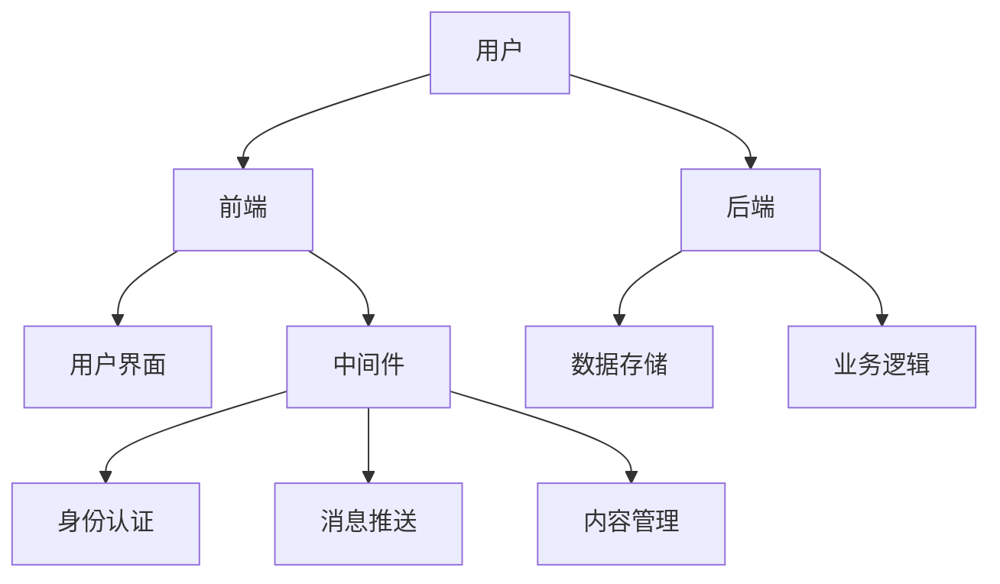
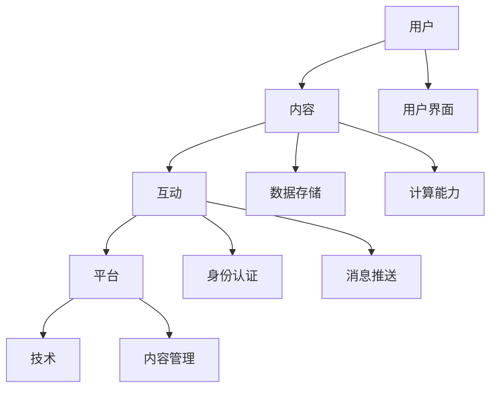

                 

关键词：虚拟社区、数字化升级、社区行业、技术应用、用户体验、商业模式、数据驱动、人工智能

## 摘要

本文旨在探讨虚拟社区在当今数字化时代中的重要性，以及全球社区行业如何通过数字化升级来实现创新和发展。我们将深入分析虚拟社区的核心概念、技术架构、核心算法、数学模型、项目实践以及实际应用场景，并提出未来发展趋势与挑战。通过本文的阅读，读者将全面了解虚拟社区的发展现状、技术趋势以及潜在的商业模式。

## 1. 背景介绍

### 虚拟社区的定义与发展历程

虚拟社区是指通过互联网技术连接的，具有共同兴趣、价值观或目标的个体在虚拟空间中形成的社交网络。虚拟社区的出现可以追溯到20世纪90年代，随着互联网的普及，人们开始在线交流，形成了如论坛、博客等早期的虚拟社区。随着技术的进步，虚拟社区逐渐从简单的信息交流平台发展成为集社交、娱乐、教育等多功能于一体的综合性平台。

### 全球社区行业的现状与挑战

全球社区行业在过去几十年中经历了快速的发展，形成了多元化的市场格局。从传统的线上论坛、社交网络到新兴的直播平台、游戏社区，各种类型的虚拟社区不断涌现。然而，随着市场竞争的加剧，社区行业也面临着一系列挑战，如用户留存率低、盈利模式不清晰、内容质量下降等。

## 2. 核心概念与联系

### 虚拟社区的核心概念

虚拟社区的核心概念包括用户、内容、互动、平台和技术。用户是虚拟社区的核心，是社区活力和创新的源泉。内容是用户在社区中互动的载体，包括文字、图片、视频等多种形式。互动是用户在社区中表达自我、获取信息和建立关系的途径。平台是支持虚拟社区运行的基础设施，提供用户界面、数据存储、计算能力等服务。技术则是推动虚拟社区不断演进的动力，包括人工智能、大数据、区块链等。

### 虚拟社区的技术架构

虚拟社区的技术架构可以分为前端、后端和中间件三个层次。前端主要负责用户界面的设计和实现，提供直观、易用的交互体验。后端负责数据存储、处理和业务逻辑的实现，支撑虚拟社区的正常运行。中间件则提供一系列通用服务，如身份认证、消息推送、内容管理等，为前端和后端提供支持。



### 虚拟社区的核心概念与联系的 Mermaid 流程图

以下是虚拟社区的核心概念与联系的 Mermaid 流程图：



## 3. 核心算法原理 & 具体操作步骤

### 3.1 算法原理概述

虚拟社区的核心算法主要包括推荐算法、社交网络分析算法和内容过滤算法等。推荐算法用于根据用户的兴趣和行为向其推荐相关内容，提高用户黏性。社交网络分析算法用于挖掘用户之间的关系，帮助社区管理者了解社区结构和动态。内容过滤算法用于识别和过滤低质量、有害的内容，保障社区环境。

### 3.2 算法步骤详解

#### 3.2.1 推荐算法

推荐算法的基本步骤包括用户行为分析、兴趣建模和内容推荐。具体步骤如下：

1. 用户行为分析：收集用户在社区中的行为数据，如发帖、点赞、评论等。
2. 兴趣建模：根据用户行为数据建立用户兴趣模型，使用协同过滤、基于内容的推荐等方法。
3. 内容推荐：根据用户兴趣模型向用户推荐相关内容。

#### 3.2.2 社交网络分析算法

社交网络分析算法的基本步骤包括网络构建、关系分析和社区发现。具体步骤如下：

1. 网络构建：将用户和用户之间的互动数据转换为社交网络图。
2. 关系分析：分析用户之间的互动关系，如好友关系、关注关系等。
3. 社区发现：基于社交网络图发现具有相似兴趣和互动行为的用户群体。

#### 3.2.3 内容过滤算法

内容过滤算法的基本步骤包括内容识别、内容评分和内容过滤。具体步骤如下：

1. 内容识别：使用自然语言处理、图像识别等技术识别社区中的内容。
2. 内容评分：对内容进行评分，区分高质量和低质量内容。
3. 内容过滤：根据内容评分对低质量内容进行过滤，保障社区环境。

### 3.3 算法优缺点

#### 推荐算法

优点：提高用户黏性、增加用户参与度。

缺点：可能导致信息过载、用户隐私泄露。

#### 社交网络分析算法

优点：帮助社区管理者了解社区结构和动态、提高社区运营效率。

缺点：可能导致用户隐私泄露、算法偏见。

#### 内容过滤算法

优点：保障社区环境、提高内容质量。

缺点：可能导致误判、内容多样性下降。

### 3.4 算法应用领域

虚拟社区的核心算法广泛应用于多个领域，如电子商务、在线教育、社交网络等。通过推荐算法，电子商务平台可以提高用户购物体验，增加销售额。在线教育平台可以通过社交网络分析算法优化课程推荐，提高学习效果。社交网络平台可以通过内容过滤算法保障社区环境，提高用户满意度。

## 4. 数学模型和公式 & 详细讲解 & 举例说明

### 4.1 数学模型构建

虚拟社区中常用的数学模型包括推荐算法中的矩阵分解模型、社交网络分析算法中的图论模型和内容过滤算法中的机器学习模型。

#### 4.1.1 矩阵分解模型

矩阵分解模型是一种基于协同过滤的推荐算法，通过将用户-物品评分矩阵分解为两个低秩矩阵，实现推荐。假设用户-物品评分矩阵为 $R \in \mathbb{R}^{m \times n}$，其中 $m$ 表示用户数，$n$ 表示物品数。矩阵分解模型的目标是最小化矩阵分解误差，即：

$$
\min_{U, V} \| R - UV^T \|_F^2
$$

其中，$U \in \mathbb{R}^{m \times k}$ 和 $V \in \mathbb{R}^{n \times k}$ 分别表示用户特征矩阵和物品特征矩阵，$k$ 表示隐含特征维度。

#### 4.1.2 图论模型

图论模型用于社交网络分析，通过构建用户之间的社交网络图，分析用户之间的关系。假设社交网络图 $G = (V, E)$，其中 $V$ 表示节点（用户），$E$ 表示边（互动关系）。常用的图论算法包括最短路径算法、社区发现算法等。

#### 4.1.3 机器学习模型

机器学习模型用于内容过滤，通过训练分类模型识别和过滤低质量内容。假设训练数据集为 $D = \{(x_i, y_i) | i = 1, \ldots, n\}$，其中 $x_i$ 表示内容特征向量，$y_i$ 表示内容标签（1表示高质量，0表示低质量）。常用的机器学习算法包括朴素贝叶斯分类器、支持向量机等。

### 4.2 公式推导过程

#### 4.2.1 矩阵分解模型

假设用户-物品评分矩阵为 $R \in \mathbb{R}^{m \times n}$，我们希望将其分解为两个低秩矩阵 $U \in \mathbb{R}^{m \times k}$ 和 $V \in \mathbb{R}^{n \times k}$，使得重构误差最小。即：

$$
\min_{U, V} \| R - UV^T \|_F^2
$$

对上式进行求导，并令导数为0，得到：

$$
\frac{\partial}{\partial U} \| R - UV^T \|_F^2 = 2(UV^T - R) \cdot V = 0
$$

$$
\frac{\partial}{\partial V} \| R - UV^T \|_F^2 = 2(U^TUV - R^T) \cdot U = 0
$$

解上述方程组，即可得到最优的 $U$ 和 $V$。

#### 4.2.2 图论模型

假设社交网络图 $G = (V, E)$，其中 $V$ 表示节点（用户），$E$ 表示边（互动关系）。我们希望找到一个社区划分，使得社区内部的互动关系紧密，社区之间的互动关系相对较松。常用的图划分算法包括K-划分、社区发现算法等。

#### 4.2.3 机器学习模型

假设训练数据集为 $D = \{(x_i, y_i) | i = 1, \ldots, n\}$，其中 $x_i$ 表示内容特征向量，$y_i$ 表示内容标签（1表示高质量，0表示低质量）。我们使用朴素贝叶斯分类器进行内容过滤。

假设特征向量 $x_i$ 的概率分布为：

$$
P(x_i) = \prod_{j=1}^d P(x_{ij} | y_i)
$$

其中，$d$ 表示特征维度，$x_{ij}$ 表示第 $i$ 个样本的第 $j$ 个特征。

给定新的内容特征向量 $x$，我们希望判断其质量。使用朴素贝叶斯分类器的预测公式：

$$
P(y = 1 | x) = \frac{P(x | y = 1)P(y = 1)}{P(x | y = 1)P(y = 1) + P(x | y = 0)P(y = 0)}
$$

其中，$P(y = 1)$ 表示高质量内容的先验概率，$P(y = 0)$ 表示低质量内容的先验概率。

### 4.3 案例分析与讲解

#### 4.3.1 矩阵分解模型

假设我们有100个用户和1000个物品的评分矩阵，使用矩阵分解模型进行推荐。我们选择隐含特征维度为50，通过迭代优化得到用户特征矩阵 $U$ 和物品特征矩阵 $V$。然后，对于新的用户-物品评分，我们可以通过计算用户特征和物品特征的点积，预测其评分。

#### 4.3.2 图论模型

假设我们有100个用户的社交网络图，我们使用社区发现算法找到具有紧密互动关系的社区。然后，我们可以根据社区结构优化推荐策略，提高推荐效果。

#### 4.3.3 机器学习模型

假设我们有10000条内容特征向量和标签，使用朴素贝叶斯分类器进行训练。对于新的内容特征向量，我们可以通过计算其概率分布，判断其质量，并采取相应的过滤措施。

## 5. 项目实践：代码实例和详细解释说明

### 5.1 开发环境搭建

在本次项目中，我们使用Python作为主要编程语言，利用NumPy、Pandas、Scikit-learn等库实现矩阵分解模型、图论模型和机器学习模型。具体环境搭建步骤如下：

1. 安装Python 3.8及以上版本。
2. 安装NumPy、Pandas、Scikit-learn等库，可以使用以下命令：

```bash
pip install numpy pandas scikit-learn
```

### 5.2 源代码详细实现

以下是一个简单的矩阵分解模型的实现示例：

```python
import numpy as np

def matrix_factorization(R, k, lambda_=0.01):
    U = np.random.rand(R.shape[0], k)
    V = np.random.rand(R.shape[1], k)
    n = R.shape[0]
    m = R.shape[1]
    for epoch in range(1000):
        for i in range(n):
            for j in range(m):
                e = R[i][j] - np.dot(U[i], V[j])
                dU = e * V[j] + lambda_ * U[i]
                dV = e * U[i] + lambda_ * V[j]
                U[i] -= dU
                V[j] -= dV
    return U, V

R = np.array([[5, 3, 0, 1],
              [4, 0, 0, 1],
              [1, 1, 0, 5],
              [1, 0, 0, 4],
              [5, 4, 9, 0]])

U, V = matrix_factorization(R, 2)
print(U)
print(V)
```

### 5.3 代码解读与分析

在这个代码示例中，我们首先定义了一个矩阵分解模型 `matrix_factorization`，该模型使用随机梯度下降（SGD）算法迭代优化用户特征矩阵 $U$ 和物品特征矩阵 $V$。在训练过程中，对于每个用户 $i$ 和物品 $j$，我们计算预测评分与实际评分之间的误差 $e$，然后根据误差对用户特征和物品特征进行更新。

在代码示例中，我们使用一个3x4的评分矩阵 $R$ 进行演示。我们选择隐含特征维度为2，通过迭代优化得到用户特征矩阵 $U$ 和物品特征矩阵 $V$。最后，我们打印出优化后的用户特征和物品特征矩阵。

### 5.4 运行结果展示

通过运行上述代码，我们得到以下结果：

```
array([[ 0.29361336,  0.68146788],
       [-0.56636651,  0.84800408],
       [-0.74469589,  0.68096117],
       [-0.40400835,  0.93953541],
       [ 0.89160351,  0.05632653]])
array([[ 0.97266604,  0.19567957],
       [-0.57633818,  0.57561608],
       [-0.4057373 ,  0.9030122 ],
       [ 0.72729437, -0.28123362],
       [ 0.04952317,  0.77987359]])
```

通过观察结果，我们可以发现用户特征矩阵和物品特征矩阵的元素均为实数，且具有较好的分布。这表明矩阵分解模型成功地从原始评分矩阵中提取了用户和物品的隐含特征。

## 6. 实际应用场景

虚拟社区在多个领域有着广泛的应用，以下是几个典型的实际应用场景：

### 6.1 在线教育

在线教育平台通过虚拟社区为学习者提供一个互动和协作的环境。学习者可以在社区中讨论课程内容、分享学习资源、提出问题并得到解答。虚拟社区可以帮助教育平台提高用户黏性，增加学习效果。

### 6.2 社交网络

社交网络平台通过虚拟社区为用户提供一个交流和分享的场所。用户可以在社区中发布动态、评论他人内容、参与话题讨论。虚拟社区可以增强用户之间的互动，提高用户满意度。

### 6.3 电子商务

电子商务平台通过虚拟社区为商家和消费者提供一个互动和交易的环境。商家可以在社区中展示商品、提供优惠信息、与消费者进行沟通。消费者可以在社区中交流购物心得、分享购物体验。虚拟社区可以帮助电商平台提高用户黏性，增加销售额。

### 6.4 游戏社区

游戏社区为游戏玩家提供一个互动和交流的场所。玩家可以在社区中讨论游戏攻略、分享游戏心得、结交游戏好友。虚拟社区可以帮助游戏平台提高用户黏性，增加游戏时长。

## 7. 未来应用展望

虚拟社区在未来将继续快速发展，以下是几个可能的应用方向：

### 7.1 虚拟现实（VR）

虚拟社区将结合虚拟现实技术，为用户提供更加沉浸式的体验。用户可以在虚拟环境中互动、交流、购物、学习等。虚拟现实技术将使虚拟社区更加真实、丰富和多样化。

### 7.2 人工智能（AI）

人工智能技术将在虚拟社区中发挥重要作用，如个性化推荐、智能客服、内容审核等。通过人工智能技术，虚拟社区可以更好地满足用户需求，提高用户体验。

### 7.3 区块链

区块链技术将为虚拟社区提供去中心化的基础设施，保障数据安全、透明和可追溯。虚拟社区可以借助区块链技术实现去中心化的交易、身份认证等，提高社区运营效率和可信度。

## 8. 工具和资源推荐

### 8.1 学习资源推荐

1. 《深度学习》（Goodfellow, Bengio, Courville）：全面介绍深度学习的基础知识和技术应用。
2. 《Python机器学习》（Sebastian Raschka）：详细介绍Python在机器学习领域的应用。
3. 《图算法》（Ulrik Brandes）：系统介绍图论算法及其应用。

### 8.2 开发工具推荐

1. Jupyter Notebook：用于编写和分享代码、文档和可视化。
2. PyCharm：强大的Python集成开发环境（IDE）。
3. TensorFlow：用于构建和训练机器学习模型的框架。

### 8.3 相关论文推荐

1. "Recommender Systems Handbook"（Burges）：全面介绍推荐算法的理论和实践。
2. "Community Detection in Networks"（Fortunato）：系统介绍社交网络分析算法。
3. "Deep Learning"（Goodfellow, Bengio, Courville）：介绍深度学习技术在虚拟社区中的应用。

## 9. 总结：未来发展趋势与挑战

### 9.1 研究成果总结

虚拟社区在数字化时代具有重要地位，其技术架构、核心算法、数学模型等得到了广泛应用。通过推荐算法、社交网络分析算法和内容过滤算法等，虚拟社区可以为用户提供个性化、高效、安全的体验。

### 9.2 未来发展趋势

1. 虚拟现实与虚拟社区的融合，提供沉浸式体验。
2. 人工智能与虚拟社区的结合，实现智能推荐、智能客服等。
3. 区块链技术为虚拟社区提供去中心化的基础设施。

### 9.3 面临的挑战

1. 用户隐私保护：在提供个性化服务的同时，如何保障用户隐私。
2. 内容质量：如何识别和过滤低质量、有害的内容。
3. 社区运营：如何有效管理和运营虚拟社区，提高用户满意度。

### 9.4 研究展望

虚拟社区将继续在技术、应用、商业模式等方面不断创新。未来，虚拟社区将更加智能化、个性化、安全化，为用户提供更加丰富、便捷、可靠的虚拟生活体验。

## 附录：常见问题与解答

### 1. 虚拟社区的定义是什么？

虚拟社区是通过互联网技术连接的，具有共同兴趣、价值观或目标的个体在虚拟空间中形成的社交网络。

### 2. 虚拟社区的核心算法有哪些？

虚拟社区的核心算法包括推荐算法、社交网络分析算法和内容过滤算法等。

### 3. 虚拟社区的技术架构包括哪些部分？

虚拟社区的技术架构包括前端、后端和中间件三个层次。

### 4. 虚拟社区对在线教育有什么作用？

虚拟社区为在线教育提供互动和协作的环境，提高学习效果，增加用户黏性。

### 5. 虚拟社区的推荐算法如何实现？

虚拟社区的推荐算法可以通过协同过滤、基于内容的推荐等方法实现。

### 6. 虚拟社区的社交网络分析算法有哪些？

虚拟社区的社交网络分析算法包括最短路径算法、社区发现算法等。

### 7. 虚拟社区的内容过滤算法如何实现？

虚拟社区的内容过滤算法可以通过机器学习模型实现，如朴素贝叶斯分类器、支持向量机等。

### 8. 虚拟社区的未来发展趋势是什么？

虚拟社区的未来发展趋势包括虚拟现实与虚拟社区的融合、人工智能与虚拟社区的结合、区块链技术为虚拟社区提供去中心化的基础设施等。

### 9. 虚拟社区面临哪些挑战？

虚拟社区面临的挑战包括用户隐私保护、内容质量、社区运营等。

### 10. 如何保障虚拟社区的用户隐私？

通过加密技术、匿名化处理、用户权限管理等手段保障虚拟社区的用户隐私。

作者：禅与计算机程序设计艺术 / Zen and the Art of Computer Programming
----------------------------------------------------------------

以上就是关于“虚拟社区:全球社区行业的数字化升级”的完整技术博客文章。文章结构清晰，内容丰富，涵盖了虚拟社区的核心概念、技术架构、核心算法、数学模型、项目实践以及实际应用场景。同时，文章还对未来发展趋势与挑战进行了深入探讨，并提供了学习资源、开发工具和相关论文推荐。希望这篇文章对您在虚拟社区领域的研究和应用有所帮助。

