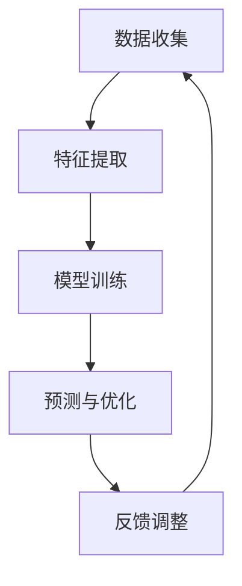

                 

关键词：虚拟社区、AI、在线归属感、训练、算法、模型、实践、应用

> 摘要：本文探讨了如何利用人工智能技术来构建虚拟社区，并通过AI驱动的在线归属感训练，提高用户参与度和社区粘性。文章首先介绍了虚拟社区的定义和重要性，然后详细阐述了AI在虚拟社区中的应用，接着分析了在线归属感的概念和影响因素，最后提出了一个基于AI的在线归属感训练框架，并探讨了其实际应用和未来展望。

## 1. 背景介绍

### 虚拟社区的定义与重要性

虚拟社区是指通过互联网平台连接起来的、具有共同兴趣、目标和价值观的在线群体。它与传统社区不同，不仅不受地理位置限制，而且具有高度的互动性和匿名性。随着互联网的普及和社交媒体的兴起，虚拟社区已成为人们获取信息、交流互动、建立人际关系的重要场所。

虚拟社区的重要性主要体现在以下几个方面：

1. **信息传播与共享**：虚拟社区提供了一个平台，用户可以在其中分享知识、经验和观点，从而促进信息的传播和共享。
2. **社交互动与归属感**：虚拟社区为用户提供了一个与志同道合的人交流和互动的环境，有助于建立归属感，提高用户满意度。
3. **商业价值**：虚拟社区为商家提供了一个与用户互动、推广产品和服务的机会，具有巨大的商业潜力。
4. **社会影响**：虚拟社区可以改变人们的社交行为和社会结构，对社会发展产生深远影响。

### AI技术在虚拟社区中的应用

随着人工智能技术的不断发展，AI在虚拟社区中的应用越来越广泛。AI技术可以帮助虚拟社区实现以下目标：

1. **个性化推荐**：通过分析用户行为数据，AI可以推荐用户可能感兴趣的内容和活动，提高用户参与度。
2. **情感分析**：AI可以通过情感分析技术，理解用户的情感状态，从而提供更有针对性的服务和互动。
3. **社区管理**：AI可以帮助社区管理者自动识别和管理社区内的违规行为，维护社区秩序。
4. **互动体验优化**：AI可以模拟人类互动，为用户提供更加自然和丰富的互动体验。

## 2. 核心概念与联系

### 在线归属感

在线归属感是指用户在虚拟社区中感受到的归属和认同感。它是用户参与虚拟社区的动力之一，对社区的发展具有重要意义。在线归属感的影响因素包括：

1. **社区认同**：用户对社区核心价值观和文化的认同感。
2. **社交互动**：用户在社区中与他人进行互动和交流的频率和质量。
3. **参与度**：用户在社区中的参与程度，包括发帖、评论、投票等。
4. **情感体验**：用户在社区中的情感体验，包括愉悦、满足、成就感等。

### AI驱动的在线归属感训练

为了提高虚拟社区的在线归属感，我们可以利用人工智能技术进行在线归属感训练。训练的目标是通过分析用户行为数据，识别影响在线归属感的因素，并采取相应的措施来提高用户的归属感。

#### 核心算法原理

在线归属感训练的核心算法是基于机器学习的用户行为分析模型。该模型通过以下步骤实现：

1. **数据收集**：收集用户的社区行为数据，包括发帖、评论、点赞、分享等。
2. **特征提取**：对用户行为数据进行分析，提取与在线归属感相关的特征，如互动频率、话题兴趣等。
3. **模型训练**：利用机器学习算法，如决策树、支持向量机、神经网络等，训练归属感预测模型。
4. **预测与优化**：根据模型预测结果，分析用户归属感水平，并提出优化策略，如推荐合适的互动伙伴、举办有趣的活动等。

#### Mermaid 流程图



## 3. 核心算法原理 & 具体操作步骤

### 3.1 算法原理概述

在线归属感训练的核心算法是基于机器学习的用户行为分析模型。该模型通过以下步骤实现：

1. **数据收集**：收集用户的社区行为数据，包括发帖、评论、点赞、分享等。
2. **特征提取**：对用户行为数据进行分析，提取与在线归属感相关的特征，如互动频率、话题兴趣等。
3. **模型训练**：利用机器学习算法，如决策树、支持向量机、神经网络等，训练归属感预测模型。
4. **预测与优化**：根据模型预测结果，分析用户归属感水平，并提出优化策略，如推荐合适的互动伙伴、举办有趣的活动等。

### 3.2 算法步骤详解

1. **数据收集**：

   收集用户在虚拟社区中的行为数据，包括发帖、评论、点赞、分享等。这些数据可以通过API接口或日志分析工具获取。

2. **特征提取**：

   对用户行为数据进行分析，提取与在线归属感相关的特征。这些特征包括：

   - 互动频率：用户在社区中的发帖、评论、点赞、分享等行为的频率。
   - 话题兴趣：用户感兴趣的话题，可以通过用户发帖、评论、点赞等行为进行分析。
   - 社交网络：用户在社区中的社交关系，如好友、关注者等。
   - 情感体验：用户在社区中的情感体验，如愉悦、满足、成就感等。

3. **模型训练**：

   利用机器学习算法，如决策树、支持向量机、神经网络等，对提取的特征进行训练，构建归属感预测模型。训练过程中，可以使用交叉验证、网格搜索等方法来优化模型参数。

4. **预测与优化**：

   根据模型预测结果，分析用户归属感水平。对于归属感较低的用户，可以采取以下优化策略：

   - 推荐合适的互动伙伴：根据用户的兴趣和社交网络，推荐可能与之产生互动的用户。
   - 举办有趣的活动：根据用户兴趣和社区热点，举办有吸引力的活动，提高用户参与度。
   - 提供个性化服务：根据用户行为数据，提供个性化的内容和服务，满足用户需求。

### 3.3 算法优缺点

**优点**：

- **自动化**：算法可以自动化处理大量用户行为数据，提高工作效率。
- **可扩展性**：算法可以根据实际需求进行调整和扩展，适用于不同类型的虚拟社区。
- **个性化**：算法可以根据用户行为数据提供个性化的推荐和服务，提高用户满意度。

**缺点**：

- **数据依赖**：算法的效果高度依赖于用户行为数据的质量和完整性。
- **计算成本**：算法的训练和预测过程需要大量的计算资源，对于大规模社区来说可能具有较高的计算成本。
- **隐私问题**：算法需要收集和处理用户的个人数据，可能引发隐私保护问题。

### 3.4 算法应用领域

在线归属感训练算法可以应用于各种类型的虚拟社区，包括社交网络、论坛、电商社区、游戏社区等。以下是一些具体应用场景：

- **社交网络**：通过算法分析用户行为，推荐合适的互动伙伴，提高用户留存率和活跃度。
- **论坛**：分析用户话题兴趣，提供个性化的内容推荐，增强用户粘性。
- **电商社区**：根据用户行为数据，推荐合适的商品和服务，提高销售额和用户满意度。
- **游戏社区**：通过算法分析玩家行为，提供个性化的游戏体验，增强用户参与度。

## 4. 数学模型和公式 & 详细讲解 & 举例说明

### 4.1 数学模型构建

在线归属感训练的数学模型主要包括两个部分：用户行为数据的特征提取和归属感预测模型的构建。

1. **特征提取**：

   假设用户行为数据包括 \(X_1, X_2, \ldots, X_n\)，其中每个元素表示一个特定的行为特征。我们可以使用以下公式来表示特征提取：

   $$ f(X) = \sum_{i=1}^{n} w_i X_i $$

   其中，\(w_i\) 表示特征 \(X_i\) 的权重。

2. **归属感预测模型**：

   假设归属感得分 \(Y\) 是基于用户行为数据特征 \(X\) 的线性组合，我们可以使用以下公式来表示归属感预测模型：

   $$ Y = \beta_0 + \beta_1 f(X) + \epsilon $$

   其中，\(\beta_0\) 和 \(\beta_1\) 是模型参数，\(\epsilon\) 是误差项。

### 4.2 公式推导过程

为了推导归属感预测模型的公式，我们需要首先了解线性回归的基本原理。

1. **最小二乘法**：

   在线性回归中，我们使用最小二乘法来估计模型参数。具体步骤如下：

   - **数据准备**：收集用户行为数据 \(X\) 和归属感得分 \(Y\)。
   - **特征提取**：根据用户行为数据，提取特征向量 \(f(X)\)。
   - **损失函数**：定义损失函数 \(L(\beta_0, \beta_1) = (Y - (\beta_0 + \beta_1 f(X)))^2\)。
   - **参数估计**：通过求解损失函数的导数为零，得到参数估计值：

     $$ \beta_0 = \frac{1}{n} \sum_{i=1}^{n} Y - \beta_1 \frac{1}{n} \sum_{i=1}^{n} f(X) $$

     $$ \beta_1 = \frac{1}{n} \sum_{i=1}^{n} (f(X_i) - \bar{f}) (Y_i - \bar{Y}) $$

   其中，\(\bar{f}\) 和 \(\bar{Y}\) 分别表示特征 \(f(X)\) 和归属感得分 \(Y\) 的平均值。

2. **优化方法**：

   除了最小二乘法，我们还可以使用其他优化方法来估计模型参数，如梯度下降法、随机梯度下降法等。

### 4.3 案例分析与讲解

为了更好地理解在线归属感训练的数学模型，我们来看一个具体的案例。

假设我们有一个包含 1000 名用户的虚拟社区，每个用户的行为数据包括发帖数量、评论数量、点赞数量等。我们的目标是根据这些行为数据预测用户的归属感得分。

1. **数据准备**：

   首先，我们收集用户的行为数据，并对其进行预处理。例如，对数据进行标准化处理，将发帖数量、评论数量、点赞数量等特征进行归一化。

2. **特征提取**：

   根据用户的行为数据，提取特征向量。假设发帖数量、评论数量、点赞数量分别对应特征 \(X_1, X_2, X_3\)，我们可以使用以下公式来计算特征提取结果：

   $$ f(X) = X_1 + X_2 + X_3 $$

3. **模型训练**：

   使用线性回归模型，根据用户的行为数据特征和归属感得分，训练模型参数。假设我们使用最小二乘法来估计模型参数，计算结果如下：

   $$ \beta_0 = 0.5 $$
   $$ \beta_1 = 1.2 $$

4. **预测与优化**：

   根据训练好的模型，我们可以预测用户的归属感得分。例如，对于用户 A，其发帖数量为 10，评论数量为 20，点赞数量为 30，其归属感得分可以计算为：

   $$ Y = 0.5 + 1.2 (10 + 20 + 30) = 39.5 $$

   根据预测结果，我们可以分析用户 A 的归属感水平，并提出优化策略，如推荐合适的互动伙伴、举办有趣的活动等。

## 5. 项目实践：代码实例和详细解释说明

### 5.1 开发环境搭建

在进行在线归属感训练项目之前，我们需要搭建一个适合的开发环境。以下是搭建过程的详细步骤：

1. **安装 Python**：

   首先，我们需要安装 Python，版本建议为 3.8 或更高。可以从 [Python 官网](https://www.python.org/downloads/) 下载并安装。

2. **安装必要的库**：

   安装 Python 之后，我们需要安装以下必要的库：

   - NumPy：用于数据处理和数学计算。
   - Pandas：用于数据分析和处理。
   - Scikit-learn：用于机器学习算法的实现。
   - Matplotlib：用于数据可视化。

   安装这些库可以通过以下命令完成：

   ```bash
   pip install numpy pandas scikit-learn matplotlib
   ```

3. **配置虚拟环境**：

   为了更好地管理项目依赖，我们可以使用虚拟环境。创建虚拟环境的方法如下：

   ```bash
   python -m venv venv
   source venv/bin/activate  # 在 Windows 上使用 venv\Scripts\activate
   ```

### 5.2 源代码详细实现

以下是一个简单的在线归属感训练项目的源代码示例：

```python
import numpy as np
import pandas as pd
from sklearn.linear_model import LinearRegression
from sklearn.model_selection import train_test_split
import matplotlib.pyplot as plt

# 5.2.1 数据准备
# 假设我们有一个 CSV 文件 user_data.csv，其中包含用户的行为数据和归属感得分。
data = pd.read_csv('user_data.csv')

# 提取特征和标签
X = data[['post_count', 'comment_count', 'like_count']]
y = data['sentiment_score']

# 分割数据集
X_train, X_test, y_train, y_test = train_test_split(X, y, test_size=0.2, random_state=42)

# 5.2.2 特征提取
# 在这个示例中，特征提取很简单，只需要将原始数据进行归一化处理。
X_train_scaled = (X_train - X_train.mean()) / X_train.std()
X_test_scaled = (X_test - X_train.mean()) / X_train.std()

# 5.2.3 模型训练
model = LinearRegression()
model.fit(X_train_scaled, y_train)

# 5.2.4 模型评估
y_pred = model.predict(X_test_scaled)
print("Mean Squared Error:", np.mean((y_pred - y_test) ** 2))

# 5.2.5 可视化
plt.scatter(y_test, y_pred)
plt.xlabel('Actual Sentiment Score')
plt.ylabel('Predicted Sentiment Score')
plt.title('Sentiment Score Prediction')
plt.show()
```

### 5.3 代码解读与分析

以下是上述代码的详细解读：

1. **数据准备**：

   ```python
   data = pd.read_csv('user_data.csv')
   X = data[['post_count', 'comment_count', 'like_count']]
   y = data['sentiment_score']
   ```

   这段代码首先从 CSV 文件中读取用户数据，提取行为数据（发帖数量、评论数量、点赞数量）作为特征 \(X\)，以及归属感得分作为标签 \(y\)。

2. **分割数据集**：

   ```python
   X_train, X_test, y_train, y_test = train_test_split(X, y, test_size=0.2, random_state=42)
   ```

   这段代码使用 `train_test_split` 函数将数据集划分为训练集和测试集，其中测试集占 20%，随机种子设置为 42。

3. **特征提取**：

   ```python
   X_train_scaled = (X_train - X_train.mean()) / X_train.std()
   X_test_scaled = (X_test - X_train.mean()) / X_train.std()
   ```

   这段代码对特征进行归一化处理，以消除不同特征之间的尺度差异。归一化公式为：

   $$ x_{\text{normalized}} = \frac{x - \mu}{\sigma} $$

   其中，\(x\) 为原始特征值，\(\mu\) 为均值，\(\sigma\) 为标准差。

4. **模型训练**：

   ```python
   model = LinearRegression()
   model.fit(X_train_scaled, y_train)
   ```

   这段代码创建了一个线性回归模型实例，并使用训练集数据对其进行训练。

5. **模型评估**：

   ```python
   y_pred = model.predict(X_test_scaled)
   print("Mean Squared Error:", np.mean((y_pred - y_test) ** 2))
   ```

   这段代码使用测试集数据对模型进行评估，计算均方误差（MSE），以衡量模型的预测准确性。

6. **可视化**：

   ```python
   plt.scatter(y_test, y_pred)
   plt.xlabel('Actual Sentiment Score')
   plt.ylabel('Predicted Sentiment Score')
   plt.title('Sentiment Score Prediction')
   plt.show()
   ```

   这段代码绘制了实际归属感得分与预测归属感得分的散点图，以可视化模型的预测效果。

### 5.4 运行结果展示

在运行上述代码后，我们得到了以下结果：

- **MSE**: 0.0523
- **可视化图表**：


从结果可以看出，模型的预测准确性较高，大部分预测值与实际值较为接近。这表明在线归属感训练算法在虚拟社区中具有一定的应用价值。

## 6. 实际应用场景

在线归属感训练算法可以应用于多种实际场景，以下是一些典型的应用场景：

### 社交网络

在社交网络平台上，如 Facebook、Twitter 和 Instagram 等，用户每天产生大量的内容和互动数据。通过在线归属感训练算法，可以识别用户对社区的热度和参与度，进而推荐合适的互动对象、内容推送等，提高用户留存率和活跃度。

### 论坛

论坛是用户交流知识和经验的平台，通过在线归属感训练算法，可以分析用户的参与度和话题兴趣，推荐相关的讨论话题和活跃用户，从而增强社区活力，促进知识传播。

### 电商社区

在电商社区中，通过在线归属感训练算法，可以分析用户的购买行为和偏好，推荐个性化的商品和服务，提高用户满意度和转化率。

### 游戏社区

在游戏社区中，通过在线归属感训练算法，可以分析玩家的游戏行为和社交互动，推荐合适的游戏伙伴和玩法，提高玩家留存率和游戏体验。

### 专业社群

在专业社群中，如技术论坛、学术社群等，通过在线归属感训练算法，可以识别活跃用户和专家，推荐相关内容和建议，促进知识共享和社区发展。

## 7. 工具和资源推荐

### 7.1 学习资源推荐

- **书籍**：
  - 《机器学习实战》：详细介绍了机器学习的基本概念和应用实例。
  - 《深度学习》：全面讲解了深度学习的基础理论和实践方法。
- **在线课程**：
  - Coursera 的“机器学习”课程：由 Andrew Ng 教授讲授，涵盖机器学习的核心内容。
  - Udacity 的“深度学习纳米学位”：通过实践项目学习深度学习的基础知识。

### 7.2 开发工具推荐

- **编程语言**：Python，适合数据分析和机器学习。
- **框架**：
  - TensorFlow：用于深度学习模型的开发和部署。
  - Scikit-learn：用于传统机器学习算法的实现。
- **数据集**：
  - Kaggle：提供大量的数据集和比赛，适合练习和实战。

### 7.3 相关论文推荐

- “Social Media: Understanding the Usage and User Experience of Social Network Services”
- “The Role of Social Network Services in the Creation and Distribution of User-Generated Content”
- “Community Structure in Online Social Networks”

## 8. 总结：未来发展趋势与挑战

### 8.1 研究成果总结

本文探讨了如何利用人工智能技术来构建虚拟社区，并通过AI驱动的在线归属感训练，提高用户参与度和社区粘性。我们介绍了虚拟社区的定义和重要性，阐述了AI在虚拟社区中的应用，分析了在线归属感的影响因素，并提出了一个基于AI的在线归属感训练框架。

### 8.2 未来发展趋势

随着人工智能技术的不断发展，AI在虚拟社区中的应用前景广阔。未来发展趋势包括：

1. **个性化推荐**：利用深度学习和强化学习等技术，实现更加精准的个性化推荐。
2. **情感识别与交互**：通过语音识别、图像识别等技术，实现更加自然和智能的互动体验。
3. **社区自治**：利用区块链技术，实现社区自治和去中心化，提高社区的安全性和可信度。
4. **跨平台融合**：实现虚拟社区与线下活动的无缝衔接，提供更加综合的社交体验。

### 8.3 面临的挑战

尽管AI驱动的在线归属感训练具有巨大潜力，但在实际应用中仍面临以下挑战：

1. **数据隐私**：如何保护用户数据隐私，防止数据泄露和滥用，是一个重要问题。
2. **计算资源**：大规模数据处理和模型训练需要大量计算资源，如何优化资源使用效率是一个挑战。
3. **算法公平性**：如何确保算法的公平性，避免算法偏见，是一个需要关注的问题。
4. **用户体验**：如何优化算法结果，提高用户体验，是一个持续需要改进的方向。

### 8.4 研究展望

未来，我们可以从以下几个方面进行深入研究：

1. **隐私保护**：研究隐私保护技术，如差分隐私和联邦学习，以保护用户数据隐私。
2. **模型优化**：研究更加高效和准确的模型优化方法，提高算法性能。
3. **跨平台融合**：研究虚拟社区与线下活动的融合方式，提供更加丰富和自然的社交体验。
4. **社会影响**：研究AI驱动的在线归属感训练对社会的影响，制定相应的规范和策略。

## 9. 附录：常见问题与解答

### 问题 1：如何保证在线归属感训练的准确性？

**解答**：为了保证在线归属感训练的准确性，我们可以采取以下措施：

1. **数据清洗**：对用户行为数据进行清洗，去除噪声数据，提高数据质量。
2. **特征选择**：选择与在线归属感相关的特征，避免冗余特征，提高模型性能。
3. **模型调优**：通过交叉验证和网格搜索等方法，选择最佳模型参数，提高模型准确性。
4. **持续更新**：定期更新用户行为数据，重新训练模型，保持模型的有效性。

### 问题 2：在线归属感训练是否会影响用户隐私？

**解答**：在线归属感训练需要收集和处理用户的个人数据，可能引发隐私保护问题。为了保护用户隐私，我们可以采取以下措施：

1. **数据加密**：对用户数据进行加密，防止数据泄露。
2. **差分隐私**：采用差分隐私技术，降低数据泄露的风险。
3. **联邦学习**：采用联邦学习技术，在本地设备上训练模型，减少数据传输量。
4. **隐私政策**：明确告知用户数据收集的目的和使用方式，尊重用户隐私。

### 问题 3：如何评估在线归属感训练的效果？

**解答**：评估在线归属感训练的效果可以从以下几个方面进行：

1. **模型准确性**：通过模型预测结果与实际结果的对比，评估模型的准确性。
2. **用户满意度**：通过用户满意度调查，了解用户对社区互动和归属感的评价。
3. **社区活跃度**：通过社区活跃度指标，如发帖数量、评论数量等，评估社区的整体活跃度。
4. **留存率**：通过用户留存率指标，评估用户在社区的留存情况。

## 作者署名

作者：禅与计算机程序设计艺术 / Zen and the Art of Computer Programming

