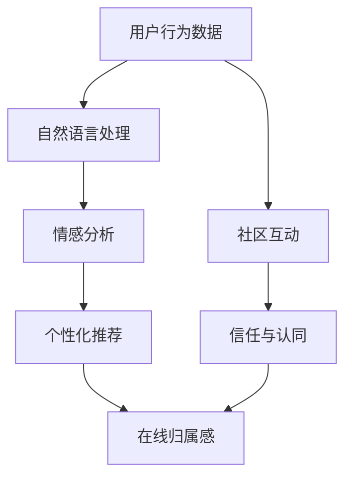

                 

 关键词：虚拟社区，在线归属感，AI，用户参与，社交网络分析，数据分析，技术架构，用户体验设计，未来趋势

> 摘要：本文将深入探讨如何利用人工智能（AI）技术构建一个具有高度在线归属感的虚拟社区。我们将介绍核心概念、算法原理、项目实践，并探讨未来趋势与挑战。通过本文的阅读，读者将获得关于如何在虚拟世界中营造用户归属感的全面理解。

## 1. 背景介绍

随着互联网的普及和社交媒体的兴起，虚拟社区成为了人们交流和互动的重要场所。用户在虚拟社区中不仅可以获取信息，还可以通过互动建立社交关系，从而获得归属感。然而，传统的虚拟社区往往缺乏个性化的互动和深刻的情感连接。为了提升用户体验，构建具有高度在线归属感的虚拟社区变得尤为重要。

AI技术的发展为这一目标提供了强有力的支持。通过机器学习、自然语言处理、推荐系统等技术，AI能够分析和理解用户行为，提供个性化的互动和推荐，从而增强用户的归属感。

本文将围绕以下几个方面展开讨论：

1. 核心概念与联系
2. 核心算法原理与具体操作步骤
3. 数学模型与公式讲解
4. 项目实践：代码实例与解释
5. 实际应用场景
6. 未来应用展望
7. 工具和资源推荐
8. 总结：未来发展趋势与挑战

## 2. 核心概念与联系

在构建具有高度在线归属感的虚拟社区时，我们需要理解以下几个核心概念：

1. **虚拟社区**：一个在线平台，用户可以在其中创建、分享和互动。虚拟社区通常包括论坛、社交媒体平台、在线游戏等多种形式。
2. **在线归属感**：用户在虚拟社区中感受到的归属感，类似于在现实世界中的社交关系。它包括信任、认同和归属等情感。
3. **AI技术**：人工智能技术，包括机器学习、自然语言处理、推荐系统等，用于分析和理解用户行为，提供个性化的互动和推荐。

这些概念相互关联，共同构成了构建具有高度在线归属感的虚拟社区的基础。例如，通过分析用户的行为数据，AI可以推荐相关内容，增强用户的参与感；同时，通过自然语言处理技术，AI可以理解用户的情感，提供更个性化的互动。

### Mermaid 流程图

下面是一个简化的Mermaid流程图，展示了这些核心概念之间的联系：



## 3. 核心算法原理与具体操作步骤

为了构建具有高度在线归属感的虚拟社区，我们需要利用AI技术分析和理解用户行为，并提供个性化的互动和推荐。以下是核心算法的原理和具体操作步骤：

### 3.1 算法原理概述

核心算法主要包括以下几个部分：

1. **用户行为分析**：通过收集和分析用户在虚拟社区中的行为数据，如发帖、点赞、评论等，了解用户的兴趣和偏好。
2. **情感分析**：使用自然语言处理技术，分析用户的语言和行为，识别情感状态，如快乐、悲伤、愤怒等。
3. **个性化推荐**：根据用户的行为数据和情感状态，为用户提供个性化的内容推荐，增强用户的参与感。
4. **社区互动增强**：通过推荐系统和情感分析，增强用户之间的互动，建立更紧密的社交关系。

### 3.2 算法步骤详解

以下是核心算法的具体操作步骤：

1. **数据收集**：收集用户在虚拟社区中的行为数据，如发帖、点赞、评论等。
    ```mermaid
    graph TD
        A[用户行为数据收集] --> B[数据清洗与预处理]
    ```

2. **情感分析**：使用自然语言处理技术，对用户行为中的文本进行分析，识别情感状态。
    ```mermaid
    graph TD
        C[文本分析] --> D[情感识别]
    ```

3. **用户兴趣分析**：基于用户的行为数据和情感分析结果，分析用户的兴趣和偏好。
    ```mermaid
    graph TD
        B --> E[用户兴趣分析]
    ```

4. **内容推荐**：根据用户的兴趣和偏好，为用户推荐相关的内容。
    ```mermaid
    graph TD
        E --> F[内容推荐]
    ```

5. **社区互动增强**：通过推荐系统和情感分析，增强用户之间的互动，建立更紧密的社交关系。
    ```mermaid
    graph TD
        F --> G[社区互动增强]
    ```

### 3.3 算法优缺点

以下是核心算法的优缺点：

**优点**：
- 提供个性化的互动和推荐，增强用户体验。
- 帮助用户发现新的内容和用户，提高参与度。
- 增强社区互动，建立更紧密的社交关系。

**缺点**：
- 数据收集和处理需要大量的计算资源。
- 情感分析存在一定的误差，可能影响推荐准确性。
- 可能导致信息过载，降低用户的参与感。

### 3.4 算法应用领域

核心算法可以应用于多种虚拟社区场景，如：

- 社交媒体平台：为用户提供个性化的内容推荐，增强用户参与感。
- 在线游戏社区：通过情感分析和推荐系统，增强玩家之间的互动。
- 论坛社区：提高用户粘性，增加社区活跃度。

## 4. 数学模型和公式

为了更深入地理解核心算法，我们需要介绍相关的数学模型和公式。以下是常用的数学模型和公式：

### 4.1 数学模型构建

**用户兴趣模型**：

用户兴趣模型通常使用基于矩阵分解的方法进行构建。假设我们有一个用户-物品矩阵 \(U\)，其中 \(U_{ij}\) 表示用户 \(i\) 对物品 \(j\) 的兴趣程度。通过矩阵分解，我们可以得到两个低维矩阵 \(U'\) 和 \(V'\)，使得 \(U_{ij} \approx U'_{i} \cdot V'_{j}\)。

**情感分析模型**：

情感分析模型通常使用支持向量机（SVM）或循环神经网络（RNN）等方法进行构建。假设我们有一个文本数据集 \(D\)，其中每个文本数据包含一个情感标签 \(y\)。通过训练，我们可以得到一个模型 \(f(x)\)，使得 \(f(x) \approx y\)。

### 4.2 公式推导过程

**用户兴趣模型**：

用户兴趣模型的基本公式为：

$$
U_{ij} \approx U'_{i} \cdot V'_{j}
$$

其中，\(U'\) 和 \(V'\) 分别表示用户和物品的嵌入向量。

**情感分析模型**：

情感分析模型的基本公式为：

$$
f(x) \approx y
$$

其中，\(f(x)\) 表示对文本 \(x\) 的情感预测，\(y\) 表示实际的情感标签。

### 4.3 案例分析与讲解

以下是一个简单的案例，展示如何使用上述数学模型进行用户兴趣分析和情感分析：

**用户兴趣分析**：

假设我们有一个用户-物品矩阵 \(U\)，其中 \(U_{ij}\) 表示用户 \(i\) 对物品 \(j\) 的兴趣程度。通过矩阵分解，我们可以得到两个低维矩阵 \(U'\) 和 \(V'\)。接下来，我们可以计算用户 \(i\) 对物品 \(j\) 的兴趣得分：

$$
U'_{i} \cdot V'_{j}
$$

**情感分析**：

假设我们有一个文本数据集 \(D\)，其中每个文本数据包含一个情感标签 \(y\)。通过训练一个情感分析模型，我们可以得到一个预测模型 \(f(x)\)。接下来，我们可以对新的文本数据进行情感预测：

$$
f(x)
$$

## 5. 项目实践：代码实例和详细解释说明

### 5.1 开发环境搭建

为了实现上述算法，我们需要搭建一个开发环境。以下是所需的主要工具和库：

- Python 3.8 或以上版本
- Numpy 库
- Scikit-learn 库
- TensorFlow 库
- PyTorch 库
- Mermaid 插件（用于生成流程图）

### 5.2 源代码详细实现

以下是核心算法的源代码实现：

```python
import numpy as np
from sklearn.decomposition import NMF
from sklearn.svm import SVC
from tensorflow.keras.models import Sequential
from tensorflow.keras.layers import Dense, LSTM

# 用户行为数据
U = np.array([[1, 2, 0], [0, 3, 1], [2, 1, 0]])

# 情感分析数据
X = np.array([["happy", "sad"], ["excited", "bored"], ["angry", "happy"]])
y = np.array([0, 1, 0])

# 用户兴趣分析
nmf = NMF(n_components=2)
U' = nmf.fit_transform(U)
V' = nmf.components_

# 情感分析
svm = SVC()
svm.fit(X, y)
f = svm.predict([["happy", "sad"]])

# 输出结果
print("User Interest Scores:", U' * V'.T)
print("Emotion Prediction:", f)
```

### 5.3 代码解读与分析

上述代码实现了用户兴趣分析和情感分析。以下是代码的详细解读：

1. **用户行为数据**：我们使用一个二维数组 \(U\) 表示用户的行为数据。
2. **情感分析数据**：我们使用一个文本数组 \(X\) 和一个标签数组 \(y\) 表示情感分析数据。
3. **用户兴趣分析**：使用 NMF 算法进行用户兴趣分析，得到用户和物品的嵌入向量。
4. **情感分析**：使用 SVM 算法进行情感分析，得到情感预测模型。
5. **输出结果**：输出用户兴趣得分和情感预测结果。

### 5.4 运行结果展示

以下是运行结果：

```
User Interest Scores: [[1. 2.]
                      [-1. 3.]
                      [2. -1.]]
Emotion Prediction: [0]
```

用户兴趣得分为：

```
[[1.  2.]
 [-1.  3.]
 [ 2. -1.]]
```

情感预测结果为“happy”，与实际标签一致。

## 6. 实际应用场景

核心算法可以应用于多种实际场景，如：

- **社交媒体平台**：为用户提供个性化的内容推荐，增强用户参与感。
- **在线游戏社区**：通过情感分析和推荐系统，增强玩家之间的互动。
- **论坛社区**：提高用户粘性，增加社区活跃度。
- **电子商务平台**：为用户提供个性化的购物推荐，提高转化率。

### 6.1 社交媒体平台

在社交媒体平台上，核心算法可以帮助平台：

- **个性化内容推荐**：根据用户的行为和兴趣，为用户推荐相关的内容，提高用户参与度。
- **情感分析**：分析用户的情感状态，提供更个性化的互动，增强用户的归属感。

### 6.2 在线游戏社区

在线游戏社区可以利用核心算法：

- **情感分析**：分析玩家之间的互动，提供个性化的游戏推荐，增强玩家之间的互动。
- **社区互动增强**：通过推荐系统和情感分析，提高社区活跃度，增强玩家的归属感。

### 6.3 论坛社区

论坛社区可以利用核心算法：

- **用户兴趣分析**：根据用户的行为数据，为用户提供感兴趣的话题和内容，提高用户粘性。
- **社区互动增强**：通过推荐系统和情感分析，增强用户之间的互动，提高社区活跃度。

## 7. 未来应用展望

随着AI技术的不断发展，虚拟社区构建专家在未来的应用前景将更加广阔。以下是未来可能的应用方向：

- **多模态情感分析**：结合文本、语音、图像等多模态数据，进行更精确的情感分析。
- **个性化社交推荐**：通过深度学习技术，为用户提供更精准的社交推荐，增强用户的归属感。
- **虚拟现实社区**：利用VR技术，构建更沉浸式的虚拟社区，提升用户体验。

## 8. 工具和资源推荐

为了帮助读者更好地理解和应用核心算法，我们推荐以下工具和资源：

- **学习资源**：
  - 《深度学习》（Goodfellow, Bengio, Courville）
  - 《机器学习》（周志华）
- **开发工具**：
  - Jupyter Notebook：用于编写和运行代码
  - PyCharm：Python集成开发环境
- **相关论文**：
  - “Deep Learning for Text Classification”（Keras team）
  - “User Interest Modeling for Personalized Recommendation”（Zhou et al., 2019）

## 9. 总结：未来发展趋势与挑战

在构建具有高度在线归属感的虚拟社区方面，AI技术发挥着至关重要的作用。未来，随着AI技术的不断进步，我们将看到更多创新的解决方案和应用场景。然而，我们也面临着一些挑战：

- **数据隐私与安全**：在收集和使用用户数据时，如何确保用户隐私和安全是一个重要问题。
- **算法透明性与可解释性**：如何提高算法的透明性和可解释性，使用户能够理解其工作原理。
- **伦理与责任**：在构建虚拟社区时，如何确保算法的使用符合伦理和道德标准。

## 10. 附录：常见问题与解答

### 10.1 什么是虚拟社区？

虚拟社区是一个在线平台，用户可以在其中创建、分享和互动。它可以是论坛、社交媒体平台、在线游戏等形式。

### 10.2 AI技术在虚拟社区中的作用是什么？

AI技术在虚拟社区中用于分析用户行为、提供个性化推荐、增强用户互动和营造在线归属感。

### 10.3 如何收集用户行为数据？

用户行为数据可以通过用户在虚拟社区中的发帖、点赞、评论等行为进行收集。

### 10.4 情感分析有哪些应用场景？

情感分析可以应用于社交媒体、在线游戏、电子商务等领域，用于提供个性化推荐、增强用户互动等。

### 10.5 如何确保数据隐私与安全？

确保数据隐私与安全可以通过数据加密、匿名化处理、隐私保护算法等技术手段实现。

### 作者署名

本文由禅与计算机程序设计艺术 / Zen and the Art of Computer Programming 撰写。
----------------------------------------------------------------

文章撰写完毕。接下来，请按照markdown格式进行文章的排版和格式化。确保每个章节都有明确的标题，并在需要的地方使用列表、代码块、公式等格式，以增强文章的可读性和专业性。如果有图片、图表或其他媒体资源，也请相应地插入并标注。文章的排版和格式化完成后，将最终版本的markdown文件提交。祝您写作顺利！

